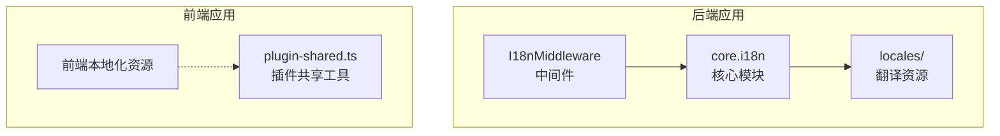
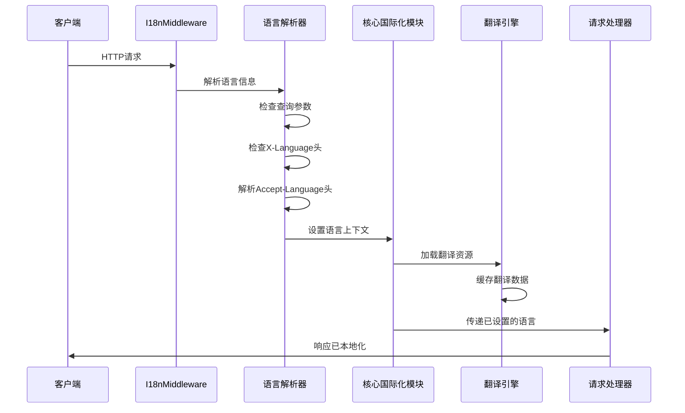
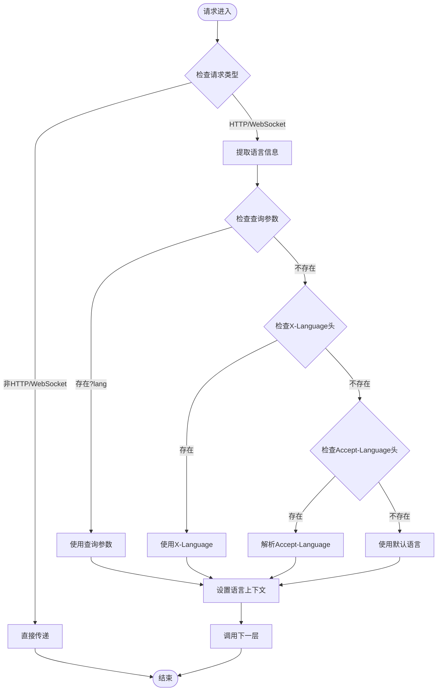
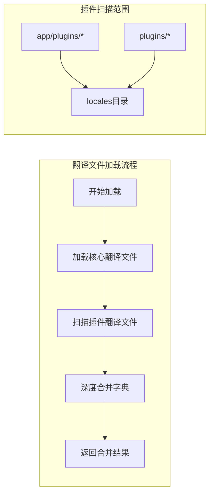
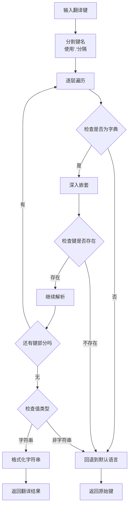
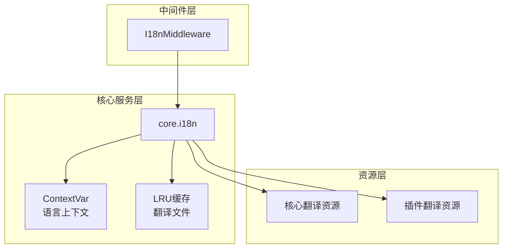
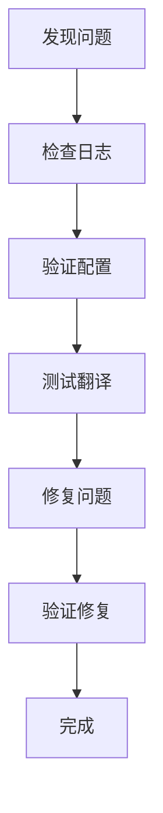

# 国际化中间件

<cite>
**本文档引用的文件**
- [backend/app/middleware/i18n.py](file://backend/app/middleware/i18n.py)
- [backend/app/core/i18n.py](file://backend/app/core/i18n.py)
- [backend/app/locales/zh_CN/messages.json](file://backend/app/locales/zh_CN/messages.json)
- [backend/app/locales/en/messages.json](file://backend/app/locales/en/messages.json)
- [backend/app/locales/zh_CN/menu.json](file://backend/app/locales/zh_CN/menu.json)
- [backend/app/locales/en/menu.json](file://backend/app/locales/en/menu.json)
- [backend/app/plugins/frontend_contract_checks.py](file://backend/app/plugins/frontend_contract_checks.py)
- [backend/app/plugins/loader.py](file://backend/app/plugins/loader.py)
- [backend/scripts/plugin_cli_validate.py](file://backend/scripts/plugin_cli_validate.py)
- [backend/scripts/plugin_cli_templates.py](file://backend/scripts/plugin_cli_templates.py)
- [backend/app/codegen/generator_output_assembler.py](file://backend/app/codegen/generator_output_assembler.py)
- [frontend/packages/locales/src/i18n.ts](file://frontend/packages/locales/src/i18n.ts)
- [frontend/apps/web-antd/src/utils/plugin-shared.ts](file://frontend/apps/web-antd/src/utils/plugin-shared.ts)
- [backend/tests/middleware/test_i18n_middleware.py](file://backend/tests/middleware/test_i18n_middleware.py)
</cite>

## 目录
1. [简介](#简介)
2. [项目结构](#项目结构)
3. [核心组件](#核心组件)
4. [架构概览](#架构概览)
5. [详细组件分析](#详细组件分析)
6. [依赖关系分析](#依赖关系分析)
7. [性能考虑](#性能考虑)
8. [故障排除指南](#故障排除指南)
9. [结论](#结论)
10. [附录](#附录)

## 简介
本文件为国际化中间件的全面技术文档，详细说明了系统如何处理多语言请求，包括语言检测、语言偏好设置和本地化资源的加载。文档还解释了国际化中间件与翻译系统的集成方式，包括翻译键的解析和动态翻译内容的生成。同时提供了支持的语言列表和语言代码规范，涵盖语言区域设置和日期时间格式化。最后包含国际化中间件的配置选项和自定义翻译提供者的实现方法，并提供多语言环境下的测试策略和翻译质量保证机制。

## 项目结构
国际化中间件位于后端应用的中间件层，核心逻辑集中在两个主要文件中：
- 中间件实现：`backend/app/middleware/i18n.py`
- 核心国际化模块：`backend/app/core/i18n.py`

国际化资源文件位于 `backend/app/locales/` 目录下，包含中文（简体）和英文两种语言的翻译文件。前端侧的国际化资源位于 `frontend/packages/locales/` 和 `frontend/apps/web-antd/src/utils/plugin-shared.ts`。

**图表来源**
- [backend/app/middleware/i18n.py:1-68](file://backend/app/middleware/i18n.py#L1-L68)
- [backend/app/core/i18n.py:1-290](file://backend/app/core/i18n.py#L1-L290)

**章节来源**
- [backend/app/middleware/i18n.py:1-68](file://backend/app/middleware/i18n.py#L1-L68)
- [backend/app/core/i18n.py:1-290](file://backend/app/core/i18n.py#L1-L290)

## 核心组件
国际化中间件系统由三个核心组件构成：

### 1. I18nMiddleware 中间件
这是一个纯 ASGI 实现的中间件，负责：
- 从请求中提取语言信息
- 设置当前请求的语言上下文
- 将语言设置传递给后续处理层

### 2. 核心国际化模块
提供完整的国际化功能：
- 翻译文件加载与缓存
- 翻译函数 `_()` 实现
- 语言上下文管理
- 语言检测和解析

### 3. 翻译资源系统
包含：
- 核心翻译文件（messages.json、menu.json）
- 插件翻译文件
- 前端本地化资源

**章节来源**
- [backend/app/middleware/i18n.py:13-68](file://backend/app/middleware/i18n.py#L13-L68)
- [backend/app/core/i18n.py:1-290](file://backend/app/core/i18n.py#L1-L290)

## 架构概览
国际化中间件采用分层架构设计，确保语言检测的准确性和翻译资源的有效加载。

**图表来源**
- [backend/app/middleware/i18n.py:31-41](file://backend/app/middleware/i18n.py#L31-L41)
- [backend/app/core/i18n.py:133-144](file://backend/app/core/i18n.py#L133-L144)

## 详细组件分析

### I18nMiddleware 中间件实现
中间件采用纯 ASGI 实现，确保异常处理器能够正常工作。其语言检测优先级如下：

**图表来源**
- [backend/app/middleware/i18n.py:43-67](file://backend/app/middleware/i18n.py#L43-L67)

#### 语言检测算法
中间件实现了完整的语言检测算法，支持多种输入源：

1. **查询参数优先**：`?lang=zh_CN`
2. **自定义头部**：`X-Language` 
3. **标准头部**：`Accept-Language`
4. **默认回退**：`DEFAULT_LOCALE`

**章节来源**
- [backend/app/middleware/i18n.py:13-68](file://backend/app/middleware/i18n.py#L13-L68)

### 核心国际化模块
核心模块提供了完整的国际化基础设施：

#### 支持的语言列表
系统当前支持以下语言：
- 中文（简体）：`zh_CN`
- 英语：`en`

#### 翻译文件加载机制
翻译文件采用深度合并策略，支持核心应用和插件的翻译资源合并：

**图表来源**
- [backend/app/core/i18n.py:74-116](file://backend/app/core/i18n.py#L74-L116)

#### 翻译键解析系统
翻译系统支持点号分隔的嵌套键解析：

**图表来源**
- [backend/app/core/i18n.py:189-212](file://backend/app/core/i18n.py#L189-L212)

**章节来源**
- [backend/app/core/i18n.py:25-28](file://backend/app/core/i18n.py#L25-L28)
- [backend/app/core/i18n.py:61-116](file://backend/app/core/i18n.py#L61-L116)
- [backend/app/core/i18n.py:161-212](file://backend/app/core/i18n.py#L161-L212)

### 翻译资源系统
系统采用 JSON 文件存储翻译内容，支持菜单和消息两类资源：

#### 资源文件结构
每个语言都有对应的资源目录：
- `backend/app/locales/zh_CN/` - 中文资源
- `backend/app/locales/en/` - 英文资源

每个目录包含：
- `messages.json` - 通用消息翻译
- `menu.json` - 菜单导航翻译

**章节来源**
- [backend/app/locales/zh_CN/messages.json](file://backend/app/locales/zh_CN/messages.json)
- [backend/app/locales/en/messages.json](file://backend/app/locales/en/messages.json)
- [backend/app/locales/zh_CN/menu.json](file://backend/app/locales/zh_CN/menu.json)
- [backend/app/locales/en/menu.json](file://backend/app/locales/en/menu.json)

## 依赖关系分析

### 组件依赖图

**图表来源**
- [backend/app/middleware/i18n.py:10](file://backend/app/middleware/i18n.py#L10)
- [backend/app/core/i18n.py:13-16](file://backend/app/core/i18n.py#L13-L16)

### 外部依赖关系
系统依赖于以下外部组件：
- **Starlette**：ASGI 应用框架
- **Python 标准库**：contextlib、json、pathlib、functools
- **前端 Vue i18n**：前端本地化支持

**章节来源**
- [backend/app/middleware/i18n.py:8](file://backend/app/middleware/i18n.py#L8)
- [backend/app/core/i18n.py:11-18](file://backend/app/core/i18n.py#L11-L18)

## 性能考虑
国际化中间件在设计时充分考虑了性能优化：

### 缓存策略
- **LRU 缓存**：翻译文件使用 `@lru_cache(maxsize=10)` 缓存
- **自动失效**：插件安装/卸载时自动清除缓存
- **内存控制**：限制缓存大小防止内存泄漏

### 加载优化
- **延迟加载**：仅在需要时加载翻译文件
- **增量更新**：支持运行时重新加载翻译
- **文件合并**：一次性加载并合并所有相关文件

### 并发安全
- **上下文变量**：使用 `ContextVar` 确保线程安全
- **不可变数据**：翻译字典加载后保持不变

## 故障排除指南

### 常见问题诊断
1. **语言检测失败**
   - 检查请求头格式是否正确
   - 验证语言代码是否在支持列表中
   - 确认查询参数格式

2. **翻译内容缺失**
   - 检查翻译键是否存在
   - 验证 JSON 文件格式
   - 确认文件编码为 UTF-8

3. **插件翻译未生效**
   - 检查插件 locales 目录结构
   - 验证语言文件命名规范
   - 确认插件已正确安装

### 调试工具
系统提供了多种调试和验证工具：

**章节来源**
- [backend/app/core/i18n.py:84-86](file://backend/app/core/i18n.py#L84-L86)
- [backend/app/core/i18n.py:109-114](file://backend/app/core/i18n.py#L109-L114)

## 结论
国际化中间件系统提供了完整的多语言支持解决方案，具有以下特点：

1. **灵活的语言检测**：支持多种输入源和优先级
2. **高效的资源管理**：采用缓存和延迟加载策略
3. **可扩展的架构**：支持插件化翻译资源
4. **完善的错误处理**：提供详细的日志和回退机制

该系统为多语言应用开发提供了坚实的基础，支持未来扩展新的语言和功能。

## 附录

### 支持的语言列表和代码规范
- **中文（简体）**：`zh_CN`
- **英语**：`en`

语言代码规范：
- 使用下划线分隔地区代码
- 支持语言前缀匹配
- 兼容常见的语言代码变体

### 配置选项
系统提供以下配置选项：
- `SUPPORTED_LOCALES`：支持的语言列表
- `DEFAULT_LOCALE`：默认语言代码
- `LOCALES_DIR`：翻译文件目录路径

### 自定义翻译提供者实现
要实现自定义翻译提供者，需要：

1. **继承基础接口**：实现翻译键解析和资源加载
2. **注册提供者**：通过配置系统注册新提供者
3. **处理缓存**：实现适当的缓存策略
4. **错误处理**：提供健壮的错误处理机制

### 测试策略
系统采用多层次的测试策略：

#### 单元测试
- 语言检测算法测试
- 翻译键解析测试
- 资源加载测试

#### 集成测试
- 中间件集成测试
- 插件国际化测试
- 前后端协作测试

#### 端到端测试
- 多语言场景测试
- 性能基准测试
- 回归测试

### 翻译质量保证机制
系统实施了多项质量保证措施：

1. **插件国际化合约检查**
2. **前端本地化前缀验证**
3. **翻译键命名规范**
4. **多语言一致性检查**

**章节来源**
- [backend/app/plugins/frontend_contract_checks.py:48-214](file://backend/app/plugins/frontend_contract_checks.py#L48-L214)
- [backend/scripts/plugin_cli_validate.py:66-82](file://backend/scripts/plugin_cli_validate.py#L66-L82)