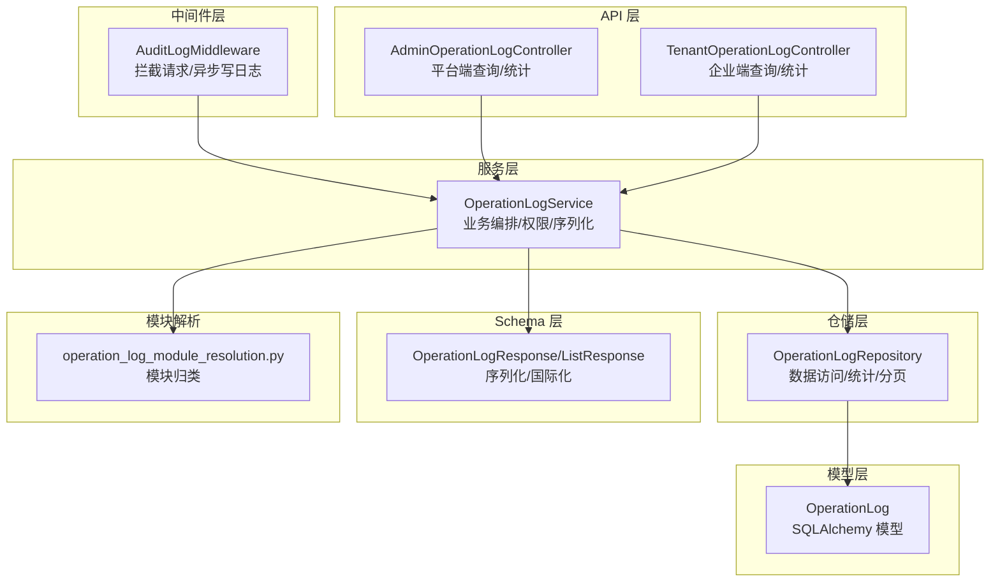
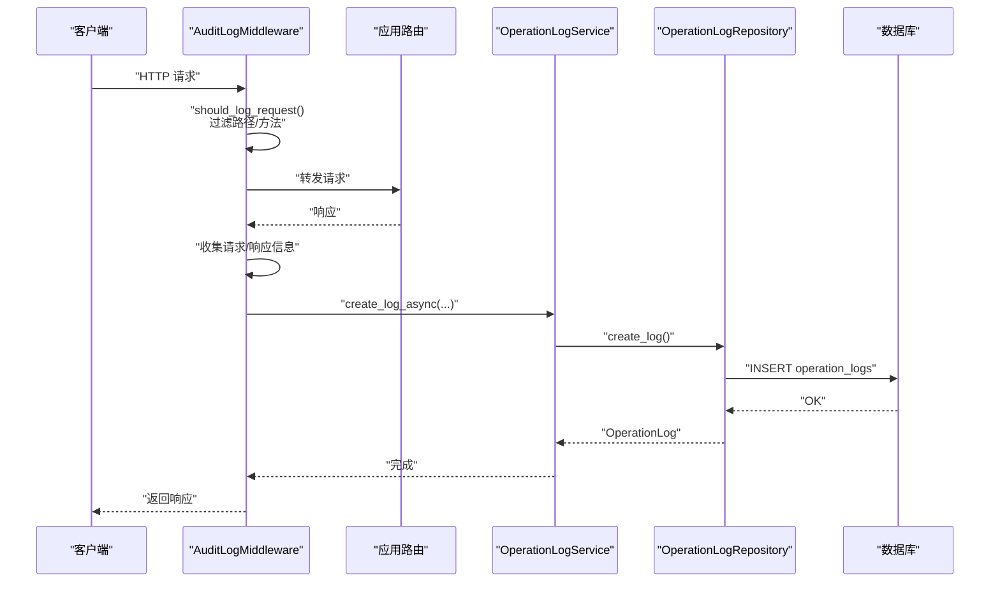
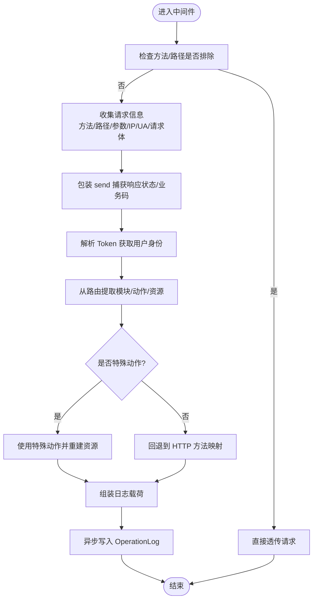
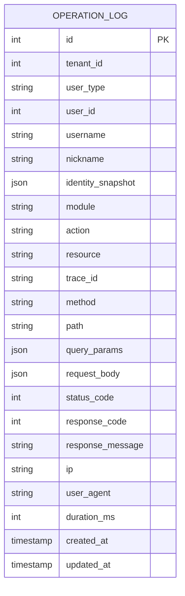
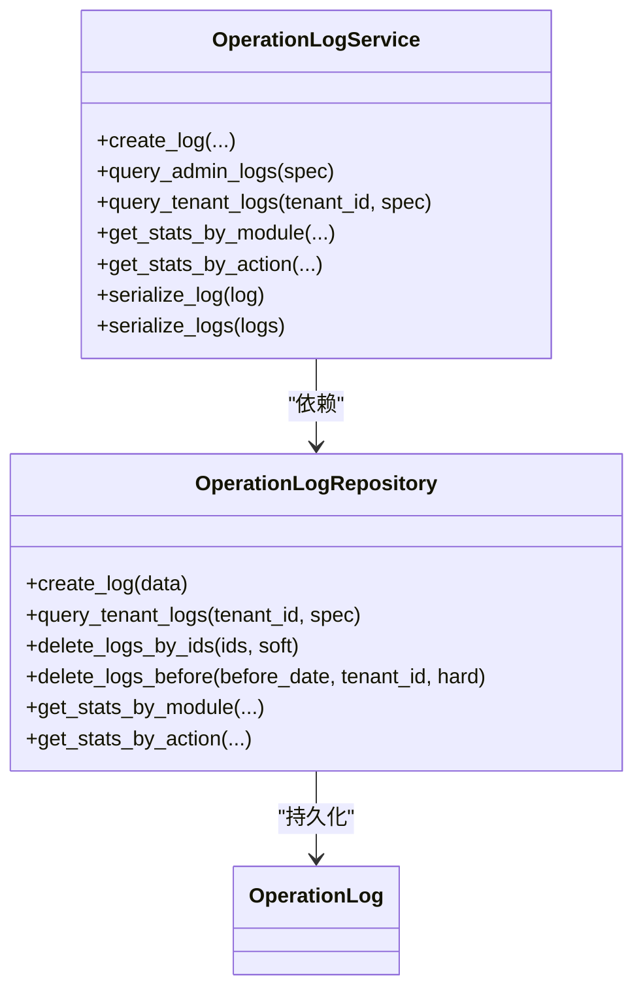
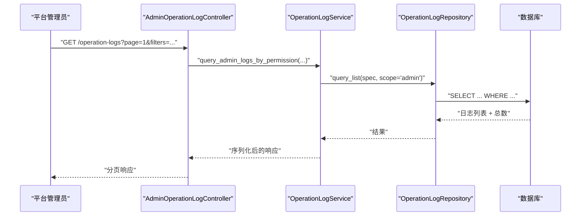
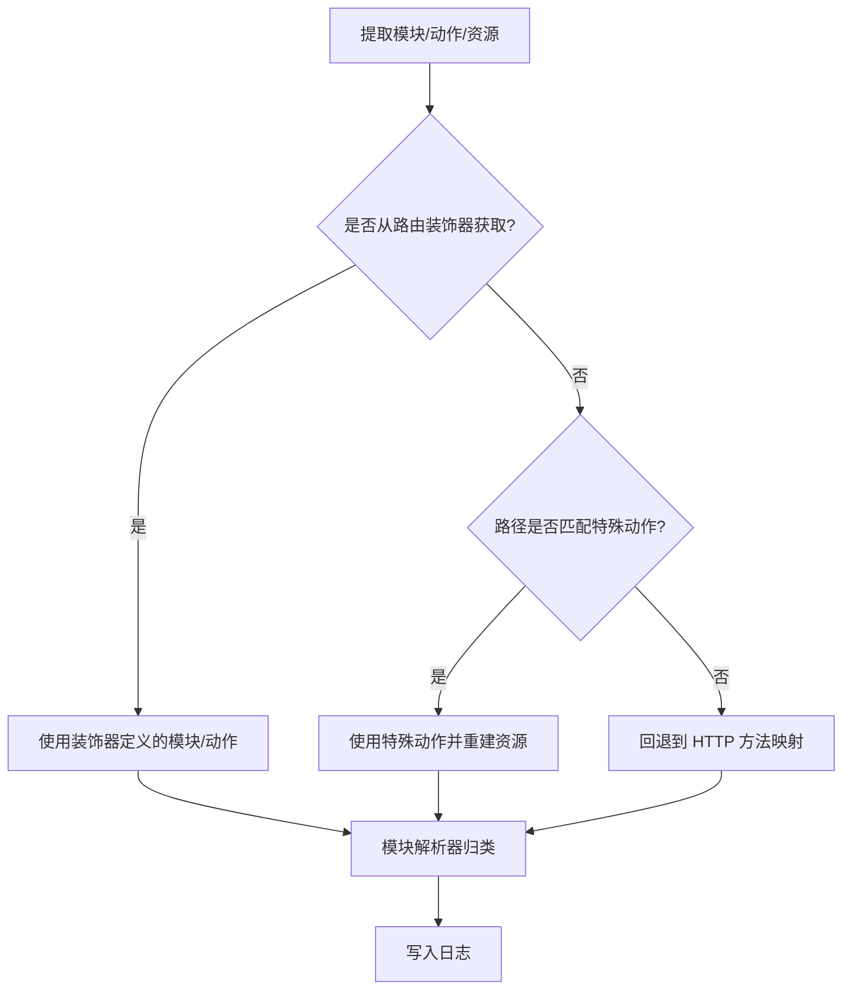
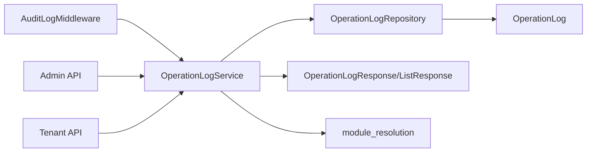

# 审计日志中间件

<cite>
**本文引用的文件**
- [audit_log.py](file://backend/app/middleware/audit_log.py)
- [operation_log.py](file://backend/app/models/system/operation_log.py)
- [operation_log.py](file://backend/app/schemas/system/operation_log.py)
- [operation_log_repository.py](file://backend/app/repositories/system/operation_log_repository.py)
- [operation_log_service.py](file://backend/app/services/system/operation_log_service.py)
- [operation_logs.py](file://backend/app/api/admin/operation_logs.py)
- [operation_logs.py](file://backend/app/api/tenant/operation_logs.py)
- [operation_log_module_resolution.py](file://backend/app/operation_log_module_resolution.py)
- [test_admin_operation_log_routes_contract.py](file://backend/tests/test_admin_operation_log_routes_contract.py)
</cite>

## 目录
1. [简介](#简介)
2. [项目结构](#项目结构)
3. [核心组件](#核心组件)
4. [架构总览](#架构总览)
5. [组件详解](#组件详解)
6. [依赖关系分析](#依赖关系分析)
7. [性能考量](#性能考量)
8. [故障排查指南](#故障排查指南)
9. [结论](#结论)
10. [附录](#附录)

## 简介
本技术文档围绕审计日志中间件展开，系统性阐述其如何拦截 API 请求并记录完整的审计信息，包括请求参数、响应结果、用户身份、时间戳与追踪 ID；同时文档化 OperationLog 模型的数据结构与存储策略、日志分类机制、过滤规则、查询与统计分析能力，以及安全与隐私保护措施。读者无需深入底层实现即可理解审计日志在系统中的作用与使用方式。

## 项目结构
审计日志相关代码分布在中间件、模型、仓储、服务、API 控制器与测试等模块中，采用分层设计：中间件负责请求拦截与异步落库；服务层封装业务逻辑；仓储层提供数据访问；API 层暴露查询与统计接口；Schema 层定义序列化结构；模块解析器负责日志模块归类。

**图表来源**
- [audit_log.py:219-582](file://backend/app/middleware/audit_log.py#L219-L582)
- [operation_log_service.py:42-264](file://backend/app/services/system/operation_log_service.py#L42-L264)
- [operation_log_repository.py:19-331](file://backend/app/repositories/system/operation_log_repository.py#L19-L331)
- [operation_log.py:14-193](file://backend/app/models/system/operation_log.py#L14-L193)
- [operation_log.py:108-318](file://backend/app/schemas/system/operation_log.py#L108-L318)
- [operation_logs.py](file://backend/app/api/admin/operation_logs.py)
- [operation_logs.py](file://backend/app/api/tenant/operation_logs.py)
- [operation_log_module_resolution.py](file://backend/app/operation_log_module_resolution.py)

**章节来源**
- [audit_log.py:1-582](file://backend/app/middleware/audit_log.py#L1-L582)
- [operation_log_service.py:1-264](file://backend/app/services/system/operation_log_service.py#L1-L264)
- [operation_log_repository.py:1-331](file://backend/app/repositories/system/operation_log_repository.py#L1-L331)
- [operation_log.py:1-193](file://backend/app/models/system/operation_log.py#L1-L193)
- [operation_log.py:1-318](file://backend/app/schemas/system/operation_log.py#L1-L318)

## 核心组件
- 审计日志中间件：拦截 HTTP 请求，解析用户身份、模块/动作/资源、请求/响应信息，异步写入 OperationLog。
- OperationLog 模型：定义日志字段、索引、可过滤/排序字段，支撑查询与统计。
- 服务层：封装权限校验、序列化、统计、操作人聚合等业务逻辑。
- 仓储层：提供分页查询、统计、批量删除、按租户隔离等数据访问方法。
- API 控制器：平台端与企业端分别暴露查询、统计与导出能力。
- Schema：定义响应结构，支持国际化与身份快照合并。

**章节来源**
- [audit_log.py:219-582](file://backend/app/middleware/audit_log.py#L219-L582)
- [operation_log.py:14-193](file://backend/app/models/system/operation_log.py#L14-L193)
- [operation_log_service.py:42-264](file://backend/app/services/system/operation_log_service.py#L42-L264)
- [operation_log_repository.py:19-331](file://backend/app/repositories/system/operation_log_repository.py#L19-L331)
- [operation_log.py:108-318](file://backend/app/schemas/system/operation_log.py#L108-L318)

## 架构总览
审计日志中间件在 ASGI 层拦截请求，解析用户身份与权限信息，收集请求/响应上下文，随后异步调用服务层写入数据库。服务层通过仓储层持久化，并在 API 层提供查询、统计与导出能力。

**图表来源**
- [audit_log.py:235-349](file://backend/app/middleware/audit_log.py#L235-L349)
- [operation_log_service.py:97-142](file://backend/app/services/system/operation_log_service.py#L97-L142)
- [operation_log_repository.py:69-79](file://backend/app/repositories/system/operation_log_repository.py#L69-L79)

## 组件详解

### 审计日志中间件
- 过滤规则
  - 排除路径前缀：健康检查、指标、文档等静态资源。
  - 排除路径模式：/static/、/assets/ 等。
  - 排除方法：OPTIONS、根路径 "/"。
- 用户身份解析
  - 优先从中间件注入的 state 获取用户信息；否则从 Access Token 解析，支持平台/企业管理员与普通用户。
  - 支持“一键登录”场景，将企业管理员的登录记录为平台管理员操作。
- 模块/动作/资源提取
  - 从路由装饰器中提取模块与动作；若未提取，则根据路径匹配特殊动作；最后回退到 HTTP 方法映射。
- 请求/响应信息采集
  - 请求：方法、路径、查询参数、IP、UA、请求体（JSON 脱敏）。
  - 响应：HTTP 状态码、业务响应码与消息（从 JSON 响应体解析）。
- 异步写入
  - 通过服务层异步写入，不阻塞主请求链路。

**图表来源**
- [audit_log.py:75-101](file://backend/app/middleware/audit_log.py#L75-L101)
- [audit_log.py:350-417](file://backend/app/middleware/audit_log.py#L350-L417)
- [audit_log.py:487-578](file://backend/app/middleware/audit_log.py#L487-L578)

**章节来源**
- [audit_log.py:25-101](file://backend/app/middleware/audit_log.py#L25-L101)
- [audit_log.py:128-190](file://backend/app/middleware/audit_log.py#L128-L190)
- [audit_log.py:350-417](file://backend/app/middleware/audit_log.py#L350-L417)
- [audit_log.py:487-578](file://backend/app/middleware/audit_log.py#L487-L578)

### OperationLog 模型与数据结构
- 字段概览
  - 用户身份：tenant_id、user_type、user_id、username、nickname、identity_snapshot。
  - 操作信息：module、action、resource。
  - 追踪信息：trace_id。
  - 请求信息：method、path、query_params、request_body（JSON，已脱敏）。
  - 响应信息：status_code、response_code、response_message。
  - 客户端信息：ip、user_agent。
  - 性能指标：duration_ms。
- 索引与可过滤/排序
  - 复合索引：tenant_id+created_at、user_type+user_id、module+action。
  - 可过滤字段：覆盖用户、模块、动作、资源、方法、路径、状态码、时间等。
  - 可排序字段：支持按多个维度排序。
- 存储策略
  - JSON 类型字段用于存储结构化数据（如查询参数、请求体摘要）。
  - 通过索引优化常见查询与统计场景。

**图表来源**
- [operation_log.py:14-193](file://backend/app/models/system/operation_log.py#L14-L193)

**章节来源**
- [operation_log.py:25-62](file://backend/app/models/system/operation_log.py#L25-L62)
- [operation_log.py:64-183](file://backend/app/models/system/operation_log.py#L64-L183)

### 服务层与仓储层
- 服务层职责
  - 异步写入日志、权限校验、序列化、统计、操作人聚合。
  - 提供平台端与企业端查询接口，支持层级权限控制。
- 仓储层职责
  - 提供分页查询、统计（按模块/动作）、批量删除、按时间清理。
  - 自动强制租户隔离与用户类型过滤，保障数据边界。

**图表来源**
- [operation_log_service.py:42-264](file://backend/app/services/system/operation_log_service.py#L42-L264)
- [operation_log_repository.py:19-331](file://backend/app/repositories/system/operation_log_repository.py#L19-L331)
- [operation_log.py:14-193](file://backend/app/models/system/operation_log.py#L14-L193)

**章节来源**
- [operation_log_service.py:97-264](file://backend/app/services/system/operation_log_service.py#L97-L264)
- [operation_log_repository.py:69-331](file://backend/app/repositories/system/operation_log_repository.py#L69-L331)

### API 查询与统计
- 平台端与企业端控制器分别提供分页查询、统计分析与操作人筛选能力。
- 支持按 trace_id、用户、模块、动作、资源、方法、路径、状态码、时间等条件过滤。
- 响应结构包含统一展示名、头像、组织节点、角色等身份信息，来源于快照与实时身份合并。

**图表来源**
- [operation_logs.py](file://backend/app/api/admin/operation_logs.py)
- [operation_log_service.py:188-206](file://backend/app/services/system/operation_log_service.py#L188-L206)
- [operation_log_repository.py:19-105](file://backend/app/repositories/system/operation_log_repository.py#L19-L105)

**章节来源**
- [operation_log.py:108-263](file://backend/app/schemas/system/operation_log.py#L108-L263)
- [operation_log_service.py:144-206](file://backend/app/services/system/operation_log_service.py#L144-L206)
- [operation_log_repository.py:81-105](file://backend/app/repositories/system/operation_log_repository.py#L81-L105)

### 日志分类机制
- 模块归类：通过模块解析器将细粒度资源映射为统一模块，便于统计与展示。
- 动作类型：优先从路由装饰器提取，其次按路径匹配特殊动作，最后回退到 HTTP 方法映射。
- 资源标识：由模块与动作组合形成资源代码，用于权限与统计。

**图表来源**
- [audit_log.py:128-190](file://backend/app/middleware/audit_log.py#L128-L190)
- [operation_log_module_resolution.py](file://backend/app/operation_log_module_resolution.py)

**章节来源**
- [audit_log.py:128-190](file://backend/app/middleware/audit_log.py#L128-L190)
- [operation_log_module_resolution.py](file://backend/app/operation_log_module_resolution.py)

### 过滤规则与重要性区分
- 过滤规则
  - 排除健康检查、指标、文档、图标等非业务路径。
  - 排除静态资源目录。
  - 排除 OPTIONS 预检与根路径。
- 重要性区分
  - 特殊动作（登录、登出、导入、导出）被明确标注，便于识别高风险或高价值操作。
  - 未提取到动作时，回退到 HTTP 方法映射，确保所有请求都有动作标签。

**章节来源**
- [audit_log.py:25-40](file://backend/app/middleware/audit_log.py#L25-L40)
- [audit_log.py:66-72](file://backend/app/middleware/audit_log.py#L66-L72)
- [audit_log.py:553-556](file://backend/app/middleware/audit_log.py#L553-L556)

### 查询与分析功能
- 查询能力
  - 分页查询：支持多字段过滤与排序。
  - 租户隔离：企业端查询自动附加租户过滤。
  - 权限控制：平台/企业管理员可按层级范围查看。
- 统计分析
  - 按模块统计：统计各模块操作次数。
  - 按动作统计：统计各类操作占比。
- 导出功能
  - API 提供导出能力（具体实现位于控制器文件），结合过滤与分页进行批量导出。

**章节来源**
- [operation_log_repository.py:164-236](file://backend/app/repositories/system/operation_log_repository.py#L164-L236)
- [operation_log_service.py:164-186](file://backend/app/services/system/operation_log_service.py#L164-L186)
- [operation_logs.py](file://backend/app/api/admin/operation_logs.py)
- [operation_logs.py](file://backend/app/api/tenant/operation_logs.py)

### 安全与隐私保护
- 敏感字段脱敏
  - 请求体中密码、令牌、密钥等敏感字段统一脱敏处理，避免明文入库。
- 身份快照
  - 记录身份快照，避免后续昵称、组织、角色变更导致历史日志展示漂移。
- 访问控制
  - 平台/企业管理员的查询范围受权限与层级约束，防止越权查看。
- 数据保留与清理
  - 支持按时间清理过期日志，可选择软删除或硬删除。

**章节来源**
- [audit_log.py:103-125](file://backend/app/middleware/audit_log.py#L103-L125)
- [operation_log.py:95-100](file://backend/app/models/system/operation_log.py#L95-L100)
- [operation_log_repository.py:124-162](file://backend/app/repositories/system/operation_log_repository.py#L124-L162)

## 依赖关系分析
- 中间件依赖服务层异步写入接口，服务层依赖仓储层数据访问，仓储层依赖 SQLAlchemy 模型。
- API 控制器依赖服务层进行查询与统计，服务层依赖模块解析器与权限门面。
- Schema 层依赖模块解析器与国际化组件，用于字段翻译与身份合并。

**图表来源**
- [audit_log.py:503-578](file://backend/app/middleware/audit_log.py#L503-L578)
- [operation_log_service.py:19-32](file://backend/app/services/system/operation_log_service.py#L19-L32)
- [operation_log_repository.py:19-331](file://backend/app/repositories/system/operation_log_repository.py#L19-L331)
- [operation_log.py:108-188](file://backend/app/schemas/system/operation_log.py#L108-L188)
- [operation_logs.py](file://backend/app/api/admin/operation_logs.py)
- [operation_logs.py](file://backend/app/api/tenant/operation_logs.py)
- [operation_log_module_resolution.py](file://backend/app/operation_log_module_resolution.py)

**章节来源**
- [audit_log.py:503-578](file://backend/app/middleware/audit_log.py#L503-L578)
- [operation_log_service.py:19-32](file://backend/app/services/system/operation_log_service.py#L19-L32)
- [operation_log_repository.py:19-331](file://backend/app/repositories/system/operation_log_repository.py#L19-L331)

## 性能考量
- 异步写入：中间件在请求完成后异步写入，避免阻塞主请求链路。
- 索引优化：针对常用过滤与统计字段建立复合索引，提升查询效率。
- 请求体处理：仅对 JSON 请求体进行解析与脱敏，非 JSON 仅记录大小与类型，降低解析成本。
- 统计查询：仓储层提供聚合统计接口，减少复杂查询对数据库的压力。

[本节为通用性能建议，不直接分析具体文件]

## 故障排查指南
- 无法看到日志
  - 检查请求路径是否命中排除规则（健康检查、文档、静态资源等）。
  - 确认中间件是否正确注册与顺序。
- 用户身份为空
  - 确认 Authorization 头是否为 Bearer Token，且 Token 有效。
  - 检查中间件注入的 state 是否存在用户信息。
- 统计结果异常
  - 确认模块解析器是否正确归类模块。
  - 检查过滤条件与时间范围设置。
- 导出失败
  - 检查控制器导出接口实现与权限配置。

**章节来源**
- [audit_log.py:75-101](file://backend/app/middleware/audit_log.py#L75-L101)
- [audit_log.py:419-485](file://backend/app/middleware/audit_log.py#L419-L485)
- [operation_log_module_resolution.py](file://backend/app/operation_log_module_resolution.py)
- [operation_logs.py](file://backend/app/api/admin/operation_logs.py)
- [operation_logs.py](file://backend/app/api/tenant/operation_logs.py)

## 结论
审计日志中间件通过严格的过滤规则、完善的用户身份解析、模块/动作/资源提取与异步写入机制，实现了对系统 API 调用的全面审计。配合模型层面的索引与可过滤字段、服务与仓储层的权限隔离与统计能力，以及 API 层的查询与导出接口，形成了从采集、存储、查询到分析的完整闭环。同时，敏感字段脱敏、身份快照与数据清理策略有效兼顾了安全与合规要求。

## 附录
- 测试参考：可通过测试用例验证日志写入与查询行为，确保过滤规则与序列化逻辑符合预期。

**章节来源**
- [test_admin_operation_log_routes_contract.py:91-170](file://backend/tests/test_admin_operation_log_routes_contract.py#L91-L170)