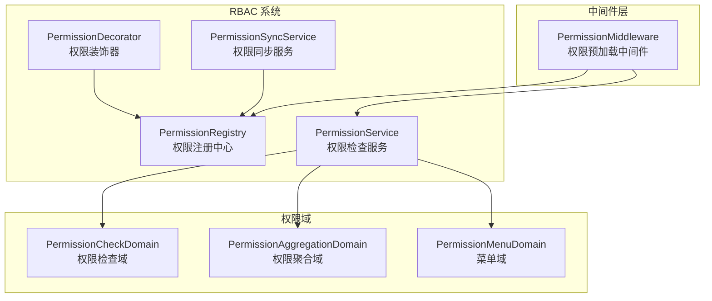
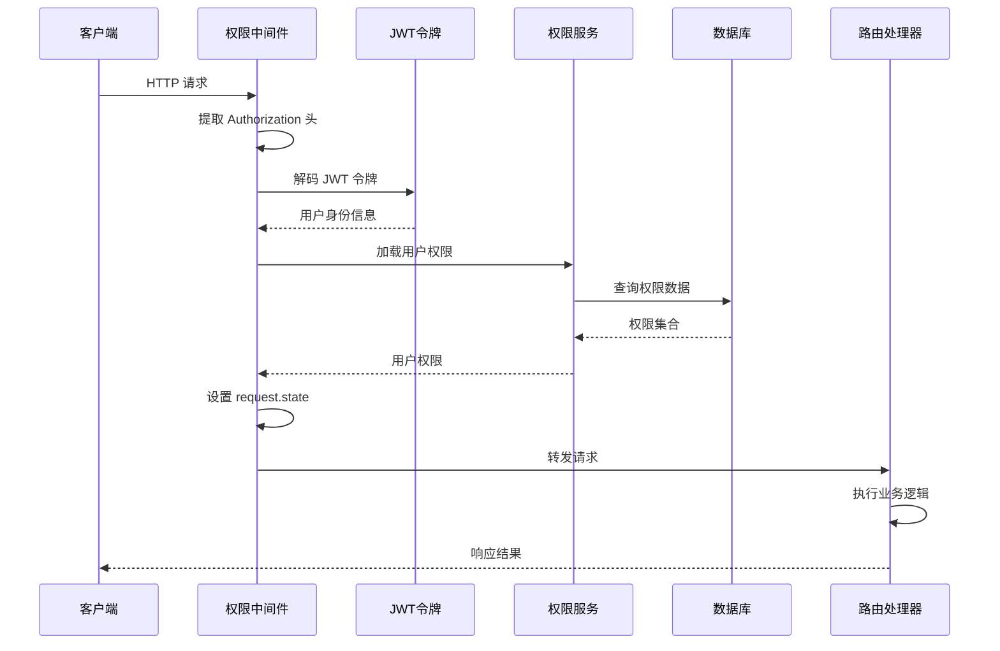
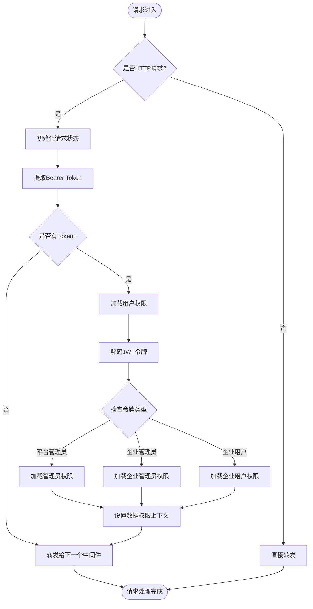
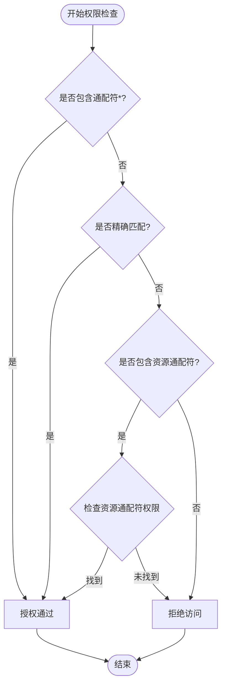
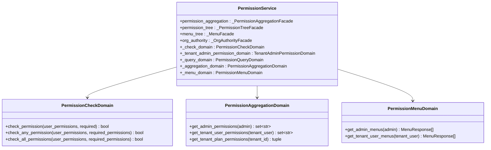
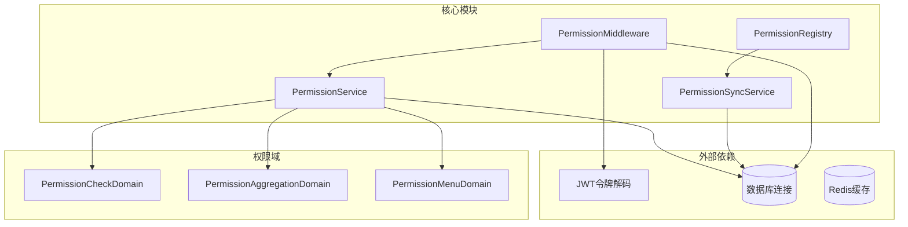

# 权限控制中间件

<cite>
**本文档引用的文件**
- [backend/app/middleware/permission.py](file://backend/app/middleware/permission.py)
- [backend/app/rbac/decorators.py](file://backend/app/rbac/decorators.py)
- [backend/app/rbac/registry.py](file://backend/app/rbac/registry.py)
- [backend/app/rbac/sync.py](file://backend/app/rbac/sync.py)
- [backend/app/rbac/services/permission_service.py](file://backend/app/rbac/services/permission_service.py)
- [backend/app/rbac/services/permission_domains/checks.py](file://backend/app/rbac/services/permission_domains/checks.py)
- [backend/app/enums/rbac.py](file://backend/app/enums/rbac.py)
- [backend/app/main.py](file://backend/app/main.py)
</cite>

## 目录
1. [简介](#简介)
2. [项目结构](#项目结构)
3. [核心组件](#核心组件)
4. [架构概览](#架构概览)
5. [详细组件分析](#详细组件分析)
6. [依赖关系分析](#依赖关系分析)
7. [性能考虑](#性能考虑)
8. [故障排除指南](#故障排除指南)
9. [结论](#结论)

## 简介

权限控制中间件是 NovusAI SaaS 平台的核心安全组件，实现了基于 RBAC（基于角色的访问控制）的权限预加载和验证机制。该中间件在请求到达路由处理器之前，预加载当前用户的权限到请求状态中，使后续的权限检查装饰器能够直接读取用户权限信息。

系统采用声明式权限定义方式，通过装饰器在控制器上声明权限，应用启动时自动扫描并同步到数据库。权限中间件支持多种权限类型和作用域，包括平台管理员、企业管理员和企业业务用户三种身份类型。

## 项目结构

权限控制中间件位于后端应用的中间件目录中，与 RBAC 系统紧密集成：

**图表来源**
- [backend/app/middleware/permission.py:31-272](file://backend/app/middleware/permission.py#L31-L272)
- [backend/app/rbac/registry.py:15-146](file://backend/app/rbac/registry.py#L15-L146)
- [backend/app/rbac/decorators.py:1-551](file://backend/app/rbac/decorators.py#L1-L551)

**章节来源**
- [backend/app/middleware/permission.py:1-272](file://backend/app/middleware/permission.py#L1-L272)
- [backend/app/rbac/registry.py:1-146](file://backend/app/rbac/registry.py#L1-L146)

## 核心组件

### 权限预加载中间件

PermissionMiddleware 是 ASGI 实现的权限预加载中间件，负责在请求到达路由处理函数之前加载用户权限。

**主要功能：**
- 从请求头提取 Bearer Token
- 解码 JWT 令牌获取用户身份信息
- 根据用户身份类型加载相应权限
- 将权限信息存储到 request.state.user_permissions
- 设置数据权限上下文供数据权限过滤器使用

**权限加载策略：**
- 平台管理员：支持超级管理员权限和组织权限
- 企业管理员：通过 PermissionService 获取权限
- 企业业务用户：加载角色权限

**章节来源**
- [backend/app/middleware/permission.py:31-272](file://backend/app/middleware/permission.py#L31-L272)

### 权限装饰器系统

权限装饰器系统提供了声明式权限定义能力，支持多种权限类型和检查策略。

**装饰器类型：**
- `@public`: 公开访问，无需认证和权限检查
- `@auth_only`: 仅需认证，无需权限检查
- `@permission_action`: 操作权限装饰器，支持自动检查
- 快捷装饰器：`@action_read`、`@action_create`、`@action_update`、`@action_delete`

**权限检查机制：**
- 支持精确匹配：`admin_user:list`
- 支持通配符：`*`（所有权限）
- 支持资源通配符：`admin_user:*`（某资源的所有操作）

**章节来源**
- [backend/app/rbac/decorators.py:1-551](file://backend/app/rbac/decorators.py#L1-L551)

### 权限注册中心

PermissionRegistry 是权限注册中心的单例实现，负责收集所有通过装饰器定义的权限。

**核心功能：**
- 权限注册和查询
- 按作用域和类型过滤权限
- 支持权限代码去重
- 提供权限清单获取

**章节来源**
- [backend/app/rbac/registry.py:15-146](file://backend/app/rbac/registry.py#L15-L146)

## 架构概览

权限控制中间件的整体架构采用分层设计，确保权限检查的高效性和可维护性：

**图表来源**
- [backend/app/middleware/permission.py:40-60](file://backend/app/middleware/permission.py#L40-L60)
- [backend/app/rbac/services/permission_service.py:178-182](file://backend/app/rbac/services/permission_service.py#L178-L182)

## 详细组件分析

### 权限中间件执行流程

**图表来源**
- [backend/app/middleware/permission.py:40-60](file://backend/app/middleware/permission.py#L40-L60)
- [backend/app/middleware/permission.py:70-89](file://backend/app/middleware/permission.py#L70-L89)

### 权限检查算法

权限检查采用多级匹配策略，支持灵活的权限组合：

**图表来源**
- [backend/app/rbac/services/permission_domains/checks.py:8-17](file://backend/app/rbac/services/permission_domains/checks.py#L8-L17)

**章节来源**
- [backend/app/rbac/services/permission_domains/checks.py:1-39](file://backend/app/rbac/services/permission_domains/checks.py#L1-L39)

### 权限同步机制

权限同步服务负责将装饰器定义的权限同步到数据库，确保权限定义与实际权限表的一致性。

**同步策略：**
- 新权限（代码有，DB 无）：创建
- 已存在（代码有，DB 有）：更新所有字段
- 代码删除（代码无，DB 有）：禁用（is_enabled=False），不物理删除

**父子关系处理：**
- 使用拓扑排序确保父级先于子级处理
- 支持菜单层级变更（移动到不同父级）

**章节来源**
- [backend/app/rbac/sync.py:140-263](file://backend/app/rbac/sync.py#L140-L263)

### 权限服务架构

权限服务采用领域驱动设计，将权限检查逻辑分解为多个专门的域：

**图表来源**
- [backend/app/rbac/services/permission_service.py:138-152](file://backend/app/rbac/services/permission_service.py#L138-L152)

**章节来源**
- [backend/app/rbac/services/permission_service.py:1-390](file://backend/app/rbac/services/permission_service.py#L1-L390)

## 依赖关系分析

权限控制中间件的依赖关系体现了清晰的关注点分离：

**图表来源**
- [backend/app/middleware/permission.py:17-28](file://backend/app/middleware/permission.py#L17-L28)
- [backend/app/rbac/sync.py:17-24](file://backend/app/rbac/sync.py#L17-L24)

**章节来源**
- [backend/app/middleware/permission.py:12-28](file://backend/app/middleware/permission.py#L12-L28)
- [backend/app/rbac/sync.py:17-24](file://backend/app/rbac/sync.py#L17-L24)

## 性能考虑

权限控制中间件在设计时充分考虑了性能优化：

### 权限预加载优化
- 使用 request.state 缓存用户权限，避免重复查询
- 支持超级管理员快速路径（`*` 权限）
- 按用户身份类型选择最优查询策略

### 数据权限上下文
- 使用 ContextVar 存储数据权限上下文
- 避免在每次数据权限检查时重新计算
- 支持多租户环境下的权限隔离

### 缓存策略建议
虽然当前实现主要依赖内存缓存，但可以考虑以下优化：
- Redis 缓存热门权限查询结果
- 权限变更时的缓存失效策略
- 权限预热机制

## 故障排除指南

### 常见权限问题

**问题1：权限检查总是失败**
- 检查 JWT 令牌是否正确传递
- 验证令牌中的用户身份信息
- 确认用户权限是否正确加载到 request.state

**问题2：权限同步异常**
- 检查权限注册中心是否正确收集装饰器定义
- 验证数据库连接和权限表结构
- 查看权限同步日志中的错误信息

**问题3：数据权限过滤无效**
- 确认数据权限上下文是否正确设置
- 检查 OrgAuthorityResolver 的权限计算
- 验证用户可见组织范围的配置

**章节来源**
- [backend/app/middleware/permission.py:70-89](file://backend/app/middleware/permission.py#L70-L89)
- [backend/app/rbac/sync.py:140-163](file://backend/app/rbac/sync.py#L140-L163)

### 错误响应格式

权限验证失败时，系统返回标准的 HTTP 403 Forbidden 响应，包含本地化的错误信息。

**响应示例：**
- 状态码：403 Forbidden
- 内容类型：application/json
- 错误详情：包含本地化的人权错误消息

**章节来源**
- [backend/app/rbac/decorators.py:322-326](file://backend/app/rbac/decorators.py#L322-L326)

## 结论

权限控制中间件通过精心设计的架构实现了高效的 RBAC 权限管理。其核心优势包括：

1. **声明式权限定义**：通过装饰器简化权限管理
2. **预加载机制**：提升权限检查性能
3. **多身份支持**：覆盖平台管理员、企业管理员和企业用户
4. **灵活的权限组合**：支持精确匹配、通配符和资源通配符
5. **自动同步机制**：确保权限定义与数据库一致性

该中间件为 NovusAI SaaS 平台提供了坚实的安全基础，支持复杂的权限管理和数据权限控制需求。通过合理的架构设计和性能优化，能够满足高并发场景下的权限验证要求。