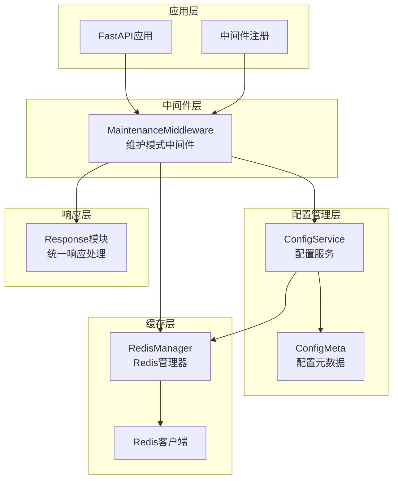
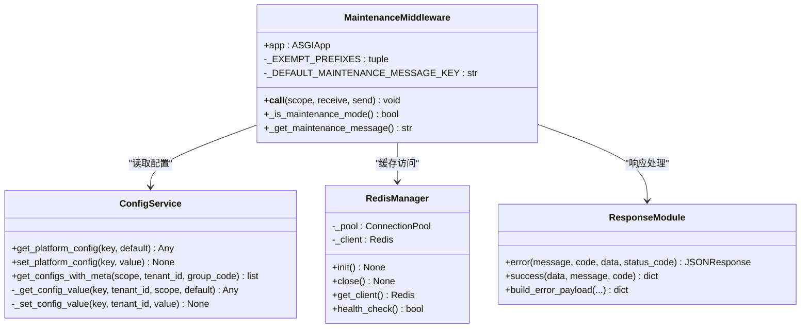
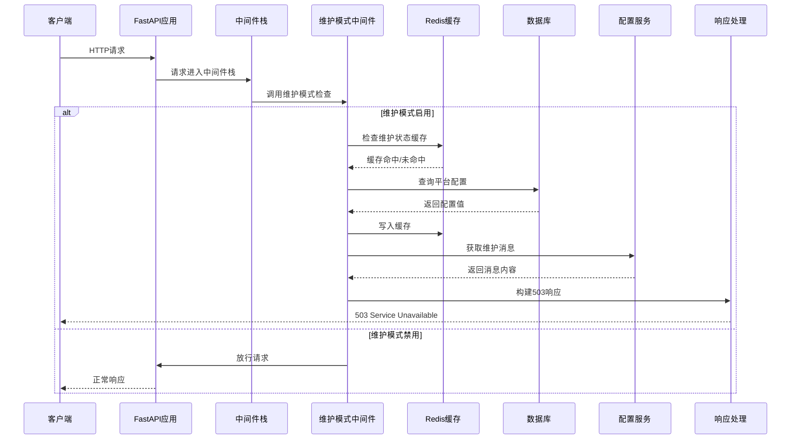
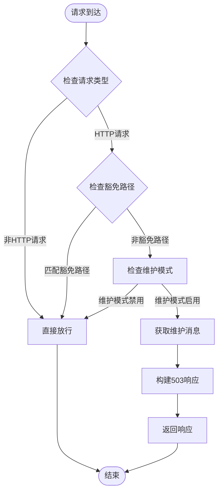
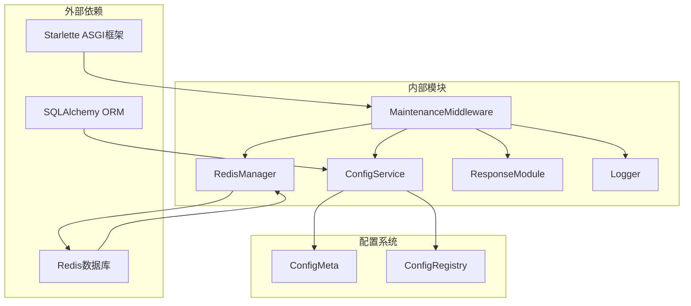

# 维护模式中间件

<cite>
**本文档引用的文件**
- [maintenance.py](file://backend/app/middleware/maintenance.py)
- [service.py](file://backend/app/configs/service.py)
- [redis.py](file://backend/app/core/redis.py)
- [response.py](file://backend/app/core/response.py)
- [main.py](file://backend/app/main.py)
- [general.py](file://backend/app/configs/definitions/platform/general.py)
- [groups.py](file://backend/app/configs/definitions/groups.py)
</cite>

## 目录
1. [简介](#简介)
2. [项目结构](#项目结构)
3. [核心组件](#核心组件)
4. [架构概览](#架构概览)
5. [详细组件分析](#详细组件分析)
6. [依赖关系分析](#依赖关系分析)
7. [性能考虑](#性能考虑)
8. [故障排除指南](#故障排除指南)
9. [结论](#结论)

## 简介

维护模式中间件是 NovusAI SaaS 平台中的关键基础设施组件，负责在系统维护期间阻止普通用户访问，同时确保管理员和关键系统功能的正常运行。该中间件实现了智能的维护状态检测和响应机制，提供了灵活的配置选项和友好的用户体验。

维护模式中间件的核心特性包括：
- **智能拦截机制**：自动拦截非管理员请求，返回 503 状态码
- **豁免路径机制**：管理员端点、公开 API、健康检查等关键路径不受影响
- **缓存优化**：使用 Redis 缓存减少数据库查询压力
- **国际化支持**：支持多语言维护消息
- **配置管理**：通过平台配置系统动态管理维护状态

## 项目结构

维护模式中间件位于后端应用的中间件目录中，与核心配置系统、Redis 缓存和响应处理模块紧密集成：



**图表来源**
- [maintenance.py:37-150](file://backend/app/middleware/maintenance.py#L37-L150)
- [service.py:45-871](file://backend/app/configs/service.py#L45-L871)
- [redis.py:19-116](file://backend/app/core/redis.py#L19-L116)
- [response.py:22-588](file://backend/app/core/response.py#L22-L588)

**章节来源**
- [maintenance.py:1-150](file://backend/app/middleware/maintenance.py#L1-L150)
- [main.py:668-672](file://backend/app/main.py#L668-L672)

## 核心组件

### 维护模式中间件类

维护模式中间件是基于 ASGI 协议实现的中间件类，负责拦截 HTTP 请求并根据维护状态决定是否放行：



**图表来源**
- [maintenance.py:37-150](file://backend/app/middleware/maintenance.py#L37-L150)
- [service.py:45-871](file://backend/app/configs/service.py#L45-L871)
- [redis.py:19-116](file://backend/app/core/redis.py#L19-L116)
- [response.py:22-588](file://backend/app/core/response.py#L22-L588)

### 配置管理系统

维护模式依赖于完整的配置管理系统，支持平台级配置的动态管理：

| 配置项 | 类型 | 默认值 | 作用 |
|--------|------|--------|------|
| maintenance_mode | Boolean | False | 维护模式开关 |
| maintenance_message | Text | "系统正在维护中，请稍后再试。" | 维护提示信息 |

**章节来源**
- [general.py:106-134](file://backend/app/configs/definitions/platform/general.py#L106-L134)
- [service.py:86-123](file://backend/app/configs/service.py#L86-L123)

## 架构概览

维护模式中间件在整个应用架构中的位置和交互关系如下：



**图表来源**
- [maintenance.py:51-76](file://backend/app/middleware/maintenance.py#L51-L76)
- [maintenance.py:78-112](file://backend/app/middleware/maintenance.py#L78-L112)
- [maintenance.py:114-146](file://backend/app/middleware/maintenance.py#L114-L146)

## 详细组件分析

### 维护状态检测机制

维护模式中间件实现了多层次的状态检测机制，确保高可用性和性能：



**图表来源**
- [maintenance.py:51-76](file://backend/app/middleware/maintenance.py#L51-L76)
- [maintenance.py:78-112](file://backend/app/middleware/maintenance.py#L78-L112)

### 缓存策略设计

中间件采用了智能的缓存策略来优化性能：

| 缓存键 | 数据类型 | TTL | 用途 |
|--------|----------|-----|------|
| maintenance:mode | String | 60秒 | 维护模式状态缓存 |
| maintenance:message | String | 60秒 | 维护消息缓存 |

缓存优先级：
1. **Redis缓存**：优先检查，命中则直接返回
2. **数据库备份**：缓存未命中时查询数据库
3. **默认值回退**：数据库查询失败时使用默认消息

**章节来源**
- [maintenance.py:81-112](file://backend/app/middleware/maintenance.py#L81-L112)
- [maintenance.py:117-146](file://backend/app/middleware/maintenance.py#L117-L146)

### 豁免路径机制

维护模式中间件预定义了多个豁免路径，确保关键功能不受影响：

```mermaid
graph LR
subgraph "豁免路径组"
Admin[/admin/* 管理端]
Public[/api/public/* 公共API]
Docs[/docs,/redoc,/openapi.json 文档]
Health[/health,/ready 健康检查]
Metrics[/metrics 指标]
SIO[/sio Socket.IO]
Files[/files 静态文件]
end
subgraph "受保护路径"
Protected[其他所有HTTP请求]
end
Protected -.->|拦截| Blocked[503响应]
Admin -.->|放行| Allowed[正常访问]
Public -.->|放行| Allowed
Docs -.->|放行| Allowed
Health -.->|放行| Allowed
Metrics -.->|放行| Allowed
SIO -.->|放行| Allowed
Files -.->|放行| Allowed
```

**图表来源**
- [maintenance.py:22-34](file://backend/app/middleware/maintenance.py#L22-L34)

**章节来源**
- [maintenance.py:22-34](file://backend/app/middleware/maintenance.py#L22-L34)

### 响应策略实现

维护模式中间件使用统一的响应格式，确保一致的用户体验：

| 响应字段 | 类型 | 说明 |
|----------|------|------|
| code | Integer | 5030 - 维护模式错误码 |
| message | String | 维护消息内容 |
| data | Object | `{ maintenance: true }` |
| status_code | Integer | 503 |

响应特点：
- **HTTP状态码**：503 Service Unavailable
- **业务错误码**：5030
- **数据结构**：包含维护状态标识
- **国际化支持**：支持多语言消息

**章节来源**
- [maintenance.py:67-73](file://backend/app/middleware/maintenance.py#L67-L73)
- [response.py:207-236](file://backend/app/core/response.py#L207-L236)

## 依赖关系分析

维护模式中间件的依赖关系展现了清晰的分层架构：



**图表来源**
- [maintenance.py:13-19](file://backend/app/middleware/maintenance.py#L13-L19)
- [service.py:17-31](file://backend/app/configs/service.py#L17-L31)
- [redis.py:11-16](file://backend/app/core/redis.py#L11-L16)

**章节来源**
- [maintenance.py:13-19](file://backend/app/middleware/maintenance.py#L13-L19)
- [service.py:17-31](file://backend/app/configs/service.py#L17-L31)

## 性能考虑

维护模式中间件在设计时充分考虑了性能优化：

### 缓存优化策略
- **Redis缓存**：维护状态和消息分别缓存60秒
- **渐进式回退**：缓存未命中时才查询数据库
- **异步操作**：所有缓存操作都是异步执行

### 内存管理
- **零分配策略**：路径匹配使用字符串比较而非正则表达式
- **对象复用**：中间件实例在整个应用生命周期内复用
- **异常容错**：缓存失败不影响主流程，自动降级到数据库

### 并发处理
- **异步中间件**：完全支持异步请求处理
- **无阻塞操作**：Redis和数据库操作都是异步的
- **连接池管理**：Redis连接使用连接池优化性能

## 故障排除指南

### 常见问题诊断

| 问题症状 | 可能原因 | 解决方案 |
|----------|----------|----------|
| 维护模式无法生效 | Redis连接失败 | 检查Redis服务状态和连接配置 |
| 维护消息不正确 | 缓存过期 | 等待60秒或手动清除Redis缓存 |
| 性能问题 | 数据库查询频繁 | 检查Redis缓存是否正常工作 |
| 权限问题 | 豁免路径配置错误 | 验证中间件注册顺序 |

### 日志分析

维护模式中间件会在以下情况下产生日志：
- Redis读取失败：调试级别日志
- 数据库查询失败：调试级别日志  
- 维护模式启用：信息级别日志
- 请求被拦截：调试级别日志

### 监控指标

建议监控的关键指标：
- **中间件命中率**：计算维护模式启用时的请求拦截比例
- **缓存命中率**：Redis缓存的有效性
- **响应延迟**：维护模式检查的平均耗时
- **错误率**：缓存和数据库访问的失败率

**章节来源**
- [maintenance.py:88-112](file://backend/app/middleware/maintenance.py#L88-L112)
- [maintenance.py:124-146](file://backend/app/middleware/maintenance.py#L124-L146)

## 结论

维护模式中间件作为 NovusAI SaaS 平台的重要基础设施组件，展现了优秀的架构设计和工程实践：

### 设计优势
- **模块化设计**：清晰的职责分离和依赖管理
- **高性能实现**：智能缓存策略和异步处理
- **可扩展性**：支持多种配置和国际化需求
- **可靠性**：完善的错误处理和降级机制

### 最佳实践
- **配置管理**：通过平台配置系统集中管理维护状态
- **缓存策略**：合理设置TTL和回退机制
- **监控告警**：建立完善的监控和通知机制
- **测试覆盖**：确保中间件在各种场景下的正确性

维护模式中间件不仅满足了基本的维护需求，更为平台的稳定运行和用户体验提供了重要保障。其设计原则和实现模式可以作为其他中间件开发的参考范例。