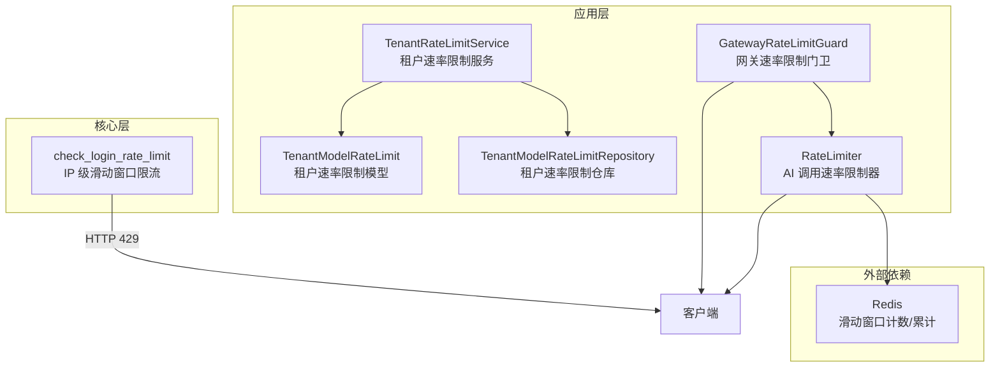
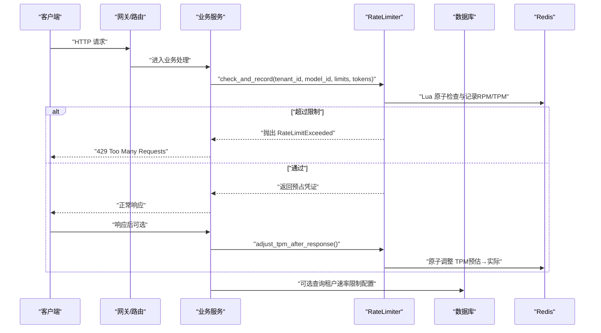
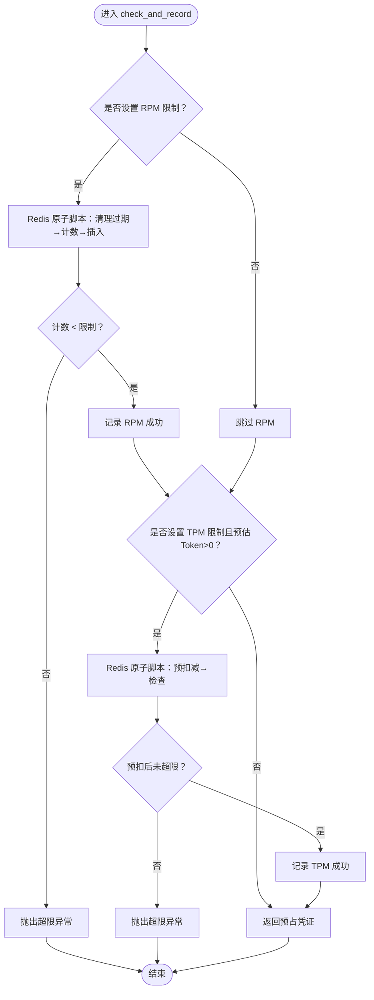
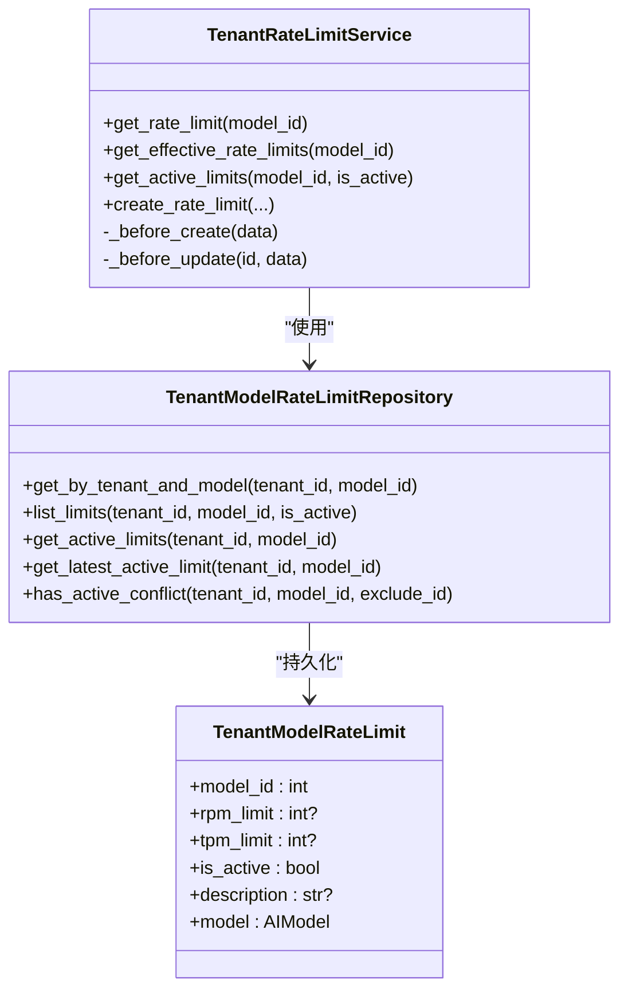
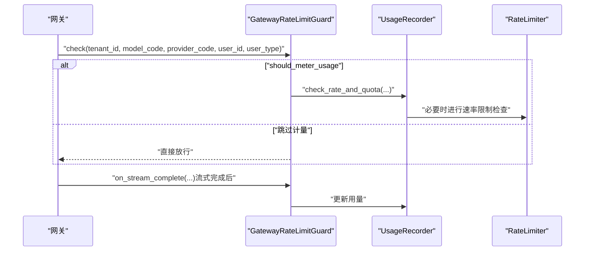
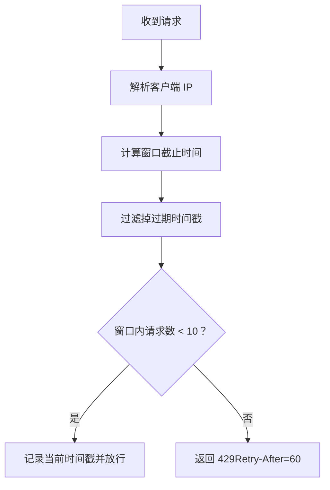
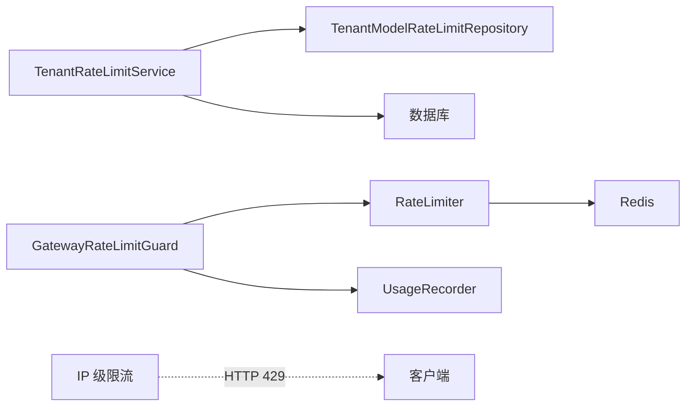

# 速率限制中间件

<cite>
**本文档引用的文件**
- [backend/app/ai/rate_limiter.py](file://backend/app/ai/rate_limiter.py)
- [backend/app/core/rate_limit.py](file://backend/app/core/rate_limit.py)
- [backend/app/ai/gateway_support/rate_limit_guard.py](file://backend/app/ai/gateway_support/rate_limit_guard.py)
- [backend/app/models/ai/tenant_rate_limit.py](file://backend/app/models/ai/tenant_rate_limit.py)
- [backend/app/repositories/ai/tenant_rate_limit_repository.py](file://backend/app/repositories/ai/tenant_rate_limit_repository.py)
- [backend/app/schemas/ai/tenant_rate_limit.py](file://backend/app/schemas/ai/tenant_rate_limit.py)
- [backend/app/services/ai/tenant_rate_limit_service.py](file://backend/app/services/ai/tenant_rate_limit_service.py)
</cite>

## 目录
1. [简介](#简介)
2. [项目结构](#项目结构)
3. [核心组件](#核心组件)
4. [架构总览](#架构总览)
5. [详细组件分析](#详细组件分析)
6. [依赖分析](#依赖分析)
7. [性能考虑](#性能考虑)
8. [故障排除指南](#故障排除指南)
9. [结论](#结论)
10. [附录](#附录)

## 简介
本技术文档系统性阐述本项目的速率限制中间件设计与实现，重点覆盖以下方面：
- 如何通过请求频率监控与限制策略防止 API 滥用与 DDoS 攻击
- 速率限制的配置方式：按不同 API 端点的独立限制、IP 级别限制、用户级别限制
- 速率限制算法实现：滑动窗口算法在 Redis 中的应用，以及令牌桶与漏桶思想的映射
- 实时监控与告警机制：限制触发通知与统计数据采集
- 白名单机制与特殊情况处理策略

## 项目结构
本项目的速率限制能力由三层协同构成：
- 应用层：面向租户与模型维度的速率限制服务与仓库
- 核心层：面向 IP 的轻量级滑动窗口限流（内存实现）
- 网关层：网关门卫封装，协调用量计量与配额检查

**图表来源**
- [backend/app/ai/rate_limiter.py:41-356](file://backend/app/ai/rate_limiter.py#L41-L356)
- [backend/app/services/ai/tenant_rate_limit_service.py:18-209](file://backend/app/services/ai/tenant_rate_limit_service.py#L18-L209)
- [backend/app/repositories/ai/tenant_rate_limit_repository.py:20-142](file://backend/app/repositories/ai/tenant_rate_limit_repository.py#L20-L142)
- [backend/app/models/ai/tenant_rate_limit.py:15-83](file://backend/app/models/ai/tenant_rate_limit.py#L15-L83)
- [backend/app/ai/gateway_support/rate_limit_guard.py:12-44](file://backend/app/ai/gateway_support/rate_limit_guard.py#L12-L44)
- [backend/app/core/rate_limit.py:39-72](file://backend/app/core/rate_limit.py#L39-L72)

**章节来源**
- [backend/app/ai/rate_limiter.py:1-357](file://backend/app/ai/rate_limiter.py#L1-L357)
- [backend/app/core/rate_limit.py:1-73](file://backend/app/core/rate_limit.py#L1-L73)
- [backend/app/ai/gateway_support/rate_limit_guard.py:1-45](file://backend/app/ai/gateway_support/rate_limit_guard.py#L1-L45)
- [backend/app/models/ai/tenant_rate_limit.py:1-84](file://backend/app/models/ai/tenant_rate_limit.py#L1-L84)
- [backend/app/repositories/ai/tenant_rate_limit_repository.py:1-143](file://backend/app/repositories/ai/tenant_rate_limit_repository.py#L1-L143)
- [backend/app/schemas/ai/tenant_rate_limit.py:1-98](file://backend/app/schemas/ai/tenant_rate_limit.py#L1-L98)
- [backend/app/services/ai/tenant_rate_limit_service.py:1-210](file://backend/app/services/ai/tenant_rate_limit_service.py#L1-L210)

## 核心组件
- 速率限制器（RateLimiter）：基于 Redis 的滑动窗口算法，分别对 RPM（每分钟请求数）与 TPM（每分钟 Token 数）进行原子性检查与记录；提供回滚与响应后调整逻辑，确保一致性。
- 租户速率限制服务（TenantRateLimitService）：负责查询与合并“租户配置优先”的有效速率限制，并在创建/更新时进行冲突校验。
- 仓库与模型：持久化租户对模型的速率限制配置，支持按租户与模型维度检索与冲突检测。
- 网关门卫（GatewayRateLimitGuard）：在网关层封装用量计量与配额检查，协调速率限制与用量统计。
- IP 级限流（check_login_rate_limit）：基于内存滑动窗口的轻量级限流，适用于登录等公开端点。

**章节来源**
- [backend/app/ai/rate_limiter.py:41-356](file://backend/app/ai/rate_limiter.py#L41-L356)
- [backend/app/services/ai/tenant_rate_limit_service.py:18-209](file://backend/app/services/ai/tenant_rate_limit_service.py#L18-L209)
- [backend/app/repositories/ai/tenant_rate_limit_repository.py:20-142](file://backend/app/repositories/ai/tenant_rate_limit_repository.py#L20-L142)
- [backend/app/models/ai/tenant_rate_limit.py:15-83](file://backend/app/models/ai/tenant_rate_limit.py#L15-L83)
- [backend/app/ai/gateway_support/rate_limit_guard.py:12-44](file://backend/app/ai/gateway_support/rate_limit_guard.py#L12-L44)
- [backend/app/core/rate_limit.py:39-72](file://backend/app/core/rate_limit.py#L39-L72)

## 架构总览
速率限制在系统中的位置如下：

**图表来源**
- [backend/app/ai/rate_limiter.py:96-202](file://backend/app/ai/rate_limiter.py#L96-L202)
- [backend/app/services/ai/tenant_rate_limit_service.py:28-114](file://backend/app/services/ai/tenant_rate_limit_service.py#L28-L114)

## 详细组件分析

### 速率限制器（RateLimiter）
- 算法与数据结构
  - RPM：使用 Redis Sorted Set 存储每次请求的时间戳，窗口大小为 60 秒；通过 Lua 脚本原子地清理过期项、计数并插入新成员。
  - TPM：使用两个独立的分钟级键（当前与前一分钟）累加 Token 数，Lua 脚本先预扣减再检查是否超限，避免竞态。
- 关键流程
  - check_and_record：原子检查并记录 RPM/TPM；返回预占凭证；失败时抛出 RateLimitExceeded。
  - rollback_precharge：当后续判定拒绝时回滚预占的 RPM/TPM。
  - adjust_tpm_after_response：根据实际 Token 数调整预估差额，保证计费准确。
  - get_current_usage/_get_tpm_usage/_sliding_window_count：用于统计当前使用量。
- 一致性保障
  - 所有检查与记录均通过 Redis Lua 脚本原子执行，消除 TOCTOU 竞态。
  - 回滚与调整同样原子化，确保状态一致。

**图表来源**
- [backend/app/ai/rate_limiter.py:96-202](file://backend/app/ai/rate_limiter.py#L96-L202)

**章节来源**
- [backend/app/ai/rate_limiter.py:41-356](file://backend/app/ai/rate_limiter.py#L41-L356)

### 租户速率限制服务与仓库
- 有效限制计算
  - 优先采用租户对模型的配置；若租户未配置则回退到模型默认限制；两者皆无则返回 none。
  - 同时标注 RPM/TPM 的来源（tenant/model/none），便于审计与可视化。
- 冲突与一致性
  - 在创建/更新时检测同一租户+模型下是否存在多个激活的限制配置，避免歧义。
- 仓库能力
  - 支持按租户与模型检索、列出激活配置、查找最新激活规则、冲突检测等。

**图表来源**
- [backend/app/services/ai/tenant_rate_limit_service.py:18-209](file://backend/app/services/ai/tenant_rate_limit_service.py#L18-L209)
- [backend/app/repositories/ai/tenant_rate_limit_repository.py:20-142](file://backend/app/repositories/ai/tenant_rate_limit_repository.py#L20-L142)
- [backend/app/models/ai/tenant_rate_limit.py:15-83](file://backend/app/models/ai/tenant_rate_limit.py#L15-L83)

**章节来源**
- [backend/app/services/ai/tenant_rate_limit_service.py:18-209](file://backend/app/services/ai/tenant_rate_limit_service.py#L18-L209)
- [backend/app/repositories/ai/tenant_rate_limit_repository.py:20-142](file://backend/app/repositories/ai/tenant_rate_limit_repository.py#L20-L142)
- [backend/app/models/ai/tenant_rate_limit.py:15-83](file://backend/app/models/ai/tenant_rate_limit.py#L15-L83)

### 网关门卫（GatewayRateLimitGuard）
- 职责
  - 在网关层封装用量计量与配额检查，决定是否进行用量记录与调用日志记录。
  - 提供流式增量处理回调，便于在流式响应完成时更新用量。
- 适用场景
  - 仅对非平台租户的调用进行用量计量与配额检查，平台租户可作为特殊豁免。

**图表来源**
- [backend/app/ai/gateway_support/rate_limit_guard.py:26-44](file://backend/app/ai/gateway_support/rate_limit_guard.py#L26-L44)

**章节来源**
- [backend/app/ai/gateway_support/rate_limit_guard.py:12-44](file://backend/app/ai/gateway_support/rate_limit_guard.py#L12-L44)

### IP 级限流（登录端点）
- 实现要点
  - 基于内存的滑动窗口，60 秒窗口内最多 10 次请求；定期清理过期 IP。
  - 通过 X-Forwarded-For 或 X-Real-IP 获取真实客户端 IP。
  - 超限时返回 429，并在响应头 Retry-After 指示重试时间。
- 适用范围
  - 登录等公开端点，防止暴力破解与自动化尝试。

**图表来源**
- [backend/app/core/rate_limit.py:39-72](file://backend/app/core/rate_limit.py#L39-L72)

**章节来源**
- [backend/app/core/rate_limit.py:1-73](file://backend/app/core/rate_limit.py#L1-L73)

## 依赖分析
- 组件耦合
  - RateLimiter 依赖 Redis 与国际化消息；对外暴露原子检查、回滚与调整接口。
  - TenantRateLimitService 依赖仓库与模型，负责配置合并与冲突校验。
  - GatewayRateLimitGuard 依赖用量记录器，协调速率限制与用量统计。
  - IP 级限流为独立模块，不依赖 Redis。
- 外部依赖
  - Redis：提供原子 Lua 脚本与键空间操作，支撑滑动窗口与累计计数。
  - 数据库：持久化租户速率限制配置，支持查询与冲突检测。

**图表来源**
- [backend/app/ai/rate_limiter.py:18-21](file://backend/app/ai/rate_limiter.py#L18-L21)
- [backend/app/services/ai/tenant_rate_limit_service.py:10-13](file://backend/app/services/ai/tenant_rate_limit_service.py#L10-L13)
- [backend/app/ai/gateway_support/rate_limit_guard.py:7-16](file://backend/app/ai/gateway_support/rate_limit_guard.py#L7-L16)
- [backend/app/core/rate_limit.py:13-17](file://backend/app/core/rate_limit.py#L13-L17)

**章节来源**
- [backend/app/ai/rate_limiter.py:18-21](file://backend/app/ai/rate_limiter.py#L18-L21)
- [backend/app/services/ai/tenant_rate_limit_service.py:10-13](file://backend/app/services/ai/tenant_rate_limit_service.py#L10-L13)
- [backend/app/ai/gateway_support/rate_limit_guard.py:7-16](file://backend/app/ai/gateway_support/rate_limit_guard.py#L7-L16)
- [backend/app/core/rate_limit.py:13-17](file://backend/app/core/rate_limit.py#L13-L17)

## 性能考虑
- Redis 原子性与网络开销
  - 所有检查与记录通过单次 Lua 脚本完成，减少往返与竞态；建议使用连接池与合适的超时配置。
- 键命名与过期策略
  - RPM 使用 Sorted Set，窗口外元素被清理；TPM 使用分钟级键，天然过期，避免长期累积。
- 内存型 IP 限流
  - 登录端点的内存滑动窗口适合低延迟场景，但进程重启会丢失状态；可通过外部缓存或持久化优化。
- 统计与采样
  - get_current_usage 提供实时统计，建议在监控系统中周期性拉取，避免高频查询造成压力。

[本节为通用性能指导，无需特定文件来源]

## 故障排除指南
- 常见问题
  - 429 Too Many Requests：检查 RPM/TPM 限制是否过低，确认是否正确传入 estimated_tokens，必要时调用 adjust_tpm_after_response 进行修正。
  - 配置冲突：创建/更新租户速率限制时出现重复激活，需先禁用旧规则或删除冲突规则。
  - IP 限流误伤：确认客户端代理头（X-Forwarded-For/X-Real-IP）是否正确传递，避免多级代理导致 IP 解析错误。
- 排查步骤
  - 查看日志：RateLimiter 在超限时会记录警告日志，包含 tenant_id、model_id、当前计数与限制。
  - 核对配置：通过服务查询有效限制来源（tenant/model/none），确认是否按预期生效。
  - 验证 Redis：确认 RPM/TPM 键存在且过期时间合理，分钟键是否按预期滚动。

**章节来源**
- [backend/app/ai/rate_limiter.py:152-163](file://backend/app/ai/rate_limiter.py#L152-L163)
- [backend/app/services/ai/tenant_rate_limit_service.py:189-206](file://backend/app/services/ai/tenant_rate_limit_service.py#L189-L206)
- [backend/app/core/rate_limit.py:60-68](file://backend/app/core/rate_limit.py#L60-L68)

## 结论
本项目的速率限制中间件通过“租户+模型”两级配置与 Redis 原子脚本，实现了高并发下的精确、一致的 RPM/TPM 限制；结合网关门卫与用量记录器，形成从请求入口到用量统计的完整闭环。IP 级滑动窗口为公开端点提供了额外的安全屏障。整体方案兼顾了准确性、性能与可运维性，能够有效缓解 API 滥用与 DDoS 攻击风险。

[本节为总结性内容，无需特定文件来源]

## 附录

### 配置与使用指引
- 租户速率限制配置
  - 通过服务创建/更新租户对模型的 RPM/TPM 限制；未设置的维度将回退到模型默认值。
  - 创建/更新前会进行激活冲突校验，避免同一租户+模型下存在多个激活规则。
- 网关集成
  - 在网关层调用 GatewayRateLimitGuard 的 check 方法，在需要计量与配额检查时进行速率限制检查。
  - 流式响应完成后调用 apply_stream_delta 更新用量。
- IP 级限流
  - 在登录等公开端点调用 check_login_rate_limit，超限时返回 429 并提示重试时间。

**章节来源**
- [backend/app/services/ai/tenant_rate_limit_service.py:137-173](file://backend/app/services/ai/tenant_rate_limit_service.py#L137-L173)
- [backend/app/ai/gateway_support/rate_limit_guard.py:26-44](file://backend/app/ai/gateway_support/rate_limit_guard.py#L26-L44)
- [backend/app/core/rate_limit.py:39-72](file://backend/app/core/rate_limit.py#L39-L72)