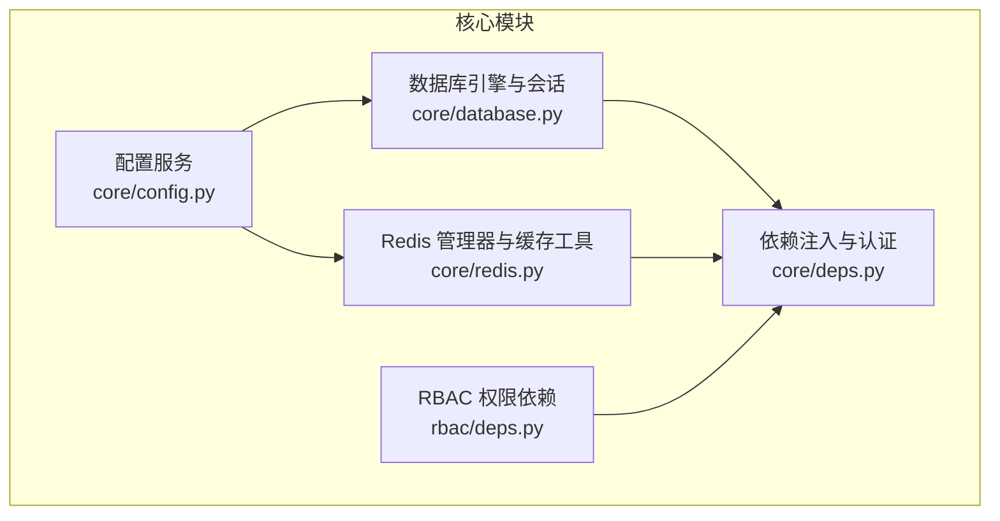
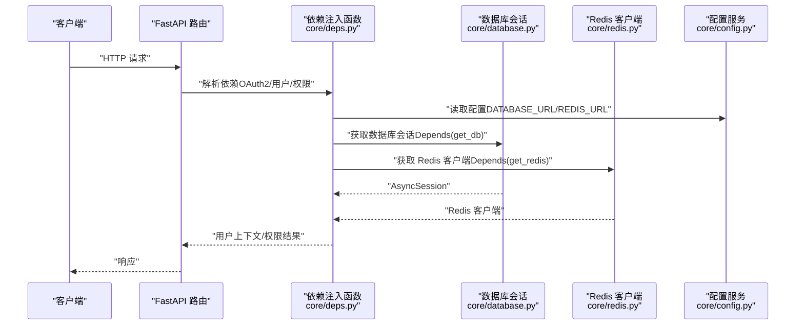
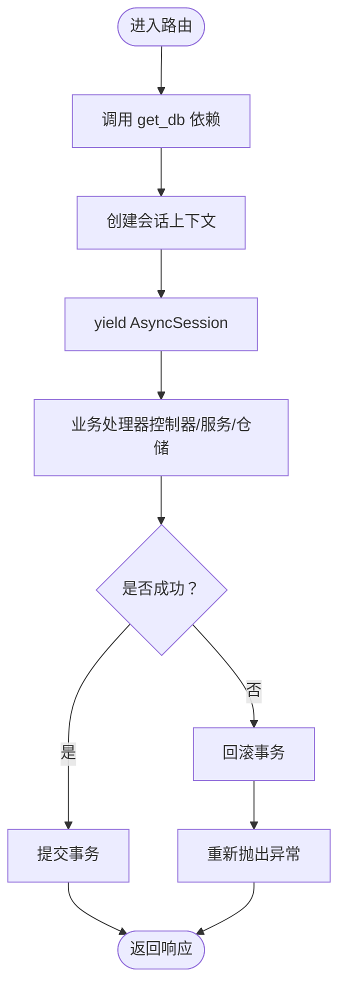
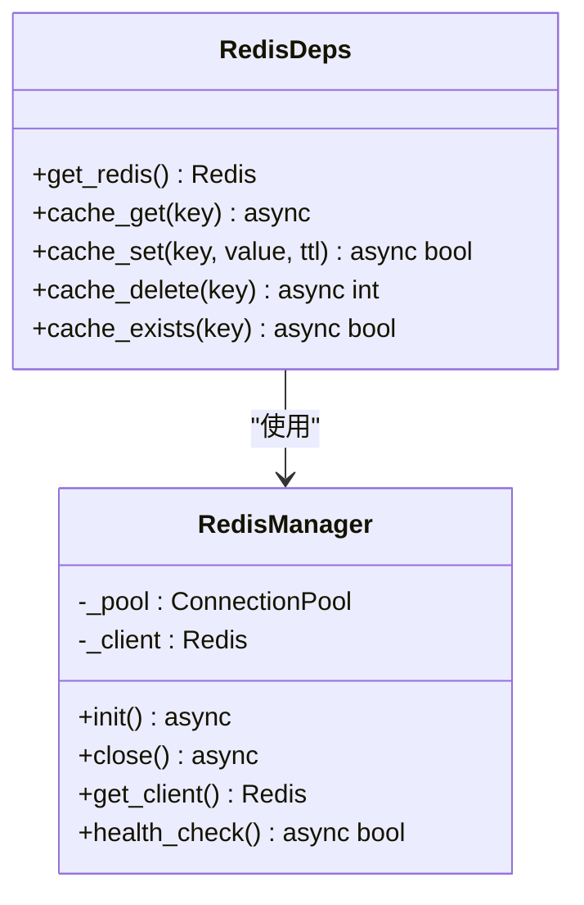
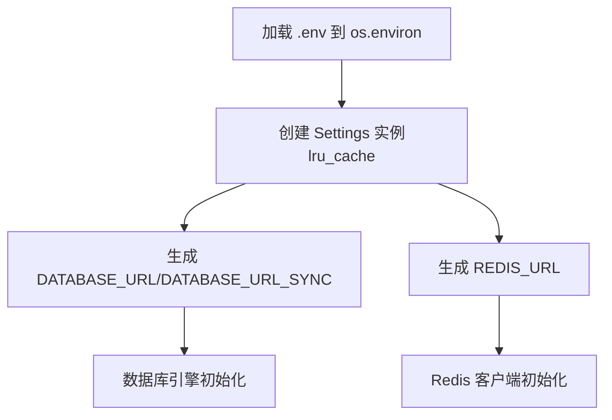
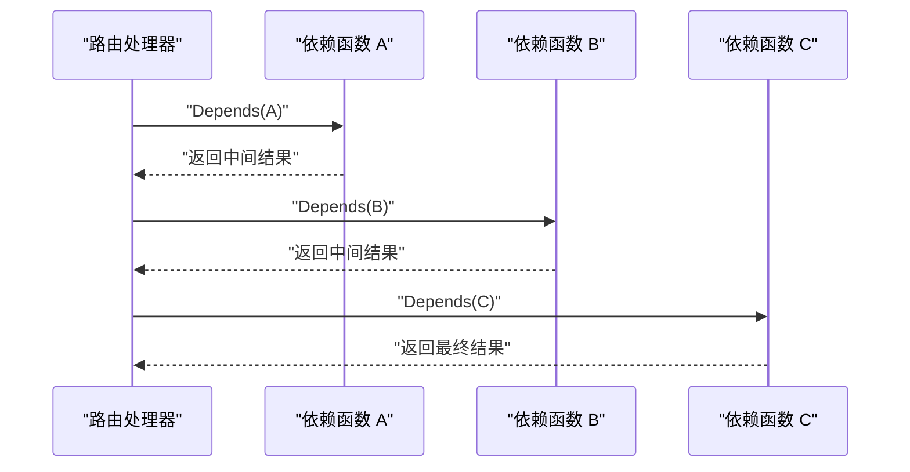
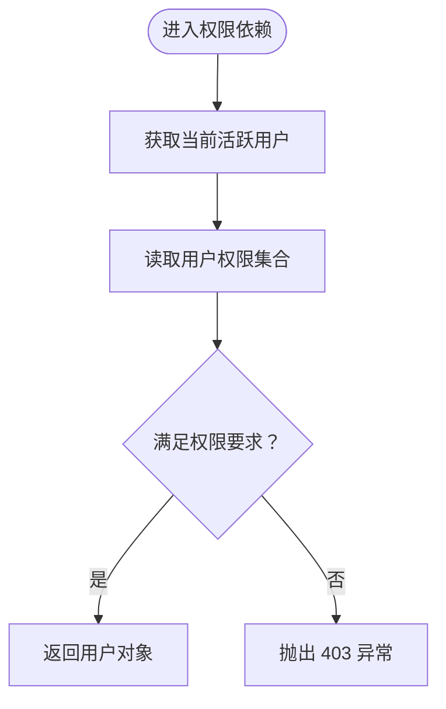
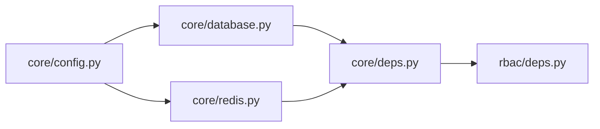

# 依赖注入系统

<cite>
**本文引用的文件**
- [deps.py](file://backend/app/core/deps.py)
- [database.py](file://backend/app/core/database.py)
- [redis.py](file://backend/app/core/redis.py)
- [config.py](file://backend/app/core/config.py)
- [deps.py](file://backend/app/rbac/deps.py)
</cite>

## 目录
1. [简介](#简介)
2. [项目结构](#项目结构)
3. [核心组件](#核心组件)
4. [架构总览](#架构总览)
5. [详细组件分析](#详细组件分析)
6. [依赖关系分析](#依赖关系分析)
7. [性能考量](#性能考量)
8. [故障排查指南](#故障排查指南)
9. [结论](#结论)

## 简介
本文件系统化梳理 NovusAI SaaS 后端的依赖注入体系，重点覆盖以下方面：
- FastAPI 依赖注入的使用模式与最佳实践
- 数据库会话管理（异步 SQLAlchemy 会话）
- Redis 连接管理与缓存工具
- 配置服务的依赖注入与类型安全
- 依赖函数的设计原则、参数传递与作用域
- 异步依赖与条件依赖的处理方式
- 在控制器、服务层与仓储层的应用模式
- 自定义依赖开发指南与性能优化建议

## 项目结构
本项目的依赖注入主要集中在 core 层的三个模块：
- 核心依赖注入与认证：core/deps.py
- 数据库引擎与会话工厂：core/database.py
- Redis 连接池与缓存工具：core/redis.py
- 配置服务：core/config.py
- RBAC 权限依赖：rbac/deps.py

图表来源
- [config.py:1-305](file://backend/app/core/config.py#L1-L305)
- [database.py:1-680](file://backend/app/core/database.py#L1-L680)
- [redis.py:1-116](file://backend/app/core/redis.py#L1-L116)
- [deps.py:1-363](file://backend/app/core/deps.py#L1-L363)
- [deps.py:1-166](file://backend/app/rbac/deps.py#L1-L166)

章节来源
- [deps.py:1-363](file://backend/app/core/deps.py#L1-L363)
- [database.py:1-680](file://backend/app/core/database.py#L1-L680)
- [redis.py:1-116](file://backend/app/core/redis.py#L1-L116)
- [config.py:1-305](file://backend/app/core/config.py#L1-L305)
- [deps.py:1-166](file://backend/app/rbac/deps.py#L1-L166)

## 核心组件
- 数据库会话工厂与依赖注入
  - 异步数据库引擎与会话工厂：提供连接池配置与生命周期管理
  - 会话上下文管理器：自动提交/回滚，确保请求级事务一致性
  - FastAPI 依赖注入函数：在路由层按需注入 AsyncSession
- Redis 连接池与缓存工具
  - 连接池管理器：集中初始化、健康检查与关闭
  - 缓存工具函数：序列化/反序列化、TTL 设置、存在性判断
- 配置服务
  - 统一的 Settings 单例：提供数据库、Redis、Celery、日志等配置项
  - 环境变量与 .env 加载策略：确保跨目录启动的一致性
- 依赖注入与认证
  - OAuth2 密码流方案：平台管理员、企业管理员、企业业务用户三套凭据
  - 当前用户解析：令牌校验、作用域匹配、账户状态与租户有效性检查
  - 类型别名：DbSession、RedisClient、CurrentAdmin 等，提升类型安全与复用性
- RBAC 权限依赖
  - 接口级权限守卫：要求管理员或企业管理员具备特定权限集合
  - 支持“全部满足”与“任一满足”的权限策略

章节来源
- [database.py:65-102](file://backend/app/core/database.py#L65-L102)
- [database.py:135-158](file://backend/app/core/database.py#L135-L158)
- [redis.py:19-78](file://backend/app/core/redis.py#L19-L78)
- [redis.py:89-116](file://backend/app/core/redis.py#L89-L116)
- [config.py:29-305](file://backend/app/core/config.py#L29-L305)
- [deps.py:42-58](file://backend/app/core/deps.py#L42-L58)
- [deps.py:80-131](file://backend/app/core/deps.py#L80-L131)
- [deps.py:153-217](file://backend/app/core/deps.py#L153-L217)
- [deps.py:241-305](file://backend/app/core/deps.py#L241-L305)
- [deps.py:312-330](file://backend/app/core/deps.py#L312-L330)
- [deps.py:24-155](file://backend/app/rbac/deps.py#L24-L155)

## 架构总览
依赖注入在本项目中的典型流转如下：
- 配置服务提供数据库与 Redis 连接参数
- 数据库模块创建异步引擎与会话工厂，并暴露 get_db 依赖
- Redis 模块提供连接池与全局客户端，暴露 get_redis 依赖
- 核心 deps 模块组合上述依赖，实现认证与权限解析
- RBAC 模块基于 deps 提供的用户上下文与数据库会话，进行权限校验

图表来源
- [deps.py:1-363](file://backend/app/core/deps.py#L1-L363)
- [database.py:65-102](file://backend/app/core/database.py#L65-L102)
- [redis.py:19-78](file://backend/app/core/redis.py#L19-L78)
- [config.py:29-305](file://backend/app/core/config.py#L29-L305)

## 详细组件分析

### 数据库会话管理（异步 SQLAlchemy）
- 设计要点
  - 异步引擎与会话工厂：集中配置连接池大小、溢出与超时
  - 上下文管理器：在请求结束时自动提交；异常或取消时自动回滚
  - FastAPI 依赖注入：在路由层以 Depends(get_db) 注入 AsyncSession
- 处理逻辑
  - 正常流程：yield 会话 → 业务处理 → 提交
  - 异常流程：捕获 BaseException → 若处于事务中则回滚 → 重新抛出
- 适用场景
  - 控制器：直接注入 AsyncSession，无需手动开启/关闭
  - 服务层：接收会话作为参数，便于单元测试替换
  - 仓储层：使用传入的会话执行 ORM 操作

图表来源
- [database.py:84-102](file://backend/app/core/database.py#L84-L102)
- [database.py:135-146](file://backend/app/core/database.py#L135-L146)

章节来源
- [database.py:65-102](file://backend/app/core/database.py#L65-L102)
- [database.py:135-158](file://backend/app/core/database.py#L135-L158)

### Redis 连接管理与缓存工具
- 设计要点
  - RedisManager：集中管理连接池与全局客户端，提供 ping 健康检查与关闭
  - get_redis：FastAPI 依赖注入函数，返回全局 Redis 客户端
  - 缓存工具：cache_get/cache_set/cache_delete/cache_exists，统一序列化策略
- 处理逻辑
  - 初始化：从配置构建连接 URL，创建连接池与客户端，执行 ping
  - 使用：在依赖中注入 Redis 客户端，按需读写缓存
  - 关闭：应用关闭时释放连接池与客户端
- 适用场景
  - 控制器：读取/写入缓存键值
  - 服务层：封装缓存策略，避免重复序列化
  - 仓储层：缓存查询结果或热点数据

图表来源
- [redis.py:19-78](file://backend/app/core/redis.py#L19-L78)
- [redis.py:76-116](file://backend/app/core/redis.py#L76-L116)

章节来源
- [redis.py:19-78](file://backend/app/core/redis.py#L19-L78)
- [redis.py:76-116](file://backend/app/core/redis.py#L76-L116)

### 配置服务（Settings 单例）
- 设计要点
  - 基于 pydantic-settings 的 Settings 类，支持 .env 与环境变量
  - 统一的 DATABASE_URL/DATABASE_URL_SYNC 与 REDIS_URL 生成器
  - lru_cache 单例：确保全局唯一配置实例
- 处理逻辑
  - 启动时加载 .env 至 os.environ，避免因工作目录不同导致加载失败
  - 通过属性方法动态拼接连接 URL，减少硬编码
- 适用场景
  - 数据库引擎初始化：传入 DATABASE_URL
  - Redis 客户端初始化：传入 REDIS_URL
  - 其他组件：读取日志、分页、SSL 等配置

图表来源
- [config.py:16-305](file://backend/app/core/config.py#L16-L305)

章节来源
- [config.py:16-305](file://backend/app/core/config.py#L16-L305)

### 依赖函数设计原则与参数传递
- 设计原则
  - 作用域最小化：每个依赖函数聚焦单一职责（如获取会话、解析用户、权限校验）
  - 可组合性：通过 Depends 组合多个依赖，形成链式解析
  - 类型安全：使用 Annotated 类型别名，提升 IDE 支持与可读性
  - 异步优先：所有 IO 密集型依赖均采用 async/await
- 参数传递机制
  - 依赖函数参数：通过 Depends 注入其他依赖函数的结果
  - 返回值：作为后续依赖或路由处理器的输入
  - 作用域：FastAPI 保证同一请求内的依赖实例一致
- 异步依赖与条件依赖
  - 异步依赖：数据库会话、Redis 客户端、令牌校验均为异步
  - 条件依赖：根据用户角色与权限动态决定是否继续解析

图表来源
- [deps.py:80-131](file://backend/app/core/deps.py#L80-L131)
- [deps.py:153-217](file://backend/app/core/deps.py#L153-L217)
- [deps.py:241-305](file://backend/app/core/deps.py#L241-L305)

章节来源
- [deps.py:80-131](file://backend/app/core/deps.py#L80-L131)
- [deps.py:153-217](file://backend/app/core/deps.py#L153-L217)
- [deps.py:241-305](file://backend/app/core/deps.py#L241-L305)

### RBAC 权限依赖
- 设计要点
  - require_admin_permissions / require_any_admin_permission
  - require_tenant_admin_permissions / require_any_tenant_admin_permission
  - 基于 PermissionService 读取用户权限并进行集合运算
- 处理逻辑
  - 依赖 get_db 与当前活跃用户
  - 读取用户权限集合，判断是否满足“全部满足/任一满足”
  - 不满足则抛出 403 异常
- 适用场景
  - 管理端接口：限制平台管理员操作范围
  - 租户端接口：限制企业管理员操作范围

图表来源
- [deps.py:24-155](file://backend/app/rbac/deps.py#L24-L155)

章节来源
- [deps.py:24-155](file://backend/app/rbac/deps.py#L24-L155)

### 在控制器、服务层与仓储层的应用模式
- 控制器（API 层）
  - 直接注入 DbSession、RedisClient、当前用户对象
  - 通过 RBAC 依赖限制接口访问
- 服务层（业务层）
  - 接收 DbSession 作为参数，便于测试与事务边界控制
  - 通过缓存工具函数封装热点数据读写
- 仓储层（数据访问层）
  - 使用传入的会话执行 ORM 操作
  - 结合缓存工具进行查询结果缓存

章节来源
- [deps.py:312-330](file://backend/app/core/deps.py#L312-L330)
- [deps.py:24-155](file://backend/app/rbac/deps.py#L24-L155)
- [redis.py:89-116](file://backend/app/core/redis.py#L89-L116)

## 依赖关系分析
- 组件耦合
  - deps 依赖 database 与 redis 提供的基础能力
  - rbac 依赖 deps 提供的用户上下文与数据库会话
  - database 与 redis 依赖 config 提供的连接参数
- 外部依赖
  - SQLAlchemy 异步引擎与会话
  - redis.asyncio 连接池与客户端
  - pydantic-settings 配置解析
- 循环依赖
  - 未发现循环依赖；各模块职责清晰、单向依赖

图表来源
- [config.py:1-305](file://backend/app/core/config.py#L1-L305)
- [database.py:1-680](file://backend/app/core/database.py#L1-L680)
- [redis.py:1-116](file://backend/app/core/redis.py#L1-L116)
- [deps.py:1-363](file://backend/app/core/deps.py#L1-L363)
- [deps.py:1-166](file://backend/app/rbac/deps.py#L1-L166)

章节来源
- [config.py:1-305](file://backend/app/core/config.py#L1-L305)
- [database.py:1-680](file://backend/app/core/database.py#L1-L680)
- [redis.py:1-116](file://backend/app/core/redis.py#L1-L116)
- [deps.py:1-363](file://backend/app/core/deps.py#L1-L363)
- [deps.py:1-166](file://backend/app/rbac/deps.py#L1-L166)

## 性能考量
- 连接池与超时
  - 数据库连接池：合理设置 pool_size、max_overflow 与 pool_timeout，避免高并发下的连接争用
  - Redis 连接池：固定最大连接数，启用 retry_on_timeout，缩短 socket 超时时间
- 事务与回滚
  - 使用 managed_async_session 确保异常时自动回滚，避免脏数据
- 缓存策略
  - TTL 合理设置，避免缓存击穿与雪崩
  - 对热点数据使用 cache_get/cache_set，减少数据库压力
- 异步与并发
  - 依赖函数尽量保持无阻塞；IO 操作统一使用异步客户端
- 启动与健康检查
  - 启动时进行数据库与 Redis 健康检查，失败时记录详细原因以便快速定位

## 故障排查指南
- 数据库连接失败
  - 检查 DATABASE_URL 与网络连通性
  - 查看启动日志中的连接提示与错误堆栈
  - 使用 check_database_connection 验证连接
- Redis 连接失败
  - 检查 REDIS_URL、密码与网络连通性
  - 使用 RedisManager.health_check 判断可用性
  - 关注连接池最大连接数与超时设置
- 权限拒绝
  - 确认用户角色与权限集合
  - 检查 RBAC 依赖的权限策略（全部满足 vs 任一满足）
- 依赖注入异常
  - 确认依赖函数的 Depends 顺序与类型别名
  - 检查 get_db 与 get_redis 的作用域是否匹配请求生命周期

章节来源
- [database.py:218-234](file://backend/app/core/database.py#L218-L234)
- [redis.py:67-74](file://backend/app/core/redis.py#L67-L74)
- [deps.py:24-155](file://backend/app/rbac/deps.py#L24-L155)

## 结论
本项目的依赖注入体系以 core 模块为核心，围绕配置、数据库与 Redis 三大基础设施构建了清晰、可扩展且高性能的依赖链路。通过类型别名与异步依赖，实现了强类型、低耦合与高可维护性。RBAC 权限依赖进一步将接口级安全控制与业务逻辑解耦。建议在新增功能时遵循现有模式：先定义依赖函数，再在控制器中组合使用，最后在服务/仓储层以参数形式接收，确保测试友好与性能可控。