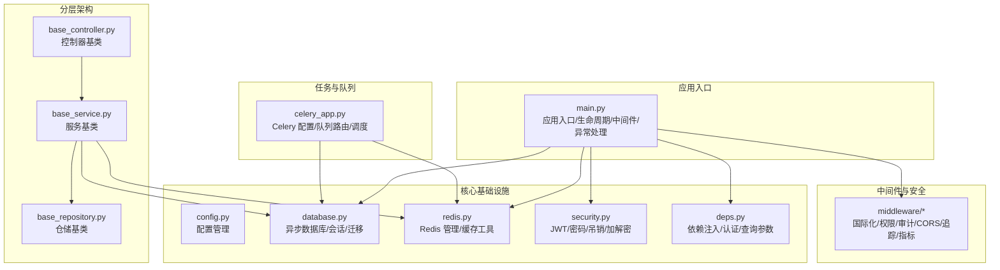
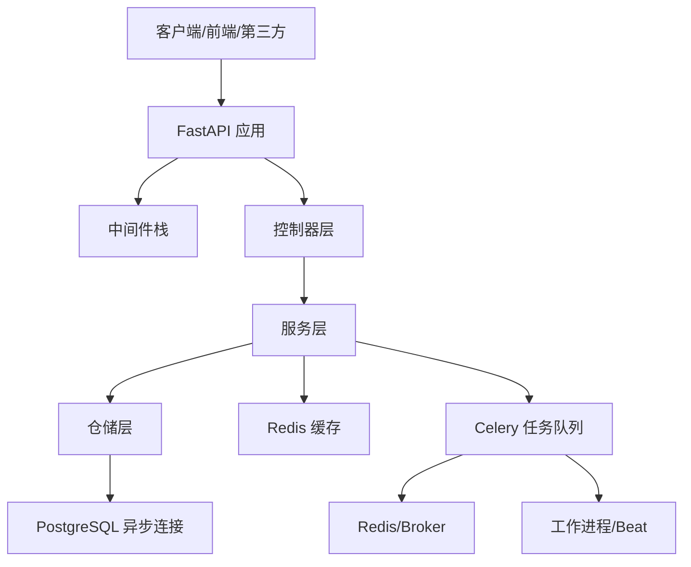
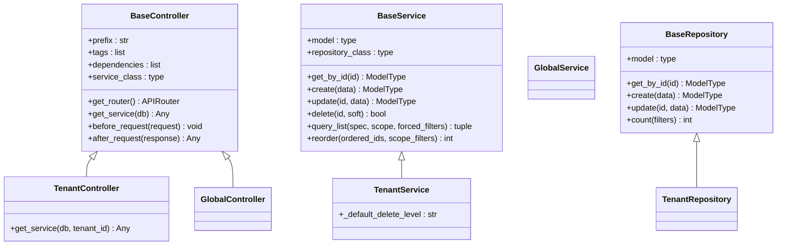
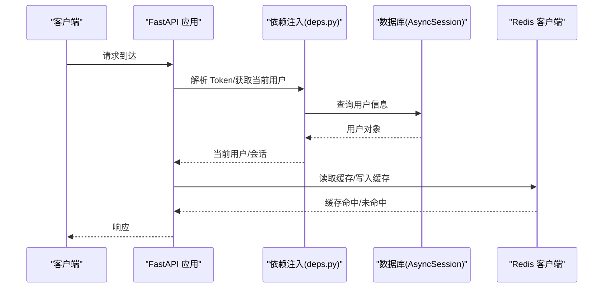
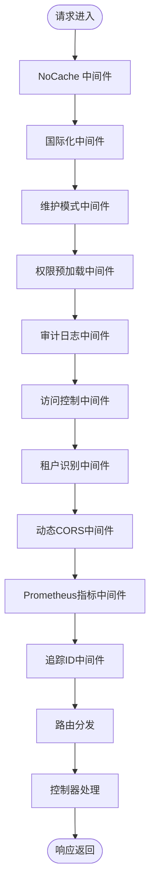
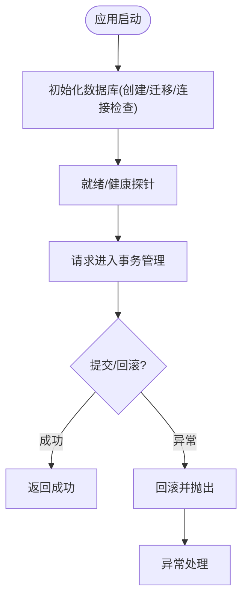
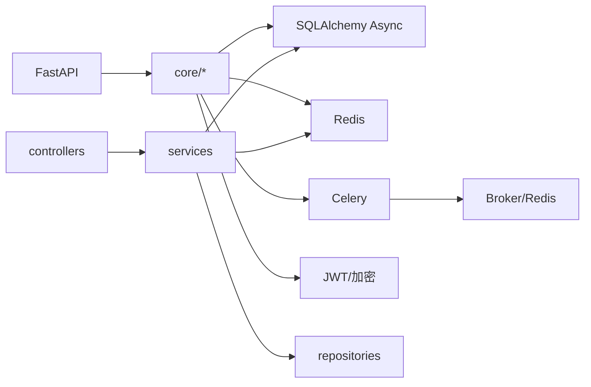

# 后端架构设计

<cite>
**本文档引用的文件**
- [main.py](file://backend/app/main.py)
- [celery_app.py](file://backend/app/celery_app.py)
- [database.py](file://backend/app/core/database.py)
- [base_controller.py](file://backend/app/core/base_controller.py)
- [base_service.py](file://backend/app/core/base_service.py)
- [base_repository.py](file://backend/app/core/base_repository.py)
- [deps.py](file://backend/app/core/deps.py)
- [security.py](file://backend/app/core/security.py)
- [redis.py](file://backend/app/core/redis.py)
- [config.py](file://backend/app/core/config.py)
- [pyproject.toml](file://backend/pyproject.toml)
- [__init__.py](file://backend/app/middleware/__init__.py)
</cite>

## 目录
1. [引言](#引言)
2. [项目结构](#项目结构)
3. [核心组件](#核心组件)
4. [架构总览](#架构总览)
5. [详细组件分析](#详细组件分析)
6. [依赖分析](#依赖分析)
7. [性能考虑](#性能考虑)
8. [故障排查指南](#故障排查指南)
9. [结论](#结论)
10. [附录](#附录)

## 引言
本文件面向 NovusAI SaaS 后端，系统化阐述基于 FastAPI 的现代化后端架构设计，涵盖 MVC 分层、依赖注入、异步编程、中间件、异常处理、安全策略、数据库与事务、缓存与任务队列、以及可扩展性与开发规范。文档以代码为依据，配合可视化图表帮助读者快速理解系统设计与实现。

## 项目结构
后端采用模块化分层组织，围绕 FastAPI 应用入口、核心基础设施（数据库、Redis、配置）、控制器-服务-仓储三层架构、中间件与安全模块、任务队列（Celery）以及插件生态展开。关键目录职责概览：
- app/main.py：应用入口、生命周期管理、中间件注册、异常处理器、就绪/健康探针
- app/core/*：核心基础设施与通用基类（数据库、Redis、配置、安全、依赖注入、仓储基类等）
- app/api/*：按租户/公共/共享划分的 API 路由层
- app/services/*：业务逻辑层，封装领域服务与事务边界
- app/repositories/*：数据访问层，封装 CRUD、查询、回收站、排序、过滤等能力
- app/middleware/*：中间件模块（国际化、权限、审计、CORS、追踪、指标等）
- app/tasks/*：任务队列与定时任务
- app/celery_app.py：Celery 应用配置与队列路由
- backend/pyproject.toml：依赖与工具链配置

**图表来源**
- [main.py:635-800](file://backend/app/main.py#L635-L800)
- [database.py:65-120](file://backend/app/core/database.py#L65-L120)
- [redis.py:19-74](file://backend/app/core/redis.py#L19-L74)
- [security.py:38-116](file://backend/app/core/security.py#L38-L116)
- [deps.py:61-73](file://backend/app/core/deps.py#L61-L73)
- [base_controller.py:33-86](file://backend/app/core/base_controller.py#L33-L86)
- [base_service.py:40-64](file://backend/app/core/base_service.py#L40-L64)
- [base_repository.py:25-45](file://backend/app/core/base_repository.py#L25-L45)
- [celery_app.py:20-106](file://backend/app/celery_app.py#L20-L106)

**章节来源**
- [main.py:635-800](file://backend/app/main.py#L635-L800)
- [pyproject.toml:23-110](file://backend/pyproject.toml#L23-L110)

## 核心组件
- 应用入口与生命周期：负责日志初始化、数据库/Redis/插件/配置/权限等启动流程，提供就绪/健康探针与 Prometheus 指标刷新。
- 数据库与会话：基于 SQLAlchemy AsyncEngine/AsyncSession，提供托管会话、连接池、迁移与连接检查。
- Redis 管理：连接池管理、健康检查、缓存工具函数。
- 安全与认证：JWT 生成/验证、密码哈希、Token 黑名单、一键登录、加密工具。
- 依赖注入：数据库会话、Redis 客户端、多角色认证依赖、查询参数解析。
- 分层架构基类：控制器基类（路由注册、权限注入、资源注入）、服务基类（CRUD、回收站、排序、依赖保护）、仓储基类（组合混入实现 CRUD/查询/过滤/排序/回收站/租户作用域）。
- 中间件：国际化、权限预加载、审计日志、访问控制、动态 CORS、维护模式、追踪 ID、Prometheus 指标。
- 任务队列：Celery 多队列路由、优先级、任务自动发现、Beat 调度（持久化调度器）。

**章节来源**
- [main.py:53-272](file://backend/app/main.py#L53-L272)
- [database.py:65-120](file://backend/app/core/database.py#L65-L120)
- [redis.py:19-74](file://backend/app/core/redis.py#L19-L74)
- [security.py:38-116](file://backend/app/core/security.py#L38-L116)
- [deps.py:61-362](file://backend/app/core/deps.py#L61-L362)
- [base_controller.py:33-86](file://backend/app/core/base_controller.py#L33-L86)
- [base_service.py:40-64](file://backend/app/core/base_service.py#L40-L64)
- [base_repository.py:25-45](file://backend/app/core/base_repository.py#L25-L45)
- [celery_app.py:20-106](file://backend/app/celery_app.py#L20-L106)

## 架构总览
系统采用 FastAPI 作为 Web 框架，结合 SQLAlchemy 异步 ORM、Redis 缓存、Celery 任务队列与插件化扩展，形成“控制器-服务-仓储-数据访问”的分层架构。中间件贯穿请求生命周期，统一处理国际化、权限、审计、CORS、追踪与指标。安全模块提供多角色认证与 Token 生命周期管理。

**图表来源**
- [main.py:635-702](file://backend/app/main.py#L635-L702)
- [database.py:65-82](file://backend/app/core/database.py#L65-L82)
- [redis.py:19-74](file://backend/app/core/redis.py#L19-L74)
- [celery_app.py:20-106](file://backend/app/celery_app.py#L20-L106)

## 详细组件分析

### MVC 架构与分层设计
- 控制器层（BaseController）：通过类方法定义路由，结合权限装饰器自动注册权限；支持单例路由器、资源注入与动作权限扫描。
- 服务层（BaseService）：封装通用 CRUD、分页、回收站、排序、依赖保护与级联操作；面向业务场景提供钩子方法扩展。
- 仓储层（BaseRepository）：组合混入实现 CRUD、查询、过滤、排序、回收站、数据权限与租户作用域。

**图表来源**
- [base_controller.py:33-86](file://backend/app/core/base_controller.py#L33-L86)
- [base_service.py:40-64](file://backend/app/core/base_service.py#L40-L64)
- [base_repository.py:25-45](file://backend/app/core/base_repository.py#L25-L45)

**章节来源**
- [base_controller.py:33-86](file://backend/app/core/base_controller.py#L33-L86)
- [base_service.py:40-64](file://backend/app/core/base_service.py#L40-L64)
- [base_repository.py:25-45](file://backend/app/core/base_repository.py#L25-L45)

### 依赖注入与异步编程
- 数据库会话：通过 managed_async_session 提供托管事务（成功提交、异常回滚），get_db 作为 FastAPI 依赖注入。
- Redis 客户端：RedisManager 提供全局连接池与客户端，get_redis 作为依赖注入。
- 多角色认证：OAuth2PasswordBearer 三套 Token 流程，结合 verify_token_with_scope 与模型查询获取当前用户。
- 异步特性：数据库、Redis、任务队列均采用异步实现，生命周期管理与就绪探针均支持异步。

**图表来源**
- [deps.py:61-73](file://backend/app/core/deps.py#L61-L73)
- [database.py:84-102](file://backend/app/core/database.py#L84-L102)
- [redis.py:76-82](file://backend/app/core/redis.py#L76-L82)

**章节来源**
- [deps.py:61-362](file://backend/app/core/deps.py#L61-L362)
- [database.py:84-102](file://backend/app/core/database.py#L84-L102)
- [redis.py:76-82](file://backend/app/core/redis.py#L76-L82)

### API 路由设计与中间件架构
- 路由注册：控制器基类懒加载创建 APIRouter，注册路由并注入资源与动作权限。
- 中间件注册顺序：NoCache、I18n、Maintenance、Permission、AuditLog、AccessControl、Tenant、DynamicCORS、Prometheus、TraceId。
- 异常处理：AppException、RequestValidationError、StarletteHTTPException、全局异常，统一返回业务错误码与调试信息。

**图表来源**
- [main.py:660-702](file://backend/app/main.py#L660-L702)
- [__init__.py:7-16](file://backend/app/middleware/__init__.py#L7-L16)

**章节来源**
- [main.py:660-781](file://backend/app/main.py#L660-L781)
- [__init__.py:7-16](file://backend/app/middleware/__init__.py#L7-L16)

### 异常处理机制
- AppException：统一业务异常，返回业务错误码与消息。
- RequestValidationError：格式化字段级错误，返回标准化错误数组。
- StarletteHTTPException：映射常见 HTTP 状态码到业务错误码，按级别返回公开或内部消息。
- 全局异常：记录未捕获异常，返回服务器错误与调试信息（受调试开关控制）。

**章节来源**
- [main.py:715-798](file://backend/app/main.py#L715-L798)

### 安全策略
- JWT 签发与验证：支持 access/refresh/impersonate 三种类型，scope 限定用户角色，支持过期与黑名单检查。
- 密码哈希：bcrypt 实现安全存储。
- Token 黑名单：Redis 存储吊销 JTI，支持吊销与查询。
- 一键登录：平台/企业管理员可签发短期 impersonate Token 登录目标角色。
- 加密工具：基于 Fernet 的对称加密，密钥派生于 SECRET_KEY。

**章节来源**
- [security.py:38-116](file://backend/app/core/security.py#L38-L116)
- [security.py:127-177](file://backend/app/core/security.py#L127-L177)
- [security.py:216-273](file://backend/app/core/security.py#L216-L273)
- [security.py:329-357](file://backend/app/core/security.py#L329-L357)
- [security.py:448-476](file://backend/app/core/security.py#L448-L476)

### 数据库设计模式与事务管理
- 异步 ORM：AsyncEngine/AsyncSession，连接池配置与 pre-ping。
- 事务语义：managed_async_session 提供“成功提交、异常回滚”，包括取消（Ctrl+C）场景。
- 迁移：Alembic 子进程执行，支持多版本位置与重载 bytecode 清理。
- 连接检查：启动时与就绪探针中进行数据库与 Redis 健康检查。

**图表来源**
- [main.py:87-106](file://backend/app/main.py#L87-L106)
- [database.py:84-102](file://backend/app/core/database.py#L84-L102)
- [database.py:608-653](file://backend/app/core/database.py#L608-L653)

**章节来源**
- [database.py:65-82](file://backend/app/core/database.py#L65-L82)
- [database.py:84-102](file://backend/app/core/database.py#L84-L102)
- [database.py:608-653](file://backend/app/core/database.py#L608-L653)

### 任务队列架构与缓存策略
- Celery 配置：多队列（default/high_priority/ai_gateway/scheduled/notification），路由规则与任务自动发现。
- 任务生命周期：worker/beat 进程初始化、插件队列扩展恢复、结果后端与过期策略。
- 缓存策略：Redis 缓存工具函数（序列化/反序列化、TTL、存在性检查），AI 响应缓存 TTL（温度=0 时生效）。

**章节来源**
- [celery_app.py:20-106](file://backend/app/celery_app.py#L20-L106)
- [celery_app.py:117-187](file://backend/app/celery_app.py#L117-L187)
- [redis.py:89-116](file://backend/app/core/redis.py#L89-L116)
- [config.py:148-150](file://backend/app/core/config.py#L148-L150)

## 依赖分析
- 外部依赖：FastAPI、Uvicorn、SQLAlchemy Async、asyncpg、Alembic、Redis、Celery、Pydantic、JW3、bcrypt、httpx、SocketIO、Prometheus、ACME、图像/文档处理等。
- 内部依赖：核心模块之间耦合低，通过依赖注入与接口契约松耦合；控制器依赖服务，服务依赖仓储与数据库/Redis；中间件与控制器解耦。

**图表来源**
- [pyproject.toml:23-110](file://backend/pyproject.toml#L23-L110)
- [main.py:635-702](file://backend/app/main.py#L635-L702)

**章节来源**
- [pyproject.toml:23-110](file://backend/pyproject.toml#L23-L110)

## 性能考虑
- 异步 I/O：数据库与 Redis 均为异步实现，减少阻塞。
- 连接池：数据库连接池与 Redis 连接池参数可调，避免高并发下的连接争用。
- 缓存：Redis 缓存热点数据与 AI 响应（温度=0），降低重复计算与数据库压力。
- 任务队列：多队列与优先级路由，保障高优先级任务及时处理。
- 就绪/健康探针：主动刷新 Prometheus 指标，避免仅依赖副作用导致的延迟。

[本节为通用指导，无需特定文件引用]

## 故障排查指南
- 启动失败：检查数据库连接、Redis 可用性、插件发现与恢复、配置同步；生产环境需替换默认密钥。
- 数据库问题：确认迁移是否成功、Alembic 子进程输出、连接池参数与 pre-ping 设置。
- Token 异常：检查签名算法、SECRET_KEY、过期时间、黑名单状态。
- 缓存异常：确认 Redis 连接、TTL 设置、序列化/反序列化。
- 任务失败：检查队列路由、worker/beat 进程状态、插件队列扩展恢复。

**章节来源**
- [main.py:70-106](file://backend/app/main.py#L70-L106)
- [database.py:218-234](file://backend/app/core/database.py#L218-L234)
- [security.py:127-177](file://backend/app/core/security.py#L127-L177)
- [redis.py:89-116](file://backend/app/core/redis.py#L89-L116)
- [celery_app.py:117-187](file://backend/app/celery_app.py#L117-L187)

## 结论
本架构以 FastAPI 为核心，结合异步数据库、Redis 缓存与 Celery 任务队列，形成清晰的分层与职责分离。通过中间件统一治理、安全模块严格管控、依赖注入与泛型基类提升可扩展性，满足 SaaS 场景下的多租户、高并发与可运维需求。建议在生产环境中完善监控告警、限流熔断与灾备策略，并持续优化缓存与任务路由策略。

[本节为总结，无需特定文件引用]

## 附录
- 开发规范要点：使用 pydantic 校验、类型注解、异步函数、依赖注入、中间件顺序与职责单一、异常统一处理、日志分级与可观测性。
- 扩展性设计：插件化扩展、多队列路由、持久化调度器、仓储混入组合、服务钩子与回收站策略。

[本节为通用指导，无需特定文件引用]