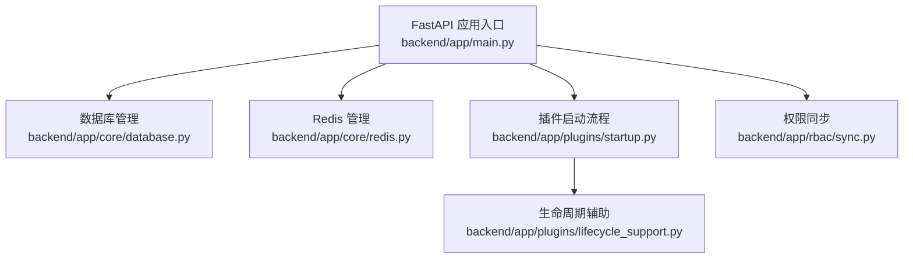
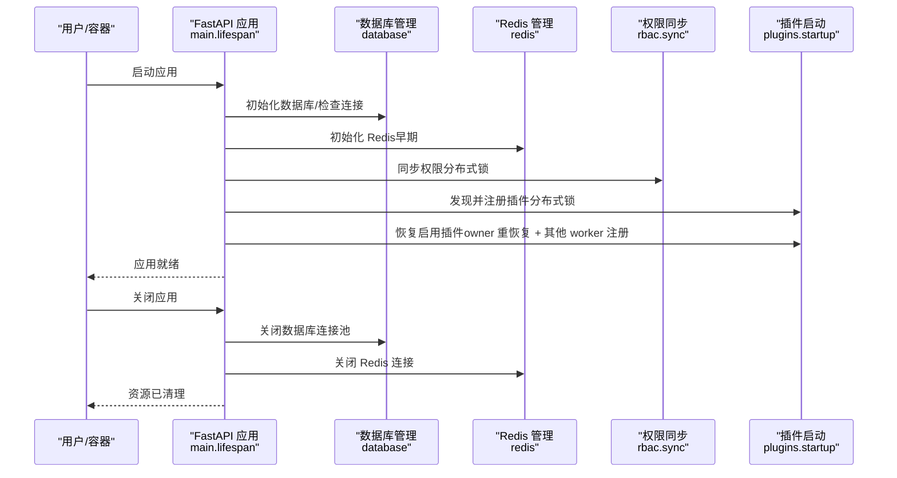
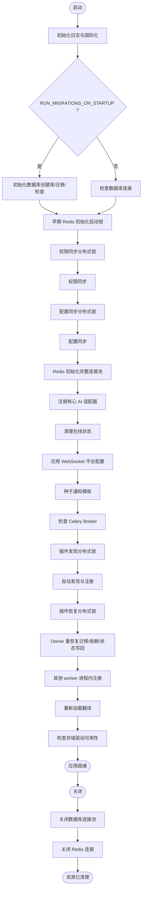
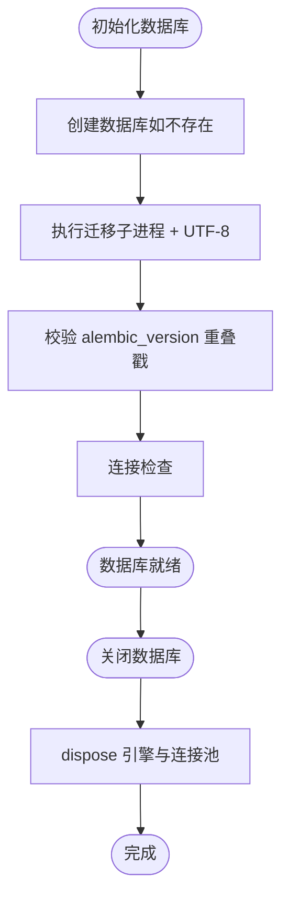
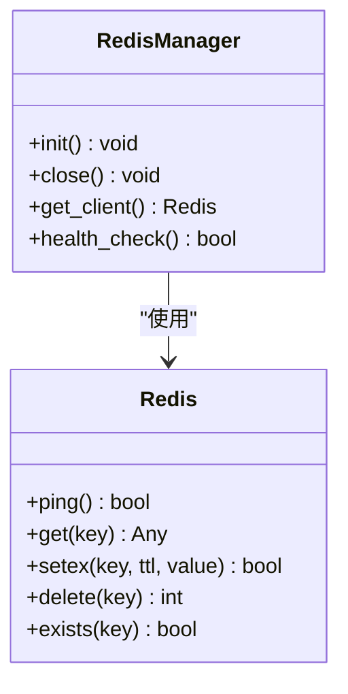
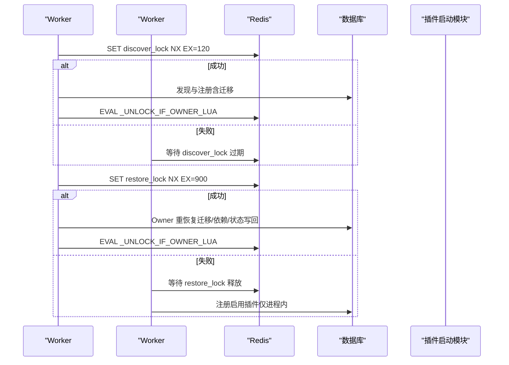
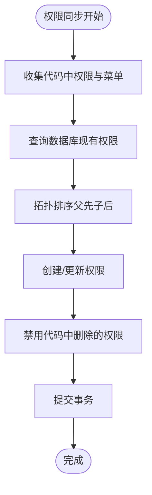
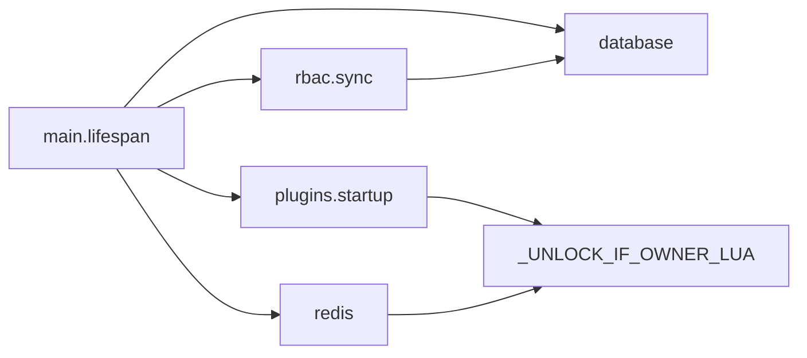

# 应用生命周期管理

<cite>
**本文档引用的文件**
- [backend/app/main.py](file://backend/app/main.py)
- [backend/app/plugins/startup.py](file://backend/app/plugins/startup.py)
- [backend/app/core/database.py](file://backend/app/core/database.py)
- [backend/app/core/redis.py](file://backend/app/core/redis.py)
- [backend/app/plugins/lifecycle_support.py](file://backend/app/plugins/lifecycle_support.py)
- [backend/app/rbac/sync.py](file://backend/app/rbac/sync.py)
</cite>

## 目录
1. [引言](#引言)
2. [项目结构](#项目结构)
3. [核心组件](#核心组件)
4. [架构总览](#架构总览)
5. [详细组件分析](#详细组件分析)
6. [依赖分析](#依赖分析)
7. [性能考虑](#性能考虑)
8. [故障排除指南](#故障排除指南)
9. [结论](#结论)

## 引言
本文件面向 NovusAI SaaS 的应用生命周期管理，聚焦 FastAPI 应用的启动与关闭流程，涵盖数据库初始化、Redis 连接、插件系统启动、权限同步等关键步骤。文档还解释了应用生命周期上下文管理器的工作原理（异步资源管理、错误处理与优雅关闭）、分布式锁机制（插件发现与恢复过程中的 Redis 锁使用）、关闭阶段的资源清理流程（数据库连接池与 Redis 连接释放），并提供启动失败的故障排除指南与监控指标收集方法。

## 项目结构
- 应用入口与生命周期管理集中在应用入口文件中，通过 FastAPI 的 lifespan 生命周期钩子实现启动与关闭阶段的编排。
- 数据库与 Redis 的连接管理分别封装在独立模块中，提供统一的初始化、健康检查与关闭接口。
- 插件系统的自动发现与恢复逻辑位于插件启动模块，配合 Redis 分布式锁保障多工作进程下的幂等与一致性。
- 权限同步在启动阶段执行，确保权限定义与数据库一致。

图表来源
- [backend/app/main.py:635-800](file://backend/app/main.py#L635-L800)
- [backend/app/core/database.py:608-680](file://backend/app/core/database.py#L608-L680)
- [backend/app/core/redis.py:19-116](file://backend/app/core/redis.py#L19-L116)
- [backend/app/plugins/startup.py:125-683](file://backend/app/plugins/startup.py#L125-L683)
- [backend/app/plugins/lifecycle_support.py:15-21](file://backend/app/plugins/lifecycle_support.py#L15-L21)
- [backend/app/rbac/sync.py:489-508](file://backend/app/rbac/sync.py#L489-L508)

章节来源
- [backend/app/main.py:635-800](file://backend/app/main.py#L635-L800)

## 核心组件
- 应用生命周期上下文管理器（FastAPI lifespan）
  - 负责启动阶段的数据库初始化、Redis 初始化、权限与配置同步、插件自动发现与恢复、WebSocket 平台配置应用、通知模板种子数据、Celery Broker 连通性检查等。
  - 负责关闭阶段的数据库连接池与 Redis 连接释放。
- 数据库管理模块
  - 提供异步引擎与会话工厂、连接检查、数据库创建、迁移执行、关闭清理等能力。
- Redis 管理模块
  - 提供连接池与全局客户端、健康检查、缓存工具函数。
- 插件启动模块
  - 实现插件自动发现与注册、启用插件的恢复（扩展点注册、依赖安装、权限恢复等），并支持双阶段恢复以降低多工作进程竞争风险。
- 权限同步模块
  - 启动时将装饰器定义的权限与菜单同步至数据库，支持拓扑排序与父级关系处理。

章节来源
- [backend/app/main.py:53-502](file://backend/app/main.py#L53-L502)
- [backend/app/core/database.py:608-680](file://backend/app/core/database.py#L608-L680)
- [backend/app/core/redis.py:19-116](file://backend/app/core/redis.py#L19-L116)
- [backend/app/plugins/startup.py:125-683](file://backend/app/plugins/startup.py#L125-L683)
- [backend/app/rbac/sync.py:489-508](file://backend/app/rbac/sync.py#L489-L508)

## 架构总览
应用生命周期管理围绕 FastAPI 的 lifespan 钩子展开，启动阶段按顺序执行关键步骤，关闭阶段统一释放资源。插件系统通过 Redis 分布式锁确保多工作进程并发场景下的幂等与一致性。

图表来源
- [backend/app/main.py:53-502](file://backend/app/main.py#L53-L502)
- [backend/app/core/database.py:608-680](file://backend/app/core/database.py#L608-L680)
- [backend/app/core/redis.py:19-116](file://backend/app/core/redis.py#L19-L116)
- [backend/app/plugins/startup.py:125-683](file://backend/app/plugins/startup.py#L125-L683)
- [backend/app/rbac/sync.py:489-508](file://backend/app/rbac/sync.py#L489-L508)

## 详细组件分析

### 应用生命周期上下文管理器（FastAPI lifespan）
- 启动阶段
  - 日志与国际化初始化、运行时身份标签输出、生产环境密钥校验。
  - 数据库初始化或连接检查（可配置是否在启动时执行迁移）。
  - 早期 Redis 初始化（为后续分布式锁提供基础）。
  - 权限同步：使用 Redis SET NX 分布式锁，避免多工作进程并发导致的插入冲突。
  - 配置同步：同样使用 Redis 分布式锁，避免多工作进程并发写入配置。
  - Redis 初始化（完整连接池）。
  - 动态 CORS 缓存刷新、核心 AI 适配器注册、在线状态清理、WebSocket 平台配置应用、通知模板种子数据、Celery Broker 连通性检查。
  - 插件自动发现与恢复：两阶段流程，第一阶段发现与注册（含 Alembic 迁移），第二阶段 owner 执行重恢复（迁移/依赖安装/状态写回），其他 worker 仅进程内注册。
  - 插件恢复后重新加载翻译。
  - 存储驱动可用性检查。
- 关闭阶段
  - 关闭数据库连接池与同步引擎。
  - 关闭 Redis 连接池与客户端。

图表来源
- [backend/app/main.py:53-502](file://backend/app/main.py#L53-L502)

章节来源
- [backend/app/main.py:53-502](file://backend/app/main.py#L53-L502)

### 数据库初始化与关闭
- 初始化流程
  - 创建数据库（如不存在）、执行迁移（通过子进程 + UTF-8 强制 I/O）、连接检查。
  - 迁移过程中对 alembic_version 的重叠戳进行校验，避免祖先与后代同时存在。
- 连接与会话
  - 异步引擎与会话工厂，支持 pre-ping 与连接池参数配置。
  - 提供托管会话上下文，异常或取消时自动回滚。
- 关闭流程
  - dispose 异步与同步引擎，确保连接池释放。

图表来源
- [backend/app/core/database.py:608-680](file://backend/app/core/database.py#L608-L680)

章节来源
- [backend/app/core/database.py:608-680](file://backend/app/core/database.py#L608-L680)

### Redis 连接管理与健康检查
- 连接池与客户端
  - 通过 ConnectionPool.from_url 创建连接池，设置最大连接数、超时与重试。
  - 提供 get_client 方法获取全局 Redis 客户端，health_check 用于健康检查。
- 缓存工具
  - 提供 cache_get/cache_set/cache_delete/cache_exists 等常用缓存操作。
- 生命周期
  - 关闭时 aclose 客户端与连接池。

图表来源
- [backend/app/core/redis.py:19-116](file://backend/app/core/redis.py#L19-L116)

章节来源
- [backend/app/core/redis.py:19-116](file://backend/app/core/redis.py#L19-L116)

### 插件自动发现与恢复（含分布式锁）
- 自动发现与注册
  - 扫描 plugins/ 目录，对磁盘存在而数据库不存在的插件进行自动注册（状态为 INSTALLED），并执行 Alembic 迁移与 AI features 注册。
  - 对磁盘与数据库状态差异进行标记（需显式 sync 或正式 upgrade）。
- 恢复启用插件
  - 双阶段恢复：
    - Owner worker 执行重恢复（迁移/依赖安装/状态写回），其他 worker 仅进程内注册。
  - 通过 Redis SET NX 分布式锁协调 owner 选择与等待。
- Lua 原子解锁
  - 使用 _UNLOCK_IF_OWNER_LUA Lua 脚本确保仅锁持有者能释放锁。

图表来源
- [backend/app/plugins/startup.py:125-683](file://backend/app/plugins/startup.py#L125-L683)
- [backend/app/plugins/lifecycle_support.py:15-21](file://backend/app/plugins/lifecycle_support.py#L15-L21)
- [backend/app/main.py:285-447](file://backend/app/main.py#L285-L447)

章节来源
- [backend/app/plugins/startup.py:125-683](file://backend/app/plugins/startup.py#L125-L683)
- [backend/app/plugins/lifecycle_support.py:15-21](file://backend/app/plugins/lifecycle_support.py#L15-L21)
- [backend/app/main.py:285-447](file://backend/app/main.py#L285-L447)

### 权限同步（启动阶段）
- 启动时将装饰器定义的权限与菜单同步到数据库，支持：
  - 新权限创建、已存在权限更新、代码删除权限禁用。
  - 拓扑排序确保父级先于子级处理，支持菜单层级变更。
- 使用 Redis 分布式锁避免多工作进程并发导致的插入冲突。

图表来源
- [backend/app/rbac/sync.py:489-508](file://backend/app/rbac/sync.py#L489-L508)

章节来源
- [backend/app/rbac/sync.py:489-508](file://backend/app/rbac/sync.py#L489-L508)

## 依赖分析
- 应用入口对数据库、Redis、插件启动、权限同步等模块存在直接依赖。
- 插件启动模块依赖生命周期辅助（Lua 解锁脚本）与插件加载器、注册表等。
- 权限同步模块依赖权限注册表与数据库会话。
- Redis 管理模块提供全局客户端，被权限同步、插件启动等模块使用。

图表来源
- [backend/app/main.py:53-502](file://backend/app/main.py#L53-L502)
- [backend/app/plugins/startup.py:125-683](file://backend/app/plugins/startup.py#L125-L683)
- [backend/app/plugins/lifecycle_support.py:15-21](file://backend/app/plugins/lifecycle_support.py#L15-L21)
- [backend/app/rbac/sync.py:489-508](file://backend/app/rbac/sync.py#L489-L508)
- [backend/app/core/redis.py:19-116](file://backend/app/core/redis.py#L19-L116)

章节来源
- [backend/app/main.py:53-502](file://backend/app/main.py#L53-L502)
- [backend/app/plugins/startup.py:125-683](file://backend/app/plugins/startup.py#L125-L683)
- [backend/app/plugins/lifecycle_support.py:15-21](file://backend/app/plugins/lifecycle_support.py#L15-L21)
- [backend/app/rbac/sync.py:489-508](file://backend/app/rbac/sync.py#L489-L508)
- [backend/app/core/redis.py:19-116](file://backend/app/core/redis.py#L19-L116)

## 性能考虑
- 异步与线程池
  - 数据库迁移通过子进程执行，避免阻塞事件循环；部分重任务通过线程池执行（如插件子进程运行）。
- 连接池与健康检查
  - 数据库与 Redis 均配置连接池参数与 pre-ping，提升连接稳定性。
- 分布式锁 TTL 与等待
  - 插件发现与恢复使用较长 TTL（如 900 秒），并提供等待逻辑，避免长时间阻塞。
- 指标主动刷新
  - Prometheus 指标在抓取前主动刷新数据库与 Redis 健康状态，减少副作用依赖。

章节来源
- [backend/app/core/database.py:608-680](file://backend/app/core/database.py#L608-L680)
- [backend/app/core/redis.py:19-116](file://backend/app/core/redis.py#L19-L116)
- [backend/app/main.py:541-594](file://backend/app/main.py#L541-L594)

## 故障排除指南
- 启动失败定位
  - 数据库初始化失败：检查最近一次失败原因（通过 last failure reason），查看迁移子进程输出与日志。
  - Redis 初始化失败：确认 Redis 服务可达与连接参数正确。
  - 权限/配置同步失败：检查分布式锁可用性与 owner 释放情况。
  - 插件发现/恢复失败：检查 Redis 锁是否被异常占用，查看 owner 恢复日志与等待超时。
- 常见错误与修复
  - alembic_version 重叠戳：清理祖先戳并确认对应模式存在。
  - PostgreSQL 未启动：根据平台提示启动服务。
  - 存储驱动不可用：确认配置的驱动插件已安装并启用。
- 监控指标
  - /ready 与 /health：数据库与 Redis 连通性检查。
  - 主动刷新指标：在 Prometheus 抓取前主动探测数据库与 Redis 健康状态。

章节来源
- [backend/app/core/database.py:28-58](file://backend/app/core/database.py#L28-L58)
- [backend/app/main.py:505-632](file://backend/app/main.py#L505-L632)
- [backend/app/main.py:541-594](file://backend/app/main.py#L541-L594)

## 结论
本文档系统梳理了 NovusAI SaaS 的应用生命周期管理，覆盖 FastAPI 应用的启动与关闭流程、数据库与 Redis 的初始化与清理、插件系统的自动发现与恢复、权限同步以及分布式锁机制。通过异步资源管理、错误处理与优雅关闭，结合监控指标与故障排除指南，确保应用在多工作进程与复杂依赖场景下的稳定运行。