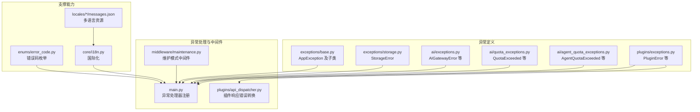
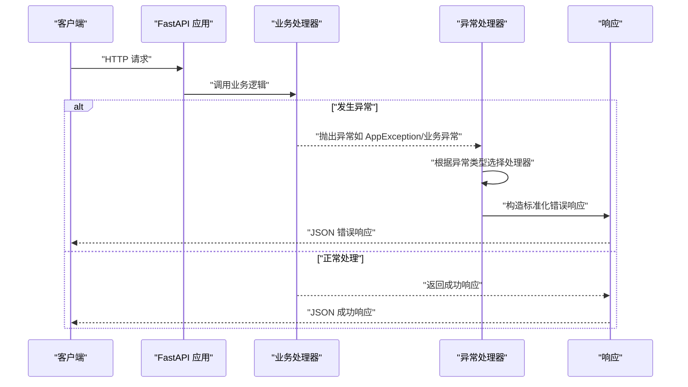
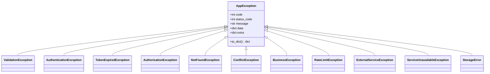
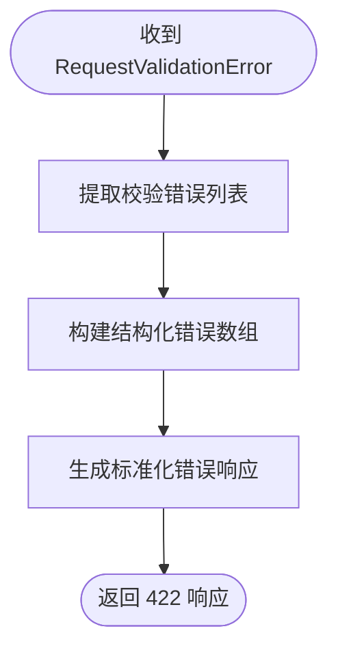
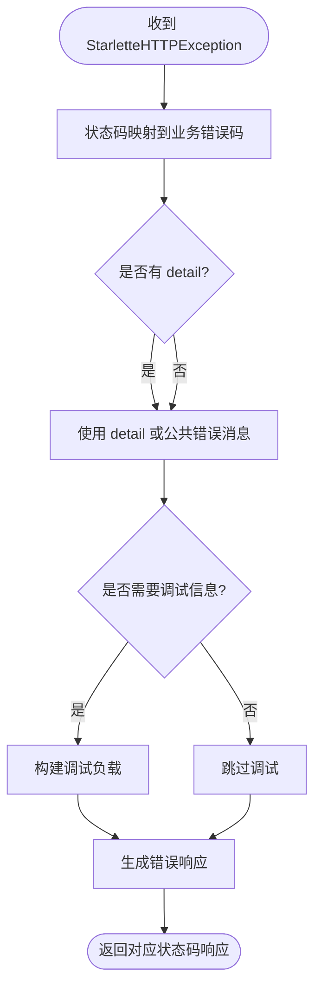
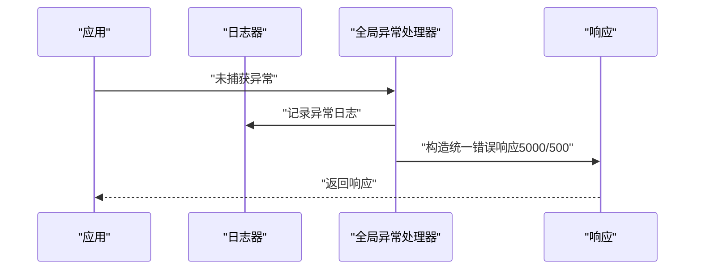
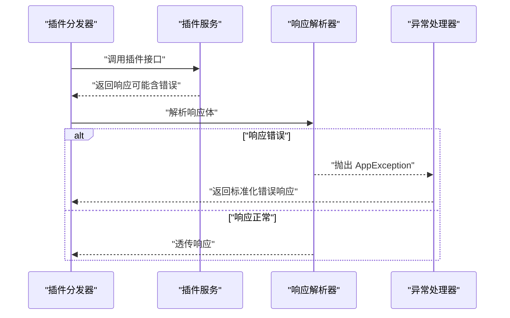
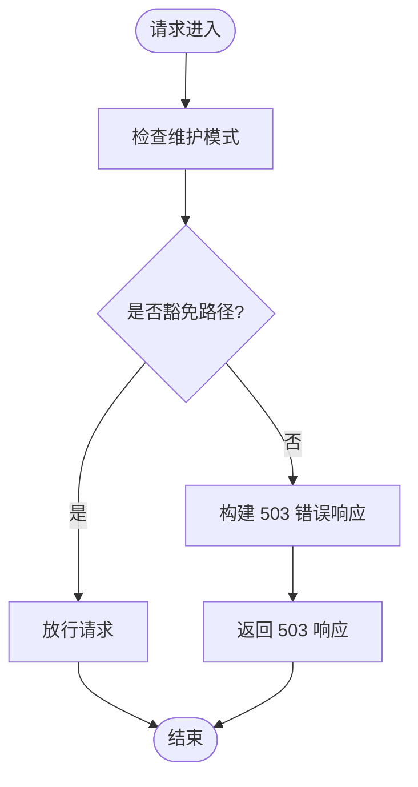
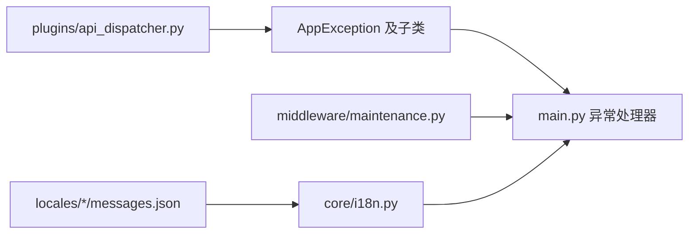

# 异常处理机制

<cite>
**本文档引用的文件**
- [backend/app/exceptions/base.py](file://backend/app/exceptions/base.py)
- [backend/app/exceptions/storage.py](file://backend/app/exceptions/storage.py)
- [backend/app/plugins/exceptions.py](file://backend/app/plugins/exceptions.py)
- [backend/app/ai/exceptions.py](file://backend/app/ai/exceptions.py)
- [backend/app/ai/agent_quota_exceptions.py](file://backend/app/ai/agent_quota_exceptions.py)
- [backend/app/ai/quota_exceptions.py](file://backend/app/ai/quota_exceptions.py)
- [backend/app/plugins/api_dispatcher.py](file://backend/app/plugins/api_dispatcher.py)
- [backend/app/middleware/maintenance.py](file://backend/app/middleware/maintenance.py)
- [backend/app/main.py](file://backend/app/main.py)
- [backend/app/enums/error_code.py](file://backend/app/enums/error_code.py)
- [backend/app/core/i18n.py](file://backend/app/core/i18n.py)
- [backend/app/locales/en/messages.json](file://backend/app/locales/en/messages.json)
- [backend/app/locales/zh_CN/messages.json](file://backend/app/locales/zh_CN/messages.json)
</cite>

## 目录
1. [简介](#简介)
2. [项目结构](#项目结构)
3. [核心组件](#核心组件)
4. [架构总览](#架构总览)
5. [详细组件分析](#详细组件分析)
6. [依赖关系分析](#依赖关系分析)
7. [性能考虑](#性能考虑)
8. [故障排除指南](#故障排除指南)
9. [结论](#结论)

## 简介
本文件系统性梳理 NovusAI SaaS 的异常处理机制，覆盖异常基类设计、继承体系、各类异常处理策略（应用异常、请求验证异常、HTTP 异常、全局异常处理），以及异常响应标准格式、错误码映射、国际化消息与调试信息控制。同时阐述异常处理中间件的工作原理与异常传播机制，并提供最佳实践与自定义异常类型开发指南。

## 项目结构
异常处理相关代码主要分布在以下模块：
- 异常基类与通用异常：backend/app/exceptions
- 领域特定异常：backend/app/ai、backend/app/plugins
- 异常处理中间件与全局注册：backend/app/main.py、backend/app/middleware
- 错误码枚举与国际化：backend/app/enums、backend/app/locales、backend/app/core/i18n.py

图表来源
- [backend/app/exceptions/base.py:1-250](file://backend/app/exceptions/base.py#L1-L250)
- [backend/app/exceptions/storage.py:1-50](file://backend/app/exceptions/storage.py#L1-L50)
- [backend/app/ai/exceptions.py:1-50](file://backend/app/ai/exceptions.py#L1-L50)
- [backend/app/ai/quota_exceptions.py:1-40](file://backend/app/ai/quota_exceptions.py#L1-L40)
- [backend/app/ai/agent_quota_exceptions.py:1-40](file://backend/app/ai/agent_quota_exceptions.py#L1-L40)
- [backend/app/plugins/exceptions.py:1-60](file://backend/app/plugins/exceptions.py#L1-L60)
- [backend/app/plugins/api_dispatcher.py:120-160](file://backend/app/plugins/api_dispatcher.py#L120-L160)
- [backend/app/middleware/maintenance.py:37-76](file://backend/app/middleware/maintenance.py#L37-L76)
- [backend/app/main.py:700-800](file://backend/app/main.py#L700-L800)
- [backend/app/enums/error_code.py:1-200](file://backend/app/enums/error_code.py#L1-L200)
- [backend/app/core/i18n.py:1-200](file://backend/app/core/i18n.py#L1-L200)
- [backend/app/locales/en/messages.json:1-200](file://backend/app/locales/en/messages.json#L1-L200)
- [backend/app/locales/zh_CN/messages.json:1-200](file://backend/app/locales/zh_CN/messages.json#L1-L200)

章节来源
- [backend/app/exceptions/base.py:1-250](file://backend/app/exceptions/base.py#L1-L250)
- [backend/app/main.py:700-800](file://backend/app/main.py#L700-L800)

## 核心组件
- 异常基类与继承体系
  - AppException：所有业务异常的根基类，提供统一的错误码、状态码、消息与数据结构。
  - 子类覆盖：ValidationException、AuthenticationException、TokenExpiredException、AuthorizationException、NotFoundException、ConflictException、BusinessException、RateLimitException、ExternalServiceException、ServiceUnavailableException 等。
- 领域异常
  - AI 异常：AIGatewayError 等网关相关异常。
  - 配额异常：QuotaExceeded、AgentQuotaExceeded、AgentConcurrencyExceeded 等配额相关异常。
  - 插件异常：PluginError、PluginNotFoundError、PluginManifestError 等插件相关异常。
  - 存储异常：StorageError。
- 异常处理注册
  - 在应用启动时注册多种异常处理器，覆盖 AppException、RequestValidationError、StarletteHTTPException 与全局 Exception。

章节来源
- [backend/app/exceptions/base.py:1-250](file://backend/app/exceptions/base.py#L1-L250)
- [backend/app/ai/exceptions.py:1-50](file://backend/app/ai/exceptions.py#L1-L50)
- [backend/app/ai/quota_exceptions.py:1-40](file://backend/app/ai/quota_exceptions.py#L1-L40)
- [backend/app/ai/agent_quota_exceptions.py:1-40](file://backend/app/ai/agent_quota_exceptions.py#L1-L40)
- [backend/app/plugins/exceptions.py:1-60](file://backend/app/plugins/exceptions.py#L1-L60)
- [backend/app/exceptions/storage.py:1-50](file://backend/app/exceptions/storage.py#L1-L50)
- [backend/app/main.py:700-800](file://backend/app/main.py#L700-L800)

## 架构总览
异常处理架构由“异常定义—异常传播—异常处理—响应输出”构成闭环，支持多语言与可选调试信息输出。

图表来源
- [backend/app/main.py:700-800](file://backend/app/main.py#L700-L800)
- [backend/app/plugins/api_dispatcher.py:120-160](file://backend/app/plugins/api_dispatcher.py#L120-L160)

## 详细组件分析

### 异常基类与继承体系
- 设计理念
  - 统一错误表示：通过错误码、状态码、消息、数据、额外字段与调试信息，形成一致的响应结构。
  - 分层继承：从 AppException 到具体业务异常，便于按类型精确处理与扩展。
  - 可序列化：异常对象可转换为字典，便于 JSON 响应。
- 关键属性与方法
  - 错误码与状态码：用于区分业务错误与 HTTP 状态。
  - 国际化消息：通过翻译函数获取本地化消息。
  - 调试信息：在非生产环境或特定条件下包含堆栈等调试内容。
- 典型子类
  - 验证类：参数校验失败、模型验证失败等。
  - 认证授权类：未认证、令牌过期、权限不足等。
  - 业务类：配额超限、并发超限、外部服务不可用等。
  - 存储类：存储操作失败等。

图表来源
- [backend/app/exceptions/base.py:1-250](file://backend/app/exceptions/base.py#L1-L250)

章节来源
- [backend/app/exceptions/base.py:1-250](file://backend/app/exceptions/base.py#L1-L250)

### 请求验证异常处理（RequestValidationError）
- 处理策略
  - 将 Pydantic 校验错误转换为结构化的错误列表，包含字段路径、消息与类型。
  - 返回标准化错误响应，状态码通常为 422。
- 输出格式
  - 包含字段路径、错误类型与消息的数组，便于前端逐项展示。

图表来源
- [backend/app/main.py:726-742](file://backend/app/main.py#L726-L742)

章节来源
- [backend/app/main.py:726-742](file://backend/app/main.py#L726-L742)

### HTTP 异常处理（StarletteHTTPException）
- 处理策略
  - 将常见 HTTP 状态码映射到业务错误码（如 404 映射为 4040）。
  - 对于 5xx 错误，使用公共错误消息并可选包含调试信息。
  - 对于 4xx 错误，优先使用异常详情作为对外消息。
- 输出格式
  - 统一的错误响应结构，包含业务错误码、HTTP 状态码与可选调试信息。

图表来源
- [backend/app/main.py:744-780](file://backend/app/main.py#L744-L780)

章节来源
- [backend/app/main.py:744-780](file://backend/app/main.py#L744-L780)

### 全局异常处理（未捕获异常）
- 处理策略
  - 记录未处理异常的日志。
  - 返回统一的服务器错误（业务错误码 5000，HTTP 500）。
  - 在需要时包含调试信息（如 detail 文本，但不包含完整堆栈）。
- 安全性
  - 避免泄露内部实现细节，仅在必要时暴露有限调试信息。

图表来源
- [backend/app/main.py:782-798](file://backend/app/main.py#L782-L798)

章节来源
- [backend/app/main.py:782-798](file://backend/app/main.py#L782-L798)

### 插件响应错误转换
- 工作原理
  - 当插件返回非 2xx 响应或包含错误字段时，转换为 AppException。
  - 解析响应体中的错误码、消息与数据，进行规范化与消息国际化。
- 异常传播
  - 转换后的 AppException 将被全局异常处理器捕获并返回标准化响应。

图表来源
- [backend/app/plugins/api_dispatcher.py:120-160](file://backend/app/plugins/api_dispatcher.py#L120-L160)
- [backend/app/plugins/api_dispatcher.py:347-372](file://backend/app/plugins/api_dispatcher.py#L347-L372)

章节来源
- [backend/app/plugins/api_dispatcher.py:120-160](file://backend/app/plugins/api_dispatcher.py#L120-L160)
- [backend/app/plugins/api_dispatcher.py:347-372](file://backend/app/plugins/api_dispatcher.py#L347-L372)

### 维护模式中间件与异常处理
- 工作原理
  - 在维护模式下，对非豁免路径返回 503 错误（业务错误码 5030），携带维护标志与消息。
  - 通过错误工具函数生成标准化响应并设置 CORS 头。
- 与全局异常处理的关系
  - 维护模式错误属于业务错误范畴，最终由异常处理器统一处理。

图表来源
- [backend/app/middleware/maintenance.py:37-76](file://backend/app/middleware/maintenance.py#L37-L76)

章节来源
- [backend/app/middleware/maintenance.py:37-76](file://backend/app/middleware/maintenance.py#L37-L76)

### 异常响应标准格式
- 字段说明
  - code：业务错误码（整数），用于前端识别与国际化。
  - status_code：HTTP 状态码（整数）。
  - message：对外显示的消息（支持国际化）。
  - data：业务数据（可选）。
  - extra：额外上下文（可选）。
  - debug：调试信息（可选，受环境与安全策略控制）。
- 国际化
  - 使用翻译函数与多语言资源文件，确保不同语言环境下的消息一致。
- 调试信息控制
  - 生产环境默认不包含完整堆栈；仅在需要时包含有限调试信息。

章节来源
- [backend/app/main.py:700-800](file://backend/app/main.py#L700-L800)
- [backend/app/core/i18n.py:1-200](file://backend/app/core/i18n.py#L1-L200)
- [backend/app/locales/en/messages.json:1-200](file://backend/app/locales/en/messages.json#L1-L200)
- [backend/app/locales/zh_CN/messages.json:1-200](file://backend/app/locales/zh_CN/messages.json#L1-L200)

### 错误码映射与枚举
- 映射规则
  - 常见 HTTP 状态码到业务错误码的映射（如 404 → 4040）。
  - 其他状态码按规则推导（如 status × 10）。
- 枚举管理
  - 错误码枚举集中管理，便于统一维护与扩展。

章节来源
- [backend/app/main.py:744-780](file://backend/app/main.py#L744-L780)
- [backend/app/enums/error_code.py:1-200](file://backend/app/enums/error_code.py#L1-L200)

## 依赖关系分析
- 组件耦合
  - 异常处理器依赖 AppException 及其子类的统一结构。
  - 插件分发器依赖 AppException 进行错误传播。
  - 维护模式中间件依赖错误工具函数生成标准化响应。
- 外部依赖
  - FastAPI 异常类型（RequestValidationError、StarletteHTTPException）。
  - 国际化框架与多语言资源文件。
- 循环依赖
  - 未发现循环导入；异常定义与处理分离清晰。

图表来源
- [backend/app/exceptions/base.py:1-250](file://backend/app/exceptions/base.py#L1-L250)
- [backend/app/main.py:700-800](file://backend/app/main.py#L700-L800)
- [backend/app/plugins/api_dispatcher.py:120-160](file://backend/app/plugins/api_dispatcher.py#L120-L160)
- [backend/app/middleware/maintenance.py:37-76](file://backend/app/middleware/maintenance.py#L37-L76)
- [backend/app/core/i18n.py:1-200](file://backend/app/core/i18n.py#L1-L200)
- [backend/app/locales/en/messages.json:1-200](file://backend/app/locales/en/messages.json#L1-L200)
- [backend/app/locales/zh_CN/messages.json:1-200](file://backend/app/locales/zh_CN/messages.json#L1-L200)

章节来源
- [backend/app/exceptions/base.py:1-250](file://backend/app/exceptions/base.py#L1-L250)
- [backend/app/main.py:700-800](file://backend/app/main.py#L700-L800)
- [backend/app/plugins/api_dispatcher.py:120-160](file://backend/app/plugins/api_dispatcher.py#L120-L160)
- [backend/app/middleware/maintenance.py:37-76](file://backend/app/middleware/maintenance.py#L37-L76)
- [backend/app/core/i18n.py:1-200](file://backend/app/core/i18n.py#L1-L200)
- [backend/app/locales/en/messages.json:1-200](file://backend/app/locales/en/messages.json#L1-L200)
- [backend/app/locales/zh_CN/messages.json:1-200](file://backend/app/locales/zh_CN/messages.json#L1-L200)

## 性能考虑
- 异常处理开销
  - 异常处理器仅在异常发生时触发，正常路径无额外开销。
  - 日志记录与调试信息生成需谨慎控制，避免影响性能。
- 响应头一致性
  - 错误响应统一设置 CORS 头，减少跨域问题带来的重试成本。
- 调试信息
  - 生产环境关闭详细调试信息，降低响应体积与潜在风险。

## 故障排除指南
- 常见问题定位
  - 查看全局异常处理器日志，确认未捕获异常的上下文。
  - 检查维护模式中间件是否拦截了请求。
  - 核对插件响应体是否符合错误格式约定。
- 排查步骤
  - 启用调试模式获取有限调试信息。
  - 检查国际化资源文件是否缺失对应键值。
  - 验证错误码映射是否正确。
- 相关实现参考
  - 全局异常处理器与错误响应构造。
  - 维护模式中间件的错误响应生成。
  - 插件响应错误转换逻辑。

章节来源
- [backend/app/main.py:782-798](file://backend/app/main.py#L782-L798)
- [backend/app/middleware/maintenance.py:67-73](file://backend/app/middleware/maintenance.py#L67-L73)
- [backend/app/plugins/api_dispatcher.py:135-155](file://backend/app/plugins/api_dispatcher.py#L135-L155)

## 结论
NovusAI SaaS 的异常处理机制通过统一的异常基类、明确的继承体系与完善的异常处理器注册，实现了从异常定义到响应输出的一致性与可维护性。结合错误码映射、国际化与调试信息控制，系统在保证用户体验的同时兼顾安全性与可观测性。建议在新增异常类型时遵循现有继承体系与响应格式规范，确保异常处理流程的稳定性与一致性。