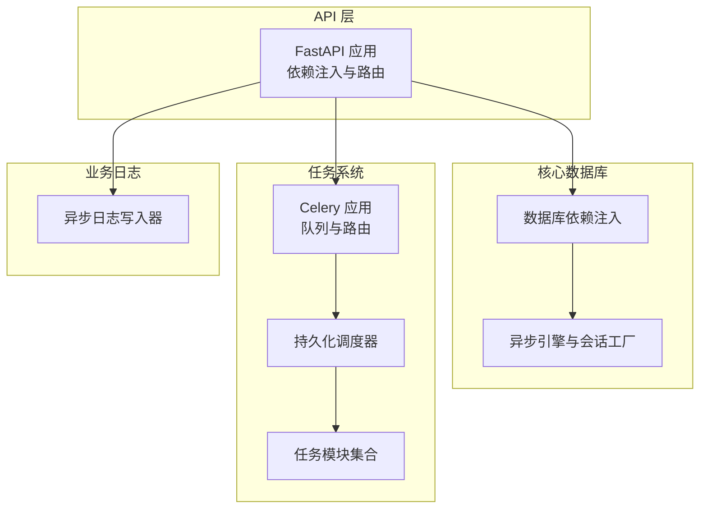
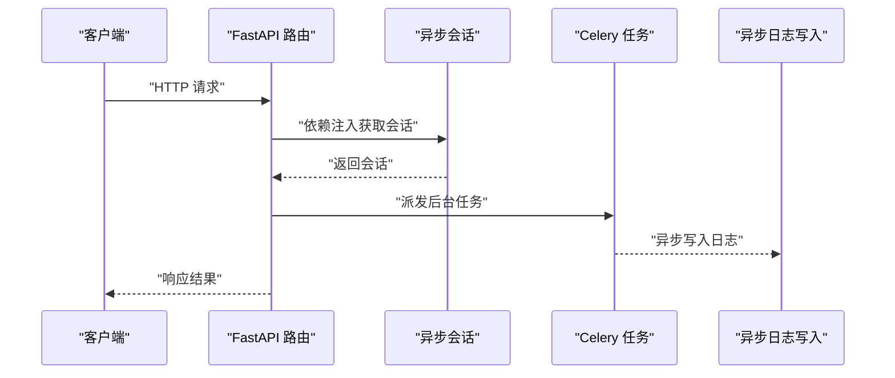
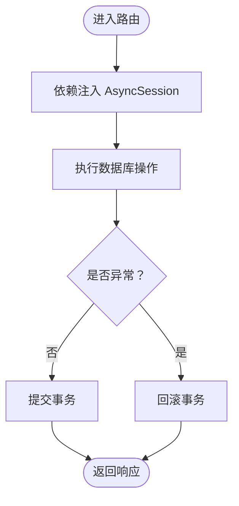
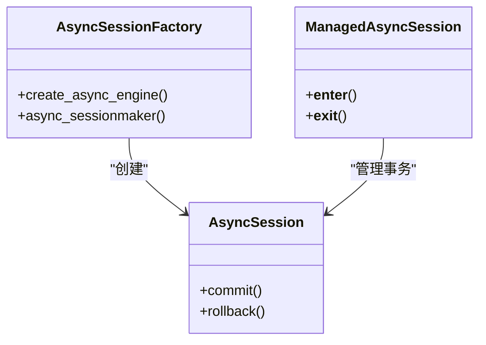
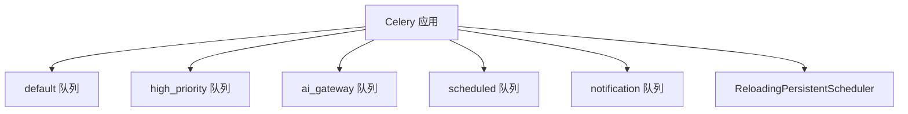
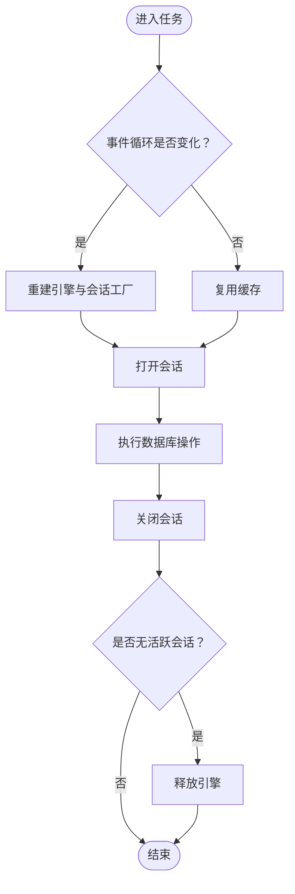
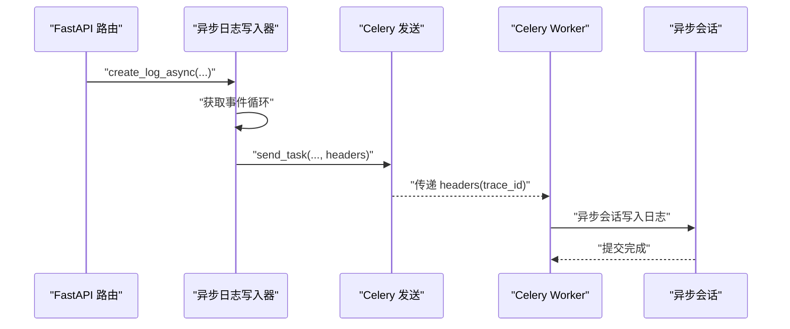
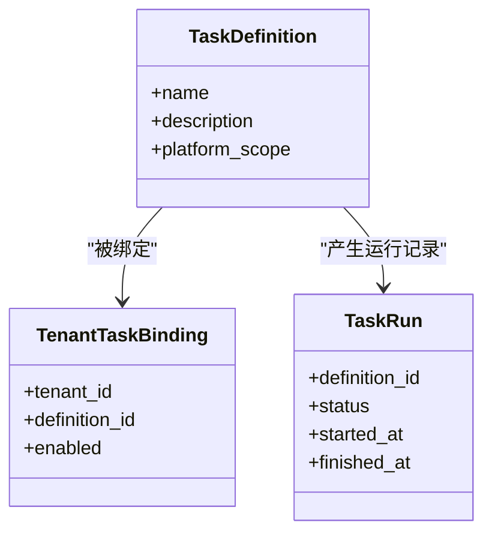
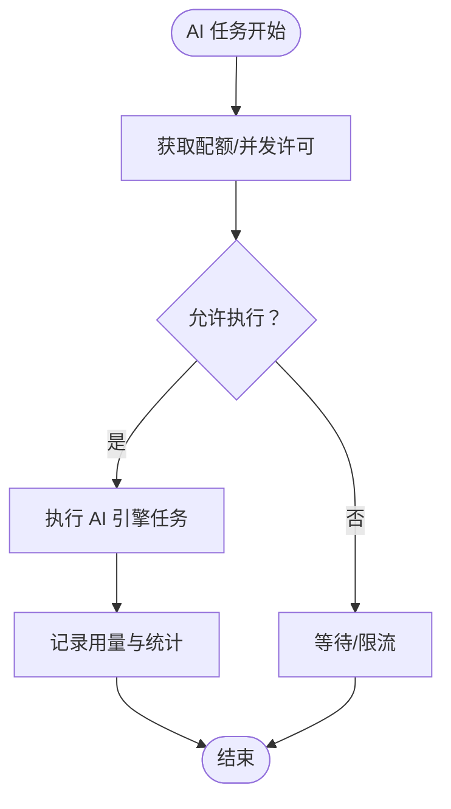
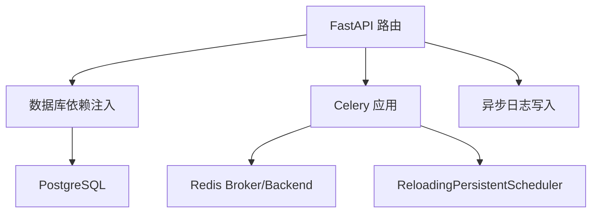

# 异步编程模式

<cite>

**本文引用的文件**
- [celery_app.py](file://backend/app/celery_app.py)
- [database.py](file://backend/app/core/database.py)
- [async_db.py](file://backend/app/tasks/async_db.py)
- [async_writer.py](file://backend/app/services/system/operation_log_service_parts/async_writer.py)
- [main.py](file://backend/app/main.py)
- [ai.py](file://backend/app/tasks/ai.py)
- [scheduler.py](file://backend/app/tasks/scheduler.py)
- [task_scheduling.py](file://backend/app/tasks/task_scheduling.py)
- [periodic_tasks.py](file://backend/app/api/admin/periodic_tasks.py)
- [tasks.py](file://backend/app/api/admin/tasks.py)
- [task_definition.py](file://backend/app/models/system/task_definition.py)
- [task_run.py](file://backend/app/models/system/task_run.py)
- [tenant_task_binding.py](file://backend/app/models/system/tenant_task_binding.py)
- [task_definition_service.py](file://backend/app/services/system/task_definition_service.py)
- [task_run_service.py](file://backend/app/services/system/task_run_service.py)
- [task_log_service.py](file://backend/app/services/system/task_log_service.py)
- [task_manager_service.py](file://backend/app/services/system/task_manager_service.py)
- [task_binding_service.py](file://backend/app/services/system/task_binding_service.py)
- [periodic_task_query_service.py](file://backend/app/services/system/periodic_task_query_service.py)
- [task_log_query_service.py](file://backend/app/services/system/task_log_query_service.py)
- [agent_batch.py](file://backend/app/tasks/agent_batch.py)
- [notification.py](file://backend/app/tasks/notification.py)
- [email.py](file://backend/app/tasks/email.py)
- [ssl_tasks.py](file://backend/app/tasks/ssl_tasks.py)
- [recycle_bin.py](file://backend/app/tasks/recycle_bin.py)
- [upload_cleanup.py](file://backend/app/tasks/upload_cleanup.py)
- [ai_health_check.py](file://backend/app/tasks/ai_health_check.py)
- [ai_gateway.py](file://backend/app/gateway.py)
- [trace.py](file://backend/app/middleware/trace.py)
- [runtime_identity.py](file://backend/app/core/runtime_identity.py)
- [deps.py](file://backend/app/core/deps.py)
- [sse.py](file://backend/app/core/sse.py)
- [socketio_server.py](file://backend/app/core/socketio_server.py)
- [sio_bridge.py](file://backend/app/core/sio_bridge.py)
- [rate_limiter.py](file://backend/app/rate_limiter.py)
- [quota_manager.py](file://backend/app/quota_manager.py)
- [agent_quota_manager.py](file://backend/app/ai/agent_quota_manager.py)
- [agent_quota_concurrency.py](file://backend/app/ai/agent_quota_concurrency.py)
- [agent_quota_config.py](file://backend/app/ai/agent_quota_config.py)
- [agent_quota_exceptions.py](file://backend/app/ai/agent_quota_exceptions.py)
- [agent_quota_manager_support.py](file://backend/app/ai/agent_quota_manager_support.py)
- [agent_stats.py](file://backend/app/ai/agent_stats.py)
- [retry_service.py](file://backend/app/ai/retry_service.py)
- [failover.py](file://backend/app/ai/failover.py)
- [memory_policy.py](file://backend/app/ai/memory_policy.py)
- [text_semantics.py](file://backend/app/ai/text_semantics.py)
- [text_semantics_json.py](file://backend/app/ai/text_semantics_json.py)
- [text_semantics_terms.py](file://backend/app/ai/text_semantics_terms.py)
- [text_semantics_tokens.py](file://backend/app/ai/text_semantics_tokens.py)
- [text_semantics_urls.py](file://backend/app/ai/text_semantics_urls.py)
- [usage_recorder_context.py](file://backend/app/ai/usage_recorder_context.py)
- [usage_recorder_core.py](file://backend/app/ai/usage_recorder_core.py)
- [usage_recorder_support.py](file://backend/app/ai/usage_recorder_support.py)
- [constants.py](file://backend/app/ai/constants.py)
- [types.py](file://backend/app/ai/types.py)
- [exceptions.py](file://backend/app/ai/exceptions.py)
- [json_safe.py](file://backend/app/ai/json_safe.py)
- [gateway.py](file://backend/app/ai/gateway.py)
- [internal_ai_service.py](file://backend/app/ai/internal_ai_service.py)
- [ai_engine_task.py](file://backend/app/ai/engine/task.py)
- [ai_rag_processor.py](file://backend/app/ai/rag/processor.py)
- [ai_skills.py](file://backend/app/ai/skills/)
- [ai_tools.py](file://backend/app/ai/tools/)
- [ai_context.py](file://backend/app/ai/context/)
- [ai_events.py](file://backend/app/ai/events/)
- [ai_capabilities.py](file://backend/app/ai/capabilities/)
- [ai_adapters.py](file://backend/app/ai/adapters/)
- [ai_routing.py](file://backend/app/ai/routing/)
- [ai_runtime.py](file://backend/app/ai/runtime/)
- [ai_gateway_support.py](file://backend/app/ai/gateway_support/)
- [ai_prompt_contracts.py](file://backend/app/ai/prompt_contracts/)
- [ai_cache.py](file://backend/app/ai/cache.py)
- [ai_sse.py](file://backend/app/ai/sse.py)
- [ai_usage_recorder.py](file://backend/app/ai/usage_recorder.py)
- [ai_quota_manager.py](file://backend/app/ai/quota_manager.py)
- [ai_quota_exceptions.py](file://backend/app/ai/quota_exceptions.py)
- [ai_quota_config.py](file://backend/app/ai/quota_config.py)
- [ai_quota_concurrency.py](file://backend/app/ai/quota_concurrency.py)
- [ai_quota_manager_support.py](file://backend/app/ai/quota_manager_support.py)
- [ai_quota_stats.py](file://backend/app/ai/quota_stats.py)
- [ai_quota_usage_tracker.py](file://backend/app/ai/quota_usage_tracker.py)
</cite>

## 目录
1. [简介](#简介)
2. [项目结构](#项目结构)
3. [核心组件](#核心组件)
4. [架构总览](#架构总览)
5. [详细组件分析](#详细组件分析)
6. [依赖分析](#依赖分析)
7. [性能考量](#性能考量)
8. [故障排查指南](#故障排查指南)
9. [结论](#结论)
10. [附录](#附录)

## 简介
本文件系统化梳理 NovusAI SaaS 在异步编程方面的设计与实现，覆盖以下主题：
- FastAPI 异步路由处理与依赖注入
- 数据库异步连接与会话管理（含上下文管理器）
- Celery 异步任务执行与队列调度
- 异步上下文管理器与并发控制
- 错误处理与超时控制策略
- 性能优化与最佳实践

## 项目结构
后端采用分层与功能域结合的组织方式，异步相关能力主要分布在如下模块：
- 核心数据库层：提供异步引擎、会话工厂与依赖注入
- 任务系统：Celery 应用配置、任务队列与调度器
- 业务日志：异步写入操作日志
- API 层：FastAPI 路由与依赖注入
- AI 引擎与网关：异步任务与并发控制

**图表来源**
- [database.py:65-82](file://backend/app/core/database.py#L65-L82)
- [celery_app.py:20-106](file://backend/app/celery_app.py#L20-L106)
- [async_writer.py:81-124](file://backend/app/services/system/operation_log_service_parts/async_writer.py#L81-L124)

**章节来源**
- [database.py:65-82](file://backend/app/core/database.py#L65-L82)
- [celery_app.py:20-106](file://backend/app/celery_app.py#L20-L106)
- [async_writer.py:81-124](file://backend/app/services/system/operation_log_service_parts/async_writer.py#L81-L124)

## 核心组件
- 异步数据库引擎与会话管理
  - 提供异步引擎、会话工厂与上下文管理器，支持事务提交/回滚与异常安全
  - 依赖注入接口用于 FastAPI 路由
- Celery 应用与任务队列
  - 配置 Broker、结果后端、序列化、时区与并发
  - 定义多队列与路由规则，支持高优先级、AI 网关、定时任务与通知队列
  - 基于数据库的任务定义与租户绑定表进行动态调度
- 异步日志写入
  - 在事件循环中创建任务异步写入操作日志，避免阻塞请求线程
- FastAPI 异步路由与依赖注入
  - 通过依赖注入获取异步会话，保证请求生命周期内的数据库一致性

**章节来源**
- [database.py:65-82](file://backend/app/core/database.py#L65-L82)
- [database.py:84-102](file://backend/app/core/database.py#L84-L102)
- [database.py:135-146](file://backend/app/core/database.py#L135-L146)
- [celery_app.py:40-88](file://backend/app/celery_app.py#L40-L88)
- [celery_app.py:219-225](file://backend/app/celery_app.py#L219-L225)
- [async_writer.py:126-174](file://backend/app/services/system/operation_log_service_parts/async_writer.py#L126-L174)

## 架构总览
异步架构围绕“请求-数据库-任务-日志”四条主线展开：
- 请求处理：FastAPI 异步路由 + 数据库依赖注入
- 数据库访问：异步会话 + 上下文管理器
- 任务执行：Celery 任务 + 多队列路由 + 持久化调度
- 日志记录：异步写入器 + 事件循环任务

**图表来源**
- [main.py](file://backend/app/main.py)
- [database.py:135-146](file://backend/app/core/database.py#L135-L146)
- [async_writer.py:126-174](file://backend/app/services/system/operation_log_service_parts/async_writer.py#L126-L174)

## 详细组件分析

### FastAPI 异步路由与依赖注入
- 依赖注入
  - 通过异步会话工厂提供数据库会话，确保请求期间的事务一致性
  - 支持在路由函数中直接注入 AsyncSession
- 上下文管理
  - managed_async_session 自动提交或回滚事务，异常与取消均安全处理

**图表来源**
- [database.py:84-102](file://backend/app/core/database.py#L84-L102)
- [database.py:135-146](file://backend/app/core/database.py#L135-L146)

**章节来源**
- [database.py:84-102](file://backend/app/core/database.py#L84-L102)
- [database.py:135-146](file://backend/app/core/database.py#L135-L146)

### 数据库异步操作与上下文管理器
- 异步引擎与会话工厂
  - 使用 SQLAlchemy AsyncSession 与 async_session_factory
  - 支持连接池参数与预检
- 事务上下文
  - managed_async_session 在异常或取消时自动回滚，正常完成时提交
- 依赖注入
  - get_db 作为 FastAPI 依赖，按请求作用域提供会话
  - get_db_context 作为通用上下文管理器

**图表来源**
- [database.py:65-82](file://backend/app/core/database.py#L65-L82)
- [database.py:84-102](file://backend/app/core/database.py#L84-L102)
- [database.py:135-158](file://backend/app/core/database.py#L135-L158)

**章节来源**
- [database.py:65-82](file://backend/app/core/database.py#L65-L82)
- [database.py:84-102](file://backend/app/core/database.py#L84-L102)
- [database.py:135-158](file://backend/app/core/database.py#L135-L158)

### Celery 异步任务执行与队列调度
- 应用配置
  - Broker 与结果后端、序列化、时区、任务跟踪与并发参数
- 多队列与路由
  - default、high_priority、ai_gateway、scheduled、notification 队列
  - 任务模块自动发现与强制导入
- 持久化调度
  - 基于 ReloadingPersistentScheduler 的数据库驱动调度
  - beat_schedule 仅保留静态项，动态项由数据库加载
- 插件队列扩展
  - 启动时扫描启用插件，注册其队列任务与消费者

**图表来源**
- [celery_app.py:40-88](file://backend/app/celery_app.py#L40-L88)
- [celery_app.py:219-225](file://backend/app/celery_app.py#L219-L225)

**章节来源**
- [celery_app.py:40-88](file://backend/app/celery_app.py#L40-L88)
- [celery_app.py:219-225](file://backend/app/celery_app.py#L219-L225)

### 任务工厂与事件循环隔离
- 问题背景
  - Windows --pool=solo 模式下事件循环变化会导致引擎失效
- 解决方案
  - 模块级缓存引擎与会话工厂，检测事件循环变化并按需重建
  - 任务结束后在无活跃会话时释放引擎

**图表来源**
- [async_db.py:29-61](file://backend/app/tasks/async_db.py#L29-L61)
- [async_db.py:63-92](file://backend/app/tasks/async_db.py#L63-L92)

**章节来源**
- [async_db.py:29-61](file://backend/app/tasks/async_db.py#L29-L61)
- [async_db.py:63-92](file://backend/app/tasks/async_db.py#L63-L92)

### 异步日志写入与 Trace ID 传播
- 异步写入
  - 在事件循环中创建任务异步写入操作日志，避免阻塞请求线程
- Trace ID 传播
  - 通过中间件变量在发送任务时注入 headers，实现跨进程链路追踪

**图表来源**
- [async_writer.py:126-174](file://backend/app/services/system/operation_log_service_parts/async_writer.py#L126-L174)
- [celery_app.py:26-35](file://backend/app/celery_app.py#L26-L35)
- [trace.py](file://backend/app/middleware/trace.py)

**章节来源**
- [async_writer.py:126-174](file://backend/app/services/system/operation_log_service_parts/async_writer.py#L126-L174)
- [celery_app.py:26-35](file://backend/app/celery_app.py#L26-L35)
- [trace.py](file://backend/app/middleware/trace.py)

### 任务定义与运行管理
- 任务定义与绑定
  - 通过 task_definition、tenant_task_binding 等模型与服务管理任务定义、租户绑定与运行状态
- 调度与查询
  - 基于 ReloadingPersistentScheduler 的动态调度，支持查询与日志记录
- 任务模块
  - 包含 AI 健康检查、批量 Agent、邮件、通知、回收站清理、上传清理、SSL 任务等

**图表来源**
- [task_definition.py](file://backend/app/models/system/task_definition.py)
- [tenant_task_binding.py](file://backend/app/models/system/tenant_task_binding.py)
- [task_run.py](file://backend/app/models/system/task_run.py)

**章节来源**
- [task_definition.py](file://backend/app/models/system/task_definition.py)
- [tenant_task_binding.py](file://backend/app/models/system/tenant_task_binding.py)
- [task_run.py](file://backend/app/models/system/task_run.py)
- [task_definition_service.py](file://backend/app/services/system/task_definition_service.py)
- [task_run_service.py](file://backend/app/services/system/task_run_service.py)
- [task_log_service.py](file://backend/app/services/system/task_log_service.py)
- [task_manager_service.py](file://backend/app/services/system/task_manager_service.py)
- [task_binding_service.py](file://backend/app/services/system/task_binding_service.py)
- [periodic_task_query_service.py](file://backend/app/services/system/periodic_task_query_service.py)
- [task_log_query_service.py](file://backend/app/services/system/task_log_query_service.py)

### AI 引擎与并发控制
- 引擎任务
  - AI 引擎任务封装异步执行流程，配合并发与配额管理
- 并发与配额
  - 通过配额管理器与并发控制模块限制 Agent 并发与资源占用
- 记录与统计
  - 使用用量记录上下文与核心模块记录 AI 使用情况

**图表来源**
- [ai_engine_task.py](file://backend/app/ai/engine/task.py)
- [agent_quota_manager.py](file://backend/app/ai/agent_quota_manager.py)
- [agent_quota_concurrency.py](file://backend/app/ai/agent_quota_concurrency.py)
- [usage_recorder_context.py](file://backend/app/ai/usage_recorder_context.py)
- [usage_recorder_core.py](file://backend/app/ai/usage_recorder_core.py)

**章节来源**
- [ai_engine_task.py](file://backend/app/ai/engine/task.py)
- [agent_quota_manager.py](file://backend/app/ai/agent_quota_manager.py)
- [agent_quota_concurrency.py](file://backend/app/ai/agent_quota_concurrency.py)
- [usage_recorder_context.py](file://backend/app/ai/usage_recorder_context.py)
- [usage_recorder_core.py](file://backend/app/ai/usage_recorder_core.py)

## 依赖分析
- 组件耦合
  - FastAPI 路由依赖数据库依赖注入，保持低耦合与高内聚
  - Celery 应用与任务模块解耦，通过队列与路由实现松散耦合
  - 异步日志写入器与任务系统通过事件循环解耦
- 外部依赖
  - Redis 作为 Celery Broker 与结果后端
  - PostgreSQL 作为数据库后端
  - Alembic 用于数据库迁移

**图表来源**
- [celery_app.py:40-54](file://backend/app/celery_app.py#L40-L54)
- [database.py:65-72](file://backend/app/core/database.py#L65-L72)
- [async_writer.py:126-174](file://backend/app/services/system/operation_log_service_parts/async_writer.py#L126-L174)

**章节来源**
- [celery_app.py:40-54](file://backend/app/celery_app.py#L40-L54)
- [database.py:65-72](file://backend/app/core/database.py#L65-L72)
- [async_writer.py:126-174](file://backend/app/services/system/operation_log_service_parts/async_writer.py#L126-L174)

## 性能考量
- 连接池与并发
  - 异步引擎连接池参数与预检，减少连接建立开销
  - Celery worker 并发与预取乘数按环境调优
- 事件循环隔离
  - 任务工厂缓存引擎并检测事件循环变化，避免频繁重建
- 异步日志
  - 使用事件循环任务异步写入，降低请求延迟
- 调度与持久化
  - 基于数据库的任务定义与动态调度，提升可靠性与可观测性

**章节来源**
- [database.py:65-72](file://backend/app/core/database.py#L65-L72)
- [celery_app.py:62-63](file://backend/app/celery_app.py#L62-L63)
- [async_db.py:29-61](file://backend/app/tasks/async_db.py#L29-L61)
- [async_writer.py:126-174](file://backend/app/services/system/operation_log_service_parts/async_writer.py#L126-L174)
- [celery_app.py:219-225](file://backend/app/celery_app.py#L219-L225)

## 故障排查指南
- 数据库连接失败
  - 检查 PostgreSQL 是否启动与网络连通
  - 查看初始化失败原因与日志
- Celery 任务超时或丢失
  - 校验任务软硬超时、并发与预取设置
  - 检查队列路由与任务模块注册
- Trace ID 未传播
  - 确认中间件变量与 send_task 重写逻辑
- 异步日志写入异常
  - 检查事件循环状态与任务工厂缓存

**章节来源**
- [database.py:218-234](file://backend/app/core/database.py#L218-L234)
- [celery_app.py:60-63](file://backend/app/celery_app.py#L60-L63)
- [celery_app.py:26-35](file://backend/app/celery_app.py#L26-L35)
- [async_writer.py:122-124](file://backend/app/services/system/operation_log_service_parts/async_writer.py#L122-L124)

## 结论
本项目通过异步数据库、Celery 任务系统与异步日志写入构建了高性能、可扩展的后端架构。关键点包括：
- 明确的异步边界与上下文管理器，保障事务安全
- 基于队列与路由的异步任务执行，支持优先级与隔离
- 基于数据库的持久化调度，提升可靠性
- 异步日志与 Trace ID 传播，增强可观测性

## 附录
- 相关任务模块
  - AI 健康检查、Agent 批量执行、邮件与通知、回收站与上传清理、SSL 任务
- 相关 API
  - 管理员任务与周期任务管理接口
- 相关 AI 组件
  - 引擎、路由、上下文、工具、技能、RAG 处理器等

**章节来源**
- [ai_health_check.py](file://backend/app/tasks/ai_health_check.py)
- [agent_batch.py](file://backend/app/tasks/agent_batch.py)
- [notification.py](file://backend/app/tasks/notification.py)
- [email.py](file://backend/app/tasks/email.py)
- [recycle_bin.py](file://backend/app/tasks/recycle_bin.py)
- [upload_cleanup.py](file://backend/app/tasks/upload_cleanup.py)
- [ssl_tasks.py](file://backend/app/tasks/ssl_tasks.py)
- [periodic_tasks.py](file://backend/app/api/admin/periodic_tasks.py)
- [tasks.py](file://backend/app/api/admin/tasks.py)
- [ai_gateway.py](file://backend/app/gateway.py)
- [ai_rag_processor.py](file://backend/app/ai/rag/processor.py)
- [ai_skills.py](file://backend/app/ai/skills/)
- [ai_tools.py](file://backend/app/ai/tools/)
- [ai_context.py](file://backend/app/ai/context/)
- [ai_events.py](file://backend/app/ai/events/)
- [ai_capabilities.py](file://backend/app/ai/capabilities/)
- [ai_adapters.py](file://backend/app/ai/adapters/)
- [ai_routing.py](file://backend/app/ai/routing/)
- [ai_runtime.py](file://backend/app/ai/runtime/)
- [ai_gateway_support.py](file://backend/app/ai/gateway_support/)
- [ai_prompt_contracts.py](file://backend/app/ai/prompt_contracts/)
- [ai_cache.py](file://backend/app/ai/cache.py)
- [ai_sse.py](file://backend/app/ai/sse.py)
- [ai_text_semantics.py](file://backend/app/ai/text_semantics.py)
- [ai_retry_service.py](file://backend/app/ai/retry_service.py)
- [ai_failover.py](file://backend/app/ai/failover.py)
- [ai_memory_policy.py](file://backend/app/ai/memory_policy.py)
- [ai_usage_recorder.py](file://backend/app/ai/usage_recorder.py)
- [ai_quota_manager.py](file://backend/app/ai/quota_manager.py)
- [ai_quota_exceptions.py](file://backend/app/ai/quota_exceptions.py)
- [ai_quota_config.py](file://backend/app/ai/quota_config.py)
- [ai_quota_concurrency.py](file://backend/app/ai/quota_concurrency.py)
- [ai_quota_manager_support.py](file://backend/app/ai/quota_manager_support.py)
- [ai_quota_stats.py](file://backend/app/ai/quota_stats.py)
- [ai_quota_usage_tracker.py](file://backend/app/ai/quota_usage_tracker.py)