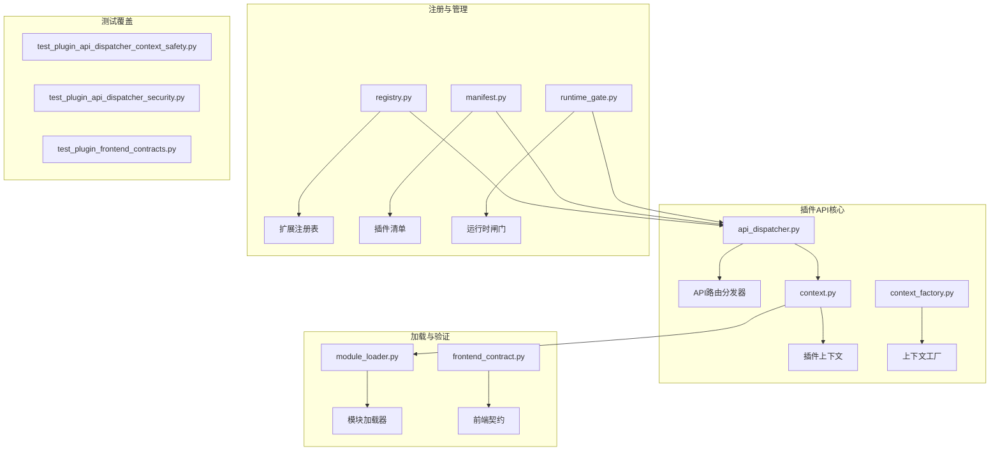
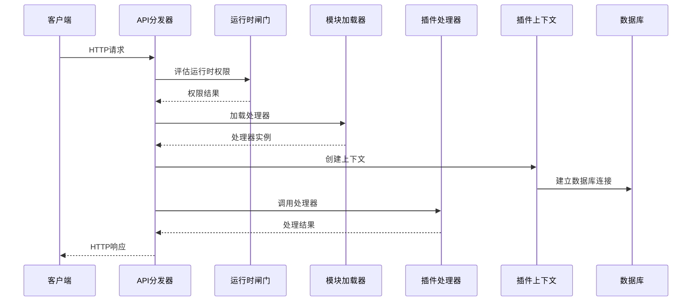
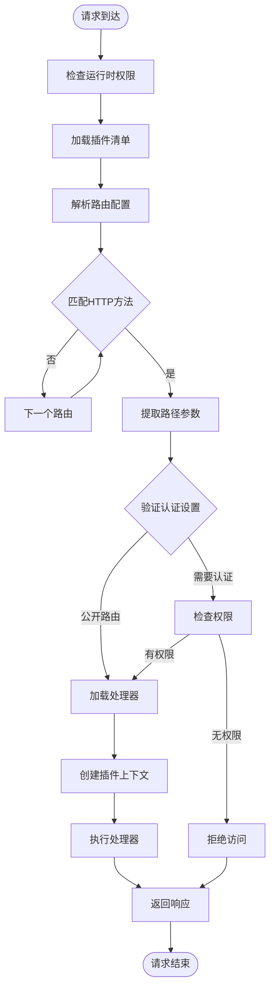
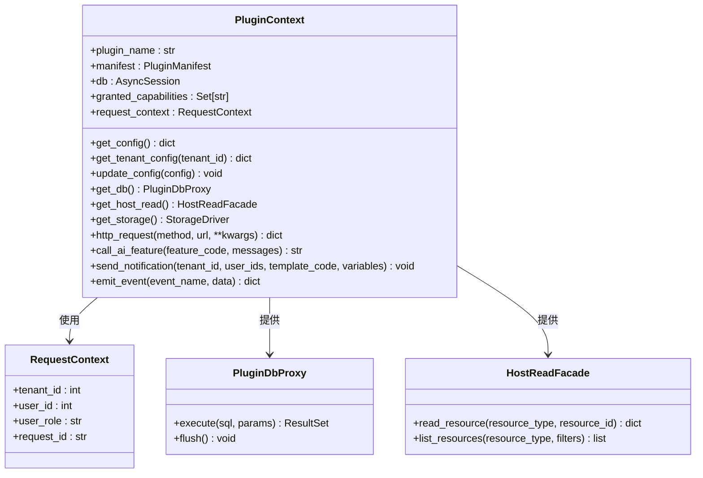
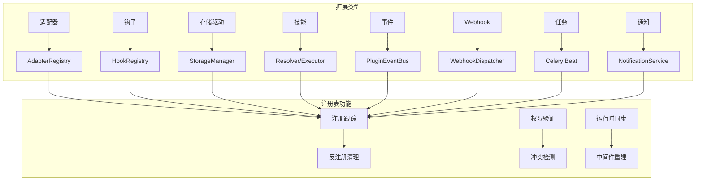
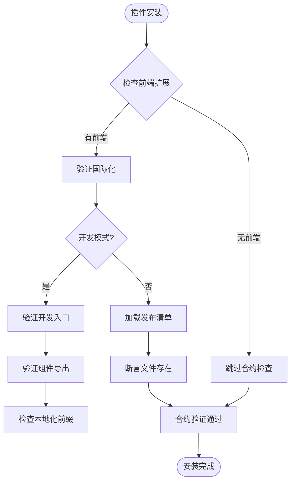
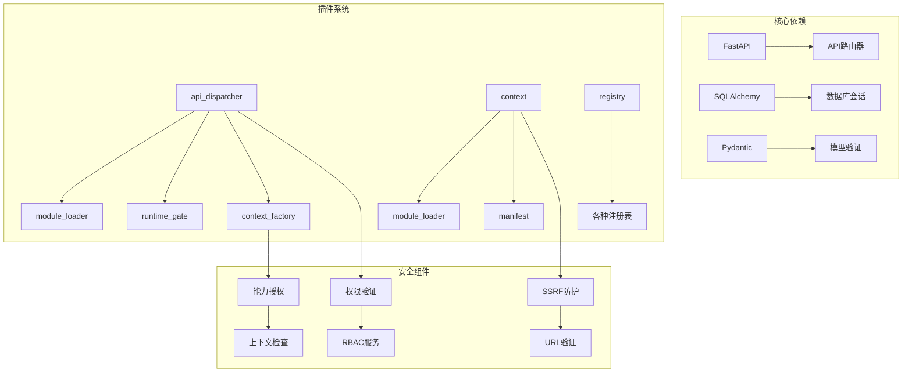

# 插件API扩展机制

<cite>
**本文档引用的文件**
- [api_dispatcher.py](file://backend/app/plugins/api_dispatcher.py)
- [context.py](file://backend/app/plugins/context.py)
- [context_factory.py](file://backend/app/plugins/context_factory.py)
- [registry.py](file://backend/app/plugins/registry.py)
- [frontend_contract.py](file://backend/app/plugins/frontend_contract.py)
- [manifest.py](file://backend/app/plugins/manifest.py)
- [module_loader.py](file://backend/app/plugins/module_loader.py)
- [runtime_gate.py](file://backend/app/plugins/runtime_gate.py)
- [test_plugin_api_dispatcher_context_safety.py](file://backend/tests/test_plugin_api_dispatcher_context_safety.py)
- [test_plugin_api_dispatcher_security.py](file://backend/tests/test_plugin_api_dispatcher_security.py)
- [test_plugin_frontend_contracts.py](file://backend/tests/test_plugin_frontend_contracts.py)
</cite>

## 目录
1. [简介](#简介)
2. [项目结构](#项目结构)
3. [核心组件](#核心组件)
4. [架构概览](#架构概览)
5. [详细组件分析](#详细组件分析)
6. [依赖分析](#依赖分析)
7. [性能考虑](#性能考虑)
8. [故障排除指南](#故障排除指南)
9. [结论](#结论)
10. [附录](#附录)

## 简介

插件API扩展机制是novusai平台的核心扩展框架，它为第三方开发者提供了安全、可控的API扩展能力。该机制通过统一的插件API分发器，实现了RESTful API接口的动态扩展，同时确保了系统的安全性、可维护性和可扩展性。

该框架支持多种扩展点，包括API路由、中间件、任务调度、Webhook回调、前端组件等，为构建丰富的插件生态系统奠定了坚实基础。通过严格的权限验证、租户隔离和能力控制，确保插件在沙箱环境中安全运行。

## 项目结构

插件API扩展机制主要分布在以下目录结构中：

**图表来源**
- [api_dispatcher.py:1-707](file://backend/app/plugins/api_dispatcher.py#L1-L707)
- [context.py:1-956](file://backend/app/plugins/context.py#L1-L956)
- [registry.py:1-746](file://backend/app/plugins/registry.py#L1-L746)

**章节来源**
- [api_dispatcher.py:1-707](file://backend/app/plugins/api_dispatcher.py#L1-L707)
- [context.py:1-956](file://backend/app/plugins/context.py#L1-L956)
- [registry.py:1-746](file://backend/app/plugins/registry.py#L1-L746)

## 核心组件

### API路由分发器

API路由分发器是插件系统的核心入口点，负责将插件请求路由到相应的处理器。它支持三种不同的路由模式：

- **管理端路由**：`/admin/plugins/{plugin_name}/api/{path}`
- **租户端路由**：`/tenant/plugins/{plugin_name}/api/{path}`  
- **公开路由**：`/plugins/{plugin_name}/api/{path}`

分发器实现了智能路由匹配算法，支持路径参数提取和动态路由解析。

**章节来源**
- [api_dispatcher.py:409-482](file://backend/app/plugins/api_dispatcher.py#L409-L482)
- [api_dispatcher.py:497-519](file://backend/app/plugins/api_dispatcher.py#L497-L519)

### 插件上下文系统

插件上下文系统提供了插件与核心系统的受控交互接口。它通过能力授权机制确保插件只能访问其被授予的功能：

- **数据库访问**：通过`PluginDbProxy`限制插件只能操作自有表
- **配置管理**：提供全局和租户级别的配置读写
- **存储访问**：通过命名空间隔离确保文件系统安全
- **HTTP请求**：内置SSRF防护的外部HTTP调用
- **AI功能**：通过系统代理绑定调用AI服务

**章节来源**
- [context.py:43-83](file://backend/app/plugins/context.py#L43-L83)
- [context.py:173-184](file://backend/app/plugins/context.py#L173-L184)
- [context.py:292-323](file://backend/app/plugins/context.py#L292-L323)

### 扩展注册表

扩展注册表负责管理插件的各种扩展点，包括适配器、钩子、存储驱动、技能等。它提供了统一的注册和反注册机制：

- **适配器注册**：桥接到AI适配器系统
- **钩子注册**：集成到AI事件钩子系统
- **存储驱动**：注册到存储管理器
- **技能管理**：维护技能解析器和执行器映射

**章节来源**
- [registry.py:172-230](file://backend/app/plugins/registry.py#L172-L230)
- [registry.py:309-318](file://backend/app/plugins/registry.py#L309-L318)
- [registry.py:367-424](file://backend/app/plugins/registry.py#L367-L424)

## 架构概览

插件API扩展机制采用分层架构设计，确保了系统的模块化和可维护性：

**图表来源**
- [api_dispatcher.py:158-407](file://backend/app/plugins/api_dispatcher.py#L158-L407)
- [runtime_gate.py:47-201](file://backend/app/plugins/runtime_gate.py#L47-L201)
- [module_loader.py:93-142](file://backend/app/plugins/module_loader.py#L93-L142)

## 详细组件分析

### 路由注册与匹配机制

插件API路由系统实现了灵活的路由匹配算法，支持多种路由配置模式：

**图表来源**
- [api_dispatcher.py:209-241](file://backend/app/plugins/api_dispatcher.py#L209-L241)
- [api_dispatcher.py:267-289](file://backend/app/plugins/api_dispatcher.py#L267-L289)
- [api_dispatcher.py:292-302](file://backend/app/plugins/api_dispatcher.py#L292-L302)

**章节来源**
- [api_dispatcher.py:209-241](file://backend/app/plugins/api_dispatcher.py#L209-L241)
- [api_dispatcher.py:267-289](file://backend/app/plugins/api_dispatcher.py#L267-L289)

### 插件上下文系统设计

插件上下文系统采用了严格的能力授权机制，确保插件只能访问其被明确授予的功能：

**图表来源**
- [context.py:43-83](file://backend/app/plugins/context.py#L43-L83)
- [context.py:173-184](file://backend/app/plugins/context.py#L173-L184)
- [context.py:186-201](file://backend/app/plugins/context.py#L186-L201)

**章节来源**
- [context.py:43-83](file://backend/app/plugins/context.py#L43-L83)
- [context.py:173-184](file://backend/app/plugins/context.py#L173-L184)
- [context_factory.py:34-79](file://backend/app/plugins/context_factory.py#L34-L79)

### 插件注册表实现机制

插件注册表提供了统一的扩展点管理接口，支持多种扩展类型的注册和反注册：

**图表来源**
- [registry.py:172-230](file://backend/app/plugins/registry.py#L172-L230)
- [registry.py:688-716](file://backend/app/plugins/registry.py#L688-L716)

**章节来源**
- [registry.py:172-230](file://backend/app/plugins/registry.py#L172-L230)
- [registry.py:688-716](file://backend/app/plugins/registry.py#L688-L716)

### 前端合约系统

前端合约系统确保插件与前端应用的兼容性和安全性：

**图表来源**
- [frontend_contract.py:112-185](file://backend/app/plugins/frontend_contract.py#L112-L185)
- [frontend_contract.py:305-343](file://backend/app/plugins/frontend_contract.py#L305-L343)

**章节来源**
- [frontend_contract.py:112-185](file://backend/app/plugins/frontend_contract.py#L112-L185)
- [frontend_contract.py:305-343](file://backend/app/plugins/frontend_contract.py#L305-L343)

## 依赖分析

插件API扩展机制的依赖关系体现了清晰的分层架构：

**图表来源**
- [api_dispatcher.py:26-49](file://backend/app/plugins/api_dispatcher.py#L26-L49)
- [context.py:27-38](file://backend/app/plugins/context.py#L27-L38)
- [registry.py:17-22](file://backend/app/plugins/registry.py#L17-L22)

**章节来源**
- [api_dispatcher.py:26-49](file://backend/app/plugins/api_dispatcher.py#L26-L49)
- [context.py:27-38](file://backend/app/plugins/context.py#L27-L38)
- [registry.py:17-22](file://backend/app/plugins/registry.py#L17-L22)

## 性能考虑

插件API扩展机制在设计时充分考虑了性能优化：

### 缓存策略
- **路由正则编译缓存**：使用LRU缓存避免重复编译路由正则表达式
- **模块加载缓存**：通过sys.modules实现模块级缓存
- **清单数据缓存**：生产环境使用数据库快照避免磁盘I/O

### 异步处理
- **协程支持**：完全支持异步处理器，避免阻塞主线程
- **并发控制**：通过异步I/O实现高并发处理
- **资源池管理**：数据库连接和HTTP客户端使用连接池

### 内存优化
- **惰性加载**：插件模块按需加载，减少内存占用
- **模块卸载**：插件卸载时清理sys.modules，防止内存泄漏
- **上下文复用**：插件上下文在请求生命周期内复用

## 故障排除指南

### 常见问题诊断

**插件无法加载**
- 检查插件模块路径是否正确
- 验证模块文件是否存在
- 确认模块导入权限

**权限验证失败**
- 检查插件是否已启用
- 验证用户权限是否足够
- 确认路由权限配置正确

**路由匹配失败**
- 检查HTTP方法是否匹配
- 验证路径参数是否正确
- 确认路由配置格式

**章节来源**
- [api_dispatcher.py:295-302](file://backend/app/plugins/api_dispatcher.py#L295-L302)
- [api_dispatcher.py:267-289](file://backend/app/plugins/api_dispatcher.py#L267-L289)
- [module_loader.py:136-142](file://backend/app/plugins/module_loader.py#L136-L142)

### 安全策略

插件API扩展机制实施了多层次的安全防护：

**输入验证**
- 路由路径参数严格验证
- HTTP请求体结构化验证
- 文件路径遍历攻击防护

**权限控制**
- 基于角色的访问控制
- 细粒度能力授权
- 租户隔离机制

**安全防护**
- SSRF攻击防护
- SQL注入防护
- XSS攻击防护

**章节来源**
- [context.py:324-383](file://backend/app/plugins/context.py#L324-L383)
- [api_dispatcher.py:329-340](file://backend/app/plugins/api_dispatcher.py#L329-L340)
- [module_loader.py:28-33](file://backend/app/plugins/module_loader.py#L28-L33)

## 结论

插件API扩展机制通过精心设计的架构和严格的安全控制，为novusai平台构建了一个强大而安全的插件生态系统。该机制不仅提供了灵活的API扩展能力，还确保了系统的稳定性和安全性。

关键优势包括：
- **安全性**：通过能力授权和租户隔离确保插件安全运行
- **灵活性**：支持多种扩展点和路由配置
- **可维护性**：清晰的分层架构和完善的测试覆盖
- **性能**：优化的缓存策略和异步处理机制

未来发展方向：
- 扩展更多类型的插件扩展点
- 增强插件间的通信机制
- 优化大规模插件场景的性能表现
- 完善插件开发工具链

## 附录

### 最佳实践指南

**路由设计原则**
- 使用RESTful设计风格
- 合理组织路径层次结构
- 明确HTTP方法语义
- 支持路径参数和查询参数

**参数验证**
- 始终验证输入参数类型和范围
- 实施适当的长度和格式限制
- 提供清晰的错误信息
- 支持国际化错误消息

**错误处理**
- 使用标准化的错误响应格式
- 区分客户端错误和服务器错误
- 记录详细的错误日志
- 提供调试信息但不泄露敏感数据

**性能优化**
- 合理使用缓存机制
- 优化数据库查询
- 实施异步处理
- 监控和性能分析