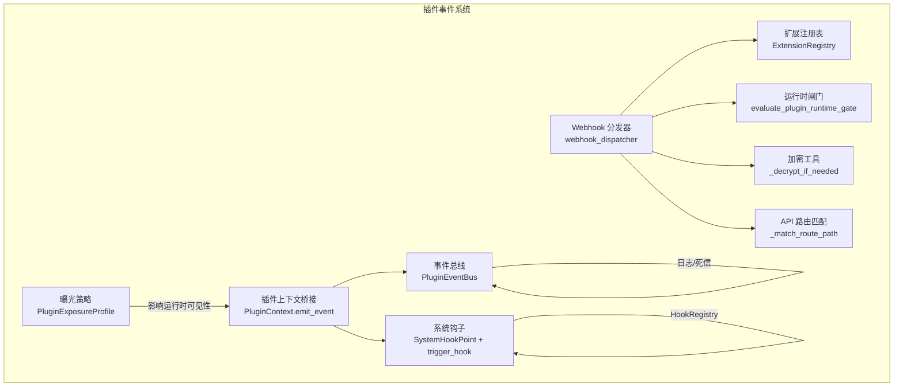
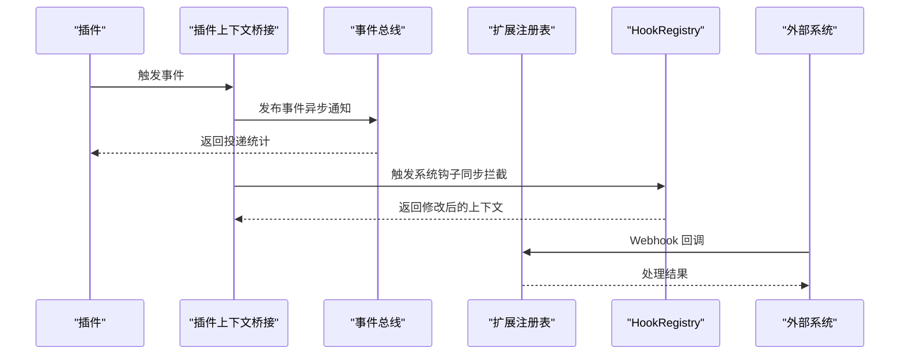
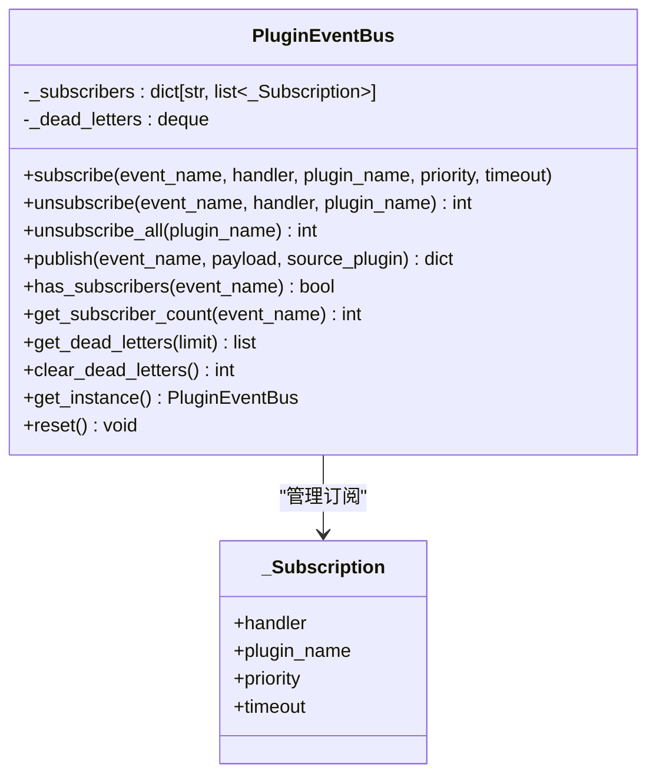
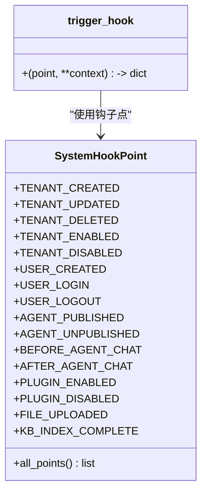
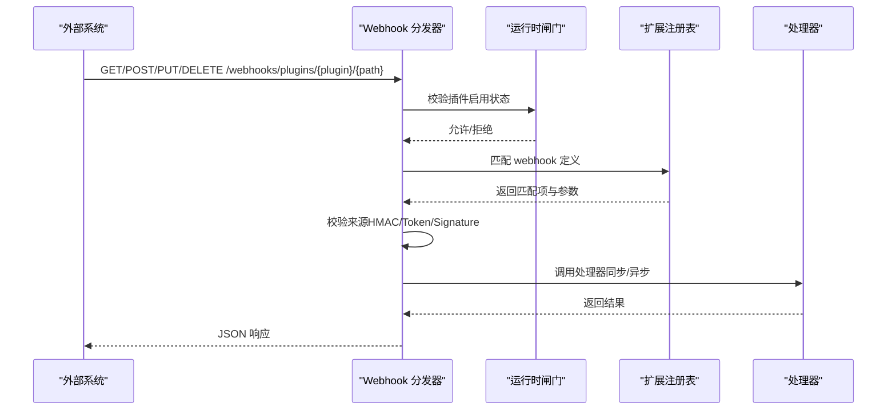
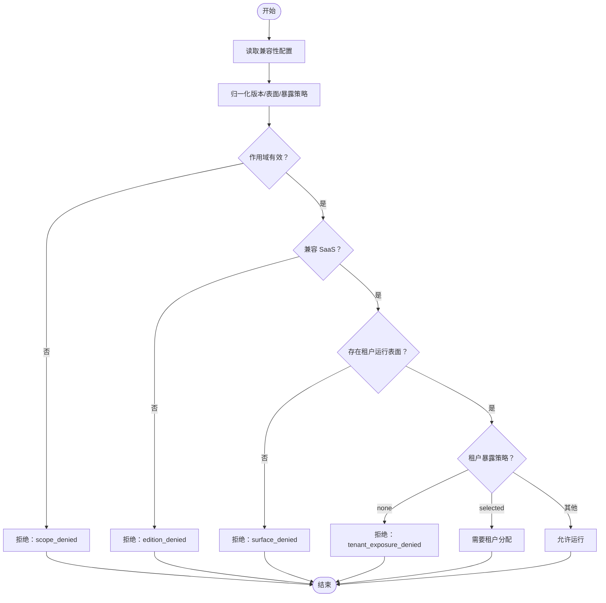
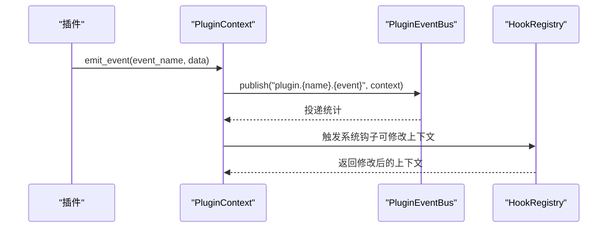
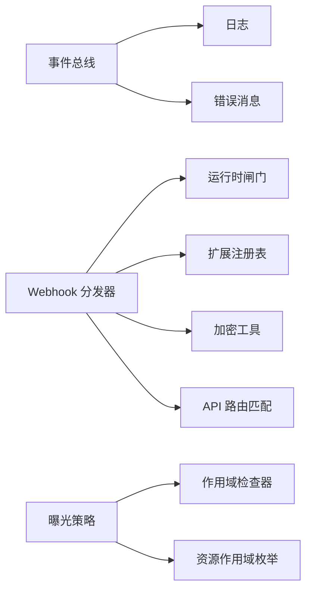

# 插件事件系统

<cite>
**本文引用的文件**
- [event_bus.py](file://backend/app/plugins/event_bus.py)
- [system_hooks.py](file://backend/app/plugins/system_hooks.py)
- [webhook_dispatcher.py](file://backend/app/plugins/webhook_dispatcher.py)
- [exposure_policy.py](file://backend/app/plugins/exposure_policy.py)
- [context.py](file://backend/app/plugins/context.py)
- [base.py](file://backend/app/plugins/base.py)
- [registry.py](file://backend/app/plugins/registry.py)
- [runtime_gate.py](file://backend/app/plugins/runtime_gate.py)
- [crypto.py](file://backend/app/plugins/crypto.py)
- [api_dispatcher.py](file://backend/app/plugins/api_dispatcher.py)
- [test_plugin_event_hook_runtime.py](file://tests/test_plugin_event_hook_runtime.py)
</cite>

## 目录
1. [简介](#简介)
2. [项目结构](#项目结构)
3. [核心组件](#核心组件)
4. [架构总览](#架构总览)
5. [组件详解](#组件详解)
6. [依赖关系分析](#依赖关系分析)
7. [性能考量](#性能考量)
8. [故障排除指南](#故障排除指南)
9. [结论](#结论)
10. [附录](#附录)

## 简介
本文件系统性地文档化了插件事件系统的设计与实现，覆盖以下主题：
- 插件事件总线的架构设计：事件发布订阅模式、事件路由与消息传递机制
- 系统钩子的实现原理：内置事件监听器与自定义事件处理器
- Webhook 分发器：外部系统集成与回调通知
- 曝光策略：控制插件事件的可见性与访问权限
- 性能优化：事件过滤、批量处理与异步处理
- 事件监控、调试与故障排除工具与方法

## 项目结构
插件事件系统主要由以下模块组成：
- 事件总线：跨插件异步事件分发与订阅
- 系统钩子：平台级同步拦截与上下文修改
- Webhook 分发器：外部系统回调入口与安全校验
- 曝光策略：插件版本与租户可见性控制
- 上下文桥接：在插件内部统一触发事件与钩子

**图表来源**
- [event_bus.py:44-342](file://backend/app/plugins/event_bus.py#L44-L342)
- [system_hooks.py:29-127](file://backend/app/plugins/system_hooks.py#L29-L127)
- [webhook_dispatcher.py:32-296](file://backend/app/plugins/webhook_dispatcher.py#L32-L296)
- [exposure_policy.py:37-234](file://backend/app/plugins/exposure_policy.py#L37-L234)
- [context.py:756-793](file://backend/app/plugins/context.py#L756-L793)
- [registry.py](file://backend/app/plugins/registry.py)
- [runtime_gate.py](file://backend/app/plugins/runtime_gate.py)
- [crypto.py](file://backend/app/plugins/crypto.py)
- [api_dispatcher.py](file://backend/app/plugins/api_dispatcher.py)

**章节来源**
- [event_bus.py:1-342](file://backend/app/plugins/event_bus.py#L1-L342)
- [system_hooks.py:1-127](file://backend/app/plugins/system_hooks.py#L1-L127)
- [webhook_dispatcher.py:1-296](file://backend/app/plugins/webhook_dispatcher.py#L1-L296)
- [exposure_policy.py:1-234](file://backend/app/plugins/exposure_policy.py#L1-L234)
- [context.py:756-793](file://backend/app/plugins/context.py#L756-L793)

## 核心组件
- 事件总线（PluginEventBus）
  - 单例模式，负责事件订阅、取消订阅与异步发布
  - 支持优先级排序、超时保护、死信队列与结构化日志
- 系统钩子（SystemHookPoint + trigger_hook）
  - 定义标准系统钩子点，框架在事件触发时调用插件处理器
  - 处理器可修改上下文并返回，非阻塞设计
- Webhook 分发器（webhook_dispatcher）
  - 统一外部回调入口，路径约定为 /webhooks/plugins/{plugin_name}/{path}
  - 运行时闸门校验、路由匹配、来源验证与处理器调用
- 曝光策略（PluginExposureProfile）
  - 描述插件在当前 SaaS 宿主中的版本兼容性与租户可见性
  - 影响插件是否可被运行与可见

**章节来源**
- [event_bus.py:44-342](file://backend/app/plugins/event_bus.py#L44-L342)
- [system_hooks.py:29-127](file://backend/app/plugins/system_hooks.py#L29-L127)
- [webhook_dispatcher.py:32-296](file://backend/app/plugins/webhook_dispatcher.py#L32-L296)
- [exposure_policy.py:37-234](file://backend/app/plugins/exposure_policy.py#L37-L234)

## 架构总览
插件事件系统通过“事件总线 + 系统钩子 + Webhook 分发器 + 曝光策略”的组合实现：
- 事件总线：跨插件异步通知，适合 fire-and-forget 场景
- 系统钩子：平台级同步拦截，适合前置/后置处理与上下文修改
- Webhook 分发器：外部系统回调入口，具备来源验证与错误处理
- 曝光策略：决定插件在宿主环境中的可用性与可见范围

**图表来源**
- [context.py:756-793](file://backend/app/plugins/context.py#L756-L793)
- [event_bus.py:170-264](file://backend/app/plugins/event_bus.py#L170-L264)
- [system_hooks.py:105-127](file://backend/app/plugins/system_hooks.py#L105-L127)
- [registry.py](file://backend/app/plugins/registry.py)

## 组件详解

### 事件总线（PluginEventBus）
- 设计要点
  - 单例：全局唯一实例，避免重复初始化
  - 订阅管理：按事件名维护订阅列表，去重与优先级排序
  - 异步发布：并行执行所有处理器，单处理器超时保护
  - 错误隔离：单个处理器异常不影响整体发布流程
  - 死信队列：记录失败事件，便于诊断与重放
  - 结构化日志：记录投递统计与延迟
- 关键接口
  - 订阅/取消订阅：subscribe/unsubscribe/unsubscribe_all
  - 发布：publish（返回投递统计与错误列表）
  - 辅助：has_subscribers/get_subscriber_count/get_dead_letters/clear_dead_letters
- 性能与可靠性
  - 默认单处理器超时 30 秒，防止阻塞
  - 最大负载约 1MB，超过则直接拒绝
  - 并行执行提升吞吐，异常独立处理

**图表来源**
- [event_bus.py:44-342](file://backend/app/plugins/event_bus.py#L44-L342)

**章节来源**
- [event_bus.py:44-342](file://backend/app/plugins/event_bus.py#L44-L342)

### 系统钩子（SystemHookPoint + trigger_hook）
- 设计要点
  - 标准化钩子点常量，涵盖租户、用户、Agent、AI 调用、插件生命周期、文件/存储、知识库等场景
  - trigger_hook 在系统事件发生时自动调用插件处理器
  - 处理器签名要求返回上下文（可修改），便于链式处理
- 使用方式
  - 在插件清单中声明钩子点与处理器映射
  - 框架侧通过 HookRegistry 触发，trigger_hook 提供便捷入口
- 与事件总线的关系
  - 系统钩子为同步拦截，可修改上下文；事件总线为异步通知，只读
  - 两者互补，分别适用于需要“前置/后置处理”和“广播通知”的场景

**图表来源**
- [system_hooks.py:29-127](file://backend/app/plugins/system_hooks.py#L29-L127)

**章节来源**
- [system_hooks.py:1-127](file://backend/app/plugins/system_hooks.py#L1-L127)

### Webhook 分发器（webhook_dispatcher）
- 设计要点
  - 路径约定：/webhooks/plugins/{plugin_name}/{path}
  - 运行时闸门：校验插件存在且启用，避免未授权访问
  - 路由匹配：基于插件清单中的 webhooks 定义进行路径匹配
  - 来源验证：支持 HMAC、Token、Signature 等多种认证方式
  - 处理器调用：支持同步/异步处理器，统一返回 JSON
- 安全与健壮性
  - 认证失败返回 401
  - 处理器异常记录日志并返回通用错误
  - 支持对加密密钥的解密处理

**图表来源**
- [webhook_dispatcher.py:32-296](file://backend/app/plugins/webhook_dispatcher.py#L32-L296)
- [runtime_gate.py](file://backend/app/plugins/runtime_gate.py)
- [registry.py](file://backend/app/plugins/registry.py)
- [crypto.py](file://backend/app/plugins/crypto.py)
- [api_dispatcher.py](file://backend/app/plugins/api_dispatcher.py)

**章节来源**
- [webhook_dispatcher.py:1-296](file://backend/app/plugins/webhook_dispatcher.py#L1-L296)

### 曝光策略（PluginExposureProfile）
- 设计要点
  - 描述插件在当前宿主（如 SaaS）中的版本兼容性与表面（admin/tenant/user/platform/global）
  - 控制租户运行时可见性与分配要求，决定插件是否可被启用与访问
  - 提供拒绝原因（如 scope_denied、edition_denied、surface_denied、tenant_exposure_denied）
- 关键字段
  - 当前版本、声明版本集合、表面集合
  - 是否兼容 SaaS 或单体管理版
  - 租户暴露策略（默认/全部/选择性/不暴露）
  - 运行时作用域与拒绝原因

**图表来源**
- [exposure_policy.py:69-221](file://backend/app/plugins/exposure_policy.py#L69-L221)

**章节来源**
- [exposure_policy.py:1-234](file://backend/app/plugins/exposure_policy.py#L1-L234)

### 插件上下文桥接（PluginContext.emit_event）
- 设计要点
  - 在插件内部统一触发事件：先通过事件总线异步通知，再通过系统钩子同步拦截
  - 事件命名规范：plugin.{plugin_name}.{event_name}
  - 事件总线仅做通知，不修改上下文；钩子可修改上下文并返回
- 与事件总线的协作
  - 若存在订阅者，则发布事件并记录投递统计
  - 之后触发 HookRegistry，接收修改后的上下文

**图表来源**
- [context.py:756-793](file://backend/app/plugins/context.py#L756-L793)
- [event_bus.py:170-264](file://backend/app/plugins/event_bus.py#L170-L264)
- [system_hooks.py:105-127](file://backend/app/plugins/system_hooks.py#L105-L127)

**章节来源**
- [context.py:756-793](file://backend/app/plugins/context.py#L756-L793)

## 依赖关系分析
- 事件总线依赖
  - 日志：结构化日志记录
  - 错误消息：对外展示的错误摘要
- Webhook 分发器依赖
  - 运行时闸门：校验插件启用状态
  - 扩展注册表：定位插件 webhook 定义
  - 加密工具：解密存储的密钥
  - API 路由匹配：路径参数提取
- 曝光策略依赖
  - 作用域检查器：判断租户可能的作用域
  - 资源作用域枚举：分配所需的作用域

**图表来源**
- [event_bus.py:32-33](file://backend/app/plugins/event_bus.py#L32-L33)
- [webhook_dispatcher.py:53-89](file://backend/app/plugins/webhook_dispatcher.py#L53-L89)
- [exposure_policy.py:9-11](file://backend/app/plugins/exposure_policy.py#L9-L11)

**章节来源**
- [event_bus.py:1-342](file://backend/app/plugins/event_bus.py#L1-L342)
- [webhook_dispatcher.py:1-296](file://backend/app/plugins/webhook_dispatcher.py#L1-L296)
- [exposure_policy.py:1-234](file://backend/app/plugins/exposure_policy.py#L1-L234)

## 性能考量
- 事件过滤
  - 使用事件命名规范与订阅去重，减少无效处理
  - 通过 has_subscribers 判断后再发布，避免空订阅开销
- 批量处理
  - 事件总线采用并行执行所有处理器，提高吞吐
  - 对于高频事件，建议在业务层聚合后再发布，降低总线压力
- 异步处理
  - 事件总线默认异步，避免阻塞发布方
  - Webhook 分发器对处理器调用也采用异步（若处理器为协程）
- 超时与负载
  - 单处理器默认超时 30 秒，防止慢处理器拖垮总线
  - 最大负载约 1MB，超限直接拒绝，避免内存膨胀
- 死信队列
  - 记录失败事件，便于后续重放与诊断

**章节来源**
- [event_bus.py:170-264](file://backend/app/plugins/event_bus.py#L170-L264)

## 故障排除指南
- 事件总线问题
  - 无订阅者：发布返回 delivered=0，检查事件命名与订阅是否正确
  - 负载过大：发布返回错误列表，检查 payload 大小与结构
  - 处理器异常：查看死信队列与日志，定位具体插件与错误
  - 超时：调整处理器逻辑或增加超时时间
- Webhook 分发器问题
  - 404：检查路径与插件清单中的 webhook 定义
  - 401：确认认证类型与密钥配置，确保解密成功
  - 500：查看处理器异常日志，修复业务逻辑
- 曝光策略问题
  - 插件不可见：检查版本兼容性、表面集合与租户暴露策略
  - 运行时拒绝：根据拒绝原因（scope/edition/surface/exposure）逐项排查

**章节来源**
- [event_bus.py:170-309](file://backend/app/plugins/event_bus.py#L170-L309)
- [webhook_dispatcher.py:93-205](file://backend/app/plugins/webhook_dispatcher.py#L93-L205)
- [exposure_policy.py:203-221](file://backend/app/plugins/exposure_policy.py#L203-L221)

## 结论
插件事件系统通过“事件总线 + 系统钩子 + Webhook 分发器 + 曝光策略”的协同，实现了：
- 异步广播通知与同步拦截增强的双轨机制
- 外部系统安全接入与内部插件生态的统一治理
- 基于版本与租户可见性的精细化权限控制
配合合理的事件过滤、批量处理与异步策略，系统在高并发场景下仍能保持稳定与可观测性。

## 附录
- 测试参考
  - 插件事件与钩子运行时集成测试：验证清单到注册表再到事件总线与钩子的桥接完整性

**章节来源**
- [test_plugin_event_hook_runtime.py:28-71](file://tests/test_plugin_event_hook_runtime.py#L28-L71)