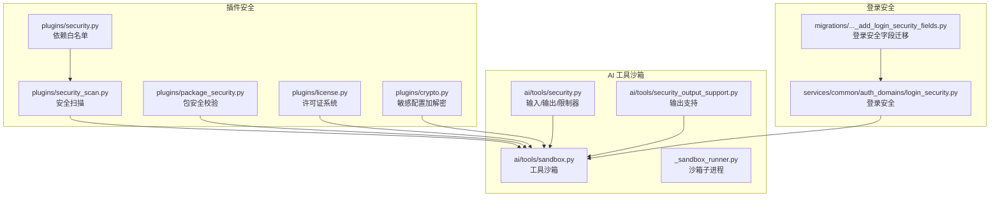
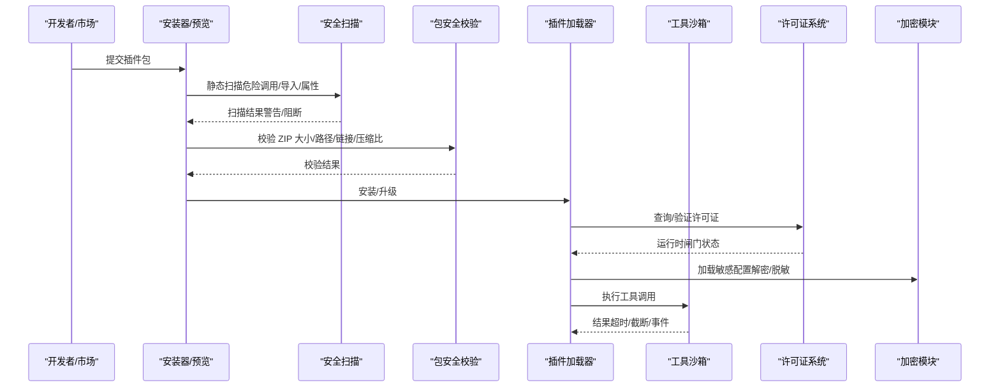
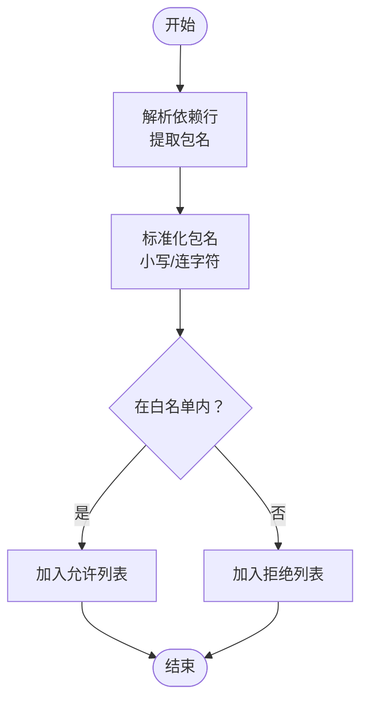
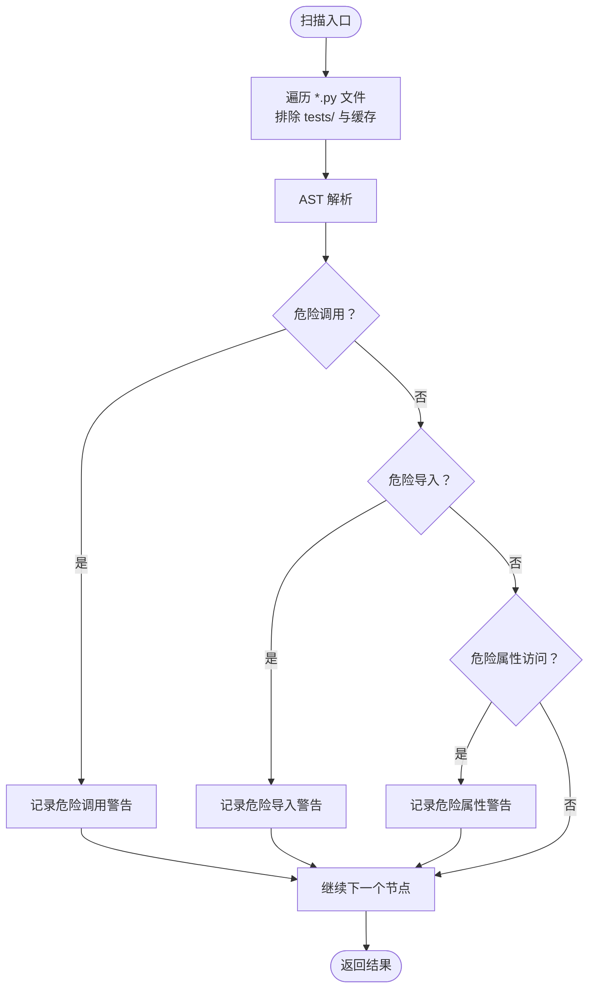
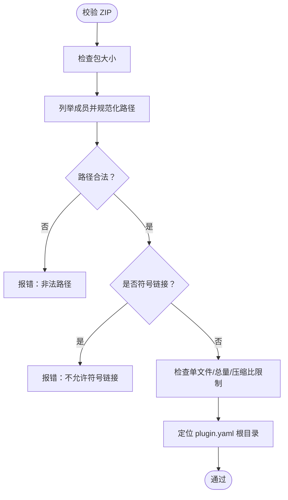
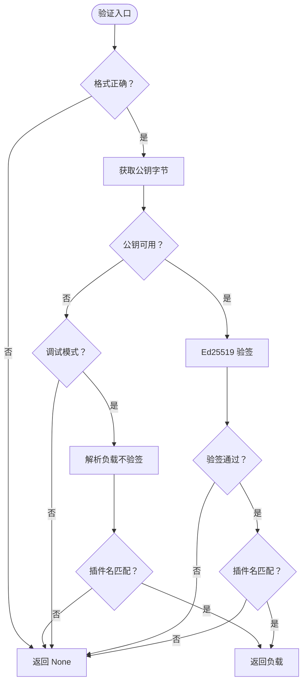
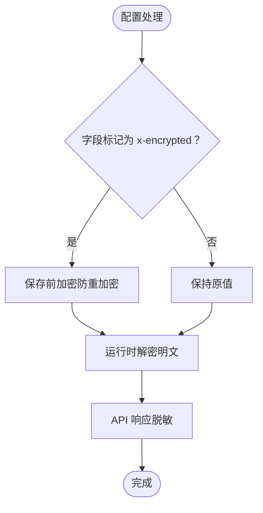
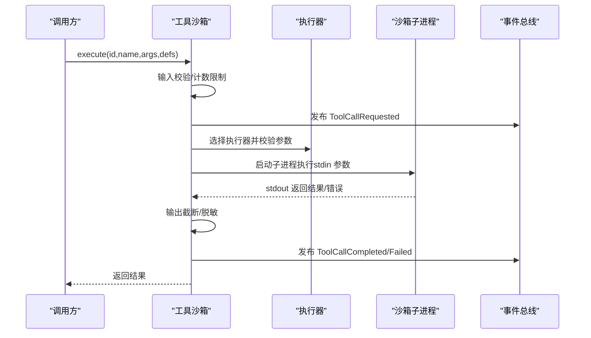
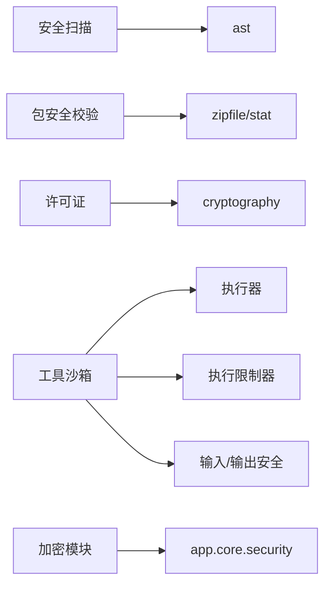

# 插件安全模型

<cite>
**本文引用的文件**   
- [security.py](file://backend/app/plugins/security.py)
- [security_scan.py](file://backend/app/plugins/security_scan.py)
- [package_security.py](file://backend/app/plugins/package_security.py)
- [license.py](file://backend/app/plugins/license.py)
- [crypto.py](file://backend/app/plugins/crypto.py)
- [sandbox.py](file://backend/app/ai/tools/sandbox.py)
- [_sandbox_runner.py](file://backend/app/ai/tools/executors/_sandbox_runner.py)
- [security.py](file://backend/app/ai/tools/security.py)
- [security_output_support.py](file://backend/app/ai/tools/security_output_support.py)
- [login_security.py](file://backend/app/services/common/auth_domains/login_security.py)
- [20260123_0006_add_login_security_fields.py](file://backend/migrations/versions/20260123_0006_add_login_security_fields.py)
- [test_plugin_api_dispatcher_security.py](file://backend/tests/test_plugin_api_dispatcher_security.py)
- [test_plugin_package_security.py](file://backend/tests/test_plugin_package_security.py)
- [test_plugin_webhook_dispatcher_security.py](file://backend/tests/test_plugin_webhook_dispatcher_security.py)
- [test_plugin_crypto.py](file://backend/tests/test_plugin_crypto.py)
- [test_toolkit_sandbox.py](file://backend/tests/test_toolkit_sandbox.py)
- [test_pip_install_security.py](file://backend/tests/test_pip_install_security.py)
</cite>

## 目录
1. [简介](#简介)
2. [项目结构](#项目结构)
3. [核心组件](#核心组件)
4. [架构总览](#架构总览)
5. [详细组件分析](#详细组件分析)
6. [依赖关系分析](#依赖关系分析)
7. [性能考量](#性能考量)
8. [故障排查指南](#故障排查指南)
9. [结论](#结论)
10. [附录](#附录)

## 简介
本文件系统化阐述插件安全模型，涵盖以下方面：
- 插件沙箱隔离机制：代码执行限制、资源访问控制、权限边界与运行时闸门
- 插件安全扫描体系：恶意代码检测、依赖漏洞扫描与合规性检查
- 加密机制：插件签名验证、数据加密传输与密钥管理
- 许可证系统：版本验证、功能锁定与使用审计
- 安全开发最佳实践：输入验证、输出编码与安全配置
- 安全事件响应与威胁防护策略

## 项目结构
围绕插件安全的关键模块主要分布在 backend/app/plugins 与 backend/app/ai/tools 下，同时涉及登录安全与迁移脚本。

**图表来源**
- [security.py:1-74](file://backend/app/plugins/security.py#L1-L74)
- [security_scan.py:1-268](file://backend/app/plugins/security_scan.py#L1-L268)
- [package_security.py:1-196](file://backend/app/plugins/package_security.py#L1-L196)
- [license.py:1-710](file://backend/app/plugins/license.py#L1-L710)
- [crypto.py:1-124](file://backend/app/plugins/crypto.py#L1-L124)
- [sandbox.py:1-575](file://backend/app/ai/tools/sandbox.py#L1-L575)
- [_sandbox_runner.py:1-225](file://backend/app/ai/tools/executors/_sandbox_runner.py#L1-L225)
- [security.py](file://backend/app/ai/tools/security.py)
- [security_output_support.py](file://backend/app/ai/tools/security_output_support.py)
- [login_security.py](file://backend/app/services/common/auth_domains/login_security.py)
- [20260123_0006_add_login_security_fields.py](file://backend/migrations/versions/20260123_0006_add_login_security_fields.py)

**章节来源**
- [security.py:1-74](file://backend/app/plugins/security.py#L1-L74)
- [security_scan.py:1-268](file://backend/app/plugins/security_scan.py#L1-L268)
- [package_security.py:1-196](file://backend/app/plugins/package_security.py#L1-L196)
- [license.py:1-710](file://backend/app/plugins/license.py#L1-L710)
- [crypto.py:1-124](file://backend/app/plugins/crypto.py#L1-L124)
- [sandbox.py:1-575](file://backend/app/ai/tools/sandbox.py#L1-L575)
- [_sandbox_runner.py:1-225](file://backend/app/ai/tools/executors/_sandbox_runner.py#L1-L225)
- [security.py](file://backend/app/ai/tools/security.py)
- [security_output_support.py](file://backend/app/ai/tools/security_output_support.py)
- [login_security.py](file://backend/app/services/common/auth_domains/login_security.py)
- [20260123_0006_add_login_security_fields.py](file://backend/migrations/versions/20260123_0006_add_login_security_fields.py)

## 核心组件
- 依赖白名单与安装安全：对插件依赖进行白名单校验，避免引入高风险包。
- 安全扫描：静态扫描插件 Python 代码，识别危险调用、导入与属性访问。
- 包安全校验：ZIP 包大小、路径合法性、链接文件与压缩比限制，确保解压安全。
- 许可证系统：Ed25519 离线签名验证、状态解析、运行时闸门与到期处理。
- 敏感配置加密：基于 Fernet 的自动加解密与 API 脱敏。
- 工具执行沙箱：超时控制、输出截断、域名过滤、Hook 与事件总线、子进程隔离。
- 登录安全：登录安全字段与策略，配合迁移脚本完善安全基线。

**章节来源**
- [security.py:1-74](file://backend/app/plugins/security.py#L1-L74)
- [security_scan.py:1-268](file://backend/app/plugins/security_scan.py#L1-L268)
- [package_security.py:1-196](file://backend/app/plugins/package_security.py#L1-L196)
- [license.py:1-710](file://backend/app/plugins/license.py#L1-L710)
- [crypto.py:1-124](file://backend/app/plugins/crypto.py#L1-L124)
- [sandbox.py:1-575](file://backend/app/ai/tools/sandbox.py#L1-L575)
- [login_security.py](file://backend/app/services/common/auth_domains/login_security.py)
- [20260123_0006_add_login_security_fields.py](file://backend/migrations/versions/20260123_0006_add_login_security_fields.py)

## 架构总览
插件安全贯穿“安装前校验—运行时保护—许可证控制—审计与响应”全流程。

**图表来源**
- [security_scan.py:111-187](file://backend/app/plugins/security_scan.py#L111-L187)
- [package_security.py:29-96](file://backend/app/plugins/package_security.py#L29-L96)
- [license.py:421-444](file://backend/app/plugins/license.py#L421-L444)
- [crypto.py:64-123](file://backend/app/plugins/crypto.py#L64-L123)
- [sandbox.py:186-499](file://backend/app/ai/tools/sandbox.py#L186-L499)

## 详细组件分析

### 依赖白名单与安装安全
- 功能要点
  - 从 requirements 文本解析包名，标准化后与白名单比对
  - 将依赖拆分为允许与拒绝两组，便于预览与安装阶段决策
- 关键点
  - 支持 extras（如 numpy[blas]）与注释行过滤
  - 严格大小写与连字符归一化，避免绕过
- 安全意义
  - 限制高风险第三方库进入插件运行环境，降低供应链风险

**图表来源**
- [security.py:31-70](file://backend/app/plugins/security.py#L31-L70)

**章节来源**
- [security.py:1-74](file://backend/app/plugins/security.py#L1-L74)
- [test_pip_install_security.py](file://backend/tests/test_pip_install_security.py)

### 插件安全扫描系统
- 功能要点
  - 遍历 backend 目录下的 Python 文件，AST 解析并扫描
  - 危险调用：eval/exec/compile/__import__/breakpoint/exit/quit
  - 危险模块：os/subprocess/shutil/ctypes/pickle/marshal/socket/multiprocessing/threading/importlib/builtins/signal
  - importlib 安全子模块白名单：util/metadata/abc/resources/machinery
  - 危险属性访问：os.system/popen、shutil.rmtree/copy、subprocess.run/Popen 等
- 行为规则
  - 预览安装：将警告汇总为预览信息
  - 实际安装/升级：fail-close，存在警告即抛出安全异常阻断
- 异常处理
  - 文件读取/语法错误统一转化为可公开的错误消息

**图表来源**
- [security_scan.py:111-267](file://backend/app/plugins/security_scan.py#L111-L267)

**章节来源**
- [security_scan.py:1-268](file://backend/app/plugins/security_scan.py#L1-L268)
- [test_plugin_api_dispatcher_security.py](file://backend/tests/test_plugin_api_dispatcher_security.py)
- [test_plugin_webhook_dispatcher_security.py](file://backend/tests/test_plugin_webhook_dispatcher_security.py)

### 包安全校验与 ZIP 解压
- 功能要点
  - 包大小、成员数量、单文件大小、解压后总大小、压缩比上限
  - 路径规范化：禁止绝对路径、Windows 盘符、.. 回溯
  - 禁止符号链接
  - 定位 plugin.yaml 所在根目录
- 安全意义
  - 防止 ZIP 恶意路径写入、路径穿越、资源耗尽攻击

**图表来源**
- [package_security.py:29-188](file://backend/app/plugins/package_security.py#L29-L188)

**章节来源**
- [package_security.py:1-196](file://backend/app/plugins/package_security.py#L1-L196)
- [test_plugin_package_security.py](file://backend/tests/test_plugin_package_security.py)

### 许可证系统与运行时闸门
- 离线签名验证
  - 基于 Ed25519，公钥嵌入代码，私钥仅在生成端持有
  - Key 格式：NOVUS-{base64_payload}.{base64_signature}
  - 支持环境变量覆盖公钥，调试模式下可放宽校验
- 状态解析与排序
  - 状态优先级：active > expired > revoked
  - 付费优先于试用，新记录优先于旧记录
  - 试用与固定期限/永久授权区分
- 运行时闸门
  - 对付费插件强制执行运行时许可检查
  - 不满足条件抛出许可证异常，阻断执行
- 到期与撤销
  - 定期检查到期并禁用插件，记录动作与原因

**图表来源**
- [license.py:111-177](file://backend/app/plugins/license.py#L111-L177)

**章节来源**
- [license.py:1-710](file://backend/app/plugins/license.py#L1-L710)
- [test_plugin_license_verification_policy.py](file://backend/tests/test_plugin_license_verification_policy.py)
- [test_plugin_lifecycle_license_gate.py](file://backend/tests/test_plugin_lifecycle_license_gate.py)
- [test_plugin_service_license_activation.py](file://backend/tests/test_plugin_service_license_activation.py)
- [test_plugin_trial_license_policy.py](file://backend/tests/test_plugin_trial_license_policy.py)

### 敏感配置加密与密钥管理
- 功能要点
  - 基于 JSON Schema 的 x-encrypted 标记，自动对字段执行加解密与脱敏
  - 存储前加密：仅对未加密值进行加密（以特定前缀识别）
  - 运行时解密：在上下文中返回明文
  - API 脱敏：对外响应中对敏感字段进行掩码
- 依赖
  - 复用应用层通用加密接口

**图表来源**
- [crypto.py:64-123](file://backend/app/plugins/crypto.py#L64-L123)

**章节来源**
- [crypto.py:1-124](file://backend/app/plugins/crypto.py#L1-L124)
- [test_plugin_crypto.py](file://backend/tests/test_plugin_crypto.py)

### 工具执行沙箱与子进程隔离
- 功能要点
  - 超时控制：按工具定义或全局配置设置超时
  - 输出截断与脱敏：防止输出过大或泄露敏感信息
  - 域名过滤：HTTP 工具仅允许/禁止访问指定域
  - Hook 与事件总线：执行前后钩子与事件发布
  - 子进程隔离：Toolkit 在独立子进程中执行，资源限制（内存 RLIMIT_AS）
- 关键流程
  - 输入校验与调用次数限制
  - 执行器选择与参数校验
  - 超时等待与异常捕获
  - 输出处理与事件发布

**图表来源**
- [sandbox.py:186-499](file://backend/app/ai/tools/sandbox.py#L186-L499)
- [_sandbox_runner.py:125-224](file://backend/app/ai/tools/executors/_sandbox_runner.py#L125-L224)

**章节来源**
- [sandbox.py:1-575](file://backend/app/ai/tools/sandbox.py#L1-L575)
- [_sandbox_runner.py:1-225](file://backend/app/ai/tools/executors/_sandbox_runner.py#L1-L225)
- [test_toolkit_sandbox.py](file://backend/tests/test_toolkit_sandbox.py)

### 登录安全与合规基线
- 登录安全字段与策略
  - 迁移脚本新增登录安全相关字段，强化认证与审计
- 与插件安全的协同
  - 通过更强的登录安全，降低插件侧被滥用的风险面

**章节来源**
- [login_security.py](file://backend/app/services/common/auth_domains/login_security.py)
- [20260123_0006_add_login_security_fields.py](file://backend/migrations/versions/20260123_0006_add_login_security_fields.py)

## 依赖关系分析
- 组件耦合
  - 安全扫描与包安全校验共同构成安装前防线，相互独立但顺序明确
  - 许可证系统与加密模块分别负责“准入控制”和“数据保护”，与沙箱形成互补
  - 工具沙箱依赖输入/输出安全与执行限制器，形成运行时闭环
- 外部依赖
  - cryptography（Ed25519 签名）
  - ast（安全扫描 AST 分析）
  - zipfile/stat（包安全校验）
  - asyncio/resource（沙箱超时与资源限制）

**图表来源**
- [security_scan.py:17-23](file://backend/app/plugins/security_scan.py#L17-L23)
- [package_security.py:5-11](file://backend/app/plugins/package_security.py#L5-L11)
- [license.py:83-89](file://backend/app/plugins/license.py#L83-L89)
- [sandbox.py:23-29](file://backend/app/ai/tools/sandbox.py#L23-L29)
- [crypto.py:72-93](file://backend/app/plugins/crypto.py#L72-L93)

**章节来源**
- [security_scan.py:1-268](file://backend/app/plugins/security_scan.py#L1-L268)
- [package_security.py:1-196](file://backend/app/plugins/package_security.py#L1-L196)
- [license.py:1-710](file://backend/app/plugins/license.py#L1-L710)
- [sandbox.py:1-575](file://backend/app/ai/tools/sandbox.py#L1-L575)
- [crypto.py:1-124](file://backend/app/plugins/crypto.py#L1-L124)

## 性能考量
- 安全扫描
  - AST 遍历复杂度与文件规模线性相关，建议控制扫描范围与缓存结果
- 包安全校验
  - 单文件读取采用分块策略，避免内存峰值过高
- 许可证验证
  - Ed25519 验签开销极低，且为本地离线验证，对性能影响可忽略
- 工具沙箱
  - 子进程隔离带来额外开销，可通过合理超时与内存限制平衡安全与性能

## 故障排查指南
- 安装失败（依赖不在白名单）
  - 检查 requirements 是否包含受限制包，必要时调整依赖或使用替代方案
- 安全扫描阻断
  - 查看扫描警告清单，修正危险调用/导入/属性访问
- 包安全校验失败
  - 检查 ZIP 路径是否包含 ..、绝对路径或符号链接；确认压缩比与大小未超限
- 许可证验证失败
  - 确认公钥配置正确；调试模式下注意插件名匹配；检查 Key 格式与有效期
- 加密字段异常
  - 确认 JSON Schema 中 x-encrypted 标记；检查存储前加密与运行时解密链路
- 沙箱超时/错误
  - 调整超时与内存限制；检查执行器参数与外部依赖；关注事件总线与日志

**章节来源**
- [security.py:55-70](file://backend/app/plugins/security.py#L55-L70)
- [security_scan.py:155-187](file://backend/app/plugins/security_scan.py#L155-L187)
- [package_security.py:41-96](file://backend/app/plugins/package_security.py#L41-L96)
- [license.py:111-177](file://backend/app/plugins/license.py#L111-L177)
- [crypto.py:64-123](file://backend/app/plugins/crypto.py#L64-L123)
- [sandbox.py:404-499](file://backend/app/ai/tools/sandbox.py#L404-L499)

## 结论
该插件安全模型通过“安装前扫描与校验—运行时沙箱与限制—许可证闸门—敏感数据保护—登录安全基线”的多层防护，构建了从供应链到运行时的全链路安全体系。建议持续优化扫描规则、细化资源限制、完善审计与告警机制，并结合自动化测试保障变更质量。

## 附录
- 安全开发最佳实践
  - 输入验证：严格 schema 校验与类型约束
  - 输出编码：脱敏与截断，避免敏感信息泄露
  - 安全配置：最小权限原则，敏感字段必须加密存储与脱敏输出
  - 依赖治理：仅使用白名单内包，定期审计与更新
  - 日志与审计：保留不可抵赖的操作轨迹，便于追溯
- 威胁防护策略
  - 阻断高危调用与导入，限制网络访问域
  - 严控 ZIP 包路径与压缩比，防止路径穿越与资源耗尽
  - 强化登录安全，启用多因子与审计
  - 定期检查许可证状态，及时禁用过期插件