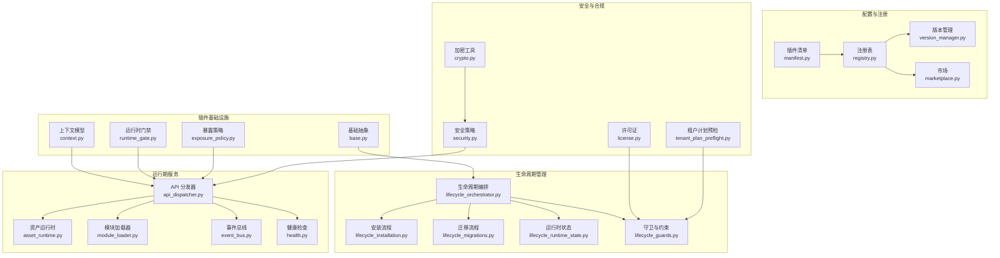
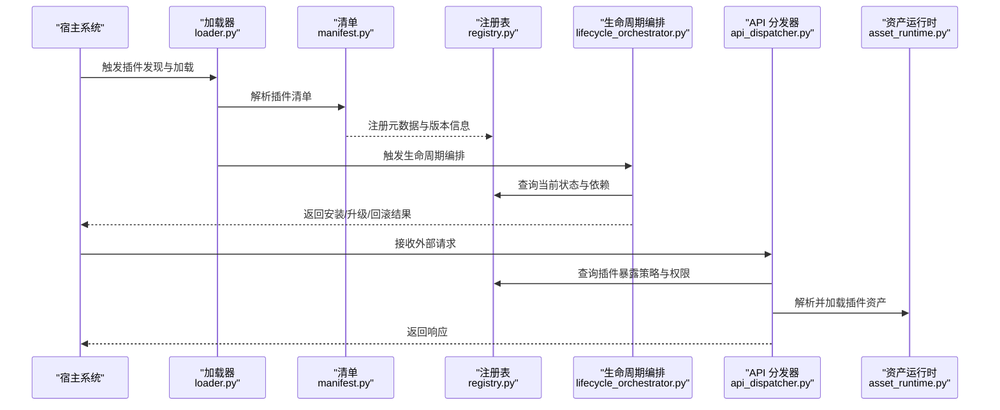
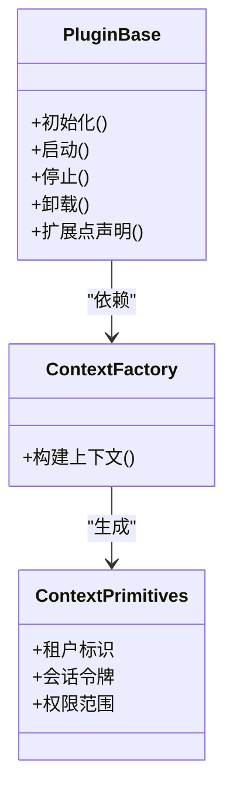
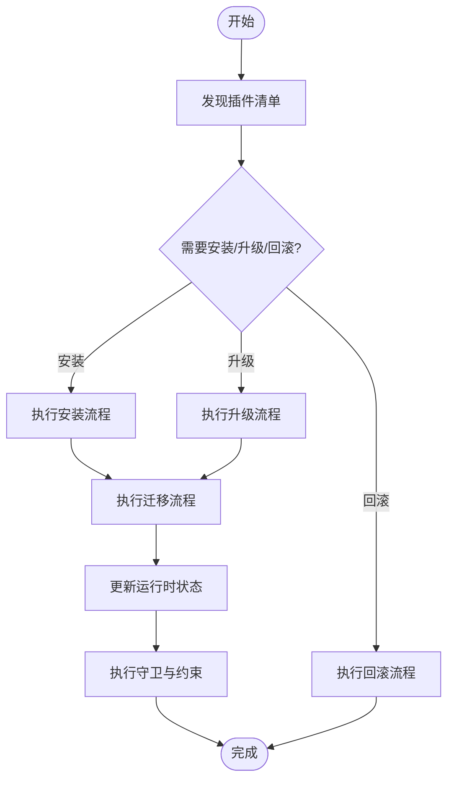
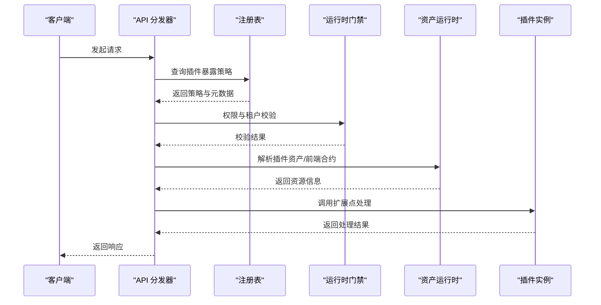
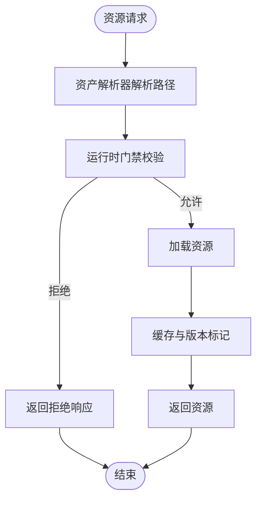
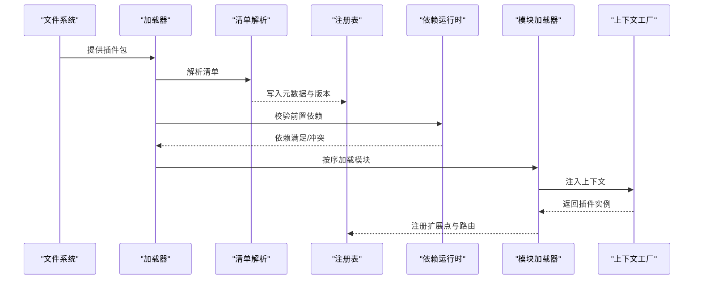
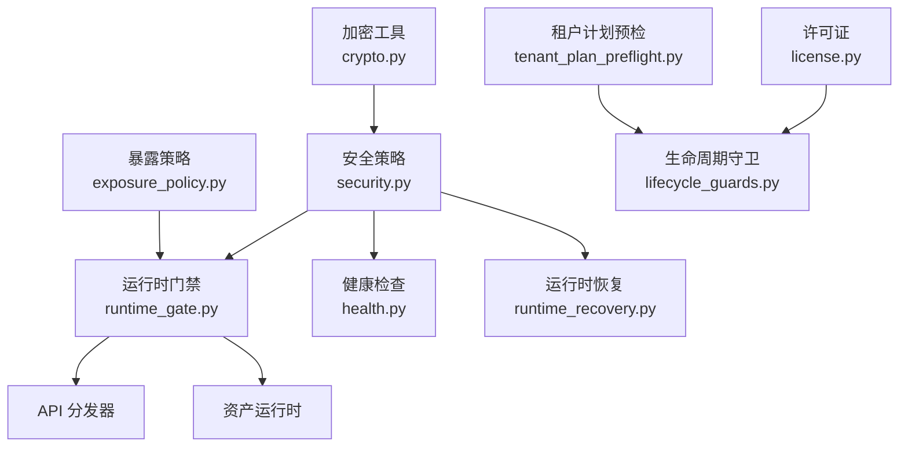
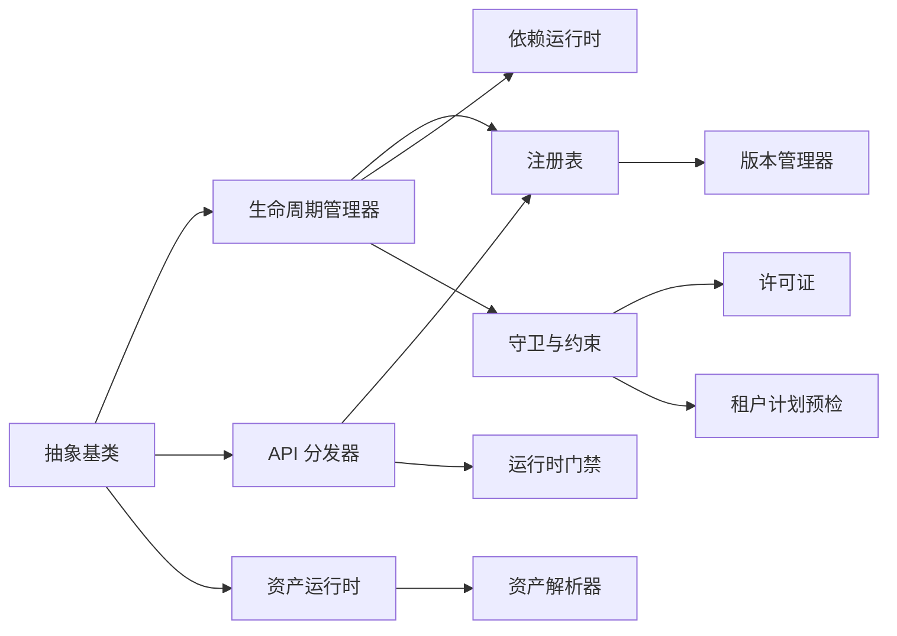

# 插件架构设计

<cite>
**本文引用的文件**
- [backend/app/plugins/base.py](file://backend/app/plugins/base.py)
- [backend/app/plugins/lifecycle.py](file://backend/app/plugins/lifecycle.py)
- [backend/app/plugins/api_dispatcher.py](file://backend/app/plugins/api_dispatcher.py)
- [backend/app/plugins/asset_runtime.py](file://backend/app/plugins/asset_runtime.py)
- [backend/app/plugins/loader.py](file://backend/app/plugins/loader.py)
- [backend/app/plugins/manifest.py](file://backend/app/plugins/manifest.py)
- [backend/app/plugins/registry.py](file://backend/app/plugins/registry.py)
- [backend/app/plugins/version_manager.py](file://backend/app/plugins/version_manager.py)
- [backend/app/plugins/security.py](file://backend/app/plugins/security.py)
- [backend/app/plugins/crypto.py](file://backend/app/plugins/crypto.py)
- [backend/app/plugins/dependencies.py](file://backend/app/plugins/dependencies.py)
- [backend/app/plugins/runtime_gate.py](file://backend/app/plugins/runtime_gate.py)
- [backend/app/plugins/runtime_recovery.py](file://backend/app/plugins/runtime_recovery.py)
- [backend/app/plugins/scheduler_refresh.py](file://backend/app/plugins/scheduler_refresh.py)
- [backend/app/plugins/marketplace.py](file://backend/app/plugins/marketplace.py)
- [backend/app/plugins/system_hooks.py](file://backend/app/plugins/system_hooks.py)
- [backend/app/plugins/context.py](file://backend/app/plugins/context.py)
- [backend/app/plugins/context_factory.py](file://backend/app/plugins/context_factory.py)
- [backend/app/plugins/context_primitives.py](file://backend/app/plugins/context_primitives.py)
- [backend/app/plugins/exception.py](file://backend/app/plugins/exceptions.py)
- [backend/app/plugins/startup.py](file://backend/app/plugins/startup.py)
- [backend/app/plugins/module_loader.py](file://backend/app/plugins/module_loader.py)
- [backend/app/plugins/asset_resolver.py](file://backend/app/plugins/asset_resolver.py)
- [backend/app/plugins/webhook_dispatcher.py](file://backend/app/plugins/webhook_dispatcher.py)
- [backend/app/plugins/event_bus.py](file://backend/app/plugins/event_bus.py)
- [backend/app/plugins/health.py](file://backend/app/plugins/health.py)
- [backend/app/plugins/exposure_policy.py](file://backend/app/plugins/exposure_policy.py)
- [backend/app/plugins/feature_entitlement_guards.py](file://backend/app/plugins/feature_entitlement_guards.py)
- [backend/app/plugins/license.py](file://backend/app/plugins/license.py)
- [backend/app/plugins/tenant_plan_preflight.py](file://backend/app/plugins/tenant_plan_preflight.py)
- [backend/app/plugins/update_checker.py](file://backend/app/plugins/update_checker.py)
- [backend/app/plugins/sio_auth.py](file://backend/app/plugins/sio_auth.py)
- [backend/app/plugins/sse.py](file://backend/app/plugins/sse.py)
- [backend/app/plugins/preview.py](file://backend/app/plugins/preview.py)
- [backend/app/plugins/progress.py](file://backend/app/plugins/progress.py)
- [backend/app/plugins/backup.py](file://backend/app/plugins/backup.py)
- [backend/app/plugins/host_read_facade.py](file://backend/app/plugins/host_read_facade.py)
- [backend/app/plugins/registry_read_layer.py](file://backend/app/plugins/registry_read_layer.py)
- [backend/app/plugins/registry_runtime_extensions.py](file://backend/app/plugins/registry_runtime_extensions.py)
- [backend/app/plugins/migration_paths.py](file://backend/app/plugins/migration_paths.py)
- [backend/app/plugins/lifecycle_orchestrator.py](file://backend/app/plugins/lifecycle_orchestrator.py)
- [backend/app/plugins/lifecycle_installation.py](file://backend/app/plugins/lifecycle_installation.py)
- [backend/app/plugins/lifecycle_migrations.py](file://backend/app/plugins/lifecycle_migrations.py)
- [backend/app/plugins/lifecycle_runtime_state.py](file://backend/app/plugins/lifecycle_runtime_state.py)
- [backend/app/plugins/lifecycle_support.py](file://backend/app/plugins/lifecycle_support.py)
- [backend/app/plugins/lifecycle_guards.py](file://backend/app/plugins/lifecycle_guards.py)
- [backend/app/plugins/lifecycle_dependency_runtime.py](file://backend/app/plugins/lifecycle_dependency_runtime.py)
- [backend/app/plugins/lifecycle_orchestrator_maintenance.py](file://backend/app/plugins/lifecycle_orchestrator_maintenance.py)
- [backend/app/plugins/lifecycle_parts/facade_modules.py](file://backend/app/plugins/lifecycle_parts/facade_modules.py)
- [backend/app/plugins/marketplace_registry/registry.json](file://backend/app/plugins/marketplace_registry/registry.json)
</cite>

## 目录
1. [引言](#引言)
2. [项目结构](#项目结构)
3. [核心组件](#核心组件)
4. [架构总览](#架构总览)
5. [详细组件分析](#详细组件分析)
6. [依赖关系分析](#依赖关系分析)
7. [性能考量](#性能考量)
8. [故障排除指南](#故障排除指南)
9. [结论](#结论)
10. [附录](#附录)

## 引言
本设计文档面向 NovusAI SaaS 的动态插件系统，系统性阐述插件架构模式与实现要点，覆盖插件生命周期管理、API 扩展机制、资源运行时设计、插件发现与加载、依赖与版本控制、安全策略与权限控制、沙箱隔离、开发规范、API 扩展点与插件间通信机制，并提供最佳实践与故障排除建议。目标是帮助开发者在不破坏宿主系统稳定性的前提下，安全、可演进地扩展平台能力。

## 项目结构
后端插件子系统位于 backend/app/plugins 目录，采用“按职责分层 + 按功能模块划分”的组织方式：
- 基础设施层：抽象基类、异常、上下文、运行时门禁等
- 生命周期层：安装、迁移、状态、守卫、编排器等
- 运行期层：API 分发器、资产运行时、模块加载器、事件总线、健康检查等
- 配置与注册层：清单、市场、注册表、版本管理、暴露策略等
- 安全与合规层：加密、安全扫描、许可证、租户计划预检等

图表来源
- [backend/app/plugins/base.py](file://backend/app/plugins/base.py)
- [backend/app/plugins/context.py](file://backend/app/plugins/context.py)
- [backend/app/plugins/runtime_gate.py](file://backend/app/plugins/runtime_gate.py)
- [backend/app/plugins/exposure_policy.py](file://backend/app/plugins/exposure_policy.py)
- [backend/app/plugins/lifecycle_orchestrator.py](file://backend/app/plugins/lifecycle_orchestrator.py)
- [backend/app/plugins/lifecycle_installation.py](file://backend/app/plugins/lifecycle_installation.py)
- [backend/app/plugins/lifecycle_migrations.py](file://backend/app/plugins/lifecycle_migrations.py)
- [backend/app/plugins/lifecycle_runtime_state.py](file://backend/app/plugins/lifecycle_runtime_state.py)
- [backend/app/plugins/lifecycle_guards.py](file://backend/app/plugins/lifecycle_guards.py)
- [backend/app/plugins/api_dispatcher.py](file://backend/app/plugins/api_dispatcher.py)
- [backend/app/plugins/asset_runtime.py](file://backend/app/plugins/asset_runtime.py)
- [backend/app/plugins/module_loader.py](file://backend/app/plugins/module_loader.py)
- [backend/app/plugins/event_bus.py](file://backend/app/plugins/event_bus.py)
- [backend/app/plugins/health.py](file://backend/app/plugins/health.py)
- [backend/app/plugins/manifest.py](file://backend/app/plugins/manifest.py)
- [backend/app/plugins/registry.py](file://backend/app/plugins/registry.py)
- [backend/app/plugins/version_manager.py](file://backend/app/plugins/version_manager.py)
- [backend/app/plugins/marketplace.py](file://backend/app/plugins/marketplace.py)
- [backend/app/plugins/security.py](file://backend/app/plugins/security.py)
- [backend/app/plugins/crypto.py](file://backend/app/plugins/crypto.py)
- [backend/app/plugins/license.py](file://backend/app/plugins/license.py)
- [backend/app/plugins/tenant_plan_preflight.py](file://backend/app/plugins/tenant_plan_preflight.py)

章节来源
- [backend/app/plugins/__init__.py](file://backend/app/plugins/__init__.py)
- [backend/app/plugins/base.py](file://backend/app/plugins/base.py)
- [backend/app/plugins/manifest.py](file://backend/app/plugins/manifest.py)
- [backend/app/plugins/registry.py](file://backend/app/plugins/registry.py)
- [backend/app/plugins/version_manager.py](file://backend/app/plugins/version_manager.py)
- [backend/app/plugins/marketplace.py](file://backend/app/plugins/marketplace.py)

## 核心组件
- 插件抽象基类：定义插件接口契约、生命周期钩子、上下文注入点与扩展点声明，确保所有插件具备统一的实现形态与行为边界。
- 生命周期管理器：负责插件从发现到卸载的全生命周期编排，包括安装、迁移、状态维护、守卫校验与维护模式支持。
- API 分发器：将外部请求路由至对应插件的处理逻辑，支持多租户、权限与暴露策略过滤，保障 API 访问安全可控。
- 资源运行时：管理插件静态资源、前端合约、资产解析与访问门禁，确保资源在运行期可被正确加载与隔离。

章节来源
- [backend/app/plugins/base.py](file://backend/app/plugins/base.py)
- [backend/app/plugins/lifecycle_orchestrator.py](file://backend/app/plugins/lifecycle_orchestrator.py)
- [backend/app/plugins/api_dispatcher.py](file://backend/app/plugins/api_dispatcher.py)
- [backend/app/plugins/asset_runtime.py](file://backend/app/plugins/asset_runtime.py)

## 架构总览
插件系统以“声明式清单 + 运行时编排”为核心，通过注册表与版本管理实现插件发现与演进；通过 API 分发器与运行时门禁实现访问控制与安全隔离；通过事件总线与健康检查实现可观测性与弹性恢复。

图表来源
- [backend/app/plugins/loader.py](file://backend/app/plugins/loader.py)
- [backend/app/plugins/manifest.py](file://backend/app/plugins/manifest.py)
- [backend/app/plugins/registry.py](file://backend/app/plugins/registry.py)
- [backend/app/plugins/lifecycle_orchestrator.py](file://backend/app/plugins/lifecycle_orchestrator.py)
- [backend/app/plugins/api_dispatcher.py](file://backend/app/plugins/api_dispatcher.py)
- [backend/app/plugins/asset_runtime.py](file://backend/app/plugins/asset_runtime.py)

## 详细组件分析

### 组件一：插件抽象基类（Plugin Base）
- 职责：定义插件接口契约、生命周期钩子（如初始化、启动、停止、卸载）、上下文注入点、扩展点声明与错误处理约定。
- 关键点：统一的插件实现形态，便于生命周期管理器与 API 分发器进行无侵入式调度；通过上下文工厂与上下文原语注入运行期依赖。
- 复杂度：O(1) 方法调用开销，主要成本在依赖注入与扩展点解析。

图表来源
- [backend/app/plugins/base.py](file://backend/app/plugins/base.py)
- [backend/app/plugins/context_factory.py](file://backend/app/plugins/context_factory.py)
- [backend/app/plugins/context_primitives.py](file://backend/app/plugins/context_primitives.py)

章节来源
- [backend/app/plugins/base.py](file://backend/app/plugins/base.py)
- [backend/app/plugins/context_factory.py](file://backend/app/plugins/context_factory.py)
- [backend/app/plugins/context_primitives.py](file://backend/app/plugins/context_primitives.py)

### 组件二：生命周期管理器（Lifecycle Orchestrator）
- 职责：编排插件安装、升级、回滚、迁移与卸载；维护运行时状态；执行守卫与约束；支持维护模式下的降级与恢复。
- 关键点：安装流程与迁移流程解耦；运行时状态持久化；依赖运行时对前置条件进行校验；维护模式下保证系统可用性。
- 复杂度：安装/升级复杂度与依赖图规模相关，通常为 O(V+E) 的图遍历。

图表来源
- [backend/app/plugins/lifecycle_orchestrator.py](file://backend/app/plugins/lifecycle_orchestrator.py)
- [backend/app/plugins/lifecycle_installation.py](file://backend/app/plugins/lifecycle_installation.py)
- [backend/app/plugins/lifecycle_migrations.py](file://backend/app/plugins/lifecycle_migrations.py)
- [backend/app/plugins/lifecycle_runtime_state.py](file://backend/app/plugins/lifecycle_runtime_state.py)
- [backend/app/plugins/lifecycle_guards.py](file://backend/app/plugins/lifecycle_guards.py)

章节来源
- [backend/app/plugins/lifecycle_orchestrator.py](file://backend/app/plugins/lifecycle_orchestrator.py)
- [backend/app/plugins/lifecycle_installation.py](file://backend/app/plugins/lifecycle_installation.py)
- [backend/app/plugins/lifecycle_migrations.py](file://backend/app/plugins/lifecycle_migrations.py)
- [backend/app/plugins/lifecycle_runtime_state.py](file://backend/app/plugins/lifecycle_runtime_state.py)
- [backend/app/plugins/lifecycle_guards.py](file://backend/app/plugins/lifecycle_guards.py)

### 组件三：API 分发器（API Dispatcher）
- 职责：接收外部请求，根据路径、方法与租户上下文选择目标插件；执行权限与暴露策略校验；调用插件扩展点并返回响应。
- 关键点：与注册表协作查询插件暴露策略；与运行时门禁协同进行访问控制；与资产运行时协作解析前端合约与静态资源。
- 复杂度：路由查找与策略匹配为 O(log N)，实际处理取决于插件扩展点实现。

图表来源
- [backend/app/plugins/api_dispatcher.py](file://backend/app/plugins/api_dispatcher.py)
- [backend/app/plugins/registry.py](file://backend/app/plugins/registry.py)
- [backend/app/plugins/runtime_gate.py](file://backend/app/plugins/runtime_gate.py)
- [backend/app/plugins/asset_runtime.py](file://backend/app/plugins/asset_runtime.py)

章节来源
- [backend/app/plugins/api_dispatcher.py](file://backend/app/plugins/api_dispatcher.py)
- [backend/app/plugins/registry.py](file://backend/app/plugins/registry.py)
- [backend/app/plugins/runtime_gate.py](file://backend/app/plugins/runtime_gate.py)
- [backend/app/plugins/asset_runtime.py](file://backend/app/plugins/asset_runtime.py)

### 组件四：资源运行时（Asset Runtime）
- 职责：管理插件静态资源、前端合约与公开资产；提供资产解析与访问门禁；支持资源版本化与缓存策略。
- 关键点：与资产解析器协作；受运行时门禁保护；与注册表联动实现按租户/权限的资源可见性控制。
- 复杂度：资源解析与缓存命中为 O(1)，未命中时为 O(1) 的磁盘/存储访问。

图表来源
- [backend/app/plugins/asset_runtime.py](file://backend/app/plugins/asset_runtime.py)
- [backend/app/plugins/asset_resolver.py](file://backend/app/plugins/asset_resolver.py)
- [backend/app/plugins/runtime_gate.py](file://backend/app/plugins/runtime_gate.py)

章节来源
- [backend/app/plugins/asset_runtime.py](file://backend/app/plugins/asset_runtime.py)
- [backend/app/plugins/asset_resolver.py](file://backend/app/plugins/asset_resolver.py)
- [backend/app/plugins/runtime_gate.py](file://backend/app/plugins/runtime_gate.py)

### 插件发现与加载流程
- 发现机制：通过加载器扫描插件目录与清单，结合注册表进行元数据登记与版本比对。
- 加载流程：模块加载器按依赖顺序加载插件模块；上下文工厂为每个插件注入运行期上下文；API 分发器注册扩展点路由。
- 依赖管理：依赖运行时对前置依赖进行校验与排序；版本管理器确保兼容性与回滚路径。
- 版本控制：版本管理器记录已安装版本与候选版本；迁移路径与回滚策略由生命周期迁移模块提供。

图表来源
- [backend/app/plugins/loader.py](file://backend/app/plugins/loader.py)
- [backend/app/plugins/manifest.py](file://backend/app/plugins/manifest.py)
- [backend/app/plugins/registry.py](file://backend/app/plugins/registry.py)
- [backend/app/plugins/lifecycle_dependency_runtime.py](file://backend/app/plugins/lifecycle_dependency_runtime.py)
- [backend/app/plugins/module_loader.py](file://backend/app/plugins/module_loader.py)
- [backend/app/plugins/context_factory.py](file://backend/app/plugins/context_factory.py)

章节来源
- [backend/app/plugins/loader.py](file://backend/app/plugins/loader.py)
- [backend/app/plugins/manifest.py](file://backend/app/plugins/manifest.py)
- [backend/app/plugins/registry.py](file://backend/app/plugins/registry.py)
- [backend/app/plugins/lifecycle_dependency_runtime.py](file://backend/app/plugins/lifecycle_dependency_runtime.py)
- [backend/app/plugins/module_loader.py](file://backend/app/plugins/module_loader.py)
- [backend/app/plugins/context_factory.py](file://backend/app/plugins/context_factory.py)

### 安全策略、权限控制与沙箱隔离
- 安全策略：安全策略模块定义通用安全规则；加密工具提供密钥与签名能力；安全扫描模块用于包级安全审计。
- 权限控制：运行时门禁基于租户与用户权限进行访问控制；暴露策略定义 API 可见性与调用范围；租户计划预检确保功能使用符合套餐限制。
- 沙箱隔离：通过模块加载器与运行时门禁实现代码与资源的隔离；事件总线与健康检查提供可观测性与弹性恢复。

图表来源
- [backend/app/plugins/security.py](file://backend/app/plugins/security.py)
- [backend/app/plugins/crypto.py](file://backend/app/plugins/crypto.py)
- [backend/app/plugins/runtime_gate.py](file://backend/app/plugins/runtime_gate.py)
- [backend/app/plugins/exposure_policy.py](file://backend/app/plugins/exposure_policy.py)
- [backend/app/plugins/license.py](file://backend/app/plugins/license.py)
- [backend/app/plugins/tenant_plan_preflight.py](file://backend/app/plugins/tenant_plan_preflight.py)
- [backend/app/plugins/lifecycle_guards.py](file://backend/app/plugins/lifecycle_guards.py)
- [backend/app/plugins/health.py](file://backend/app/plugins/health.py)
- [backend/app/plugins/runtime_recovery.py](file://backend/app/plugins/runtime_recovery.py)

章节来源
- [backend/app/plugins/security.py](file://backend/app/plugins/security.py)
- [backend/app/plugins/crypto.py](file://backend/app/plugins/crypto.py)
- [backend/app/plugins/runtime_gate.py](file://backend/app/plugins/runtime_gate.py)
- [backend/app/plugins/exposure_policy.py](file://backend/app/plugins/exposure_policy.py)
- [backend/app/plugins/license.py](file://backend/app/plugins/license.py)
- [backend/app/plugins/tenant_plan_preflight.py](file://backend/app/plugins/tenant_plan_preflight.py)
- [backend/app/plugins/lifecycle_guards.py](file://backend/app/plugins/lifecycle_guards.py)
- [backend/app/plugins/health.py](file://backend/app/plugins/health.py)
- [backend/app/plugins/runtime_recovery.py](file://backend/app/plugins/runtime_recovery.py)

### 插件开发规范与 API 扩展点设计
- 开发规范：遵循抽象基类契约；在清单中明确依赖、版本与暴露策略；使用上下文工厂注入运行期依赖；通过事件总线与健康检查提升可观测性。
- API 扩展点：在插件中声明扩展点并注册到 API 分发器；通过注册表与版本管理实现向后兼容与灰度发布。
- 插件间通信：通过事件总线进行松耦合通信；通过共享上下文或公共服务进行强耦合场景的协调。

章节来源
- [backend/app/plugins/base.py](file://backend/app/plugins/base.py)
- [backend/app/plugins/manifest.py](file://backend/app/plugins/manifest.py)
- [backend/app/plugins/registry.py](file://backend/app/plugins/registry.py)
- [backend/app/plugins/api_dispatcher.py](file://backend/app/plugins/api_dispatcher.py)
- [backend/app/plugins/event_bus.py](file://backend/app/plugins/event_bus.py)

## 依赖关系分析
- 组件内聚：各组件围绕单一职责划分，内聚度高；跨组件交互通过清晰的接口（注册表、运行时门禁、API 分发器）进行。
- 组件耦合：生命周期管理器与注册表耦合度较高；API 分发器与运行时门禁耦合度较高；资产运行时与资产解析器耦合度较高。
- 外部依赖：依赖运行时与版本管理器对外部包与版本进行约束；许可证与租户计划预检对外部合规性进行约束。

图表来源
- [backend/app/plugins/base.py](file://backend/app/plugins/base.py)
- [backend/app/plugins/lifecycle_orchestrator.py](file://backend/app/plugins/lifecycle_orchestrator.py)
- [backend/app/plugins/api_dispatcher.py](file://backend/app/plugins/api_dispatcher.py)
- [backend/app/plugins/asset_runtime.py](file://backend/app/plugins/asset_runtime.py)
- [backend/app/plugins/registry.py](file://backend/app/plugins/registry.py)
- [backend/app/plugins/runtime_gate.py](file://backend/app/plugins/runtime_gate.py)
- [backend/app/plugins/asset_resolver.py](file://backend/app/plugins/asset_resolver.py)
- [backend/app/plugins/version_manager.py](file://backend/app/plugins/version_manager.py)
- [backend/app/plugins/lifecycle_dependency_runtime.py](file://backend/app/plugins/lifecycle_dependency_runtime.py)
- [backend/app/plugins/lifecycle_guards.py](file://backend/app/plugins/lifecycle_guards.py)
- [backend/app/plugins/license.py](file://backend/app/plugins/license.py)
- [backend/app/plugins/tenant_plan_preflight.py](file://backend/app/plugins/tenant_plan_preflight.py)

章节来源
- [backend/app/plugins/registry.py](file://backend/app/plugins/registry.py)
- [backend/app/plugins/version_manager.py](file://backend/app/plugins/version_manager.py)
- [backend/app/plugins/lifecycle_dependency_runtime.py](file://backend/app/plugins/lifecycle_dependency_runtime.py)
- [backend/app/plugins/lifecycle_guards.py](file://backend/app/plugins/lifecycle_guards.py)
- [backend/app/plugins/license.py](file://backend/app/plugins/license.py)
- [backend/app/plugins/tenant_plan_preflight.py](file://backend/app/plugins/tenant_plan_preflight.py)

## 性能考量
- 路由与分发：API 分发器采用注册表与门禁快速决策，避免深度链路开销；建议对热点路由进行缓存。
- 资源加载：资产运行时结合缓存与版本标记，减少重复加载；建议对静态资源启用长期缓存策略。
- 生命周期：安装/升级流程尽量并行化依赖加载；迁移流程采用幂等与增量策略，降低停机时间。
- 观测性：健康检查与事件总线提供快速故障定位；建议引入指标埋点与分布式追踪。

## 故障排除指南
- 插件无法加载：检查清单与依赖运行时输出；确认模块加载器日志与上下文工厂注入是否成功。
- API 访问失败：检查运行时门禁与暴露策略；核对租户权限与许可证状态。
- 资源不可见：检查资产解析器路径与运行时门禁；确认资源版本与缓存状态。
- 生命周期异常：查看生命周期编排日志与守卫输出；核对迁移路径与回滚策略。
- 安全告警：审查安全策略与加密工具使用；检查安全扫描报告与许可证合规性。

章节来源
- [backend/app/plugins/exception.py](file://backend/app/plugins/exceptions.py)
- [backend/app/plugins/runtime_gate.py](file://backend/app/plugins/runtime_gate.py)
- [backend/app/plugins/asset_runtime.py](file://backend/app/plugins/asset_runtime.py)
- [backend/app/plugins/lifecycle_orchestrator.py](file://backend/app/plugins/lifecycle_orchestrator.py)
- [backend/app/plugins/security.py](file://backend/app/plugins/security.py)
- [backend/app/plugins/health.py](file://backend/app/plugins/health.py)

## 结论
NovusAI SaaS 的插件架构以“声明式清单 + 运行时编排”为核心，通过清晰的组件边界与稳定的接口契约，实现了插件的动态发现、安全加载、可控扩展与可观测运维。遵循本文档的设计原则与最佳实践，可在保证系统稳定性的同时，持续扩展平台能力并满足多租户与合规要求。

## 附录
- 启动流程：系统启动时触发插件发现与加载，生命周期编排器根据注册表状态决定安装/升级/回滚；API 分发器与资产运行时就绪后对外提供服务。
- 系统钩子：系统钩子模块提供关键节点的扩展点，便于在特定阶段注入自定义逻辑。
- 前端合约：前端合约模块定义插件与前端交互的契约，确保 UI 与后端能力的一致性。
- 通知与消息：通过 SocketIO 与 SSE 提供实时通知与事件推送；Webhook 分发器支持外部系统集成。

章节来源
- [backend/app/plugins/startup.py](file://backend/app/plugins/startup.py)
- [backend/app/plugins/system_hooks.py](file://backend/app/plugins/system_hooks.py)
- [backend/app/plugins/frontend_contract.py](file://backend/app/plugins/frontend_contract.py)
- [backend/app/plugins/sio_auth.py](file://backend/app/plugins/sio_auth.py)
- [backend/app/plugins/sse.py](file://backend/app/plugins/sse.py)
- [backend/app/plugins/webhook_dispatcher.py](file://backend/app/plugins/webhook_dispatcher.py)
- [backend/app/plugins/preview.py](file://backend/app/plugins/preview.py)
- [backend/app/plugins/progress.py](file://backend/app/plugins/progress.py)
- [backend/app/plugins/backup.py](file://backend/app/plugins/backup.py)
- [backend/app/plugins/host_read_facade.py](file://backend/app/plugins/host_read_facade.py)
- [backend/app/plugins/registry_read_layer.py](file://backend/app/plugins/registry_read_layer.py)
- [backend/app/plugins/registry_runtime_extensions.py](file://backend/app/plugins/registry_runtime_extensions.py)
- [backend/app/plugins/migration_paths.py](file://backend/app/plugins/migration_paths.py)
- [backend/app/plugins/lifecycle_parts/facade_modules.py](file://backend/app/plugins/lifecycle_parts/facade_modules.py)
- [backend/app/plugins/marketplace_registry/registry.json](file://backend/app/plugins/marketplace_registry/registry.json)