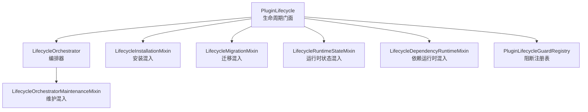
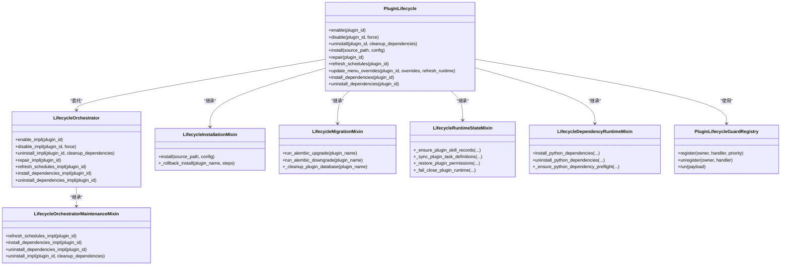
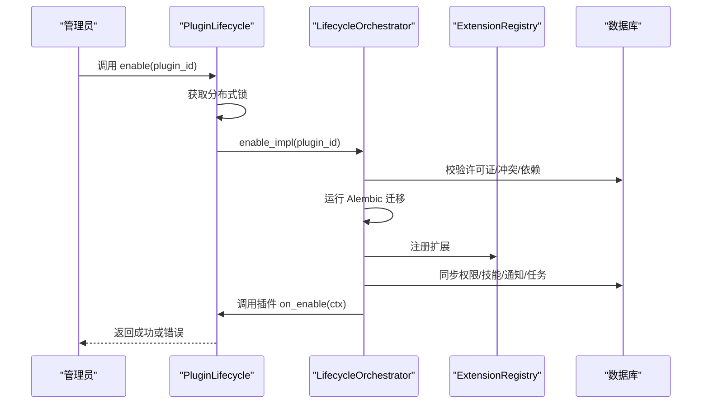
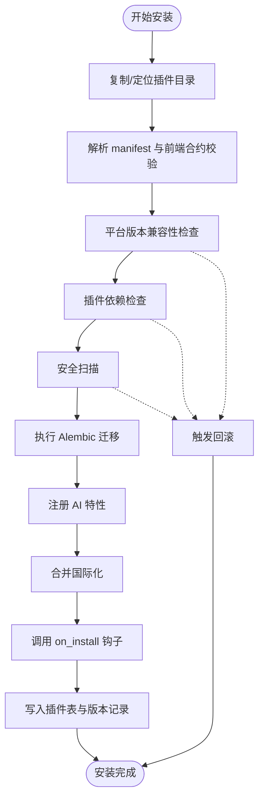
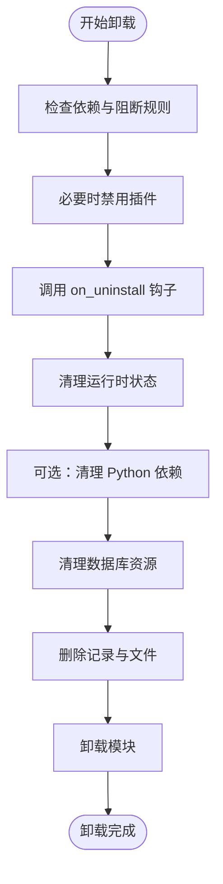
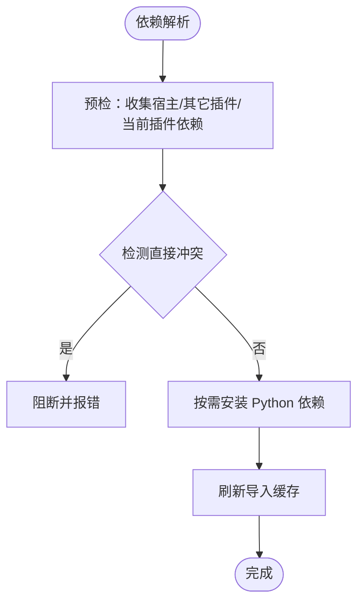
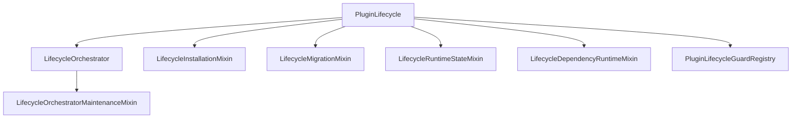

# 插件生命周期管理

<cite>
**本文档引用的文件**
- [lifecycle.py](file://backend/app/plugins/lifecycle.py)
- [lifecycle_orchestrator.py](file://backend/app/plugins/lifecycle_orchestrator.py)
- [lifecycle_installation.py](file://backend/app/plugins/lifecycle_installation.py)
- [lifecycle_migrations.py](file://backend/app/plugins/lifecycle_migrations.py)
- [lifecycle_runtime_state.py](file://backend/app/plugins/lifecycle_runtime_state.py)
- [lifecycle_dependency_runtime.py](file://backend/app/plugins/lifecycle_dependency_runtime.py)
- [lifecycle_guards.py](file://backend/app/plugins/lifecycle_guards.py)
- [lifecycle_orchestrator_maintenance.py](file://backend/app/plugins/lifecycle_orchestrator_maintenance.py)
</cite>

## 目录
1. [简介](#简介)
2. [项目结构](#项目结构)
3. [核心组件](#核心组件)
4. [架构总览](#架构总览)
5. [详细组件分析](#详细组件分析)
6. [依赖分析](#依赖分析)
7. [性能考虑](#性能考虑)
8. [故障排除指南](#故障排除指南)
9. [结论](#结论)

## 简介
本文件系统性阐述插件从安装到卸载的完整生命周期管理，涵盖 on_install、on_enable、on_disable、on_uninstall、on_upgrade 等生命周期钩子的触发时机与执行流程；文档化插件状态转换机制、依赖解析与版本兼容性检查；阐明生命周期管理器的核心职责（启动顺序控制、错误恢复机制、状态持久化）；并提供生命周期钩子的最佳实践（异步操作处理、资源清理、异常处理策略），以及插件迁移脚本的编写指南与依赖运行时的管理机制。

## 项目结构
插件生命周期管理采用“门面 + 混入”的模块化设计，核心类 PluginLifecycle 通过多重继承组合多个职责混入，形成清晰的职责边界与可扩展性：
- PluginLifecycle：对外统一的生命周期门面，聚合各功能混入
- LifecycleOrchestrator：生命周期编排器，负责跨步骤协调与前置校验
- LifecycleInstallationMixin：安装阶段编排与回滚
- LifecycleMigrationMixin：数据库迁移与清理
- LifecycleRuntimeStateMixin：运行时状态与权限管理
- LifecycleDependencyRuntimeMixin：Python 依赖解析与安装
- LifecycleOrchestratorMaintenanceMixin：维护与卸载流程
- PluginLifecycleGuardRegistry：生命周期阻断注册表

**图表来源**
- [lifecycle.py:108-130](file://backend/app/plugins/lifecycle.py#L108-L130)
- [lifecycle_orchestrator.py:25-30](file://backend/app/plugins/lifecycle_orchestrator.py#L25-L30)
- [lifecycle_installation.py:36-45](file://backend/app/plugins/lifecycle_installation.py#L36-L45)
- [lifecycle_migrations.py:66-75](file://backend/app/plugins/lifecycle_migrations.py#L66-L75)
- [lifecycle_runtime_state.py:29-35](file://backend/app/plugins/lifecycle_runtime_state.py#L29-L35)
- [lifecycle_dependency_runtime.py:33-40](file://backend/app/plugins/lifecycle_dependency_runtime.py#L33-L40)
- [lifecycle_orchestrator_maintenance.py:20-22](file://backend/app/plugins/lifecycle_orchestrator_maintenance.py#L20-L22)
- [lifecycle_guards.py:51-77](file://backend/app/plugins/lifecycle_guards.py#L51-L77)

**章节来源**
- [lifecycle.py:108-130](file://backend/app/plugins/lifecycle.py#L108-L130)

## 核心组件
- PluginLifecycle：统一门面，封装安装、启用、禁用、卸载、修复、依赖安装/卸载、调度刷新等能力，并内置分布式锁与进度上报
- LifecycleOrchestrator：编排器，负责前置校验（许可证、冲突、依赖）、权限同步、扩展注册、任务调度刷新等
- LifecycleInstallationMixin：安装流程（10步），含安全扫描、兼容性检查、迁移、AI特性注册、国际化合并、on_install钩子、DB记录与版本备份、回滚策略
- LifecycleMigrationMixin：Alembic 迁移与数据库清理（降级、表清理、版本戳清理）
- LifecycleRuntimeStateMixin：运行时状态管理（权限启停、技能记录、通知模板、任务定义同步/删除）
- LifecycleDependencyRuntimeMixin：Python 依赖预检、安装、卸载（三层安全策略）、环境解析（Windows Cargo PATH）
- LifecycleOrchestratorMaintenanceMixin：维护与卸载（调度刷新、依赖安装/卸载、卸载14步清理）
- PluginLifecycleGuardRegistry：生命周期阻断注册表，支持多处理器、优先级排序、统一执行

**章节来源**
- [lifecycle.py:108-130](file://backend/app/plugins/lifecycle.py#L108-L130)
- [lifecycle_orchestrator.py:25-30](file://backend/app/plugins/lifecycle_orchestrator.py#L25-L30)
- [lifecycle_installation.py:36-45](file://backend/app/plugins/lifecycle_installation.py#L36-L45)
- [lifecycle_migrations.py:66-75](file://backend/app/plugins/lifecycle_migrations.py#L66-L75)
- [lifecycle_runtime_state.py:29-35](file://backend/app/plugins/lifecycle_runtime_state.py#L29-L35)
- [lifecycle_dependency_runtime.py:33-40](file://backend/app/plugins/lifecycle_dependency_runtime.py#L33-L40)
- [lifecycle_orchestrator_maintenance.py:20-22](file://backend/app/plugins/lifecycle_orchestrator_maintenance.py#L20-L22)
- [lifecycle_guards.py:51-77](file://backend/app/plugins/lifecycle_guards.py#L51-L77)

## 架构总览
生命周期管理采用“门面 + 混入 + 编排器”的分层架构：
- 门面层：PluginLifecycle 提供统一 API，内部委托至各混入
- 编排层：LifecycleOrchestrator 负责跨步骤协调、前置校验与错误处理
- 混入层：按职责拆分（安装、迁移、运行时状态、依赖运行时、维护）
- 注册表层：PluginLifecycleGuardRegistry 提供阻断式校验扩展点

**图表来源**
- [lifecycle.py:108-130](file://backend/app/plugins/lifecycle.py#L108-L130)
- [lifecycle_orchestrator.py:25-30](file://backend/app/plugins/lifecycle_orchestrator.py#L25-L30)
- [lifecycle_installation.py:36-45](file://backend/app/plugins/lifecycle_installation.py#L36-L45)
- [lifecycle_migrations.py:66-75](file://backend/app/plugins/lifecycle_migrations.py#L66-L75)
- [lifecycle_runtime_state.py:29-35](file://backend/app/plugins/lifecycle_runtime_state.py#L29-L35)
- [lifecycle_dependency_runtime.py:33-40](file://backend/app/plugins/lifecycle_dependency_runtime.py#L33-L40)
- [lifecycle_orchestrator_maintenance.py:20-22](file://backend/app/plugins/lifecycle_orchestrator_maintenance.py#L20-L22)
- [lifecycle_guards.py:51-77](file://backend/app/plugins/lifecycle_guards.py#L51-L77)

## 详细组件分析

### 生命周期钩子与状态转换
- on_install：安装阶段调用，用于插件初始化（非致命错误，仅记录警告）
- on_enable：启用阶段调用，需保证幂等与可恢复；失败将触发 fail-close（注销扩展、禁用权限、设置 ERROR 状态）
- on_disable：禁用阶段未在代码中直接实现，但通过 fail-close 与权限禁用保障一致性
- on_uninstall：卸载阶段调用，用于资源清理（非致命错误，仅记录警告）
- on_upgrade：通过 Alembic 迁移实现，升级前降级再升级，确保迁移契约正确

**图表来源**
- [lifecycle.py:235-244](file://backend/app/plugins/lifecycle.py#L235-L244)
- [lifecycle_orchestrator.py:306-631](file://backend/app/plugins/lifecycle_orchestrator.py#L306-L631)

**章节来源**
- [lifecycle_orchestrator.py:306-631](file://backend/app/plugins/lifecycle_orchestrator.py#L306-L631)
- [lifecycle.py:235-244](file://backend/app/plugins/lifecycle.py#L235-L244)

### 安装流程（10步）
- 复制/定位插件目录、解析 manifest、前端合约校验
- 平台版本兼容性检查、插件依赖检查、安全扫描
- 执行 Alembic 迁移、注册 AI 特性、合并国际化
- 调用 on_install 钩子（非致命）、写入插件表与版本记录
- 发送进度事件、记录日志、返回结果或触发回滚

**图表来源**
- [lifecycle_installation.py:39-357](file://backend/app/plugins/lifecycle_installation.py#L39-L357)

**章节来源**
- [lifecycle_installation.py:39-357](file://backend/app/plugins/lifecycle_installation.py#L39-L357)

### 卸载流程（14步）
- 依赖检查、阻断注册表校验、必要时先禁用
- 调用 on_uninstall 钩子（非致命）、清理运行时状态、可选清理 Python 依赖
- 数据库清理（迁移降级、表清理、版本戳清理）、删除记录与文件
- 模块卸载、发送进度事件、记录日志

**图表来源**
- [lifecycle_orchestrator_maintenance.py:201-367](file://backend/app/plugins/lifecycle_orchestrator_maintenance.py#L201-L367)

**章节来源**
- [lifecycle_orchestrator_maintenance.py:201-367](file://backend/app/plugins/lifecycle_orchestrator_maintenance.py#L201-L367)

### 依赖解析与版本兼容性检查
- Python 依赖预检：合并宿主与其它插件的依赖，检测直接冲突，避免共享环境中版本不一致
- 依赖安装：按需安装，避免重复网络请求；安装后刷新导入缓存，确保即时可用
- 依赖卸载：三层安全策略（其它插件需要、主项目声明、pip 反向依赖），防止误删关键依赖
- 版本兼容性：平台版本规格集检查，失败即阻断安装

**图表来源**
- [lifecycle_dependency_runtime.py:98-162](file://backend/app/plugins/lifecycle_dependency_runtime.py#L98-L162)
- [lifecycle_dependency_runtime.py:288-506](file://backend/app/plugins/lifecycle_dependency_runtime.py#L288-L506)
- [lifecycle_dependency_runtime.py:685-776](file://backend/app/plugins/lifecycle_dependency_runtime.py#L685-L776)
- [lifecycle_installation.py:144-167](file://backend/app/plugins/lifecycle_installation.py#L144-L167)

**章节来源**
- [lifecycle_dependency_runtime.py:98-162](file://backend/app/plugins/lifecycle_dependency_runtime.py#L98-L162)
- [lifecycle_dependency_runtime.py:288-506](file://backend/app/plugins/lifecycle_dependency_runtime.py#L288-L506)
- [lifecycle_dependency_runtime.py:685-776](file://backend/app/plugins/lifecycle_dependency_runtime.py#L685-L776)
- [lifecycle_installation.py:144-167](file://backend/app/plugins/lifecycle_installation.py#L144-L167)

### 生命周期管理器职责
- 启动顺序控制：按步骤顺序执行，前置校验失败即阻断；启用后触发系统钩子
- 错误恢复机制：启用失败触发 fail-close（注销扩展、禁用权限、设置 ERROR 状态）；卸载失败保留 DB 事务回滚与文件清理
- 状态持久化：统一更新插件状态、错误计数、启用时间、错误消息等字段

**章节来源**
- [lifecycle_orchestrator.py:306-631](file://backend/app/plugins/lifecycle_orchestrator.py#L306-L631)
- [lifecycle_orchestrator_maintenance.py:201-367](file://backend/app/plugins/lifecycle_orchestrator_maintenance.py#L201-L367)

### 生命周期钩子最佳实践
- 异步操作处理：on_enable/on_uninstall 应避免长时间阻塞，必要时委托后台任务
- 资源清理：on_uninstall 中清理临时文件、连接池、定时器等；on_disable 通过 fail-close 保障一致性
- 异常处理策略：on_install/on_uninstall 为非致命错误，仅记录警告；on_enable 失败必须 fail-close 并回滚状态

**章节来源**
- [lifecycle_orchestrator.py:555-587](file://backend/app/plugins/lifecycle_orchestrator.py#L555-L587)
- [lifecycle_orchestrator_maintenance.py:258-282](file://backend/app/plugins/lifecycle_orchestrator_maintenance.py#L258-L282)

### 插件迁移脚本编写指南
- 使用 Alembic Python API 动态注入 version_locations，确保多插件路径生效
- 升级前降级再升级，保证迁移契约正确；失败时阻断并返回明确错误信息
- 清理策略：先尝试降级，再清理残留表与版本戳；无迁移时仅清理 manifest 声明的安全前缀

**章节来源**
- [lifecycle_migrations.py:94-150](file://backend/app/plugins/lifecycle_migrations.py#L94-L150)
- [lifecycle_migrations.py:163-247](file://backend/app/plugins/lifecycle_migrations.py#L163-L247)
- [lifecycle_migrations.py:248-400](file://backend/app/plugins/lifecycle_migrations.py#L248-L400)

### 依赖运行时管理机制
- 环境解析：Windows 下解析正确的 Python 解释器与 Cargo PATH，避免构建工具缺失导致安装失败
- 安全卸载：三层安全策略（其它插件需要、主项目声明、pip Required-by），防止误删关键依赖
- 存储驱动检查：禁用插件若提供存储驱动，需检查平台/租户配置是否在使用，必要时强制切换或阻止

**章节来源**
- [lifecycle_dependency_runtime.py:508-573](file://backend/app/plugins/lifecycle_dependency_runtime.py#L508-L573)
- [lifecycle_dependency_runtime.py:575-638](file://backend/app/plugins/lifecycle_dependency_runtime.py#L575-L638)
- [lifecycle_dependency_runtime.py:685-776](file://backend/app/plugins/lifecycle_dependency_runtime.py#L685-L776)
- [lifecycle_dependency_runtime.py:168-287](file://backend/app/plugins/lifecycle_dependency_runtime.py#L168-L287)

## 依赖分析
生命周期管理模块间耦合度低，职责清晰：
- PluginLifecycle 通过混入组合各功能，降低直接依赖
- LifecycleOrchestrator 作为编排中心，协调数据库、注册表、扩展、权限等外部组件
- 各混入模块相对独立，便于测试与替换

**图表来源**
- [lifecycle.py:108-130](file://backend/app/plugins/lifecycle.py#L108-L130)
- [lifecycle_orchestrator.py:25-30](file://backend/app/plugins/lifecycle_orchestrator.py#L25-L30)
- [lifecycle_installation.py:36-45](file://backend/app/plugins/lifecycle_installation.py#L36-L45)
- [lifecycle_migrations.py:66-75](file://backend/app/plugins/lifecycle_migrations.py#L66-L75)
- [lifecycle_runtime_state.py:29-35](file://backend/app/plugins/lifecycle_runtime_state.py#L29-L35)
- [lifecycle_dependency_runtime.py:33-40](file://backend/app/plugins/lifecycle_dependency_runtime.py#L33-L40)
- [lifecycle_orchestrator_maintenance.py:20-22](file://backend/app/plugins/lifecycle_orchestrator_maintenance.py#L20-L22)
- [lifecycle_guards.py:51-77](file://backend/app/plugins/lifecycle_guards.py#L51-L77)

**章节来源**
- [lifecycle.py:108-130](file://backend/app/plugins/lifecycle.py#L108-L130)

## 性能考虑
- 分布式锁：插件级 Redis 锁（TTL 900s）避免并发修改；注意锁粒度与超时设置
- 依赖安装优化：按需安装，避免重复网络请求；安装后刷新导入缓存减少冷启动开销
- 迁移隔离：使用子进程执行 Alembic，避免阻塞事件循环
- 进度上报：通过 PluginProgressEmitter 提供实时反馈，便于可观测性

## 故障排除指南
- 启用失败：检查许可证、冲突插件、依赖状态；查看错误计数与错误消息；触发 fail-close 并重试
- 卸载失败：确认无依赖插件、阻断规则通过；检查数据库清理与文件删除；必要时手动清理残留
- 依赖冲突：使用预检接口定位冲突包；调整依赖或插件组合
- 迁移失败：先降级再升级；核对迁移文件与版本戳；检查 version_locations 注入

**章节来源**
- [lifecycle_orchestrator.py:306-631](file://backend/app/plugins/lifecycle_orchestrator.py#L306-L631)
- [lifecycle_orchestrator_maintenance.py:201-367](file://backend/app/plugins/lifecycle_orchestrator_maintenance.py#L201-L367)
- [lifecycle_dependency_runtime.py:98-162](file://backend/app/plugins/lifecycle_dependency_runtime.py#L98-L162)
- [lifecycle_migrations.py:94-150](file://backend/app/plugins/lifecycle_migrations.py#L94-L150)

## 结论
本生命周期管理体系以 PluginLifecycle 为核心门面，结合 LifecycleOrchestrator 的编排能力与多职责混入，实现了从安装到卸载的全流程自动化与可观测性。通过分布式锁、前置校验、fail-close、回滚与清理策略，确保系统在复杂依赖与运行时环境下保持稳定与可恢复。建议在生产中配合阻断注册表扩展点与进度上报机制，持续完善生命周期治理。