# 插件资源运行时

<cite>
**本文档引用的文件**
- [asset_runtime.py](file://backend/app/plugins/asset_runtime.py)
- [asset_resolver.py](file://backend/app/plugins/asset_resolver.py)
- [runtime_gate.py](file://backend/app/plugins/runtime_gate.py)
- [runtime_registration.py](file://backend/app/plugins/runtime_registration.py)
- [frontend_contract.py](file://backend/app/plugins/frontend_contract.py)
- [exposure_policy.py](file://backend/app/plugins/exposure_policy.py)
- [license.py](file://backend/app/plugins/license.py)
- [registry.py](file://backend/app/plugins/registry.py)
</cite>

## 目录
1. [简介](#简介)
2. [项目结构](#项目结构)
3. [核心组件](#核心组件)
4. [架构总览](#架构总览)
5. [详细组件分析](#详细组件分析)
6. [依赖分析](#依赖分析)
7. [性能考虑](#性能考虑)
8. [故障排查指南](#故障排查指南)
9. [结论](#结论)
10. [附录](#附录)

## 简介
本文件面向“插件资源运行时系统”，系统性阐述插件静态资源的托管与分发机制、资源解析器工作原理、运行时注册与卸载流程、运行时门控体系、性能优化策略以及安全与跨域控制要点。目标读者既包括后端工程师，也包括对插件生态与运行时行为感兴趣的非技术用户。

## 项目结构
围绕插件资源运行时的关键模块如下：
- 资源访问与鉴权：asset_runtime.py
- 资源解析与安全路径：asset_resolver.py
- 运行时门控：runtime_gate.py
- 运行时注册与恢复：runtime_registration.py
- 前端契约与发布清单：frontend_contract.py
- 暴露策略与租户作用域：exposure_policy.py
- 许可证与运行时闸门：license.py
- 扩展注册中心与生命周期：registry.py

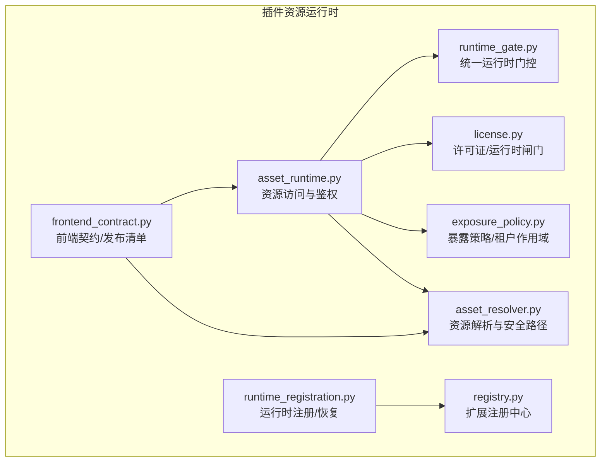

图表来源
- [asset_runtime.py:1-279](file://backend/app/plugins/asset_runtime.py#L1-L279)
- [asset_resolver.py:1-84](file://backend/app/plugins/asset_resolver.py#L1-L84)
- [runtime_gate.py:1-201](file://backend/app/plugins/runtime_gate.py#L1-L201)
- [runtime_registration.py:1-191](file://backend/app/plugins/runtime_registration.py#L1-L191)
- [frontend_contract.py:1-343](file://backend/app/plugins/frontend_contract.py#L1-L343)
- [exposure_policy.py:1-234](file://backend/app/plugins/exposure_policy.py#L1-L234)
- [license.py:1-710](file://backend/app/plugins/license.py#L1-L710)
- [registry.py:1-746](file://backend/app/plugins/registry.py#L1-L746)

章节来源
- [asset_runtime.py:1-279](file://backend/app/plugins/asset_runtime.py#L1-L279)
- [asset_resolver.py:1-84](file://backend/app/plugins/asset_resolver.py#L1-L84)
- [runtime_gate.py:1-201](file://backend/app/plugins/runtime_gate.py#L1-L201)
- [runtime_registration.py:1-191](file://backend/app/plugins/runtime_registration.py#L1-L191)
- [frontend_contract.py:1-343](file://backend/app/plugins/frontend_contract.py#L1-L343)
- [exposure_policy.py:1-234](file://backend/app/plugins/exposure_policy.py#L1-L234)
- [license.py:1-710](file://backend/app/plugins/license.py#L1-L710)
- [registry.py:1-746](file://backend/app/plugins/registry.py#L1-L746)

## 核心组件
- 资源访问与鉴权：负责从请求中提取令牌、解码并进行作用域与租户范围校验，再结合统一运行时门控评估是否允许访问插件静态资源。
- 资源解析与安全路径：严格限定插件静态资源的可读路径，防止路径穿越，确保仅允许从约定目录读取。
- 统一运行时门控：综合插件状态、许可证有效性、暴露策略与租户可见性，输出统一的允许/拒绝决策。
- 运行时注册与恢复：在冷启动或非 FastAPI 启动路径下，确保已启用插件的技能解析器在进程内可用。
- 前端契约与发布清单：校验前端开发/发布契约，读取发布清单，保证资源存在性与一致性。
- 暴露策略与租户作用域：根据插件兼容性、表面层与租户暴露策略，推导运行时可见范围。
- 许可证与运行时闸门：离线验证许可证，计算有效状态，作为付费插件运行时准入条件。
- 扩展注册中心：承载插件扩展点注册、查询与注销，支持运行时中间件同步与技能解析器缓存。

章节来源
- [asset_runtime.py:102-171](file://backend/app/plugins/asset_runtime.py#L102-L171)
- [asset_resolver.py:47-84](file://backend/app/plugins/asset_resolver.py#L47-L84)
- [runtime_gate.py:47-201](file://backend/app/plugins/runtime_gate.py#L47-L201)
- [runtime_registration.py:102-188](file://backend/app/plugins/runtime_registration.py#L102-L188)
- [frontend_contract.py:66-186](file://backend/app/plugins/frontend_contract.py#L66-L186)
- [exposure_policy.py:69-118](file://backend/app/plugins/exposure_policy.py#L69-L118)
- [license.py:400-419](file://backend/app/plugins/license.py#L400-L419)
- [registry.py:172-239](file://backend/app/plugins/registry.py#L172-L239)

## 架构总览
插件资源运行时由“鉴权—解析—门控—许可—暴露策略”五条主线协同完成：
- 鉴权：从 Authorization 头或 Cookie 提取令牌，校验类型与作用域，必要时附加租户上下文。
- 解析：将相对路径规范化为安全的绝对路径，限定读取范围（根 icon.png 与 frontend/dist）。
- 门控：查询插件状态、许可证、暴露策略与租户可见性，形成统一结果。
- 许可：对付费插件执行离线许可证验证与有效期判断。
- 暴露策略：依据兼容性与租户暴露策略确定运行时可见范围。

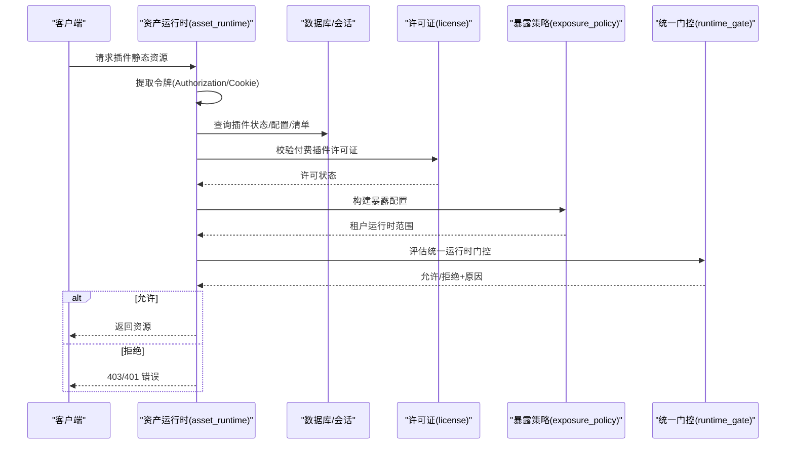

图表来源
- [asset_runtime.py:102-171](file://backend/app/plugins/asset_runtime.py#L102-L171)
- [runtime_gate.py:47-201](file://backend/app/plugins/runtime_gate.py#L47-L201)
- [license.py:400-419](file://backend/app/plugins/license.py#L400-L419)
- [exposure_policy.py:69-118](file://backend/app/plugins/exposure_policy.py#L69-L118)

## 详细组件分析

### 资产运行时与访问鉴权（asset_runtime）
职责与流程
- 令牌提取：优先从 Authorization: Bearer 读取，否则从 Cookie 读取。
- 令牌解码：校验令牌类型与结构，解析作用域与租户 ID。
- 作用域与租户：ADMIN 放行；TENANT_ADMIN 需携带租户 ID，并可按租户范围强制校验。
- 统一门控：调用统一运行时门控，得到最终允许/拒绝与原因。
- Cookie 清理：在公开资源响应中清理历史鉴权 Cookie，覆盖多路径与多域名变体。

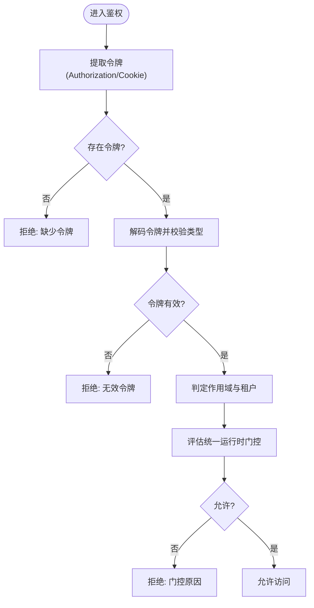

图表来源
- [asset_runtime.py:92-171](file://backend/app/plugins/asset_runtime.py#L92-L171)

章节来源
- [asset_runtime.py:92-171](file://backend/app/plugins/asset_runtime.py#L92-L171)

### 资源解析器（asset_resolver）
职责与规则
- 插件名合法性：仅允许 kebab-case。
- 图标文件：仅允许根目录 icon.png。
- 其他文件：仅允许从 plugins/{name}/frontend/dist 下读取。
- 安全约束：禁止路径穿越（..）、禁止空路径/目录路径、禁止绝对路径。

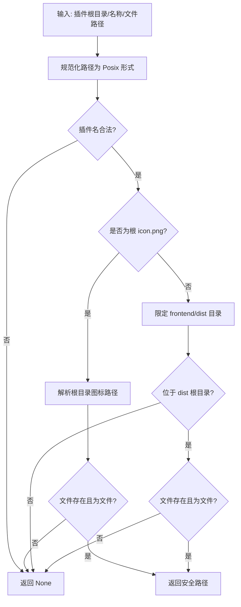

图表来源
- [asset_resolver.py:47-84](file://backend/app/plugins/asset_resolver.py#L47-L84)

章节来源
- [asset_resolver.py:14-84](file://backend/app/plugins/asset_resolver.py#L14-L84)

### 统一运行时门控（runtime_gate）
评估维度
- 插件状态：必须为启用状态（可选）。
- 租户可见性：若要求强制作用域，则需满足暴露策略的租户运行时范围。
- 许可证：付费插件必须有效，否则不允许运行。
- 输出：统一结果对象，包含允许/拒绝、原因、许可证状态、兼容性配置等。

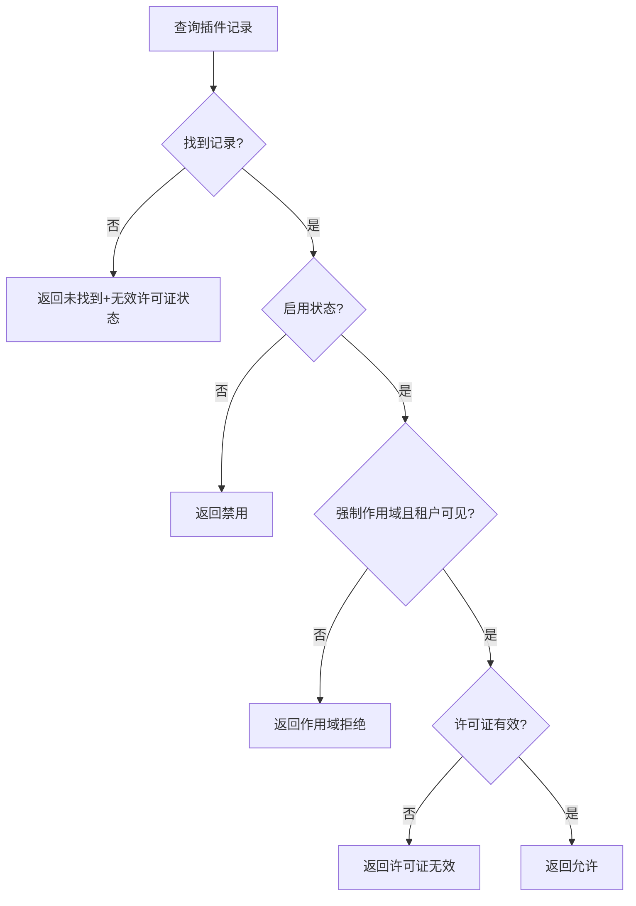

图表来源
- [runtime_gate.py:47-201](file://backend/app/plugins/runtime_gate.py#L47-L201)

章节来源
- [runtime_gate.py:31-201](file://backend/app/plugins/runtime_gate.py#L31-L201)

### 运行时注册与恢复（runtime_registration）
场景与策略
- 冷启动路径：某些入口（如 CLI/非 FastAPI 启动）可能无法访问完整的 ExtensionRegistry。
- 预检查：识别已启用但缺少技能解析器的插件。
- 加锁与二次检查：全局异步锁避免并发重复恢复。
- 恢复执行：调用恢复流程，仅注册缺失的技能解析器，不变更数据库状态。
- 降级处理：异常时记录警告并返回诊断信息。

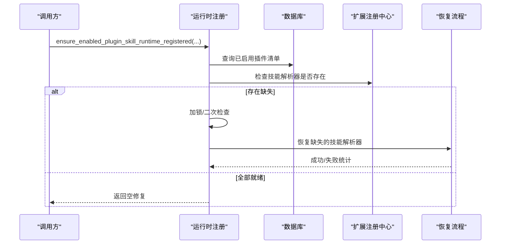

图表来源
- [runtime_registration.py:102-188](file://backend/app/plugins/runtime_registration.py#L102-L188)
- [registry.py:172-239](file://backend/app/plugins/registry.py#L172-L239)

章节来源
- [runtime_registration.py:102-188](file://backend/app/plugins/runtime_registration.py#L102-L188)
- [registry.py:367-478](file://backend/app/plugins/registry.py#L367-L478)

### 前端契约与发布清单（frontend_contract）
职责与流程
- 契约校验：检查前端 i18n、组件导出、命名空间前缀等。
- 发布清单：读取并校验 release manifest，断言入口、CSS、资源存在性。
- 模式选择：开发模式或发布模式，返回相应元数据与警告。

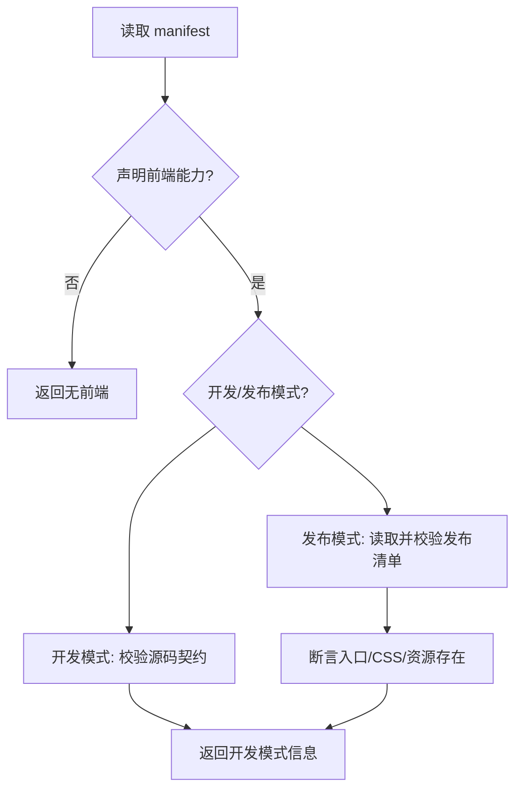

图表来源
- [frontend_contract.py:112-186](file://backend/app/plugins/frontend_contract.py#L112-L186)

章节来源
- [frontend_contract.py:20-186](file://backend/app/plugins/frontend_contract.py#L20-L186)

### 暴露策略与租户作用域（exposure_policy）
关键点
- 兼容性：根据声明的 edition 与 surface 推导主机兼容性。
- 租户暴露：支持默认、全部、选定、无暴露四种策略。
- 运行时范围：结合 scope 与 surface，计算租户运行时可见范围与拒绝原因。
- 数据结构：暴露配置可序列化为字典，便于门控与日志输出。

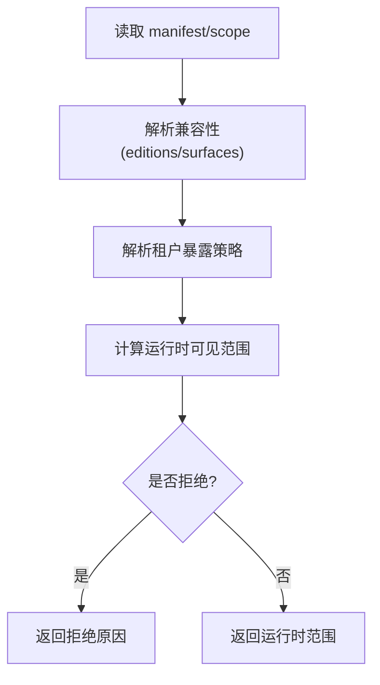

图表来源
- [exposure_policy.py:69-118](file://backend/app/plugins/exposure_policy.py#L69-L118)

章节来源
- [exposure_policy.py:37-118](file://backend/app/plugins/exposure_policy.py#L37-L118)

### 许可证与运行时闸门（license）
要点
- 离线验证：Ed25519 公钥嵌入，私钥仅在生成端持有。
- 状态排序：优先级（有效>过期>撤销），付费>试用，新>旧。
- 运行时闸门：免费插件直接放行；付费插件必须有效。
- 试用与撤销：支持一次性试用发放与批量撤销。

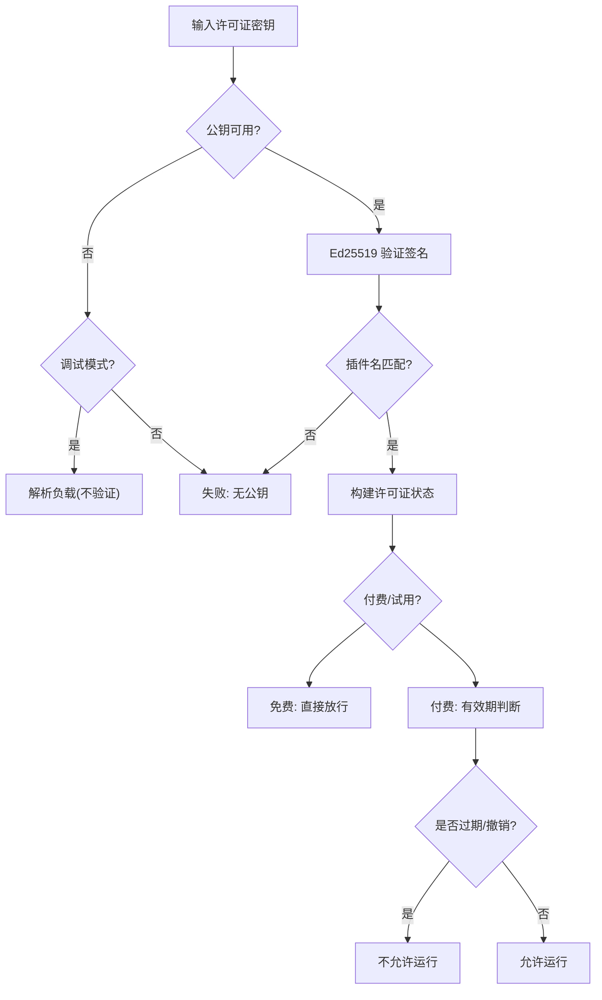

图表来源
- [license.py:111-178](file://backend/app/plugins/license.py#L111-L178)
- [license.py:400-419](file://backend/app/plugins/license.py#L400-L419)

章节来源
- [license.py:111-178](file://backend/app/plugins/license.py#L111-L178)
- [license.py:400-419](file://backend/app/plugins/license.py#L400-L419)

### 扩展注册中心（registry）
要点
- 单例注册中心：桥接插件扩展到系统现有注册表，追踪注册记录以便反注册。
- 技能解析器缓存：按 (plugin_name, skill_name) 缓存解析器与执行器，提升查询效率。
- 运行时中间件同步：在运行时重建中间件栈，支持插件中间件动态生效。
- 生命周期清理：注销插件时清理其运行时状态、事件订阅与注册记录。

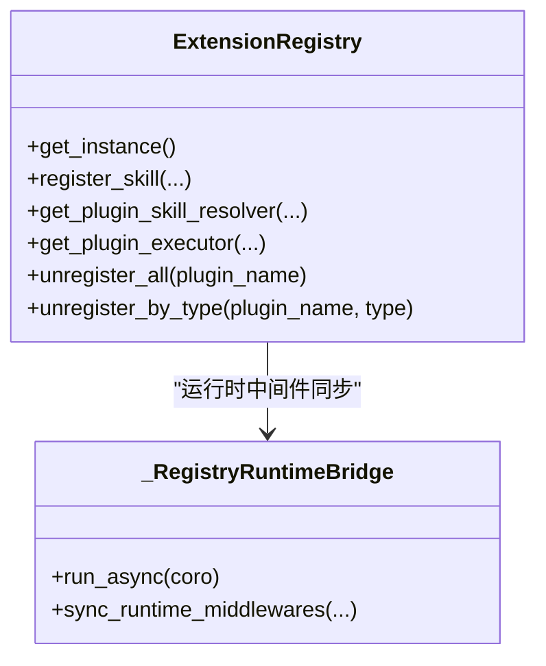

图表来源
- [registry.py:172-239](file://backend/app/plugins/registry.py#L172-L239)
- [registry.py:367-478](file://backend/app/plugins/registry.py#L367-L478)

章节来源
- [registry.py:172-239](file://backend/app/plugins/registry.py#L172-L239)
- [registry.py:258-306](file://backend/app/plugins/registry.py#L258-L306)
- [registry.py:367-478](file://backend/app/plugins/registry.py#L367-L478)

## 依赖分析
- 资产运行时依赖统一门控、许可证、暴露策略与安全解码。
- 资源解析器独立于门控，仅负责路径安全与合规性。
- 运行时注册依赖扩展注册中心与恢复流程，避免重复注册。
- 前端契约依赖发布清单与运行时配置，保障资源一致性。
- 许可证与暴露策略共同构成统一门控的输入。

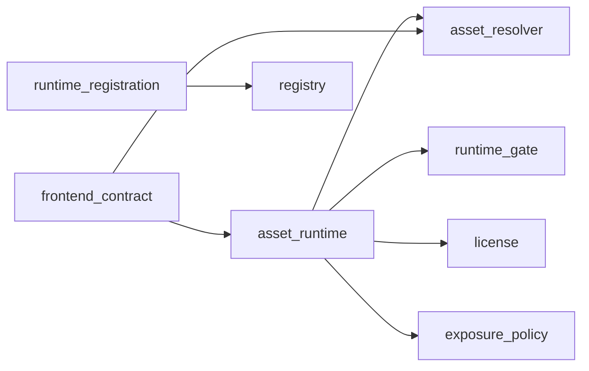

图表来源
- [asset_runtime.py:1-279](file://backend/app/plugins/asset_runtime.py#L1-L279)
- [runtime_gate.py:1-201](file://backend/app/plugins/runtime_gate.py#L1-L201)
- [license.py:1-710](file://backend/app/plugins/license.py#L1-L710)
- [exposure_policy.py:1-234](file://backend/app/plugins/exposure_policy.py#L1-L234)
- [asset_resolver.py:1-84](file://backend/app/plugins/asset_resolver.py#L1-L84)
- [runtime_registration.py:1-191](file://backend/app/plugins/runtime_registration.py#L1-L191)
- [registry.py:1-746](file://backend/app/plugins/registry.py#L1-L746)
- [frontend_contract.py:1-343](file://backend/app/plugins/frontend_contract.py#L1-L343)

章节来源
- [asset_runtime.py:1-279](file://backend/app/plugins/asset_runtime.py#L1-L279)
- [runtime_gate.py:1-201](file://backend/app/plugins/runtime_gate.py#L1-L201)
- [license.py:1-710](file://backend/app/plugins/license.py#L1-L710)
- [exposure_policy.py:1-234](file://backend/app/plugins/exposure_policy.py#L1-L234)
- [asset_resolver.py:1-84](file://backend/app/plugins/asset_resolver.py#L1-L84)
- [runtime_registration.py:1-191](file://backend/app/plugins/runtime_registration.py#L1-L191)
- [registry.py:1-746](file://backend/app/plugins/registry.py#L1-L746)
- [frontend_contract.py:1-343](file://backend/app/plugins/frontend_contract.py#L1-L343)

## 性能考虑
- 懒加载与预加载
  - 资源访问：仅在请求到达时进行令牌解码与门控评估，避免不必要的数据库查询。
  - 技能解析器：通过运行时注册在冷路径下按需恢复，减少启动时开销。
- 缓存策略
  - 许可证状态：按优先级与时间戳排序，减少重复计算。
  - 前端发布清单：在开发模式与发布模式下分别缓存，避免重复校验。
- 路径解析
  - 使用规范化与安全检查，避免多次 IO 与路径穿越风险。
- 中间件同步
  - 运行时中间件重建仅在变更时触发，降低中间件栈重建成本。

[本节为通用性能建议，不直接分析具体文件]

## 故障排查指南
常见问题与定位
- 令牌相关
  - 缺少令牌或无效令牌：检查 Authorization 头或 Cookie 名称与值。
  - 作用域不匹配：确认令牌作用域与租户 ID 是否正确。
- 门控拒绝
  - 插件未启用：检查插件状态。
  - 租户不可见：核对暴露策略与租户分配。
  - 许可证无效：检查付费插件许可证状态与有效期。
- 资源访问失败
  - 路径穿越或不在允许目录：检查文件路径是否位于 frontend/dist 或根 icon.png。
- 运行时注册异常
  - 冷路径缺失技能解析器：确认恢复流程是否成功执行。
  - 并发冲突：检查加锁与二次检查逻辑是否生效。

章节来源
- [asset_runtime.py:102-171](file://backend/app/plugins/asset_runtime.py#L102-L171)
- [runtime_gate.py:110-185](file://backend/app/plugins/runtime_gate.py#L110-L185)
- [license.py:421-444](file://backend/app/plugins/license.py#L421-L444)
- [asset_resolver.py:47-84](file://backend/app/plugins/asset_resolver.py#L47-L84)
- [runtime_registration.py:117-187](file://backend/app/plugins/runtime_registration.py#L117-L187)

## 结论
插件资源运行时通过“令牌解码—路径解析—统一门控—许可证—暴露策略”的闭环，实现了对插件静态资源的安全、可控与高效访问。配合运行时注册与扩展注册中心，系统在冷路径与热路径均能保持一致的行为与性能表现。前端契约与发布清单进一步保障了资源的一致性与可维护性。

## 附录
- 安全与跨域控制
  - 资源访问：通过统一门控与许可证闸门控制访问权限。
  - 跨域策略：由平台 CORS 与中间件层统一管理，插件资产路由遵循平台全局策略。
- 版本管理与 CDN 集成
  - 前端发布清单声明入口与资源，结合平台静态资源服务实现版本化与缓存控制。
- 运行时回收
  - 注销插件时清理其运行时状态、事件订阅与注册记录，避免内存泄漏。

[本节为概念性总结，不直接分析具体文件]