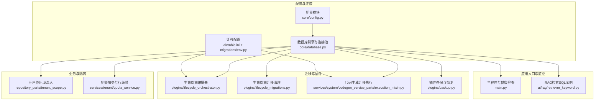
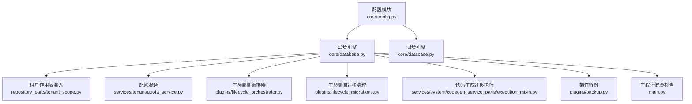
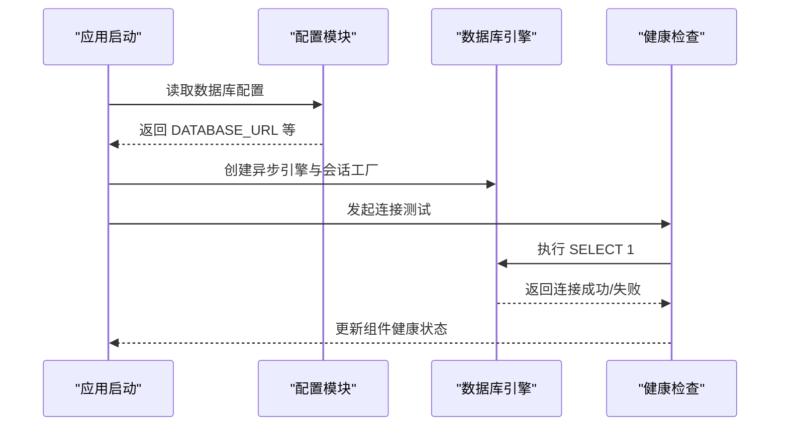
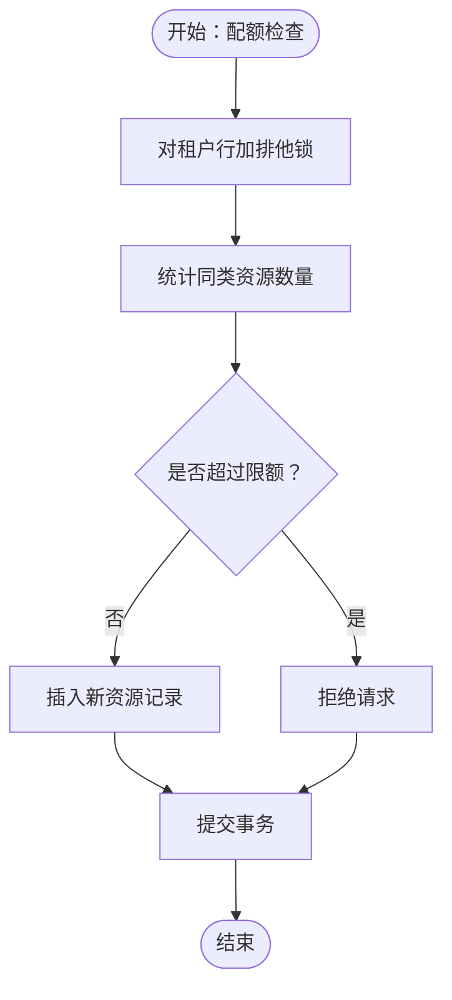
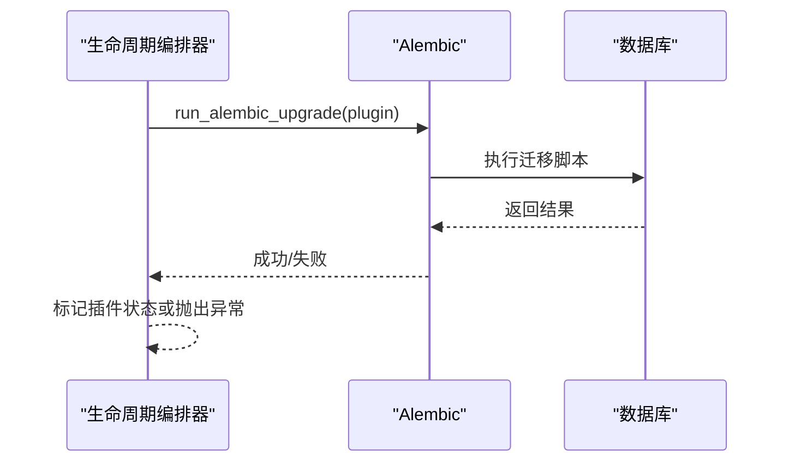
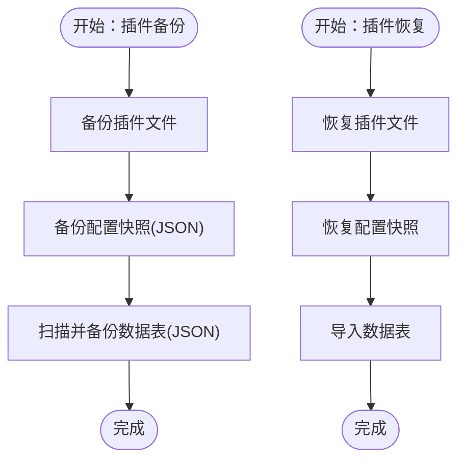
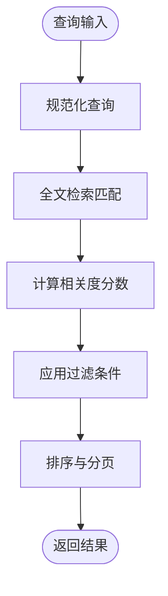
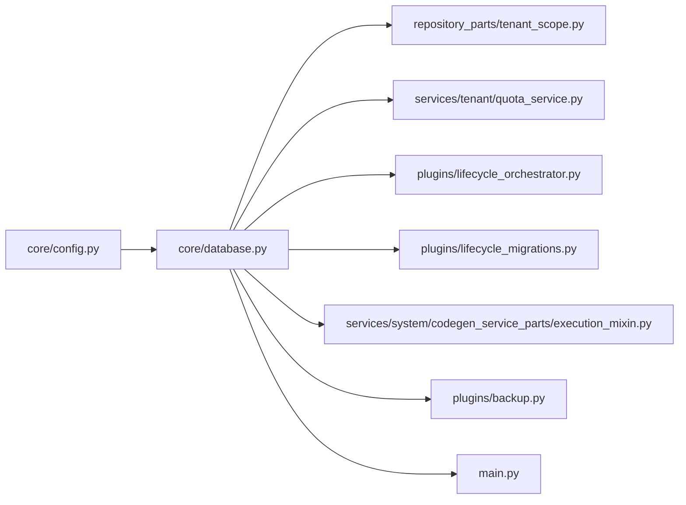

# 数据库设计

<cite>
**本文引用的文件**
- [backend/app/core/config.py](file://backend/app/core/config.py)
- [backend/app/core/database.py](file://backend/app/core/database.py)
- [backend/app/core/repository_parts/tenant_scope.py](file://backend/app/core/repository_parts/tenant_scope.py)
- [backend/app/services/tenant/quota_service.py](file://backend/app/services/tenant/quota_service.py)
- [backend/app/plugins/lifecycle_orchestrator.py](file://backend/app/plugins/lifecycle_orchestrator.py)
- [backend/app/plugins/lifecycle_migrations.py](file://backend/app/plugins/lifecycle_migrations.py)
- [backend/app/services/system/codegen_service_parts/execution_mixin.py](file://backend/app/services/system/codegen_service_parts/execution_mixin.py)
- [backend/app/plugins/backup.py](file://backend/app/plugins/backup.py)
- [backend/app/main.py](file://backend/app/main.py)
- [backend/app/ai/rag/retriever_keyword.py](file://backend/app/ai/rag/retriever_keyword.py)
- [backend/plugins/storage-migration/backend/migrations/versions/001_init.py](file://backend/plugins/storage-migration/backend/migrations/versions/001_init.py)
- [backend/alembic.ini](file://backend/alembic.ini)
- [backend/migrations/env.py](file://backend/migrations/env.py)
- [backend/migrations/script.py.mako](file://backend/migrations/script.py.mako)
- [backend/docker-compose.dev.yml](file://backend/docker-compose.dev.yml)
- [backend/docker-compose.prod.yml](file://backend/docker-compose.prod.yml)
</cite>

## 目录
1. [简介](#简介)
2. [项目结构](#项目结构)
3. [核心组件](#核心组件)
4. [架构总览](#架构总览)
5. [详细组件分析](#详细组件分析)
6. [依赖关系分析](#依赖关系分析)
7. [性能考量](#性能考量)
8. [故障排查指南](#故障排查指南)
9. [结论](#结论)
10. [附录](#附录)

## 简介
本文件为 NovusAI SaaS 的数据库设计与运维文档，聚焦于 PostgreSQL 配置、连接池与事务管理、索引与查询优化、多租户隔离与并发控制、监控与慢查询分析、部署与高可用、备份恢复与版本迁移等主题。文档基于仓库中的实际实现进行归纳总结，并提供可操作的建议与最佳实践。

## 项目结构
后端采用异步 SQLAlchemy 引擎与 Alembic 迁移框架，数据库配置集中于配置模块，连接池与引擎初始化位于核心数据库模块，租户隔离通过仓储层混入实现，迁移流程由生命周期编排器驱动，插件系统提供备份与恢复能力。

**图表来源**
- [backend/app/core/config.py:80-105](file://backend/app/core/config.py#L80-L105)
- [backend/app/core/database.py:64-75](file://backend/app/core/database.py#L64-L75)
- [backend/app/core/repository_parts/tenant_scope.py:17-38](file://backend/app/core/repository_parts/tenant_scope.py#L17-L38)
- [backend/app/services/tenant/quota_service.py:143-153](file://backend/app/services/tenant/quota_service.py#L143-L153)
- [backend/app/plugins/lifecycle_orchestrator.py:387-424](file://backend/app/plugins/lifecycle_orchestrator.py#L387-L424)
- [backend/app/plugins/lifecycle_migrations.py:286-302](file://backend/app/plugins/lifecycle_migrations.py#L286-L302)
- [backend/app/services/system/codegen_service_parts/execution_mixin.py:562-651](file://backend/app/services/system/codegen_service_parts/execution_mixin.py#L562-L651)
- [backend/app/plugins/backup.py:102-177](file://backend/app/plugins/backup.py#L102-L177)
- [backend/app/main.py:513-524](file://backend/app/main.py#L513-L524)
- [backend/app/ai/rag/retriever_keyword.py:246-279](file://backend/app/ai/rag/retriever_keyword.py#L246-L279)

**章节来源**
- [backend/app/core/config.py:80-105](file://backend/app/core/config.py#L80-L105)
- [backend/app/core/database.py:64-75](file://backend/app/core/database.py#L64-L75)

## 核心组件
- 数据库配置与连接池
  - 配置项：主机、端口、用户、密码、数据库名、连接池大小、最大溢出、超时。
  - 引擎：使用异步驱动创建引擎，同步引擎用于工具类场景。
  - 连接检查：启动时与健康探针中进行连接测试，失败时输出友好提示。
- 租户隔离与并发控制
  - 仓储混入：统一注入租户字段过滤，支持 owner_tenant_id 或 tenant_id。
  - 行级锁：配额检查前对租户行加排他锁，避免竞态。
- 迁移与版本管理
  - 生命周期编排：按插件目录运行 Alembic 升级。
  - 自动迁移：代码生成服务执行预升级、自动生成、注入元数据、后升级。
  - 迁移清理：检测残留表并使用 savepoint 防止外层事务污染。
- 备份与恢复
  - 插件备份：备份文件、配置快照与数据表 JSON 导出，使用 savepoint 隔离读取。
  - 恢复流程：文件与配置恢复，数据表导入。
- 监控与健康检查
  - 主程序健康探针：定期刷新数据库组件健康状态，Prometheus 抓取前主动探测。

**章节来源**
- [backend/app/core/config.py:80-105](file://backend/app/core/config.py#L80-L105)
- [backend/app/core/database.py:175-233](file://backend/app/core/database.py#L175-L233)
- [backend/app/core/repository_parts/tenant_scope.py:30-38](file://backend/app/core/repository_parts/tenant_scope.py#L30-L38)
- [backend/app/services/tenant/quota_service.py:143-153](file://backend/app/services/tenant/quota_service.py#L143-L153)
- [backend/app/plugins/lifecycle_orchestrator.py:387-424](file://backend/app/plugins/lifecycle_orchestrator.py#L387-L424)
- [backend/app/services/system/codegen_service_parts/execution_mixin.py:562-651](file://backend/app/services/system/codegen_service_parts/execution_mixin.py#L562-L651)
- [backend/app/plugins/lifecycle_migrations.py:286-302](file://backend/app/plugins/lifecycle_migrations.py#L286-L302)
- [backend/app/plugins/backup.py:102-177](file://backend/app/plugins/backup.py#L102-L177)
- [backend/app/main.py:513-524](file://backend/app/main.py#L513-L524)

## 架构总览
下图展示数据库层在系统中的位置与交互关系，包括配置、引擎、迁移、租户隔离、插件备份与主程序健康检查。

**图表来源**
- [backend/app/core/config.py:80-105](file://backend/app/core/config.py#L80-L105)
- [backend/app/core/database.py:64-75](file://backend/app/core/database.py#L64-L75)
- [backend/app/core/repository_parts/tenant_scope.py:17-38](file://backend/app/core/repository_parts/tenant_scope.py#L17-L38)
- [backend/app/services/tenant/quota_service.py:143-153](file://backend/app/services/tenant/quota_service.py#L143-L153)
- [backend/app/plugins/lifecycle_orchestrator.py:387-424](file://backend/app/plugins/lifecycle_orchestrator.py#L387-L424)
- [backend/app/plugins/lifecycle_migrations.py:286-302](file://backend/app/plugins/lifecycle_migrations.py#L286-L302)
- [backend/app/services/system/codegen_service_parts/execution_mixin.py:562-651](file://backend/app/services/system/codegen_service_parts/execution_mixin.py#L562-L651)
- [backend/app/plugins/backup.py:102-177](file://backend/app/plugins/backup.py#L102-L177)
- [backend/app/main.py:513-524](file://backend/app/main.py#L513-L524)

## 详细组件分析

### 组件A：数据库配置与连接池
- 配置项
  - 数据库连接字符串（异步与同步），连接池大小、最大溢出、超时。
- 引擎与会话
  - 异步引擎创建与 dispose；同步引擎用于工具场景。
  - 会话工厂在应用启动时创建，用于请求上下文与任务执行。
- 连接健康检查
  - 启动时与健康探针中执行简单查询验证连接；若 PostgreSQL 未启动，输出系统特定的启动命令提示。

**图表来源**
- [backend/app/core/config.py:80-105](file://backend/app/core/config.py#L80-L105)
- [backend/app/core/database.py:64-75](file://backend/app/core/database.py#L64-L75)
- [backend/app/core/database.py:218-233](file://backend/app/core/database.py#L218-L233)
- [backend/app/main.py:513-524](file://backend/app/main.py#L513-L524)

**章节来源**
- [backend/app/core/config.py:80-105](file://backend/app/core/config.py#L80-L105)
- [backend/app/core/database.py:64-75](file://backend/app/core/database.py#L64-L75)
- [backend/app/core/database.py:218-233](file://backend/app/core/database.py#L218-L233)
- [backend/app/main.py:513-524](file://backend/app/main.py#L513-L524)

### 组件B：租户作用域与并发控制
- 租户作用域混入
  - 自动识别 owner_tenant_id 或 tenant_id 字段，统一注入查询过滤条件。
  - 支持按 ID 列表过滤与单条查询过滤。
- 行级排他锁
  - 配额检查前对租户行加锁，保证 CHECK → INSERT 之间的原子性，避免 TOCTOU 竞态。

**图表来源**
- [backend/app/core/repository_parts/tenant_scope.py:30-38](file://backend/app/core/repository_parts/tenant_scope.py#L30-L38)
- [backend/app/core/repository_parts/tenant_scope.py:108-125](file://backend/app/core/repository_parts/tenant_scope.py#L108-L125)
- [backend/app/services/tenant/quota_service.py:143-153](file://backend/app/services/tenant/quota_service.py#L143-L153)

**章节来源**
- [backend/app/core/repository_parts/tenant_scope.py:17-38](file://backend/app/core/repository_parts/tenant_scope.py#L17-L38)
- [backend/app/core/repository_parts/tenant_scope.py:108-125](file://backend/app/core/repository_parts/tenant_scope.py#L108-L125)
- [backend/app/services/tenant/quota_service.py:143-153](file://backend/app/services/tenant/quota_service.py#L143-L153)

### 组件C：迁移与版本管理
- 生命周期编排
  - 按插件目录运行 Alembic 升级，异常时记录公共错误消息并标记插件状态。
- 自动迁移执行
  - 预升级 → 自动生成 → 注入元数据 → 后升级；若无变更则跳过。
- 迁移清理
  - 使用嵌套事务（savepoint）扫描残留表，避免局部异常污染外层事务。

**图表来源**
- [backend/app/plugins/lifecycle_orchestrator.py:387-424](file://backend/app/plugins/lifecycle_orchestrator.py#L387-L424)
- [backend/app/services/system/codegen_service_parts/execution_mixin.py:562-651](file://backend/app/services/system/codegen_service_parts/execution_mixin.py#L562-L651)
- [backend/app/plugins/lifecycle_migrations.py:286-302](file://backend/app/plugins/lifecycle_migrations.py#L286-L302)

**章节来源**
- [backend/app/plugins/lifecycle_orchestrator.py:387-424](file://backend/app/plugins/lifecycle_orchestrator.py#L387-L424)
- [backend/app/services/system/codegen_service_parts/execution_mixin.py:562-651](file://backend/app/services/system/codegen_service_parts/execution_mixin.py#L562-L651)
- [backend/app/plugins/lifecycle_migrations.py:286-302](file://backend/app/plugins/lifecycle_migrations.py#L286-L302)

### 组件D：备份与恢复
- 插件备份
  - 备份文件、配置快照（JSON）、数据表（JSON）；使用嵌套事务隔离读取。
- 恢复流程
  - 文件与配置恢复；数据表导入。

**图表来源**
- [backend/app/plugins/backup.py:87-177](file://backend/app/plugins/backup.py#L87-L177)
- [backend/app/plugins/backup.py:183-204](file://backend/app/plugins/backup.py#L183-L204)

**章节来源**
- [backend/app/plugins/backup.py:87-177](file://backend/app/plugins/backup.py#L87-L177)
- [backend/app/plugins/backup.py:183-204](file://backend/app/plugins/backup.py#L183-L204)

### 组件E：查询优化与索引设计
- 全文检索与排序
  - 使用 TSVector 与 rank 函数进行内容检索与排序，结合 ILIKE 与 heading 匹配提升命中率。
- 索引设计原则
  - 常见过滤与排序字段建立复合索引；时间字段建立独立索引以便清理与统计。
  - 参考插件迁移脚本中的索引创建与删除示例。

**图表来源**
- [backend/app/ai/rag/retriever_keyword.py:246-279](file://backend/app/ai/rag/retriever_keyword.py#L246-L279)
- [backend/plugins/storage-migration/backend/migrations/versions/001_init.py:131-162](file://backend/plugins/storage-migration/backend/migrations/versions/001_init.py#L131-L162)

**章节来源**
- [backend/app/ai/rag/retriever_keyword.py:246-279](file://backend/app/ai/rag/retriever_keyword.py#L246-L279)
- [backend/plugins/storage-migration/backend/migrations/versions/001_init.py:131-162](file://backend/plugins/storage-migration/backend/migrations/versions/001_init.py#L131-L162)

## 依赖关系分析
- 配置模块为数据库引擎与迁移提供统一的连接信息。
- 数据库引擎被所有业务模块共享，迁移与备份模块通过会话执行数据库操作。
- 租户作用域混入与配额服务依赖数据库会话与模型定义。

**图表来源**
- [backend/app/core/config.py:80-105](file://backend/app/core/config.py#L80-L105)
- [backend/app/core/database.py:64-75](file://backend/app/core/database.py#L64-L75)
- [backend/app/core/repository_parts/tenant_scope.py:17-38](file://backend/app/core/repository_parts/tenant_scope.py#L17-L38)
- [backend/app/services/tenant/quota_service.py:143-153](file://backend/app/services/tenant/quota_service.py#L143-L153)
- [backend/app/plugins/lifecycle_orchestrator.py:387-424](file://backend/app/plugins/lifecycle_orchestrator.py#L387-L424)
- [backend/app/plugins/lifecycle_migrations.py:286-302](file://backend/app/plugins/lifecycle_migrations.py#L286-L302)
- [backend/app/services/system/codegen_service_parts/execution_mixin.py:562-651](file://backend/app/services/system/codegen_service_parts/execution_mixin.py#L562-L651)
- [backend/app/plugins/backup.py:102-177](file://backend/app/plugins/backup.py#L102-L177)
- [backend/app/main.py:513-524](file://backend/app/main.py#L513-L524)

**章节来源**
- [backend/app/core/config.py:80-105](file://backend/app/core/config.py#L80-L105)
- [backend/app/core/database.py:64-75](file://backend/app/core/database.py#L64-L75)

## 性能考量
- 连接池参数
  - 通过 pool_size、max_overflow、pool_timeout 控制并发与等待行为，避免连接饥饿与超时。
- 查询优化
  - 使用 TSVector 与 rank 提升检索效率；合理建立复合索引与时间索引。
  - 将大查询拆分为多个小查询，减少锁持有时间。
- 并发控制
  - 租户行级锁避免竞态；批量操作使用事务包裹，减少锁竞争。
- 监控与告警
  - 健康探针定期刷新数据库组件健康状态，Prometheus 抓取前主动探测。

**章节来源**
- [backend/app/core/config.py:88-91](file://backend/app/core/config.py#L88-L91)
- [backend/app/ai/rag/retriever_keyword.py:246-279](file://backend/app/ai/rag/retriever_keyword.py#L246-L279)
- [backend/app/services/tenant/quota_service.py:143-153](file://backend/app/services/tenant/quota_service.py#L143-L153)
- [backend/app/main.py:541-593](file://backend/app/main.py#L541-L593)

## 故障排查指南
- 连接失败
  - 检查 DATABASE_HOST、DATABASE_PORT、DATABASE_NAME、DATABASE_USER、DATABASE_PASSWORD 是否正确。
  - 若提示“连接被拒绝”，根据操作系统输出启动 PostgreSQL 服务。
- 迁移失败
  - 查看生命周期编排器的日志，确认 Alembic 升级是否成功；必要时手动执行迁移。
  - 检查 alembic_version 是否存在重叠祖先/后代 stamp，清理后重试。
- 备份/恢复问题
  - 确认备份目录权限与磁盘空间；检查 savepoint 隔离是否导致外层事务未回滚。
- 健康检查失败
  - 查看主程序健康探针日志，确认数据库连接测试是否通过。

**章节来源**
- [backend/app/core/database.py:175-233](file://backend/app/core/database.py#L175-L233)
- [backend/app/plugins/lifecycle_orchestrator.py:400-424](file://backend/app/plugins/lifecycle_orchestrator.py#L400-L424)
- [backend/app/plugins/backup.py:102-177](file://backend/app/plugins/backup.py#L102-L177)
- [backend/app/main.py:513-524](file://backend/app/main.py#L513-L524)

## 结论
本设计以异步 SQLAlchemy 与 Alembic 为核心，结合租户作用域混入与行级锁实现强隔离与并发安全；通过连接池与健康检查保障稳定性；借助插件备份与生命周期迁移确保演进可控。配合合理的索引与查询优化策略，可在高并发场景下维持良好性能与可靠性。

## 附录
- 部署与高可用
  - 开发环境与生产环境的 compose 文件可用于快速搭建与扩展。
- 备份恢复策略
  - 插件备份包含文件、配置快照与数据表 JSON，支持从备份恢复。
- 版本管理与回滚
  - 使用 Alembic 进行迁移；如需回滚，应遵循迁移脚本的 downgrade 设计。

**章节来源**
- [backend/docker-compose.dev.yml](file://backend/docker-compose.dev.yml)
- [backend/docker-compose.prod.yml](file://backend/docker-compose.prod.yml)
- [backend/app/plugins/backup.py:87-177](file://backend/app/plugins/backup.py#L87-L177)
- [backend/alembic.ini](file://backend/alembic.ini)
- [backend/migrations/env.py](file://backend/migrations/env.py)
- [backend/migrations/script.py.mako](file://backend/migrations/script.py.mako)