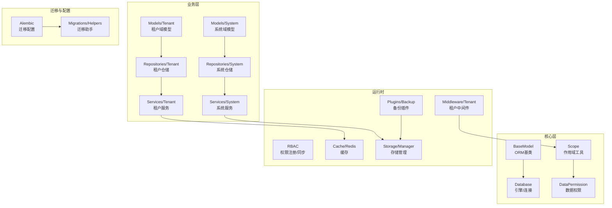
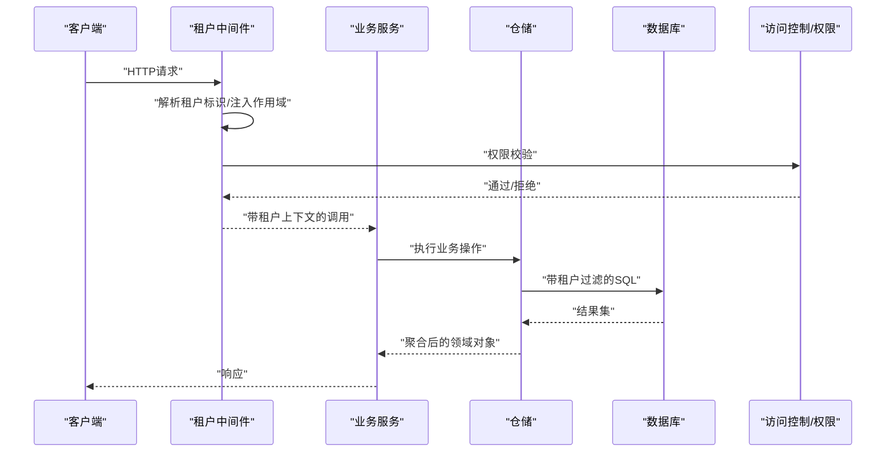
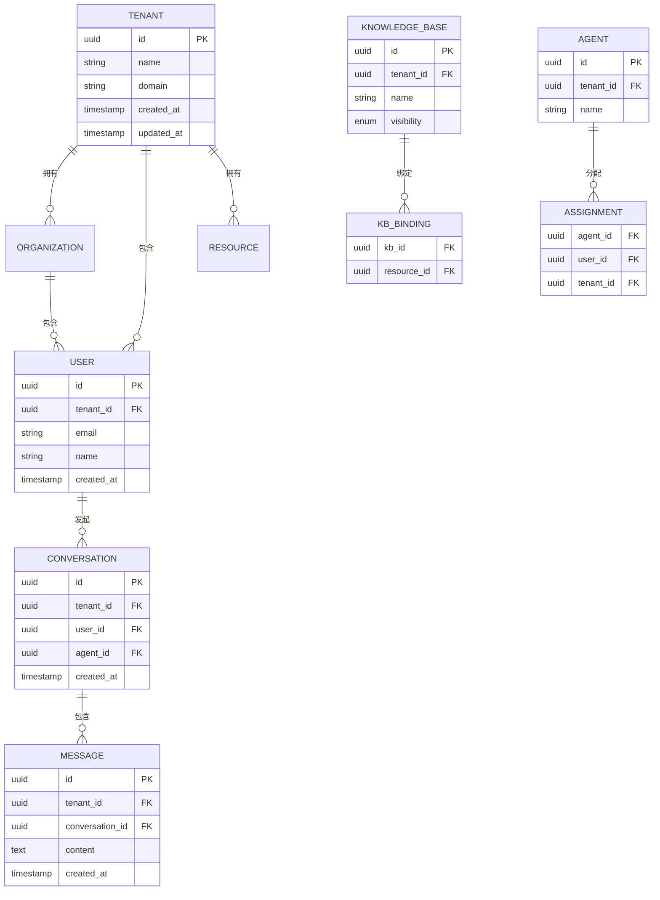
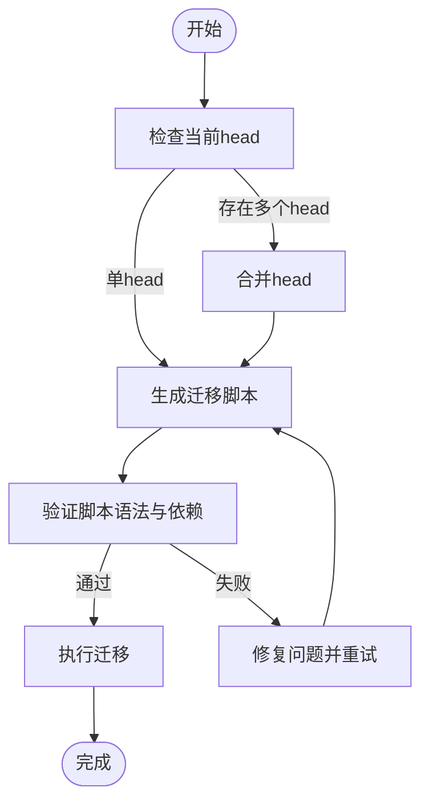
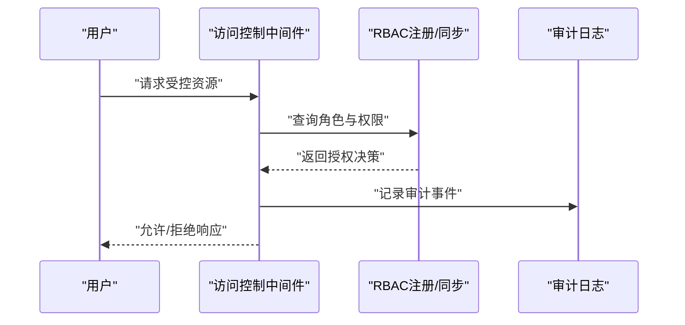
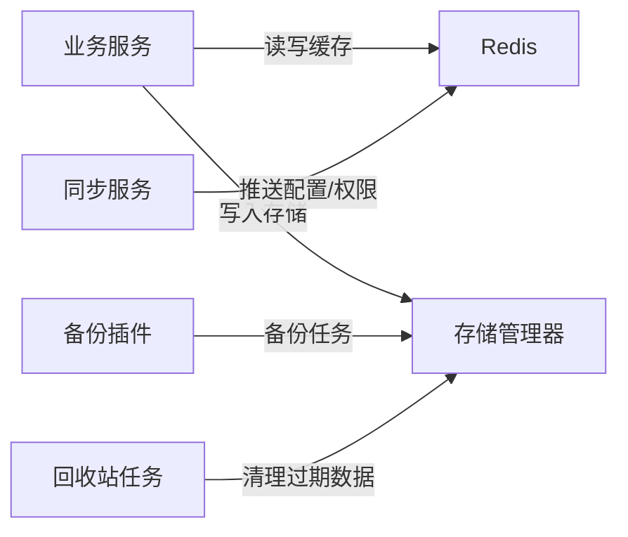
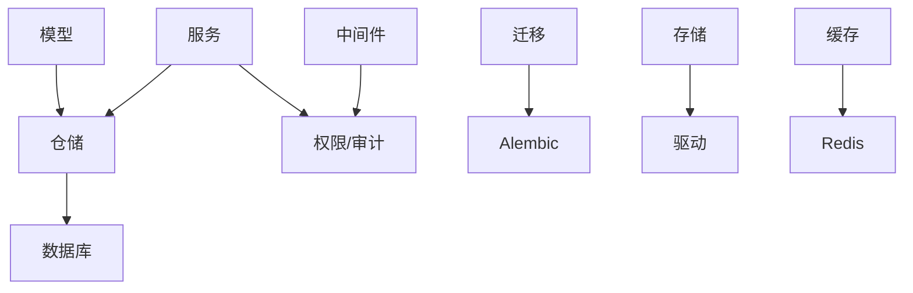

# 数据架构设计

<cite>
**本文引用的文件**
- [backend/app/core/base_model.py](file://backend/app/core/base_model.py)
- [backend/app/core/database.py](file://backend/app/core/database.py)
- [backend/app/core/base_repository.py](file://backend/app/core/base_repository.py)
- [backend/app/core/scope.py](file://backend/app/core/scope.py)
- [backend/app/core/data_permission.py](file://backend/app/core/data_permission.py)
- [backend/app/middleware/tenant.py](file://backend/app/middleware/tenant.py)
- [backend/app/models/tenant/__init__.py](file://backend/app/models/tenant/__init__.py)
- [backend/app/models/system/__init__.py](file://backend/app/models/system/__init__.py)
- [backend/app/models/org/__init__.py](file://backend/app/models/org/__init__.py)
- [backend/app/models/common/__init__.py](file://backend/app/models/common/__init__.py)
- [backend/app/repositories/tenant/__init__.py](file://backend/app/repositories/tenant/__init__.py)
- [backend/app/repositories/system/__init__.py](file://backend/app/repositories/system/__init__.py)
- [backend/app/services/tenant/__init__.py](file://backend/app/services/tenant/__init__.py)
- [backend/app/services/system/__init__.py](file://backend/app/services/system/__init__.py)
- [backend/migrations/env.py](file://backend/migrations/env.py)
- [backend/migrations/helpers.py](file://backend/migrations/helpers.py)
- [backend/app/plugins/backup.py](file://backend/app/plugins/backup.py)
- [backend/app/tasks/recycle_bin.py](file://backend/app/tasks/recycle_bin.py)
- [backend/app/storage/manager.py](file://backend/app/storage/manager.py)
- [backend/app/storage/base.py](file://backend/app/storage/base.py)
- [backend/app/cache.py](file://backend/app/cache.py)
- [backend/app/core/redis.py](file://backend/app/core/redis.py)
- [backend/app/rbac/registry.py](file://backend/app/rbac/registry.py)
- [backend/app/rbac/sync.py](file://backend/app/rbac/sync.py)
- [backend/app/middleware/access_control.py](file://backend/app/middleware/access_control.py)
- [backend/app/middleware/permission.py](file://backend/app/middleware/permission.py)
- [backend/app/core/security.py](file://backend/app/core/security.py)
- [backend/app/core/logging.py](file://backend/app/core/logging.py)
- [backend/app/core/deletion.py](file://backend/app/core/deletion.py)
- [backend/app/core/recycle_bin.py](file://backend/app/core/recycle_bin.py)
- [backend/alembic.ini](file://backend/alembic.ini)
</cite>

## 目录
1. [简介](#简介)
2. [项目结构](#项目结构)
3. [核心组件](#核心组件)
4. [架构总览](#架构总览)
5. [详细组件分析](#详细组件分析)
6. [依赖分析](#依赖分析)
7. [性能考虑](#性能考虑)
8. [故障排除指南](#故障排除指南)
9. [结论](#结论)
10. [附录](#附录)

## 简介
本文件面向NovusAI SaaS平台，系统化阐述多租户数据架构设计与实现。内容涵盖：多租户数据模型（表结构、关系映射、数据隔离）、ORM映射与查询优化、数据库迁移与版本管理、数据安全与访问控制、缓存与同步机制、备份与恢复策略，以及数据治理最佳实践。文档以代码为依据，结合架构图与流程图，帮助技术与非技术读者理解并实施该数据架构。

## 项目结构
后端采用分层架构：核心层提供基础模型、数据库连接、作用域与权限；业务层按功能域划分models、repositories、services；中间件负责租户识别与访问控制；迁移脚本通过Alembic管理版本演进；插件化扩展支持备份等能力；存储抽象统一文件与对象存储；Redis用于缓存与会话。

图表来源
- [backend/app/core/base_model.py](file://backend/app/core/base_model.py)
- [backend/app/core/database.py](file://backend/app/core/database.py)
- [backend/app/core/scope.py](file://backend/app/core/scope.py)
- [backend/app/core/data_permission.py](file://backend/app/core/data_permission.py)
- [backend/app/middleware/tenant.py](file://backend/app/middleware/tenant.py)
- [backend/app/models/tenant/__init__.py](file://backend/app/models/tenant/__init__.py)
- [backend/app/models/system/__init__.py](file://backend/app/models/system/__init__.py)
- [backend/app/repositories/tenant/__init__.py](file://backend/app/repositories/tenant/__init__.py)
- [backend/app/repositories/system/__init__.py](file://backend/app/repositories/system/__init__.py)
- [backend/app/services/tenant/__init__.py](file://backend/app/services/tenant/__init__.py)
- [backend/app/services/system/__init__.py](file://backend/app/services/system/__init__.py)
- [backend/app/plugins/backup.py](file://backend/app/plugins/backup.py)
- [backend/app/storage/manager.py](file://backend/app/storage/manager.py)
- [backend/app/cache.py](file://backend/app/cache.py)
- [backend/app/core/redis.py](file://backend/app/core/redis.py)
- [backend/app/rbac/registry.py](file://backend/app/rbac/registry.py)
- [backend/app/rbac/sync.py](file://backend/app/rbac/sync.py)
- [backend/alembic.ini](file://backend/alembic.ini)
- [backend/migrations/helpers.py](file://backend/migrations/helpers.py)

章节来源
- [backend/app/core/base_model.py](file://backend/app/core/base_model.py)
- [backend/app/core/database.py](file://backend/app/core/database.py)
- [backend/app/core/scope.py](file://backend/app/core/scope.py)
- [backend/app/core/data_permission.py](file://backend/app/core/data_permission.py)
- [backend/app/middleware/tenant.py](file://backend/app/middleware/tenant.py)
- [backend/app/models/tenant/__init__.py](file://backend/app/models/tenant/__init__.py)
- [backend/app/models/system/__init__.py](file://backend/app/models/system/__init__.py)
- [backend/app/repositories/tenant/__init__.py](file://backend/app/repositories/tenant/__init__.py)
- [backend/app/repositories/system/__init__.py](file://backend/app/repositories/system/__init__.py)
- [backend/app/services/tenant/__init__.py](file://backend/app/services/tenant/__init__.py)
- [backend/app/services/system/__init__.py](file://backend/app/services/system/__init__.py)
- [backend/app/plugins/backup.py](file://backend/app/plugins/backup.py)
- [backend/app/storage/manager.py](file://backend/app/storage/manager.py)
- [backend/app/cache.py](file://backend/app/cache.py)
- [backend/app/core/redis.py](file://backend/app/core/redis.py)
- [backend/app/rbac/registry.py](file://backend/app/rbac/registry.py)
- [backend/app/rbac/sync.py](file://backend/app/rbac/sync.py)
- [backend/alembic.ini](file://backend/alembic.ini)
- [backend/migrations/helpers.py](file://backend/migrations/helpers.py)

## 核心组件
- ORM与模型基类：提供统一的ORM映射约定、字段规范与生命周期钩子，确保多租户字段一致性。
- 数据库连接与引擎：集中管理连接池、方言与事务语义，支撑高并发与一致性。
- 作用域与数据权限：定义资源作用域、数据可见性与跨域隔离策略，保障租户间数据边界。
- 中间件：在请求入口解析租户上下文，注入作用域参数，拦截越权访问。
- 仓储与服务：封装CRUD与业务逻辑，统一应用数据隔离规则。
- 迁移与版本管理：基于Alembic的结构化演进，确保多环境一致与回滚能力。
- 缓存与存储：Redis缓存热点数据，抽象存储驱动支持本地/对象存储。
- 备份与回收站：插件化备份与定时清理，保障数据可恢复与合规删除。

章节来源
- [backend/app/core/base_model.py](file://backend/app/core/base_model.py)
- [backend/app/core/database.py](file://backend/app/core/database.py)
- [backend/app/core/scope.py](file://backend/app/core/scope.py)
- [backend/app/core/data_permission.py](file://backend/app/core/data_permission.py)
- [backend/app/middleware/tenant.py](file://backend/app/middleware/tenant.py)
- [backend/app/core/base_repository.py](file://backend/app/core/base_repository.py)

## 架构总览
下图展示从请求到持久化的数据流，强调多租户上下文注入、作用域过滤与权限校验。

图表来源
- [backend/app/middleware/tenant.py](file://backend/app/middleware/tenant.py)
- [backend/app/middleware/access_control.py](file://backend/app/middleware/access_control.py)
- [backend/app/middleware/permission.py](file://backend/app/middleware/permission.py)
- [backend/app/core/scope.py](file://backend/app/core/scope.py)
- [backend/app/core/data_permission.py](file://backend/app/core/data_permission.py)
- [backend/app/core/base_repository.py](file://backend/app/core/base_repository.py)

## 详细组件分析

### 多租户数据模型与隔离策略
- 模型层面：所有业务表均包含租户维度字段（如tenant_id），并在ORM映射中强制参与唯一约束与索引，避免跨租户冲突。
- 关系映射：外键链路遵循“租户内自洽”，跨域关联通过作用域限定；全局共享表（如系统配置）不携带租户字段或采用全局作用域。
- 隔离策略：
  - 查询隔离：仓储层默认在WHERE条件中拼接tenant_id，或通过作用域过滤器自动注入。
  - 写入隔离：服务层在创建实体时写入当前租户上下文，防止越权写入。
  - 删除隔离：软删除字段与回收站机制配合，支持审计与恢复。

图表来源
- [backend/app/models/tenant/__init__.py](file://backend/app/models/tenant/__init__.py)
- [backend/app/models/system/__init__.py](file://backend/app/models/system/__init__.py)
- [backend/app/models/org/__init__.py](file://backend/app/models/org/__init__.py)
- [backend/app/models/common/__init__.py](file://backend/app/models/common/__init__.py)

章节来源
- [backend/app/models/tenant/__init__.py](file://backend/app/models/tenant/__init__.py)
- [backend/app/models/system/__init__.py](file://backend/app/models/system/__init__.py)
- [backend/app/models/org/__init__.py](file://backend/app/models/org/__init__.py)
- [backend/app/models/common/__init__.py](file://backend/app/models/common/__init__.py)

### ORM映射关系与查询优化
- 映射约定：统一使用UUID主键、时间戳字段、软删除字段；所有多租户表均建立复合唯一索引（tenant_id+业务唯一列）。
- 关联映射：一对多/多对多通过外键与中间表实现，中间表同样携带tenant_id，确保跨租户隔离。
- 查询优化：
  - 唯一约束与索引：tenant_id+业务唯一列、tenant_id+创建时间等复合索引，加速过滤与排序。
  - 分页与投影：默认只选择必要字段，避免SELECT *；分页使用游标或基于索引的LIMIT/OFFSET。
  - 批量操作：批量插入/更新使用ORM批处理接口，减少往返。
  - 读写分离：查询路径走只读副本，写入走主库；缓存热点数据降低读压力。

章节来源
- [backend/app/core/base_model.py](file://backend/app/core/base_model.py)
- [backend/app/core/base_repository.py](file://backend/app/core/base_repository.py)

### 数据库迁移机制与版本管理
- 迁移组织：按日期+序号命名版本文件，记录结构变更、索引增删、约束调整与数据迁移。
- 版本演进：通过Alembic管理head与分支合并，支持多head合并与回滚；迁移助手提供通用工具函数。
- 向后兼容：新增字段默认可空或提供默认值；删除字段前先做数据迁移与注释保留；约束变更使用条件ALTER。

图表来源
- [backend/alembic.ini](file://backend/alembic.ini)
- [backend/migrations/env.py](file://backend/migrations/env.py)
- [backend/migrations/helpers.py](file://backend/migrations/helpers.py)

章节来源
- [backend/alembic.ini](file://backend/alembic.ini)
- [backend/migrations/env.py](file://backend/migrations/env.py)
- [backend/migrations/helpers.py](file://backend/migrations/helpers.py)

### 数据安全策略、访问控制与隐私保护
- 身份与租户：中间件解析租户上下文，结合RBAC注册表与同步服务进行权限判定。
- 访问控制：基于角色的细粒度授权，资源级作用域与数据权限双重约束；敏感字段脱敏输出。
- 审计与日志：操作日志记录关键动作、用户、目标与影响范围；异常与越权行为记录trace_id便于追踪。
- 隐私保护：最小化收集原则、数据去标识化、删除与导出请求的合规流程。

图表来源
- [backend/app/middleware/access_control.py](file://backend/app/middleware/access_control.py)
- [backend/app/middleware/permission.py](file://backend/app/middleware/permission.py)
- [backend/app/rbac/registry.py](file://backend/app/rbac/registry.py)
- [backend/app/rbac/sync.py](file://backend/app/rbac/sync.py)
- [backend/app/core/logging.py](file://backend/app/core/logging.py)

章节来源
- [backend/app/middleware/access_control.py](file://backend/app/middleware/access_control.py)
- [backend/app/middleware/permission.py](file://backend/app/middleware/permission.py)
- [backend/app/rbac/registry.py](file://backend/app/rbac/registry.py)
- [backend/app/rbac/sync.py](file://backend/app/rbac/sync.py)
- [backend/app/core/logging.py](file://backend/app/core/logging.py)

### 缓存架构、数据同步与备份恢复
- 缓存：Redis作为统一缓存层，支持会话、配置、热点查询结果与分布式锁；提供TTL与淘汰策略。
- 同步：系统配置与权限规则通过同步服务定期或事件触发更新，保持多实例一致性。
- 备份：插件化备份模块对接存储驱动，支持全量/增量备份与恢复；回收站任务定期清理过期数据。

图表来源
- [backend/app/cache.py](file://backend/app/cache.py)
- [backend/app/core/redis.py](file://backend/app/core/redis.py)
- [backend/app/rbac/sync.py](file://backend/app/rbac/sync.py)
- [backend/app/plugins/backup.py](file://backend/app/plugins/backup.py)
- [backend/app/tasks/recycle_bin.py](file://backend/app/tasks/recycle_bin.py)
- [backend/app/storage/manager.py](file://backend/app/storage/manager.py)

章节来源
- [backend/app/cache.py](file://backend/app/cache.py)
- [backend/app/core/redis.py](file://backend/app/core/redis.py)
- [backend/app/rbac/sync.py](file://backend/app/rbac/sync.py)
- [backend/app/plugins/backup.py](file://backend/app/plugins/backup.py)
- [backend/app/tasks/recycle_bin.py](file://backend/app/tasks/recycle_bin.py)
- [backend/app/storage/manager.py](file://backend/app/storage/manager.py)

### 数据模型设计规范
- 字段规范：统一使用UUID主键、必填字段设置默认值、时间字段使用UTC、软删除字段标准化。
- 约束与索引：多租户表必须包含tenant_id；业务唯一性通过复合唯一约束保证；常用查询列建立合适索引。
- 关系设计：外键关系清晰，避免循环依赖；跨域关联通过中间表与作用域控制。
- 元数据：所有表包含创建/更新时间字段，便于审计与统计。

章节来源
- [backend/app/core/base_model.py](file://backend/app/core/base_model.py)
- [backend/app/models/tenant/__init__.py](file://backend/app/models/tenant/__init__.py)
- [backend/app/models/system/__init__.py](file://backend/app/models/system/__init__.py)

### 性能优化指南
- 查询优化：优先使用复合索引覆盖查询；避免N+1查询，采用JOIN或批量加载；合理分页与排序。
- 写入优化：批量提交、事务拆分、异步写入非关键路径；写放大场景使用幂等设计。
- 缓存策略：热点数据分级缓存、失效策略与回源降级；缓存穿透与击穿防护。
- 存储优化：大对象分离存储、压缩与归档；冷热分层与生命周期管理。

章节来源
- [backend/app/core/base_repository.py](file://backend/app/core/base_repository.py)
- [backend/app/cache.py](file://backend/app/cache.py)
- [backend/app/core/redis.py](file://backend/app/core/redis.py)
- [backend/app/storage/manager.py](file://backend/app/storage/manager.py)

### 数据治理最佳实践
- 变更治理：所有结构变更需通过迁移脚本；引入评审与灰度发布流程。
- 质量保障：单元测试覆盖关键查询与边界条件；集成测试验证多租户隔离。
- 合规与审计：敏感数据加密、访问日志留痕、定期审计与合规报告。
- 回滚与演练：定期进行回滚演练与灾难恢复测试，确保RTO/RPO达标。

章节来源
- [backend/migrations/helpers.py](file://backend/migrations/helpers.py)
- [backend/app/core/logging.py](file://backend/app/core/logging.py)
- [backend/app/core/deletion.py](file://backend/app/core/deletion.py)
- [backend/app/core/recycle_bin.py](file://backend/app/core/recycle_bin.py)

## 依赖分析
- 组件耦合：仓储依赖模型与数据库连接；服务依赖仓储与权限；中间件依赖租户上下文与权限；迁移依赖Alembic与助手。
- 外部依赖：PostgreSQL/MySQL引擎、Redis、对象存储SDK；插件生态扩展备份与监控能力。
- 循环依赖：通过分层与接口抽象避免循环导入；模型与仓储解耦，服务聚合业务。

图表来源
- [backend/app/core/base_model.py](file://backend/app/core/base_model.py)
- [backend/app/core/base_repository.py](file://backend/app/core/base_repository.py)
- [backend/app/core/database.py](file://backend/app/core/database.py)
- [backend/app/middleware/tenant.py](file://backend/app/middleware/tenant.py)
- [backend/alembic.ini](file://backend/alembic.ini)
- [backend/migrations/env.py](file://backend/migrations/env.py)

章节来源
- [backend/app/core/base_model.py](file://backend/app/core/base_model.py)
- [backend/app/core/base_repository.py](file://backend/app/core/base_repository.py)
- [backend/app/core/database.py](file://backend/app/core/database.py)
- [backend/app/middleware/tenant.py](file://backend/app/middleware/tenant.py)
- [backend/alembic.ini](file://backend/alembic.ini)
- [backend/migrations/env.py](file://backend/migrations/env.py)

## 性能考虑
- 读写分离与只读副本：查询流量分流至只读实例，写入集中在主库。
- 缓存分层：L1本地缓存（进程内）、L2分布式缓存（Redis）；热点数据预热与失效策略。
- 并发控制：连接池大小与超时配置；事务隔离级别与死锁规避。
- 监控与告警：慢查询日志、QPS/延迟、缓存命中率与存储容量监控。

## 故障排除指南
- 迁移失败：检查版本冲突与依赖；使用迁移助手修复常见问题；必要时手动回滚并重试。
- 权限异常：核对RBAC注册与同步状态；检查中间件是否正确注入租户上下文。
- 缓存不一致：清理缓存并触发重建；检查失效策略与并发更新。
- 存储异常：切换驱动或检查配额；验证备份与恢复流程有效性。

章节来源
- [backend/migrations/helpers.py](file://backend/migrations/helpers.py)
- [backend/app/middleware/access_control.py](file://backend/app/middleware/access_control.py)
- [backend/app/middleware/tenant.py](file://backend/app/middleware/tenant.py)
- [backend/app/cache.py](file://backend/app/cache.py)
- [backend/app/plugins/backup.py](file://backend/app/plugins/backup.py)

## 结论
本数据架构以多租户为核心设计原则，通过模型、仓储、服务与中间件的协同，实现强隔离与高可用。配合Alembic迁移、Redis缓存、插件化备份与严格的权限体系，满足SaaS平台在规模增长过程中的性能、安全与合规需求。建议持续完善监控与演练，确保架构在生产环境稳定演进。

## 附录
- 术语说明：租户、作用域、数据权限、软删除、回收站、迁移head、只读副本。
- 最佳实践清单：迁移脚本评审、索引设计规范、缓存失效策略、备份恢复演练、权限最小化。