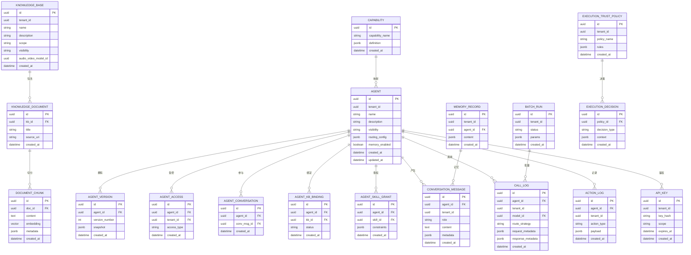
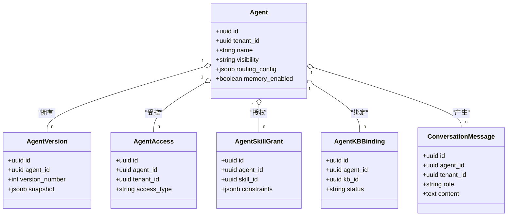
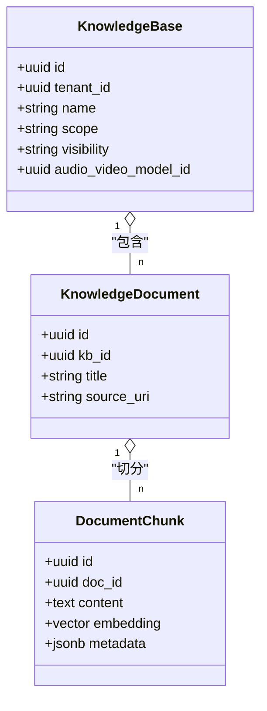
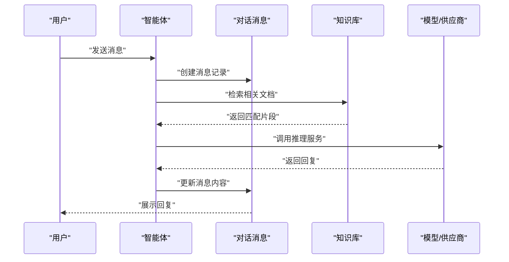
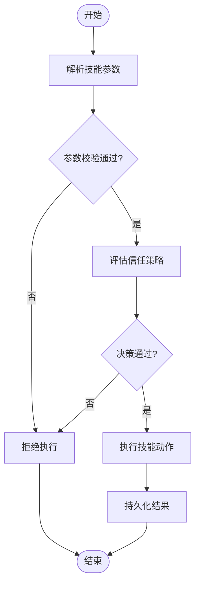
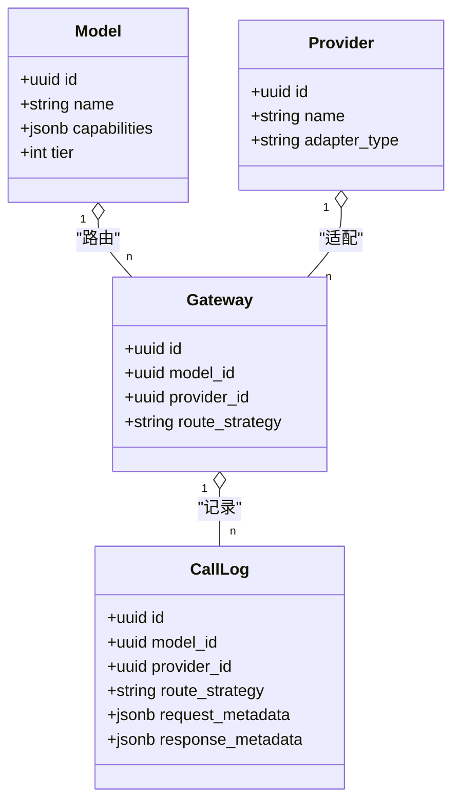
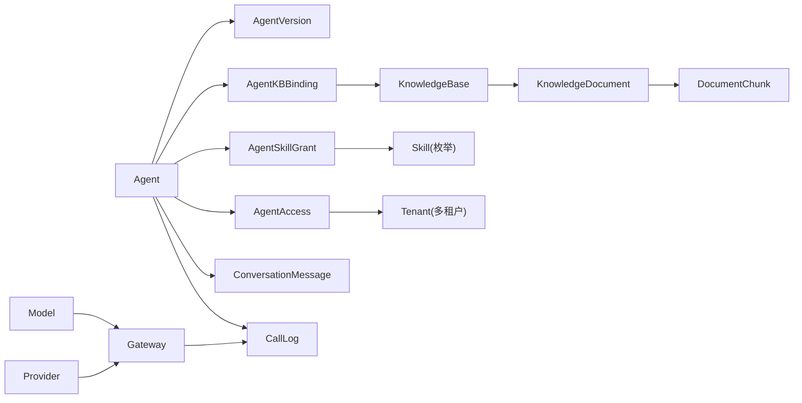

# AI能力模型

<cite>
**本文引用的文件**
- [agent.py](file://backend/app/models/ai/agent.py)
- [agent_version.py](file://backend/app/models/ai/agent_version.py)
- [agent_access.py](file://backend/app/models/ai/agent_access.py)
- [conversation_message.py](file://backend/app/models/ai/conversation_message.py)
- [knowledge_base.py](file://backend/app/models/ai/knowledge_base.py)
- [knowledge_document.py](file://backend/app/models/ai/knowledge_document.py)
- [document_chunk.py](file://backend/app/models/ai/document_chunk.py)
- [skill.py](file://backend/app/enums/skill.py)
- [ai.py](file://backend/app/enums/ai.py)
- [knowledge_base_enum.py](file://backend/app/enums/knowledge_base.py)
- [agent.py](file://backend/app/schemas/ai/agent.py)
- [agent_version.py](file://backend/app/schemas/ai/agent_version.py)
- [agent_access.py](file://backend/app/schemas/ai/agent_access.py)
- [conversation_message.py](file://backend/app/schemas/ai/conversation_message.py)
- [knowledge_base.py](file://backend/app/schemas/ai/knowledge_base.py)
- [model.py](file://backend/app/schemas/ai/model.py)
- [provider.py](file://backend/app/schemas/ai/provider.py)
- [gateway.py](file://backend/app/schemas/ai/gateway.py)
- [call_log.py](file://backend/app/models/ai/call_log.py)
- [batch_run.py](file://backend/app/models/ai/batch_run.py)
- [memory_record.py](file://backend/app/models/ai/memory_record.py)
- [agent_conversation.py](file://backend/app/models/ai/agent_conversation.py)
- [agent_kb_binding.py](file://backend/app/models/ai/agent_kb_binding.py)
- [agent_skill_grant.py](file://backend/app/models/ai/agent_skill_grant.py)
- [execution_trust_policy.py](file://backend/app/models/ai/execution_trust_policy.py)
- [execution_decision.py](file://backend/app/models/ai/execution_decision.py)
- [action_log.py](file://backend/app/models/ai/action_log.py)
- [api_key.py](file://backend/app/models/ai/api_key.py)
- [capability.py](file://backend/app/models/ai/capability.py)
- [agent_repository.py](file://backend/app/repositories/ai/agent_repository.py)
- [conversation_message_repository.py](file://backend/app/repositories/ai/conversation_message_repository.py)
- [knowledge_base_repository.py](file://backend/app/repositories/ai/knowledge_base_repository.py)
- [call_log_repository.py](file://backend/app/repositories/ai/call_log_repository.py)
- [batch_run_repository.py](file://backend/app/repositories/ai/batch_run_repository.py)
- [memory_record_repository.py](file://backend/app/repositories/ai/memory_record_repository.py)
- [agent_conversation_repository.py](file://backend/app/repositories/ai/agent_conversation_repository.py)
- [agent_kb_binding_repository.py](file://backend/app/repositories/ai/agent_kb_binding_repository.py)
- [agent_skill_grant_repository.py](file://backend/app/repositories/ai/agent_skill_grant_repository.py)
- [execution_trust_policy_repository.py](file://backend/app/repositories/ai/execution_trust_policy_repository.py)
- [execution_decision_repository.py](file://backend/app/repositories/ai/execution_decision_repository.py)
- [action_log_repository.py](file://backend/app/repositories/ai/action_log_repository.py)
- [api_key_repository.py](file://backend/app/repositories/ai/api_key_repository.py)
- [capability_repository.py](file://backend/app/repositories/ai/capability_repository.py)
</cite>

## 目录
1. [引言](#引言)
2. [项目结构](#项目结构)
3. [核心组件](#核心组件)
4. [架构总览](#架构总览)
5. [详细组件分析](#详细组件分析)
6. [依赖分析](#依赖分析)
7. [性能考虑](#性能考虑)
8. [故障排查指南](#故障排查指南)
9. [结论](#结论)
10. [附录](#附录)

## 引言
本文件面向AI能力系统的数据建模与设计，围绕以下核心实体展开：智能体（agent）、知识库（knowledge_base）、对话消息（conversation_message）、技能（skill）、AI模型与供应商模型（model/provider），并补充调用日志、批处理运行、内存记录、绑定与授权等支撑模型。文档重点解释字段定义、关系映射、版本管理、访问控制、上下文与持久化策略，并结合多租户场景给出数据隔离与权限控制的实现要点。

## 项目结构
AI相关模型主要位于后端应用的AI子域，采用“models/schemas/repositories”三层结构组织：
- models 层：定义数据库表结构与字段语义
- schemas 层：定义API输入输出与业务契约
- repositories 层：封装数据访问与查询逻辑

```mermaid
graph TB
subgraph "AI 模型层(models)"
M1["agent.py"]
M2["agent_version.py"]
M3["agent_access.py"]
M4["conversation_message.py"]
M5["knowledge_base.py"]
M6["knowledge_document.py"]
M7["document_chunk.py"]
M8["call_log.py"]
M9["batch_run.py"]
M10["memory_record.py"]
M11["agent_conversation.py"]
M12["agent_kb_binding.py"]
M13["agent_skill_grant.py"]
M14["execution_trust_policy.py"]
M15["execution_decision.py"]
M16["action_log.py"]
M17["api_key.py"]
M18["capability.py"]
end
subgraph "AI 架构层(schemas)"
S1["agent.py"]
S2["agent_version.py"]
S3["agent_access.py"]
S4["conversation_message.py"]
S5["knowledge_base.py"]
S6["model.py"]
S7["provider.py"]
S8["gateway.py"]
end
subgraph "AI 仓储层(repositories)"
R1["agent_repository.py"]
R2["conversation_message_repository.py"]
R3["knowledge_base_repository.py"]
R4["call_log_repository.py"]
R5["batch_run_repository.py"]
R6["memory_record_repository.py"]
R7["agent_conversation_repository.py"]
R8["agent_kb_binding_repository.py"]
R9["agent_skill_grant_repository.py"]
R10["execution_trust_policy_repository.py"]
R11["execution_decision_repository.py"]
R12["action_log_repository.py"]
R13["api_key_repository.py"]
R14["capability_repository.py"]
end
M1 --> S1
M2 --> S2
M3 --> S3
M4 --> S4
M5 --> S5
M6 --> S5
M7 --> S5
M8 --> S6
M9 --> S6
M10 --> S6
M11 --> S6
M12 --> S6
M13 --> S6
M14 --> S6
M15 --> S6
M16 --> S6
M17 --> S6
M18 --> S6
M1 --> R1
M4 --> R2
M5 --> R3
M8 --> R4
M9 --> R5
M10 --> R6
M11 --> R7
M12 --> R8
M13 --> R9
M14 --> R10
M15 --> R11
M16 --> R12
M17 --> R13
M18 --> R14
```

图表来源
- [agent.py](file://backend/app/models/ai/agent.py)
- [conversation_message.py](file://backend/app/models/ai/conversation_message.py)
- [knowledge_base.py](file://backend/app/models/ai/knowledge_base.py)
- [call_log.py](file://backend/app/models/ai/call_log.py)
- [batch_run.py](file://backend/app/models/ai/batch_run.py)
- [memory_record.py](file://backend/app/models/ai/memory_record.py)
- [agent_conversation.py](file://backend/app/models/ai/agent_conversation.py)
- [agent_kb_binding.py](file://backend/app/models/ai/agent_kb_binding.py)
- [agent_skill_grant.py](file://backend/app/models/ai/agent_skill_grant.py)
- [execution_trust_policy.py](file://backend/app/models/ai/execution_trust_policy.py)
- [execution_decision.py](file://backend/app/models/ai/execution_decision.py)
- [action_log.py](file://backend/app/models/ai/action_log.py)
- [api_key.py](file://backend/app/models/ai/api_key.py)
- [capability.py](file://backend/app/models/ai/capability.py)
- [agent.py](file://backend/app/schemas/ai/agent.py)
- [conversation_message.py](file://backend/app/schemas/ai/conversation_message.py)
- [knowledge_base.py](file://backend/app/schemas/ai/knowledge_base.py)
- [model.py](file://backend/app/schemas/ai/model.py)
- [provider.py](file://backend/app/schemas/ai/provider.py)
- [gateway.py](file://backend/app/schemas/ai/gateway.py)
- [agent_repository.py](file://backend/app/repositories/ai/agent_repository.py)
- [conversation_message_repository.py](file://backend/app/repositories/ai/conversation_message_repository.py)
- [knowledge_base_repository.py](file://backend/app/repositories/ai/knowledge_base_repository.py)
- [call_log_repository.py](file://backend/app/repositories/ai/call_log_repository.py)
- [batch_run_repository.py](file://backend/app/repositories/ai/batch_run_repository.py)
- [memory_record_repository.py](file://backend/app/repositories/ai/memory_record_repository.py)
- [agent_conversation_repository.py](file://backend/app/repositories/ai/agent_conversation_repository.py)
- [agent_kb_binding_repository.py](file://backend/app/repositories/ai/agent_kb_binding_repository.py)
- [agent_skill_grant_repository.py](file://backend/app/repositories/ai/agent_skill_grant_repository.py)
- [execution_trust_policy_repository.py](file://backend/app/repositories/ai/execution_trust_policy_repository.py)
- [execution_decision_repository.py](file://backend/app/repositories/ai/execution_decision_repository.py)
- [action_log_repository.py](file://backend/app/repositories/ai/action_log_repository.py)
- [api_key_repository.py](file://backend/app/repositories/ai/api_key_repository.py)
- [capability_repository.py](file://backend/app/repositories/ai/capability_repository.py)

章节来源
- [agent.py](file://backend/app/models/ai/agent.py)
- [conversation_message.py](file://backend/app/models/ai/conversation_message.py)
- [knowledge_base.py](file://backend/app/models/ai/knowledge_base.py)
- [call_log.py](file://backend/app/models/ai/call_log.py)
- [batch_run.py](file://backend/app/models/ai/batch_run.py)
- [memory_record.py](file://backend/app/models/ai/memory_record.py)
- [agent_conversation.py](file://backend/app/models/ai/agent_conversation.py)
- [agent_kb_binding.py](file://backend/app/models/ai/agent_kb_binding.py)
- [agent_skill_grant.py](file://backend/app/models/ai/agent_skill_grant.py)
- [execution_trust_policy.py](file://backend/app/models/ai/execution_trust_policy.py)
- [execution_decision.py](file://backend/app/models/ai/execution_decision.py)
- [action_log.py](file://backend/app/models/ai/action_log.py)
- [api_key.py](file://backend/app/models/ai/api_key.py)
- [capability.py](file://backend/app/models/ai/capability.py)
- [agent.py](file://backend/app/schemas/ai/agent.py)
- [conversation_message.py](file://backend/app/schemas/ai/conversation_message.py)
- [knowledge_base.py](file://backend/app/schemas/ai/knowledge_base.py)
- [model.py](file://backend/app/schemas/ai/model.py)
- [provider.py](file://backend/app/schemas/ai/provider.py)
- [gateway.py](file://backend/app/schemas/ai/gateway.py)
- [agent_repository.py](file://backend/app/repositories/ai/agent_repository.py)
- [conversation_message_repository.py](file://backend/app/repositories/ai/conversation_message_repository.py)
- [knowledge_base_repository.py](file://backend/app/repositories/ai/knowledge_base_repository.py)
- [call_log_repository.py](file://backend/app/repositories/ai/call_log_repository.py)
- [batch_run_repository.py](file://backend/app/repositories/ai/batch_run_repository.py)
- [memory_record_repository.py](file://backend/app/repositories/ai/memory_record_repository.py)
- [agent_conversation_repository.py](file://backend/app/repositories/ai/agent_conversation_repository.py)
- [agent_kb_binding_repository.py](file://backend/app/repositories/ai/agent_kb_binding_repository.py)
- [agent_skill_grant_repository.py](file://backend/app/repositories/ai/agent_skill_grant_repository.py)
- [execution_trust_policy_repository.py](file://backend/app/repositories/ai/execution_trust_policy_repository.py)
- [execution_decision_repository.py](file://backend/app/repositories/ai/execution_decision_repository.py)
- [action_log_repository.py](file://backend/app/repositories/ai/action_log_repository.py)
- [api_key_repository.py](file://backend/app/repositories/ai/api_key_repository.py)
- [capability_repository.py](file://backend/app/repositories/ai/capability_repository.py)

## 核心组件
本节对关键AI数据模型进行分层解析，覆盖字段语义、关系映射、版本与访问控制、上下文与持久化策略。

- 智能体（Agent）
  - 职责：承载对话引擎、路由策略、版本管理、访问控制、技能授权、上下文记忆与持久化等能力
  - 关键字段：标识、名称、描述、可见性、路由配置、内存开关与覆盖、版本号、状态、租户关联等
  - 版本管理：通过独立版本表与快照机制支持灰度发布与回滚
  - 访问控制：基于访问策略与租户范围控制可见与使用
  - 技能授权：通过技能授予表绑定可执行能力集合
  - 上下文与持久化：通过会话与消息模型实现上下文管理与历史记录

- 知识库（Knowledge Base）
  - 职责：文档管理、向量化索引、检索策略、音频/视频模型配置、可见性与租户访问控制
  - 结构：包含知识库主体、文档与块级切片三张表，支持分段检索与重排序
  - 检索策略：支持向量相似度、BM25混合检索与过滤条件

- 对话消息（Conversation Message）
  - 职责：消息流转、上下文拼接、持久化策略、会话归属、消息类型与元数据
  - 流程：用户输入→上下文构建→调用AI→生成回复→持久化消息与统计

- 技能（Skill）
  - 职责：定义可执行动作、参数规范、执行约束与安全策略
  - 规范：参数类型、必填项、默认值、范围校验；执行约束包括信任策略与决策链路

- AI模型与供应商（Model/Provider）
  - 职责：能力映射、路由策略、限流与配额、调用日志与用量追踪
  - 设计：模型能力枚举与供应商适配器解耦，支持多供应商路由与降级

章节来源
- [agent.py](file://backend/app/models/ai/agent.py)
- [agent_version.py](file://backend/app/models/ai/agent_version.py)
- [agent_access.py](file://backend/app/models/ai/agent_access.py)
- [conversation_message.py](file://backend/app/models/ai/conversation_message.py)
- [knowledge_base.py](file://backend/app/models/ai/knowledge_base.py)
- [knowledge_document.py](file://backend/app/models/ai/knowledge_document.py)
- [document_chunk.py](file://backend/app/models/ai/document_chunk.py)
- [skill.py](file://backend/app/enums/skill.py)
- [ai.py](file://backend/app/enums/ai.py)
- [knowledge_base_enum.py](file://backend/app/enums/knowledge_base.py)
- [agent.py](file://backend/app/schemas/ai/agent.py)
- [conversation_message.py](file://backend/app/schemas/ai/conversation_message.py)
- [knowledge_base.py](file://backend/app/schemas/ai/knowledge_base.py)
- [model.py](file://backend/app/schemas/ai/model.py)
- [provider.py](file://backend/app/schemas/ai/provider.py)
- [gateway.py](file://backend/app/schemas/ai/gateway.py)

## 架构总览
AI能力系统以“智能体-知识库-对话消息-技能-模型/供应商”为核心，辅以调用日志、批处理、内存记录、绑定与授权等支撑模块，形成完整的数据闭环与执行链路。

图表来源
- [agent.py](file://backend/app/models/ai/agent.py)
- [agent_version.py](file://backend/app/models/ai/agent_version.py)
- [agent_access.py](file://backend/app/models/ai/agent_access.py)
- [knowledge_base.py](file://backend/app/models/ai/knowledge_base.py)
- [knowledge_document.py](file://backend/app/models/ai/knowledge_document.py)
- [document_chunk.py](file://backend/app/models/ai/document_chunk.py)
- [conversation_message.py](file://backend/app/models/ai/conversation_message.py)
- [call_log.py](file://backend/app/models/ai/call_log.py)
- [batch_run.py](file://backend/app/models/ai/batch_run.py)
- [memory_record.py](file://backend/app/models/ai/memory_record.py)
- [agent_conversation.py](file://backend/app/models/ai/agent_conversation.py)
- [agent_kb_binding.py](file://backend/app/models/ai/agent_kb_binding.py)
- [agent_skill_grant.py](file://backend/app/models/ai/agent_skill_grant.py)
- [execution_trust_policy.py](file://backend/app/models/ai/execution_trust_policy.py)
- [execution_decision.py](file://backend/app/models/ai/execution_decision.py)
- [action_log.py](file://backend/app/models/ai/action_log.py)
- [api_key.py](file://backend/app/models/ai/api_key.py)
- [capability.py](file://backend/app/models/ai/capability.py)

## 详细组件分析

### 智能体模型（Agent）
- 字段定义与职责
  - 基本信息：标识、租户、名称、描述、可见性
  - 运行配置：路由策略、内存开关与覆盖、版本号
  - 权限与访问：访问策略与租户范围控制
  - 绑定与授权：技能授权、知识库绑定
- 版本管理
  - 通过版本表保存快照，支持灰度与回滚
  - 版本号递增，变更影响路由与执行策略
- 访问控制
  - 基于访问表限定租户维度的可见与使用
  - 可与角色/权限体系联动实现细粒度授权
- 技能授权
  - 授权表绑定技能与约束，确保执行安全
- 上下文与持久化
  - 与会话消息模型关联，实现上下文拼接与历史记录

图表来源
- [agent.py](file://backend/app/models/ai/agent.py)
- [agent_version.py](file://backend/app/models/ai/agent_version.py)
- [agent_access.py](file://backend/app/models/ai/agent_access.py)
- [agent_skill_grant.py](file://backend/app/models/ai/agent_skill_grant.py)
- [agent_kb_binding.py](file://backend/app/models/ai/agent_kb_binding.py)
- [conversation_message.py](file://backend/app/models/ai/conversation_message.py)

章节来源
- [agent.py](file://backend/app/models/ai/agent.py)
- [agent_version.py](file://backend/app/models/ai/agent_version.py)
- [agent_access.py](file://backend/app/models/ai/agent_access.py)
- [agent_skill_grant.py](file://backend/app/models/ai/agent_skill_grant.py)
- [agent_kb_binding.py](file://backend/app/models/ai/agent_kb_binding.py)
- [conversation_message.py](file://backend/app/models/ai/conversation_message.py)

### 知识库模型（Knowledge Base）
- 结构与职责
  - 知识库主体：租户、名称、描述、作用域、可见性、音视频模型
  - 文档：标题、来源URI、创建时间
  - 块：内容、向量嵌入、元数据、创建时间
- 检索策略
  - 向量相似度与关键词检索结合
  - 支持过滤条件与重排序
- 数据隔离
  - 租户维度隔离，可见性与访问控制保障数据边界

图表来源
- [knowledge_base.py](file://backend/app/models/ai/knowledge_base.py)
- [knowledge_document.py](file://backend/app/models/ai/knowledge_document.py)
- [document_chunk.py](file://backend/app/models/ai/document_chunk.py)

章节来源
- [knowledge_base.py](file://backend/app/models/ai/knowledge_base.py)
- [knowledge_document.py](file://backend/app/models/ai/knowledge_document.py)
- [document_chunk.py](file://backend/app/models/ai/document_chunk.py)

### 对话消息模型（Conversation Message）
- 消息流转
  - 用户输入→上下文构建→调用AI→生成回复→持久化
- 上下文管理
  - 与智能体、会话记录关联，支持多轮对话与历史拼接
- 持久化策略
  - 按租户与智能体维度存储，便于审计与复盘

图表来源
- [conversation_message.py](file://backend/app/models/ai/conversation_message.py)
- [knowledge_base.py](file://backend/app/models/ai/knowledge_base.py)
- [call_log.py](file://backend/app/models/ai/call_log.py)

章节来源
- [conversation_message.py](file://backend/app/models/ai/conversation_message.py)

### 技能模型（Skill）
- 定义与参数规范
  - 参数类型、必填项、默认值、范围校验
- 执行约束
  - 信任策略与决策链路，确保执行安全
- 与智能体授权
  - 通过授权表绑定到具体智能体，限制可执行范围

图表来源
- [skill.py](file://backend/app/enums/skill.py)
- [execution_trust_policy.py](file://backend/app/models/ai/execution_trust_policy.py)
- [execution_decision.py](file://backend/app/models/ai/execution_decision.py)
- [agent_skill_grant.py](file://backend/app/models/ai/agent_skill_grant.py)

章节来源
- [skill.py](file://backend/app/enums/skill.py)
- [execution_trust_policy.py](file://backend/app/models/ai/execution_trust_policy.py)
- [execution_decision.py](file://backend/app/models/ai/execution_decision.py)
- [agent_skill_grant.py](file://backend/app/models/ai/agent_skill_grant.py)

### AI模型与供应商模型（Model/Provider）
- 能力映射
  - 模型能力枚举与供应商适配器解耦，支持多供应商路由
- 路由策略
  - 基于能力、成本、延迟、可用性选择最优供应商
- 日志与用量
  - 调用日志记录请求/响应元数据，用量追踪用于计费与配额

图表来源
- [model.py](file://backend/app/schemas/ai/model.py)
- [provider.py](file://backend/app/schemas/ai/provider.py)
- [gateway.py](file://backend/app/schemas/ai/gateway.py)
- [call_log.py](file://backend/app/models/ai/call_log.py)

章节来源
- [model.py](file://backend/app/schemas/ai/model.py)
- [provider.py](file://backend/app/schemas/ai/provider.py)
- [gateway.py](file://backend/app/schemas/ai/gateway.py)
- [call_log.py](file://backend/app/models/ai/call_log.py)

## 依赖分析
- 组件耦合
  - 智能体与版本、访问、技能授权、知识库绑定紧密耦合
  - 知识库与文档/块级切片存在强外键依赖
  - 调用日志与模型/供应商/网关形成路由闭环
- 外部依赖
  - 供应商适配器抽象与模型能力枚举解耦外部实现
- 循环依赖
  - 当前模型未见循环依赖迹象，仓储层对模型弱依赖

图表来源
- [agent.py](file://backend/app/models/ai/agent.py)
- [agent_version.py](file://backend/app/models/ai/agent_version.py)
- [agent_access.py](file://backend/app/models/ai/agent_access.py)
- [agent_skill_grant.py](file://backend/app/models/ai/agent_skill_grant.py)
- [agent_kb_binding.py](file://backend/app/models/ai/agent_kb_binding.py)
- [conversation_message.py](file://backend/app/models/ai/conversation_message.py)
- [knowledge_base.py](file://backend/app/models/ai/knowledge_base.py)
- [knowledge_document.py](file://backend/app/models/ai/knowledge_document.py)
- [document_chunk.py](file://backend/app/models/ai/document_chunk.py)
- [model.py](file://backend/app/schemas/ai/model.py)
- [provider.py](file://backend/app/schemas/ai/provider.py)
- [gateway.py](file://backend/app/schemas/ai/gateway.py)
- [call_log.py](file://backend/app/models/ai/call_log.py)

章节来源
- [agent.py](file://backend/app/models/ai/agent.py)
- [knowledge_base.py](file://backend/app/models/ai/knowledge_base.py)
- [conversation_message.py](file://backend/app/models/ai/conversation_message.py)
- [call_log.py](file://backend/app/models/ai/call_log.py)
- [model.py](file://backend/app/schemas/ai/model.py)
- [provider.py](file://backend/app/schemas/ai/provider.py)
- [gateway.py](file://backend/app/schemas/ai/gateway.py)

## 性能考虑
- 向量检索
  - 使用向量索引与过滤条件减少全表扫描
  - 分页与Top-K策略控制返回规模
- 内存与上下文
  - 通过内存记录与会话聚合控制上下文长度
  - 配置内存开关与覆盖策略平衡性能与效果
- 路由与降级
  - 多供应商路由与失败重试降低延迟与提升可用性
- 批处理
  - 批量运行与日志合并减少IO开销

## 故障排查指南
- 调用日志定位
  - 通过调用日志的请求/响应元数据快速定位异常
- 批处理监控
  - 批处理状态与参数审计，及时发现异常批次
- 决策链路
  - 信任策略与执行决策链路可视化，辅助问题归因
- 访问与权限
  - 检查访问表与租户范围，确认权限是否正确下发

章节来源
- [call_log.py](file://backend/app/models/ai/call_log.py)
- [batch_run.py](file://backend/app/models/ai/batch_run.py)
- [execution_trust_policy.py](file://backend/app/models/ai/execution_trust_policy.py)
- [execution_decision.py](file://backend/app/models/ai/execution_decision.py)
- [agent_access.py](file://backend/app/models/ai/agent_access.py)

## 结论
本数据模型以智能体为中心，串联知识库、对话消息、技能与模型/供应商，形成完整的AI能力闭环。通过版本管理、访问控制、信任策略与路由机制，系统在多租户环境下实现了灵活、可控、可观测的能力交付。建议在生产中持续完善向量索引、上下文压缩与路由优化策略，以进一步提升性能与稳定性。

## 附录
- 多租户数据隔离与权限控制
  - 租户维度字段贯穿核心模型，配合访问表与范围策略实现数据隔离
  - API密钥与作用域控制外部访问边界
- 实际使用示例（路径指引）
  - 创建智能体并绑定知识库：[agent.py](file://backend/app/models/ai/agent.py)、[agent_kb_binding.py](file://backend/app/models/ai/agent_kb_binding.py)
  - 发起一次对话并查看消息历史：[conversation_message.py](file://backend/app/models/ai/conversation_message.py)
  - 查看调用日志与用量：[call_log.py](file://backend/app/models/ai/call_log.py)
  - 批量运行与状态监控：[batch_run.py](file://backend/app/models/ai/batch_run.py)
  - 技能授权与执行约束：[agent_skill_grant.py](file://backend/app/models/ai/agent_skill_grant.py)、[execution_trust_policy.py](file://backend/app/models/ai/execution_trust_policy.py)