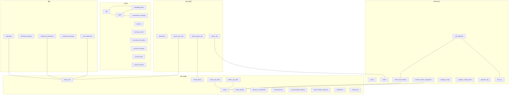
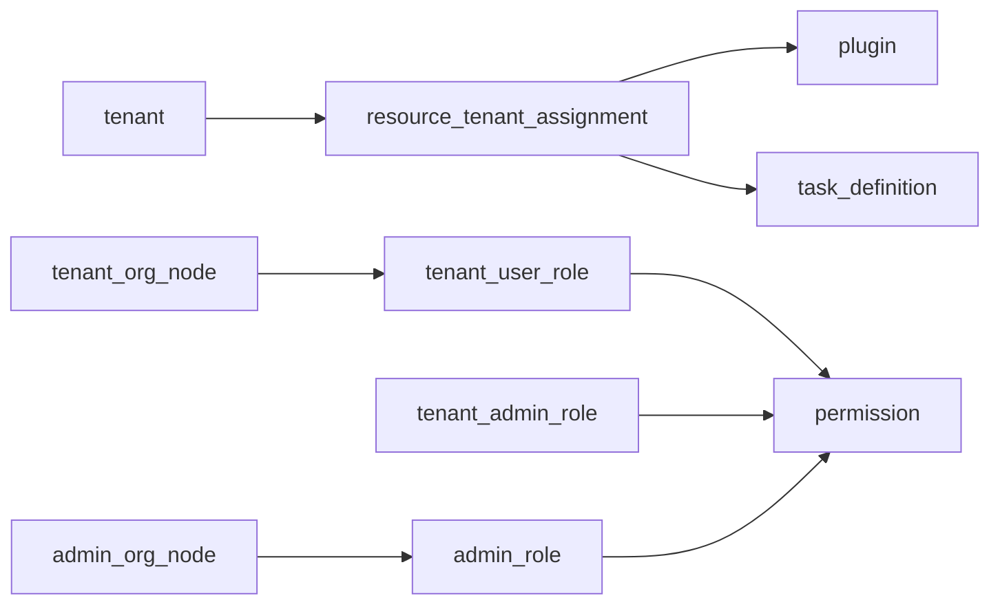

# 数据模型设计

<cite>
**本文引用的文件**
- [backend/app/models/ai/agent.py](file://backend/app/models/ai/agent.py)
- [backend/app/models/ai/knowledge_base.py](file://backend/app/models/ai/knowledge_base.py)
- [backend/app/models/ai/conversation_message.py](file://backend/app/models/ai/conversation_message.py)
- [backend/app/models/ai/skill.py](file://backend/app/models/ai/skill.py)
- [backend/app/models/ai/api_key.py](file://backend/app/models/ai/api_key.py)
- [backend/app/models/system/plugin.py](file://backend/app/models/system/plugin.py)
- [backend/app/models/system/task_definition.py](file://backend/app/models/system/task_definition.py)
- [backend/app/models/system/task_run.py](file://backend/app/models/system/task_run.py)
- [backend/app/models/system/tenant_task_binding.py](file://backend/app/models/system/tenant_task_binding.py)
- [backend/app/models/system/resource_tenant_assignment.py](file://backend/app/models/system/resource_tenant_assignment.py)
- [backend/app/models/system/codegen_config.py](file://backend/app/models/system/codegen_config.py)
- [backend/app/models/system/codegen_config_version.py](file://backend/app/models/system/codegen_config_version.py)
- [backend/app/models/system/operation_log.py](file://backend/app/models/system/operation_log.py)
- [backend/app/models/system/admin.py](file://backend/app/models/system/admin.py)
- [backend/app/models/system/plugin_license.py](file://backend/app/models/system/plugin_license.py)
- [backend/app/models/system/plugin_version.py](file://backend/app/models/system/plugin_version.py)
- [backend/app/models/tenant/tenant.py](file://backend/app/models/tenant/tenant.py)
- [backend/app/models/tenant/tenant_user.py](file://backend/app/models/tenant/tenant_user.py)
- [backend/app/models/tenant/tenant_domain.py](file://backend/app/models/tenant/tenant_domain.py)
- [backend/app/models/tenant/domain_ssl_certificate.py](file://backend/app/models/tenant/domain_ssl_certificate.py)
- [backend/app/models/tenant/announcement.py](file://backend/app/models/tenant/announcement.py)
- [backend/app/models/tenant/announcement_delivery.py](file://backend/app/models/tenant/announcement_delivery.py)
- [backend/app/models/tenant/announcement_response.py](file://backend/app/models/tenant/announcement_response.py)
- [backend/app/models/tenant/attachment.py](file://backend/app/models/tenant/attachment.py)
- [backend/app/models/tenant/tenant_plan.py](file://backend/app/models/tenant/tenant_plan.py)
- [backend/app/models/tenant/tenant_admin.py](file://backend/app/models/tenant/tenant_admin.py)
- [backend/app/models/auth/permission.py](file://backend/app/models/auth/permission.py)
- [backend/app/models/auth/tenant_user_role.py](file://backend/app/models/auth/tenant_user_role.py)
- [backend/app/models/auth/tenant_admin_role.py](file://backend/app/models/auth/tenant_admin_role.py)
- [backend/app/models/auth/admin_role.py](file://backend/app/models/auth/admin_role.py)
- [backend/app/models/common/notification.py](file://backend/app/models/common/notification.py)
- [backend/app/models/common/notification_delivery.py](file://backend/app/models/common/notification_delivery.py)
- [backend/app/models/common/notification_preference.py](file://backend/app/models/common/notification_preference.py)
- [backend/app/models/common/notification_template.py](file://backend/app/models/common/notification_template.py)
- [backend/app/models/common/user_preference.py](file://backend/app/models/common/user_preference.py)
- [backend/app/models/org/tenant_org_node.py](file://backend/app/models/org/tenant_org_node.py)
- [backend/app/models/org/admin_org_node.py](file://backend/app/models/org/admin_org_node.py)
- [backend/app/models/ai/memory_record.py](file://backend/app/models/ai/memory_record.py)
- [backend/app/models/ai/profile_snapshot.py](file://backend/app/models/ai/profile_snapshot.py)
- [backend/app/models/ai/execution_trust_policy.py](file://backend/app/models/ai/execution_trust_policy.py)
- [backend/app/models/ai/execution_decision.py](file://backend/app/models/ai/execution_decision.py)
- [backend/app/models/ai/tenant_quota.py](file://backend/app/models/ai/tenant_quota.py)
- [backend/app/models/ai/tenant_rate_limit.py](file://backend/app/models/ai/tenant_rate_limit.py)
- [backend/app/models/ai/provider.py](file://backend/app/models/ai/provider.py)
- [backend/app/models/ai/model.py](file://backend/app/models/ai/model.py)
- [backend/app/models/ai/capability.py](file://backend/app/models/ai/capability.py)
- [backend/app/models/ai/skill_package.py](file://backend/app/models/ai/skill_package.py)
- [backend/app/models/ai/skill_capability_binding.py](file://backend/app/models/ai/skill_capability_binding.py)
- [backend/app/models/ai/skill_resource.py](file://backend/app/models/ai/skill_resource.py)
- [backend/app/models/ai/tenant_agent_platform_kb_suppression.py](file://backend/app/models/ai/tenant_agent_platform_kb_suppression.py)
- [backend/app/models/ai/tenant_agent_publication.py](file://backend/app/models/ai/tenant_agent_publication.py)
- [backend/app/models/ai/agent_version.py](file://backend/app/models/ai/agent_version.py)
- [backend/app/models/ai/agent_access.py](file://backend/app/models/ai/agent_access.py)
- [backend/app/models/ai/agent_conversation.py](file://backend/app/models/ai/agent_conversation.py)
- [backend/app/models/ai/agent_kb_binding.py](file://backend/app/models/ai/agent_kb_binding.py)
- [backend/app/models/ai/agent_memory_override.py](file://backend/app/models/ai/agent_memory_override.py)
- [backend/app/models/ai/agent_skill_grant.py](file://backend/app/models/ai/agent_skill_grant.py)
- [backend/app/models/ai/batch_run.py](file://backend/app/models/ai/batch_run.py)
- [backend/app/models/ai/call_log.py](file://backend/app/models/ai/call_log.py)
- [backend/app/models/ai/action_log.py](file://backend/app/models/ai/action_log.py)
- [backend/app/models/ai/query_log.py](file://backend/app/models/ai/query_log.py)
- [backend/app/models/ai/skill_call_log.py](file://backend/app/models/ai/skill_call_log.py)
- [backend/app/models/ai/knowledge_document.py](file://backend/app/models/ai/knowledge_document.py)
- [backend/app/models/ai/document_chunk.py](file://backend/app/models/ai/document_chunk.py)
- [backend/app/models/ai/agent_assignment.py](file://backend/app/models/ai/agent_assignment.py)
- [backend/migrations/versions/20260210_0005_create_agent_engine_tables.py](file://backend/migrations/versions/20260210_0005_create_agent_engine_tables.py)
- [backend/migrations/versions/20260211_0010_add_knowledge_base_tables.py](file://backend/migrations/versions/20260211_0010_add_knowledge_base_tables.py)
- [backend/migrations/versions/20260213_add_plugins_tables.py](file://backend/migrations/versions/20260213_add_plugins_tables.py)
- [backend/migrations/versions/20260213_add_script_skill_fields.py](file://backend/migrations/versions/20260213_add_script_skill_fields.py)
- [backend/migrations/versions/20260213_seed_system_agents_skills.py](file://backend/migrations/versions/20260213_seed_system_agents_skills.py)
- [backend/migrations/versions/20260214_add_global_scope.py](file://backend/migrations/versions/20260214_add_global_scope.py)
- [backend/migrations/versions/20260214_add_is_system_field.py](file://backend/migrations/versions/20260214_add_is_system_field.py)
- [backend/migrations/versions/20260214_add_toolkit_fields_to_skills.py](file://backend/migrations/versions/20260214_add_toolkit_fields_to_skills.py)
- [backend/migrations/versions/20260214_migrate_skills_to_toolkit.py](file://backend/migrations/versions/20260214_migrate_skills_to_toolkit.py)
- [backend/migrations/versions/20260214_normalize_scope_admin.py](file://backend/migrations/versions/20260214_normalize_scope_admin.py)
- [backend/migrations/versions/20260214_seed_system_data_intelligence.py](file://backend/migrations/versions/20260214_seed_system_data_intelligence.py)
- [backend/migrations/versions/20260215_add_crud_generation_records.py](file://backend/migrations/versions/20260215_add_crud_generation_records.py)
- [backend/migrations/versions/20260215_add_valves_to_skill_packages.py](file://backend/migrations/versions/20260215_add_valves_to_skill_packages.py)
- [backend/migrations/versions/20260215_populate_builtin_skill_tools.py](file://backend/migrations/versions/20260215_populate_builtin_skill_tools.py)
- [backend/migrations/versions/20260215_refactor_agent_bind_package.py](file://backend/migrations/versions/20260215_refactor_agent_bind_package.py)
- [backend/migrations/versions/20260215_rename_agents_and_add_data_agent.py](file://backend/migrations/versions/20260215_rename_agents_and_add_data_agent.py)
- [backend/migrations/versions/20260216_add_consent_mode_to_bindings.py](file://backend/migrations/versions/20260216_add_consent_mode_to_bindings.py)
- [backend/migrations/versions/20260216_add_system_agent_assignments.py](file://backend/migrations/versions/20260216_add_system_agent_assignments.py)
- [backend/migrations/versions/20260216_add_tenant_id_to_agent_assignments.py](file://backend/migrations/versions/20260216_add_tenant_id_to_agent_assignments.py)
- [backend/migrations/versions/20260216_seed_agent_assignments.py](file://backend/migrations/versions/20260216_seed_agent_assignments.py)
- [backend/migrations/versions/20260216_seed_agent_welcome_messages.py](file://backend/migrations/versions/20260216_seed_agent_welcome_messages.py)
- [backend/migrations/versions/20260221_61e838badbfa_add_skill_consent_overrides_to_bindings.py](file://backend/migrations/versions/20260221_61e838badbfa_add_skill_consent_overrides_to_bindings.py)
- [backend/migrations/versions/20260221_6b4fe69b2efc_add_notification_tables.py](file://backend/migrations/versions/20260221_6b4fe69b2efc_add_notification_tables.py)
- [backend/migrations/versions/20260221_a5e1ff4cfca1_merge_img_limits_and_fix_tz.py](file://backend/migrations/versions/20260221_a5e1ff4cfca1_merge_img_limits_and_fix_tz.py)
- [backend/migrations/versions/20260221_add_image_limits_to_ai_models.py](file://backend/migrations/versions/20260221_add_image_limits_to_ai_models.py)
- [backend/migrations/versions/20260221_e97db2eecd63_drop_agent_tool_bindings_column.py](file://backend/migrations/versions/20260221_e97db2eecd63_drop_agent_tool_bindings_column.py)
- [backend/migrations/versions/20260224_add_kb_visibility_and_tenant_access.py](file://backend/migrations/versions/20260224_add_kb_visibility_and_tenant_access.py)
- [backend/migrations/versions/20260224_allow_null_attachment_tenant_id.py](file://backend/migrations/versions/20260224_allow_null_attachment_tenant_id.py)
- [backend/migrations/versions/20260224_ffa4ebdf6d2e_add_resource_tenant_assignments_table.py](file://backend/migrations/versions/20260224_ffa4ebdf6d2e_add_resource_tenant_assignments_table.py)
- [backend/migrations/versions/20260225_0001_cleanup_orphan_table_and_add_constraints.py](file://backend/migrations/versions/20260225_0001_cleanup_orphan_table_and_add_constraints.py)
- [backend/migrations/versions/20260226_0410_merge_system_skill_packages.py](file://backend/migrations/versions/20260226_0410_merge_system_skill_packages.py)
- [backend/migrations/versions/20260226_4b78906f0bf9_add_expires_at_to_plugin_licenses.py](file://backend/migrations/versions/20260226_4b78906f0bf9_add_expires_at_to_plugin licenses.py)
- [backend/migrations/versions/20260228_0bc08d7f8260_add_vision_model_id_and_extract_images_.py](file://backend/migrations/versions/20260228_0bc08d7f8260_add_vision_model_id_and_extract_images_.py)
- [backend/migrations/versions/20260228_8ab691fb6d2e_add_tier_column_to_ai_models.py](file://backend/migrations/versions/20260228_8ab691fb6d2e_add_tier_column_to_ai_models.py)
- [backend/migrations/versions/20260301_075fdfee8a70_add_routing_fields_to_ai_call_logs.py](file://backend/migrations/versions/20260301_075fdfee8a70_add_routing_fields_to_ai_call_logs.py)
- [backend/migrations/versions/20260301_f5b3f63a5364_add_routing_config_to_agents.py](file://backend/migrations/versions/20260301_f5b3f63a5364_add_routing_config_to_agents.py)
- [backend/migrations/versions/20260301_seed_plugin_trial_check_task.py](file://backend/migrations/versions/20260301_seed_plugin_trial_check_task.py)
- [backend/migrations/versions/20260302_9f2d1e34c7a1_add_agent_memory_switch_and_override.py](file://backend/migrations/versions/20260302_9f2d1e34c7a1_add_agent_memory_switch_and_override.py)
- [backend/migrations/versions/20260302_seed_session_memory_cleanup_task.py](file://backend/migrations/versions/20260302_seed_session_memory_cleanup_task.py)
- [backend/migrations/versions/20260303_c1a4f0e2b9d3_merge_session_memory_heads.py](file://backend/migrations/versions/20260303_c1a4f0e2b9d3_merge_session_memory_heads.py)
- [backend/migrations/versions/20260305_add_agent_id_to_conversation_messages.py](file://backend/migrations/versions/20260305_add_agent_id_to_conversation_messages.py)
- [backend/migrations/versions/20260305_add_tenant_scoped_unique_constraints.py](file://backend/migrations/versions/20260305_add_tenant_scoped_unique_constraints.py)
- [backend/migrations/versions/20260305_seed_router_agent_and_default_chat.py](file://backend/migrations/versions/20260305_seed_router_agent_and_default_chat.py)
- [backend/migrations/versions/20260307_add_tenant_user_roles.py](file://backend/migrations/versions/20260307_add_tenant_user_roles.py)
- [backend/migrations/versions/20260307_backfill_default_user_roles.py](file://backend/migrations/versions/20260307_backfill_default_user_roles.py)
- [backend/migrations/versions/20260308_05f5370dfb35_merge_three_heads.py](file://backend/migrations/versions/20260308_05f5370dfb35_merge_three_heads.py)
- [backend/migrations/versions/20260308_2200_add_target_audience_and_access_fields.py](file://backend/migrations/versions/20260308_2200_add_target_audience_and_access_fields.py)
- [backend/migrations/versions/20260308_2201_split_system_skill_packages.py](file://backend/migrations/versions/20260308_2201_split_system_skill_packages.py)
- [backend/migrations/versions/20260308_2202_init_agent_target_audience.py](file://backend/migrations/versions/20260308_2202_init_agent_target_audience.py)
- [backend/migrations/versions/20260308_add_agent_kb_bindings.py](file://backend/migrations/versions/20260308_add_agent_kb_bindings.py)
- [backend/migrations/versions/20260309_add_missing_cols_agent_kb_bindings.py](file://backend/migrations/versions/20260309_add_missing_cols_agent_kb_bindings.py)
- [backend/migrations/versions/20260310_drop_deprecated_kb_ids_columns.py](file://backend/migrations/versions/20260310_drop_deprecated_kb_ids_columns.py)
- [backend/migrations/versions/20260311_51e07931504d_remove_skill_packages_scope_column.py](file://backend/migrations/versions/20260311_51e07931504d_remove_skill_packages_scope_column.py)
- [backend/migrations/versions/20260314_0914_add_scope_to_ai_api_keys.py](file://backend/migrations/versions/20260314_0914_add_scope_to_ai_api_keys.py)
- [backend/migrations/versions/20260314_0927_add_user_preferences_table.py](file://backend/migrations/versions/20260314_0927_add_user_preferences_table.py)
- [backend/migrations/versions/20260314_0949_notification_pref_add_global_layer.py](file://backend/migrations/versions/20260314_0949_notification_pref_add_global_layer.py)
- [backend/migrations/versions/20260314_cleanup_unused_notification_templates.py](file://backend/migrations/versions/20260314_cleanup_unused_notification_templates.py)
- [backend/migrations/versions/20260314_migrate_display_images_to_public.py](file://backend/migrations/versions/20260314_migrate_display_images_to_public.py)
- [backend/migrations/versions/20260314_seed_ai_writing_assignment.py](file://backend/migrations/versions/20260314_seed_ai_writing_assignment.py)
- [backend/migrations/versions/20260314_seed_litellm_registry_sync_task.py](file://backend/migrations/versions/20260314_seed_litellm_registry_sync_task.py)
- [backend/migrations/versions/20260315_seed_novusdoc_writer_agent.py](file://backend/migrations/versions/20260315_seed_novusdoc_writer_agent.py)
- [backend/migrations/versions/20260315_update_ai_writing_description.py](file://backend/migrations/versions/20260315_update_ai_writing_description.py)
- [backend/migrations/versions/20260316_novusdoc_writer_scope_admin_and_all.py](file://backend/migrations/versions/20260316_novusdoc_writer_scope_admin_and_all.py)
- [backend/migrations/versions/20260317_0001_add_supports_audio_video_to_ai_models.py](file://backend/migrations/versions/20260317_0001_add_supports_audio_video_to_ai_models.py)
- [backend/migrations/versions/20260317_001_add_codegen_config_versions.py](file://backend/migrations/versions/20260317_001_add_codegen_config_versions.py)
- [backend/migrations/versions/20260317_add_codegen_configs_table.py](file://backend/migrations/versions/20260317_add_codegen_configs_table.py)
- [backend/migrations/versions/20260318_0001_add_audio_video_model_id_to_knowledge_bases.py](file://backend/migrations/versions/20260318_0001_add_audio_video_model_id_to_knowledge_bases.py)
- [backend/migrations/versions/20260318_0002_update_litellm_registry_task_description.py](file://backend/migrations/versions/20260318_0002_update_litellm_registry_task_description.py)
- [backend/migrations/versions/20260318_0003_add_trace_id_to_operation_logs.py](file://backend/migrations/versions/20260318_0003_add_trace_id_to_operation_logs.py)
- [backend/migrations/versions/20260318_0004_add_data_scope_to_roles.py](file://backend/migrations/versions/20260318_0004_add_data_scope_to_roles.py)
- [backend/migrations/versions/20260318_1935_merge_all_heads.py](file://backend/migrations/versions/20260318_1935_merge_all_heads.py)
- [backend/migrations/versions/20260319_add_codegen_config_resource_unique.py](file://backend/migrations/versions/20260319_add_codegen_config_resource_unique.py)
- [backend/migrations/versions/20260320_tenant_agent_platform_kb_suppressions.py](file://backend/migrations/versions/20260320_tenant_agent_platform_kb_suppressions.py)
- [backend/migrations/versions/20260320_unified_resource_and_permission_scope.py](file://backend/migrations/versions/20260320_unified_resource_and_permission_scope.py)
- [backend/migrations/versions/20260320_update_data_mgmt_pkg_desc.py](file://backend/migrations/versions/20260320_update_data_mgmt_pkg_desc.py)
- [backend/migrations/versions/20260321_ai_api_keys_scope_owner_normalize.py](file://backend/migrations/versions/20260321_ai_api_keys_scope_owner_normalize.py)
- [backend/migrations/versions/20260321_ai_call_log_contract.py](file://backend/migrations/versions/20260321_ai_call_log_contract.py)
- [backend/migrations/versions/20260322_ai_billing_ledger_merge.py](file://backend/migrations/versions/20260322_ai_billing_ledger_merge.py)
- [backend/migrations/versions/20260323_rename_ai_call_log_agent_resource_scope.py](file://backend/migrations/versions/20260323_rename_ai_call_log_agent_resource_scope.py)
- [backend/migrations/versions/20260324_add_conversation_owner_type_and_session_task_scope.py](file://backend/migrations/versions/20260324_add_conversation_owner_type_and_session_task_scope.py)
- [backend/migrations/versions/20260324_add_missing_recycle_bin_columns.py](file://backend/migrations/versions/20260324_add_missing_recycle_bin_columns.py)
- [backend/migrations/versions/20260324_drop_skill_package_target_audience.py](file://backend/migrations/versions/20260324_drop_skill_package_target_audience.py)
- [backend/migrations/versions/20260324_periodic_tasks_owner_tenant_id_repair.py](file://backend/migrations/versions/20260324_periodic_tasks_owner_tenant_id_repair.py)
- [backend/migrations/versions/20260324_plugin_license_semantics_cleanup.py](file://backend/migrations/versions/20260324_plugin_license_semantics_cleanup.py)
- [backend/migrations/versions/20260325_0001_skill_architecture_foundation.py](file://backend/migrations/versions/20260325_0001_skill_architecture_foundation.py)
- [backend/migrations/versions/20260325_0002_task_scheduling_foundation.py](file://backend/migrations/versions/20260325_0002_task_scheduling_foundation.py)
- [backend/migrations/versions/20260325_0003_task_definition_operational_fields.py](file://backend/migrations/versions/20260325_0003_task_definition_operational_fields.py)
- [backend/migrations/versions/20260325_0004_backfill_task_definitions_from_periodic_tasks.py](file://backend/migrations/versions/20260325_0004_backfill_task_definitions_from_periodic_tasks.py)
- [backend/migrations/versions/20260325_0005_drop_legacy_task_tables.py](file://backend/migrations/versions/20260325_0005_drop_legacy_task_tables.py)
- [backend/migrations/versions/20260325_org_authority_rebuild.py](file://backend/migrations/versions/20260325_org_authority_rebuild.py)
- [backend/migrations/versions/20260325_org_node_perm.py](file://backend/migrations/versions/20260325_org_node_perm.py)
- [backend/migrations/versions/20260326_0001_ai_action_log_actor_snapshots.py](file://backend/migrations/versions/20260326_0001_ai_action_log_actor_snapshots.py)
- [backend/migrations/versions/20260327_1500_cleanup_legacy.py](file://backend/migrations/versions/20260327_1500_cleanup_legacy.py)
- [backend/migrations/versions/20260327_1930_residual_schema.py](file://backend/migrations/versions/20260327_1930_residual_schema.py)
- [backend/migrations/versions/20260327_2030_index_sync.py](file://backend/migrations/versions/20260327_2030_index_sync.py)
- [backend/migrations/versions/20260329_0010_normalize_task_definition_platform_scope.py](file://backend/migrations/versions/20260329_0010_normalize_task_definition_platform_scope.py)
- [backend/migrations/versions/20260329_0020_cleanup_task_binding_scope_semantics.py](file://backend/migrations/versions/20260329_0020_cleanup_task_binding_scope_semantics.py)
- [backend/migrations/versions/20260329_0030_add_memory_records.py](file://backend/migrations/versions/20260329_0030_add_memory_records.py)
- [backend/migrations/versions/20260329_0040_add_execution_trust_policies.py](file://backend/migrations/versions/20260329_0040_add_execution_trust_policies.py)
- [backend/migrations/versions/20260329_0050_add_execution_decisions.py](file://backend/migrations/versions/20260329_0050_add_execution_decisions.py)
- [backend/migrations/versions/20260330_0060_add_execution_decision_id_to_ai_action_logs.py](file://backend/migrations/versions/20260330_0060_add_execution_decision_id_to_ai_action_logs.py)
- [backend/migrations/versions/20260330_0070_add_profile_snapshots.py](file://backend/migrations/versions/20260330_0070_add_profile_snapshots.py)
- [backend/migrations/versions/20260330_0080_ephem_docs.py](file://backend/migrations/versions/20260330_0080_ephem_docs.py)
</cite>

## 目录
1. [简介](#简介)
2. [项目结构](#项目结构)
3. [核心组件](#核心组件)
4. [架构总览](#架构总览)
5. [详细组件分析](#详细组件分析)
6. [依赖分析](#依赖分析)
7. [性能考虑](#性能考虑)
8. [故障排查指南](#故障排查指南)
9. [结论](#结论)
10. [附录](#附录)

## 简介
本文件面向 NovusAI SaaS 的数据层，系统化梳理并设计以下实体域：AI 相关（agent、knowledge_base、conversation_message 等）、系统与任务（plugin、task 系列）、租户与组织（tenant、tenant_user、org 节点）、认证与权限（permission、role 系列）、通用（notification、user_preference）。文档涵盖实体关系映射、主键/外键与约束、字段定义与数据类型、多租户隔离策略、权限与组织架构模型、设计规范与扩展性，并提供 ER 图与使用示例。

## 项目结构
后端采用按领域分层的模型组织方式：
- 模型目录按功能域划分：ai、system、tenant、auth、common、org
- 迁移版本覆盖了从初始表到 AI 引擎、知识库、插件、技能、通知、任务调度、权限与组织架构的演进

图表来源
- [backend/app/models/ai/agent.py](file://backend/app/models/ai/agent.py)
- [backend/app/models/ai/knowledge_base.py](file://backend/app/models/ai/knowledge_base.py)
- [backend/app/models/ai/conversation_message.py](file://backend/app/models/ai/conversation_message.py)
- [backend/app/models/ai/skill.py](file://backend/app/models/ai/skill.py)
- [backend/app/models/ai/api_key.py](file://backend/app/models/ai/api_key.py)
- [backend/app/models/system/plugin.py](file://backend/app/models/system/plugin.py)
- [backend/app/models/system/task_definition.py](file://backend/app/models/system/task_definition.py)
- [backend/app/models/system/task_run.py](file://backend/app/models/system/task_run.py)
- [backend/app/models/system/tenant_task_binding.py](file://backend/app/models/system/tenant_task_binding.py)
- [backend/app/models/system/resource_tenant_assignment.py](file://backend/app/models/system/resource_tenant_assignment.py)
- [backend/app/models/tenant/tenant.py](file://backend/app/models/tenant/tenant.py)
- [backend/app/models/tenant/tenant_user.py](file://backend/app/models/tenant/tenant_user.py)
- [backend/app/models/tenant/tenant_domain.py](file://backend/app/models/tenant/tenant_domain.py)
- [backend/app/models/tenant/domain_ssl_certificate.py](file://backend/app/models/tenant/domain_ssl_certificate.py)
- [backend/app/models/tenant/announcement.py](file://backend/app/models/tenant/announcement.py)
- [backend/app/models/tenant/announcement_delivery.py](file://backend/app/models/tenant/announcement_delivery.py)
- [backend/app/models/tenant/announcement_response.py](file://backend/app/models/tenant/announcement_response.py)
- [backend/app/models/tenant/attachment.py](file://backend/app/models/tenant/attachment.py)
- [backend/app/models/tenant/tenant_plan.py](file://backend/app/models/tenant/tenant_plan.py)
- [backend/app/models/tenant/tenant_admin.py](file://backend/app/models/tenant/tenant_admin.py)
- [backend/app/models/auth/permission.py](file://backend/app/models/auth/permission.py)
- [backend/app/models/auth/tenant_user_role.py](file://backend/app/models/auth/tenant_user_role.py)
- [backend/app/models/auth/tenant_admin_role.py](file://backend/app/models/auth/tenant_admin_role.py)
- [backend/app/models/auth/admin_role.py](file://backend/app/models/auth/admin_role.py)
- [backend/app/models/common/notification.py](file://backend/app/models/common/notification.py)
- [backend/app/models/common/notification_delivery.py](file://backend/app/models/common/notification_delivery.py)
- [backend/app/models/common/notification_preference.py](file://backend/app/models/common/notification_preference.py)
- [backend/app/models/common/notification_template.py](file://backend/app/models/common/notification_template.py)
- [backend/app/models/common/user_preference.py](file://backend/app/models/common/user_preference.py)
- [backend/app/models/org/tenant_org_node.py](file://backend/app/models/org/tenant_org_node.py)
- [backend/app/models/org/admin_org_node.py](file://backend/app/models/org/admin_org_node.py)

章节来源
- [backend/app/models/ai/agent.py](file://backend/app/models/ai/agent.py)
- [backend/app/models/ai/knowledge_base.py](file://backend/app/models/ai/knowledge_base.py)
- [backend/app/models/ai/conversation_message.py](file://backend/app/models/ai/conversation_message.py)
- [backend/app/models/ai/skill.py](file://backend/app/models/ai/skill.py)
- [backend/app/models/ai/api_key.py](file://backend/app/models/ai/api_key.py)
- [backend/app/models/system/plugin.py](file://backend/app/models/system/plugin.py)
- [backend/app/models/system/task_definition.py](file://backend/app/models/system/task_definition.py)
- [backend/app/models/system/task_run.py](file://backend/app/models/system/task_run.py)
- [backend/app/models/system/tenant_task_binding.py](file://backend/app/models/system/tenant_task_binding.py)
- [backend/app/models/system/resource_tenant_assignment.py](file://backend/app/models/system/resource_tenant_assignment.py)
- [backend/app/models/tenant/tenant.py](file://backend/app/models/tenant/tenant.py)
- [backend/app/models/tenant/tenant_user.py](file://backend/app/models/tenant/tenant_user.py)
- [backend/app/models/tenant/tenant_domain.py](file://backend/app/models/tenant/tenant_domain.py)
- [backend/app/models/tenant/domain_ssl_certificate.py](file://backend/app/models/tenant/domain_ssl_certificate.py)
- [backend/app/models/tenant/announcement.py](file://backend/app/models/tenant/announcement.py)
- [backend/app/models/tenant/announcement_delivery.py](file://backend/app/models/tenant/announcement_delivery.py)
- [backend/app/models/tenant/announcement_response.py](file://backend/app/models/tenant/announcement_response.py)
- [backend/app/models/tenant/attachment.py](file://backend/app/models/tenant/attachment.py)
- [backend/app/models/tenant/tenant_plan.py](file://backend/app/models/tenant/tenant_plan.py)
- [backend/app/models/tenant/tenant_admin.py](file://backend/app/models/tenant/tenant_admin.py)
- [backend/app/models/auth/permission.py](file://backend/app/models/auth/permission.py)
- [backend/app/models/auth/tenant_user_role.py](file://backend/app/models/auth/tenant_user_role.py)
- [backend/app/models/auth/tenant_admin_role.py](file://backend/app/models/auth/tenant_admin_role.py)
- [backend/app/models/auth/admin_role.py](file://backend/app/models/auth/admin_role.py)
- [backend/app/models/common/notification.py](file://backend/app/models/common/notification.py)
- [backend/app/models/common/notification_delivery.py](file://backend/app/models/common/notification_delivery.py)
- [backend/app/models/common/notification_preference.py](file://backend/app/models/common/notification_preference.py)
- [backend/app/models/common/notification_template.py](file://backend/app/models/common/notification_template.py)
- [backend/app/models/common/user_preference.py](file://backend/app/models/common/user_preference.py)
- [backend/app/models/org/tenant_org_node.py](file://backend/app/models/org/tenant_org_node.py)
- [backend/app/models/org/admin_org_node.py](file://backend/app/models/org/admin_org_node.py)

## 核心组件
本节对关键实体进行字段与关系的概览说明，具体字段定义以各模型文件为准。

- AI 实体
  - agent：智能体元数据、路由配置、可见性与访问控制、版本管理
  - knowledge_base：知识库元数据、可见性、多模态模型绑定
  - conversation_message：会话消息、归属智能体与租户
  - skill：技能定义、工具包字段、脚本化能力
  - api_key：AI 接口密钥、作用域与归属
  - memory_record、profile_snapshot：记忆与快照
  - execution_trust_policy、execution_decision：执行信任与决策
  - tenant_quota、tenant_rate_limit：租户配额与限流

- 系统与任务实体
  - plugin、plugin_version、plugin_license：插件生态
  - task_definition、task_run、tenant_task_binding：任务编排与运行
  - resource_tenant_assignment：资源与租户分配
  - codegen_config、codegen_config_version：代码生成配置
  - operation_log：操作审计日志

- 租户与组织实体
  - tenant、tenant_user、tenant_admin：租户主体、成员与管理员
  - tenant_domain、domain_ssl_certificate：域名与证书
  - announcement、announcement_delivery、announcement_response：公告体系
  - attachment：附件存储
  - tenant_plan：租户套餐
  - tenant_org_node、admin_org_node：组织节点

- 认证与权限实体
  - permission、tenant_user_role、tenant_admin_role、admin_role：权限与角色

- 通用实体
  - notification、notification_delivery、notification_template、notification_preference：通知体系
  - user_preference：用户偏好

章节来源
- [backend/app/models/ai/agent.py](file://backend/app/models/ai/agent.py)
- [backend/app/models/ai/knowledge_base.py](file://backend/app/models/ai/knowledge_base.py)
- [backend/app/models/ai/conversation_message.py](file://backend/app/models/ai/conversation_message.py)
- [backend/app/models/ai/skill.py](file://backend/app/models/ai/skill.py)
- [backend/app/models/ai/api_key.py](file://backend/app/models/ai/api_key.py)
- [backend/app/models/system/plugin.py](file://backend/app/models/system/plugin.py)
- [backend/app/models/system/task_definition.py](file://backend/app/models/system/task_definition.py)
- [backend/app/models/system/task_run.py](file://backend/app/models/system/task_run.py)
- [backend/app/models/system/tenant_task_binding.py](file://backend/app/models/system/tenant_task_binding.py)
- [backend/app/models/system/resource_tenant_assignment.py](file://backend/app/models/system/resource_tenant_assignment.py)
- [backend/app/models/system/codegen_config.py](file://backend/app/models/system/codegen_config.py)
- [backend/app/models/system/codegen_config_version.py](file://backend/app/models/system/codegen_config_version.py)
- [backend/app/models/system/operation_log.py](file://backend/app/models/system/operation_log.py)
- [backend/app/models/tenant/tenant.py](file://backend/app/models/tenant/tenant.py)
- [backend/app/models/tenant/tenant_user.py](file://backend/app/models/tenant/tenant_user.py)
- [backend/app/models/tenant/tenant_domain.py](file://backend/app/models/tenant/tenant_domain.py)
- [backend/app/models/tenant/domain_ssl_certificate.py](file://backend/app/models/tenant/domain_ssl_certificate.py)
- [backend/app/models/tenant/announcement.py](file://backend/app/models/tenant/announcement.py)
- [backend/app/models/tenant/announcement_delivery.py](file://backend/app/models/tenant/announcement_delivery.py)
- [backend/app/models/tenant/announcement_response.py](file://backend/app/models/tenant/announcement_response.py)
- [backend/app/models/tenant/attachment.py](file://backend/app/models/tenant/attachment.py)
- [backend/app/models/tenant/tenant_plan.py](file://backend/app/models/tenant/tenant_plan.py)
- [backend/app/models/tenant/tenant_admin.py](file://backend/app/models/tenant/tenant_admin.py)
- [backend/app/models/auth/permission.py](file://backend/app/models/auth/permission.py)
- [backend/app/models/auth/tenant_user_role.py](file://backend/app/models/auth/tenant_user_role.py)
- [backend/app/models/auth/tenant_admin_role.py](file://backend/app/models/auth/tenant_admin_role.py)
- [backend/app/models/auth/admin_role.py](file://backend/app/models/auth/admin_role.py)
- [backend/app/models/common/notification.py](file://backend/app/models/common/notification.py)
- [backend/app/models/common/notification_delivery.py](file://backend/app/models/common/notification_delivery.py)
- [backend/app/models/common/notification_preference.py](file://backend/app/models/common/notification_preference.py)
- [backend/app/models/common/notification_template.py](file://backend/app/models/common/notification_template.py)
- [backend/app/models/common/user_preference.py](file://backend/app/models/common/user_preference.py)
- [backend/app/models/org/tenant_org_node.py](file://backend/app/models/org/tenant_org_node.py)
- [backend/app/models/org/admin_org_node.py](file://backend/app/models/org/admin_org_node.py)

## 架构总览
下图展示核心实体间的依赖与归属关系，体现多租户隔离、权限与组织架构的落地。

```mermaid
erDiagram
TENANT ||--o{ TENANT_USER : "拥有"
TENANT ||--o{ TENANT_ADMIN : "拥有"
TENANT ||--o{ ANNOUNCEMENT : "发布"
ANNOUNCEMENT ||--o{ ANNOUNCEMENT_DELIVERY : "投递"
ANNOUNCEMENT_DELIVERY ||--o{ ANNOUNCEMENT_RESPONSE : "响应"
TENANT ||--o{ ATTACHMENT : "上传"
TENANT ||--o{ KNOWLEDGE_BASE : "拥有"
KNOWLEDGE_BASE ||--o{ CONVERSATION_MESSAGE : "承载"
AGENT ||--o{ CONVERSATION_MESSAGE : "发起"
AGENT ||--o{ SKILL : "绑定"
AGENT ||--o{ KNOWLEDGE_BASE : "绑定"
AGENT ||--o{ API_KEY : "生成"
AGENT ||--o{ MEMORY_RECORD : "记录"
AGENT ||--o{ EXECUTION_TRUST_POLICY : "受信任"
AGENT ||--o{ EXECUTION_DECISION : "决策"
TENANT ||--o{ PLUGIN_LICENSE : "持有"
PLUGIN ||--o{ PLUGIN_VERSION : "版本"
PLUGIN ||--o{ PLUGIN_LICENSE : "授权"
TENANT ||--o{ TASK_DEFINITION : "定义"
TASK_DEFINITION ||--o{ TASK_RUN : "执行"
TASK_DEFINITION ||--o{ TENANT_TASK_BINDING : "绑定"
TENANT_TASK_BINDING ||--|| TENANT : "归属"
TENANT ||--o{ RESOURCE_TENANT_ASSIGNMENT : "分配"
TENANT ||--o{ CODEGEN_CONFIG : "配置"
CODEGEN_CONFIG ||--o{ CODEGEN_CONFIG_VERSION : "版本"
TENANT ||--o{ OPERATION_LOG : "审计"
TENANT ||--o{ ADMIN : "管理"
TENANT ||--o{ TENANT_ORG_NODE : "组织"
ADMIN ||--o{ ADMIN_ORG_NODE : "组织"
TENANT_USER_ROLE ||--|| TENANT_USER : "授予"
TENANT_ADMIN_ROLE ||--|| TENANT_ADMIN : "授予"
ADMIN_ROLE ||--|| ADMIN : "授予"
PERMISSION ||--o{ TENANT_USER_ROLE : "授权"
PERMISSION ||--o{ TENANT_ADMIN_ROLE : "授权"
PERMISSION ||--o{ ADMIN_ROLE : "授权"
TENANT ||--o{ NOTIFICATION : "触发"
NOTIFICATION ||--o{ NOTIFICATION_DELIVERY : "投递"
NOTIFICATION ||--o{ NOTIFICATION_PREFERENCE : "偏好"
TENANT_USER ||--o{ USER_PREFERENCE : "偏好"
```

图表来源
- [backend/app/models/tenant/tenant.py](file://backend/app/models/tenant/tenant.py)
- [backend/app/models/tenant/tenant_user.py](file://backend/app/models/tenant/tenant_user.py)
- [backend/app/models/tenant/tenant_admin.py](file://backend/app/models/tenant/tenant_admin.py)
- [backend/app/models/tenant/announcement.py](file://backend/app/models/tenant/announcement.py)
- [backend/app/models/tenant/announcement_delivery.py](file://backend/app/models/tenant/announcement_delivery.py)
- [backend/app/models/tenant/announcement_response.py](file://backend/app/models/tenant/announcement_response.py)
- [backend/app/models/tenant/attachment.py](file://backend/app/models/tenant/attachment.py)
- [backend/app/models/ai/knowledge_base.py](file://backend/app/models/ai/knowledge_base.py)
- [backend/app/models/ai/conversation_message.py](file://backend/app/models/ai/conversation_message.py)
- [backend/app/models/ai/agent.py](file://backend/app/models/ai/agent.py)
- [backend/app/models/ai/skill.py](file://backend/app/models/ai/skill.py)
- [backend/app/models/ai/api_key.py](file://backend/app/models/ai/api_key.py)
- [backend/app/models/ai/memory_record.py](file://backend/app/models/ai/memory_record.py)
- [backend/app/models/ai/execution_trust_policy.py](file://backend/app/models/ai/execution_trust_policy.py)
- [backend/app/models/ai/execution_decision.py](file://backend/app/models/ai/execution_decision.py)
- [backend/app/models/system/plugin.py](file://backend/app/models/system/plugin.py)
- [backend/app/models/system/plugin_license.py](file://backend/app/models/system/plugin_license.py)
- [backend/app/models/system/plugin_version.py](file://backend/app/models/system/plugin_version.py)
- [backend/app/models/system/task_definition.py](file://backend/app/models/system/task_definition.py)
- [backend/app/models/system/task_run.py](file://backend/app/models/system/task_run.py)
- [backend/app/models/system/tenant_task_binding.py](file://backend/app/models/system/tenant_task_binding.py)
- [backend/app/models/system/resource_tenant_assignment.py](file://backend/app/models/system/resource_tenant_assignment.py)
- [backend/app/models/system/codegen_config.py](file://backend/app/models/system/codegen_config.py)
- [backend/app/models/system/codegen_config_version.py](file://backend/app/models/system/codegen_config_version.py)
- [backend/app/models/system/operation_log.py](file://backend/app/models/system/operation_log.py)
- [backend/app/models/system/admin.py](file://backend/app/models/system/admin.py)
- [backend/app/models/auth/permission.py](file://backend/app/models/auth/permission.py)
- [backend/app/models/auth/tenant_user_role.py](file://backend/app/models/auth/tenant_user_role.py)
- [backend/app/models/auth/tenant_admin_role.py](file://backend/app/models/auth/tenant_admin_role.py)
- [backend/app/models/auth/admin_role.py](file://backend/app/models/auth/admin_role.py)
- [backend/app/models/common/notification.py](file://backend/app/models/common/notification.py)
- [backend/app/models/common/notification_delivery.py](file://backend/app/models/common/notification_delivery.py)
- [backend/app/models/common/notification_preference.py](file://backend/app/models/common/notification_preference.py)
- [backend/app/models/common/user_preference.py](file://backend/app/models/common/user_preference.py)
- [backend/app/models/org/tenant_org_node.py](file://backend/app/models/org/tenant_org_node.py)
- [backend/app/models/org/admin_org_node.py](file://backend/app/models/org/admin_org_node.py)

## 详细组件分析

### AI 实体族
- agent
  - 设计要点：路由配置、可见性与访问控制、版本化；支持内存开关与覆盖
  - 关系：与 knowledge_base、conversation_message、api_key、memory_record、execution_trust_policy、execution_decision 存在一对多或多对多绑定
  - 约束：多租户作用域内唯一性与可见性约束
- knowledge_base
  - 设计要点：多模态模型绑定、可见性与租户访问控制
  - 关系：与 agent、conversation_message、document_chunk、knowledge_document 绑定
  - 约束：多租户作用域内唯一性与可见性约束
- conversation_message
  - 设计要点：消息内容、来源与目标、归属 agent 与 tenant
  - 关系：属于 agent 与 knowledge_base 的对话上下文
  - 约束：多租户作用域内唯一性与可见性约束
- skill
  - 设计要点：工具包字段、脚本化能力、内置与系统技能
  - 关系：与 agent、knowledge_base 绑定，支持阀门与同意覆盖
  - 约束：多租户作用域内唯一性与可见性约束
- api_key
  - 设计要点：AI 接口密钥、作用域与归属
  - 关系：属于 agent 或 tenant
  - 约束：多租户作用域内唯一性与可见性约束
- memory_record、profile_snapshot
  - 设计要点：记忆与快照，支持会话与执行上下文
- execution_trust_policy、execution_decision
  - 设计要点：执行信任策略与决策，支持审计与快照

章节来源
- [backend/app/models/ai/agent.py](file://backend/app/models/ai/agent.py)
- [backend/app/models/ai/knowledge_base.py](file://backend/app/models/ai/knowledge_base.py)
- [backend/app/models/ai/conversation_message.py](file://backend/app/models/ai/conversation_message.py)
- [backend/app/models/ai/skill.py](file://backend/app/models/ai/skill.py)
- [backend/app/models/ai/api_key.py](file://backend/app/models/ai/api_key.py)
- [backend/app/models/ai/memory_record.py](file://backend/app/models/ai/memory_record.py)
- [backend/app/models/ai/profile_snapshot.py](file://backend/app/models/ai/profile_snapshot.py)
- [backend/app/models/ai/execution_trust_policy.py](file://backend/app/models/ai/execution_trust_policy.py)
- [backend/app/models/ai/execution_decision.py](file://backend/app/models/ai/execution_decision.py)

### 系统与任务实体族
- plugin、plugin_version、plugin_license
  - 设计要点：插件生态、版本与授权
  - 关系：与 tenant、resource_tenant_assignment 绑定
- task_definition、task_run、tenant_task_binding
  - 设计要点：任务定义、运行与租户绑定
  - 关系：定义与运行的生命周期管理
- resource_tenant_assignment
  - 设计要点：资源与租户分配
- codegen_config、codegen_config_version
  - 设计要点：代码生成配置与版本
- operation_log
  - 设计要点：操作审计日志，含追踪 ID

章节来源
- [backend/app/models/system/plugin.py](file://backend/app/models/system/plugin.py)
- [backend/app/models/system/plugin_license.py](file://backend/app/models/system/plugin_license.py)
- [backend/app/models/system/plugin_version.py](file://backend/app/models/system/plugin_version.py)
- [backend/app/models/system/task_definition.py](file://backend/app/models/system/task_definition.py)
- [backend/app/models/system/task_run.py](file://backend/app/models/system/task_run.py)
- [backend/app/models/system/tenant_task_binding.py](file://backend/app/models/system/tenant_task_binding.py)
- [backend/app/models/system/resource_tenant_assignment.py](file://backend/app/models/system/resource_tenant_assignment.py)
- [backend/app/models/system/codegen_config.py](file://backend/app/models/system/codegen_config.py)
- [backend/app/models/system/codegen_config_version.py](file://backend/app/models/system/codegen_config_version.py)
- [backend/app/models/system/operation_log.py](file://backend/app/models/system/operation_log.py)

### 租户与组织实体族
- tenant、tenant_user、tenant_admin
  - 设计要点：租户主体、成员与管理员
- tenant_domain、domain_ssl_certificate
  - 设计要点：域名与证书
- announcement、announcement_delivery、announcement_response
  - 设计要点：公告发布、投递与响应
- attachment
  - 设计要点：附件存储
- tenant_plan
  - 设计要点：租户套餐
- tenant_org_node、admin_org_node
  - 设计要点：组织节点

章节来源
- [backend/app/models/tenant/tenant.py](file://backend/app/models/tenant/tenant.py)
- [backend/app/models/tenant/tenant_user.py](file://backend/app/models/tenant/tenant_user.py)
- [backend/app/models/tenant/tenant_admin.py](file://backend/app/models/tenant/tenant_admin.py)
- [backend/app/models/tenant/tenant_domain.py](file://backend/app/models/tenant/tenant_domain.py)
- [backend/app/models/tenant/domain_ssl_certificate.py](file://backend/app/models/tenant/domain_ssl_certificate.py)
- [backend/app/models/tenant/announcement.py](file://backend/app/models/tenant/announcement.py)
- [backend/app/models/tenant/announcement_delivery.py](file://backend/app/models/tenant/announcement_delivery.py)
- [backend/app/models/tenant/announcement_response.py](file://backend/app/models/tenant/announcement_response.py)
- [backend/app/models/tenant/attachment.py](file://backend/app/models/tenant/attachment.py)
- [backend/app/models/tenant/tenant_plan.py](file://backend/app/models/tenant/tenant_plan.py)
- [backend/app/models/org/tenant_org_node.py](file://backend/app/models/org/tenant_org_node.py)
- [backend/app/models/org/admin_org_node.py](file://backend/app/models/org/admin_org_node.py)

### 认证与权限实体族
- permission
  - 设计要点：权限条目
- tenant_user_role、tenant_admin_role、admin_role
  - 设计要点：角色与层级
- 关系：permission 通过角色授予给用户或管理员

章节来源
- [backend/app/models/auth/permission.py](file://backend/app/models/auth/permission.py)
- [backend/app/models/auth/tenant_user_role.py](file://backend/app/models/auth/tenant_user_role.py)
- [backend/app/models/auth/tenant_admin_role.py](file://backend/app/models/auth/tenant_admin_role.py)
- [backend/app/models/auth/admin_role.py](file://backend/app/models/auth/admin_role.py)

### 通用实体族
- notification、notification_delivery、notification_template、notification_preference
  - 设计要点：通知模板、投递与偏好
- user_preference
  - 设计要点：用户偏好

章节来源
- [backend/app/models/common/notification.py](file://backend/app/models/common/notification.py)
- [backend/app/models/common/notification_delivery.py](file://backend/app/models/common/notification_delivery.py)
- [backend/app/models/common/notification_preference.py](file://backend/app/models/common/notification_preference.py)
- [backend/app/models/common/notification_template.py](file://backend/app/models/common/notification_template.py)
- [backend/app/models/common/user_preference.py](file://backend/app/models/common/user_preference.py)

## 依赖分析
- 多租户隔离
  - 大多数实体具备 tenant_id 字段或通过 resource_tenant_assignment 映射，确保数据按租户隔离
  - 约束：迁移中引入“租户范围内的唯一性约束”，避免跨租户冲突
- 权限与组织
  - 角色与权限通过 tenant_user_role、tenant_admin_role、admin_role 与 permission 关联
  - 组织节点 tenant_org_node、admin_org_node 支持组织架构与权限继承
- 资源分配
  - resource_tenant_assignment 将资源与租户绑定，支撑插件、任务等资源的租户化

图表来源
- [backend/app/models/system/resource_tenant_assignment.py](file://backend/app/models/system/resource_tenant_assignment.py)
- [backend/app/models/system/plugin.py](file://backend/app/models/system/plugin.py)
- [backend/app/models/system/task_definition.py](file://backend/app/models/system/task_definition.py)
- [backend/app/models/auth/tenant_user_role.py](file://backend/app/models/auth/tenant_user_role.py)
- [backend/app/models/auth/tenant_admin_role.py](file://backend/app/models/auth/tenant_admin_role.py)
- [backend/app/models/auth/admin_role.py](file://backend/app/models/auth/admin_role.py)
- [backend/app/models/auth/permission.py](file://backend/app/models/auth/permission.py)
- [backend/app/models/org/tenant_org_node.py](file://backend/app/models/org/tenant_org_node.py)
- [backend/app/models/org/admin_org_node.py](file://backend/app/models/org/admin_org_node.py)

章节来源
- [backend/app/models/system/resource_tenant_assignment.py](file://backend/app/models/system/resource_tenant_assignment.py)
- [backend/app/models/auth/tenant_user_role.py](file://backend/app/models/auth/tenant_user_role.py)
- [backend/app/models/auth/tenant_admin_role.py](file://backend/app/models/auth/tenant_admin_role.py)
- [backend/app/models/auth/admin_role.py](file://backend/app/models/auth/admin_role.py)
- [backend/app/models/auth/permission.py](file://backend/app/models/auth/permission.py)
- [backend/app/models/org/tenant_org_node.py](file://backend/app/models/org/tenant_org_node.py)
- [backend/app/models/org/admin_org_node.py](file://backend/app/models/org/admin_org_node.py)

## 性能考虑
- 索引与查询
  - 建议在 tenant_id、agent_id、knowledge_base_id、resource_tenant_assignment 等高频过滤字段建立索引
  - 对 operation_log、call_log、action_log 等审计/调用日志表按时间分区或复合索引优化
- 写入与批量
  - 批量写入 conversation_message、knowledge_document、document_chunk 等时采用事务批处理
- 缓存与异步
  - 使用缓存存储常用配置（如 codegen_config、tenant_quota），结合 Celery 异步任务处理耗时操作（如通知投递、任务运行）

## 故障排查指南
- 多租户隔离问题
  - 症状：跨租户数据泄露或重复
  - 排查：确认 tenant_id 是否正确传递、唯一性约束是否生效、resource_tenant_assignment 是否正确
- 权限与角色异常
  - 症状：用户无法访问资源或越权
  - 排查：核对 tenant_user_role/tenant_admin_role 与 permission 的映射关系，检查组织节点权限继承
- 通知与偏好
  - 症状：通知未送达或偏好不生效
  - 排查：检查 notification_delivery 与 notification_preference 的状态与模板配置

章节来源
- [backend/app/models/system/operation_log.py](file://backend/app/models/system/operation_log.py)
- [backend/app/models/common/notification_delivery.py](file://backend/app/models/common/notification_delivery.py)
- [backend/app/models/common/notification_preference.py](file://backend/app/models/common/notification_preference.py)
- [backend/app/models/common/user_preference.py](file://backend/app/models/common/user_preference.py)

## 结论
本设计文档基于现有模型与迁移版本，系统化梳理了 NovusAI SaaS 的数据模型域与实体关系，明确了多租户隔离、权限与组织架构的实现路径，并提供了性能与故障排查建议。后续可在以下方面持续演进：统一字段命名与注释规范、完善审计与追踪字段、增强资源与租户的解耦设计。

## 附录
- 设计规范与命名约定
  - 表名与字段采用小写下划线风格，复数形式表示集合
  - 主键统一使用自增整型或 UUID，外键显式声明并带约束
  - 时间戳字段统一使用 datetime 类型，带时区
  - 多租户字段统一命名为 tenant_id，必要时增加 scope 字段
- 扩展性考虑
  - 插件与技能采用工具包与脚本化能力，便于扩展
  - 代码生成配置与版本化管理，支持动态扩展
  - 通知模板与偏好支持多层（全局/租户/用户）叠加