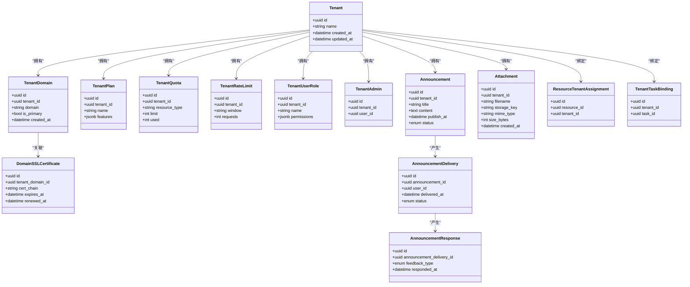
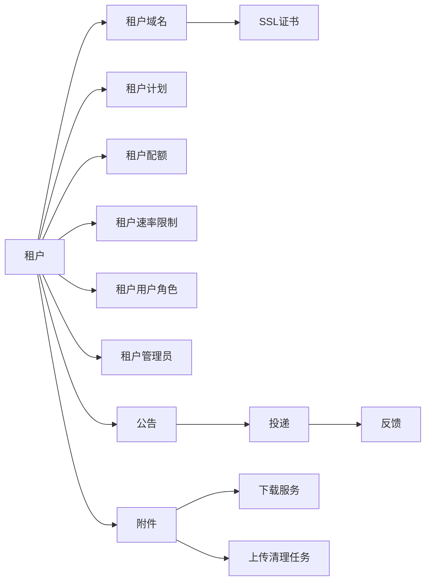

# 租户管理模型

<cite>
**本文引用的文件**
- [backend/app/models/tenant/tenant.py](file://backend/app/models/tenant/tenant.py)
- [backend/app/models/tenant/tenant_domain.py](file://backend/app/models/tenant/tenant_domain.py)
- [backend/app/models/tenant/tenant_plan.py](file://backend/app/models/tenant/tenant_plan.py)
- [backend/app/models/tenant/tenant_quota.py](file://backend/app/models/tenant/tenant_quota.py)
- [backend/app/models/tenant/tenant_rate_limit.py](file://backend/app/models/tenant/tenant_rate_limit.py)
- [backend/app/models/tenant/tenant_user_role.py](file://backend/app/models/tenant/tenant_user_role.py)
- [backend/app/models/tenant/tenant_admin.py](file://backend/app/models/tenant/tenant_admin.py)
- [backend/app/models/tenant/announcement.py](file://backend/app/models/tenant/announcement.py)
- [backend/app/models/tenant/announcement_delivery.py](file://backend/app/models/tenant/announcement_delivery.py)
- [backend/app/models/tenant/announcement_response.py](file://backend/app/models/tenant/announcement_response.py)
- [backend/app/models/tenant/attachment.py](file://backend/app/models/tenant/attachment.py)
- [backend/app/models/tenant/domain_ssl_certificate.py](file://backend/app/models/tenant/domain_ssl_certificate.py)
- [backend/app/models/system/resource_tenant_assignment.py](file://backend/app/models/system/resource_tenant_assignment.py)
- [backend/app/models/system/tenant_task_binding.py](file://backend/app/models/system/tenant_task_binding.py)
- [backend/app/migrations/versions/20260112_0002_tenant_domains.py](file://backend/app/migrations/versions/20260112_0002_tenant_domains.py)
- [backend/app/migrations/versions/20260220_27044bf9d269_add_domain_ssl_certificates_table.py](file://backend/app/migrations/versions/20260220_27044bf9d269_add_domain_ssl_certificates_table.py)
- [backend/app/migrations/versions/20260124_0007_add_attachments_table.py](file://backend/app/migrations/versions/20260124_0007_add_attachments_table.py)
- [backend/app/migrations/versions/20260224_allow_null_attachment_tenant_id.py](file://backend/app/migrations/versions/20260224_allow_null_attachment_tenant_id.py)
- [backend/app/migrations/versions/20260117_f785c12f1c4f_add_tenant_plan_tables.py](file://backend/app/migrations/versions/20260117_f785c12f1c4f_add_tenant_plan_tables.py)
- [backend/app/migrations/versions/20260208_004_add_tenant_quotas.py](file://backend/app/migrations/versions/20260208_004_add_tenant_quotas.py)
- [backend/app/migrations/versions/20260307_add_tenant_user_roles.py](file://backend/app/migrations/versions/20260307_add_tenant_user_roles.py)
- [backend/app/migrations/versions/20260221_6b4fe69b2efc_add_notification_tables.py](file://backend/app/migrations/versions/20260221_6b4fe69b2efc_add_notification_tables.py)
- [backend/app/migrations/versions/20260430_0022_add_announcements.py](file://backend/app/migrations/versions/20260430_0022_add_announcements.py)
- [backend/app/middleware/tenant.py](file://backend/app/middleware/tenant.py)
- [backend/app/core/repository_parts/tenant_scope.py](file://backend/app/core/repository_parts/tenant_scope.py)
- [backend/app/repositories/tenant/tenant_domain_tenant_repository.py](file://backend/app/repositories/tenant/tenant_domain_tenant_repository.py)
- [backend/app/repositories/tenant/announcement_repository.py](file://backend/app/repositories/tenant/announcement_repository.py)
- [backend/app/repositories/tenant/attachment_repository.py](file://backend/app/repositories/tenant/attachment_repository.py)
- [backend/app/services/tenant/announcement_service.py](file://backend/app/services/tenant/announcement_service.py)
- [backend/app/services/tenant/attachment_service.py](file://backend/app/services/tenant/attachment_service.py)
- [backend/app/services/tenant/attachment_download_service.py](file://backend/app/services/tenant/attachment_download_service.py)
- [backend/app/services/system/tenant_domain_service.py](file://backend/app/services/system/tenant_domain_service.py)
- [backend/app/tasks/ssl_tasks.py](file://backend/app/tasks/ssl_tasks.py)
- [backend/app/tasks/notification.py](file://backend/app/tasks/notification.py)
- [backend/app/tasks/upload_cleanup.py](file://backend/app/tasks/upload_cleanup.py)
- [backend/app/enums/attachment.py](file://backend/app/enums/attachment.py)
- [backend/app/enums/domain.py](file://backend/app/enums/domain.py)
</cite>

## 目录
1. [引言](#引言)
2. [项目结构](#项目结构)
3. [核心组件](#核心组件)
4. [架构总览](#架构总览)
5. [详细组件分析](#详细组件分析)
6. [依赖关系分析](#依赖关系分析)
7. [性能考虑](#性能考虑)
8. [故障排除指南](#故障排除指南)
9. [结论](#结论)

## 引言
本文件面向多租户 SaaS 平台，系统性梳理并文档化以下关键模型与能力：租户模型（tenant）、租户用户模型（tenant_user 相关）、租户域名模型（tenant_domain）、公告模型（announcement）、附件模型（attachment），以及 SSL 证书模型与自动化管理流程。重点阐述：
- 租户配置、计划管理、配额控制与域名绑定策略
- 租户用户的角色分配与权限继承机制
- 域名解析、SSL 证书管理与安全策略
- 公告发布、推送策略与用户反馈机制
- 附件的文件存储、访问控制与生命周期管理
- 多租户数据隔离与性能优化策略

## 项目结构
围绕多租户主题，后端代码在 models/tenant、services/tenant、repositories/tenant、migrations/versions 等目录中形成清晰分层：
- 模型层：定义实体与字段约束，承载业务规则
- 仓储层：封装查询与写入逻辑，支持租户作用域
- 服务层：编排业务流程，处理跨模型交互
- 迁移层：版本化演进，确保数据库结构一致性

```mermaid
graph TB
subgraph "模型层"
M_Tenant["tenant.py<br/>租户实体"]
M_Domain["tenant_domain.py<br/>租户域名"]
M_SSL["domain_ssl_certificate.py<br/>域名SSL证书"]
M_Plan["tenant_plan.py<br/>租户计划"]
M_Quota["tenant_quota.py<br/>租户配额"]
M_Rate["tenant_rate_limit.py<br/>租户速率限制"]
M_UserRole["tenant_user_role.py<br/>租户用户角色"]
M_Admin["tenant_admin.py<br/>租户管理员"]
M_Ann["announcement.py<br/>公告"]
M_AnnDel["announcement_delivery.py<br/>公告投递"]
M_AnnRes["announcement_response.py<br/>公告反馈"]
M_Att["attachment.py<br/>附件"]
M_ResAss["resource_tenant_assignment.py<br/>资源租户分配"]
M_TaskBind["tenant_task_binding.py<br/>任务绑定"]
end
subgraph "仓储层"
R_TDomain["tenant_domain_tenant_repository.py"]
R_AnnRepo["announcement_repository.py"]
R_AttRepo["attachment_repository.py"]
end
subgraph "服务层"
S_Ann["announcement_service.py"]
S_Att["attachment_service.py"]
S_AttDown["attachment_download_service.py"]
S_Domain["tenant_domain_service.py"]
end
subgraph "迁移层"
V_Domain["20260112_0002_tenant_domains.py"]
V_SSL["20260220_27044bf9d269_add_domain_ssl_certificates_table.py"]
V_Att["20260124_0007_add_attachments_table.py"]
V_AttNull["20260224_allow_null_attachment_tenant_id.py"]
V_Plan["20260117_f785c12f1c4f_add_tenant_plan_tables.py"]
V_Quota["20260208_004_add_tenant_quotas.py"]
V_UserRole["20260307_add_tenant_user_roles.py"]
V_Ann["20260221_6b4fe69b2efc_add_notification_tables.py"]
V_AnnNew["20260430_0022_add_announcements.py"]
end
M_Tenant --> M_Domain
M_Tenant --> M_Plan
M_Tenant --> M_Quota
M_Tenant --> M_Rate
M_Tenant --> M_UserRole
M_Tenant --> M_Admin
M_Tenant --> M_Ann
M_Tenant --> M_Att
M_Tenant --> M_SSL
M_Tenant --> M_ResAss
M_Tenant --> M_TaskBind
R_TDomain --> S_Domain
R_AnnRepo --> S_Ann
R_AttRepo --> S_Att
R_AttRepo --> S_AttDown
V_Domain --> M_Domain
V_SSL --> M_SSL
V_Att --> M_Att
V_AttNull --> M_Att
V_Plan --> M_Plan
V_Quota --> M_Quota
V_UserRole --> M_UserRole
V_Ann --> M_Ann
V_AnnNew --> M_Ann
```

图表来源
- [backend/app/models/tenant/tenant.py](file://backend/app/models/tenant/tenant.py)
- [backend/app/models/tenant/tenant_domain.py](file://backend/app/models/tenant/tenant_domain.py)
- [backend/app/models/tenant/domain_ssl_certificate.py](file://backend/app/models/tenant/domain_ssl_certificate.py)
- [backend/app/models/tenant/tenant_plan.py](file://backend/app/models/tenant/tenant_plan.py)
- [backend/app/models/tenant/tenant_quota.py](file://backend/app/models/tenant/tenant_quota.py)
- [backend/app/models/tenant/tenant_rate_limit.py](file://backend/app/models/tenant/tenant_rate_limit.py)
- [backend/app/models/tenant/tenant_user_role.py](file://backend/app/models/tenant/tenant_user_role.py)
- [backend/app/models/tenant/tenant_admin.py](file://backend/app/models/tenant/tenant_admin.py)
- [backend/app/models/tenant/announcement.py](file://backend/app/models/tenant/announcement.py)
- [backend/app/models/tenant/announcement_delivery.py](file://backend/app/models/tenant/announcement_delivery.py)
- [backend/app/models/tenant/announcement_response.py](file://backend/app/models/tenant/announcement_response.py)
- [backend/app/models/tenant/attachment.py](file://backend/app/models/tenant/attachment.py)
- [backend/app/models/system/resource_tenant_assignment.py](file://backend/app/models/system/resource_tenant_assignment.py)
- [backend/app/models/system/tenant_task_binding.py](file://backend/app/models/system/tenant_task_binding.py)
- [backend/app/repositories/tenant/tenant_domain_tenant_repository.py](file://backend/app/repositories/tenant/tenant_domain_tenant_repository.py)
- [backend/app/repositories/tenant/announcement_repository.py](file://backend/app/repositories/tenant/announcement_repository.py)
- [backend/app/repositories/tenant/attachment_repository.py](file://backend/app/repositories/tenant/attachment_repository.py)
- [backend/app/services/tenant/announcement_service.py](file://backend/app/services/tenant/announcement_service.py)
- [backend/app/services/tenant/attachment_service.py](file://backend/app/services/tenant/attachment_service.py)
- [backend/app/services/tenant/attachment_download_service.py](file://backend/app/services/tenant/attachment_download_service.py)
- [backend/app/services/system/tenant_domain_service.py](file://backend/app/services/system/tenant_domain_service.py)
- [backend/app/migrations/versions/20260112_0002_tenant_domains.py](file://backend/app/migrations/versions/20260112_0002_tenant_domains.py)
- [backend/app/migrations/versions/20260220_27044bf9d269_add_domain_ssl_certificates_table.py](file://backend/app/migrations/versions/20260220_27044bf9d269_add_domain_ssl_certificates_table.py)
- [backend/app/migrations/versions/20260124_0007_add_attachments_table.py](file://backend/app/migrations/versions/20260124_0007_add_attachments_table.py)
- [backend/app/migrations/versions/20260224_allow_null_attachment_tenant_id.py](file://backend/app/migrations/versions/20260224_allow_null_attachment_tenant_id.py)
- [backend/app/migrations/versions/20260117_f785c12f1c4f_add_tenant_plan_tables.py](file://backend/app/migrations/versions/20260117_f785c12f1c4f_add_tenant_plan_tables.py)
- [backend/app/migrations/versions/20260208_004_add_tenant_quotas.py](file://backend/app/migrations/versions/20260208_004_add_tenant_quotas.py)
- [backend/app/migrations/versions/20260307_add_tenant_user_roles.py](file://backend/app/migrations/versions/20260307_add_tenant_user_roles.py)
- [backend/app/migrations/versions/20260221_6b4fe69b2efc_add_notification_tables.py](file://backend/app/migrations/versions/20260221_6b4fe69b2efc_add_notification_tables.py)
- [backend/app/migrations/versions/20260430_0022_add_announcements.py](file://backend/app/migrations/versions/20260430_0022_add_announcements.py)

章节来源
- [backend/app/models/tenant/tenant.py](file://backend/app/models/tenant/tenant.py)
- [backend/app/migrations/versions/20260112_0002_tenant_domains.py](file://backend/app/migrations/versions/20260112_0002_tenant_domains.py)
- [backend/app/migrations/versions/20260220_27044bf9d269_add_domain_ssl_certificates_table.py](file://backend/app/migrations/versions/20260220_27044bf9d269_add_domain_ssl_certificates_table.py)
- [backend/app/migrations/versions/20260124_0007_add_attachments_table.py](file://backend/app/migrations/versions/20260124_0007_add_attachments_table.py)
- [backend/app/migrations/versions/20260224_allow_null_attachment_tenant_id.py](file://backend/app/migrations/versions/20260224_allow_null_attachment_tenant_id.py)
- [backend/app/migrations/versions/20260117_f785c12f1c4f_add_tenant_plan_tables.py](file://backend/app/migrations/versions/20260117_f785c12f1c4f_add_tenant_plan_tables.py)
- [backend/app/migrations/versions/20260208_004_add_tenant_quotas.py](file://backend/app/migrations/versions/20260208_004_add_tenant_quotas.py)
- [backend/app/migrations/versions/20260307_add_tenant_user_roles.py](file://backend/app/migrations/versions/20260307_add_tenant_user_roles.py)
- [backend/app/migrations/versions/20260221_6b4fe69b2efc_add_notification_tables.py](file://backend/app/migrations/versions/20260221_6b4fe69b2efc_add_notification_tables.py)
- [backend/app/migrations/versions/20260430_0022_add_announcements.py](file://backend/app/migrations/versions/20260430_0022_add_announcements.py)

## 核心组件
本节聚焦多租户关键模型与职责边界，强调数据结构、约束与关联关系。

- 租户（Tenant）
  - 责任：标识独立的多租户实体，承载配置、计划、配额、速率限制等上下文
  - 关键点：与域名、计划、配额、速率限制、用户角色、管理员、公告、附件等强关联
- 租户域名（TenantDomain）
  - 责任：维护租户域名与其解析、绑定状态
  - 关键点：唯一性约束、解析状态、与 SSL 证书关联
- 域名 SSL 证书（DomainSSLCertificate）
  - 责任：管理域名证书的签发、续期、过期提醒
  - 关键点：证书链、有效期、自动续期触发
- 租户计划（TenantPlan）
  - 责任：定义租户可使用的功能范围与上限
  - 关键点：与配额、速率限制的映射关系
- 租户配额（TenantQuota）
  - 责任：跟踪与限制租户资源消耗
  - 关键点：配额类型、已用值、阈值与告警
- 租户速率限制（TenantRateLimit）
  - 责任：控制请求频率与并发
  - 关键点：窗口、阈值、降级策略
- 租户用户角色（TenantUserRole）
  - 责任：定义租户内用户的角色与权限集合
  - 关键点：角色层级、继承、作用域
- 租户管理员（TenantAdmin）
  - 责任：租户维度的管理权限持有者
  - 关键点：与用户角色的绑定与继承
- 公告（Announcement）
  - 责任：平台或租户发布的通知
  - 关键点：目标受众、发布时间、状态
- 公告投递（AnnouncementDelivery）
  - 责任：记录投递结果与统计
  - 关键点：投递时间、状态、失败原因
- 公告反馈（AnnouncementResponse）
  - 责任：收集用户对公告的反馈
  - 关键点：反馈类型、时间戳、用户标识
- 附件（Attachment）
  - 责任：存储与分发文件资源
  - 关键点：存储驱动、访问控制、生命周期
- 资源租户分配（ResourceTenantAssignment）
  - 责任：将系统资源与租户进行绑定
  - 关键点：资源可见性与隔离
- 租户任务绑定（TenantTaskBinding）
  - 责任：任务与租户的归属关系
  - 关键点：任务调度与租户作用域

章节来源
- [backend/app/models/tenant/tenant.py](file://backend/app/models/tenant/tenant.py)
- [backend/app/models/tenant/tenant_domain.py](file://backend/app/models/tenant/tenant_domain.py)
- [backend/app/models/tenant/domain_ssl_certificate.py](file://backend/app/models/tenant/domain_ssl_certificate.py)
- [backend/app/models/tenant/tenant_plan.py](file://backend/app/models/tenant/tenant_plan.py)
- [backend/app/models/tenant/tenant_quota.py](file://backend/app/models/tenant/tenant_quota.py)
- [backend/app/models/tenant/tenant_rate_limit.py](file://backend/app/models/tenant/tenant_rate_limit.py)
- [backend/app/models/tenant/tenant_user_role.py](file://backend/app/models/tenant/tenant_user_role.py)
- [backend/app/models/tenant/tenant_admin.py](file://backend/app/models/tenant/tenant_admin.py)
- [backend/app/models/tenant/announcement.py](file://backend/app/models/tenant/announcement.py)
- [backend/app/models/tenant/announcement_delivery.py](file://backend/app/models/tenant/announcement_delivery.py)
- [backend/app/models/tenant/announcement_response.py](file://backend/app/models/tenant/announcement_response.py)
- [backend/app/models/tenant/attachment.py](file://backend/app/models/tenant/attachment.py)
- [backend/app/models/system/resource_tenant_assignment.py](file://backend/app/models/system/resource_tenant_assignment.py)
- [backend/app/models/system/tenant_task_binding.py](file://backend/app/models/system/tenant_task_binding.py)

## 架构总览
下图展示多租户模型在系统中的位置与交互关系，突出“租户”作为根实体如何驱动域名、计划、配额、速率限制、用户角色、管理员、公告与附件等子域协同工作。

图表来源
- [backend/app/models/tenant/tenant.py](file://backend/app/models/tenant/tenant.py)
- [backend/app/models/tenant/tenant_domain.py](file://backend/app/models/tenant/tenant_domain.py)
- [backend/app/models/tenant/domain_ssl_certificate.py](file://backend/app/models/tenant/domain_ssl_certificate.py)
- [backend/app/models/tenant/tenant_plan.py](file://backend/app/models/tenant/tenant_plan.py)
- [backend/app/models/tenant/tenant_quota.py](file://backend/app/models/tenant/tenant_quota.py)
- [backend/app/models/tenant/tenant_rate_limit.py](file://backend/app/models/tenant/tenant_rate_limit.py)
- [backend/app/models/tenant/tenant_user_role.py](file://backend/app/models/tenant/tenant_user_role.py)
- [backend/app/models/tenant/tenant_admin.py](file://backend/app/models/tenant/tenant_admin.py)
- [backend/app/models/tenant/announcement.py](file://backend/app/models/tenant/announcement.py)
- [backend/app/models/tenant/announcement_delivery.py](file://backend/app/models/tenant/announcement_delivery.py)
- [backend/app/models/tenant/announcement_response.py](file://backend/app/models/tenant/announcement_response.py)
- [backend/app/models/tenant/attachment.py](file://backend/app/models/tenant/attachment.py)
- [backend/app/models/system/resource_tenant_assignment.py](file://backend/app/models/system/resource_tenant_assignment.py)
- [backend/app/models/system/tenant_task_binding.py](file://backend/app/models/system/tenant_task_binding.py)

## 详细组件分析

### 租户模型（Tenant）
- 设计要点
  - 作为多租户根实体，贯穿域名、计划、配额、速率限制、用户角色、管理员、公告与附件等子域
  - 提供统一的租户作用域，确保查询与写入均受租户隔离约束
- 数据结构与复杂度
  - 字段以标识符与元信息为主，查询与更新操作复杂度取决于关联表数量
- 依赖链
  - 与域名、计划、配额、速率限制、用户角色、管理员、公告、附件存在一对多依赖
- 错误处理与边界
  - 需确保删除租户时的级联清理与一致性校验
- 性能影响
  - 在高频读写场景下，建议对常用过滤字段建立索引，并结合租户作用域缓存

章节来源
- [backend/app/models/tenant/tenant.py](file://backend/app/models/tenant/tenant.py)

### 租户域名模型（TenantDomain）
- 设计要点
  - 维护域名唯一性与主域名标记，支持多域名绑定
  - 与 SSL 证书模型关联，保障 HTTPS 安全
- 数据流
  - 域名注册 → 解析验证 → 绑定到租户 → 证书下发/续期
- 依赖链
  - 依赖租户实体；与 SSL 证书模型存在外键关联
- 错误处理
  - 唯一性冲突、解析失败、证书不匹配等情况需有明确错误码与回滚策略

章节来源
- [backend/app/models/tenant/tenant_domain.py](file://backend/app/models/tenant/tenant_domain.py)
- [backend/app/migrations/versions/20260112_0002_tenant_domains.py](file://backend/app/migrations/versions/20260112_0002_tenant_domains.py)

### SSL 证书模型（DomainSSLCertificate）
- 设计原理
  - 存储证书链与有效期，支持到期预警与自动续期
- 自动化管理流程
  - 定时任务扫描即将过期证书 → 触发续期流程 → 更新证书记录 → 发送告警
- 安全策略
  - 仅通过受信 CA 签发；证书链完整性校验；私钥不落盘或严格权限控制

章节来源
- [backend/app/models/tenant/domain_ssl_certificate.py](file://backend/app/models/tenant/domain_ssl_certificate.py)
- [backend/app/migrations/versions/20260220_27044bf9d269_add_domain_ssl_certificates_table.py](file://backend/app/migrations/versions/20260220_27044bf9d269_add_domain_ssl_certificates_table.py)
- [backend/app/tasks/ssl_tasks.py](file://backend/app/tasks/ssl_tasks.py)

### 租户计划与配额（TenantPlan、TenantQuota）
- 计划管理
  - 通过 JSONB 或枚举字段描述功能集，支持按租户启用/禁用特性
- 配额控制
  - 资源类型区分（如调用次数、存储空间、并发数），实时追踪已用量并触发阈值告警
- 依赖关系
  - 计划与配额共同决定租户可用能力边界

章节来源
- [backend/app/models/tenant/tenant_plan.py](file://backend/app/models/tenant/tenant_plan.py)
- [backend/app/models/tenant/tenant_quota.py](file://backend/app/models/tenant/tenant_quota.py)
- [backend/app/migrations/versions/20260117_f785c12f1c4f_add_tenant_plan_tables.py](file://backend/app/migrations/versions/20260117_f785c12f1c4f_add_tenant_plan_tables.py)
- [backend/app/migrations/versions/20260208_004_add_tenant_quotas.py](file://backend/app/migrations/versions/20260208_004_add_tenant_quotas.py)

### 速率限制（TenantRateLimit）
- 设计要点
  - 支持滑动窗口与固定窗口两种模式，按租户维度生效
- 依赖关系
  - 与配额共同构成资源使用约束体系
- 性能影响
  - 高并发场景建议引入分布式限流器与本地缓存

章节来源
- [backend/app/models/tenant/tenant_rate_limit.py](file://backend/app/models/tenant/tenant_rate_limit.py)

### 租户用户模型（TenantUserRole、TenantAdmin）
- 用户管理
  - 通过角色定义权限集合，支持继承与覆盖
- 角色分配与权限继承
  - 管理员角色与普通用户角色分离，管理员具备租户级最高权限
- 依赖关系
  - 用户角色与租户存在多对多或一对一绑定关系

章节来源
- [backend/app/models/tenant/tenant_user_role.py](file://backend/app/models/tenant/tenant_user_role.py)
- [backend/app/models/tenant/tenant_admin.py](file://backend/app/models/tenant/tenant_admin.py)
- [backend/app/migrations/versions/20260307_add_tenant_user_roles.py](file://backend/app/migrations/versions/20260307_add_tenant_user_roles.py)

### 公告模型（Announcement、AnnouncementDelivery、AnnouncementResponse）
- 通知发布
  - 支持定时发布、目标受众筛选、状态管理
- 推送策略
  - 批量投递、重试与失败回退；记录投递结果与统计
- 用户反馈机制
  - 收集反馈类型与时间戳，用于后续分析与改进
- 依赖关系
  - 公告与投递、反馈之间形成单向依赖链

章节来源
- [backend/app/models/tenant/announcement.py](file://backend/app/models/tenant/announcement.py)
- [backend/app/models/tenant/announcement_delivery.py](file://backend/app/models/tenant/announcement_delivery.py)
- [backend/app/models/tenant/announcement_response.py](file://backend/app/models/tenant/announcement_response.py)
- [backend/app/migrations/versions/20260221_6b4fe69b2efc_add_notification_tables.py](file://backend/app/migrations/versions/20260221_6b4fe69b2efc_add_notification_tables.py)
- [backend/app/migrations/versions/20260430_0022_add_announcements.py](file://backend/app/migrations/versions/20260430_0022_add_announcements.py)
- [backend/app/services/tenant/announcement_service.py](file://backend/app/services/tenant/announcement_service.py)
- [backend/app/tasks/notification.py](file://backend/app/tasks/notification.py)

### 附件模型（Attachment）
- 文件存储
  - 支持多种存储驱动，统一通过服务层抽象
- 访问控制
  - 基于租户隔离与签名链接，避免越权访问
- 生命周期管理
  - 上传清理任务定期回收未绑定附件；支持软删除与回收站
- 依赖关系
  - 与租户、下载服务、清理任务存在耦合

章节来源
- [backend/app/models/tenant/attachment.py](file://backend/app/models/tenant/attachment.py)
- [backend/app/migrations/versions/20260124_0007_add_attachments_table.py](file://backend/app/migrations/versions/20260124_0007_add_attachments_table.py)
- [backend/app/migrations/versions/20260224_allow_null_attachment_tenant_id.py](file://backend/app/migrations/versions/20260224_allow_null_attachment_tenant_id.py)
- [backend/app/services/tenant/attachment_service.py](file://backend/app/services/tenant/attachment_service.py)
- [backend/app/services/tenant/attachment_download_service.py](file://backend/app/services/tenant/attachment_download_service.py)
- [backend/app/tasks/upload_cleanup.py](file://backend/app/tasks/upload_cleanup.py)
- [backend/app/enums/attachment.py](file://backend/app/enums/attachment.py)

### 域名绑定策略与中间件
- 中间件
  - 通过租户中间件解析请求头或子域名，确定当前租户上下文
- 域名绑定
  - 主域名优先；多域名并存时，解析与证书同步校验
- 安全策略
  - 仅允许已验证域名访问；HTTPS 强制；证书链校验失败阻断请求

章节来源
- [backend/app/middleware/tenant.py](file://backend/app/middleware/tenant.py)
- [backend/app/services/system/tenant_domain_service.py](file://backend/app/services/system/tenant_domain_service.py)
- [backend/app/enums/domain.py](file://backend/app/enums/domain.py)

### 数据隔离与作用域
- 租户作用域
  - 通过仓库层的租户作用域部件，确保所有查询默认带租户过滤
- 资源分配
  - 资源与租户的显式绑定，防止跨租户资源泄露
- 任务绑定
  - 任务与租户的绑定关系，保证任务执行与审计的租户粒度

章节来源
- [backend/app/core/repository_parts/tenant_scope.py](file://backend/app/core/repository_parts/tenant_scope.py)
- [backend/app/models/system/resource_tenant_assignment.py](file://backend/app/models/system/resource_tenant_assignment.py)
- [backend/app/models/system/tenant_task_binding.py](file://backend/app/models/system/tenant_task_binding.py)

## 依赖关系分析
- 组件耦合
  - 租户是根实体，其余模型围绕其展开；域名与证书耦合紧密；公告与投递/反馈形成闭环；附件与下载/清理任务联动
- 外部依赖
  - 存储驱动、任务队列、定时任务框架
- 循环依赖
  - 当前模型未见循环依赖迹象；若扩展新模型，应避免双向外键

图表来源
- [backend/app/models/tenant/tenant.py](file://backend/app/models/tenant/tenant.py)
- [backend/app/models/tenant/tenant_domain.py](file://backend/app/models/tenant/tenant_domain.py)
- [backend/app/models/tenant/domain_ssl_certificate.py](file://backend/app/models/tenant/domain_ssl_certificate.py)
- [backend/app/models/tenant/tenant_plan.py](file://backend/app/models/tenant/tenant_plan.py)
- [backend/app/models/tenant/tenant_quota.py](file://backend/app/models/tenant/tenant_quota.py)
- [backend/app/models/tenant/tenant_rate_limit.py](file://backend/app/models/tenant/tenant_rate_limit.py)
- [backend/app/models/tenant/tenant_user_role.py](file://backend/app/models/tenant/tenant_user_role.py)
- [backend/app/models/tenant/tenant_admin.py](file://backend/app/models/tenant/tenant_admin.py)
- [backend/app/models/tenant/announcement.py](file://backend/app/models/tenant/announcement.py)
- [backend/app/models/tenant/announcement_delivery.py](file://backend/app/models/tenant/announcement_delivery.py)
- [backend/app/models/tenant/announcement_response.py](file://backend/app/models/tenant/announcement_response.py)
- [backend/app/models/tenant/attachment.py](file://backend/app/models/tenant/attachment.py)
- [backend/app/services/tenant/attachment_download_service.py](file://backend/app/services/tenant/attachment_download_service.py)
- [backend/app/tasks/upload_cleanup.py](file://backend/app/tasks/upload_cleanup.py)

## 性能考虑
- 查询优化
  - 对租户过滤字段建立复合索引；对常用过滤条件（如域名、状态、时间）建立索引
- 写入优化
  - 批量插入公告投递记录；附件上传采用异步处理与分片存储
- 缓存策略
  - 租户配置与计划信息缓存；热点域名与证书信息缓存
- 限流与降级
  - 速率限制与熔断策略；高负载时优先保障核心路径
- 存储与IO
  - 附件采用对象存储；冷热分层；定期归档与清理

## 故障排除指南
- 域名解析失败
  - 检查 DNS 记录与租户域名状态；确认证书是否匹配域名
- 证书过期或续期失败
  - 查看续期任务日志；检查 CA 服务可用性；重新触发续期
- 公告未送达
  - 核对投递状态与失败原因；重试失败批次；检查用户接收渠道
- 附件访问异常
  - 校验租户隔离与签名链接；检查存储驱动可用性；清理过期附件
- 速率限制触发
  - 降低请求频率；调整窗口参数；升级租户计划

章节来源
- [backend/app/tasks/ssl_tasks.py](file://backend/app/tasks/ssl_tasks.py)
- [backend/app/tasks/notification.py](file://backend/app/tasks/notification.py)
- [backend/app/tasks/upload_cleanup.py](file://backend/app/tasks/upload_cleanup.py)

## 结论
本文档系统化梳理了多租户架构下的关键模型与流程，明确了租户配置、计划、配额、域名与证书、用户角色、公告与附件等模块的设计与协作方式。通过租户作用域、资源绑定与任务绑定等机制实现强隔离，并辅以限流、缓存与清理策略保障性能与稳定性。后续可在以下方面持续演进：完善权限继承的可视化与审计、增强公告的 A/B 测试能力、扩展附件的预览与转码能力、强化证书自动化与合规性检查。