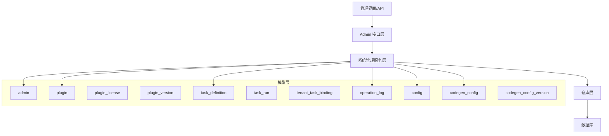
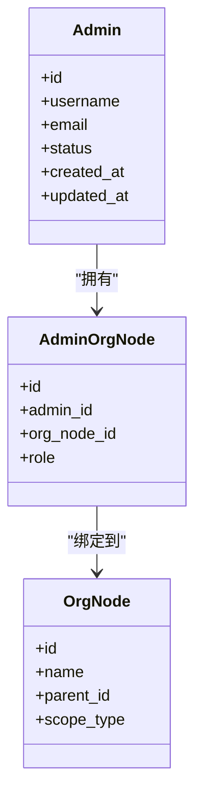
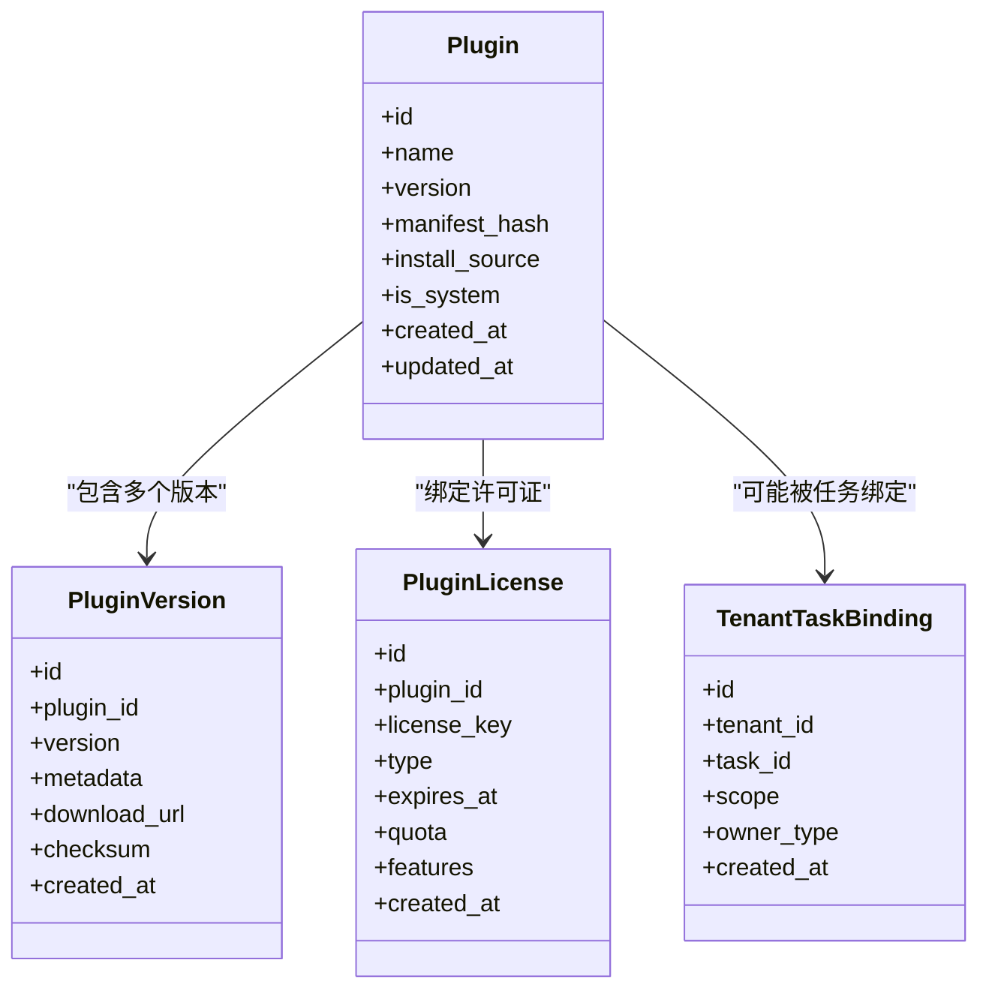
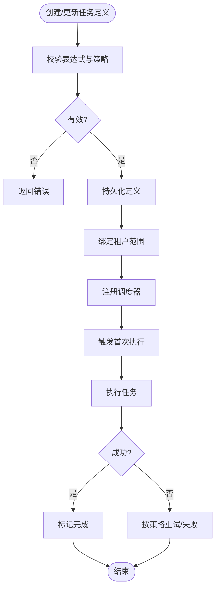
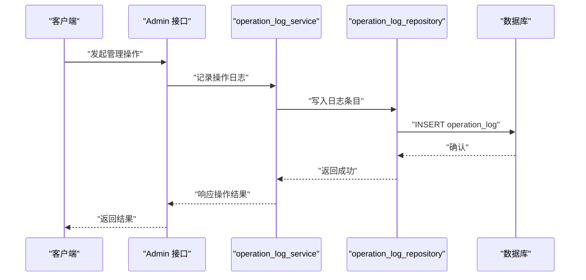
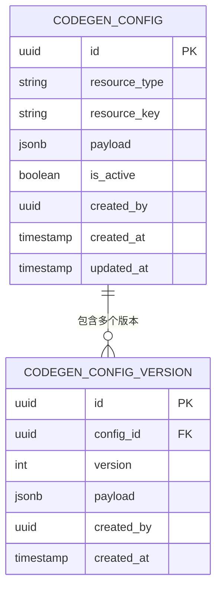
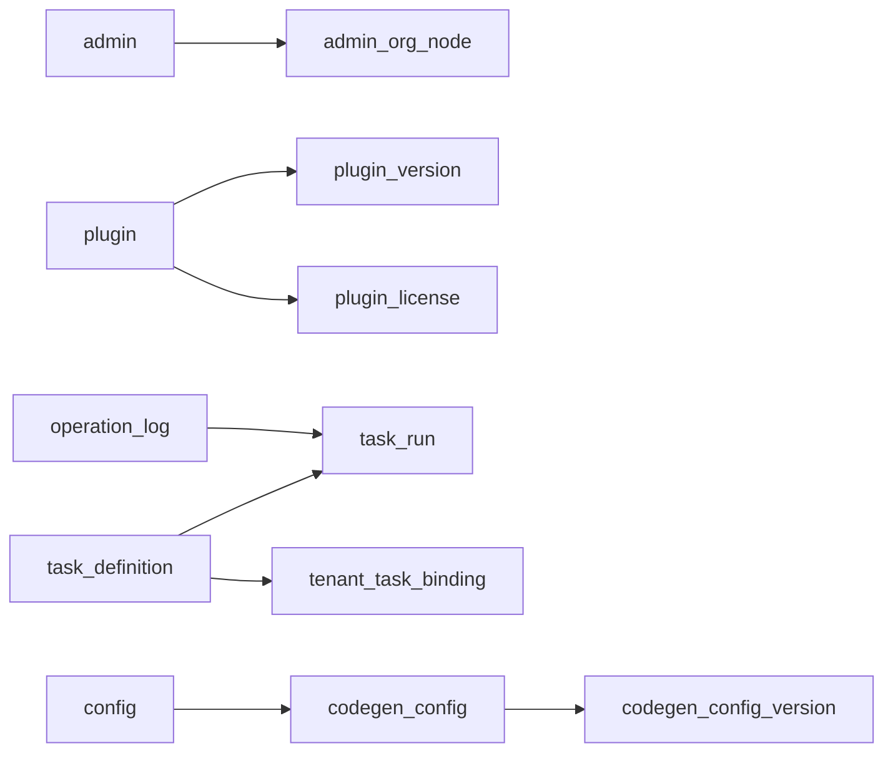

# 系统管理模型

<cite>
**本文引用的文件**
- [backend/app/models/system/admin.py](file://backend/app/models/system/admin.py)
- [backend/app/models/system/plugin.py](file://backend/app/models/system/plugin.py)
- [backend/app/models/system/plugin_license.py](file://backend/app/models/system/plugin_license.py)
- [backend/app/models/system/plugin_version.py](file://backend/app/models/system/plugin_version.py)
- [backend/app/models/system/task_definition.py](file://backend/app/models/system/task_definition.py)
- [backend/app/models/system/task_run.py](file://backend/app/models/system/task_run.py)
- [backend/app/models/system/tenant_task_binding.py](file://backend/app/models/system/tenant_task_binding.py)
- [backend/app/models/system/operation_log.py](file://backend/app/models/system/operation_log.py)
- [backend/app/models/system/config.py](file://backend/app/models/system/config.py)
- [backend/app/models/system/codegen_config.py](file://backend/app/models/system/codegen_config.py)
- [backend/app/models/system/codegen_config_version.py](file://backend/app/models/system/codegen_config_version.py)
- [backend/app/repositories/system/admin_repository.py](file://backend/app/repositories/system/admin_repository.py)
- [backend/app/repositories/system/plugin_repository.py](file://backend/app/repositories/system/plugin_repository.py)
- [backend/app/repositories/system/task_definition_repository.py](file://backend/app/repositories/system/task_definition_repository.py)
- [backend/app/repositories/system/task_run_repository.py](file://backend/app/repositories/system/task_run_repository.py)
- [backend/app/repositories/system/tenant_task_binding_repository.py](file://backend/app/repositories/system/tenant_task_binding_repository.py)
- [backend/app/repositories/system/operation_log_repository.py](file://backend/app/repositories/system/operation_log_repository.py)
- [backend/app/repositories/system/codegen_config_repository.py](file://backend/app/repositories/system/codegen_config_repository.py)
- [backend/app/repositories/system/codegen_config_version_repository.py](file://backend/app/repositories/system/codegen_config_version_repository.py)
- [backend/app/services/system/task_definition_service.py](file://backend/app/services/system/task_definition_service.py)
- [backend/app/services/system/task_manager_service.py](file://backend/app/services/system/task_manager_service.py)
- [backend/app/services/system/task_run_service.py](file://backend/app/services/system/task_run_service.py)
- [backend/app/services/system/operation_log_service.py](file://backend/app/services/system/operation_log_service.py)
- [backend/app/services/system/plugin_read_model_service.py](file://backend/app/services/system/plugin_read_model_service.py)
- [backend/app/services/system/plugin_install_preview_service.py](file://backend/app/services/system/plugin_install_preview_service.py)
- [backend/app/services/system/plugin_managed_agent_sync_service.py](file://backend/app/services/system/plugin_managed_agent_sync_service.py)
- [backend/app/services/system/codegen_service_parts/config_sync_mixin.py](file://backend/app/services/system/codegen_service_parts/config_sync_mixin.py)
- [backend/app/enums/task.py](file://backend/app/enums/task.py)
- [backend/app/enums/plugin.py](file://backend/app/enums/plugin.py)
- [backend/app/enums/config.py](file://backend/app/enums/config.py)
- [backend/app/enums/log.py](file://backend/app/enums/log.py)
- [backend/migrations/versions/20260120_c63b0c9f4a25_add_operation_log_table.py](file://backend/migrations/versions/20260120_c63b0c9f4a25_add_operation_log_table.py)
- [backend/migrations/versions/20260208_0009_add_task_logs_table.py](file://backend/migrations/versions/20260208_0009_add_task_logs_table.py)
- [backend/migrations/versions/20260213_add_plugins_tables.py](file://backend/migrations/versions/20260213_add_plugins_tables.py)
- [backend/migrations/versions/20260317_add_codegen_configs_table.py](file://backend/migrations/versions/20260317_add_codegen_configs_table.py)
- [backend/migrations/versions/20260325_0001_add_task_scheduling_foundation.py](file://backend/migrations/versions/20260325_0001_add_task_scheduling_foundation.py)
- [backend/migrations/versions/20260325_0002_task_scheduling_foundation.py](file://backend/migrations/versions/20260325_0002_task_scheduling_foundation.py)
- [backend/migrations/versions/20260325_0003_task_definition_operational_fields.py](file://backend/migrations/versions/20260325_0003_task_definition_operational_fields.py)
- [backend/migrations/versions/20260325_0004_backfill_task_definitions_from_periodic_tasks.py](file://backend/migrations/versions/20260325_0004_backfill_task_definitions_from_periodic_tasks.py)
- [backend/migrations/versions/20260325_0005_drop_legacy_task_tables.py](file://backend/migrations/versions/20260325_0005_drop_legacy_task_tables.py)
- [backend/migrations/versions/20260116_3f669a3f2342_add_system_config_tables.py](file://backend/migrations/versions/20260116_3f669a3f2342_add_system_config_tables.py)
</cite>

## 目录
1. [引言](#引言)
2. [项目结构](#项目结构)
3. [核心组件](#核心组件)
4. [架构总览](#架构总览)
5. [详细组件分析](#详细组件分析)
6. [依赖分析](#依赖分析)
7. [性能考量](#性能考量)
8. [故障排查指南](#故障排查指南)
9. [结论](#结论)
10. [附录](#附录)

## 引言
本文件聚焦系统管理功能的数据模型设计与实现，围绕以下核心模型展开：管理员模型（admin）、插件模型（plugin）、任务定义模型（task_definition）、操作日志模型（operation_log）、系统配置模型（config）以及代码生成配置模型（codegen_config）。文档将阐释各模型的字段设计、业务语义、状态流转、权限与访问控制、版本与许可证管理、任务调度与执行策略，并给出模型间交互关系与典型应用场景。

## 项目结构
系统管理相关模型主要位于后端应用的 system 模块下，配合枚举类型、仓库层（repository）、服务层（service）以及迁移脚本（migration），形成从数据到业务逻辑的完整闭环。

```mermaid
graph TB
subgraph "系统模型"
M_Admin["admin 模型"]
M_Plugin["plugin 模型"]
M_PluginLicense["plugin_license 模型"]
M_PluginVersion["plugin_version 模型"]
M_TaskDef["task_definition 模型"]
M_TaskRun["task_run 模型"]
M_TenantTaskBinding["tenant_task_binding 模型"]
M_OpLog["operation_log 模型"]
M_Config["config 模型"]
M_CodeGenCfg["codegen_config 模型"]
M_CodeGenVer["codegen_config_version 模型"]
end
subgraph "仓库层"
R_Admin["admin_repository"]
R_Plugin["plugin_repository"]
R_TaskDef["task_definition_repository"]
R_TaskRun["task_run_repository"]
R_TenantTask["tenant_task_binding_repository"]
R_OpLog["operation_log_repository"]
R_CodeGen["codegen_config_repository"]
R_CodeGenVer["codegen_config_version_repository"]
end
subgraph "服务层"
S_TaskDef["task_definition_service"]
S_TaskMgr["task_manager_service"]
S_TaskRun["task_run_service"]
S_OpLog["operation_log_service"]
S_PluginRead["plugin_read_model_service"]
S_PluginInstall["plugin_install_preview_service"]
S_PluginAgentSync["plugin_managed_agent_sync_service"]
S_CodeGenSync["config_sync_mixin"]
end
M_Admin --> R_Admin
M_Plugin --> R_Plugin
M_PluginLicense --> R_Plugin
M_PluginVersion --> R_Plugin
M_TaskDef --> R_TaskDef
M_TaskRun --> R_TaskRun
M_TenantTaskBinding --> R_TenantTask
M_OpLog --> R_OpLog
M_Config --> R_CodeGen
M_CodeGenCfg --> R_CodeGen
M_CodeGenVer --> R_CodeGenVer
R_Admin --> S_TaskMgr
R_Plugin --> S_PluginRead
R_Plugin --> S_PluginInstall
R_Plugin --> S_PluginAgentSync
R_TaskDef --> S_TaskDef
R_TaskRun --> S_TaskRun
R_OpLog --> S_OpLog
R_CodeGen --> S_CodeGenSync
```

图表来源
- [backend/app/models/system/admin.py](file://backend/app/models/system/admin.py)
- [backend/app/models/system/plugin.py](file://backend/app/models/system/plugin.py)
- [backend/app/models/system/plugin_license.py](file://backend/app/models/system/plugin_license.py)
- [backend/app/models/system/plugin_version.py](file://backend/app/models/system/plugin_version.py)
- [backend/app/models/system/task_definition.py](file://backend/app/models/system/task_definition.py)
- [backend/app/models/system/task_run.py](file://backend/app/models/system/task_run.py)
- [backend/app/models/system/tenant_task_binding.py](file://backend/app/models/system/tenant_task_binding.py)
- [backend/app/models/system/operation_log.py](file://backend/app/models/system/operation_log.py)
- [backend/app/models/system/config.py](file://backend/app/models/system/config.py)
- [backend/app/models/system/codegen_config.py](file://backend/app/models/system/codegen_config.py)
- [backend/app/models/system/codegen_config_version.py](file://backend/app/models/system/codegen_config_version.py)
- [backend/app/repositories/system/admin_repository.py](file://backend/app/repositories/system/admin_repository.py)
- [backend/app/repositories/system/plugin_repository.py](file://backend/app/repositories/system/plugin_repository.py)
- [backend/app/repositories/system/task_definition_repository.py](file://backend/app/repositories/system/task_definition_repository.py)
- [backend/app/repositories/system/task_run_repository.py](file://backend/app/repositories/system/task_run_repository.py)
- [backend/app/repositories/system/tenant_task_binding_repository.py](file://backend/app/repositories/system/tenant_task_binding_repository.py)
- [backend/app/repositories/system/operation_log_repository.py](file://backend/app/repositories/system/operation_log_repository.py)
- [backend/app/repositories/system/codegen_config_repository.py](file://backend/app/repositories/system/codegen_config_repository.py)
- [backend/app/repositories/system/codegen_config_version_repository.py](file://backend/app/repositories/system/codegen_config_version_repository.py)
- [backend/app/services/system/task_definition_service.py](file://backend/app/services/system/task_definition_service.py)
- [backend/app/services/system/task_manager_service.py](file://backend/app/services/system/task_manager_service.py)
- [backend/app/services/system/task_run_service.py](file://backend/app/services/system/task_run_service.py)
- [backend/app/services/system/operation_log_service.py](file://backend/app/services/system/operation_log_service.py)
- [backend/app/services/system/plugin_read_model_service.py](file://backend/app/services/system/plugin_read_model_service.py)
- [backend/app/services/system/plugin_install_preview_service.py](file://backend/app/services/system/plugin_install_preview_service.py)
- [backend/app/services/system/plugin_managed_agent_sync_service.py](file://backend/app/services/system/plugin_managed_agent_sync_service.py)
- [backend/app/services/system/codegen_service_parts/config_sync_mixin.py](file://backend/app/services/system/codegen_service_parts/config_sync_mixin.py)

章节来源
- [backend/app/models/system/admin.py](file://backend/app/models/system/admin.py)
- [backend/app/models/system/plugin.py](file://backend/app/models/system/plugin.py)
- [backend/app/models/system/task_definition.py](file://backend/app/models/system/task_definition.py)
- [backend/app/models/system/operation_log.py](file://backend/app/models/system/operation_log.py)
- [backend/app/models/system/config.py](file://backend/app/models/system/config.py)
- [backend/app/models/system/codegen_config.py](file://backend/app/models/system/codegen_config.py)
- [backend/app/repositories/system/admin_repository.py](file://backend/app/repositories/system/admin_repository.py)
- [backend/app/repositories/system/plugin_repository.py](file://backend/app/repositories/system/plugin_repository.py)
- [backend/app/repositories/system/task_definition_repository.py](file://backend/app/repositories/system/task_definition_repository.py)
- [backend/app/repositories/system/operation_log_repository.py](file://backend/app/repositories/system/operation_log_repository.py)
- [backend/app/repositories/system/codegen_config_repository.py](file://backend/app/repositories/system/codegen_config_repository.py)

## 核心组件
本节概述各系统管理模型的核心职责与关键字段设计思路，便于快速建立整体认知。

- 管理员模型（admin）
  - 职责：承载系统级管理员身份、认证与授权信息；支持组织节点绑定与权限继承。
  - 关键点：与组织节点模型关联，支持层级化的权限域；字段包含标识、认证凭据、状态与审计字段等。
  
- 插件模型（plugin）
  - 职责：描述插件元数据、版本管理、许可证控制与市场信息。
  - 关键点：包含插件标识、名称、版本链路、许可证约束、安装源、作用域与租户绑定等。
  
- 任务定义模型（task_definition）
  - 职责：统一的任务调度与执行策略定义，替代历史周期性任务表。
  - 关键点：包含任务表达式、平台范围、执行策略、绑定关系与运行时状态。
  
- 操作日志模型（operation_log）
  - 职责：记录系统操作行为，满足审计与合规要求。
  - 关键点：包含操作主体、动作、资源、结果、时间戳与追踪标识等。
  
- 系统配置模型（config）
  - 职责：集中管理可动态更新的系统配置项，支持安全存储与版本化。
  - 关键点：区分系统级与租户级配置，支持敏感字段加密存储与变更追踪。
  
- 代码生成配置模型（codegen_config）
  - 职责：管理代码生成模板与参数的配置集合，支持版本化与同步。
  - 关键点：配置资源唯一性约束、版本回滚与一致性校验。

章节来源
- [backend/app/models/system/admin.py](file://backend/app/models/system/admin.py)
- [backend/app/models/system/plugin.py](file://backend/app/models/system/plugin.py)
- [backend/app/models/system/task_definition.py](file://backend/app/models/system/task_definition.py)
- [backend/app/models/system/operation_log.py](file://backend/app/models/system/operation_log.py)
- [backend/app/models/system/config.py](file://backend/app/models/system/config.py)
- [backend/app/models/system/codegen_config.py](file://backend/app/models/system/codegen_config.py)

## 架构总览
系统管理模型通过仓库层抽象数据库访问，服务层封装业务规则与流程编排，枚举类型统一状态与策略常量，迁移脚本确保数据库结构演进的一致性与可追溯性。

图表来源
- [backend/app/services/system/task_definition_service.py](file://backend/app/services/system/task_definition_service.py)
- [backend/app/services/system/task_manager_service.py](file://backend/app/services/system/task_manager_service.py)
- [backend/app/services/system/operation_log_service.py](file://backend/app/services/system/operation_log_service.py)
- [backend/app/services/system/plugin_read_model_service.py](file://backend/app/services/system/plugin_read_model_service.py)
- [backend/app/services/system/plugin_install_preview_service.py](file://backend/app/services/system/plugin_install_preview_service.py)
- [backend/app/services/system/plugin_managed_agent_sync_service.py](file://backend/app/services/system/plugin_managed_agent_sync_service.py)
- [backend/app/services/system/codegen_service_parts/config_sync_mixin.py](file://backend/app/services/system/codegen_service_parts/config_sync_mixin.py)
- [backend/app/repositories/system/admin_repository.py](file://backend/app/repositories/system/admin_repository.py)
- [backend/app/repositories/system/plugin_repository.py](file://backend/app/repositories/system/plugin_repository.py)
- [backend/app/repositories/system/task_definition_repository.py](file://backend/app/repositories/system/task_definition_repository.py)
- [backend/app/repositories/system/operation_log_repository.py](file://backend/app/repositories/system/operation_log_repository.py)
- [backend/app/repositories/system/codegen_config_repository.py](file://backend/app/repositories/system/codegen_config_repository.py)

## 详细组件分析

### 管理员模型（admin）
- 设计要点
  - 身份与认证：管理员实体包含登录标识、认证凭据与状态字段，支持多租户场景下的身份隔离。
  - 组织与权限：通过组织节点模型实现权限域的层级化继承，支持跨组织的权限映射与作用域限制。
  - 审计与追踪：内置创建/更新时间与审计字段，便于合规与审计追踪。
- 访问控制机制
  - 基于角色与权限的 RBAC 实现，结合菜单与接口级权限控制，确保最小权限原则。
  - 支持租户维度的角色绑定与权限覆盖，避免越权访问。
- 复杂度与性能
  - 查询复杂度取决于组织树深度与权限缓存命中率；建议对常用查询建立索引与缓存。
- 错误处理
  - 登录失败次数限制、账户锁定与解锁流程；异常登录检测与通知。

图表来源
- [backend/app/models/system/admin.py](file://backend/app/models/system/admin.py)
- [backend/app/models/system/admin_org_node.py](file://backend/app/models/system/admin_org_node.py)
- [backend/app/models/org/admin_org_node.py](file://backend/app/models/org/admin_org_node.py)

章节来源
- [backend/app/models/system/admin.py](file://backend/app/models/system/admin.py)
- [backend/app/models/system/admin_org_node.py](file://backend/app/models/system/admin_org_node.py)
- [backend/app/repositories/system/admin_repository.py](file://backend/app/repositories/system/admin_repository.py)

### 插件模型（plugin）
- 结构与元数据
  - 元数据：名称、描述、版本、入口、图标、作者与发布信息。
  - 版本管理：版本号、兼容性矩阵、发布渠道与下载地址。
  - 许可证控制：许可证类型、有效期、使用配额与到期提醒。
  - 市场与安装：市场分类、可见性、安装源与租户绑定。
- 生命周期与运行时
  - 生命周期编排：安装、启用、禁用、卸载与迁移；支持依赖解析与冲突检测。
  - 运行时安全：沙箱隔离、API 调用审计、资产解析与前端合约校验。
- 许可证与配额
  - 许可证验证：激活码校验、过期检查、试用期控制与续费提醒。
  - 配额与用量：调用次数、并发限制与超限告警。
- 扩展性与生态
  - 插件槽位与事件钩子：支持菜单、页面与 API 的扩展点。
  - 包装与签名：包体完整性校验与发布者签名。

图表来源
- [backend/app/models/system/plugin.py](file://backend/app/models/system/plugin.py)
- [backend/app/models/system/plugin_version.py](file://backend/app/models/system/plugin_version.py)
- [backend/app/models/system/plugin_license.py](file://backend/app/models/system/plugin_license.py)
- [backend/app/models/system/tenant_task_binding.py](file://backend/app/models/system/tenant_task_binding.py)

章节来源
- [backend/app/models/system/plugin.py](file://backend/app/models/system/plugin.py)
- [backend/app/models/system/plugin_version.py](file://backend/app/models/system/plugin_version.py)
- [backend/app/models/system/plugin_license.py](file://backend/app/models/system/plugin_license.py)
- [backend/app/repositories/system/plugin_repository.py](file://backend/app/repositories/system/plugin_repository.py)
- [backend/app/services/system/plugin_read_model_service.py](file://backend/app/services/system/plugin_read_model_service.py)
- [backend/app/services/system/plugin_install_preview_service.py](file://backend/app/services/system/plugin_install_preview_service.py)
- [backend/app/services/system/plugin_managed_agent_sync_service.py](file://backend/app/services/system/plugin_managed_agent_sync_service.py)

### 任务定义模型（task_definition）
- 任务调度与执行策略
  - 表达式与频率：支持 Cron 表达式与固定间隔；平台范围与租户绑定。
  - 执行策略：重试策略、并发控制、超时与失败处理；执行信任策略与决策记录。
  - 状态管理：待调度、运行中、完成、失败、暂停与取消等状态机。
- 数据模型与关联
  - 任务定义：表达式、目标资源、执行策略与平台范围。
  - 任务运行：单次执行的开始/结束时间、输入输出、错误信息与追踪 ID。
  - 租户绑定：按租户维度启用/禁用与范围控制。
- 迁移与演进
  - 从周期性任务表迁移到统一的任务定义表，保留历史数据并清理冗余表。

图表来源
- [backend/app/models/system/task_definition.py](file://backend/app/models/system/task_definition.py)
- [backend/app/models/system/task_run.py](file://backend/app/models/system/task_run.py)
- [backend/app/models/system/tenant_task_binding.py](file://backend/app/models/system/tenant_task_binding.py)
- [backend/app/enums/task.py](file://backend/app/enums/task.py)
- [backend/migrations/versions/20260325_0001_add_task_scheduling_foundation.py](file://backend/migrations/versions/20260325_0001_add_task_scheduling_foundation.py)
- [backend/migrations/versions/20260325_0002_task_scheduling_foundation.py](file://backend/migrations/versions/20260325_0002_task_scheduling_foundation.py)
- [backend/migrations/versions/20260325_0003_task_definition_operational_fields.py](file://backend/migrations/versions/20260325_0003_task_definition_operational_fields.py)
- [backend/migrations/versions/20260325_0004_backfill_task_definitions_from_periodic_tasks.py](file://backend/migrations/versions/20260325_0004_backfill_task_definitions_from_periodic_tasks.py)
- [backend/migrations/versions/20260325_0005_drop_legacy_task_tables.py](file://backend/migrations/versions/20260325_0005_drop_legacy_task_tables.py)

章节来源
- [backend/app/models/system/task_definition.py](file://backend/app/models/system/task_definition.py)
- [backend/app/models/system/task_run.py](file://backend/app/models/system/task_run.py)
- [backend/app/models/system/tenant_task_binding.py](file://backend/app/models/system/tenant_task_binding.py)
- [backend/app/repositories/system/task_definition_repository.py](file://backend/app/repositories/system/task_definition_repository.py)
- [backend/app/repositories/system/task_run_repository.py](file://backend/app/repositories/system/task_run_repository.py)
- [backend/app/repositories/system/tenant_task_binding_repository.py](file://backend/app/repositories/system/tenant_task_binding_repository.py)
- [backend/app/services/system/task_definition_service.py](file://backend/app/services/system/task_definition_service.py)
- [backend/app/services/system/task_manager_service.py](file://backend/app/services/system/task_manager_service.py)
- [backend/app/services/system/task_run_service.py](file://backend/app/services/system/task_run_service.py)

### 操作日志模型（operation_log）
- 日志记录与审计
  - 字段设计：操作主体、动作类型、资源标识、请求上下文、结果与时间戳；支持追踪 ID 与昵称扩展。
  - 合规要求：日志保留策略、不可篡改性与可检索性；支持按时间、用户、动作类型过滤。
- 服务与仓库
  - 服务层负责写入、聚合与导出；仓库层提供查询与分页能力。
- 迁移演进
  - 逐步扩展动作列长度与新增字段（如昵称、追踪 ID），保证历史兼容。

图表来源
- [backend/app/models/system/operation_log.py](file://backend/app/models/system/operation_log.py)
- [backend/app/services/system/operation_log_service.py](file://backend/app/services/system/operation_log_service.py)
- [backend/app/repositories/system/operation_log_repository.py](file://backend/app/repositories/system/operation_log_repository.py)
- [backend/migrations/versions/20260120_c63b0c9f4a25_add_operation_log_table.py](file://backend/migrations/versions/20260120_c63b0c9f4a25_add_operation_log_table.py)
- [backend/migrations/versions/20260207_676cbd976326_expand_operation_logs_action_column.py](file://backend/migrations/versions/20260207_676cbd976326_expand_operation_logs_action_column.py)
- [backend/migrations/versions/20260318_0003_add_trace_id_to_operation_logs.py](file://backend/migrations/versions/20260318_0003_add_trace_id_to_operation_logs.py)

章节来源
- [backend/app/models/system/operation_log.py](file://backend/app/models/system/operation_log.py)
- [backend/app/services/system/operation_log_service.py](file://backend/app/services/system/operation_log_service.py)
- [backend/app/repositories/system/operation_log_repository.py](file://backend/app/repositories/system/operation_log_repository.py)

### 系统配置模型（config）
- 配置管理
  - 分类与作用域：系统级与租户级配置；敏感字段加密存储与只读保护。
  - 动态更新：支持热更新与版本化回滚；变更审计与影响评估。
- 安全存储
  - 加密与脱敏：敏感值加密保存，传输与展示脱敏；访问控制与最小披露。
- 与代码生成配置的关系
  - 两者均支持版本化与同步，但代码生成配置更强调模板与参数的可组合性与一致性。

章节来源
- [backend/app/models/system/config.py](file://backend/app/models/system/config.py)
- [backend/app/enums/config.py](file://backend/app/enums/config.py)
- [backend/migrations/versions/20260116_3f669a3f2342_add_system_config_tables.py](file://backend/migrations/versions/20260116_3f669a3f2342_add_system_config_tables.py)

### 代码生成配置模型（codegen_config）
- 设计原理
  - 资源唯一性：同一资源在同一作用域内唯一，避免重复生成。
  - 版本化管理：配置版本独立维护，支持回滚与一致性校验。
  - 扩展性：通过配置项与模板组合，支持多语言、多框架的生成策略。
- 与系统配置协同
  - 代码生成配置作为系统配置的一种特化类型，共享版本化与同步机制。

图表来源
- [backend/app/models/system/codegen_config.py](file://backend/app/models/system/codegen_config.py)
- [backend/app/models/system/codegen_config_version.py](file://backend/app/models/system/codegen_config_version.py)
- [backend/migrations/versions/20260317_add_codegen_configs_table.py](file://backend/migrations/versions/20260317_add_codegen_configs_table.py)

章节来源
- [backend/app/models/system/codegen_config.py](file://backend/app/models/system/codegen_config.py)
- [backend/app/models/system/codegen_config_version.py](file://backend/app/models/system/codegen_config_version.py)
- [backend/app/repositories/system/codegen_config_repository.py](file://backend/app/repositories/system/codegen_config_repository.py)
- [backend/app/repositories/system/codegen_config_version_repository.py](file://backend/app/repositories/system/codegen_config_version_repository.py)
- [backend/app/services/system/codegen_service_parts/config_sync_mixin.py](file://backend/app/services/system/codegen_service_parts/config_sync_mixin.py)

## 依赖分析
- 组件耦合
  - 管理员模型与组织节点模型存在强耦合，权限域继承依赖组织树结构。
  - 插件模型与任务定义模型通过租户绑定实现跨模块协作。
  - 操作日志模型贯穿所有管理操作，形成统一的审计基线。
- 外部依赖
  - 数据库迁移脚本确保模型演进的可追溯性与一致性。
  - 枚举类型统一状态与策略常量，降低硬编码风险。
- 循环依赖
  - 当前设计避免了模型间的循环导入；服务层承担协调职责。

图表来源
- [backend/app/models/system/admin.py](file://backend/app/models/system/admin.py)
- [backend/app/models/system/plugin.py](file://backend/app/models/system/plugin.py)
- [backend/app/models/system/plugin_version.py](file://backend/app/models/system/plugin_version.py)
- [backend/app/models/system/plugin_license.py](file://backend/app/models/system/plugin_license.py)
- [backend/app/models/system/task_definition.py](file://backend/app/models/system/task_definition.py)
- [backend/app/models/system/task_run.py](file://backend/app/models/system/task_run.py)
- [backend/app/models/system/tenant_task_binding.py](file://backend/app/models/system/tenant_task_binding.py)
- [backend/app/models/system/operation_log.py](file://backend/app/models/system/operation_log.py)
- [backend/app/models/system/config.py](file://backend/app/models/system/config.py)
- [backend/app/models/system/codegen_config.py](file://backend/app/models/system/codegen_config.py)
- [backend/app/models/system/codegen_config_version.py](file://backend/app/models/system/codegen_config_version.py)

章节来源
- [backend/app/enums/task.py](file://backend/app/enums/task.py)
- [backend/app/enums/plugin.py](file://backend/app/enums/plugin.py)
- [backend/app/enums/config.py](file://backend/app/enums/config.py)
- [backend/app/enums/log.py](file://backend/app/enums/log.py)

## 性能考量
- 查询优化
  - 对常用过滤条件（如租户、状态、时间范围）建立复合索引；对日志与任务运行表进行分区或归档。
- 写入吞吐
  - 操作日志采用批量写入与异步落库；任务运行记录按时间窗口归档减少热点。
- 缓存策略
  - 权限与配置缓存结合 TTL 与失效策略；插件清单与许可证状态缓存以降低查询压力。
- 并发控制
  - 任务调度器与插件生命周期管理采用分布式锁与幂等设计，避免重复执行。

## 故障排查指南
- 管理员登录失败
  - 检查账户状态与锁定阈值；核对认证凭据与组织权限是否生效。
- 插件安装/启用异常
  - 查看安装预览与依赖解析结果；核对许可证有效期与配额；检查运行时沙箱与资产解析日志。
- 任务未执行或频繁失败
  - 检查任务表达式与平台范围；查看任务运行记录与错误堆栈；确认重试策略与并发限制。
- 操作日志缺失或不完整
  - 核对服务写入路径与数据库连接；检查迁移脚本是否完整执行；确认动作列长度与字段扩展。
- 配置更新未生效
  - 检查版本号与回滚记录；确认热更新机制与缓存刷新；验证敏感字段加密与解密流程。

章节来源
- [backend/app/services/system/operation_log_service.py](file://backend/app/services/system/operation_log_service.py)
- [backend/app/services/system/plugin_install_preview_service.py](file://backend/app/services/system/plugin_install_preview_service.py)
- [backend/app/services/system/task_run_service.py](file://backend/app/services/system/task_run_service.py)
- [backend/app/repositories/system/operation_log_repository.py](file://backend/app/repositories/system/operation_log_repository.py)

## 结论
系统管理模型通过清晰的数据结构与严格的流程控制，实现了管理员权限、插件生命周期、任务调度、操作审计与配置管理的统一治理。模型间通过仓库与服务层解耦，配合迁移脚本与枚举常量，确保了系统的可维护性、可扩展性与合规性。建议在生产环境中持续完善索引与缓存策略，强化异常监控与自动恢复能力。

## 附录
- 迁移脚本要点
  - 操作日志表：初始化表结构与字段扩展。
  - 任务调度基础：引入任务定义表与租户绑定。
  - 插件表：新增插件、版本与许可证相关表。
  - 代码生成配置：引入配置与版本表，支持资源唯一性约束。
- 最佳实践
  - 使用枚举统一状态与策略，避免魔法值。
  - 对敏感字段进行加密存储与最小化暴露。
  - 对高频查询建立索引与缓存，定期评估性能指标。