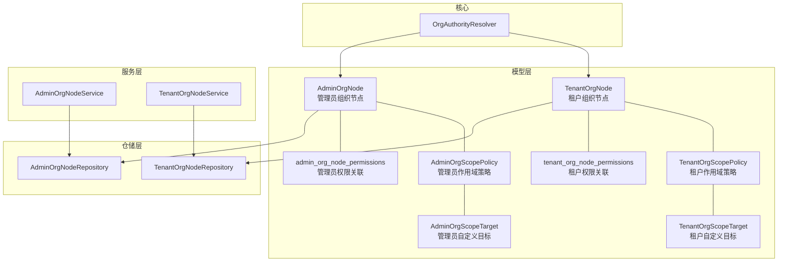
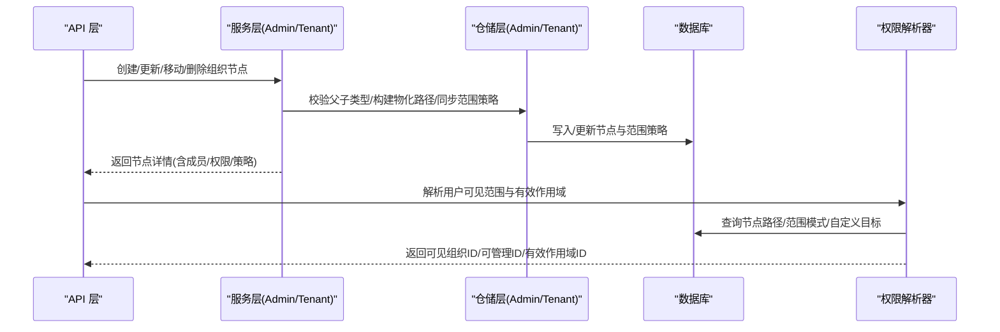
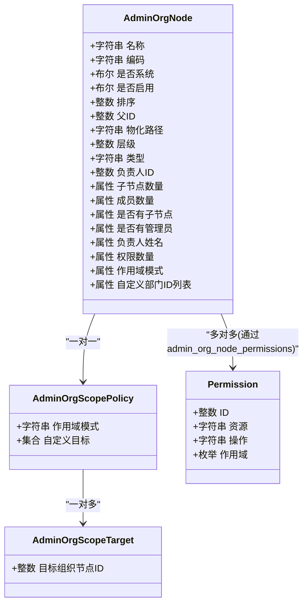
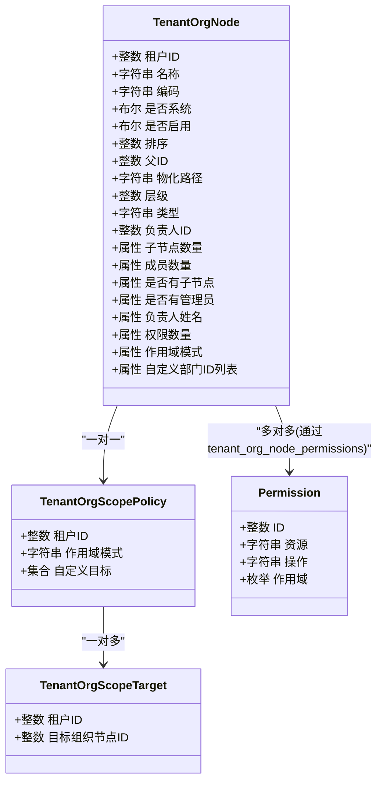
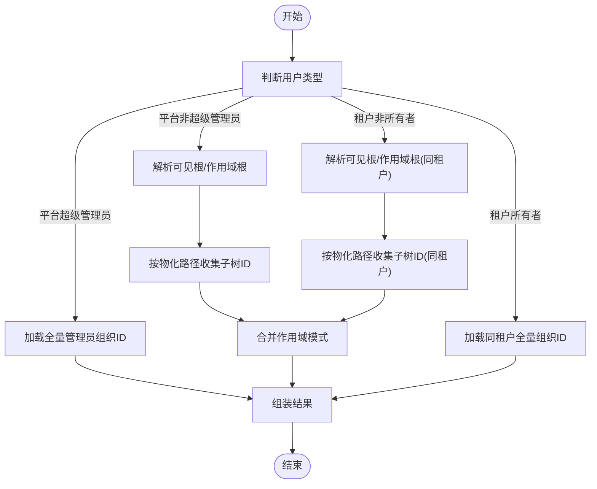
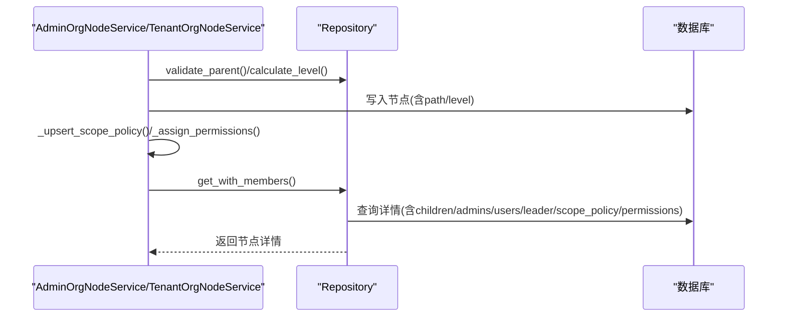
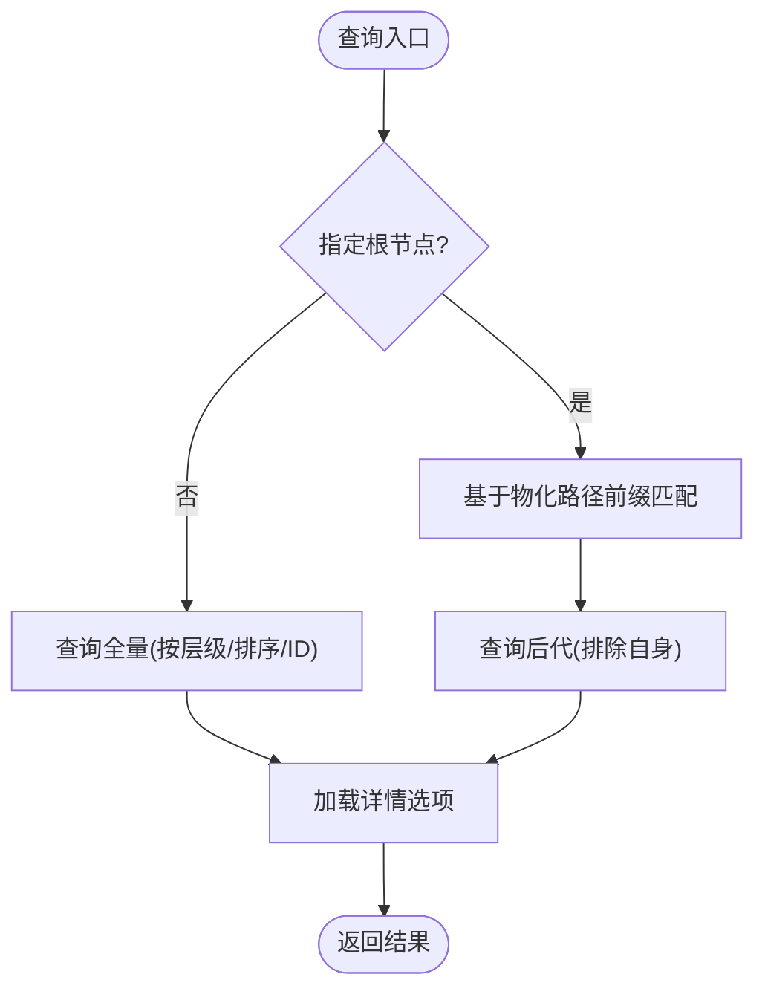
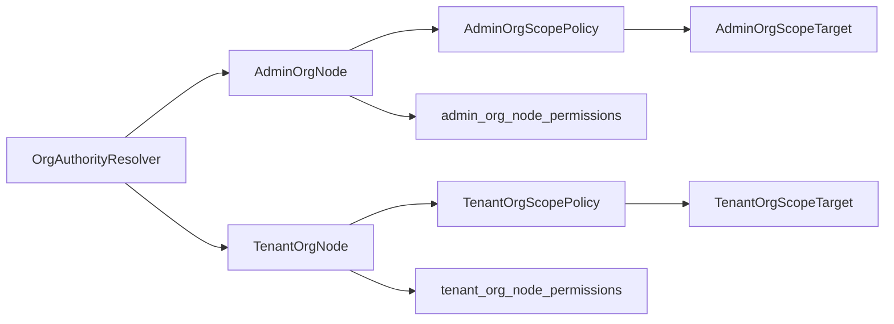

# 组织架构模型

<cite>
**本文引用的文件**
- [backend/app/models/org/admin_org_node.py](file://backend/app/models/org/admin_org_node.py)
- [backend/app/models/org/tenant_org_node.py](file://backend/app/models/org/tenant_org_node.py)
- [backend/app/core/org_authority.py](file://backend/app/core/org_authority.py)
- [backend/app/services/system/admin_org_node_service.py](file://backend/app/services/system/admin_org_node_service.py)
- [backend/app/services/tenant/tenant_org_node_service.py](file://backend/app/services/tenant/tenant_org_node_service.py)
- [backend/app/repositories/system/admin_org_node_repository.py](file://backend/app/repositories/system/admin_org_node_repository.py)
- [backend/app/repositories/tenant/tenant_org_node_repository.py](file://backend/app/repositories/tenant/tenant_org_node_repository.py)
- [backend/migrations/versions/20260325_org_authority_rebuild.py](file://backend/migrations/versions/20260325_org_authority_rebuild.py)
- [backend/migrations/versions/20260325_org_node_perm.py](file://backend/migrations/versions/20260325_org_node_perm.py)
- [backend/migrations/versions/20260404_0016_add_tenant_org_node_permissions.py](file://backend/migrations/versions/20260404_0016_add_tenant_org_node_permissions.py)
</cite>

## 目录
1. [引言](#引言)
2. [项目结构](#项目结构)
3. [核心组件](#核心组件)
4. [架构总览](#架构总览)
5. [详细组件分析](#详细组件分析)
6. [依赖分析](#依赖分析)
7. [性能考量](#性能考量)
8. [故障排查指南](#故障排查指南)
9. [结论](#结论)
10. [附录](#附录)

## 引言
本文件系统化梳理并文档化组织架构模型，重点覆盖两大核心模型：
- 管理员组织节点模型（admin_org_node）：用于平台管理后台的组织层级、节点属性与权限继承机制。
- 租户组织节点模型（tenant_org_node）：用于多租户场景下每个租户的独立组织结构、部门管理与人员分配策略。

同时，文档阐述树形结构设计（物化路径）、节点关系维护、查询优化策略；解释组织权限控制的实现原理（权限传播、作用域限制、继承规则）；说明组织架构与权限系统的集成方式与数据一致性保障；并给出扩展性设计、性能优化建议与实际应用场景。

## 项目结构
组织架构相关代码主要分布在以下层次：
- 模型层：定义实体、关系与权限映射表
- 仓储层：封装数据库访问、树形查询与分页检索
- 服务层：封装业务流程、权限校验与范围策略同步
- 核心模块：组织权限解析器，统一计算可见范围与有效作用域
- 迁移脚本：建表、索引与权限关联表的演进

**图表来源**
- [backend/app/models/org/admin_org_node.py:16-31](file://backend/app/models/org/admin_org_node.py#L16-L31)
- [backend/app/models/org/tenant_org_node.py:16-31](file://backend/app/models/org/tenant_org_node.py#L16-L31)
- [backend/app/repositories/system/admin_org_node_repository.py:19-26](file://backend/app/repositories/system/admin_org_node_repository.py#L19-L26)
- [backend/app/repositories/tenant/tenant_org_node_repository.py:15-24](file://backend/app/repositories/tenant/tenant_org_node_repository.py#L15-L24)
- [backend/app/services/system/admin_org_node_service.py:31-38](file://backend/app/services/system/admin_org_node_service.py#L31-L38)
- [backend/app/services/tenant/tenant_org_node_service.py:33-40](file://backend/app/services/tenant/tenant_org_node_service.py#L33-L40)
- [backend/app/core/org_authority.py:30-35](file://backend/app/core/org_authority.py#L30-L35)

**章节来源**
- [backend/app/models/org/admin_org_node.py:1-326](file://backend/app/models/org/admin_org_node.py#L1-L326)
- [backend/app/models/org/tenant_org_node.py:1-344](file://backend/app/models/org/tenant_org_node.py#L1-L344)
- [backend/app/core/org_authority.py:1-347](file://backend/app/core/org_authority.py#L1-L347)

## 核心组件
- 管理员组织节点模型（AdminOrgNode）
  - 属性：名称、编码、描述、是否系统节点、是否启用、排序、父子关系、物化路径、层级、类型、负责人、成员集合、范围策略、直接权限集合
  - 关系：父子自引用、负责人、管理员成员、子节点、范围策略与目标、权限关联
  - 特性：支持树形选择器配置、排序、过滤、物化路径加速后代查询
- 租户组织节点模型（TenantOrgNode）
  - 属性：名称、编码、描述、是否系统节点、是否启用、排序、父子关系、物化路径、层级、类型、负责人、管理员与普通用户成员、范围策略、直接权限集合
  - 关系：父子自引用、负责人、管理员/用户成员、子节点、范围策略与目标、权限关联
  - 特性：与租户强绑定，支持成员计数、权限计数、范围模式与自定义目标
- 组织权限解析器（OrgAuthorityResolver）
  - 功能：根据用户角色与职责，解析其可见组织树、可管理范围、作用域根节点、有效作用域集合与主组织节点
  - 范围模式：本人仅、部门仅、部门及子树、全部、自定义
- 服务层
  - AdminOrgNodeService/TenantOrgNodeService：封装节点创建/更新/移动/删除、成员管理、权限分配、范围策略同步、树形查询等
- 仓储层
  - AdminOrgNodeRepository/TenantOrgNodeRepository：封装树形查询（祖先/后代）、成员查询、树构建、分页与细节加载

**章节来源**
- [backend/app/models/org/admin_org_node.py:34-165](file://backend/app/models/org/admin_org_node.py#L34-L165)
- [backend/app/models/org/tenant_org_node.py:34-179](file://backend/app/models/org/tenant_org_node.py#L34-L179)
- [backend/app/core/org_authority.py:30-347](file://backend/app/core/org_authority.py#L30-L347)
- [backend/app/services/system/admin_org_node_service.py:31-601](file://backend/app/services/system/admin_org_node_service.py#L31-L601)
- [backend/app/services/tenant/tenant_org_node_service.py:33-657](file://backend/app/services/tenant/tenant_org_node_service.py#L33-L657)
- [backend/app/repositories/system/admin_org_node_repository.py:19-266](file://backend/app/repositories/system/admin_org_node_repository.py#L19-L266)
- [backend/app/repositories/tenant/tenant_org_node_repository.py:15-244](file://backend/app/repositories/tenant/tenant_org_node_repository.py#L15-L244)

## 架构总览
组织架构采用“模型-仓储-服务-核心解析”的分层设计，结合物化路径与范围策略实现高效树形查询与灵活的作用域控制。

**图表来源**
- [backend/app/services/system/admin_org_node_service.py:166-290](file://backend/app/services/system/admin_org_node_service.py#L166-L290)
- [backend/app/services/tenant/tenant_org_node_service.py:197-321](file://backend/app/services/tenant/tenant_org_node_service.py#L197-L321)
- [backend/app/core/org_authority.py:36-78](file://backend/app/core/org_authority.py#L36-L78)
- [backend/app/repositories/system/admin_org_node_repository.py:133-170](file://backend/app/repositories/system/admin_org_node_repository.py#L133-L170)
- [backend/app/repositories/tenant/tenant_org_node_repository.py:15-60](file://backend/app/repositories/tenant/tenant_org_node_repository.py#L15-L60)

## 详细组件分析

### 管理员组织节点模型（AdminOrgNode）
- 数据模型
  - 表名与字段：包含名称、编码、是否系统、是否启用、排序、父ID、物化路径、层级、类型、负责人、允许成员挂载等
  - 关系映射：父子自引用、负责人、管理员成员、子节点、范围策略、权限关联
  - 权限关联表：admin_org_node_permissions（节点-权限多对多）
- 属性与派生信息
  - children_count/member_count/has_children/has_admins/leader_name/permissions_count/data_scope/custom_dept_ids/scope_mode
- 作用域策略
  - AdminOrgScopePolicy：每节点唯一策略，记录scope_mode与自定义目标
  - AdminOrgScopeTarget：自定义目标集合，指向其他组织节点ID
- 删除约束
  - 对父节点与管理员成员挂载进行阻断式删除保护

**图表来源**
- [backend/app/models/org/admin_org_node.py:34-165](file://backend/app/models/org/admin_org_node.py#L34-L165)
- [backend/app/models/org/admin_org_node.py:255-313](file://backend/app/models/org/admin_org_node.py#L255-L313)

**章节来源**
- [backend/app/models/org/admin_org_node.py:16-165](file://backend/app/models/org/admin_org_node.py#L16-L165)

### 租户组织节点模型（TenantOrgNode）
- 数据模型
  - 表名与字段：与管理员模型类似，但增加tenant_id，并与租户内管理员/用户成员关联
  - 关系映射：父子自引用、负责人、管理员/用户成员、子节点、范围策略、权限关联
  - 权限关联表：tenant_org_node_permissions（节点-权限多对多）
- 属性与派生信息
  - member_count（管理员+用户）、leader_name、permissions_count、scope_mode、custom_org_node_ids
- 作用域策略
  - TenantOrgScopePolicy：每节点唯一策略，记录scope_mode与自定义目标
  - TenantOrgScopeTarget：自定义目标集合，限定在同一租户内
- 删除约束
  - 对父节点、管理员、普通用户成员挂载进行阻断式删除保护

**图表来源**
- [backend/app/models/org/tenant_org_node.py:34-179](file://backend/app/models/org/tenant_org_node.py#L34-L179)
- [backend/app/models/org/tenant_org_node.py:272-329](file://backend/app/models/org/tenant_org_node.py#L272-L329)

**章节来源**
- [backend/app/models/org/tenant_org_node.py:16-179](file://backend/app/models/org/tenant_org_node.py#L16-L179)

### 组织权限解析器（OrgAuthorityResolver）
- 用户类型与解析逻辑
  - 平台管理员：超级管理员返回全量可见与可管理；否则基于其作为负责人或所在节点解析可见/可管理范围
  - 租户管理员：所有者返回全量；否则基于其作为负责人或所在节点解析可见/可管理范围
  - 租户普通用户：仅本人所在节点
- 作用域模式合并
  - SELF_ONLY/DEPT_ONLY/DEPT_AND_CHILDREN/ALL/CUSTOM，多根节点时按模式集进行合并
- 范围计算流程
  - 收集可见根节点与作用域根节点
  - 基于物化路径收集子树ID
  - 合并自定义目标ID
  - 返回可见组织ID、可管理组织ID、作用域根ID、有效作用域ID、主组织ID、自定义ID列表

**图表来源**
- [backend/app/core/org_authority.py:36-190](file://backend/app/core/org_authority.py#L36-L190)
- [backend/app/core/org_authority.py:192-347](file://backend/app/core/org_authority.py#L192-L347)

**章节来源**
- [backend/app/core/org_authority.py:19-347](file://backend/app/core/org_authority.py#L19-L347)

### 服务层：节点创建/更新/移动与成员管理
- 管理后台服务（AdminOrgNodeService）
  - 节点创建：生成编码、校验父子类型、计算层级、构建物化路径、写入后刷新节点详情
  - 更新：支持变更父节点（重新计算层级与路径并递归更新子节点路径）、范围策略同步、权限分配
  - 成员管理：创建/更新/重置密码/启停用/迁移/移除，严格校验成员归属与范围
  - 树形查询：按可见范围获取根节点与组织树
- 租户服务（TenantOrgNodeService）
  - 与管理后台服务类似，但限定在当前租户上下文，成员为租户管理员/用户
  - 权限归一化：仅允许租户级或双向权限
  - 成员管理：创建/更新/重置密码/启停用/迁移/移除，严格校验成员归属与范围

**图表来源**
- [backend/app/services/system/admin_org_node_service.py:166-290](file://backend/app/services/system/admin_org_node_service.py#L166-L290)
- [backend/app/services/tenant/tenant_org_node_service.py:197-321](file://backend/app/services/tenant/tenant_org_node_service.py#L197-L321)
- [backend/app/repositories/system/admin_org_node_repository.py:250-262](file://backend/app/repositories/system/admin_org_node_repository.py#L250-L262)
- [backend/app/repositories/tenant/tenant_org_node_repository.py:50-60](file://backend/app/repositories/tenant/tenant_org_node_repository.py#L50-L60)

**章节来源**
- [backend/app/services/system/admin_org_node_service.py:166-598](file://backend/app/services/system/admin_org_node_service.py#L166-L598)
- [backend/app/services/tenant/tenant_org_node_service.py:197-654](file://backend/app/services/tenant/tenant_org_node_service.py#L197-L654)

### 仓储层：树形查询与成员检索
- 树形查询
  - 获取子节点、祖先节点、后代节点、后代ID集合
  - 构建组织树：支持指定根节点或全量，按层级/排序/ID排序
- 成员检索
  - 支持按节点或其子树检索成员，支持分页、搜索与是否包含已删除成员
  - 加载详情：children/admins/leader/scope_policy.targets/permissions

**图表来源**
- [backend/app/repositories/system/admin_org_node_repository.py:133-170](file://backend/app/repositories/system/admin_org_node_repository.py#L133-L170)
- [backend/app/repositories/tenant/tenant_org_node_repository.py:15-60](file://backend/app/repositories/tenant/tenant_org_node_repository.py#L15-L60)

**章节来源**
- [backend/app/repositories/system/admin_org_node_repository.py:64-266](file://backend/app/repositories/system/admin_org_node_repository.py#L64-L266)
- [backend/app/repositories/tenant/tenant_org_node_repository.py:212-244](file://backend/app/repositories/tenant/tenant_org_node_repository.py#L212-L244)

## 依赖分析
- 模型间依赖
  - AdminOrgNode 与 TenantOrgNode 分别维护各自的范围策略与目标，均通过多对多表与权限实体关联
  - 范围策略与目标形成“节点-策略-目标”链路，策略决定作用域模式，目标决定自定义范围
- 服务与仓储耦合
  - 服务层负责业务规则与范围策略同步，仓储层负责树形查询与细节加载
  - 服务层调用仓储层以获取/更新节点详情，避免跨层复杂逻辑
- 权限解析依赖
  - 解析器依赖模型中的scope_mode与custom_org_node_ids，以及物化路径进行范围计算

**图表来源**
- [backend/app/models/org/admin_org_node.py:16-165](file://backend/app/models/org/admin_org_node.py#L16-L165)
- [backend/app/models/org/tenant_org_node.py:16-179](file://backend/app/models/org/tenant_org_node.py#L16-L179)
- [backend/app/core/org_authority.py:12-17](file://backend/app/core/org_authority.py#L12-L17)

**章节来源**
- [backend/app/models/org/admin_org_node.py:16-165](file://backend/app/models/org/admin_org_node.py#L16-L165)
- [backend/app/models/org/tenant_org_node.py:16-179](file://backend/app/models/org/tenant_org_node.py#L16-L179)
- [backend/app/core/org_authority.py:12-17](file://backend/app/core/org_authority.py#L12-L17)

## 性能考量
- 物化路径索引
  - 在节点表上建立path索引，加速祖先/后代查询与范围扫描
- 排序与分页
  - 树形查询按层级、排序字段与ID排序，确保稳定输出；成员查询支持分页与搜索条件
- N+1查询规避
  - 使用selectinload批量加载children/admins/leader/scope_policy.targets/permissions等关系
- 范围计算优化
  - 解析器按根节点集合逐个收集子树ID，再去重合并，避免重复扫描
- 变更传播
  - 移动节点时递归更新子节点的path与level，减少后续查询成本

**章节来源**
- [backend/migrations/versions/20260325_org_authority_rebuild.py:126-134](file://backend/migrations/versions/20260325_org_authority_rebuild.py#L126-L134)
- [backend/app/repositories/system/admin_org_node_repository.py:133-170](file://backend/app/repositories/system/admin_org_node_repository.py#L133-L170)
- [backend/app/repositories/tenant/tenant_org_node_repository.py:15-60](file://backend/app/repositories/tenant/tenant_org_node_repository.py#L15-L60)
- [backend/app/services/system/admin_org_node_service.py:265-273](file://backend/app/services/system/admin_org_node_service.py#L265-L273)
- [backend/app/services/tenant/tenant_org_node_service.py:299-307](file://backend/app/services/tenant/tenant_org_node_service.py#L299-L307)

## 故障排查指南
- 节点类型不合法
  - 子节点类型必须符合父节点允许的类型集合，否则抛出业务异常
- 超过最大层级
  - 节点移动或新增时，若新层级+最大后代深度超过阈值，拒绝操作
- 系统节点禁止删除/变更父节点
  - 系统节点不允许删除或变更父节点，防止破坏全局组织结构
- 成员归属校验失败
  - 成员必须位于目标节点或其子树范围内，否则拒绝操作
- 权限归一化失败
  - 管理后台权限仅允许平台或双向，租户后台权限仅允许租户或双向；缺失或越权将报错
- 作用域模式与自定义目标不一致
  - 当scope_mode非CUSTOM时，应清空自定义目标；当为CUSTOM时需校验目标节点有效性

**章节来源**
- [backend/app/services/system/admin_org_node_service.py:39-57](file://backend/app/services/system/admin_org_node_service.py#L39-L57)
- [backend/app/services/system/admin_org_node_service.py:192-196](file://backend/app/services/system/admin_org_node_service.py#L192-L196)
- [backend/app/services/system/admin_org_node_service.py:231-235](file://backend/app/services/system/admin_org_node_service.py#L231-L235)
- [backend/app/services/system/admin_org_node_service.py:567-597](file://backend/app/services/system/admin_org_node_service.py#L567-L597)
- [backend/app/services/system/admin_org_node_service.py:61-82](file://backend/app/services/system/admin_org_node_service.py#L61-L82)
- [backend/app/services/tenant/tenant_org_node_service.py:41-48](file://backend/app/services/tenant/tenant_org_node_service.py#L41-L48)
- [backend/app/services/tenant/tenant_org_node_service.py:224-228](file://backend/app/services/tenant/tenant_org_node_service.py#L224-L228)
- [backend/app/services/tenant/tenant_org_node_service.py:264-268](file://backend/app/services/tenant/tenant_org_node_service.py#L264-L268)
- [backend/app/services/tenant/tenant_org_node_service.py:632-653](file://backend/app/services/tenant/tenant_org_node_service.py#L632-L653)
- [backend/app/services/tenant/tenant_org_node_service.py:52-61](file://backend/app/services/tenant/tenant_org_node_service.py#L52-L61)

## 结论
该组织架构模型通过“物化路径+范围策略+权限映射”的组合，实现了：
- 高效的树形结构查询与稳定的排序输出
- 灵活的作用域控制（本人仅、部门仅、部门及子树、全部、自定义）
- 清晰的权限继承与传播边界（节点-策略-目标-权限）
- 多租户隔离与共享机制（租户内独立、跨租户隔离）

在实际应用中，建议：
- 严格遵循节点类型与层级限制
- 使用范围策略而非硬编码范围
- 通过权限解析器统一计算可见与可管理范围
- 在大规模组织中优先使用物化路径与批量加载策略

## 附录
- 迁移脚本要点
  - 组织节点表：创建节点表、索引（含path）、外键约束
  - 权限关联表：admin_org_node_permissions、tenant_org_node_permissions
  - 权限范围策略：admin_org_scope_policies、tenant_org_scope_policies、admin_org_scope_targets、tenant_org_scope_targets

**章节来源**
- [backend/migrations/versions/20260325_org_authority_rebuild.py:117-134](file://backend/migrations/versions/20260325_org_authority_rebuild.py#L117-L134)
- [backend/migrations/versions/20260325_org_node_perm.py](file://backend/migrations/versions/20260325_org_node_perm.py)
- [backend/migrations/versions/20260404_0016_add_tenant_org_node_permissions.py](file://backend/migrations/versions/20260404_0016_add_tenant_org_node_permissions.py)