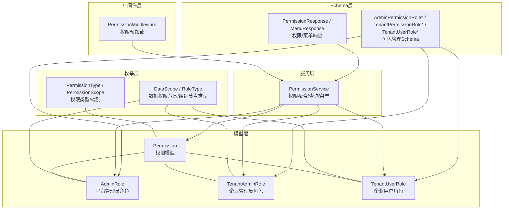
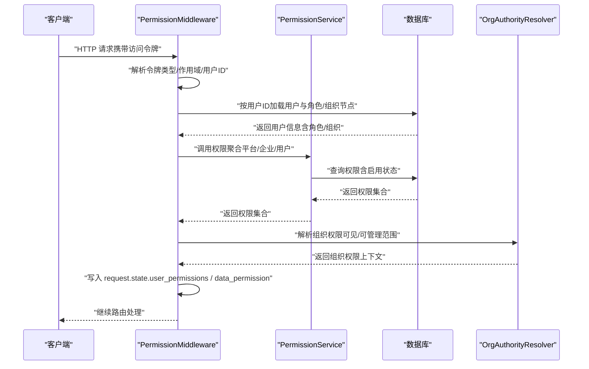
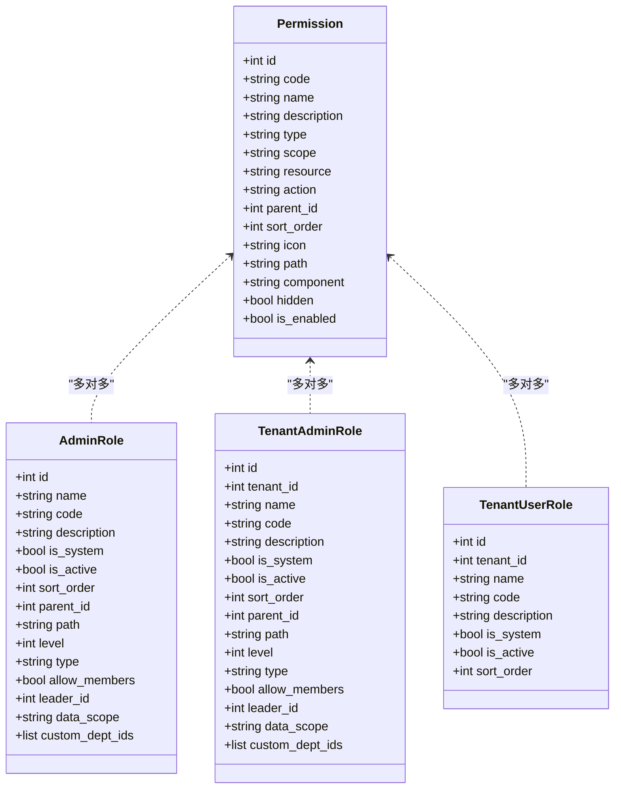
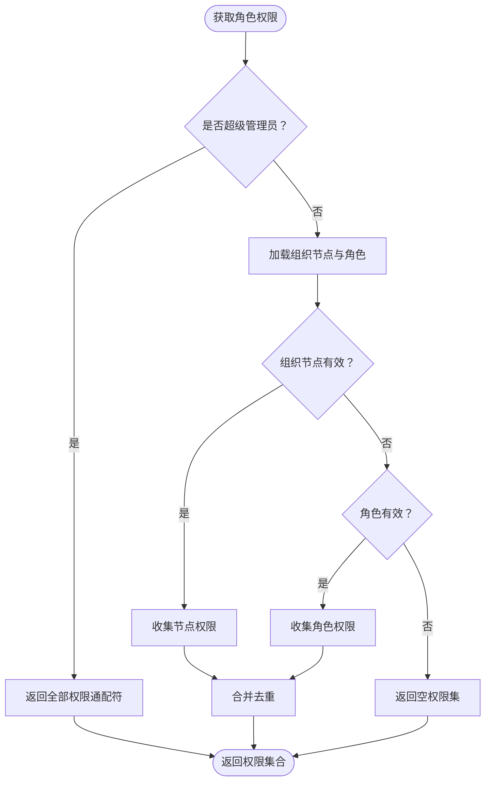
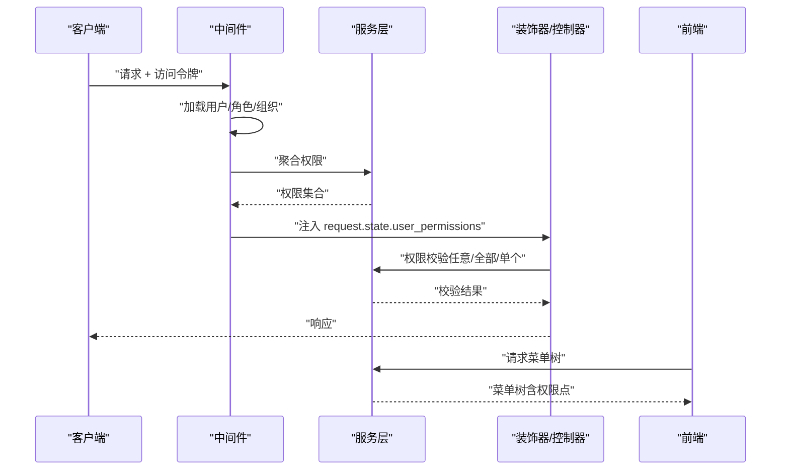
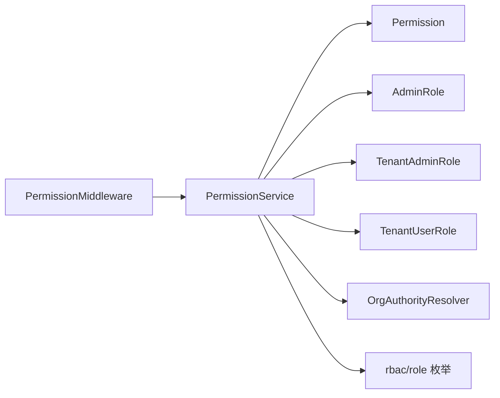

# 认证授权模型

<cite>
**本文档引用的文件**
- [backend/app/models/auth/permission.py](file://backend/app/models/auth/permission.py)
- [backend/app/models/auth/admin_role.py](file://backend/app/models/auth/admin_role.py)
- [backend/app/models/auth/tenant_admin_role.py](file://backend/app/models/auth/tenant_admin_role.py)
- [backend/app/models/auth/tenant_user_role.py](file://backend/app/models/auth/tenant_user_role.py)
- [backend/app/enums/rbac.py](file://backend/app/enums/rbac.py)
- [backend/app/enums/role.py](file://backend/app/enums/role.py)
- [backend/app/rbac/services/permission_service.py](file://backend/app/rbac/services/permission_service.py)
- [backend/app/middleware/permission.py](file://backend/app/middleware/permission.py)
- [backend/app/schemas/common/permission.py](file://backend/app/schemas/common/permission.py)
- [backend/app/schemas/system/admin_permission_role.py](file://backend/app/schemas/system/admin_permission_role.py)
- [backend/app/schemas/tenant/tenant_permission_role.py](file://backend/app/schemas/tenant/tenant_permission_role.py)
- [backend/app/schemas/tenant/user_role.py](file://backend/app/schemas/tenant/user_role.py)
</cite>

## 目录
1. [引言](#引言)
2. [项目结构](#项目结构)
3. [核心组件](#核心组件)
4. [架构总览](#架构总览)
5. [详细组件分析](#详细组件分析)
6. [依赖分析](#依赖分析)
7. [性能考虑](#性能考虑)
8. [故障排查指南](#故障排查指南)
9. [结论](#结论)
10. [附录](#附录)

## 引言
本文件面向认证授权系统，系统性梳理基于RBAC（基于角色的访问控制）的权限模型设计与实现，覆盖权限定义、资源范围与操作类型，管理员角色模型（平台级）、租户管理员角色模型（企业级）与租户用户角色模型（业务用户），以及权限验证流程、缓存策略与性能优化方案。文档同时提供扩展性设计建议与安全最佳实践，帮助开发者与运维人员高效理解与维护权限体系。

## 项目结构
RBAC相关代码主要分布在以下模块：
- 模型层：权限与角色实体定义
- 枚举层：权限类型、作用域与数据权限范围
- 服务层：权限聚合、查询、菜单构建与校验
- 中间件层：请求前加载用户权限与数据权限上下文
- Schema层：权限树、菜单与角色管理的请求/响应结构

图表来源
- [backend/app/models/auth/permission.py:15-159](file://backend/app/models/auth/permission.py#L15-L159)
- [backend/app/models/auth/admin_role.py:36-322](file://backend/app/models/auth/admin_role.py#L36-L322)
- [backend/app/models/auth/tenant_admin_role.py:36-327](file://backend/app/models/auth/tenant_admin_role.py#L36-L327)
- [backend/app/models/auth/tenant_user_role.py:37-177](file://backend/app/models/auth/tenant_user_role.py#L37-L177)
- [backend/app/enums/rbac.py:11-36](file://backend/app/enums/rbac.py#L11-L36)
- [backend/app/enums/role.py:11-46](file://backend/app/enums/role.py#L11-L46)
- [backend/app/rbac/services/permission_service.py:138-390](file://backend/app/rbac/services/permission_service.py#L138-L390)
- [backend/app/middleware/permission.py:31-272](file://backend/app/middleware/permission.py#L31-L272)
- [backend/app/schemas/common/permission.py:13-89](file://backend/app/schemas/common/permission.py#L13-L89)
- [backend/app/schemas/system/admin_permission_role.py:14-88](file://backend/app/schemas/system/admin_permission_role.py#L14-L88)
- [backend/app/schemas/tenant/tenant_permission_role.py:14-91](file://backend/app/schemas/tenant/tenant_permission_role.py#L14-L91)
- [backend/app/schemas/tenant/user_role.py:17-84](file://backend/app/schemas/tenant/user_role.py#L17-L84)

章节来源
- [backend/app/models/auth/permission.py:15-159](file://backend/app/models/auth/permission.py#L15-L159)
- [backend/app/enums/rbac.py:11-36](file://backend/app/enums/rbac.py#L11-L36)
- [backend/app/enums/role.py:11-46](file://backend/app/enums/role.py#L11-L46)
- [backend/app/rbac/services/permission_service.py:138-390](file://backend/app/rbac/services/permission_service.py#L138-L390)
- [backend/app/middleware/permission.py:31-272](file://backend/app/middleware/permission.py#L31-L272)
- [backend/app/schemas/common/permission.py:13-89](file://backend/app/schemas/common/permission.py#L13-L89)
- [backend/app/schemas/system/admin_permission_role.py:14-88](file://backend/app/schemas/system/admin_permission_role.py#L14-L88)
- [backend/app/schemas/tenant/tenant_permission_role.py:14-91](file://backend/app/schemas/tenant/tenant_permission_role.py#L14-L91)
- [backend/app/schemas/tenant/user_role.py:17-84](file://backend/app/schemas/tenant/user_role.py#L17-L84)

## 核心组件
- 权限模型（Permission）
  - 定义权限点、类型（菜单/操作）、作用域（平台/企业/用户/两端）、资源与操作标识、菜单元信息（图标、路由、组件、隐藏）以及启用状态。
  - 支持父子权限树结构，用于构建菜单树与权限继承。
  - 唯一约束：code + scope。
- 角色模型
  - 平台管理员角色（AdminRole）：支持层级结构（物化路径），继承父权限；支持组织架构映射（部门/岗位/职能角色）与数据权限范围。
  - 企业管理员角色（TenantAdminRole）：租户级角色，支持层级结构与数据权限范围，不同租户可同名。
  - 企业用户角色（TenantUserRole）：租户级业务用户角色，扁平结构，无层级。
- 枚举
  - 权限类型（菜单/操作）、权限端别（平台/企业/用户/两端）。
  - 数据权限范围（全部/本部门及下级/仅本部门/仅自己/自定义）。
  - 组织节点类型（部门/岗位/职能角色）。

章节来源
- [backend/app/models/auth/permission.py:15-159](file://backend/app/models/auth/permission.py#L15-L159)
- [backend/app/models/auth/admin_role.py:36-322](file://backend/app/models/auth/admin_role.py#L36-L322)
- [backend/app/models/auth/tenant_admin_role.py:36-327](file://backend/app/models/auth/tenant_admin_role.py#L36-L327)
- [backend/app/models/auth/tenant_user_role.py:37-177](file://backend/app/models/auth/tenant_user_role.py#L37-L177)
- [backend/app/enums/rbac.py:11-36](file://backend/app/enums/rbac.py#L11-L36)
- [backend/app/enums/role.py:11-46](file://backend/app/enums/role.py#L11-L46)

## 架构总览
权限验证的整体流程如下：
- 请求进入中间件，解析令牌，识别用户身份与作用域。
- 根据身份加载对应权限集合（平台管理员、企业管理员或企业业务用户）。
- 将权限集合与数据权限上下文写入请求状态，供后续装饰器与业务逻辑使用。
- 服务层提供权限聚合、查询、菜单构建与校验能力，支撑前端展示与后端鉴权。

图表来源
- [backend/app/middleware/permission.py:70-272](file://backend/app/middleware/permission.py#L70-L272)
- [backend/app/rbac/services/permission_service.py:138-390](file://backend/app/rbac/services/permission_service.py#L138-L390)

章节来源
- [backend/app/middleware/permission.py:31-272](file://backend/app/middleware/permission.py#L31-L272)
- [backend/app/rbac/services/permission_service.py:138-390](file://backend/app/rbac/services/permission_service.py#L138-L390)

## 详细组件分析

### 权限模型（Permission）
- 设计要点
  - 权限类型：菜单权限与操作权限，支持菜单元信息（图标、路由、组件、隐藏）。
  - 作用域：admin/tenant/user/both，区分权限归属端别。
  - 资源与操作：以资源标识与操作标识组合形成细粒度权限点。
  - 树形结构：父子关系用于菜单树与权限继承。
  - 唯一约束：code + scope，确保权限点在作用域内唯一。
- 数据结构与复杂度
  - 查询权限树：通常为O(n)遍历，配合索引（code、scope、parent_id、type、scope、is_enabled）提升效率。
  - 权限校验：集合查找O(1)，整体校验O(m)（m为所需权限数）。
- 错误处理与边界
  - 启用状态与软删除：仅启用且未删除的权限参与校验。
  - 菜单隐藏：不影响权限校验，仅影响前端展示。

图表来源
- [backend/app/models/auth/permission.py:15-159](file://backend/app/models/auth/permission.py#L15-L159)
- [backend/app/models/auth/admin_role.py:36-322](file://backend/app/models/auth/admin_role.py#L36-L322)
- [backend/app/models/auth/tenant_admin_role.py:36-327](file://backend/app/models/auth/tenant_admin_role.py#L36-L327)
- [backend/app/models/auth/tenant_user_role.py:37-177](file://backend/app/models/auth/tenant_user_role.py#L37-L177)

章节来源
- [backend/app/models/auth/permission.py:15-159](file://backend/app/models/auth/permission.py#L15-L159)

### 管理员角色模型（AdminRole）
- 角色层次与权限继承
  - 支持多级层级结构（物化路径），子角色自动继承父角色权限。
  - 提供祖先ID解析方法，便于权限聚合与组织权限计算。
- 组织架构映射
  - 节点类型支持部门/岗位/职能角色，支持负责人与成员管理。
- 数据权限范围
  - 支持全部/本部门及下级/仅本部门/仅自己/自定义部门列表。
- 性能与可用性
  - 通过物化路径快速定位祖先节点，降低递归成本。
  - 提供便捷属性（成员数量、权限数量、是否有子角色等）。

图表来源
- [backend/app/middleware/permission.py:90-151](file://backend/app/middleware/permission.py#L90-L151)

章节来源
- [backend/app/models/auth/admin_role.py:36-322](file://backend/app/models/auth/admin_role.py#L36-L322)
- [backend/app/middleware/permission.py:90-151](file://backend/app/middleware/permission.py#L90-L151)

### 租户管理员角色模型（TenantAdminRole）
- 租户级权限控制与作用域管理
  - 每个租户独立的角色命名空间，支持层级结构与数据权限范围。
  - 通过组织权限解析确定可见/可管理组织范围，结合数据权限上下文进行行级过滤。
- 动态权限聚合
  - 服务层统一聚合角色直接权限与计划/策略等附加权限，输出给前端菜单与后端校验。

章节来源
- [backend/app/models/auth/tenant_admin_role.py:36-327](file://backend/app/models/auth/tenant_admin_role.py#L36-L327)
- [backend/app/rbac/services/permission_service.py:178-206](file://backend/app/rbac/services/permission_service.py#L178-L206)

### 租户用户角色模型（TenantUserRole）
- 用户权限分配与动态调整机制
  - 扁平结构，无层级，权限直接绑定到角色。
  - 用户权限由其角色直接权限构成，动态调整通过角色-权限关联表即时生效。
- 成员与权限统计
  - 提供成员数量与权限数量的便捷属性，便于管理界面展示。

章节来源
- [backend/app/models/auth/tenant_user_role.py:37-177](file://backend/app/models/auth/tenant_user_role.py#L37-L177)

### RBAC权限模型实现原理
- 权限矩阵
  - 以“用户/角色”为行，“权限点”为列，启用状态为布尔值，形成稀疏矩阵。
  - 通过角色-权限多对多关联与组织节点-权限关联实现矩阵填充。
- 角色映射
  - 平台管理员：组织节点权限优先，其次角色权限；支持层级继承。
  - 企业管理员/用户：通过服务层聚合角色直接权限与组织权限。
- 访问控制列表（ACL）
  - 中间件将权限集合与数据权限上下文注入请求状态，装饰器与控制器直接读取。

章节来源
- [backend/app/middleware/permission.py:70-272](file://backend/app/middleware/permission.py#L70-L272)
- [backend/app/rbac/services/permission_service.py:138-390](file://backend/app/rbac/services/permission_service.py#L138-L390)

### 权限验证流程
- 中间件阶段
  - 解析令牌，识别用户类型与租户ID。
  - 加载用户、角色与组织节点，收集权限集合。
  - 设置数据权限上下文（最大数据范围、可见组织ID、可管理组织ID等）。
- 服务阶段
  - 提供权限聚合、权限树构建、菜单树构建与权限校验（任意/全部/单个）。
- 前端阶段
  - 基于菜单树与权限点渲染UI，实现按钮级与页面级权限控制。

图表来源
- [backend/app/middleware/permission.py:70-272](file://backend/app/middleware/permission.py#L70-L272)
- [backend/app/rbac/services/permission_service.py:208-304](file://backend/app/rbac/services/permission_service.py#L208-L304)

章节来源
- [backend/app/middleware/permission.py:31-272](file://backend/app/middleware/permission.py#L31-L272)
- [backend/app/rbac/services/permission_service.py:138-390](file://backend/app/rbac/services/permission_service.py#L138-L390)

### 缓存策略与性能优化
- 中间件预加载
  - 在请求进入路由处理前完成权限加载，避免重复查询。
- 数据权限上下文
  - 将组织权限与数据范围写入上下文，减少后续查询成本。
- 索引与查询优化
  - 对code、scope、parent_id、type、is_enabled、sort_order建立索引，加速权限树与筛选。
- 菜单与权限树构建
  - 服务层提供树构建与AI元信息处理，减少前端重复计算。
- 扩展性建议
  - 引入Redis缓存权限集合与菜单树，结合失效策略与热键保护。
  - 对高频权限点采用布隆过滤器预判存在性，降低数据库压力。

章节来源
- [backend/app/middleware/permission.py:70-272](file://backend/app/middleware/permission.py#L70-L272)
- [backend/app/rbac/services/permission_service.py:263-357](file://backend/app/rbac/services/permission_service.py#L263-L357)

## 依赖分析
- 组件耦合
  - 模型层：权限与三种角色通过多对多关联耦合，AdminRole与组织节点进一步耦合。
  - 服务层：PermissionService聚合多个领域域（查询、菜单、校验、组织权限），对外提供统一接口。
  - 中间件：依赖服务层与组织权限解析器，负责将权限与数据上下文注入请求。
- 外部依赖
  - 数据库ORM（SQLAlchemy）与异步会话工厂。
  - 令牌解码与作用域识别（访问令牌类型与范围）。
- 循环依赖规避
  - 通过延迟导入与TYPE_CHECKING分支避免循环引用。

图表来源
- [backend/app/middleware/permission.py:17-28](file://backend/app/middleware/permission.py#L17-L28)
- [backend/app/rbac/services/permission_service.py:138-152](file://backend/app/rbac/services/permission_service.py#L138-L152)
- [backend/app/enums/rbac.py:11-36](file://backend/app/enums/rbac.py#L11-L36)
- [backend/app/enums/role.py:11-46](file://backend/app/enums/role.py#L11-L46)

章节来源
- [backend/app/middleware/permission.py:17-28](file://backend/app/middleware/permission.py#L17-L28)
- [backend/app/rbac/services/permission_service.py:138-152](file://backend/app/rbac/services/permission_service.py#L138-L152)
- [backend/app/enums/rbac.py:11-36](file://backend/app/enums/rbac.py#L11-L36)
- [backend/app/enums/role.py:11-46](file://backend/app/enums/role.py#L11-L46)

## 性能考虑
- 查询路径优化
  - 使用selectinload批量加载关联对象，减少N+1查询。
  - 对权限点与角色建立复合索引，加速过滤与排序。
- 缓存与热点
  - 对常用权限集合与菜单树进行短期缓存，结合LRU淘汰策略。
  - 对高并发场景引入本地缓存（进程内）与分布式缓存（Redis）双层缓存。
- 渲染与传输
  - 服务层提前构建菜单树与权限点，减少前端重复计算。
  - 控制响应体大小，按需返回权限点与菜单元信息。

## 故障排查指南
- 令牌无效或类型不符
  - 现象：中间件无法加载权限。
  - 排查：确认令牌类型为访问令牌，作用域与用户ID正确。
- 用户未激活或角色/组织节点异常
  - 现象：权限集合为空或不完整。
  - 排查：检查用户激活状态、角色启用状态与组织节点有效性。
- 权限点未启用或被删除
  - 现象：权限校验失败。
  - 排查：确认权限is_enabled为真且未软删除。
- 数据权限范围不匹配
  - 现象：查询结果为空或越权。
  - 排查：核对数据权限范围与组织权限上下文（可见/可管理组织ID）。

章节来源
- [backend/app/middleware/permission.py:70-272](file://backend/app/middleware/permission.py#L70-L272)

## 结论
本权限模型以清晰的权限定义、灵活的角色层次与租户级作用域为核心，结合中间件预加载与服务层聚合，实现了高效的权限验证与菜单渲染。通过数据权限上下文与组织权限解析，系统在保证安全性的同时兼顾了性能与可维护性。建议在生产环境中引入缓存与监控，持续优化热点路径，并遵循最小权限原则与定期审计策略，确保权限体系长期稳定运行。

## 附录
- Schema参考
  - 权限/菜单响应结构：用于前后端交互与菜单渲染。
  - 角色管理请求/响应结构：用于平台与租户侧角色与权限的增删改查。

章节来源
- [backend/app/schemas/common/permission.py:13-89](file://backend/app/schemas/common/permission.py#L13-L89)
- [backend/app/schemas/system/admin_permission_role.py:14-88](file://backend/app/schemas/system/admin_permission_role.py#L14-L88)
- [backend/app/schemas/tenant/tenant_permission_role.py:14-91](file://backend/app/schemas/tenant/tenant_permission_role.py#L14-L91)
- [backend/app/schemas/tenant/user_role.py:17-84](file://backend/app/schemas/tenant/user_role.py#L17-L84)