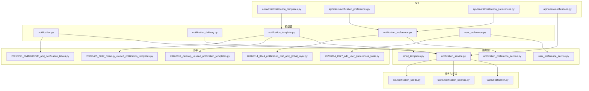
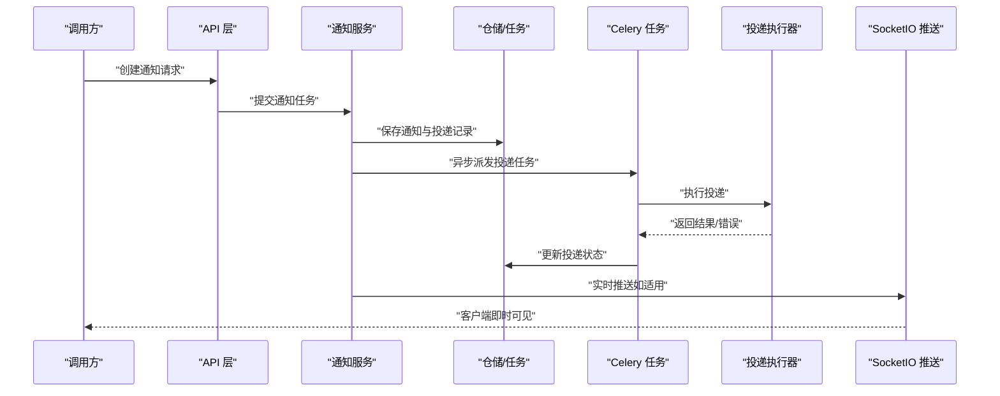
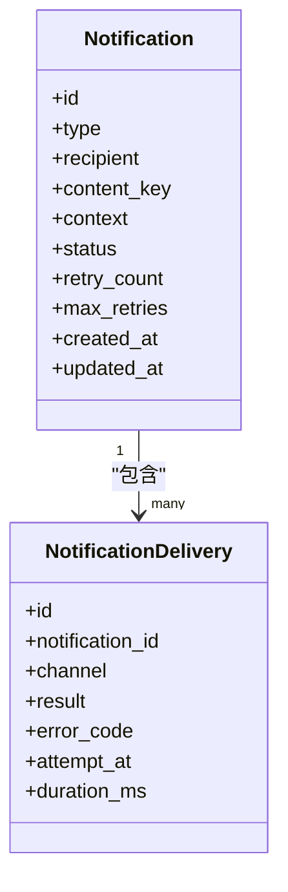
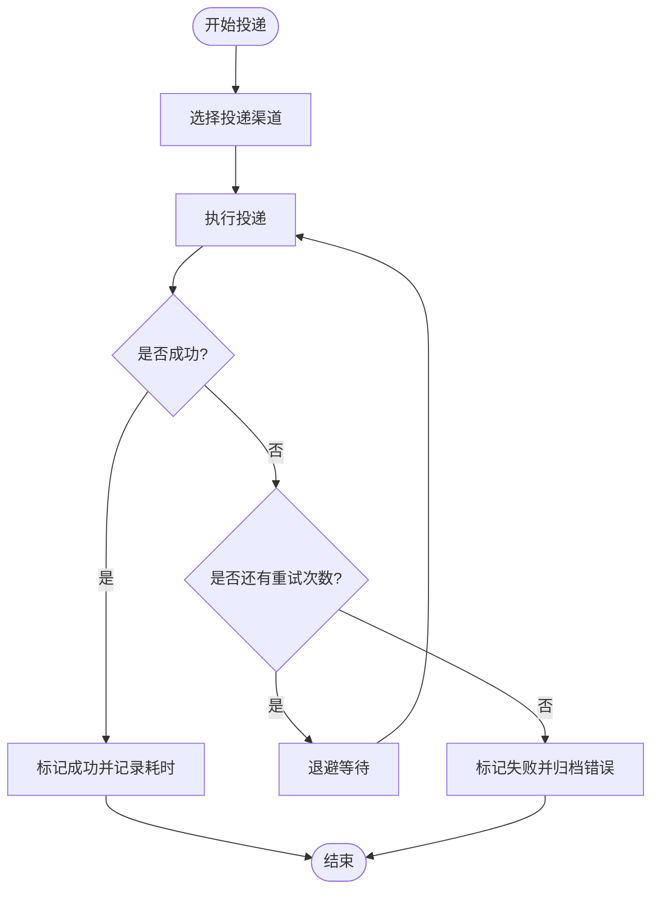
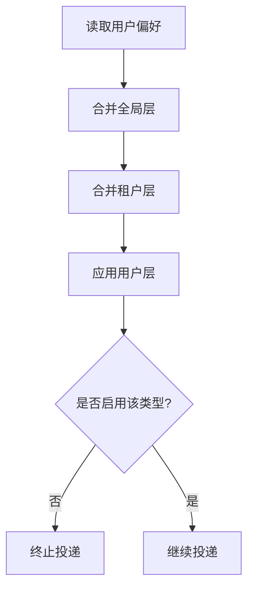
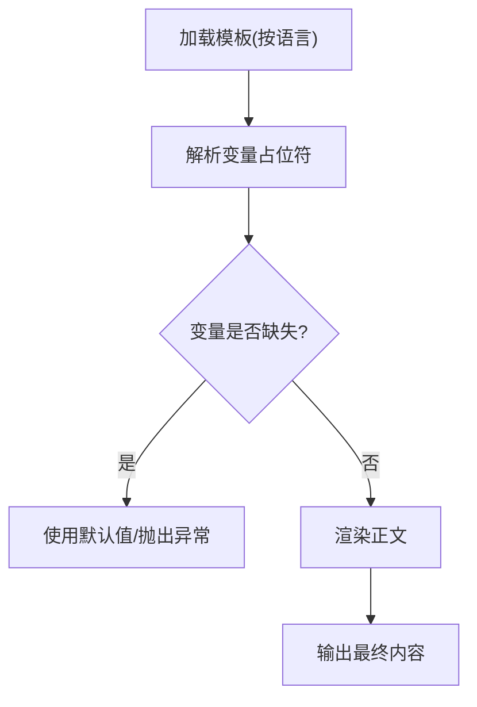
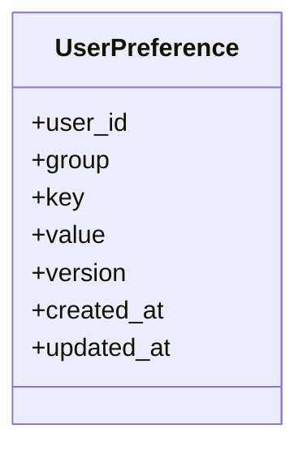
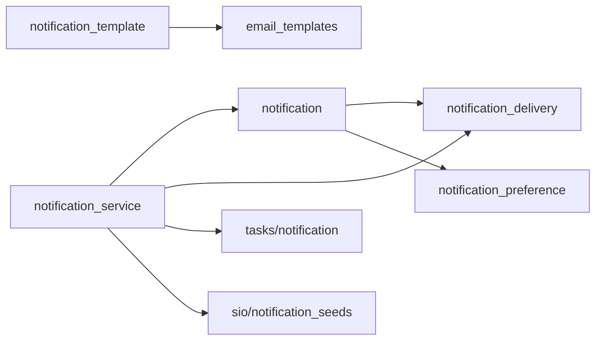

# 通用业务模型

<cite>
**本文引用的文件**
- [notification.py](file://backend/app/models/common/notification.py)
- [notification_delivery.py](file://backend/app/models/common/notification_delivery.py)
- [notification_preference.py](file://backend/app/models/common/notification_preference.py)
- [notification_template.py](file://backend/app/models/common/notification_template.py)
- [user_preference.py](file://backend/app/models/common/user_preference.py)
- [notification_service.py](file://backend/app/services/common/notification_service.py)
- [notification_preference_service.py](file://backend/app/services/common/notification_preference_service.py)
- [user_preference_service.py](file://backend/app/services/common/user_preference_service.py)
- [notification.py](file://backend/app/tasks/notification.py)
- [notification_cleanup.py](file://backend/app/tasks/notification_cleanup.py)
- [notification_seeds.py](file://backend/app/sio/notification_seeds.py)
- [20260221_6b4fe69b2efc_add_notification_tables.py](file://backend/migrations/versions/20260221_6b4fe69b2efc_add_notification_tables.py)
- [20260314_0927_add_user_preferences_table.py](file://backend/migrations/versions/20260314_0927_add_user_preferences_table.py)
- [20260314_0949_notification_pref_add_global_layer.py](file://backend/migrations/versions/20260314_0949_notification_pref_add_global_layer.py)
- [20260314_cleanup_unused_notification_templates.py](file://backend/migrations/versions/20260314_cleanup_unused_notification_templates.py)
- [20260405_0017_cleanup_unused_notification_templates.py](file://backend/migrations/versions/20260405_0017_cleanup_unused_notification_templates.py)
- [email_templates.py](file://backend/app/services/common/email_templates.py)
- [notification_templates.py](file://backend/app/api/admin/notification_templates.py)
- [notification_preferences.py](file://backend/app/api/admin/notification_preferences.py)
- [notification_preferences.py](file://backend/app/api/tenant/notification_preferences.py)
- [notifications.py](file://backend/app/api/tenant/notifications.py)
</cite>

## 目录
1. [引言](#引言)
2. [项目结构](#项目结构)
3. [核心组件](#核心组件)
4. [架构总览](#架构总览)
5. [详细组件分析](#详细组件分析)
6. [依赖关系分析](#依赖关系分析)
7. [性能考量](#性能考量)
8. [故障排查指南](#故障排查指南)
9. [结论](#结论)
10. [附录](#附录)

## 引言
本文件面向通用业务功能的数据模型设计，聚焦以下核心模型与流程：
- 通知模型（notification）：定义通知实体结构、类型、接收者、状态与重试机制
- 投递模型（notification_delivery）：定义投递策略、失败处理与监控指标
- 通知偏好模型（notification_preference）：用户偏好设置、个性化配置与全局层叠
- 通知模板模型（notification_template）：模板管理、变量替换与国际化支持
- 用户偏好模型（user_preference）：配置存储、同步机制与版本控制
- 设计原则、复用策略与扩展性
- 在不同业务场景中的应用示例

## 项目结构
围绕通知与偏好的通用模型位于后端应用的 common 层，配合服务层、任务调度、WebSocket 推送与数据库迁移脚本共同构成完整能力闭环。

图表来源
- [notification.py](file://backend/app/models/common/notification.py)
- [notification_delivery.py](file://backend/app/models/common/notification_delivery.py)
- [notification_preference.py](file://backend/app/models/common/notification_preference.py)
- [notification_template.py](file://backend/app/models/common/notification_template.py)
- [user_preference.py](file://backend/app/models/common/user_preference.py)
- [notification_service.py](file://backend/app/services/common/notification_service.py)
- [notification_preference_service.py](file://backend/app/services/common/notification_preference_service.py)
- [user_preference_service.py](file://backend/app/services/common/user_preference_service.py)
- [notification.py](file://backend/app/tasks/notification.py)
- [notification_cleanup.py](file://backend/app/tasks/notification_cleanup.py)
- [notification_seeds.py](file://backend/app/sio/notification_seeds.py)
- [20260221_6b4fe69b2efc_add_notification_tables.py](file://backend/migrations/versions/20260221_6b4fe69b2efc_add_notification_tables.py)
- [20260314_0927_add_user_preferences_table.py](file://backend/migrations/versions/20260314_0927_add_user_preferences_table.py)
- [20260314_0949_notification_pref_add_global_layer.py](file://backend/migrations/versions/20260314_0949_notification_pref_add_global_layer.py)
- [20260314_cleanup_unused_notification_templates.py](file://backend/migrations/versions/20260314_cleanup_unused_notification_templates.py)
- [20260405_0017_cleanup_unused_notification_templates.py](file://backend/migrations/versions/20260405_0017_cleanup_unused_notification_templates.py)

章节来源
- [notification.py](file://backend/app/models/common/notification.py)
- [notification_delivery.py](file://backend/app/models/common/notification_delivery.py)
- [notification_preference.py](file://backend/app/models/common/notification_preference.py)
- [notification_template.py](file://backend/app/models/common/notification_template.py)
- [user_preference.py](file://backend/app/models/common/user_preference.py)

## 核心组件
本节概述各模型职责与关键字段/行为，便于快速理解整体设计。

- 通知模型（notification）
  - 职责：承载一次通知事件的元信息，包含类型、目标接收者、内容键、上下文参数、状态与重试控制等
  - 关键点：状态机驱动、重试上限与退避策略、投递失败后的可观测性
- 投递模型（notification_delivery）
  - 职责：记录单次投递尝试的执行细节，包括渠道、结果、错误码、耗时与回执
  - 关键点：多通道并行/串行策略、失败重试与熔断、监控指标采集
- 通知偏好模型（notification_preference）
  - 职责：按层级（全局/租户/用户）管理偏好，支持开关、渠道白名单、阈值与个性化
  - 关键点：层叠优先级、默认值管理、变更传播
- 通知模板模型（notification_template）
  - 职责：统一管理模板、变量占位符与多语言文案
  - 关键点：变量解析、国际化渲染、模板校验与清理
- 用户偏好模型（user_preference）
  - 职责：持久化用户配置，支持同步与版本控制
  - 关键点：配置项分组、默认值、冲突解决与一致性

章节来源
- [notification.py](file://backend/app/models/common/notification.py)
- [notification_delivery.py](file://backend/app/models/common/notification_delivery.py)
- [notification_preference.py](file://backend/app/models/common/notification_preference.py)
- [notification_template.py](file://backend/app/models/common/notification_template.py)
- [user_preference.py](file://backend/app/models/common/user_preference.py)

## 架构总览
下图展示从“触发通知”到“最终投递”的端到端流程，涵盖服务编排、任务队列与实时推送。

图表来源
- [notification_service.py](file://backend/app/services/common/notification_service.py)
- [notification.py](file://backend/app/tasks/notification.py)
- [notification_delivery.py](file://backend/app/models/common/notification_delivery.py)
- [notification_seeds.py](file://backend/app/sio/notification_seeds.py)

## 详细组件分析

### 通知模型（notification）
- 结构要点
  - 通知标识、类型枚举、接收者标识、内容键、上下文参数、状态字段、重试次数、最大重试、退避策略、创建/更新时间
  - 状态机：待处理、投递中、成功、失败、已清理
- 重试机制
  - 基于指数退避或固定间隔；达到上限后进入失败态并触发告警
  - 失败原因归档，便于审计与重放
- 与投递的关系
  - 一对多：一条通知可对应多次投递尝试
- 典型字段路径
  - [notification.py](file://backend/app/models/common/notification.py)

图表来源
- [notification.py](file://backend/app/models/common/notification.py)
- [notification_delivery.py](file://backend/app/models/common/notification_delivery.py)

章节来源
- [notification.py](file://backend/app/models/common/notification.py)

### 投递模型（notification_delivery）
- 结构要点
  - 关联通知、投递渠道（邮件/站内信/IM等）、结果（成功/失败）、错误码、耗时、回执信息
- 策略与失败处理
  - 策略：优先主渠道，失败后切换备用；并发/串行由服务层策略决定
  - 失败处理：记录错误码与堆栈，触发重试或降级（如转短信/站内信）
- 监控指标
  - 成功率、平均耗时、失败率、TopN 错误码、渠道分布
- 典型字段路径
  - [notification_delivery.py](file://backend/app/models/common/notification_delivery.py)

图表来源
- [notification_delivery.py](file://backend/app/models/common/notification_delivery.py)
- [notification.py](file://backend/app/tasks/notification.py)

章节来源
- [notification_delivery.py](file://backend/app/models/common/notification_delivery.py)

### 通知偏好模型（notification_preference）
- 结构要点
  - 层级：全局 > 租户 > 用户；同层覆盖，跨层继承
  - 配置项：启用/禁用、渠道白名单、阈值、个性化开关
- 默认值管理
  - 通过迁移脚本引入默认层，确保新环境具备合理基线
- 变更传播
  - 服务层合并策略：自上而下优先级，遇禁用则短路
- 典型字段路径
  - [notification_preference.py](file://backend/app/models/common/notification_preference.py)

图表来源
- [notification_preference.py](file://backend/app/models/common/notification_preference.py)
- [20260314_0949_notification_pref_add_global_layer.py](file://backend/migrations/versions/20260314_0949_notification_pref_add_global_layer.py)

章节来源
- [notification_preference.py](file://backend/app/models/common/notification_preference.py)
- [20260314_0949_notification_pref_add_global_layer.py](file://backend/migrations/versions/20260314_0949_notification_pref_add_global_layer.py)

### 通知模板模型（notification_template）
- 结构要点
  - 模板键、语言、主题、正文（HTML/纯文本）、变量占位符清单、启用状态
- 变量替换与国际化
  - 渲染前扫描变量，缺失时回退或报错；按语言选择模板
- 国际化支持
  - 以语言代码为维度维护多套模板；默认模板作为兜底
- 清理策略
  - 迁移脚本定期清理未使用模板，避免冗余
- 典型字段路径
  - [notification_template.py](file://backend/app/models/common/notification_template.py)

图表来源
- [notification_template.py](file://backend/app/models/common/notification_template.py)
- [20260314_cleanup_unused_notification_templates.py](file://backend/migrations/versions/20260314_cleanup_unused_notification_templates.py)
- [20260405_0017_cleanup_unused_notification_templates.py](file://backend/migrations/versions/20260405_0017_cleanup_unused_notification_templates.py)

章节来源
- [notification_template.py](file://backend/app/models/common/notification_template.py)

### 用户偏好模型（user_preference）
- 结构要点
  - 用户标识、配置分组、键值对、版本号、创建/更新时间
- 同步机制与版本控制
  - 写入时版本递增；读取时按版本合并；冲突采用“最后写入获胜”
- 存储与检索
  - 服务层提供原子写入与批量读取接口
- 典型字段路径
  - [user_preference.py](file://backend/app/models/common/user_preference.py)

图表来源
- [user_preference.py](file://backend/app/models/common/user_preference.py)
- [20260314_0927_add_user_preferences_table.py](file://backend/migrations/versions/20260314_0927_add_user_preferences_table.py)

章节来源
- [user_preference.py](file://backend/app/models/common/user_preference.py)

## 依赖关系分析
- 模型间耦合
  - notification 与 notification_delivery：强关联（一对多）
  - notification 与 notification_preference：间接关联（服务层合并后生效）
  - notification_template 与 email_templates：模板渲染协作
- 外部依赖
  - Celery：异步任务编排
  - SocketIO：实时推送
  - 数据库迁移：初始化表结构与默认层

图表来源
- [notification.py](file://backend/app/models/common/notification.py)
- [notification_delivery.py](file://backend/app/models/common/notification_delivery.py)
- [notification_preference.py](file://backend/app/models/common/notification_preference.py)
- [notification_template.py](file://backend/app/models/common/notification_template.py)
- [notification_service.py](file://backend/app/services/common/notification_service.py)
- [notification.py](file://backend/app/tasks/notification.py)
- [notification_seeds.py](file://backend/app/sio/notification_seeds.py)

章节来源
- [notification_service.py](file://backend/app/services/common/notification_service.py)
- [notification.py](file://backend/app/tasks/notification.py)
- [notification_seeds.py](file://backend/app/sio/notification_seeds.py)

## 性能考量
- 异步投递与批处理
  - 使用 Celery 将投递拆分为独立任务，避免阻塞请求链路
- 并发与限流
  - 对下游渠道实施速率限制与熔断，防止雪崩
- 缓存与预热
  - 常用模板与偏好可缓存，减少数据库访问
- 监控与告警
  - 关键指标（成功率、延迟、失败率）需接入监控系统，设置阈值告警
- 清理与归档
  - 定期清理过期通知与模板，降低存储与查询压力

## 故障排查指南
- 常见问题定位
  - 通知未送达：检查通知状态、投递记录与渠道错误码
  - 偏好未生效：确认层叠顺序与用户层覆盖
  - 模板渲染失败：核对变量占位符与语言匹配
- 诊断步骤
  - 查看通知与投递记录：定位失败阶段
  - 核对模板变量与语言：确认渲染输入
  - 检查偏好合并逻辑：确认启用状态
- 相关实现参考
  - 通知服务与任务：[notification_service.py](file://backend/app/services/common/notification_service.py)、[notification.py](file://backend/app/tasks/notification.py)
  - 偏好服务与模型：[notification_preference_service.py](file://backend/app/services/common/notification_preference_service.py)、[notification_preference.py](file://backend/app/models/common/notification_preference.py)
  - 用户偏好服务与模型：[user_preference_service.py](file://backend/app/services/common/user_preference_service.py)、[user_preference.py](file://backend/app/models/common/user_preference.py)
  - 模板服务与模型：[email_templates.py](file://backend/app/services/common/email_templates.py)、[notification_template.py](file://backend/app/models/common/notification_template.py)

章节来源
- [notification_service.py](file://backend/app/services/common/notification_service.py)
- [notification.py](file://backend/app/tasks/notification.py)
- [notification_preference_service.py](file://backend/app/services/common/notification_preference_service.py)
- [notification_preference.py](file://backend/app/models/common/notification_preference.py)
- [user_preference_service.py](file://backend/app/services/common/user_preference_service.py)
- [user_preference.py](file://backend/app/models/common/user_preference.py)
- [email_templates.py](file://backend/app/services/common/email_templates.py)
- [notification_template.py](file://backend/app/models/common/notification_template.py)

## 结论
通用业务模型通过清晰的分层与职责划分，实现了通知的全生命周期管理：从偏好控制、模板渲染、异步投递到实时推送与清理归档。其设计遵循“可配置、可扩展、可观测”的原则，既满足当前需求，也为未来多渠道、多语言与复杂业务场景预留了扩展空间。

## 附录
- API 与路由
  - 通知模板管理：[notification_templates.py](file://backend/app/api/admin/notification_templates.py)
  - 通知偏好管理（管理员）：[notification_preferences.py](file://backend/app/api/admin/notification_preferences.py)
  - 通知偏好管理（租户）：[notification_preferences.py](file://backend/app/api/tenant/notification_preferences.py)
  - 通知查询与导出（租户）：[notifications.py](file://backend/app/api/tenant/notifications.py)
- 迁移脚本
  - 初始化通知表：[20260221_6b4fe69b2efc_add_notification_tables.py](file://backend/migrations/versions/20260221_6b4fe69b2efc_add_notification_tables.py)
  - 新增用户偏好表：[20260314_0927_add_user_preferences_table.py](file://backend/migrations/versions/20260314_0927_add_user_preferences_table.py)
  - 增加全局偏好层：[20260314_0949_notification_pref_add_global_layer.py](file://backend/migrations/versions/20260314_0949_notification_pref_add_global_layer.py)
  - 清理未使用模板（两次迁移）：[20260314_cleanup_unused_notification_templates.py](file://backend/migrations/versions/20260314_cleanup_unused_notification_templates.py)、[20260405_0017_cleanup_unused_notification_templates.py](file://backend/migrations/versions/20260405_0017_cleanup_unused_notification_templates.py)
- 任务与推送
  - 通知任务：[notification.py](file://backend/app/tasks/notification.py)
  - 通知清理任务：[notification_cleanup.py](file://backend/app/tasks/notification_cleanup.py)
  - 实时推送种子：[notification_seeds.py](file://backend/app/sio/notification_seeds.py)