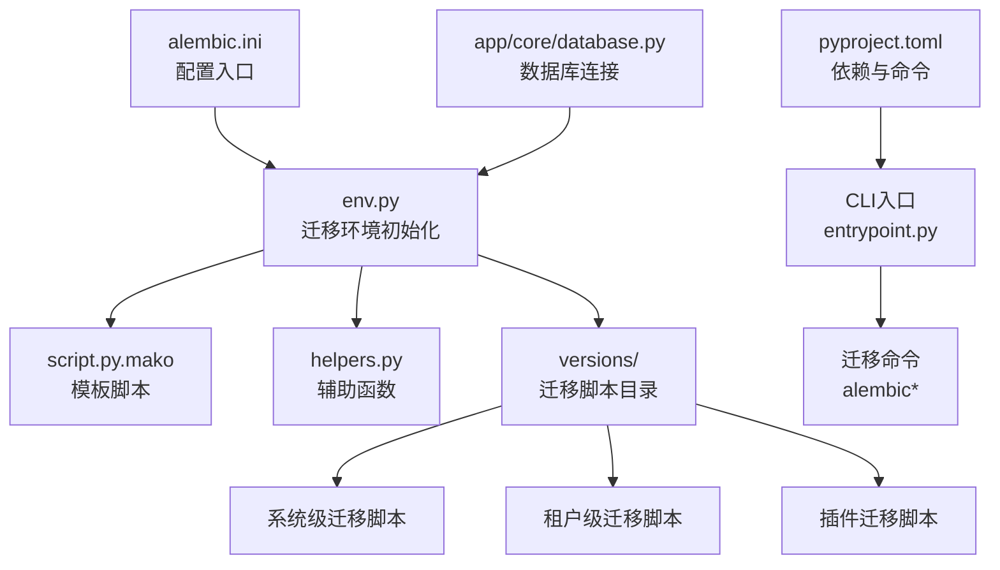
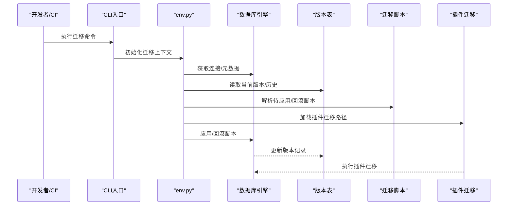
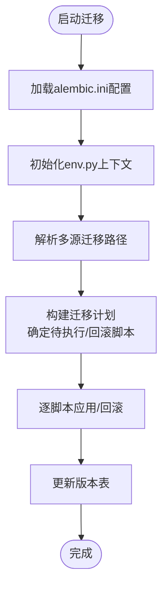
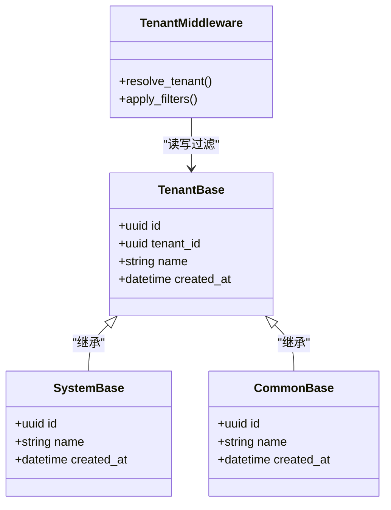
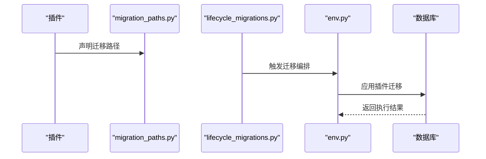
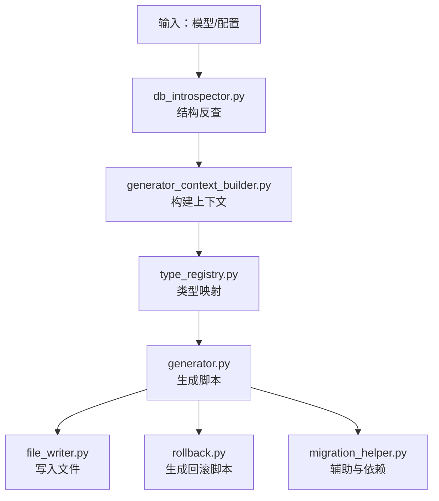
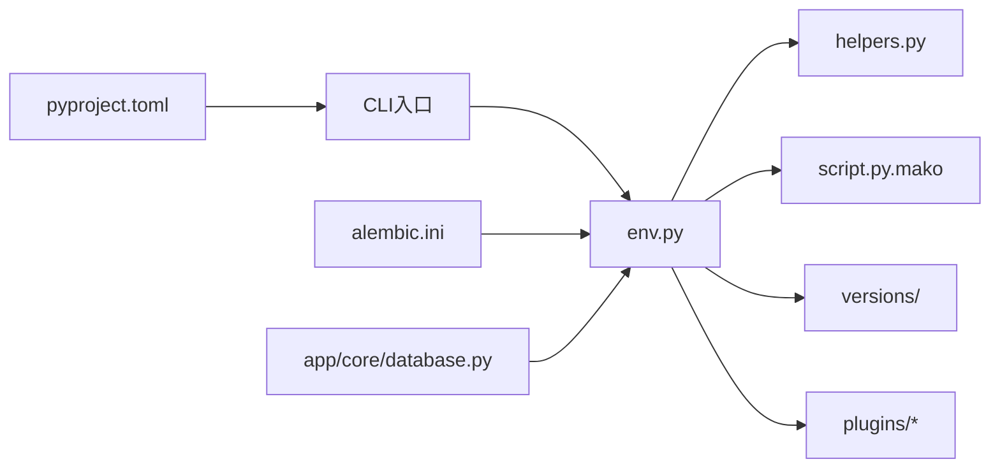

# 数据迁移

<cite>

**本文引用的文件**
- [backend/migrations/env.py](file://backend/migrations/env.py)
- [backend/migrations/script.py.mako](file://backend/migrations/script.py.mako)
- [backend/migrations/helpers.py](file://backend/migrations/helpers.py)
- [backend/alembic.ini](file://backend/alembic.ini)
- [backend/pyproject.toml](file://backend/pyproject.toml)
- [backend/app/core/database.py](file://backend/app/core/database.py)
- [backend/app/cli_commands/entrypoint.py](file://backend/app/cli_commands/entrypoint.py)
- [backend/scripts/lint_migrations.py](file://backend/scripts/lint_migrations.py)
- [backend/tests/test_database_migration_contract.py](file://backend/tests/test_database_migration_contract.py)
- [backend/plugins/storage-migration/plugin.py](file://backend/plugins/storage-migration/plugin.py)
- [backend/plugins/storage-migration/migration_paths.py](file://backend/plugins/storage-migration/migration_paths.py)
- [backend/plugins/lifecycle_migrations.py](file://backend/plugins/lifecycle_migrations.py)
- [backend/plugins/migration_paths.py](file://backend/plugins/migration_paths.py)
- [backend/app/middleware/tenant.py](file://backend/app/middleware/tenant.py)
- [backend/app/models/tenant/base.py](file://backend/app/models/tenant/base.py)
- [backend/app/models/system/base.py](file://backend/app/models/system/base.py)
- [backend/app/models/common/base.py](file://backend/app/models/common/base.py)
- [backend/app/repositories/tenant/base.py](file://backend/app/repositories/tenant/base.py)
- [backend/app/services/tenant/base.py](file://backend/app/services/tenant/base.py)
- [backend/app/codegen/migration_helper.py](file://backend/app/codegen/migration_helper.py)
- [backend/app/codegen/rollback.py](file://backend/app/codegen/rollback.py)
- [backend/app/codegen/generator.py](file://backend/app/codegen/generator.py)
- [backend/app/codegen/generator_support.py](file://backend/app/codegen/generator_support.py)
- [backend/app/codegen/db_introspector.py](file://backend/app/codegen/db_introspector.py)
- [backend/app/codegen/type_registry.py](file://backend/app/codegen/type_registry.py)
- [backend/app/codegen/options.py](file://backend/app/codegen/options.py)
- [backend/app/codegen/constants.py](file://backend/app/codegen/constants.py)
- [backend/app/codegen/file_writer.py](file://backend/app/codegen/file_writer.py)
- [backend/app/codegen/preset_loader.py](file://backend/app/codegen/preset_loader.py)
- [backend/app/codegen/generator_context_builder.py](file://backend/app/codegen/generator_context_builder.py)
- [backend/app/codegen/generator_output_assembler.py](file://backend/app/codegen/generator_output_assembler.py)
- [backend/app/codegen/generator_types.py](file://backend/app/codegen/generator_types.py)
- [backend/app/codegen/manifest.py](file://backend/app/codegen/manifest.py)
</cite>

## 目录
1. [简介](#简介)
2. [项目结构](#项目结构)
3. [核心组件](#核心组件)
4. [架构总览](#架构总览)
5. [详细组件分析](#详细组件分析)
6. [依赖分析](#依赖分析)
7. [性能考虑](#性能考虑)
8. [故障排查指南](#故障排查指南)
9. [结论](#结论)
10. [附录](#附录)

## 简介
本文件面向NovusAI SaaS平台的数据迁移与版本管理，系统化阐述基于Alembic的迁移框架使用方式，覆盖迁移脚本生成、版本管理、依赖关系处理、数据库结构变更自动化流程（表结构修改、索引创建、约束添加）、安全策略（回滚机制、数据备份、完整性检查）、多租户迁移挑战与方案（租户数据隔离、批量迁移）、迁移脚本编写规范、测试策略与部署流程，并提供故障排查方法、性能优化建议与最佳实践，以及向前兼容性与向后不兼容变更的处理策略。

## 项目结构
后端采用标准的Alembic迁移目录布局，配合自定义脚手架与插件生命周期迁移能力，形成“统一迁移入口 + 多源迁移路径 + 插件化扩展”的整体架构。

图示来源
- [backend/alembic.ini](file://backend/alembic.ini)
- [backend/migrations/env.py](file://backend/migrations/env.py)
- [backend/migrations/script.py.mako](file://backend/migrations/script.py.mako)
- [backend/migrations/helpers.py](file://backend/migrations/helpers.py)
- [backend/app/core/database.py](file://backend/app/core/database.py)
- [backend/app/cli_commands/entrypoint.py](file://backend/app/cli_commands/entrypoint.py)
- [backend/pyproject.toml](file://backend/pyproject.toml)

章节来源
- [backend/alembic.ini](file://backend/alembic.ini)
- [backend/migrations/env.py](file://backend/migrations/env.py)
- [backend/migrations/script.py.mako](file://backend/migrations/script.py.mako)
- [backend/migrations/helpers.py](file://backend/migrations/helpers.py)
- [backend/app/core/database.py](file://backend/app/core/database.py)
- [backend/app/cli_commands/entrypoint.py](file://backend/app/cli_commands/entrypoint.py)
- [backend/pyproject.toml](file://backend/pyproject.toml)

## 核心组件
- Alembic配置与入口
  - alembic.ini：定义迁移目录、目标数据库、方言等全局配置。
  - env.py：在运行时构建迁移上下文，注入数据库引擎与元数据，解析版本表与历史。
  - script.py.mako：迁移脚本模板，控制生成脚本的头部、上下文、依赖声明等。
  - helpers.py：提供通用迁移辅助函数（如索引/约束命名、跨版本兼容性处理）。
- 迁移脚本与版本管理
  - versions/：按时间戳+序号命名的迁移脚本集合，支持合并头、依赖声明与数据迁移。
- 数据库连接与模型基类
  - app/core/database.py：提供数据库引擎与会话管理，确保迁移在正确连接上执行。
  - 模型基类（system/tenant/common）：统一的表前缀、命名空间与租户字段策略，支撑多租户隔离。
- CLI与命令入口
  - app/cli_commands/entrypoint.py：注册迁移相关命令，统一入口便于CI/CD集成。
  - pyproject.toml：定义迁移命令别名与参数，便于本地开发与流水线复用。
- 插件化迁移
  - plugins/*/migration_paths.py：插件声明自身迁移路径，支持按模块拆分、条件迁移。
  - plugins/lifecycle_migrations.py：插件生命周期中的迁移编排，确保安装/升级/卸载阶段的迁移一致性。
  - storage-migration插件：独立的存储迁移逻辑与路径，体现“插件即迁移源”的理念。

章节来源
- [backend/alembic.ini](file://backend/alembic.ini)
- [backend/migrations/env.py](file://backend/migrations/env.py)
- [backend/migrations/script.py.mako](file://backend/migrations/script.py.mako)
- [backend/migrations/helpers.py](file://backend/migrations/helpers.py)
- [backend/app/core/database.py](file://backend/app/core/database.py)
- [backend/app/cli_commands/entrypoint.py](file://backend/app/cli_commands/entrypoint.py)
- [backend/pyproject.toml](file://backend/pyproject.toml)
- [backend/plugins/lifecycle_migrations.py](file://backend/plugins/lifecycle_migrations.py)
- [backend/plugins/migration_paths.py](file://backend/plugins/migration_paths.py)
- [backend/plugins/storage-migration/migration_paths.py](file://backend/plugins/storage-migration/migration_paths.py)

## 架构总览
下图展示从CLI到数据库的完整迁移链路，包括多源迁移路径与插件扩展点：

图示来源
- [backend/app/cli_commands/entrypoint.py](file://backend/app/cli_commands/entrypoint.py)
- [backend/migrations/env.py](file://backend/migrations/env.py)
- [backend/app/core/database.py](file://backend/app/core/database.py)
- [backend/plugins/migration_paths.py](file://backend/plugins/migration_paths.py)

## 详细组件分析

### 组件A：迁移环境与脚本模板
- env.py负责：
  - 注入数据库引擎与元数据，确保迁移在正确的连接上执行。
  - 解析版本表，识别当前版本、历史记录与待执行脚本。
  - 支持多源迁移路径（系统、租户、插件），实现统一调度。
- script.py.mako负责：
  - 生成迁移脚本的头部注释、上下文导入与依赖声明。
  - 控制脚本的可逆性与依赖关系，避免重复执行与顺序错误。
- helpers.py负责：
  - 提供索引/约束命名规范、跨版本兼容处理、依赖合并策略等。

图示来源
- [backend/migrations/env.py](file://backend/migrations/env.py)
- [backend/migrations/script.py.mako](file://backend/migrations/script.py.mako)
- [backend/migrations/helpers.py](file://backend/migrations/helpers.py)

章节来源
- [backend/migrations/env.py](file://backend/migrations/env.py)
- [backend/migrations/script.py.mako](file://backend/migrations/script.py.mako)
- [backend/migrations/helpers.py](file://backend/migrations/helpers.py)

### 组件B：多租户迁移与隔离
- 租户模型与基类：
  - tenant/base.py：定义租户标识字段与命名空间，确保所有租户相关表具备统一的租户维度。
  - system/base.py/common/base.py：系统级与公共表遵循不同命名与权限策略，避免与租户数据混淆。
- 中间件与路由：
  - app/middleware/tenant.py：在请求层注入租户上下文，用于动态选择租户Schema或过滤查询。
- 迁移策略：
  - 在迁移中对租户表添加tenant_id字段与唯一性约束，确保跨租户数据隔离。
  - 对跨租户共享表采用“显式租户字段 + 唯一性约束”组合，防止数据泄露。
  - 使用索引与约束提升查询性能与数据完整性。

图示来源
- [backend/app/models/tenant/base.py](file://backend/app/models/tenant/base.py)
- [backend/app/models/system/base.py](file://backend/app/models/system/base.py)
- [backend/app/models/common/base.py](file://backend/app/models/common/base.py)
- [backend/app/middleware/tenant.py](file://backend/app/middleware/tenant.py)

章节来源
- [backend/app/models/tenant/base.py](file://backend/app/models/tenant/base.py)
- [backend/app/models/system/base.py](file://backend/app/models/system/base.py)
- [backend/app/models/common/base.py](file://backend/app/models/common/base.py)
- [backend/app/middleware/tenant.py](file://backend/app/middleware/tenant.py)

### 组件C：插件化迁移与生命周期
- 生命周期迁移：
  - plugins/lifecycle_migrations.py：在插件安装、升级、卸载阶段自动触发迁移，确保状态一致。
- 迁移路径：
  - plugins/*/migration_paths.py：每个插件声明自身的迁移路径，支持按模块拆分、条件迁移与依赖声明。
- 存储迁移插件：
  - storage-migration/plugin.py：封装存储相关的迁移逻辑，与主迁移框架解耦。

图示来源
- [backend/plugins/lifecycle_migrations.py](file://backend/plugins/lifecycle_migrations.py)
- [backend/plugins/migration_paths.py](file://backend/plugins/migration_paths.py)
- [backend/plugins/storage-migration/plugin.py](file://backend/plugins/storage-migration/plugin.py)
- [backend/migrations/env.py](file://backend/migrations/env.py)

章节来源
- [backend/plugins/lifecycle_migrations.py](file://backend/plugins/lifecycle_migrations.py)
- [backend/plugins/migration_paths.py](file://backend/plugins/migration_paths.py)
- [backend/plugins/storage-migration/plugin.py](file://backend/plugins/storage-migration/plugin.py)

### 组件D：迁移脚本生成与代码生成器
- 迁移助手：
  - app/codegen/migration_helper.py：提供迁移脚本生成的辅助能力，包括依赖解析、模板填充。
- 回滚与一致性：
  - app/codegen/rollback.py：生成可回滚的迁移脚本，确保变更可逆。
- 代码生成器：
  - app/codegen/generator.py 与 generator_support.py：根据模型与配置生成迁移脚本与辅助文件。
  - app/codegen/db_introspector.py：从现有数据库结构反向生成迁移脚本。
  - app/codegen/type_registry.py：类型映射与注册，确保生成脚本的类型一致性。
  - app/codegen/options.py/constants.py：生成选项与常量配置。
  - app/codegen/file_writer.py：文件写入与模板渲染。
  - app/codegen/preset_loader.py：预设加载与默认行为。
  - app/codegen/generator_context_builder.py / generator_output_assembler.py：上下文构建与输出组装。
  - app/codegen/generator_types.py / manifest.py：类型定义与清单管理。

图示来源
- [backend/app/codegen/migration_helper.py](file://backend/app/codegen/migration_helper.py)
- [backend/app/codegen/rollback.py](file://backend/app/codegen/rollback.py)
- [backend/app/codegen/generator.py](file://backend/app/codegen/generator.py)
- [backend/app/codegen/generator_support.py](file://backend/app/codegen/generator_support.py)
- [backend/app/codegen/db_introspector.py](file://backend/app/codegen/db_introspector.py)
- [backend/app/codegen/type_registry.py](file://backend/app/codegen/type_registry.py)
- [backend/app/codegen/options.py](file://backend/app/codegen/options.py)
- [backend/app/codegen/constants.py](file://backend/app/codegen/constants.py)
- [backend/app/codegen/file_writer.py](file://backend/app/codegen/file_writer.py)
- [backend/app/codegen/preset_loader.py](file://backend/app/codegen/preset_loader.py)
- [backend/app/codegen/generator_context_builder.py](file://backend/app/codegen/generator_context_builder.py)
- [backend/app/codegen/generator_output_assembler.py](file://backend/app/codegen/generator_output_assembler.py)
- [backend/app/codegen/generator_types.py](file://backend/app/codegen/generator_types.py)
- [backend/app/codegen/manifest.py](file://backend/app/codegen/manifest.py)

章节来源
- [backend/app/codegen/migration_helper.py](file://backend/app/codegen/migration_helper.py)
- [backend/app/codegen/rollback.py](file://backend/app/codegen/rollback.py)
- [backend/app/codegen/generator.py](file://backend/app/codegen/generator.py)
- [backend/app/codegen/generator_support.py](file://backend/app/codegen/generator_support.py)
- [backend/app/codegen/db_introspector.py](file://backend/app/codegen/db_introspector.py)
- [backend/app/codegen/type_registry.py](file://backend/app/codegen/type_registry.py)
- [backend/app/codegen/options.py](file://backend/app/codegen/options.py)
- [backend/app/codegen/constants.py](file://backend/app/codegen/constants.py)
- [backend/app/codegen/file_writer.py](file://backend/app/codegen/file_writer.py)
- [backend/app/codegen/preset_loader.py](file://backend/app/codegen/preset_loader.py)
- [backend/app/codegen/generator_context_builder.py](file://backend/app/codegen/generator_context_builder.py)
- [backend/app/codegen/generator_output_assembler.py](file://backend/app/codegen/generator_output_assembler.py)
- [backend/app/codegen/generator_types.py](file://backend/app/codegen/generator_types.py)
- [backend/app/codegen/manifest.py](file://backend/app/codegen/manifest.py)

## 依赖分析
- 组件耦合与内聚
  - env.py是迁移执行的核心枢纽，向上依赖CLI与配置，向下依赖脚本与插件。
  - helpers.py提供低层复用能力，被脚本与生成器广泛使用。
  - 插件迁移通过migration_paths.py与生命周期迁移协同，避免直接耦合到env.py。
- 外部依赖与集成点
  - alembic.ini与pyproject.toml共同决定命令入口与参数。
  - app/core/database.py提供数据库连接，确保迁移在正确的连接上执行。
- 循环依赖风险
  - 通过“声明式路径 + 编排器”模式降低循环依赖风险；生成器与脚本模板之间通过接口契约解耦。

图示来源
- [backend/app/cli_commands/entrypoint.py](file://backend/app/cli_commands/entrypoint.py)
- [backend/migrations/env.py](file://backend/migrations/env.py)
- [backend/migrations/helpers.py](file://backend/migrations/helpers.py)
- [backend/migrations/script.py.mako](file://backend/migrations/script.py.mako)
- [backend/alembic.ini](file://backend/alembic.ini)
- [backend/pyproject.toml](file://backend/pyproject.toml)
- [backend/app/core/database.py](file://backend/app/core/database.py)

章节来源
- [backend/app/cli_commands/entrypoint.py](file://backend/app/cli_commands/entrypoint.py)
- [backend/migrations/env.py](file://backend/migrations/env.py)
- [backend/migrations/helpers.py](file://backend/migrations/helpers.py)
- [backend/migrations/script.py.mako](file://backend/migrations/script.py.mako)
- [backend/alembic.ini](file://backend/alembic.ini)
- [backend/pyproject.toml](file://backend/pyproject.toml)
- [backend/app/core/database.py](file://backend/app/core/database.py)

## 性能考虑
- 批量DDL与事务
  - 将多个DDL操作合并到单个迁移脚本中，减少事务开销与锁竞争。
  - 对大表结构变更采用“在线DDL”策略（如分批重写、影子列、增量同步）。
- 索引与约束
  - 在大批量数据迁移前，临时禁用非必要索引，迁移后再重建，以加速写入。
  - 合理设计唯一性约束与外键，避免冗余索引导致的写放大。
- 并发与锁
  - 避免在高峰期执行长事务迁移；优先选择维护窗口或灰度发布。
  - 对多租户场景，按租户分批迁移，降低锁粒度与冲突概率。
- 监控与回滚
  - 迁移过程中记录进度与耗时指标，异常时快速回滚至最近稳定版本。

## 故障排查指南
- 常见问题定位
  - 版本不一致：检查env.py对版本表的解析与历史记录，确认是否存在未应用或重复应用的脚本。
  - 插件迁移失败：查看plugins/*/migration_paths.py与生命周期迁移日志，确认路径声明与依赖是否正确。
  - 多租户冲突：核对租户字段与唯一性约束，检查中间件是否正确注入租户上下文。
- 脚本质量检查
  - 使用scripts/lint_migrations.py进行迁移脚本语法与风格检查，确保可读性与一致性。
- 测试验证
  - 利用tests/test_database_migration_contract.py进行迁移契约测试，覆盖正向与逆向迁移。
- 回滚策略
  - 优先使用app/codegen/rollback.py生成的回滚脚本；若无回滚脚本，参考helpers.py中的兼容性处理策略。

章节来源
- [backend/scripts/lint_migrations.py](file://backend/scripts/lint_migrations.py)
- [backend/tests/test_database_migration_contract.py](file://backend/tests/test_database_migration_contract.py)
- [backend/app/codegen/rollback.py](file://backend/app/codegen/rollback.py)
- [backend/migrations/helpers.py](file://backend/migrations/helpers.py)

## 结论
本项目通过Alembic与自定义脚手架、插件化迁移路径及多租户隔离策略，构建了可演进、可回滚、可审计的数据库迁移体系。结合生成器与测试契约，能够在保障生产安全的前提下高效推进数据库演进。建议在后续实践中持续完善监控与告警、自动化测试与灰度发布流程，进一步提升迁移的稳定性与可观测性。

## 附录

### 迁移脚本编写规范
- 命名规范
  - 使用时间戳+序号的版本命名，确保顺序可追溯。
- 可逆性
  - 每个迁移脚本应提供up/down双向实现，必要时生成配套回滚脚本。
- 依赖声明
  - 明确脚本之间的依赖关系，避免并发执行导致的冲突。
- 安全性
  - 对大表结构变更采用“影子列/增量同步/切换”策略，避免长时间锁表。
  - 在迁移前后进行完整性检查与数据校验。

### 数据迁移安全策略
- 回滚机制
  - 生成可回滚脚本，保留版本回退路径；对关键变更提供“快照/备份+回滚”双重保障。
- 数据备份
  - 在执行重大变更前进行逻辑备份或物理备份，确保可恢复性。
- 完整性检查
  - 迁移完成后执行一致性校验（计数、采样、关联完整性），并记录校验结果。

### 多租户迁移挑战与方案
- 租户数据隔离
  - 为租户表添加tenant_id字段与唯一性约束，确保跨租户数据隔离。
  - 对跨租户共享表采用“显式租户字段 + 唯一性约束”组合。
- 批量迁移
  - 按租户分批执行迁移，降低锁粒度与冲突概率；对跨租户任务采用幂等设计。
- 查询与写入
  - 在中间件层注入租户上下文，确保查询与写入均受租户维度限制。

### 测试策略
- 单元测试
  - 使用pytest对迁移脚本进行单元测试，覆盖up/down路径与边界条件。
- 集成测试
  - 在隔离的测试数据库中执行完整的迁移流程，验证版本表与数据一致性。
- 契约测试
  - 通过tests/test_database_migration_contract.py确保迁移契约的稳定性。

### 部署流程
- 开发阶段
  - 使用app/cli_commands/entrypoint.py注册的命令进行本地迁移与验证。
- CI/CD阶段
  - 在流水线中调用pyproject.toml中定义的迁移命令，确保迁移在受控环境中执行。
- 生产发布
  - 采用灰度发布与回滚预案，先在小范围租户验证，再逐步扩大范围。

### 故障排查方法
- 日志与追踪
  - 关注env.py与CLI入口的日志输出，定位迁移失败的具体步骤。
- 脚本审查
  - 使用scripts/lint_migrations.py进行脚本质量检查，修复语法与风格问题。
- 回滚与恢复
  - 若迁移失败，优先执行回滚脚本；若无回滚脚本，参考helpers.py中的兼容性策略进行手工修复。

### 性能优化建议
- DDL批处理
  - 将多个DDL合并到单个迁移脚本中，减少事务与锁开销。
- 索引与约束优化
  - 在迁移前临时禁用非必要索引，迁移后再重建，加速写入。
- 并发与锁控制
  - 避免在业务高峰期执行长事务迁移；按租户分批迁移，降低锁粒度。

### 最佳实践指南
- 向前兼容性
  - 新增字段与索引时保持默认值与非空约束的兼容性，避免破坏既有查询。
- 向后不兼容变更
  - 对删除列、重命名列等不兼容变更，提供数据迁移与过渡期策略，确保旧版本仍可读取。
- 文档与审计
  - 为每次迁移编写变更说明，记录影响范围、回滚路径与验证结果，便于审计与追溯。