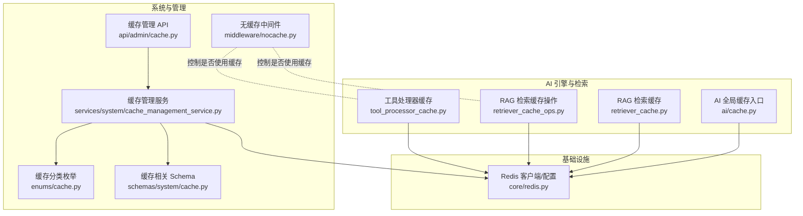
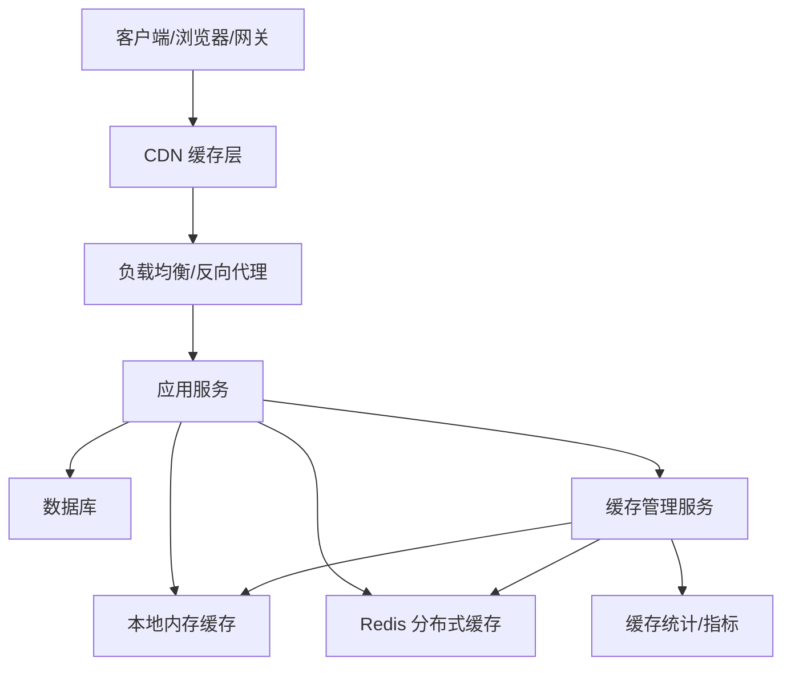
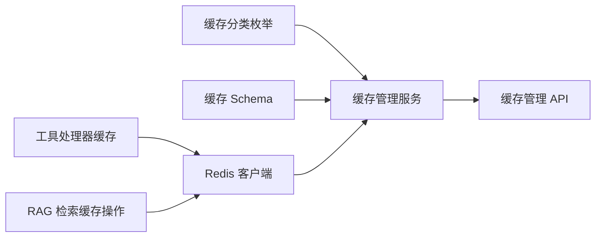
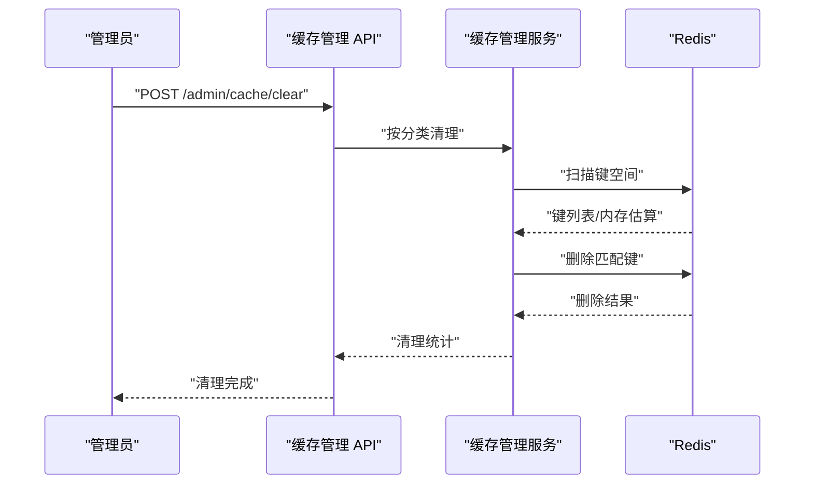

# 缓存策略

<cite>
**本文引用的文件**
- [backend/app/ai/cache.py](file://backend/app/ai/cache.py)
- [backend/app/ai/engine/tool_processor_cache.py](file://backend/app/ai/engine/tool_processor_cache.py)
- [backend/app/ai/rag/retriever_cache.py](file://backend/app/ai/rag/retriever_cache.py)
- [backend/app/ai/rag/retriever_cache_ops.py](file://backend/app/ai/rag/retriever_cache_ops.py)
- [backend/app/api/admin/cache.py](file://backend/app/api/admin/cache.py)
- [backend/app/enums/cache.py](file://backend/app/enums/cache.py)
- [backend/app/middleware/nocache.py](file://backend/app/middleware/nocache.py)
- [backend/app/schemas/system/cache.py](file://backend/app/schemas/system/cache.py)
- [backend/app/services/system/cache_management_service.py](file://backend/app/services/system/cache_management_service.py)
- [backend/app/core/redis.py](file://backend/app/core/redis.py)
</cite>

## 目录
1. [引言](#引言)
2. [项目结构](#项目结构)
3. [核心组件](#核心组件)
4. [架构总览](#架构总览)
5. [详细组件分析](#详细组件分析)
6. [依赖关系分析](#依赖关系分析)
7. [性能考量](#性能考量)
8. [故障排查指南](#故障排查指南)
9. [结论](#结论)
10. [附录](#附录)

## 引言
本文件面向 NovusAI SaaS 的缓存体系，系统性梳理 Redis 分布式缓存、本地内存缓存与配置内存缓存的协同设计，明确缓存键命名规范、序列化策略、过期时间管理、多级缓存协调、缓存失效与预热、一致性保障、穿透与雪崩防护、性能监控与容量规划，并给出配置参数、集群部署与故障转移建议，以及缓存与数据库的交互与同步机制。

## 项目结构
后端中与缓存直接相关的核心模块分布如下：
- AI 引擎与检索缓存：工具执行缓存、RAG 检索缓存
- 系统缓存管理：缓存分类枚举、缓存管理服务、缓存管理 API
- 中间件：无缓存中间件（用于特定场景禁用缓存）
- Redis 核心：Redis 客户端与连接配置
- 前端与 CDN：未在本仓库中直接体现，但可作为外部缓存层参与静态资源与响应缓存

图表来源
- [backend/app/ai/engine/tool_processor_cache.py](file://backend/app/ai/engine/tool_processor_cache.py)
- [backend/app/ai/rag/retriever_cache_ops.py](file://backend/app/ai/rag/retriever_cache_ops.py)
- [backend/app/ai/rag/retriever_cache.py](file://backend/app/ai/rag/retriever_cache.py)
- [backend/app/ai/cache.py](file://backend/app/ai/cache.py)
- [backend/app/enums/cache.py](file://backend/app/enums/cache.py)
- [backend/app/schemas/system/cache.py](file://backend/app/schemas/system/cache.py)
- [backend/app/services/system/cache_management_service.py](file://backend/app/services/system/cache_management_service.py)
- [backend/app/api/admin/cache.py](file://backend/app/api/admin/cache.py)
- [backend/app/middleware/nocache.py](file://backend/app/middleware/nocache.py)
- [backend/app/core/redis.py](file://backend/app/core/redis.py)

章节来源
- [backend/app/ai/cache.py](file://backend/app/ai/cache.py)
- [backend/app/ai/engine/tool_processor_cache.py](file://backend/app/ai/engine/tool_processor_cache.py)
- [backend/app/ai/rag/retriever_cache.py](file://backend/app/ai/rag/retriever_cache.py)
- [backend/app/ai/rag/retriever_cache_ops.py](file://backend/app/ai/rag/retriever_cache_ops.py)
- [backend/app/api/admin/cache.py](file://backend/app/api/admin/cache.py)
- [backend/app/enums/cache.py](file://backend/app/enums/cache.py)
- [backend/app/middleware/nocache.py](file://backend/app/middleware/nocache.py)
- [backend/app/schemas/system/cache.py](file://backend/app/schemas/system/cache.py)
- [backend/app/services/system/cache_management_service.py](file://backend/app/services/system/cache_management_service.py)
- [backend/app/core/redis.py](file://backend/app/core/redis.py)

## 核心组件
- 缓存分类与管理
  - 缓存分类枚举定义了各类缓存域（如 AI 响应、AI Schema、KB 搜索、WS 配置、插件更新等），为缓存清理与统计提供统一维度。
  - 缓存管理服务负责扫描与清理指定分类的缓存键，聚合统计缓存大小与键数量，并支持格式化输出。
  - 缓存管理 API 提供管理员端的缓存摘要查询与按分类批量清理能力。
- 工具执行缓存（只读）
  - 对某些只读工具调用进行去重与命中缓存，避免重复计算；缓存键包含函数名、规范化参数与会话标识，命中后直接返回缓存结果。
- RAG 检索缓存
  - 针对检索阶段的结果进行缓存，减少重复向量检索与排序开销；支持缓存键生成与读写操作封装。
- 本地/配置内存缓存
  - 配置内存缓存作为进程内缓存，用于高频读取且无需跨进程共享的数据；缓存管理服务提供独立清理与统计逻辑。
- Redis 分布式缓存
  - 所有需要跨进程/跨实例共享的缓存均通过 Redis 实现；缓存管理服务通过 Redis 客户端扫描键空间、估算内存占用并删除键。
- 无缓存中间件
  - 在特定请求或调试场景下禁用缓存，确保数据新鲜度与问题定位。

章节来源
- [backend/app/enums/cache.py](file://backend/app/enums/cache.py)
- [backend/app/schemas/system/cache.py](file://backend/app/schemas/system/cache.py)
- [backend/app/services/system/cache_management_service.py](file://backend/app/services/system/cache_management_service.py)
- [backend/app/api/admin/cache.py](file://backend/app/api/admin/cache.py)
- [backend/app/ai/engine/tool_processor_cache.py](file://backend/app/ai/engine/tool_processor_cache.py)
- [backend/app/ai/rag/retriever_cache.py](file://backend/app/ai/rag/retriever_cache.py)
- [backend/app/ai/rag/retriever_cache_ops.py](file://backend/app/ai/rag/retriever_cache_ops.py)
- [backend/app/middleware/nocache.py](file://backend/app/middleware/nocache.py)
- [backend/app/core/redis.py](file://backend/app/core/redis.py)

## 架构总览
下图展示了缓存分层与交互：前端/网关可作为 CDN 层缓存静态资源与响应；应用层根据业务选择本地内存缓存或 Redis；系统侧提供统一的缓存分类与管理能力，支持按类清理与统计。

图表来源
- [backend/app/services/system/cache_management_service.py](file://backend/app/services/system/cache_management_service.py)
- [backend/app/core/redis.py](file://backend/app/core/redis.py)

## 详细组件分析

### 缓存键命名规范
- 工具执行只读缓存键
  - 规范化形式：函数名 + 参数 JSON 序列化（稳定排序）+ 会话标识片段
  - 作用：对相同输入在同一会话内的只读工具调用进行去重与命中
- RAG 检索缓存键
  - 由检索器操作模块生成，结合查询语句、上下文、模型参数等形成稳定键
- 配置内存缓存键
  - 由具体配置项决定，通常为字符串键或复合键，不涉及 Redis
- 缓存分类
  - 通过统一枚举定义分类，便于按域清理与统计

章节来源
- [backend/app/ai/engine/tool_processor_cache.py](file://backend/app/ai/engine/tool_processor_cache.py)
- [backend/app/ai/rag/retriever_cache_ops.py](file://backend/app/ai/rag/retriever_cache_ops.py)
- [backend/app/enums/cache.py](file://backend/app/enums/cache.py)

### 数据序列化策略
- 工具执行缓存参数序列化
  - 使用稳定排序与非 ASCII 转义的 JSON 序列化，保证键的一致性
- 其他缓存对象
  - 采用通用序列化方案（如 JSON 或二进制序列化），确保跨语言/跨进程兼容
- 注意事项
  - 字段顺序、编码与类型需保持一致，避免键冲突
  - 大对象建议压缩存储以节省内存与带宽

章节来源
- [backend/app/ai/engine/tool_processor_cache.py](file://backend/app/ai/engine/tool_processor_cache.py)

### 过期时间管理
- 工具执行只读缓存
  - 仅驻留于进程内缓存，生命周期随会话或执行状态机控制，不设置全局过期
- RAG 检索缓存
  - 由检索器操作模块统一管理 TTL；热点查询可设置较短 TTL 以平衡命中率与新鲜度
- 配置内存缓存
  - 由配置驱动的缓存策略管理，支持按分类设置过期时间
- Redis 缓存
  - 通过缓存管理服务统一扫描与清理，TTL 可按分类策略动态调整

章节来源
- [backend/app/ai/engine/tool_processor_cache.py](file://backend/app/ai/engine/tool_processor_cache.py)
- [backend/app/ai/rag/retriever_cache_ops.py](file://backend/app/ai/rag/retriever_cache_ops.py)
- [backend/app/services/system/cache_management_service.py](file://backend/app/services/system/cache_management_service.py)

### 多级缓存设计与协调
- 本地缓存（进程内）
  - 高频、低延迟、低共享需求的缓存，适合工具执行只读缓存与配置内存缓存
- 分布式缓存（Redis）
  - 跨实例共享、持久化与高可用场景，适合 AI 响应、KB 搜索、市场数据等
- CDN 缓存（外部）
  - 静态资源与公共响应缓存，降低边缘延迟与源站压力
- 协调机制
  - 读路径优先查本地，再查 Redis，最后回源；写路径同时更新多级并设置合理 TTL
  - 管理端按分类清理，避免脏数据长期存在

章节来源
- [backend/app/ai/engine/tool_processor_cache.py](file://backend/app/ai/engine/tool_processor_cache.py)
- [backend/app/ai/rag/retriever_cache.py](file://backend/app/ai/rag/retriever_cache.py)
- [backend/app/services/system/cache_management_service.py](file://backend/app/services/system/cache_management_service.py)

### 缓存失效策略
- 主动失效
  - 通过缓存管理 API 按分类批量清理；清理完成后立即生效
- 被动失效
  - 基于 TTL 的自然过期；对热点数据设置随机抖动以避免集中过期
- 写后失效
  - 更新数据时同步删除相关缓存键，确保一致性

章节来源
- [backend/app/api/admin/cache.py](file://backend/app/api/admin/cache.py)
- [backend/app/services/system/cache_management_service.py](file://backend/app/services/system/cache_management_service.py)
- [backend/app/enums/cache.py](file://backend/app/enums/cache.py)

### 缓存预热与热点处理
- 预热
  - 在流量高峰前对热点键进行预加载；可通过定时任务或启动流程触发
- 热点处理
  - 对热点键设置更短 TTL 并增加副本/分片；必要时引入二级缓存或本地热点池
  - 对频繁访问的只读工具调用启用进程内缓存

章节来源
- [backend/app/ai/engine/tool_processor_cache.py](file://backend/app/ai/engine/tool_processor_cache.py)
- [backend/app/ai/rag/retriever_cache_ops.py](file://backend/app/ai/rag/retriever_cache_ops.py)

### 缓存一致性保证
- 读写分离
  - 写路径先更新数据库，再删除/失效相关缓存键；读路径优先命中缓存，未命中再回源
- 版本号/ETag
  - 对可变资源附加版本信息，客户端/CDN 根据版本判断是否使用缓存
- 事务与幂等
  - 缓存更新遵循幂等原则，避免并发写导致的脏读

章节来源
- [backend/app/services/system/cache_management_service.py](file://backend/app/services/system/cache_management_service.py)

### 缓存穿透防护
- 空值缓存
  - 对不存在的键也写入空值占位，设置短 TTL，防止持续穿透
- 布隆过滤器
  - 在进入后端前对查询键进行过滤，减少无效请求到达缓存层

章节来源
- [backend/app/services/system/cache_management_service.py](file://backend/app/services/system/cache_management_service.py)

### 缓存雪崩预防
- TTL 随机化
  - 对同一类缓存键设置随机抖动，避免同时过期
- 降级与熔断
  - 当缓存层异常时快速失败并回源，保护数据库
- 多级冗余
  - 本地缓存 + Redis + CDN 三层冗余，任一层失效不影响整体可用性

章节来源
- [backend/app/services/system/cache_management_service.py](file://backend/app/services/system/cache_management_service.py)

### 性能监控、命中率分析与容量规划
- 监控指标
  - 命中率、请求延迟、缓存键数量、内存使用、清理耗时
- 命中率分析
  - 按分类统计命中率，识别低效键与热点键；优化键设计与 TTL
- 容量规划
  - 基于键数量与对象大小估算内存占用；预留 20%-30% 安全余量
  - 结合淘汰策略（如 LRU/LFU）与最大内存限制，避免 OOM

章节来源
- [backend/app/services/system/cache_management_service.py](file://backend/app/services/system/cache_management_service.py)
- [backend/app/schemas/system/cache.py](file://backend/app/schemas/system/cache.py)

### 缓存配置参数、集群部署与故障转移
- 配置参数
  - Redis 连接池大小、超时时间、序列化方式、TTL 默认值与分类覆盖
  - 本地缓存容量上限、过期策略、回收策略
  - CDN 缓存策略（TTL、缓存标签、刷新接口）
- 集群部署
  - Redis 使用主从复制与哨兵/集群模式，开启 AOF/RDB 持久化
  - 应用节点水平扩展，配合一致性哈希或分片策略提升命中率
- 故障转移
  - 自动故障检测与切换；缓存层降级回源，保证服务连续性

章节来源
- [backend/app/core/redis.py](file://backend/app/core/redis.py)
- [backend/app/services/system/cache_management_service.py](file://backend/app/services/system/cache_management_service.py)

### 缓存与数据库的交互模式与数据同步
- 读路径
  - 先查缓存，未命中则查数据库并回填缓存
- 写路径
  - 先更新数据库，再删除/失效相关缓存键
- 同步机制
  - 事件驱动或定时任务同步配置类缓存；对强一致场景采用写后失效策略

章节来源
- [backend/app/services/system/cache_management_service.py](file://backend/app/services/system/cache_management_service.py)
- [backend/app/ai/engine/tool_processor_cache.py](file://backend/app/ai/engine/tool_processor_cache.py)
- [backend/app/ai/rag/retriever_cache_ops.py](file://backend/app/ai/rag/retriever_cache_ops.py)

## 依赖关系分析
- 组件耦合
  - 工具执行缓存与检索缓存依赖 Redis 客户端；缓存管理服务依赖 Redis 与分类枚举
  - 缓存管理 API 依赖缓存管理服务与 Schema
- 外部依赖
  - Redis 作为唯一外部缓存存储；CDN 为外部缓存层
- 循环依赖
  - 未发现循环导入；模块职责清晰

图表来源
- [backend/app/enums/cache.py](file://backend/app/enums/cache.py)
- [backend/app/schemas/system/cache.py](file://backend/app/schemas/system/cache.py)
- [backend/app/services/system/cache_management_service.py](file://backend/app/services/system/cache_management_service.py)
- [backend/app/api/admin/cache.py](file://backend/app/api/admin/cache.py)
- [backend/app/ai/engine/tool_processor_cache.py](file://backend/app/ai/engine/tool_processor_cache.py)
- [backend/app/ai/rag/retriever_cache_ops.py](file://backend/app/ai/rag/retriever_cache_ops.py)
- [backend/app/core/redis.py](file://backend/app/core/redis.py)

章节来源
- [backend/app/enums/cache.py](file://backend/app/enums/cache.py)
- [backend/app/schemas/system/cache.py](file://backend/app/schemas/system/cache.py)
- [backend/app/services/system/cache_management_service.py](file://backend/app/services/system/cache_management_service.py)
- [backend/app/api/admin/cache.py](file://backend/app/api/admin/cache.py)
- [backend/app/ai/engine/tool_processor_cache.py](file://backend/app/ai/engine/tool_processor_cache.py)
- [backend/app/ai/rag/retriever_cache_ops.py](file://backend/app/ai/rag/retriever_cache_ops.py)
- [backend/app/core/redis.py](file://backend/app/core/redis.py)

## 性能考量
- 键设计
  - 短小、稳定、可读性强；避免过长前缀与无意义字符
- TTL 策略
  - 动态 TTL：热门内容短 TTL，冷门内容长 TTL；对热点设置抖动
- 清理策略
  - 定时扫描与批量清理；按分类统计与告警阈值触发
- 压缩与序列化
  - 大对象启用压缩；序列化保持稳定与高效
- 监控与容量
  - 持续观测命中率、内存使用与清理耗时；预留安全余量

## 故障排查指南
- 缓存清理无效
  - 检查分类枚举是否正确；确认 Redis 连接与权限；查看清理耗时与键数量
- 命中率低
  - 分析键设计与 TTL；检查是否存在大量空值缓存；评估热点键抖动
- 缓存穿透
  - 确认空值占位与布隆过滤器配置；检查查询键合法性
- 缓存雪崩
  - 检查 TTL 抖动与降级策略；评估故障转移链路
- 本地缓存异常
  - 检查进程内缓存容量与回收策略；核对工具执行缓存键生成逻辑

章节来源
- [backend/app/services/system/cache_management_service.py](file://backend/app/services/system/cache_management_service.py)
- [backend/app/api/admin/cache.py](file://backend/app/api/admin/cache.py)
- [backend/app/ai/engine/tool_processor_cache.py](file://backend/app/ai/engine/tool_processor_cache.py)

## 结论
本缓存策略以 Redis 为核心，结合本地内存缓存与配置内存缓存，形成多级协同的高性能缓存体系。通过统一的缓存分类与管理能力，实现精细化的清理、统计与容量规划；通过合理的键设计、序列化与 TTL 策略，兼顾命中率与一致性；通过穿透与雪崩防护、故障转移与降级机制，保障系统稳定性与可用性。

## 附录
- 缓存分类清单（示例）
  - AI 响应、AI Schema、AI SQL 结果、AI 行动速率、KB 搜索、WS 配置、市场数据、AI Provider 健康、图片缓存、配置内存、AI 限流、Celery 结果、验证码、插件更新
- 关键流程时序（缓存清理）

图表来源
- [backend/app/api/admin/cache.py](file://backend/app/api/admin/cache.py)
- [backend/app/services/system/cache_management_service.py](file://backend/app/services/system/cache_management_service.py)
- [backend/app/core/redis.py](file://backend/app/core/redis.py)