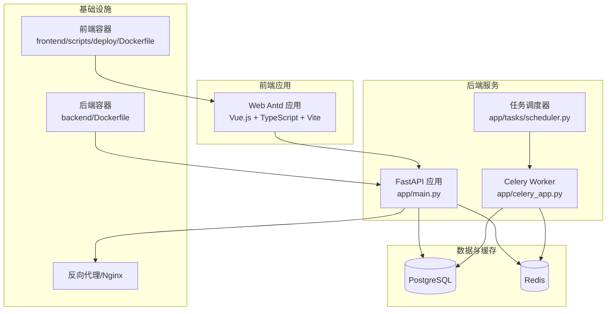
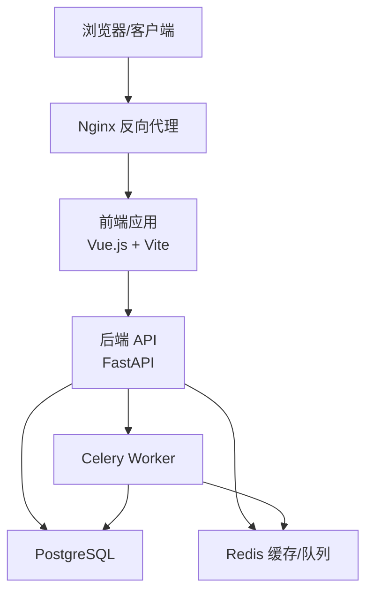
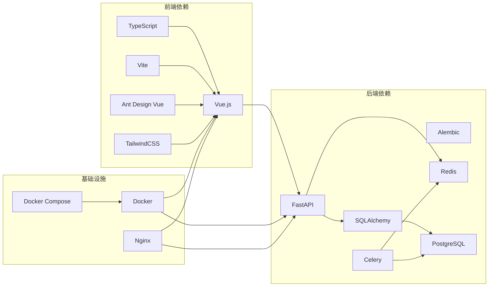

# 技术栈架构

<cite>
**本文档引用的文件**
- [backend/pyproject.toml](file://backend/pyproject.toml)
- [backend/Dockerfile](file://backend/Dockerfile)
- [backend/alembic.ini](file://backend/alembic.ini)
- [frontend/package.json](file://frontend/package.json)
- [frontend/apps/web-antd/package.json](file://frontend/apps/web-antd/package.json)
- [docker-compose.dev.yml](file://docker-compose.dev.yml)
- [docker-compose.prod.yml](file://docker-compose.prod.yml)
- [backend/app/main.py](file://backend/app/main.py)
- [backend/app/celery_app.py](file://backend/app/celery_app.py)
- [backend/app/core/database.py](file://backend/app/core/database.py)
- [backend/app/core/redis.py](file://backend/app/core/redis.py)
- [backend/app/tasks/scheduler.py](file://backend/app/tasks/scheduler.py)
- [backend/app/api/v1/__init__.py](file://backend/app/api/v1/__init__.py)
- [frontend/src/main.ts](file://frontend/src/main.ts)
- [frontend/vite.config.mts](file://frontend/vite.config.mts)
- [frontend/tsconfig.json](file://frontend/tsconfig.json)
</cite>

## 目录
1. [简介](#简介)
2. [项目结构](#项目结构)
3. [核心组件](#核心组件)
4. [架构总览](#架构总览)
5. [详细组件分析](#详细组件分析)
6. [依赖分析](#依赖分析)
7. [性能考虑](#性能考虑)
8. [故障排除指南](#故障排除指南)
9. [结论](#结论)
10. [附录](#附录)

## 简介
本技术栈架构文档面向 NovusAI SaaS 项目的后端、前端与基础设施层，系统梳理并解释所采用的核心技术栈选择、版本兼容性、依赖关系与升级策略，并提供最佳实践与替代方案对比建议。文档同时给出可视化架构图与流程图，帮助不同背景读者快速理解系统设计。

## 项目结构
项目采用前后端分离架构，后端以 Python 为核心，前端基于 Vue.js 生态，基础设施通过 Docker 容器化部署，数据库采用 PostgreSQL，消息队列与任务调度结合 Redis 与 Celery，API 层由 FastAPI 提供高性能服务接口。

**图表来源**
- [backend/app/main.py:1-50](file://backend/app/main.py#L1-L50)
- [backend/app/celery_app.py:1-50](file://backend/app/celery_app.py#L1-L50)
- [backend/app/tasks/scheduler.py:1-50](file://backend/app/tasks/scheduler.py#L1-L50)
- [backend/Dockerfile:1-100](file://backend/Dockerfile#L1-L100)
- [docker-compose.dev.yml:1-200](file://docker-compose.dev.yml#L1-L200)
- [docker-compose.prod.yml:1-200](file://docker-compose.prod.yml#L1-L200)

**章节来源**
- [backend/pyproject.toml:1-200](file://backend/pyproject.toml#L1-L200)
- [frontend/package.json:1-200](file://frontend/package.json#L1-L200)
- [docker-compose.dev.yml:1-200](file://docker-compose.dev.yml#L1-L200)
- [docker-compose.prod.yml:1-200](file://docker-compose.prod.yml#L1-L200)

## 核心组件
- 后端技术栈：FastAPI（高性能 ASGI 框架）、SQLAlchemy（ORM）、Alembic（数据库迁移）、Celery（分布式任务队列）、Redis（缓存与消息中间件）、PostgreSQL（关系型数据库）
- 前端技术栈：Vue.js（渐进式框架）、TypeScript（类型安全）、Vite（构建工具）、TailwindCSS（样式框架）、Ant Design Vue（UI 组件库）
- 基础设施：Docker（容器化）、Nginx（反向代理与静态资源）、Docker Compose（多容器编排）

**章节来源**
- [backend/pyproject.toml:1-200](file://backend/pyproject.toml#L1-L200)
- [frontend/package.json:1-200](file://frontend/package.json#L1-L200)
- [backend/alembic.ini:1-100](file://backend/alembic.ini#L1-L100)

## 架构总览
系统采用“前端单页应用 + 后端 API + 数据与缓存 + 基础设施”的分层架构。前端通过 HTTP/HTTPS 与后端交互；后端通过 SQLAlchemy 访问 PostgreSQL，通过 Redis 实现缓存与异步任务队列；Celery Worker 从 Redis 消费任务并执行；Docker Compose 将各组件编排为可部署的服务。

**图表来源**
- [docker-compose.prod.yml:1-200](file://docker-compose.prod.yml#L1-L200)
- [backend/app/main.py:1-50](file://backend/app/main.py#L1-L50)
- [backend/app/celery_app.py:1-50](file://backend/app/celery_app.py#L1-L50)

## 详细组件分析

### 后端技术栈

#### FastAPI
- 作用：提供高性能、自动生成 OpenAPI 文档的 Web API，支持异步路由与依赖注入。
- 选择原因：类型标注驱动的自动校验、极佳的开发体验与运行时性能，适合构建复杂 AI 能力的 SaaS 平台。
- 典型应用场景：用户认证、租户管理、AI 能力路由、插件市场 API、系统配置管理等。
- 版本与兼容性：基于 pyproject.toml 中的依赖声明进行版本锁定，确保与 SQLAlchemy、Celery、Redis 等生态兼容。
- 升级策略：遵循语义化版本，优先在测试环境验证 OpenAPI 变更与路由行为，再灰度发布。

**章节来源**
- [backend/app/main.py:1-100](file://backend/app/main.py#L1-L100)
- [backend/app/api/v1/__init__.py:1-50](file://backend/app/api/v1/__init__.py#L1-L50)
- [backend/pyproject.toml:1-200](file://backend/pyproject.toml#L1-L200)

#### SQLAlchemy 与 Alembic
- 作用：ORM 映射与数据库迁移管理，支持复杂模型与多租户架构。
- 选择原因：Python 生态成熟、类型安全、与 FastAPI 依赖注入无缝集成。
- 典型应用场景：用户、租户、AI 模型、知识库、配额与用量统计等模型定义与迁移。
- 版本与兼容性：通过 Alembic 配置文件与迁移脚本保持数据库演进一致性。
- 升级策略：迁移脚本需向后兼容，先在开发环境验证，再在预生产环境灰度。

**章节来源**
- [backend/app/core/database.py:1-100](file://backend/app/core/database.py#L1-L100)
- [backend/alembic.ini:1-100](file://backend/alembic.ini#L1-L100)
- [backend/migrations/versions/20260111_0001_initial.py:1-50](file://backend/migrations/versions/20260111_0001_initial.py#L1-L50)

#### Celery 与 Redis
- 作用：异步任务处理与后台作业调度，Redis 作为消息中间件与结果存储。
- 选择原因：成熟的分布式任务队列解决方案，适合 AI 推理、通知、清理等耗时任务。
- 典型应用场景：定时任务、邮件发送、回收站清理、SSL 证书检查、插件生命周期维护等。
- 版本与兼容性：Celery 配置与任务模块需与 Redis 版本匹配，注意序列化与超时设置。
- 升级策略：先升级 Redis，再升级 Celery，最后回滚测试，确保任务队列稳定。

**章节来源**
- [backend/app/celery_app.py:1-100](file://backend/app/celery_app.py#L1-L100)
- [backend/app/tasks/scheduler.py:1-100](file://backend/app/tasks/scheduler.py#L1-L100)
- [backend/app/core/redis.py:1-100](file://backend/app/core/redis.py#L1-L100)

#### 数据库与缓存
- PostgreSQL：关系型主数据存储，支持复杂查询与事务一致性。
- Redis：缓存、会话存储、任务队列与发布订阅，提升响应速度与削峰填谷。

**章节来源**
- [backend/app/core/database.py:1-100](file://backend/app/core/database.py#L1-L100)
- [backend/app/core/redis.py:1-100](file://backend/app/core/redis.py#L1-L100)

### 前端技术栈

#### Vue.js + TypeScript + Vite
- 作用：构建现代化、类型安全的单页应用，支持插件化与主题定制。
- 选择原因：生态完善、开发效率高、TypeScript 提升代码质量与可维护性。
- 典型应用场景：租户控制台、AI 能力展示、插件市场、用户偏好与国际化界面。
- 版本与兼容性：通过 package.json 锁定版本，Vite 提供热更新与快速打包。
- 升级策略：先升级 Vite 与 Vue，再升级 TypeScript，最后验证插件与 UI 组件。

**章节来源**
- [frontend/package.json:1-200](file://frontend/package.json#L1-L200)
- [frontend/apps/web-antd/package.json:1-200](file://frontend/apps/web-antd/package.json#L1-L200)
- [frontend/vite.config.mts:1-100](file://frontend/vite.config.mts#L1-L100)
- [frontend/tsconfig.json:1-100](file://frontend/tsconfig.json#L1-L100)

#### UI 与样式
- Ant Design Vue：企业级 UI 组件库，提供丰富的业务组件。
- TailwindCSS：原子化样式框架，便于主题定制与响应式布局。

**章节来源**
- [frontend/package.json:1-200](file://frontend/package.json#L1-L200)

### 基础设施技术栈

#### Docker 与 Docker Compose
- 作用：容器化后端与前端，统一开发、测试与生产环境。
- 选择原因：隔离性强、部署一致、便于扩展与回滚。
- 典型应用场景：本地开发、CI/CD 流水线、生产环境编排。
- 版本与兼容性：镜像基础镜像版本需与宿主机内核与 Docker 引擎兼容。
- 升级策略：先在 dev 环境验证镜像构建与依赖，再逐步推广到 prod。

**章节来源**
- [backend/Dockerfile:1-100](file://backend/Dockerfile#L1-L100)
- [docker-compose.dev.yml:1-200](file://docker-compose.dev.yml#L1-L200)
- [docker-compose.prod.yml:1-200](file://docker-compose.prod.yml#L1-L200)

#### Nginx
- 作用：反向代理、静态资源服务、TLS 终止与负载均衡。
- 选择原因：成熟稳定、性能优异、社区生态丰富。
- 典型应用场景：前端静态资源托管、API 路由转发、健康检查入口。
- 升级策略：先在测试环境验证配置变更，再灰度切换。

**章节来源**
- [docker-compose.prod.yml:1-200](file://docker-compose.prod.yml#L1-L200)

## 依赖分析

**图表来源**
- [backend/pyproject.toml:1-200](file://backend/pyproject.toml#L1-L200)
- [frontend/package.json:1-200](file://frontend/package.json#L1-L200)
- [docker-compose.prod.yml:1-200](file://docker-compose.prod.yml#L1-L200)

**章节来源**
- [backend/pyproject.toml:1-200](file://backend/pyproject.toml#L1-L200)
- [frontend/package.json:1-200](file://frontend/package.json#L1-L200)

## 性能考虑
- API 性能：利用 FastAPI 的异步特性与依赖注入减少重复逻辑，配合中间件实现限流与审计日志。
- 数据库性能：合理索引、连接池配置、读写分离与分表分库策略；使用 SQLAlchemy ORM 时避免 N+1 查询。
- 缓存策略：热点数据缓存、过期时间与失效策略、缓存穿透与击穿防护；Redis 使用持久化与主从复制保障可用性。
- 任务队列：任务拆分与优先级、重试与死信队列、Worker 数量与并发控制。
- 前端性能：Vite 构建优化、按需加载与懒加载、图片与字体优化、Service Worker 缓存策略。
- 基础设施：容器资源限制与健康检查、Nginx 连接数与缓冲区调优、CDN 加速静态资源。

## 故障排除指南
- API 无法启动：检查端口占用、环境变量、数据库连接字符串与 Alembic 迁移状态。
- 数据库异常：确认 PostgreSQL 服务状态、连接池大小、慢查询日志与备份策略。
- Redis 连接失败：检查网络连通性、认证配置、内存上限与持久化策略。
- Celery 任务堆积：监控队列长度、Worker 并发、任务耗时分布，必要时扩容或优化任务逻辑。
- 前端页面空白：检查构建产物、静态资源路径、跨域配置与浏览器控制台错误。
- Docker 部署失败：查看容器日志、卷挂载权限、网络模式与环境变量映射。

**章节来源**
- [backend/app/main.py:1-100](file://backend/app/main.py#L1-L100)
- [backend/app/core/database.py:1-100](file://backend/app/core/database.py#L1-L100)
- [backend/app/core/redis.py:1-100](file://backend/app/core/redis.py#L1-L100)
- [backend/app/celery_app.py:1-100](file://backend/app/celery_app.py#L1-L100)
- [docker-compose.prod.yml:1-200](file://docker-compose.prod.yml#L1-L200)

## 结论
本技术栈围绕“高性能 API + 类型安全前端 + 容器化基础设施”构建，兼顾开发效率与运行时性能。通过明确的依赖关系与升级策略，可在保证稳定性的同时持续演进。建议在每次重大升级前进行充分的测试与演练，确保平滑过渡。

## 附录

### 版本兼容性与升级策略要点
- 后端：Python 版本与第三方库版本需在 pyproject.toml 中统一约束；FastAPI、SQLAlchemy、Celery、Redis、PostgreSQL 的兼容矩阵需在 CI 中验证。
- 前端：Vite、Vue、TypeScript 版本升级需逐项验证构建与运行时行为；UI 组件库升级需关注破坏性变更。
- 基础设施：Docker 与 Docker Compose 版本需与宿主机内核兼容；Nginx 配置需在测试环境先行验证。

**章节来源**
- [backend/pyproject.toml:1-200](file://backend/pyproject.toml#L1-L200)
- [frontend/package.json:1-200](file://frontend/package.json#L1-L200)
- [docker-compose.prod.yml:1-200](file://docker-compose.prod.yml#L1-L200)