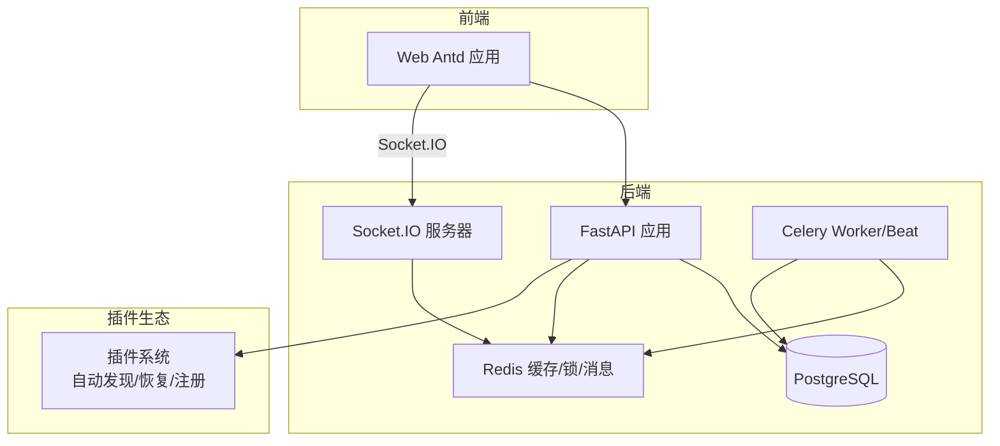
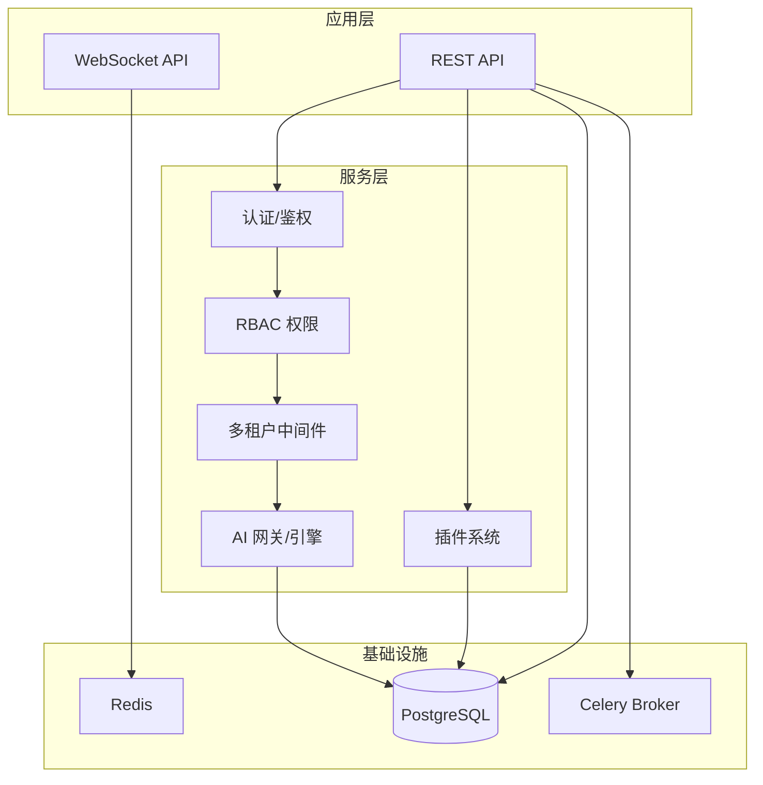
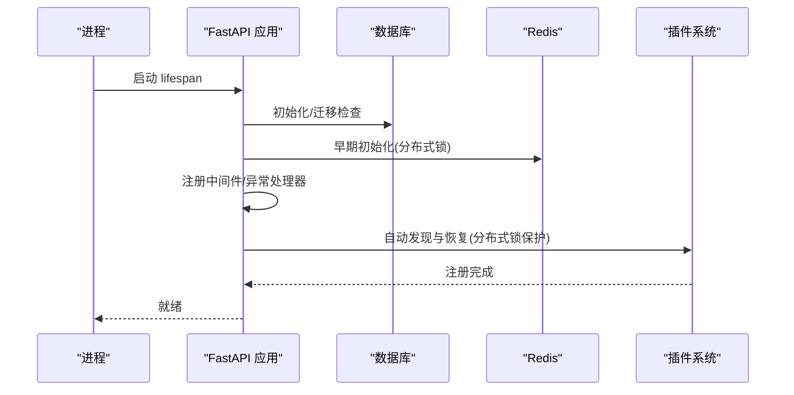
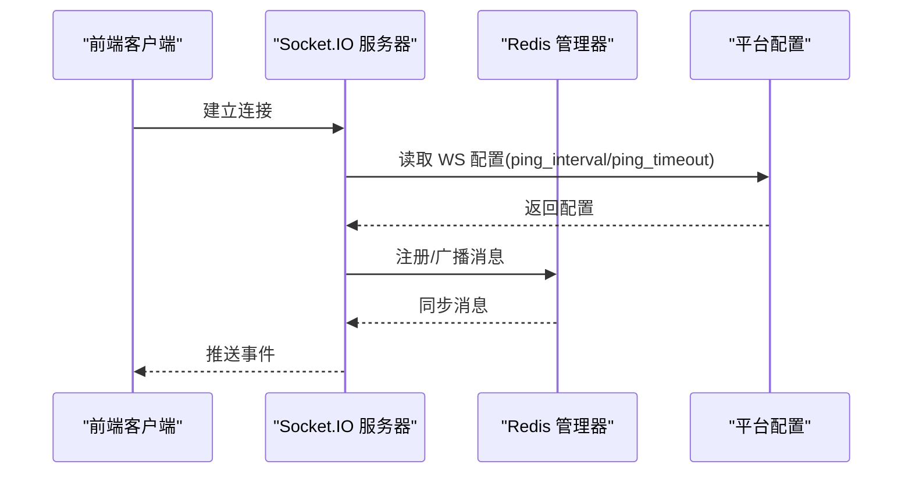
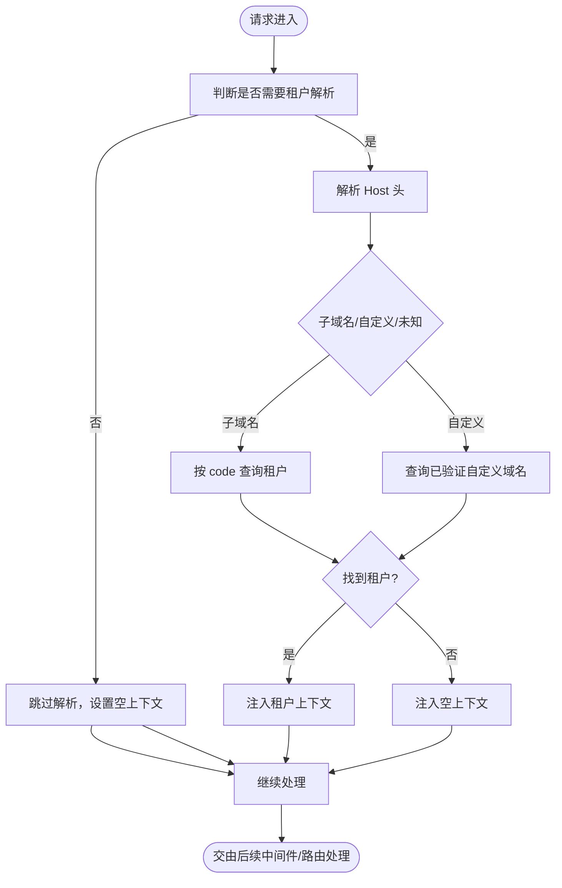
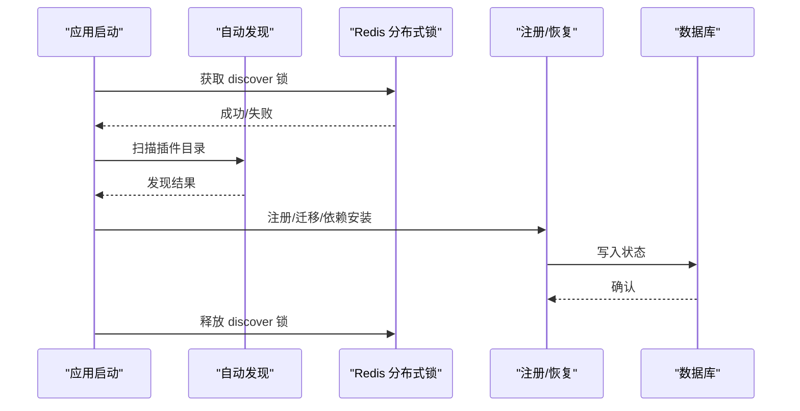
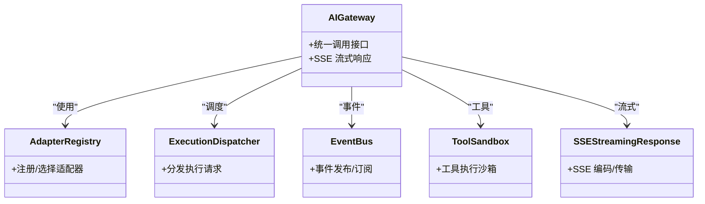
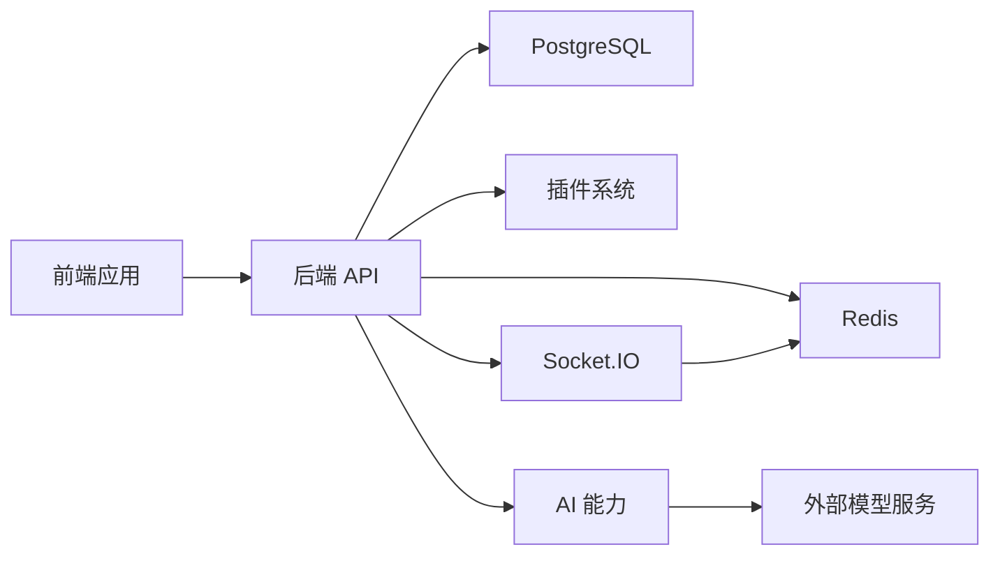

# 整体架构设计

<cite>
**本文引用的文件**
- [backend/app/main.py](file://backend/app/main.py)
- [backend/pyproject.toml](file://backend/pyproject.toml)
- [backend/Dockerfile](file://backend/Dockerfile)
- [frontend/apps/web-antd/package.json](file://frontend/apps/web-antd/package.json)
- [frontend/package.json](file://frontend/package.json)
- [backend/app/plugins/base.py](file://backend/app/plugins/base.py)
- [backend/app/core/socketio_server.py](file://backend/app/core/socketio_server.py)
- [backend/app/ai/__init__.py](file://backend/app/ai/__init__.py)
- [backend/app/ai/engine/__init__.py](file://backend/app/ai/engine/__init__.py)
- [backend/app/middleware/tenant.py](file://backend/app/middleware/tenant.py)
- [backend/app/plugins/startup.py](file://backend/app/plugins/startup.py)
- [backend/app/models/tenant/__init__.py](file://backend/app/models/tenant/__init__.py)
- [backend/app/schemas/tenant/__init__.py](file://backend/app/schemas/tenant/__init__.py)
</cite>

## 目录
1. [引言](#引言)
2. [项目结构](#项目结构)
3. [核心组件](#核心组件)
4. [架构总览](#架构总览)
5. [详细组件分析](#详细组件分析)
6. [依赖分析](#依赖分析)
7. [性能考虑](#性能考虑)
8. [故障排查指南](#故障排查指南)
9. [结论](#结论)
10. [附录](#附录)

## 引言
本文件面向 NovusAI SaaS 的整体架构设计，聚焦于系统高层架构模式与四大核心架构支柱：AI 能力集成架构、多租户管理架构、实时通信架构与插件扩展架构。文档化系统边界、组件职责、模块化设计原则、技术选型与权衡、集成模式、数据流与交互关系，并提供架构决策记录与演进路线图。

## 项目结构
系统采用前后端分离架构，后端以 FastAPI 为核心，提供 REST API、WebSocket、任务队列与插件体系；前端采用 Vite + Vue3 + Ant Design Vue 的现代化前端工程，通过 Socket.IO 客户端与后端实时通信。容器化部署支持 API、Worker、Beat 三种角色。

图表来源
- [backend/app/main.py:635-800](file://backend/app/main.py#L635-L800)
- [backend/app/core/socketio_server.py:1-88](file://backend/app/core/socketio_server.py#L1-L88)
- [backend/Dockerfile:55-69](file://backend/Dockerfile#L55-L69)
- [frontend/apps/web-antd/package.json:85-85](file://frontend/apps/web-antd/package.json#L85-L85)

章节来源
- [backend/app/main.py:635-800](file://backend/app/main.py#L635-L800)
- [backend/Dockerfile:1-69](file://backend/Dockerfile#L1-L69)
- [frontend/package.json:1-127](file://frontend/package.json#L1-L127)
- [frontend/apps/web-antd/package.json:1-101](file://frontend/apps/web-antd/package.json#L1-L101)

## 核心组件
- 应用入口与生命周期：FastAPI 应用创建、中间件注册、异常处理、就绪探针、Prometheus 指标、插件启动恢复。
- 实时通信：基于 Socket.IO 的多 Worker 支持，Redis 管理器实现消息广播与连接管理。
- 多租户：基于 Host 头的子域名/自定义域名解析，TenantMiddleware 将租户上下文注入请求状态。
- 插件系统：插件自动发现、注册、恢复、依赖安装与安全扫描，支持分布式锁保障启动一致性。
- AI 能力：统一网关与适配器、执行引擎、事件总线、SSE 流式响应与配额/并发限制。
- 前后端：前端通过 axios 与后端 REST 交互，Socket.IO 客户端实现实时通知与状态同步。

章节来源
- [backend/app/main.py:53-502](file://backend/app/main.py#L53-L502)
- [backend/app/core/socketio_server.py:1-88](file://backend/app/core/socketio_server.py#L1-L88)
- [backend/app/middleware/tenant.py:93-259](file://backend/app/middleware/tenant.py#L93-L259)
- [backend/app/plugins/startup.py:125-200](file://backend/app/plugins/startup.py#L125-L200)
- [backend/app/ai/__init__.py:1-137](file://backend/app/ai/__init__.py#L1-L137)
- [backend/app/ai/engine/__init__.py:1-66](file://backend/app/ai/engine/__init__.py#L1-L66)
- [frontend/apps/web-antd/package.json:85-85](file://frontend/apps/web-antd/package.json#L85-L85)

## 架构总览
系统采用“前后端分离 + 微服务化思想”的单体后端架构，通过模块化与插件化实现功能解耦与扩展。核心架构支柱如下：
- AI 能力集成：统一网关、适配器、执行引擎、事件与工具沙箱，支持 SSE 流式输出与配额/并发控制。
- 多租户管理：TenantMiddleware 解析租户上下文，贯穿鉴权、权限、配置与资源隔离。
- 实时通信：Socket.IO + Redis 管理器，支持多 Worker 部署下的消息同步与心跳配置。
- 插件扩展：插件自动发现、注册、恢复与依赖安装，支持分布式锁与安全扫描，保证启动一致性与安全性。

图表来源
- [backend/app/main.py:635-800](file://backend/app/main.py#L635-L800)
- [backend/app/core/socketio_server.py:1-88](file://backend/app/core/socketio_server.py#L1-L88)
- [backend/app/plugins/startup.py:125-200](file://backend/app/plugins/startup.py#L125-L200)
- [backend/app/ai/__init__.py:1-137](file://backend/app/ai/__init__.py#L1-L137)

## 详细组件分析

### 组件A：应用入口与生命周期（FastAPI）
- 职责：创建应用实例、注册中间件、异常处理、就绪/健康探针、Prometheus 指标、插件启动恢复、数据库/Redis 初始化。
- 关键点：lifespan 管理启动与关闭；中间件顺序影响权限预加载、审计日志与追踪；就绪探针依赖数据库与 Redis 健康检查。
- 性能与可靠性：异步生命周期、分布式锁保障权限/配置同步一致性；插件启动采用双阶段恢复，避免多 Worker 并发冲突。

图表来源
- [backend/app/main.py:53-502](file://backend/app/main.py#L53-L502)
- [backend/app/plugins/startup.py:125-200](file://backend/app/plugins/startup.py#L125-L200)

章节来源
- [backend/app/main.py:53-502](file://backend/app/main.py#L53-L502)
- [backend/app/plugins/startup.py:125-200](file://backend/app/plugins/startup.py#L125-L200)

### 组件B：实时通信（Socket.IO）
- 职责：提供全局 AsyncServer 实例，AsyncRedisManager 支持多 Worker；动态 CORS 策略；运行时 WS 配置应用。
- 关键点：与 FastAPI 通过 ASGI 集成；ping_interval/ping_timeout 可从平台配置动态调整；日志级别可配置。
- 性能与可靠性：Redis 管理器实现跨 Worker 消息同步；异常处理避免影响主流程。

图表来源
- [backend/app/core/socketio_server.py:1-88](file://backend/app/core/socketio_server.py#L1-L88)

章节来源
- [backend/app/core/socketio_server.py:1-88](file://backend/app/core/socketio_server.py#L1-L88)

### 组件C：多租户管理（TenantMiddleware）
- 职责：根据 Host 头解析租户上下文，支持子域名与自定义域名两种模式；将租户信息注入请求状态。
- 关键点：仅对特定路径前缀进行解析；自定义域名通过数据库 TenantDomain 表验证；子域名直接按 code 查询。
- 性能与可靠性：查询路径白名单减少不必要的解析；数据库查询带条件过滤无效租户。

图表来源
- [backend/app/middleware/tenant.py:120-223](file://backend/app/middleware/tenant.py#L120-L223)

章节来源
- [backend/app/middleware/tenant.py:93-259](file://backend/app/middleware/tenant.py#L93-L259)

### 组件D：插件扩展（插件系统）
- 职责：插件自动发现、注册、恢复、依赖安装与安全扫描；支持分布式锁保障启动一致性；提供生命周期钩子。
- 关键点：双阶段恢复（发现/恢复）；分布式锁避免多 Worker 并发；安全扫描与依赖状态校验；前端契约验证。
- 性能与可靠性：失败不影响其他插件；错误状态可自动修复；依赖缺失与版本漂移有明确提示。

图表来源
- [backend/app/plugins/startup.py:125-200](file://backend/app/plugins/startup.py#L125-L200)
- [backend/app/plugins/base.py:19-45](file://backend/app/plugins/base.py#L19-L45)

章节来源
- [backend/app/plugins/startup.py:1-200](file://backend/app/plugins/startup.py#L1-L200)
- [backend/app/plugins/base.py:1-45](file://backend/app/plugins/base.py#L1-L45)

### 组件E：AI 能力集成（网关/引擎/事件）
- 职责：统一 AI 调用接口、多供应商适配器、执行引擎（对话/任务/批处理）、事件总线、SSE 流式响应、配额/并发限制。
- 关键点：适配器注册与路由；执行计划/命令/结果协议；事件钩子；工具沙箱；SSE 编码器。
- 性能与可靠性：流式响应降低延迟感知；配额/并发限制保障稳定性；异常分类便于重试与降级。

图表来源
- [backend/app/ai/__init__.py:1-137](file://backend/app/ai/__init__.py#L1-L137)
- [backend/app/ai/engine/__init__.py:1-66](file://backend/app/ai/engine/__init__.py#L1-L66)

章节来源
- [backend/app/ai/__init__.py:1-137](file://backend/app/ai/__init__.py#L1-L137)
- [backend/app/ai/engine/__init__.py:1-66](file://backend/app/ai/engine/__init__.py#L1-L66)

### 组件F：前后端交互（REST/Socket.IO）
- 职责：前端通过 axios 与后端 REST API 交互；通过 socket.io-client 与后端 WebSocket 交互，接收实时通知与状态变更。
- 关键点：前端包管理与脚本；Socket.IO 客户端依赖；跨域与动态 CORS 策略由后端中间件处理。
- 性能与可靠性：SSE/WS 降低轮询成本；前端路由与状态管理与后端 API 约定一致。

章节来源
- [frontend/apps/web-antd/package.json:1-101](file://frontend/apps/web-antd/package.json#L1-L101)

## 依赖分析
- 技术栈与依赖：后端使用 FastAPI、SQLAlchemy、Redis、Celery、Socket.IO、OpenAI、pgvector、PyMuPDF 等；前端使用 Vue3、Ant Design Vue、axios、socket.io-client。
- 容器化：Dockerfile 定义 API/Worker/Beat 三类镜像，暴露 8000 端口，健康检查基于 /ready。
- 依赖关系：后端应用依赖数据库与 Redis；插件系统依赖配置与存储；AI 能力依赖适配器与外部模型服务；前端依赖后端 API 与 WebSocket。

图表来源
- [backend/pyproject.toml:23-110](file://backend/pyproject.toml#L23-L110)
- [backend/Dockerfile:55-69](file://backend/Dockerfile#L55-L69)
- [frontend/apps/web-antd/package.json:34-91](file://frontend/apps/web-antd/package.json#L34-L91)

章节来源
- [backend/pyproject.toml:1-239](file://backend/pyproject.toml#L1-L239)
- [backend/Dockerfile:1-69](file://backend/Dockerfile#L1-L69)
- [frontend/package.json:1-127](file://frontend/package.json#L1-L127)

## 性能考虑
- 启动性能：lifespan 中数据库/Redis 初始化与插件恢复采用分布式锁与双阶段策略，避免多 Worker 并发竞争。
- 实时性能：Socket.IO 使用 AsyncRedisManager，ping_interval/ping_timeout 可运行时调整；SSE 流式响应降低首字节延迟。
- AI 性能：执行引擎支持对话/任务/批处理多模式；配额/并发限制与重试策略提升稳定性。
- 前后端性能：前端按需引入依赖，Socket.IO 客户端按需连接，减少不必要的网络开销。

## 故障排查指南
- 启动失败：检查数据库连接与迁移状态、Redis 初始化、插件发现与恢复日志；关注分布式锁获取失败与权限/配置同步异常。
- 实时通信：确认 WS 配置（ping_interval/ping_timeout）与 CORS 策略；检查 Redis 连接与频道订阅。
- 多租户：核对 Host 头解析逻辑、子域名/自定义域名映射、租户状态与域名验证。
- 插件：查看插件清单验证、依赖状态、安全扫描结果与恢复阶段错误；必要时清理错误标记并重试。
- AI 能力：检查适配器可用性、SSE 编码器、事件钩子与工具沙箱状态；关注配额/并发限制触发。

章节来源
- [backend/app/main.py:476-486](file://backend/app/main.py#L476-L486)
- [backend/app/core/socketio_server.py:51-88](file://backend/app/core/socketio_server.py#L51-L88)
- [backend/app/middleware/tenant.py:120-223](file://backend/app/middleware/tenant.py#L120-L223)
- [backend/app/plugins/startup.py:125-200](file://backend/app/plugins/startup.py#L125-L200)

## 结论
NovusAI SaaS 采用前后端分离与插件化扩展的单体后端架构，结合 AI 能力集成、多租户管理、实时通信与插件系统四大支柱，实现了高内聚、低耦合与强扩展性的整体设计。通过 FastAPI、Socket.IO、Redis、PostgreSQL 与 Celery 的组合，系统在性能、可靠性与可维护性之间取得平衡，并为未来演进提供了清晰的扩展路径。

## 附录
- 架构决策记录
  - 技术选型：FastAPI 提供高性能 ASGI 服务；Socket.IO + Redis 实现实时通信；Redis 作为分布式锁与消息中间件；PostgreSQL 作为主数据存储；Celery 作为任务队列。
  - 权衡与约束：单体后端简化运维，插件化与模块化缓解复杂度；多 Worker 场景下通过分布式锁与 Redis 管理器保证一致性。
  - 系统边界：前端仅负责 UI 与实时交互；后端提供 API、实时、任务与插件能力；AI 能力通过适配器对接外部模型服务。
- 演进路线图
  - 短期：完善插件市场与依赖治理、增强 AI 能力监控与可观测性、优化启动恢复流程。
  - 中期：拆分后端为微服务（如独立 AI 服务、存储服务），保留插件化与多租户能力。
  - 长期：引入多云与边缘计算能力，增强 AI 能力的弹性与就近服务能力。