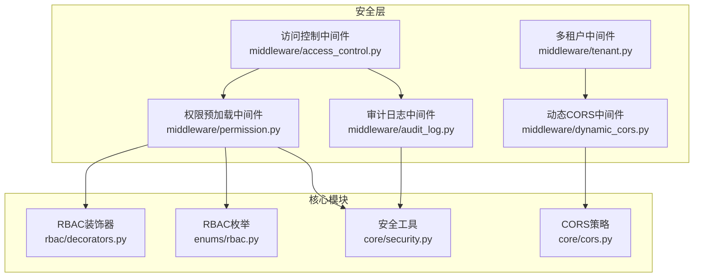
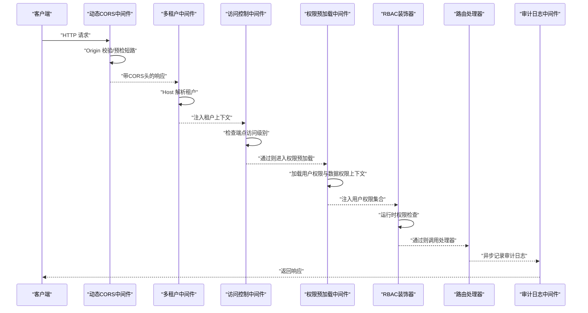
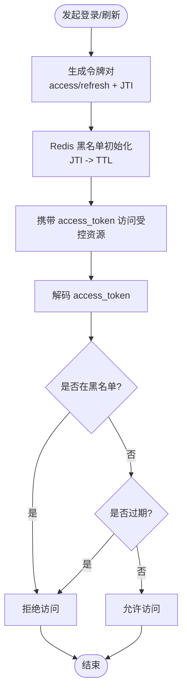
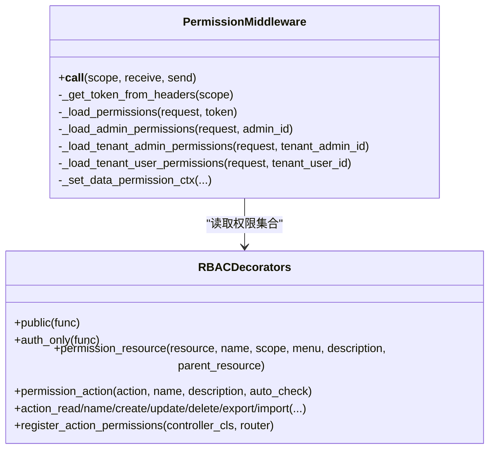
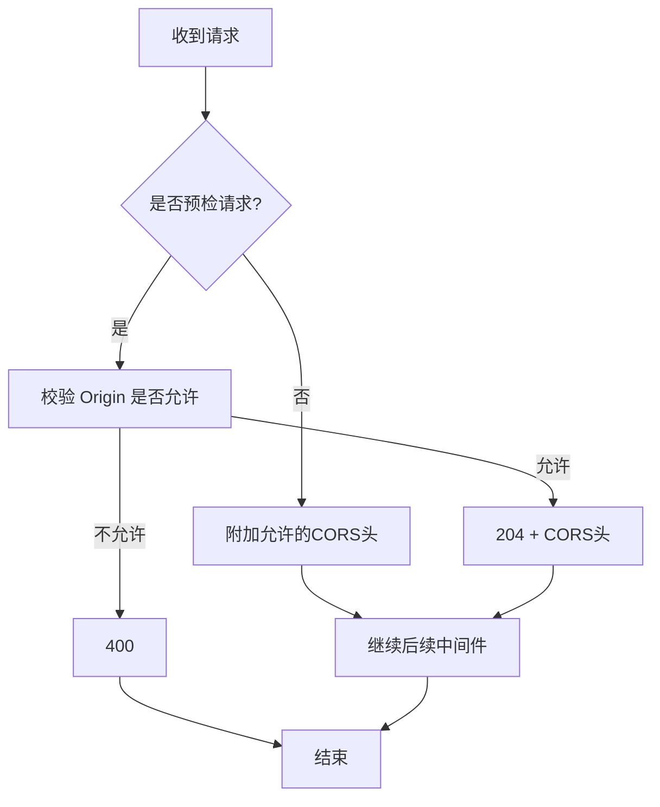
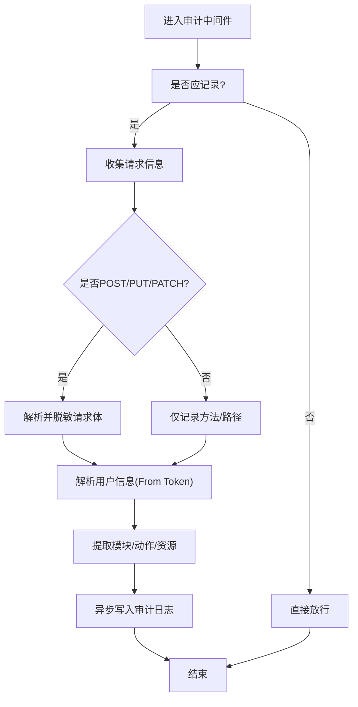
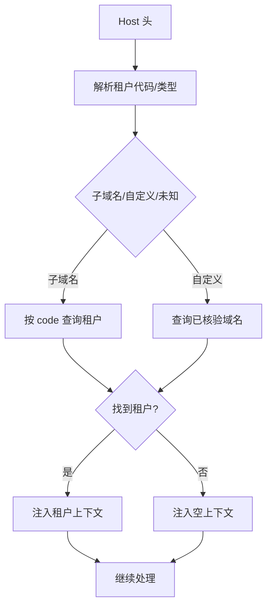
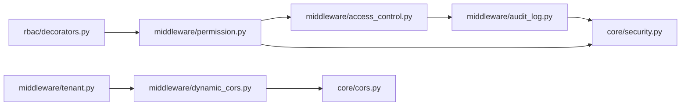

# 安全架构设计

<cite>
**本文档引用的文件**
- [backend/app/core/security.py](file://backend/app/core/security.py)
- [backend/app/rbac/decorators.py](file://backend/app/rbac/decorators.py)
- [backend/app/middleware/access_control.py](file://backend/app/middleware/access_control.py)
- [backend/app/middleware/permission.py](file://backend/app/middleware/permission.py)
- [backend/app/middleware/audit_log.py](file://backend/app/middleware/audit_log.py)
- [backend/app/middleware/dynamic_cors.py](file://backend/app/middleware/dynamic_cors.py)
- [backend/app/core/cors.py](file://backend/app/core/cors.py)
- [backend/app/middleware/tenant.py](file://backend/app/middleware/tenant.py)
- [backend/app/enums/rbac.py](file://backend/app/enums/rbac.py)
</cite>

## 目录
1. [引言](#引言)
2. [项目结构](#项目结构)
3. [核心组件](#核心组件)
4. [架构总览](#架构总览)
5. [详细组件分析](#详细组件分析)
6. [依赖分析](#依赖分析)
7. [性能考虑](#性能考虑)
8. [故障排查指南](#故障排查指南)
9. [结论](#结论)
10. [附录](#附录)

## 引言
本文件面向 NovusAI SaaS 的安全架构设计，围绕“多层次安全防护体系”展开，覆盖身份认证、权限控制、数据加密、访问审计、API 安全策略、CORS 安全配置、CSRF 防护、数据传输与存储加密、敏感数据脱敏、安全事件监控与入侵检测、安全审计日志系统以及多租户隔离与合规性要求。文档基于仓库现有实现进行深入分析，并提供可视化图示帮助理解。

## 项目结构
后端采用 FastAPI + ASGI 架构，安全相关能力主要分布在以下模块：
- 认证与授权：core/security.py、middleware/permission.py、middleware/access_control.py、enums/rbac.py
- 权限模型与装饰器：rbac/decorators.py、enums/rbac.py
- 审计日志：middleware/audit_log.py
- CORS 安全：middleware/dynamic_cors.py、core/cors.py
- 多租户隔离：middleware/tenant.py
- API 安全策略：middleware/access_control.py、middleware/dynamic_cors.py、middleware/audit_log.py

**图表来源**
- [backend/app/middleware/access_control.py:1-137](file://backend/app/middleware/access_control.py#L1-L137)
- [backend/app/middleware/permission.py:1-272](file://backend/app/middleware/permission.py#L1-L272)
- [backend/app/middleware/audit_log.py:1-582](file://backend/app/middleware/audit_log.py#L1-L582)
- [backend/app/middleware/dynamic_cors.py:1-66](file://backend/app/middleware/dynamic_cors.py#L1-L66)
- [backend/app/core/cors.py:1-265](file://backend/app/core/cors.py#L1-L265)
- [backend/app/middleware/tenant.py:1-259](file://backend/app/middleware/tenant.py#L1-L259)
- [backend/app/core/security.py:1-503](file://backend/app/core/security.py#L1-L503)
- [backend/app/rbac/decorators.py:1-551](file://backend/app/rbac/decorators.py#L1-L551)
- [backend/app/enums/rbac.py:1-37](file://backend/app/enums/rbac.py#L1-L37)

**章节来源**
- [backend/app/middleware/access_control.py:1-137](file://backend/app/middleware/access_control.py#L1-L137)
- [backend/app/middleware/permission.py:1-272](file://backend/app/middleware/permission.py#L1-L272)
- [backend/app/middleware/audit_log.py:1-582](file://backend/app/middleware/audit_log.py#L1-L582)
- [backend/app/middleware/dynamic_cors.py:1-66](file://backend/app/middleware/dynamic_cors.py#L1-L66)
- [backend/app/core/cors.py:1-265](file://backend/app/core/cors.py#L1-L265)
- [backend/app/middleware/tenant.py:1-259](file://backend/app/middleware/tenant.py#L1-L259)
- [backend/app/core/security.py:1-503](file://backend/app/core/security.py#L1-L503)
- [backend/app/rbac/decorators.py:1-551](file://backend/app/rbac/decorators.py#L1-L551)
- [backend/app/enums/rbac.py:1-37](file://backend/app/enums/rbac.py#L1-L37)

## 核心组件
- JWT 令牌管理与吊销：提供 access/refresh/impersonate 令牌生成、解码、过期处理、Redis 黑名单吊销。
- RBAC 权限模型：声明式权限装饰器、菜单与操作权限注册、运行时权限检查、通配符与资源通配符支持。
- 访问控制策略：默认拒绝策略，未标记端点一律 403，公共/仅认证/权限检查三档访问级别。
- 权限预加载：在路由处理前加载用户权限集合与数据权限上下文，供装饰器与过滤器使用。
- 审计日志：拦截 API 请求，解析用户、模块、动作、资源，请求体脱敏，异步落库。
- CORS 安全：Origin 白名单、平台域名、子域名、自定义域名验证，预检请求短路处理。
- 多租户隔离：基于 Host 的子域名/自定义域名解析，租户上下文注入，路径白名单解析。

**章节来源**
- [backend/app/core/security.py:38-499](file://backend/app/core/security.py#L38-L499)
- [backend/app/rbac/decorators.py:35-551](file://backend/app/rbac/decorators.py#L35-L551)
- [backend/app/middleware/access_control.py:35-137](file://backend/app/middleware/access_control.py#L35-L137)
- [backend/app/middleware/permission.py:31-272](file://backend/app/middleware/permission.py#L31-L272)
- [backend/app/middleware/audit_log.py:219-582](file://backend/app/middleware/audit_log.py#L219-L582)
- [backend/app/middleware/dynamic_cors.py:19-66](file://backend/app/middleware/dynamic_cors.py#L19-L66)
- [backend/app/core/cors.py:143-264](file://backend/app/core/cors.py#L143-L264)
- [backend/app/middleware/tenant.py:93-259](file://backend/app/middleware/tenant.py#L93-L259)

## 架构总览
下图展示一次典型 API 请求在安全层的流转过程，涵盖认证、权限、审计与 CORS：

**图表来源**
- [backend/app/middleware/dynamic_cors.py:25-62](file://backend/app/middleware/dynamic_cors.py#L25-L62)
- [backend/app/middleware/tenant.py:120-164](file://backend/app/middleware/tenant.py#L120-L164)
- [backend/app/middleware/access_control.py:54-98](file://backend/app/middleware/access_control.py#L54-L98)
- [backend/app/middleware/permission.py:40-61](file://backend/app/middleware/permission.py#L40-L61)
- [backend/app/rbac/decorators.py:296-335](file://backend/app/rbac/decorators.py#L296-L335)
- [backend/app/middleware/audit_log.py:235-348](file://backend/app/middleware/audit_log.py#L235-L348)

## 详细组件分析

### 身份认证与令牌管理
- 令牌类型与作用域
  - 访问令牌：用于常规业务请求，携带用户主体、作用域、类型、签发时间、过期时间与 JTI。
  - 刷新令牌：用于轮换访问令牌，具备更长有效期。
  - 一键登录令牌：管理员对租户后台/用户端的一键登录，携带目标作用域、租户 ID、可选角色 ID，极短有效期。
- 令牌生命周期与吊销
  - 生成时分配唯一 JTI；过期时间由配置决定；Redis 黑名单用于即时吊销，键前缀区分不同用途。
  - 解码阶段先校验签名与类型，再检查黑名单；过期抛出特定异常以便上层区分。
- 密码与数据加密
  - 密码使用 bcrypt 哈希；敏感数据使用 Fernet 对称加密（基于 SECRET_KEY 派生）。
- 令牌对生成
  - 同时生成 access/refresh 令牌与各自 JTI，便于独立管理。

**图表来源**
- [backend/app/core/security.py:38-115](file://backend/app/core/security.py#L38-L115)
- [backend/app/core/security.py:127-214](file://backend/app/core/security.py#L127-L214)
- [backend/app/core/security.py:329-356](file://backend/app/core/security.py#L329-L356)

**章节来源**
- [backend/app/core/security.py:22-115](file://backend/app/core/security.py#L22-L115)
- [backend/app/core/security.py:127-214](file://backend/app/core/security.py#L127-L214)
- [backend/app/core/security.py:329-356](file://backend/app/core/security.py#L329-L356)
- [backend/app/core/security.py:431-476](file://backend/app/core/security.py#L431-L476)

### RBAC 权限模型设计
- 权限类型与作用域
  - 权限类型：菜单权限与操作权限。
  - 权限作用域：平台端、企业端、用户端、两端皆有。
- 装饰器与注册
  - 资源级装饰器：声明资源、菜单配置、作用域与父资源，自动注册菜单权限。
  - 操作级装饰器：声明 CRUD/导出/导入等动作，自动注册操作权限并支持运行时检查。
  - 单一声明原则：装饰器同时负责“权限注册”和“权限检查”，避免重复声明。
- 运行时检查
  - 支持精确匹配、通配符“*”、资源通配符“resource:*”。
  - 权限集合注入到 request.state.user_permissions，装饰器直接读取。
- 角色继承与组织权威
  - 平台管理员：超级权限或从组织节点/角色继承；企业管理员/用户：从角色继承。
  - 数据权限上下文：最大数据范围、可见组织、可管理组织、根节点等，供数据过滤使用。

**图表来源**
- [backend/app/middleware/permission.py:31-272](file://backend/app/middleware/permission.py#L31-L272)
- [backend/app/rbac/decorators.py:35-551](file://backend/app/rbac/decorators.py#L35-L551)

**章节来源**
- [backend/app/enums/rbac.py:11-30](file://backend/app/enums/rbac.py#L11-L30)
- [backend/app/rbac/decorators.py:153-337](file://backend/app/rbac/decorators.py#L153-L337)
- [backend/app/middleware/permission.py:70-272](file://backend/app/middleware/permission.py#L70-L272)

### API 安全策略与 CSRF 防护
- 默认拒绝策略
  - 未显式标注访问级别的端点一律 403，强制开发者明确声明 public/auth_only/action_*。
- CSRF 防护
  - 本项目通过严格的 Origin 校验与预检短路实现 CORS 安全，结合 Bearer Token 的使用，天然降低 CSRF 风险；未发现显式的表单 CSRF Token 机制。
- 跨域策略
  - 动态 Origin 校验：白名单、平台域名、子域名、自定义域名验证；预检请求直接 204 返回并附加允许头。
  - 暴露头与允许方法/头在策略中集中定义，避免硬编码。

**图表来源**
- [backend/app/middleware/dynamic_cors.py:25-62](file://backend/app/middleware/dynamic_cors.py#L25-L62)
- [backend/app/core/cors.py:143-264](file://backend/app/core/cors.py#L143-L264)

**章节来源**
- [backend/app/middleware/access_control.py:35-98](file://backend/app/middleware/access_control.py#L35-L98)
- [backend/app/middleware/dynamic_cors.py:19-66](file://backend/app/middleware/dynamic_cors.py#L19-L66)
- [backend/app/core/cors.py:113-207](file://backend/app/core/cors.py#L113-L207)

### 审计日志与敏感数据脱敏
- 日志拦截
  - 拦截所有 API 请求，排除健康检查、指标、文档等路径；OPTIONS 请求不记录。
- 用户识别
  - 从 Authorization 头解析 Bearer Token，提取用户类型、ID、租户 ID；支持一键登录场景的溯源。
- 模块/动作/资源
  - 从路由装饰器提取资源与动作；若缺失则回落到 HTTP 方法映射或特殊路径映射。
- 请求体脱敏
  - 对 password/password_hash/token 等敏感字段打码；非 JSON 请求体仅记录大小与类型。
- 异步落库
  - 记录耗时、状态码、业务响应码与消息，异步写入数据库，避免阻塞请求。

**图表来源**
- [backend/app/middleware/audit_log.py:75-101](file://backend/app/middleware/audit_log.py#L75-L101)
- [backend/app/middleware/audit_log.py:128-174](file://backend/app/middleware/audit_log.py#L128-L174)
- [backend/app/middleware/audit_log.py:103-126](file://backend/app/middleware/audit_log.py#L103-L126)
- [backend/app/middleware/audit_log.py:419-486](file://backend/app/middleware/audit_log.py#L419-L486)
- [backend/app/middleware/audit_log.py:487-578](file://backend/app/middleware/audit_log.py#L487-L578)

**章节来源**
- [backend/app/middleware/audit_log.py:25-73](file://backend/app/middleware/audit_log.py#L25-L73)
- [backend/app/middleware/audit_log.py:103-126](file://backend/app/middleware/audit_log.py#L103-L126)
- [backend/app/middleware/audit_log.py:128-174](file://backend/app/middleware/audit_log.py#L128-L174)
- [backend/app/middleware/audit_log.py:419-486](file://backend/app/middleware/audit_log.py#L419-L486)
- [backend/app/middleware/audit_log.py:487-578](file://backend/app/middleware/audit_log.py#L487-L578)

### 多租户隔离与合规性
- 租户识别
  - 子域名模式：{tenant_code}.app.novusai.com，直接按 code 查询。
  - 自定义域名模式：查询 tenant_domains 表，仅验证已核验域名，不参与业务权限。
- 上下文注入
  - 解析结果注入 request.state.tenant_ctx，后续中间件与业务逻辑可读取。
- 合规要点
  - 数据隔离：租户 ID 作为审计日志与权限上下文的关键维度。
  - 域名合规：自定义域名核验与缓存，避免未授权域名接入。
  - 路径白名单：仅对特定路径执行租户解析，减少不必要的数据库查询。

**图表来源**
- [backend/app/middleware/tenant.py:52-91](file://backend/app/middleware/tenant.py#L52-L91)
- [backend/app/middleware/tenant.py:166-222](file://backend/app/middleware/tenant.py#L166-L222)
- [backend/app/middleware/tenant.py:120-164](file://backend/app/middleware/tenant.py#L120-L164)

**章节来源**
- [backend/app/middleware/tenant.py:52-91](file://backend/app/middleware/tenant.py#L52-L91)
- [backend/app/middleware/tenant.py:166-222](file://backend/app/middleware/tenant.py#L166-L222)
- [backend/app/middleware/tenant.py:120-164](file://backend/app/middleware/tenant.py#L120-L164)

## 依赖分析
- 组件耦合
  - 访问控制中间件依赖端点装饰器的访问级别标记；权限中间件依赖 RBAC 装饰器注册的权限集合；审计中间件依赖权限中间件注入的用户信息。
- 外部依赖
  - Redis 用于令牌黑名单与吊销；数据库用于租户域名核验与权限数据加载。
- 循环依赖
  - 装饰器与中间件通过延迟导入避免循环引用；RBAC 注册表在装饰器内部懒加载。

**图表来源**
- [backend/app/rbac/decorators.py:201-244](file://backend/app/rbac/decorators.py#L201-L244)
- [backend/app/middleware/permission.py:70-90](file://backend/app/middleware/permission.py#L70-L90)
- [backend/app/middleware/access_control.py:82-92](file://backend/app/middleware/access_control.py#L82-L92)
- [backend/app/middleware/audit_log.py:503-507](file://backend/app/middleware/audit_log.py#L503-L507)
- [backend/app/middleware/dynamic_cors.py:38-51](file://backend/app/middleware/dynamic_cors.py#L38-L51)
- [backend/app/core/cors.py:143-183](file://backend/app/core/cors.py#L143-L183)
- [backend/app/middleware/tenant.py:120-164](file://backend/app/middleware/tenant.py#L120-L164)

**章节来源**
- [backend/app/rbac/decorators.py:201-244](file://backend/app/rbac/decorators.py#L201-L244)
- [backend/app/middleware/permission.py:70-90](file://backend/app/middleware/permission.py#L70-L90)
- [backend/app/middleware/access_control.py:82-92](file://backend/app/middleware/access_control.py#L82-L92)
- [backend/app/middleware/audit_log.py:503-507](file://backend/app/middleware/audit_log.py#L503-L507)
- [backend/app/middleware/dynamic_cors.py:38-51](file://backend/app/middleware/dynamic_cors.py#L38-L51)
- [backend/app/core/cors.py:143-183](file://backend/app/core/cors.py#L143-L183)
- [backend/app/middleware/tenant.py:120-164](file://backend/app/middleware/tenant.py#L120-L164)

## 性能考虑
- 异步写日志：审计日志异步落库，避免阻塞请求主线程。
- 缓存与预计算：CORS 自定义域名核验结果在内存维护，减少数据库查询。
- 最小权限加载：权限中间件仅在存在 Bearer Token 时加载，未认证请求不进行权限查询。
- 预检短路：CORS 预检请求直接返回，减少后续链路开销。

[本节为通用指导，无需具体文件分析]

## 故障排查指南
- 403 未声明访问级别
  - 症状：未使用 @public/@auth_only/@action_* 标注的端点返回 403。
  - 处理：为端点添加合适的访问级别装饰器。
  - 参考：[backend/app/middleware/access_control.py:84-92](file://backend/app/middleware/access_control.py#L84-L92)
- 令牌过期/无效
  - 症状：解码阶段抛出过期异常或返回 None。
  - 处理：使用刷新令牌换取新访问令牌；检查签名算法与密钥配置。
  - 参考：[backend/app/core/security.py:18-214](file://backend/app/core/security.py#L18-L214)
- 令牌被吊销
  - 症状：JTI 在黑名单中导致鉴权失败。
  - 处理：确认登出/撤销流程是否正确写入黑名单；检查 TTL 设置。
  - 参考：[backend/app/core/security.py:127-177](file://backend/app/core/security.py#L127-L177)
- CORS 预检失败
  - 症状：浏览器预检 400。
  - 处理：确认 Origin 是否在白名单或已核验；检查允许头与方法配置。
  - 参考：[backend/app/middleware/dynamic_cors.py:38-51](file://backend/app/middleware/dynamic_cors.py#L38-L51)，[backend/app/core/cors.py:143-183](file://backend/app/core/cors.py#L143-L183)
- 审计日志缺失
  - 症状：某些请求未记录。
  - 处理：检查路径是否在排除列表；确认是否为 OPTIONS/健康检查。
  - 参考：[backend/app/middleware/audit_log.py:75-101](file://backend/app/middleware/audit_log.py#L75-L101)

**章节来源**
- [backend/app/middleware/access_control.py:84-92](file://backend/app/middleware/access_control.py#L84-L92)
- [backend/app/core/security.py:18-214](file://backend/app/core/security.py#L18-L214)
- [backend/app/core/security.py:127-177](file://backend/app/core/security.py#L127-L177)
- [backend/app/middleware/dynamic_cors.py:38-51](file://backend/app/middleware/dynamic_cors.py#L38-L51)
- [backend/app/core/cors.py:143-183](file://backend/app/core/cors.py#L143-L183)
- [backend/app/middleware/audit_log.py:75-101](file://backend/app/middleware/audit_log.py#L75-L101)

## 结论
本安全架构以“默认拒绝”为核心策略，结合声明式 RBAC、严格的 CORS 校验、租户上下文注入与异步审计日志，形成完整的多层防护体系。JWT 令牌管理支持即时吊销与最小权限加载，配合数据权限上下文实现细粒度的数据隔离。建议持续完善 CSRF 防护策略（如引入 CSRF Token），并定期审查权限矩阵与审计日志策略，确保满足合规要求。

[本节为总结性内容，无需具体文件分析]

## 附录
- 关键配置项（来自安全模块与 CORS 模块）
  - 令牌过期时间、算法、密钥、黑名单前缀、暴露头与允许方法/头、平台域名与租户域名后缀等。
- 建议补充
  - CSRF Token 机制（针对表单场景）
  - 安全事件监控与入侵检测集成（如 Web 应用防火墙/WAF）
  - 数据传输加密与存储加密策略细化（密钥轮换、硬件安全模块 HSM）

[本节为概览性内容，无需具体文件分析]