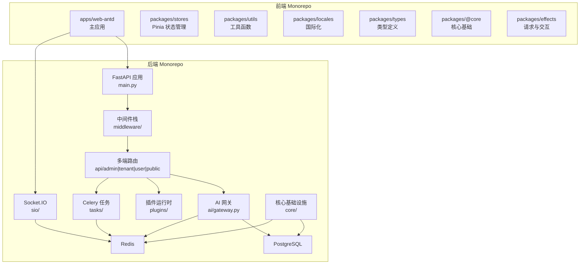
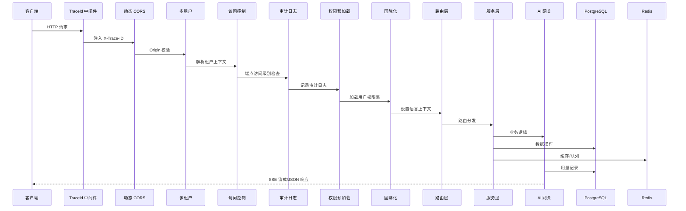
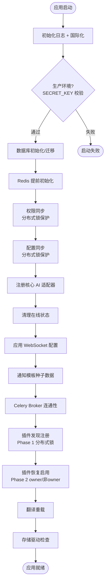
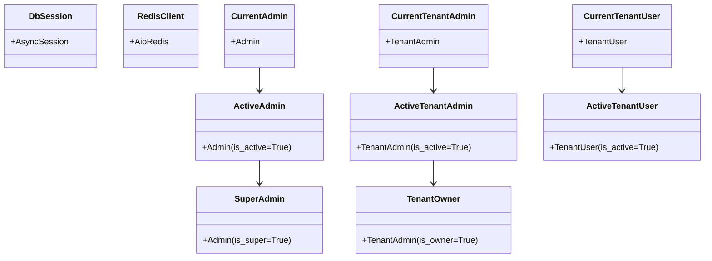
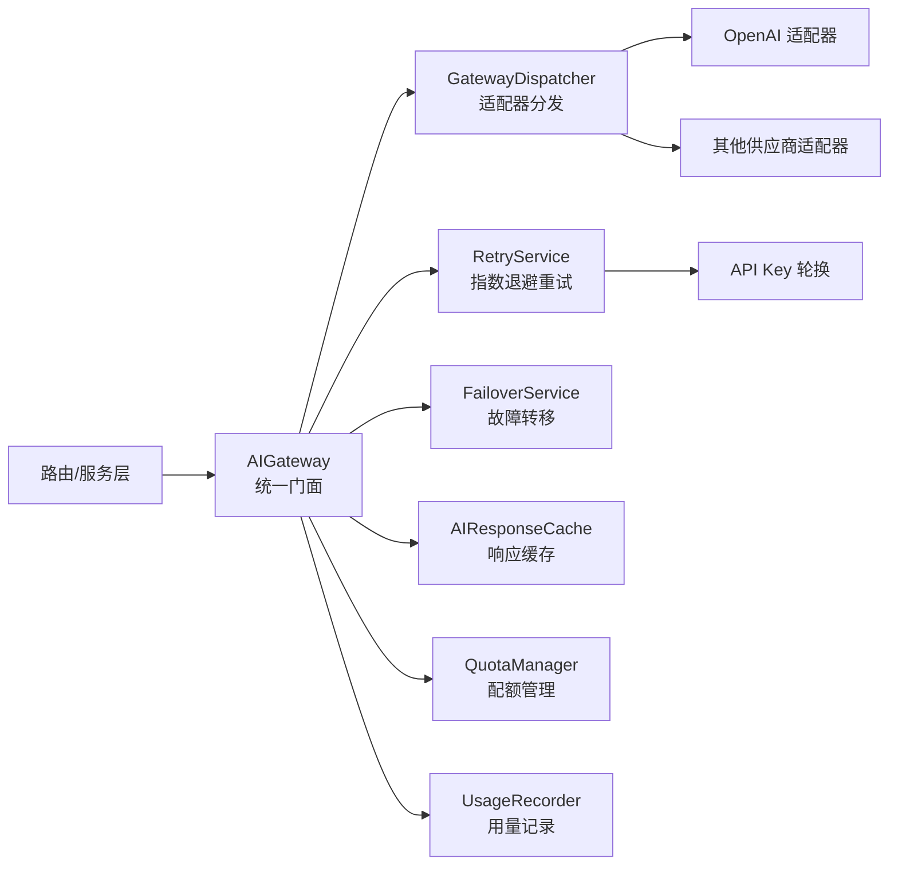
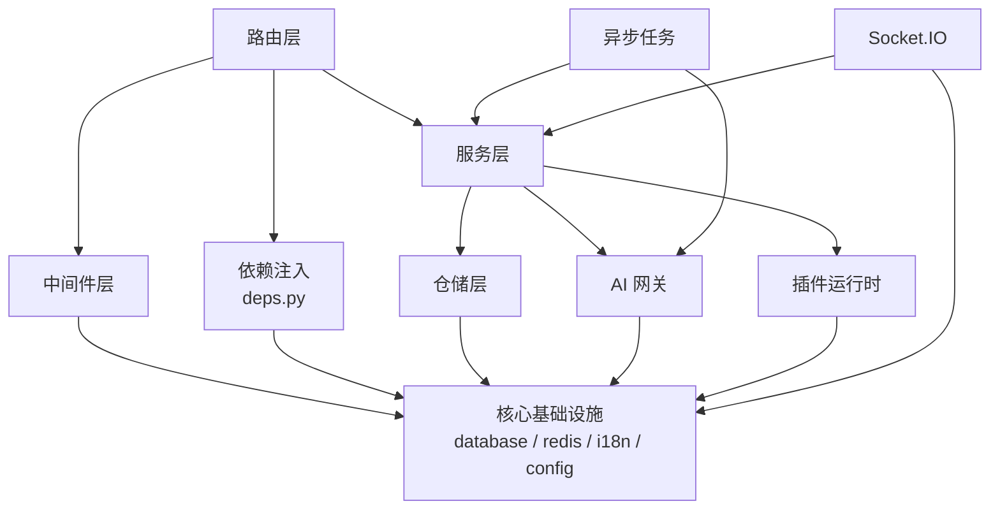

# 应用架构设计
## 目录
1. [引言](#引言)
2. [项目结构](#项目结构)
3. [核心组件](#核心组件)
4. [架构总览](#架构总览)
5. [详细组件分析](#详细组件分析)
6. [依赖分析](#依赖分析)
7. [性能考虑](#性能考虑)
8. [故障排查指南](#故障排查指南)
9. [结论](#结论)
10. [附录](#附录)

## 引言
本文件为 NovusAI SaaS 的应用架构设计文档，聚焦于应用层的整体组织方式，包括：应用生命周期管理、中间件管道设计、路由与 API 多端组织、依赖注入与会话管理、异步任务调度、AI 网关集成、实时通信架构、插件扩展系统、国际化体系以及前后端集成模式。文档从代码实现出发，结合架构图与流程图，阐述各组件的职责边界、交互方式与技术选型理由。

## 项目结构
后端采用 FastAPI + SQLAlchemy 2.x + Alembic + Celery + Socket.IO 的现代化 SaaS 技术栈，仓库为前后端分离的 monorepo 结构：

- **后端 (`backend/`)**：以 `app/` 为核心模块，内含 `core/`（基础设施）、`middleware/`（中间件栈）、`api/`（多端路由）、`ai/`（AI 网关与引擎）、`plugins/`（插件运行时）、`sio/`（实时通信）、`models/`（ORM 模型）、`repositories/`（仓储层）、`services/`（业务服务）、`tasks/`（异步任务）、`rbac/`（权限模型）等子模块。
- **前端 (`frontend/`)**：基于 Vue 3 + TypeScript + Vben Admin + Ant Design Vue + Vite + pnpm monorepo，内含 `apps/web-antd`（主应用）、`packages/`（共享包：stores、utils、types、locales、styles、icons、effects 等）。
- **插件 (`backend/plugins/`)**：独立插件目录，每个插件具备 manifest 定义、后端逻辑与前端入口。

**图表来源**
- [backend/app/main.py:53-1196](file://backend/app/main.py#L53-L1196)
- [frontend/apps/web-antd/package.json](file://frontend/apps/web-antd/package.json)

**章节来源**
- [backend/app/main.py:1-1212](file://backend/app/main.py#L1-L1212)

## 核心组件
- **应用入口与生命周期**：`create_application()` 工厂函数负责 FastAPI 实例创建、中间件注册、异常处理器绑定、路由挂载、Socket.IO 集成与静态资源服务；`lifespan` 异步上下文管理器负责启动期初始化（数据库、Redis、权限同步、配置同步、插件发现与恢复）和关闭期清理。
- **中间件管道**：按洋葱模型注册的九层中间件栈，涵盖追踪 ID、Prometheus 指标、动态 CORS、多租户识别、访问控制、审计日志、权限预加载、维护模式、国际化与 API 缓存控制。
- **多端路由与 API 组织**：四套路由聚合器——平台管理端（`/admin/*`）、企业管理端（`/tenant/*`）、用户端（`/api/user/*`）和公共端（`/api/public/*`），外加插件 API 分发器与 Webhook 分发器。
- **依赖注入体系**：基于 FastAPI Depends 的类型安全注入，提供数据库会话、Redis 客户端、三种身份（管理员/企业管理员/企业用户）的认证与激活状态注入，以及查询参数解析。
- **异步任务引擎**：Celery + Redis 多队列路由，支持 AI 网关、定时任务、通知、回收站清理、邮件等任务模块，Worker/Beat 进程独立恢复插件队列扩展。
- **AI 网关集成**：统一门面 AIGateway 封装聊天、嵌入、图像生成与模型测试，内置重试、Key 轮换、故障转移、配额管理与流式响应。
- **实时通信**：Socket.IO 三命名空间（admin/tenant/user），支持在线状态管理与通知推送。
- **插件扩展系统**：插件生命周期管理、扩展点注册中心、事件总线、API 分发器、前端静态资源服务与 Webhook 分发。

**章节来源**
- [backend/app/main.py:635-1196](file://backend/app/main.py#L635-L1196)
- [backend/app/core/deps.py:1-363](file://backend/app/core/deps.py#L1-L363)
- [backend/app/celery_app.py:1-226](file://backend/app/celery_app.py#L1-L226)
- [backend/app/ai/gateway.py:59-407](file://backend/app/ai/gateway.py#L59-L407)

## 架构总览
系统采用前后端分离、分层解耦的架构模式。后端以 FastAPI 为核心，通过"中间件管道 → 路由层 → 服务层 → 仓储层 → 数据库/缓存/消息队列"的调用链路实现请求处理；AI 能力通过统一网关对接多供应商适配器；插件系统在启动期自动发现并恢复，运行时通过扩展点注册中心实现能力注入。

**图表来源**
- [backend/app/main.py:650-702](file://backend/app/main.py#L650-L702)
- [backend/app/middleware/trace.py](file://backend/app/middleware/trace.py)
- [backend/app/middleware/tenant.py:93-259](file://backend/app/middleware/tenant.py#L93-L259)

## 详细组件分析

### 应用生命周期管理
应用通过 `lifespan` 异步上下文管理器实现启动与关闭两个阶段的生命周期控制：

**启动阶段**按顺序执行：
1. **日志与国际化初始化**：初始化日志系统，清除翻译缓存以加载最新翻译文件。
2. **环境变量校验**：生产环境强制校验 SECRET_KEY 不为弱密钥。
3. **数据库初始化**：根据配置选择"启动迁移"或"仅校验连接"模式，支持 Alembic 自动迁移。
4. **Redis 提前初始化**：为后续分布式锁提供基础设施。
5. **权限同步**：使用 Redis 分布式锁，将代码装饰器声明的权限同步到数据库，防止多 worker 并发 INSERT 冲突。
6. **配置同步**：同样使用分布式锁，将代码定义的配置项同步到数据库。
7. **AI 适配器注册**：硬编码注册核心 AI 适配器（不依赖插件系统）。
8. **在线状态清理**：清除服务器重启后的残留在线状态数据。
9. **WebSocket 配置应用**：从平台配置读取 ping_interval/ping_timeout 并应用。
10. **通知模板种子数据**：确保通知模板表包含最新模板。
11. **Celery Broker 连通性验证**：确认消息队列可用。
12. **插件自动发现与恢复**：双阶段执行——Phase 1 发现注册（分布式锁保护），Phase 2 恢复启用（owner 执行重恢复含迁移/依赖安装，非 owner 仅做进程内扩展注册）。
13. **翻译重载**：插件恢复后重新加载翻译（插件可能有自己的 locales 文件）。
14. **存储驱动检查**：验证配置的存储驱动是否可用。

**关闭阶段**依次关闭数据库连接与 Redis 连接。

**图表来源**
- [backend/app/main.py:53-487](file://backend/app/main.py#L53-L487)

**章节来源**
- [backend/app/main.py:53-503](file://backend/app/main.py#L53-L503)

### 中间件管道设计
中间件按洋葱模型注册，请求从外向内穿透，响应从内向外返回。注册顺序决定了执行顺序（后注册的先执行）：

| 注册顺序 | 中间件 | 职责 |
|---|---|---|
| 1（最外层） | TraceIdMiddleware | 生成/传播 X-Trace-ID，贯穿请求全链路 |
| 2 | PrometheusMetricsMiddleware | 采集请求延迟、状态码、组件健康指标 |
| 3 | DynamicCORSMiddleware | Origin 白名单校验，精确回写 CORS 头 |
| 4 | TenantMiddleware | 从 Host 头解析租户上下文（子域名/自定义域名） |
| 5 | AccessControlMiddleware | "默认拒绝"策略，未标注端点返回 403 |
| 6 | AuditLogMiddleware | 拦截请求记录审计日志，请求体脱敏 |
| 7 | PermissionMiddleware | 预加载用户权限集合与数据权限上下文 |
| 8 | MaintenanceMiddleware | 维护模式开启时拦截非管理端请求 |
| 9 | I18nMiddleware | 从 Accept-Language/租户配置解析语言 |
| 10（最内层） | NoCacheAPIMiddleware | JSON 响应禁止浏览器缓存 |

**章节来源**
- [backend/app/main.py:650-702](file://backend/app/main.py#L650-L702)

### 路由与 API 多端组织
应用提供四套核心路由聚合器和三套插件路由分发器：

```mermaid
graph TB
    APP["FastAPI 应用"]
    APP --> Admin["/admin/*<br/>平台管理端"]
    APP --> Tenant["/tenant/*<br/>企业管理端"]
    APP --> User["/api/user/*<br/>用户端"]
    APP --> Public["/api/public/*<br/>公共端（无需认证）"]
    APP --> PluginAdmin["/admin/plugins/{name}/api/*<br/>插件管理端 API"]
    APP --> PluginTenant["/tenant/plugins/{name}/api/*<br/>插件企业端 API"]
    APP --> PluginPublic["/api/public/plugins/{name}/api/*<br/>插件公共 API"]
    APP --> Webhook["/webhooks/plugins/{name}/{path}<br/>插件 Webhook"]
    APP --> Files["/files/*<br/>本地存储静态文件"]
    APP --> PluginAssets["/plugin-assets/{name}/{path}<br/>插件前端资源"]
    APP --> PluginIcons["/plugin-icons/{name}/{path}<br/>插件图标"]
    APP --> Health["/ , /health , /ready , /metrics<br/>健康检查与指标"]
```

- **平台管理端**：超级管理员功能，包括租户管理、系统配置、AI 模型/供应商管理、插件管理、操作日志等。
- **企业管理端**：租户管理员功能，包括企业用户管理、AI Agent/知识库/技能管理、配额管理、计划管理等。
- **用户端**：企业业务用户的 AI 对话、Agent 交互、知识库查询等功能。
- **公共端**：无需认证的接口，如租户登录页配置获取、验证码等。

**图表来源**
- [backend/app/main.py:800-891](file://backend/app/main.py#L800-L891)

**章节来源**
- [backend/app/main.py:800-891](file://backend/app/main.py#L800-L891)

### 依赖注入与会话管理
依赖注入模块 `core/deps.py` 提供类型安全的 FastAPI Depends 链，覆盖三种身份体系：

- **数据库会话**：`get_db()` 通过 `managed_async_session()` 提供异步会话，请求成功自动提交、异常自动回滚。
- **Redis 客户端**：`get_redis` 提供异步 Redis 连接注入。
- **认证链**：每种身份均有"当前用户 → 激活用户 → 特殊角色"三级注入链，支持 Token 过期异常精确处理。
- **OAuth2 配置**：三套独立的 OAuth2PasswordBearer，分别指向管理端、企业端和用户端的登录端点。

**图表来源**
- [backend/app/core/deps.py:1-363](file://backend/app/core/deps.py#L1-L363)

**章节来源**
- [backend/app/core/deps.py:1-363](file://backend/app/core/deps.py#L1-L363)

### 异步任务调度
Celery 应用配置了多队列路由和优先级支持：

- **队列划分**：default（默认）、high_priority（高优先级）、ai_gateway（AI 网关）、scheduled（定时任务）、notification（通知）。
- **任务自动发现**：涵盖定时任务、任务调度、回收站、上传清理、AI 健康检查、Agent 批量、SSL、邮件、通知、AI、RAG 处理等模块。
- **插件队列扩展**：Worker/Beat 进程不经过 FastAPI lifespan，因此独立恢复已启用插件的任务和消费者。
- **Trace ID 传播**：通过 monkey-patch `send_task` 将当前请求的 Trace ID 注入 Celery 任务头，实现全链路追踪。
- **Beat 调度**：由 `ReloadingPersistentScheduler` 从数据库动态加载任务定义，支持 Beat 在数据库短暂不可用后自动恢复。

**章节来源**
- [backend/app/celery_app.py:1-226](file://backend/app/celery_app.py#L1-L226)

### AI 网关集成
AIGateway 作为统一门面，封装了与多供应商 AI 服务的交互：

- **统一接口**：chat / stream_chat / embedding / image_generation / test_model 五种调用模式。
- **适配器注册**：核心适配器硬编码注册（启动期），插件适配器通过插件系统动态注册。
- **重试与故障转移**：RetryService 实现指数退避 + Key 轮换；FailoverService 在主供应商不可用时切换到备用。
- **配额与用量**：QuotaManager 校验租户配额，UsageRecorder 记录 token 用量与费用。

**图表来源**
- [backend/app/ai/gateway.py:59-407](file://backend/app/ai/gateway.py#L59-L407)

**章节来源**
- [backend/app/ai/gateway.py:1-407](file://backend/app/ai/gateway.py#L1-L407)

### 实时通信架构
Socket.IO 集成通过三命名空间实现多端实时通信：

- **admin 命名空间**：管理端通知推送与在线状态管理。
- **tenant 命名空间**：企业管理端的通知与实时事件。
- **user 命名空间**：企业业务用户的 AI 对话实时推送与在线状态。
- **PresenceManager**：基于 Redis 的在线状态管理，启动时清理残留数据。
- **Socket.IO 路径**：`/sio`，通过 ASGIApp 包装 FastAPI 应用。

**章节来源**
- [backend/app/main.py:1174-1192](file://backend/app/main.py#L1174-L1192)
- [backend/app/sio/presence.py](file://backend/app/sio/presence.py)

### 插件扩展系统
插件系统提供完整的生命周期管理与能力扩展：

- **生命周期**：发现 → 安装 → 启用 → 恢复 → 禁用/卸载，支持数据库迁移、依赖安装与状态写回。
- **扩展点注册中心**（ExtensionRegistry）：桥接插件声明到系统注册表，支持路由、中间件、菜单、权限、定时任务、消费者、WebSocket 命名空间等扩展类型。
- **事件总线**（EventBus）：插件间异步事件通信。
- **API 分发器**：将 `/admin/plugins/{name}/api/*`、`/tenant/plugins/{name}/api/*`、`/api/public/plugins/{name}/api/*` 路由到插件后端处理器。
- **Webhook 分发器**：`/webhooks/plugins/{name}/{path}` 绕过认证中间件，直接分发到插件 Webhook 处理器。
- **前端资源服务**：`/plugin-assets/{name}/{path}` 和 `/plugin-public-assets/{endpoint}/{name}/{path}` 提供插件前端静态资源，含权限校验与缓存控制。
- **启动期并发安全**：使用 Redis 分布式锁（discover_lock / restore_lock）保证多 worker 场景下只有一个 worker 执行重操作。

**章节来源**
- [backend/app/plugins/registry.py:1-746](file://backend/app/plugins/registry.py#L1-L746)
- [backend/app/plugins/startup.py](file://backend/app/plugins/startup.py)
- [backend/app/plugins/api_dispatcher.py](file://backend/app/plugins/api_dispatcher.py)
- [backend/app/main.py:854-876](file://backend/app/main.py#L854-L876)

### 国际化体系
国际化模块提供后端多语言支持与前端集成：

- **翻译加载**：从 `locales/` 目录加载 JSON 翻译文件，支持 `zh_CN` 和 `en` 两种语言，使用 LRU 缓存。
- **语言上下文**：通过 ContextVar 管理请求级语言上下文，I18nMiddleware 从 Accept-Language 或租户配置解析。
- **插件翻译**：插件恢复后重新加载翻译，支持插件自带 locales 目录，含 locale 名称别名映射（如 zh-CN → zh_CN）。
- **深度合并**：插件翻译与核心翻译深度合并，插件可覆盖或扩展核心翻译。

**章节来源**
- [backend/app/core/i18n.py:1-290](file://backend/app/core/i18n.py#L1-L290)

### 异常处理体系
应用注册了四级异常处理器，确保所有错误均以统一 JSON 格式返回：

| 异常类型 | 处理器 | 行为 |
|---|---|---|
| AppException | app_exception_handler | 业务异常，返回自定义状态码与错误码 |
| RequestValidationError | validation_exception_handler | 请求验证失败，返回字段级错误信息 |
| StarletteHTTPException | http_exception_handler | HTTP 标准异常，映射业务错误码 |
| Exception | global_exception_handler | 全局兜底，500 + 调试信息（DEBUG 模式） |

所有异常响应均注入 CORS 头，确保跨域请求也能正确接收错误信息。

**章节来源**
- [backend/app/main.py:703-798](file://backend/app/main.py#L703-L798)

## 依赖分析
应用各层之间的依赖关系遵循"上层依赖下层，同层不互相依赖"的原则：

- **核心基础设施**（database、redis、config、i18n）被所有上层模块依赖，自身不依赖业务模块。
- **中间件层**依赖核心基础设施，部分中间件（如审计日志）通过懒加载依赖服务层。
- **路由层**通过依赖注入获取数据库会话和用户身份，调用服务层完成业务逻辑。
- **AI 网关**独立于路由层，通过服务层或直接注入使用。
- **插件运行时**通过扩展点注册中心与核心基础设施交互，避免直接耦合业务模块。

**章节来源**
- [backend/app/main.py:1-1212](file://backend/app/main.py#L1-L1212)
- [backend/app/core/deps.py:1-363](file://backend/app/core/deps.py#L1-L363)

## 性能考虑
- **数据库连接池**：异步引擎配置连接池大小与溢出，`managed_async_session()` 确保会话正确释放。
- **Redis 分布式锁**：启动期关键操作（权限同步、配置同步、插件发现/恢复）使用 Redis 分布式锁，TTL 覆盖最长路径，避免多 worker 竞争。
- **Celery 多队列**：AI 网关任务独立队列，避免长时间阻塞默认队列；高优先级任务单独队列确保及时处理。
- **Prometheus 指标**：中间件采集请求延迟、状态码分布；组件健康主动刷新（TTL 15 秒），避免 Prometheus 抓取时被动依赖。
- **API 缓存控制**：NoCacheAPIMiddleware 对 JSON 响应禁用浏览器缓存，防止数据陈旧；插件资源设置 300 秒私有缓存。
- **流式响应**：AI 对话支持 SSE 流式返回，减少首字节延迟，提升用户体验。

## 故障排查指南
- **启动失败**：`lifespan` 中所有关键步骤均有 try/except 与日志输出，数据库初始化失败会输出可读的 RuntimeError 并附带手动迁移命令。
- **健康检查端点**：`/health` 检查进程存活与 Redis 状态；`/ready` 校验数据库与 Redis 连通性（K8s 就绪探针）；`/metrics` 暴露 Prometheus 指标。
- **组件健康指标**：Prometheus gauge 主动刷新数据库和 Redis 健康状态，异常时标记为 degraded。
- **Trace ID**：全链路传播 X-Trace-ID，从 HTTP 请求到 Celery 任务均可关联。
- **插件恢复失败**：owner worker 记录失败详情，非 owner worker 在等待超时后以 register-only 模式继续，不影响应用启动。
- **审计日志**：所有 API 调用均记录审计日志，支持请求体脱敏与异步落库，便于事后分析。

## 结论
NovusAI SaaS 的应用架构以 FastAPI 为核心，通过精心设计的中间件管道、分层路由、依赖注入与异步任务引擎，构建了一个高可扩展、高可观测的多租户 AI SaaS 平台。插件系统提供了完整的生命周期管理与扩展点注册，AI 网关统一封装了多供应商能力，实时通信通过 Socket.IO 三命名空间覆盖所有端。分布式锁、健康检查、审计日志等基础设施确保了多 worker 场景下的可靠性与可追溯性。

## 附录

### 技术栈总览
| 层次 | 技术选型 |
|---|---|
| Web 框架 | FastAPI + Starlette (ASGI) |
| ORM | SQLAlchemy 2.x (异步) |
| 数据库迁移 | Alembic |
| 缓存/消息 | Redis (asyncio) |
| 任务队列 | Celery + Kombu |
| 实时通信 | python-socketio (ASGI) |
| 认证 | JWT (access/refresh/impersonate) |
| 权限 | RBAC 装饰器 + 数据库同步 |
| 国际化 | JSON 翻译文件 + ContextVar |
| 监控 | Prometheus 指标中间件 |
| 前端框架 | Vue 3 + TypeScript + Vben Admin |
| UI 组件 | Ant Design Vue |
| 构建工具 | Vite + pnpm monorepo |
| 状态管理 | Pinia |
