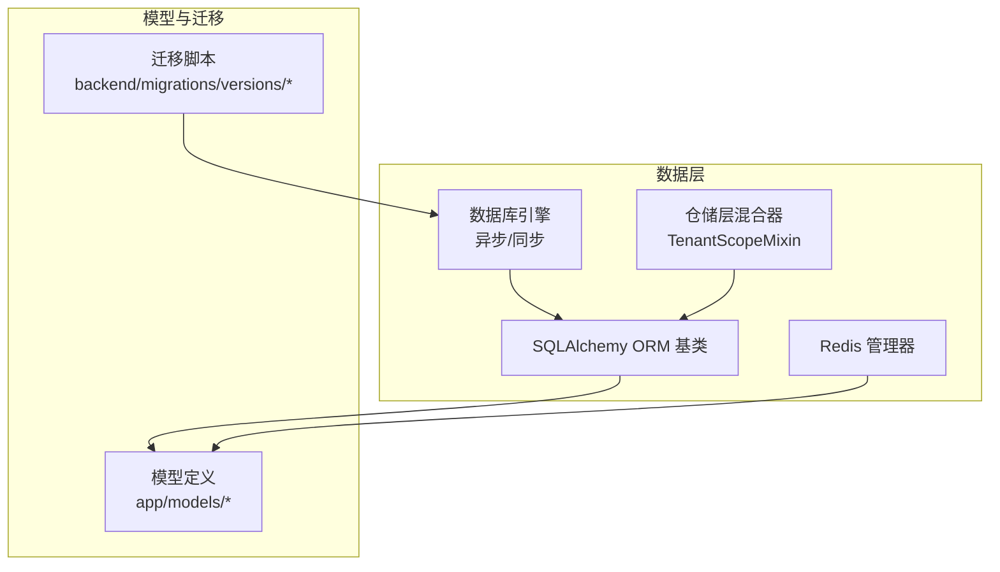
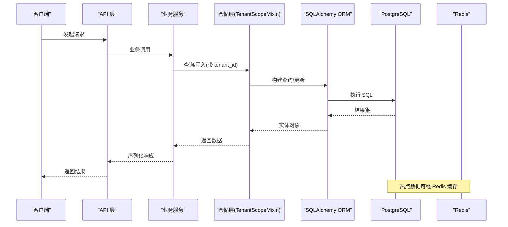
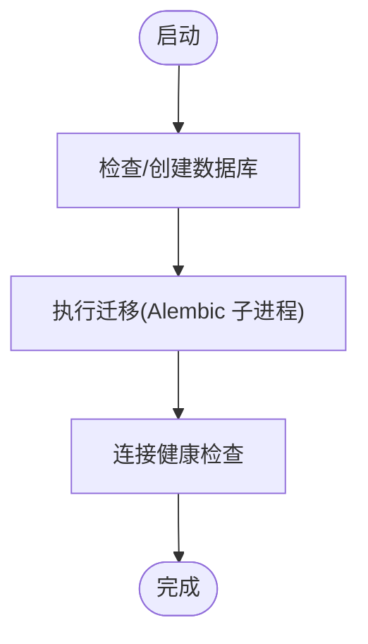
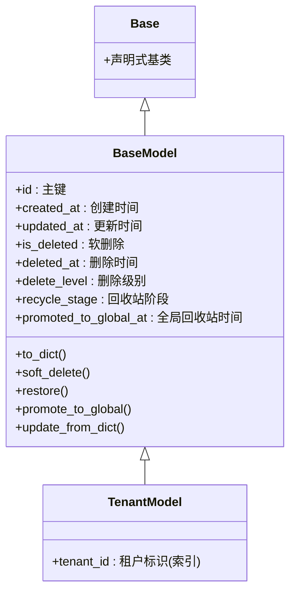
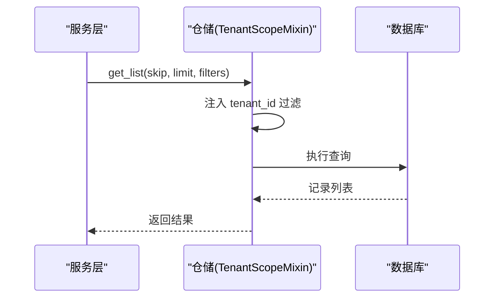
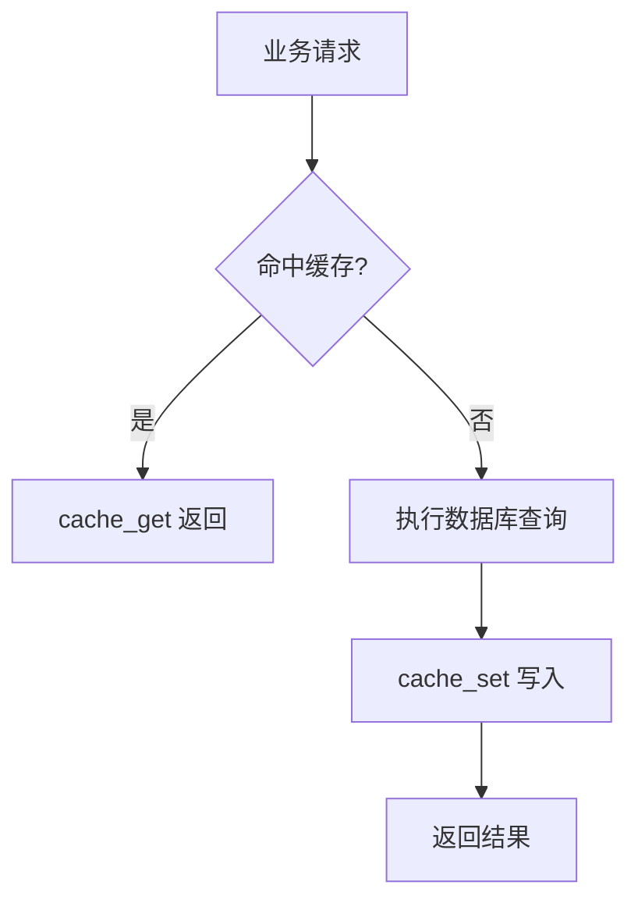
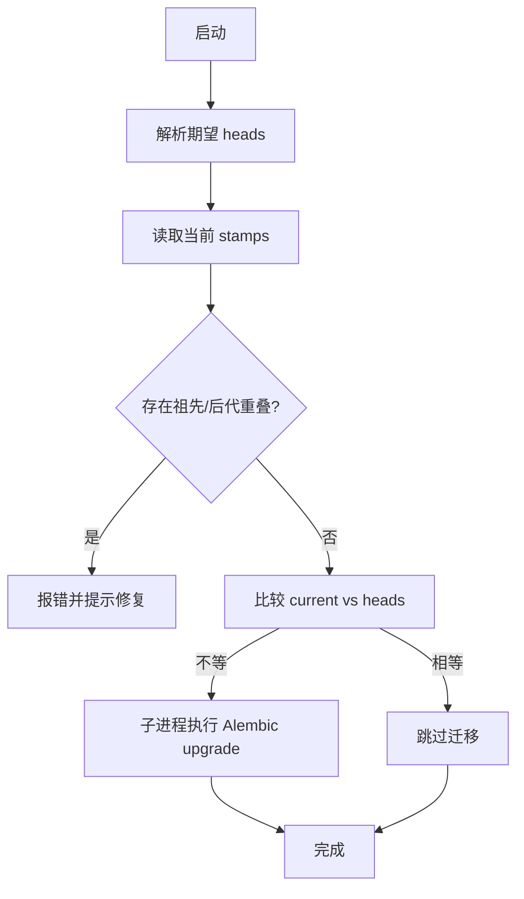
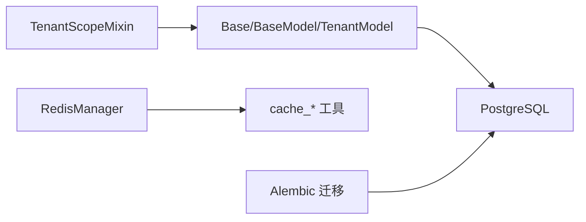

# 数据架构设计

<cite>
**本文引用的文件**
- [backend/app/core/database.py](file://backend/app/core/database.py)
- [backend/app/core/base_model.py](file://backend/app/core/base_model.py)
- [backend/app/core/redis.py](file://backend/app/core/redis.py)
- [backend/app/core/repository_parts/tenant_scope.py](file://backend/app/core/repository_parts/tenant_scope.py)
- [backend/migrations/versions/20260111_0001_initial.py](file://backend/migrations/versions/20260111_0001_initial.py)
- [backend/migrations/versions/20260208_004_add_tenant_quotas.py](file://backend/migrations/versions/20260208_004_add_tenant_quotas.py)
- [backend/migrations/versions/20260210_0005_create_agent_engine_tables.py](file://backend/migrations/versions/20260210_0005_create_agent_engine_tables.py)
- [backend/migrations/versions/20260211_ee87f790553e_add_ai_action_logs_table.py](file://backend/migrations/versions/20260211_ee87f790553e_add_ai_action_logs_table.py)
- [backend/migrations/versions/20260212_6f8e790c9a68_add_ai_query_logs_table.py](file://backend/migrations/versions/20260212_6f8e790c9a68_add_ai_query_logs_table.py)
- [backend/migrations/versions/20260305_add_tenant_scoped_unique_constraints.py](file://backend/migrations/versions/20260305_add_tenant_scoped_unique_constraints.py)
- [backend/migrations/versions/20260321_ai_call_log_contract.py](file://backend/migrations/versions/20260321_ai_call_log_contract.py)
- [backend/migrations/versions/20260324_add_missing_recycle_bin_columns.py](file://backend/migrations/versions/20260324_add_missing_recycle_bin_columns.py)
- [backend/migrations/versions/20260329_0030_add_memory_records.py](file://backend/migrations/versions/20260329_0030_add_memory_records.py)
- [backend/migrations/versions/20260329_0040_add_execution_trust_policies.py](file://backend/migrations/versions/20260329_0040_add_execution_trust_policies.py)
- [backend/migrations/versions/20260330_0060_add_execution_decision_id_to_ai_action_logs.py](file://backend/migrations/versions/20260330_0060_add_execution_decision_id_to_ai_action_logs.py)
- [backend/migrations/README](file://backend/migrations/README)
- [backend/alembic.ini](file://backend/alembic.ini)
- [backend/app/models/tenant/tenant_quota.py](file://backend/app/models/tenant/tenant_quota.py)
- [backend/app/models/system/task_definition.py](file://backend/app/models/system/task_definition.py)
- [backend/app/models/system/task_run.py](file://backend/app/models/system/task_run.py)
- [backend/app/models/ai/agent.py](file://backend/app/models/ai/agent.py)
- [backend/app/models/ai/call_log.py](file://backend/app/models/ai/call_log.py)
- [backend/app/models/ai/action_log.py](file://backend/app/models/ai/action_log.py)
- [backend/app/models/ai/query_log.py](file://backend/app/models/ai/query_log.py)
- [backend/app/models/ai/memory_record.py](file://backend/app/models/ai/memory_record.py)
- [backend/app/models/ai/execution_decision.py](file://backend/app/models/ai/execution_decision.py)
- [backend/app/models/ai/execution_trust_policy.py](file://backend/app/models/ai/execution_trust_policy.py)
- [backend/app/models/system/plugin.py](file://backend/app/models/system/plugin.py)
- [backend/app/models/system/plugin_license.py](file://backend/app/models/system/plugin_license.py)
- [backend/app/models/system/resource_tenant_assignment.py](file://backend/app/models/system/resource_tenant_assignment.py)
- [backend/app/models/common/notification.py](file://backend/app/models/common/notification.py)
- [backend/app/models/common/notification_delivery.py](file://backend/app/models/common/notification_delivery.py)
- [backend/app/models/common/notification_preference.py](file://backend/app/models/common/notification_preference.py)
- [backend/app/models/common/notification_template.py](file://backend/app/models/common/notification_template.py)
- [backend/app/models/common/user_preference.py](file://backend/app/models/common/user_preference.py)
- [backend/app/models/system/codegen_config.py](file://backend/app/models/system/codegen_config.py)
- [backend/app/models/system/codegen_config_version.py](file://backend/app/models/system/codegen_config_version.py)
- [backend/app/models/system/operation_log.py](file://backend/app/models/system/operation_log.py)
- [backend/app/models/system/email_log.py](file://backend/app/models/system/email_log.py)
- [backend/app/models/tenant/attachment.py](file://backend/app/models/tenant/attachment.py)
- [backend/app/models/tenant/domain_ssl_certificate.py](file://backend/app/models/tenant/domain_ssl_certificate.py)
- [backend/app/models/tenant/tenant.py](file://backend/app/models/tenant/tenant.py)
- [backend/app/models/tenant/tenant_user.py](file://backend/app/models/tenant/tenant_user.py)
- [backend/app/models/tenant/tenant_plan.py](file://backend/app/models/tenant/tenant_plan.py)
- [backend/app/models/tenant/announcement.py](file://backend/app/models/tenant/announcement.py)
- [backend/app/models/tenant/announcement_delivery.py](file://backend/app/models/tenant/announcement_delivery.py)
- [backend/app/models/tenant/announcement_response.py](file://backend/app/models/tenant/announcement_response.py)
- [backend/app/models/tenant/tenant_admin.py](file://backend/app/models/tenant/tenant_admin.py)
- [backend/app/models/tenant/tenant_domain.py](file://backend/app/models/tenant/tenant_domain.py)
- [backend/app/models/tenant/tenant_agent_platform_kb_suppression.py](file://backend/app/models/tenant/tenant_agent_platform_kb_suppression.py)
- [backend/app/models/tenant/tenant_agent_publication.py](file://backend/app/models/tenant/tenant_agent_publication.py)
- [backend/app/models/auth/admin_role.py](file://backend/app/models/auth/admin_role.py)
- [backend/app/models/auth/tenant_admin_role.py](file://backend/app/models/auth/tenant_admin_role.py)
- [backend/app/models/auth/permission.py](file://backend/app/models/auth/permission.py)
- [backend/app/models/auth/tenant_user_role.py](file://backend/app/models/auth/tenant_user_role.py)
- [backend/app/models/org/admin_org_node.py](file://backend/app/models/org/admin_org_node.py)
- [backend/app/models/org/tenant_org_node.py](file://backend/app/models/org/tenant_org_node.py)
- [backend/app/models/system/config.py](file://backend/app/models/system/config.py)
- [backend/app/models/system/plugin_version.py](file://backend/app/models/system/plugin_version.py)
- [backend/app/models/system/tenant_task_binding.py](file://backend/app/models/system/tenant_task_binding.py)
- [backend/app/models/system/agent_assignment.py](file://backend/app/models/system/agent_assignment.py)
- [backend/app/models/system/admin.py](file://backend/app/models/system/admin.py)
</cite>

## 目录
1. [简介](#简介)
2. [项目结构](#项目结构)
3. [核心组件](#核心组件)
4. [架构总览](#架构总览)
5. [详细组件分析](#详细组件分析)
6. [依赖分析](#依赖分析)
7. [性能考虑](#性能考虑)
8. [故障排查指南](#故障排查指南)
9. [结论](#结论)
10. [附录](#附录)

## 简介
本文件面向 NovusAI SaaS 的数据架构设计，聚焦以下主题：
- 数据库设计模式、ORM 映射策略与数据模型关系
- 多租户数据隔离机制与表结构设计原则
- 索引优化策略与查询路径
- 数据迁移管理、版本控制与向后兼容性保障
- 缓存架构设计、Redis 数据模型与分布式锁机制
- 数据一致性保证、事务管理策略与并发控制方案
- 数据备份恢复、性能监控与容量规划策略

## 项目结构
后端采用 SQLAlchemy ORM + Alembic 迁移，核心数据层位于 app/core，模型定义在 app/models，迁移脚本位于 backend/migrations。



图表来源
- [backend/app/core/database.py:65-118](file://backend/app/core/database.py#L65-L118)
- [backend/app/core/base_model.py:32-194](file://backend/app/core/base_model.py#L32-L194)
- [backend/app/core/repository_parts/tenant_scope.py:17-283](file://backend/app/core/repository_parts/tenant_scope.py#L17-L283)
- [backend/app/core/redis.py:19-116](file://backend/app/core/redis.py#L19-L116)

章节来源
- [backend/app/core/database.py:65-118](file://backend/app/core/database.py#L65-L118)
- [backend/app/core/base_model.py:32-194](file://backend/app/core/base_model.py#L32-L194)
- [backend/app/core/redis.py:19-116](file://backend/app/core/redis.py#L19-L116)
- [backend/app/core/repository_parts/tenant_scope.py:17-283](file://backend/app/core/repository_parts/tenant_scope.py#L17-L283)

## 核心组件
- 数据库引擎与会话管理：提供异步/同步引擎、会话工厂、依赖注入与连接健康检查。
- ORM 基类与模型：统一的 Base/BaseModel/TenantModel 抽象，内置软删除、回收站、时间戳等通用能力。
- 仓储层多租户隔离：TenantScopeMixin 自动注入 tenant_id/owner_tenant_id 过滤，覆盖读写与批量操作。
- Redis 缓存：连接池管理、序列化工具与健康检查。

章节来源
- [backend/app/core/database.py:65-118](file://backend/app/core/database.py#L65-L118)
- [backend/app/core/base_model.py:38-194](file://backend/app/core/base_model.py#L38-L194)
- [backend/app/core/repository_parts/tenant_scope.py:17-283](file://backend/app/core/repository_parts/tenant_scope.py#L17-L283)
- [backend/app/core/redis.py:19-116](file://backend/app/core/redis.py#L19-L116)

## 架构总览
整体数据流围绕“请求—仓储—ORM—数据库”展开，并通过 Alembic 管理结构演进；缓存通过 Redis 提升热点读取性能。



图表来源
- [backend/app/core/database.py:135-158](file://backend/app/core/database.py#L135-L158)
- [backend/app/core/repository_parts/tenant_scope.py:42-125](file://backend/app/core/repository_parts/tenant_scope.py#L42-L125)
- [backend/app/core/redis.py:76-116](file://backend/app/core/redis.py#L76-L116)

## 详细组件分析

### 数据库引擎与会话管理
- 异步引擎与会话工厂：配置连接池大小、溢出、超时与 pre-ping，确保高并发下的稳定性。
- 依赖注入：FastAPI 依赖 get_db 与上下文管理器 get_db_context，统一事务提交/回滚语义。
- 迁移与健康检查：封装 Alembic 子进程迁移、版本重叠检测、数据库存在性检查与连接验证。



图表来源
- [backend/app/core/database.py:608-653](file://backend/app/core/database.py#L608-L653)

章节来源
- [backend/app/core/database.py:65-118](file://backend/app/core/database.py#L65-L118)
- [backend/app/core/database.py:135-158](file://backend/app/core/database.py#L135-L158)
- [backend/app/core/database.py:433-606](file://backend/app/core/database.py#L433-L606)
- [backend/app/core/database.py:608-653](file://backend/app/core/database.py#L608-L653)

### ORM 基类与模型设计
- Base：SQLAlchemy 声明式基类。
- BaseModel：统一主键、创建/更新时间、软删除、回收站阶段等字段。
- TenantModel：在 BaseModel 基础上增加 tenant_id 并建立索引，作为多租户隔离基础。
- 表名规则：类名转 snake_case 自动生成表名，便于维护一致性。



图表来源
- [backend/app/core/base_model.py:32-194](file://backend/app/core/base_model.py#L32-L194)

章节来源
- [backend/app/core/base_model.py:32-194](file://backend/app/core/base_model.py#L32-L194)

### 多租户数据隔离与仓储层
- 自动注入：TenantScopeMixin 在 get_list/count/create/get_by_id/query_list/select_options 等方法中自动追加 tenant_id 过滤。
- 权限与回收站：支持 include_deleted、delete_level、recycle_stage 等维度的过滤与统计。
- 批量操作：update_many/delete_many 支持软删除与硬删除，并结合数据权限条件。



图表来源
- [backend/app/core/repository_parts/tenant_scope.py:42-125](file://backend/app/core/repository_parts/tenant_scope.py#L42-L125)

章节来源
- [backend/app/core/repository_parts/tenant_scope.py:17-283](file://backend/app/core/repository_parts/tenant_scope.py#L17-L283)

### 缓存架构与 Redis 设计
- 连接池管理：RedisManager 统一创建连接池与客户端，健康检查 ping。
- 序列化工具：cache_get/cache_set/cache_delete/cache_exists，统一 JSON 序列化/反序列化。
- 分布式锁：建议基于 Redis SET key value NX EX ttl 实现，避免资源竞争（需在业务层补充实现）。



图表来源
- [backend/app/core/redis.py:89-116](file://backend/app/core/redis.py#L89-L116)

章节来源
- [backend/app/core/redis.py:19-116](file://backend/app/core/redis.py#L19-L116)

### 数据模型关系与表设计原则
- 通用字段：所有实体共享 BaseModel 字段，确保审计与回收站能力一致。
- 多租户字段：TenantModel 统一 tenant_id 索引，避免跨租户数据泄露。
- 软删除与回收站：is_deleted+回收站阶段+删除级别，支持模块级与全局级回收。
- 业务域划分：AI、系统、租户、认证、组织、通知等子包按领域拆分，职责清晰。

```mermaid
erDiagram
BASE_MODEL {
int id PK
timestamp created_at
timestamp updated_at
boolean is_deleted
timestamp deleted_at
string delete_level
string recycle_stage
timestamp promoted_to_global_at
}
TENANT_MODEL {
int tenant_id
}
BASE_MODEL <|-- TENANT_MODEL
```

图表来源
- [backend/app/core/base_model.py:38-194](file://backend/app/core/base_model.py#L38-L194)

章节来源
- [backend/app/core/base_model.py:38-194](file://backend/app/core/base_model.py#L38-L194)

### 索引优化策略
- tenant_id 建索引：TenantModel 默认索引 tenant_id，保障多租户过滤效率。
- 软删除过滤：is_deleted 建索引，配合 include_deleted 控制扫描范围。
- 回收站阶段：recycle_stage 建索引，加速回收站查询与清理任务。
- 唯一约束：迁移中引入“按租户作用域的唯一约束”，避免重复与提升并发安全性。

章节来源
- [backend/app/core/base_model.py:66-94](file://backend/app/core/base_model.py#L66-L94)
- [backend/app/core/base_model.py:188-190](file://backend/app/core/base_model.py#L188-L190)
- [backend/migrations/versions/20260305_add_tenant_scoped_unique_constraints.py](file://backend/migrations/versions/20260305_add_tenant_scoped_unique_constraints.py)

### 数据迁移管理与版本控制
- 迁移入口：Alembic 配置与版本位置动态构建，支持主应用与插件扩展。
- 子进程执行：强制 UTF-8 文件 I/O，避免 Windows 编码问题。
- 版本重叠检测：校验 alembic_version 中祖先/后代同时存在的情况，防止 schema 不一致。
- 启动跳过策略：当当前版本与期望 heads 一致时跳过迁移，减少启动时间。



图表来源
- [backend/app/core/database.py:284-431](file://backend/app/core/database.py#L284-L431)
- [backend/app/core/database.py:433-606](file://backend/app/core/database.py#L433-L606)
- [backend/alembic.ini](file://backend/alembic.ini)

章节来源
- [backend/app/core/database.py:284-431](file://backend/app/core/database.py#L284-L431)
- [backend/app/core/database.py:433-606](file://backend/app/core/database.py#L433-L606)
- [backend/migrations/README](file://backend/migrations/README)

### 代表性模型与日志/配额/任务域
- AI 日志域：call_log、action_log、query_log、memory_record、execution_decision、execution_trust_policy 等，支撑智能体行为追踪与治理。
- 租户配额：tenant_quota，结合迁移脚本与模型定义，实现资源限额与用量统计。
- 系统任务：task_definition、task_run，承载定时与周期性任务的调度与执行记录。
- 通知与偏好：notification、notification_delivery、notification_preference、notification_template、user_preference，统一消息通道与用户偏好。
- 插件与资源：plugin、plugin_license、resource_tenant_assignment 等，支持插件生命周期与资源分配。

章节来源
- [backend/app/models/ai/call_log.py](file://backend/app/models/ai/call_log.py)
- [backend/app/models/ai/action_log.py](file://backend/app/models/ai/action_log.py)
- [backend/app/models/ai/query_log.py](file://backend/app/models/ai/query_log.py)
- [backend/app/models/ai/memory_record.py](file://backend/app/models/ai/memory_record.py)
- [backend/app/models/ai/execution_decision.py](file://backend/app/models/ai/execution_decision.py)
- [backend/app/models/ai/execution_trust_policy.py](file://backend/app/models/ai/execution_trust_policy.py)
- [backend/app/models/tenant/tenant_quota.py](file://backend/app/models/tenant/tenant_quota.py)
- [backend/app/models/system/task_definition.py](file://backend/app/models/system/task_definition.py)
- [backend/app/models/system/task_run.py](file://backend/app/models/system/task_run.py)
- [backend/app/models/common/notification.py](file://backend/app/models/common/notification.py)
- [backend/app/models/common/notification_delivery.py](file://backend/app/models/common/notification_delivery.py)
- [backend/app/models/common/notification_preference.py](file://backend/app/models/common/notification_preference.py)
- [backend/app/models/common/notification_template.py](file://backend/app/models/common/notification_template.py)
- [backend/app/models/common/user_preference.py](file://backend/app/models/common/user_preference.py)
- [backend/app/models/system/plugin.py](file://backend/app/models/system/plugin.py)
- [backend/app/models/system/plugin_license.py](file://backend/app/models/system/plugin_license.py)
- [backend/app/models/system/resource_tenant_assignment.py](file://backend/app/models/system/resource_tenant_assignment.py)

## 依赖分析
- 数据层耦合：仓储层依赖 ORM 基类与数据库引擎；模型依赖基类；Redis 独立于 ORM。
- 迁移耦合：迁移脚本通过 Alembic 驱动，版本位置动态构建，避免硬编码。
- 多租户耦合：TenantScopeMixin 通过反射字段 tenant_id/owner_tenant_id，降低对具体模型的侵入。



图表来源
- [backend/app/core/repository_parts/tenant_scope.py:30-37](file://backend/app/core/repository_parts/tenant_scope.py#L30-L37)
- [backend/app/core/base_model.py:188-190](file://backend/app/core/base_model.py#L188-L190)
- [backend/app/core/redis.py:76-116](file://backend/app/core/redis.py#L76-L116)
- [backend/app/core/database.py:474-556](file://backend/app/core/database.py#L474-L556)

章节来源
- [backend/app/core/repository_parts/tenant_scope.py:30-37](file://backend/app/core/repository_parts/tenant_scope.py#L30-L37)
- [backend/app/core/base_model.py:188-190](file://backend/app/core/base_model.py#L188-L190)
- [backend/app/core/redis.py:76-116](file://backend/app/core/redis.py#L76-L116)
- [backend/app/core/database.py:474-556](file://backend/app/core/database.py#L474-L556)

## 性能考虑
- 连接池与预检：启用 pool_pre_ping，减少断连与慢查询影响。
- 事务边界：统一使用 managed_async_session 确保异常回滚与正常提交。
- 索引策略：tenant_id、is_deleted、recycle_stage 建索引；对高频过滤字段建立复合索引。
- 缓存热点：对读多写少的配置、模板、通知偏好进行缓存，设置 TTL。
- 迁移批处理：大量数据变更优先使用批量更新/删除，减少单条事务开销。

## 故障排查指南
- 数据库连接失败：检查 PostgreSQL 是否启动、网络可达与凭据；查看启动日志与失败原因。
- 迁移失败：核对 alembic.ini 存在性、版本位置与迁移文件；关注子进程输出；修复版本重叠问题。
- 迁移跳过：确认当前 stamps 与 heads 一致；如不一致，手动执行升级命令。
- Redis 不可用：确认 RedisManager 初始化与 ping 成功；检查连接池与超时配置。

章节来源
- [backend/app/core/database.py:166-234](file://backend/app/core/database.py#L166-L234)
- [backend/app/core/database.py:433-606](file://backend/app/core/database.py#L433-L606)
- [backend/app/core/redis.py:67-74](file://backend/app/core/redis.py#L67-L74)

## 结论
本数据架构以 SQLAlchemy ORM 为核心，结合 TenantScopeMixin 实现多租户隔离，借助 Alembic 管理结构演进，并通过 Redis 提升热点读取性能。通过统一的软删除与回收站机制、索引策略与事务管理，兼顾了数据一致性、可维护性与性能表现。建议在后续迭代中完善分布式锁、埋点与容量规划方案，持续优化迁移与监控体系。

## 附录
- 迁移说明：参见 backend/migrations/README。
- Alembic 配置：backend/alembic.ini。
- 代表性迁移脚本：
  - [20260111_0001_initial.py](file://backend/migrations/versions/20260111_0001_initial.py)
  - [20260208_004_add_tenant_quotas.py](file://backend/migrations/versions/20260208_004_add_tenant_quotas.py)
  - [20260210_0005_create_agent_engine_tables.py](file://backend/migrations/versions/20260210_0005_create_agent_engine_tables.py)
  - [20260211_ee87f790553e_add_ai_action_logs_table.py](file://backend/migrations/versions/20260211_ee87f790553e_add_ai_action_logs_table.py)
  - [20260212_6f8e790c9a68_add_ai_query_logs_table.py](file://backend/migrations/versions/20260212_6f8e790c9a68_add_ai_query_logs_table.py)
  - [20260305_add_tenant_scoped_unique_constraints.py](file://backend/migrations/versions/20260305_add_tenant_scoped_unique_constraints.py)
  - [20260321_ai_call_log_contract.py](file://backend/migrations/versions/20260321_ai_call_log_contract.py)
  - [20260324_add_missing_recycle_bin_columns.py](file://backend/migrations/versions/20260324_add_missing_recycle_bin_columns.py)
  - [20260329_0030_add_memory_records.py](file://backend/migrations/versions/20260329_0030_add_memory_records.py)
  - [20260329_0040_add_execution_trust_policies.py](file://backend/migrations/versions/20260329_0040_add_execution_trust_policies.py)
  - [20260330_0060_add_execution_decision_id_to_ai_action_logs.py](file://backend/migrations/versions/20260330_0060_add_execution_decision_id_to_ai_action_logs.py)