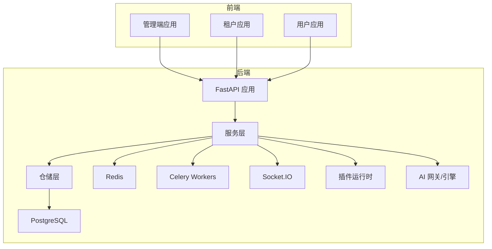
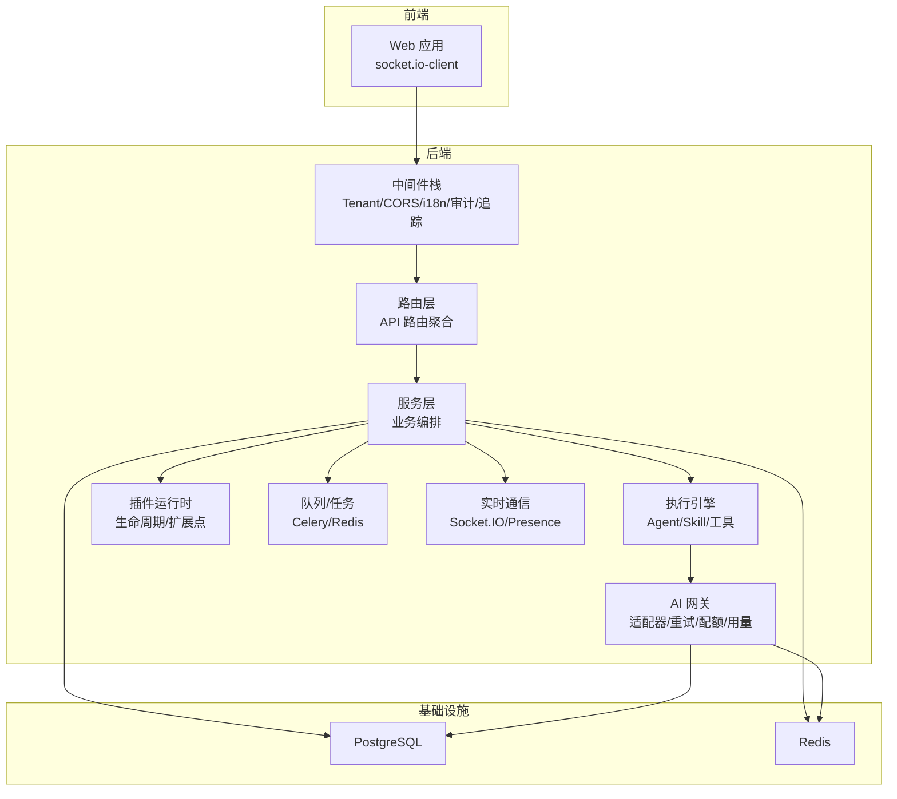
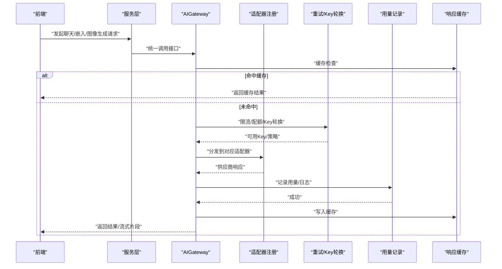
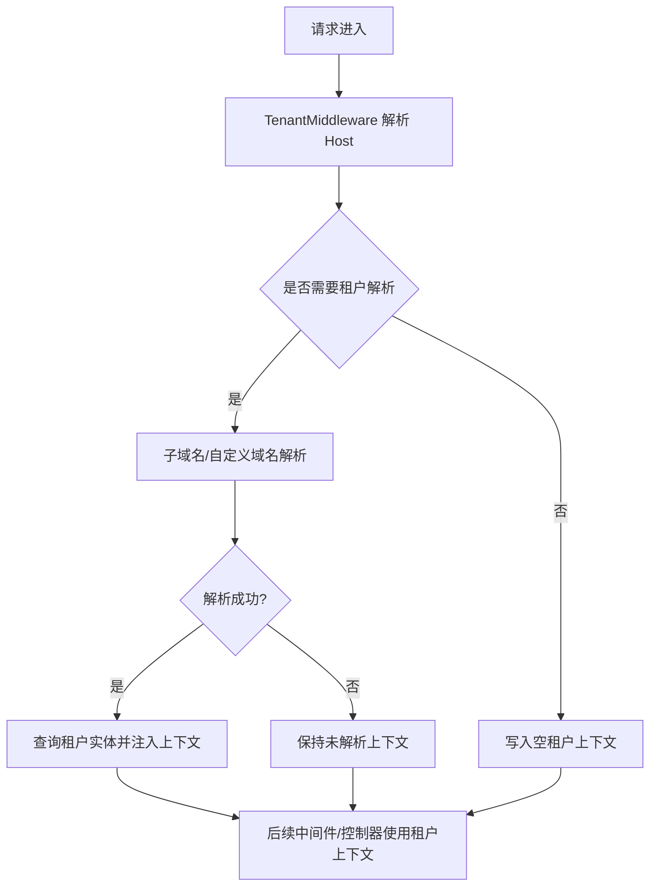
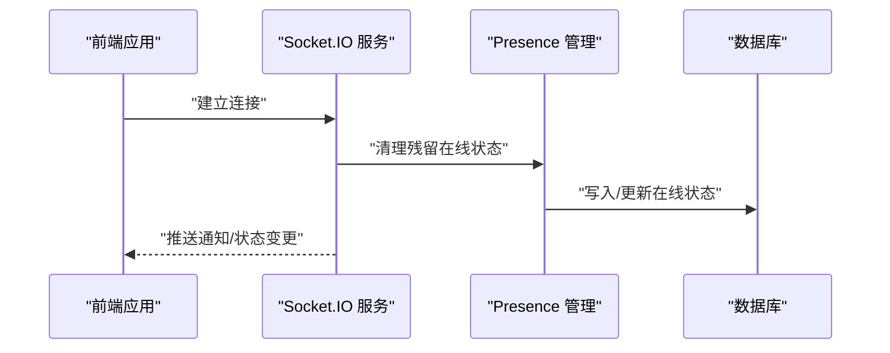
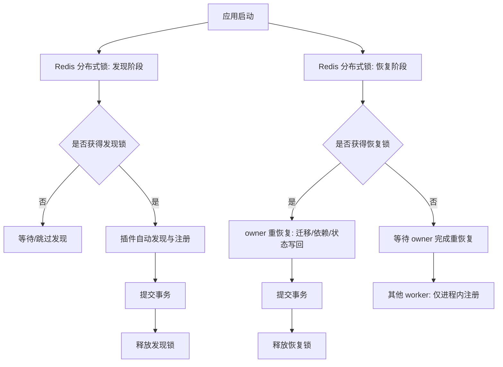
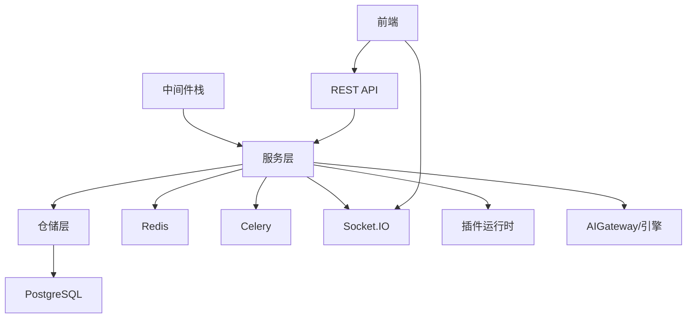

# 系统架构设计

<cite>
**本文引用的文件**
- [backend/app/main.py](file://backend/app/main.py)
- [backend/app/celery_app.py](file://backend/app/celery_app.py)
- [backend/app/ai/__init__.py](file://backend/app/ai/__init__.py)
- [backend/app/ai/gateway.py](file://backend/app/ai/gateway.py)
- [backend/app/ai/internal_ai_service.py](file://backend/app/ai/internal_ai_service.py)
- [backend/app/ai/engine/__init__.py](file://backend/app/ai/engine/__init__.py)
- [backend/app/ai/routing/__init__.py](file://backend/app/ai/routing/__init__.py)
- [backend/app/middleware/tenant.py](file://backend/app/middleware/tenant.py)
- [backend/app/models/tenant/__init__.py](file://backend/app/models/tenant/__init__.py)
- [backend/app/repositories/tenant/__init__.py](file://backend/app/repositories/tenant/__init__.py)
- [backend/app/services/tenant/__init__.py](file://backend/app/services/tenant/__init__.py)
- [backend/app/api/tenant/__init__.py](file://backend/app/api/tenant/__init__.py)
- [frontend/apps/web-antd/package.json](file://frontend/apps/web-antd/package.json)
- [README.md](file://README.md)
</cite>

## 目录
1. [引言](#引言)
2. [项目结构](#项目结构)
3. [核心组件](#核心组件)
4. [架构总览](#架构总览)
5. [详细组件分析](#详细组件分析)
6. [依赖分析](#依赖分析)
7. [性能考虑](#性能考虑)
8. [故障排查指南](#故障排查指南)
9. [结论](#结论)
10. [附录](#附录)

## 引言
本文件为 NovusAI SaaS 的系统架构设计文档，聚焦于整体架构模式与四大核心架构支柱：AI 能力集成架构、多租户管理架构、实时通信架构与插件扩展架构。文档从系统边界、组件职责、模块化设计原则出发，阐述前后端分离、微服务化与插件化的落地方式，给出技术选型与权衡、约束条件、数据流与集成模式，并提供架构决策记录与演进路线图。

## 项目结构
- 后端采用 FastAPI + SQLAlchemy 2.x + Alembic + Celery + Socket.IO 的现代化 SaaS 技术栈，提供多端应用（admin/tenant/user）、多租户、AI Agent 运行链路、插件系统、实时通知、异步任务、附件与存储、CRUD 代码生成与数据库迁移等能力。
- 前端基于 Vue 3 + TypeScript + Vben Admin + Ant Design Vue + Vite + pnpm，通过 socket.io-client 实现实时通信。
- 仓库采用前后端分离的 monorepo 结构，后端以 app/ 为核心模块，插件与业务扩展位于 plugins/ 与 business/、extensions/、customer/ 等目录。

图表来源
- [README.md:46-87](file://README.md#L46-L87)

章节来源
- [README.md:99-119](file://README.md#L99-L119)

## 核心组件
- 应用入口与生命周期：FastAPI 应用入口负责中间件注册、异常处理、数据库与 Redis 初始化、权限与配置同步、插件自动发现与恢复、WebSocket 平台配置、通知模板种子数据与 Celery Broker 连通性检查等。
- 异步任务与队列：Celery 应用配置了多队列路由与优先级，支持 AI 网关、定时任务、通知、回收站清理等任务模块，并在 worker/beat 进程中进行插件队列扩展的恢复。
- AI 能力集成：统一网关 AIGateway 提供聊天、嵌入、图像生成与模型连通性测试，内置重试、Key 轮换、配额与用量记录、缓存与流式响应（SSE）。
- 多租户管理：TenantMiddleware 从 Host 头解析租户上下文，支持子域名与自定义域名两种模式，将租户上下文注入请求状态，贯穿权限与数据隔离。
- 实时通信：Socket.IO 用于管理端、租户端与用户端的通知与在线状态，配合 Presence 管理与通知模板种子数据。
- 插件扩展：插件系统支持后端插件、前端插件入口、菜单、资源、生命周期与扩展点，启动阶段通过 Redis 分布式锁保证多 worker 并发安全。

章节来源
- [backend/app/main.py:53-487](file://backend/app/main.py#L53-L487)
- [backend/app/celery_app.py:20-226](file://backend/app/celery_app.py#L20-L226)
- [backend/app/ai/gateway.py:59-406](file://backend/app/ai/gateway.py#L59-L406)
- [backend/app/middleware/tenant.py:93-259](file://backend/app/middleware/tenant.py#L93-L259)

## 架构总览
系统采用前后端分离架构，后端以 FastAPI 为核心，围绕“服务层-仓储层-数据库/缓存/消息”的分层设计，结合 AI 网关与插件运行时实现能力扩展；多租户通过中间件在请求层进行租户识别与上下文注入；实时通信通过 Socket.IO 与 Redis 协同；异步任务通过 Celery 与 Redis 实现高吞吐与可靠性。

图表来源
- [backend/app/main.py:635-799](file://backend/app/main.py#L635-L799)
- [backend/app/celery_app.py:67-106](file://backend/app/celery_app.py#L67-L106)
- [backend/app/ai/gateway.py:59-176](file://backend/app/ai/gateway.py#L59-L176)

## 详细组件分析

### AI 能力集成架构
- 设计要点
  - 统一网关 AIGateway：封装聊天、嵌入、图像生成与测试接口，屏蔽供应商差异，提供指数退避重试、Key 轮换、配额与用量记录、缓存与流式响应。
  - 执行引擎与协议：支持会话、任务、批处理等多模式执行，统一调度与结果抽象。
  - 路由与复杂度分类：提供多模型路由策略，依据输入复杂度选择合适模型，提升成本与效果平衡。
  - 内部 AI 服务：为平台与租户内部调用提供显式的基础设施入口，避免依赖合成系统智能体记录。
- 数据流与控制流
  - 请求进入 AIGateway 后，按顺序执行缓存检查、限流、配额、Key 获取、适配器调用（含重试）、日志与用量更新、结果写缓存。
  - 流式响应通过 SSE 返回，前端以 socket.io-client 接收实时片段。
- 关键文件
  - [AIGateway:59-406](file://backend/app/ai/gateway.py#L59-L406)
  - [内部 AI 服务:22-135](file://backend/app/ai/internal_ai_service.py#L22-L135)
  - [执行引擎导出:28-66](file://backend/app/ai/engine/__init__.py#L28-L66)
  - [路由模块导出:8-17](file://backend/app/ai/routing/__init__.py#L8-L17)

图表来源
- [backend/app/ai/gateway.py:114-176](file://backend/app/ai/gateway.py#L114-L176)
- [backend/app/ai/gateway.py:228-256](file://backend/app/ai/gateway.py#L228-L256)

章节来源
- [backend/app/ai/gateway.py:59-406](file://backend/app/ai/gateway.py#L59-L406)
- [backend/app/ai/internal_ai_service.py:22-135](file://backend/app/ai/internal_ai_service.py#L22-L135)
- [backend/app/ai/engine/__init__.py:28-66](file://backend/app/ai/engine/__init__.py#L28-L66)
- [backend/app/ai/routing/__init__.py:8-17](file://backend/app/ai/routing/__init__.py#L8-L17)

### 多租户管理架构
- 设计要点
  - 租户识别中间件：从 Host 头解析租户上下文，支持子域名与自定义域名两种模式；解析结果注入请求状态，供后续中间件与控制器使用。
  - 数据与权限隔离：租户上下文贯穿权限预加载、审计日志与业务逻辑，确保跨租户数据隔离与访问控制。
  - 配置与域名：平台支持主域名与管理端域名白名单，避免误解析；自定义域名经验证后生效。
- 控制流
  - 请求到达中间件栈，TenantMiddleware 根据路径前缀判断是否需要解析；解析成功后加载租户实体并写入上下文。
  - 控制器与服务层通过上下文获取租户标识，执行相应业务逻辑。
- 关键文件
  - [租户中间件:93-259](file://backend/app/middleware/tenant.py#L93-259)
  - [租户模型导出:8-32](file://backend/app/models/tenant/__init__.py#L8-L32)
  - [租户仓储导出:8-43](file://backend/app/repositories/tenant/__init__.py#L8-L43)
  - [租户服务导出:8-42](file://backend/app/services/tenant/__init__.py#L8-L42)
  - [租户 API 路由聚合:11-150](file://backend/app/api/tenant/__init__.py#L11-L150)

图表来源
- [backend/app/middleware/tenant.py:120-222](file://backend/app/middleware/tenant.py#L120-L222)

章节来源
- [backend/app/middleware/tenant.py:93-259](file://backend/app/middleware/tenant.py#L93-L259)
- [backend/app/models/tenant/__init__.py:8-32](file://backend/app/models/tenant/__init__.py#L8-L32)
- [backend/app/repositories/tenant/__init__.py:8-43](file://backend/app/repositories/tenant/__init__.py#L8-L43)
- [backend/app/services/tenant/__init__.py:8-42](file://backend/app/services/tenant/__init__.py#L8-L42)
- [backend/app/api/tenant/__init__.py:11-150](file://backend/app/api/tenant/__init__.py#L11-L150)

### 实时通信架构
- 设计要点
  - 基于 Socket.IO 的实时通知与在线状态管理，前端通过 socket.io-client 连接后端。
  - 启动阶段应用 WebSocket 平台配置（心跳间隔/超时），清理残留在线状态数据，确保服务重启后的状态一致性。
  - 通知模板种子数据在启动时写入，保障首次运行即具备通知能力。
- 关键文件
  - [应用入口中的 WebSocket 配置与清理:239-261](file://backend/app/main.py#L239-L261)
  - [前端依赖中的 socket.io-client:85-85](file://frontend/apps/web-antd/package.json#L85-L85)

图表来源
- [backend/app/main.py:239-261](file://backend/app/main.py#L239-L261)

章节来源
- [backend/app/main.py:239-261](file://backend/app/main.py#L239-L261)
- [frontend/apps/web-antd/package.json:85-85](file://frontend/apps/web-antd/package.json#L85-L85)

### 插件扩展架构
- 设计要点
  - 启动阶段通过 Redis 分布式锁确保插件自动发现与恢复的幂等性与一致性；区分“发现阶段”与“恢复阶段”，避免多 worker 并发迁移竞争。
  - 恢复阶段分为“owner worker 重恢复（含迁移/依赖安装/状态写回）”与“其他 worker 仅进程内注册（不写库）”，降低启动时延与冲突风险。
  - 插件队列扩展在 Celery worker/beat 进程中单独恢复，确保任务消费者与计划任务的正确性。
- 关键文件
  - [应用入口中的插件启动流程:273-449](file://backend/app/main.py#L273-L449)
  - [Celery 中的插件队列扩展恢复:117-183](file://backend/app/celery_app.py#L117-L183)

图表来源
- [backend/app/main.py#L273-L449:273-449](file://backend/app/main.py#L273-L449)
- [backend/app/celery_app.py#L117-L183:117-183](file://backend/app/celery_app.py#L117-L183)

章节来源
- [backend/app/main.py:273-449](file://backend/app/main.py#L273-L449)
- [backend/app/celery_app.py:117-183](file://backend/app/celery_app.py#L117-L183)

## 依赖分析
- 组件耦合与内聚
  - 中间件层高度内聚，围绕请求生命周期进行横切关注点（鉴权、审计、国际化、追踪、CORS、维护模式、租户识别、指标）。
  - 服务层通过仓储层与数据库交互，保持业务逻辑与数据访问的清晰边界；AI 网关与插件运行时作为横切能力被服务层复用。
  - 前端通过 socket.io-client 与后端实时通道交互，与后端 API 通过 REST 接口通信。
- 外部依赖与集成点
  - 数据库：PostgreSQL（Alembic 迁移）。
  - 缓存与消息：Redis（连接池、分布式锁、队列后端）。
  - 异步任务：Celery（多队列、优先级、动态任务模块导入、Beat 调度）。
  - 实时通信：Socket.IO（心跳配置、Presence 管理、通知模板）。
  - 前端：socket.io-client 与 UI 组件库。

图表来源
- [backend/app/main.py:635-799](file://backend/app/main.py#L635-L799)
- [backend/app/celery_app.py:67-106](file://backend/app/celery_app.py#L67-L106)
- [frontend/apps/web-antd/package.json:85-85](file://frontend/apps/web-antd/package.json#L85-L85)

章节来源
- [backend/app/main.py:635-799](file://backend/app/main.py#L635-L799)
- [backend/app/celery_app.py:67-106](file://backend/app/celery_app.py#L67-L106)
- [frontend/apps/web-antd/package.json:85-85](file://frontend/apps/web-antd/package.json#L85-L85)

## 性能考虑
- 启动阶段优化
  - 使用 Redis 分布式锁避免多 worker 并发执行插件发现与恢复，减少重复工作与竞态。
  - 早期 Redis 初始化确保后续分布式锁可用，降低启动失败概率。
- 运行时优化
  - AIGateway 的缓存检查与用量记录前置，减少无效调用与 IO。
  - 多队列与优先级路由（高优/默认/AI 网关/定时/通知）提升吞吐与延迟表现。
  - Socket.IO 平台配置（心跳间隔/超时）与 Presence 清理降低连接抖动与状态不一致。
- 可观测性
  - Prometheus 指标中间件与就绪探针主动刷新组件健康状态，避免仅依赖副作用导致的误判。

## 故障排查指南
- 启动失败
  - 数据库初始化失败：检查数据库连接与迁移状态，必要时手动执行迁移。
  - Redis 初始化失败：确认 Redis 可达性与权限，确保分布式锁可用。
  - 插件启动失败：查看插件发现与恢复日志，定位锁持有者与等待超时问题。
- 运行时异常
  - AI 调用异常：检查适配器注册、Key 轮换与重试策略、配额与用量记录。
  - 租户解析异常：确认 Host 头、域名后缀与自定义域名验证状态。
  - 实时通信异常：检查 WebSocket 平台配置与 Presence 清理日志。
- 任务队列异常
  - Celery 连接失败：检查 Broker/Result Backend 配置与网络连通性。
  - 任务未执行：核对队列路由与任务模块导入，确认插件队列扩展恢复情况。

章节来源
- [backend/app/main.py:476-486](file://backend/app/main.py#L476-L486)
- [backend/app/celery_app.py:26-35](file://backend/app/celery_app.py#L26-L35)

## 结论
本架构以 FastAPI 为核心，结合多租户、AI 能力集成、实时通信与插件扩展，形成前后端分离、微服务化与插件化的现代化 SaaS 架构。通过中间件栈实现横切能力，服务层承载业务编排，AI 网关与插件运行时提供可扩展的能力基座，Redis/Celery/Socket.IO 提供高可用的基础设施支撑。未来演进方向包括：进一步细化微服务拆分、增强可观测性与自动化治理、完善 AI 能力的弹性与弹性伸缩策略、以及持续优化插件生态与市场。

## 附录
- 架构决策记录
  - 选择 FastAPI 作为 API 框架，兼顾性能与开发效率。
  - 采用中间件栈实现横切关注点，降低控制器复杂度。
  - 使用 Redis 分布式锁保障启动阶段的并发一致性。
  - 通过多队列与优先级路由提升任务处理效率。
  - 前后端通过 REST 与 Socket.IO 双通道交互，满足多样化需求。
- 演进路线图
  - 短期：完善插件市场与生命周期管理，增强 AI 能力的弹性与可观测性。
  - 中期：探索服务网格与灰度发布，逐步推进微服务拆分与独立部署。
  - 长期：构建 AI 能力池与多租户资源隔离的弹性调度，实现更细粒度的成本与性能优化。