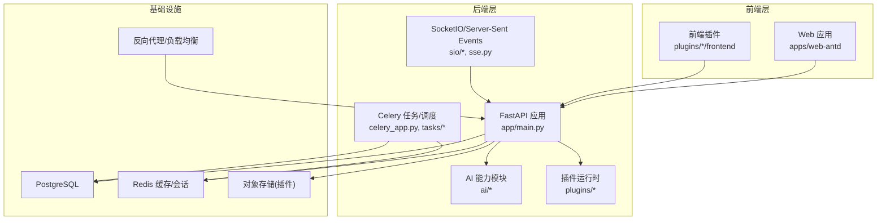
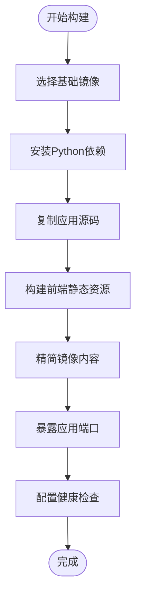
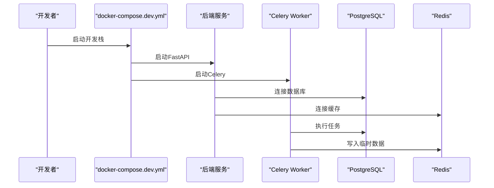
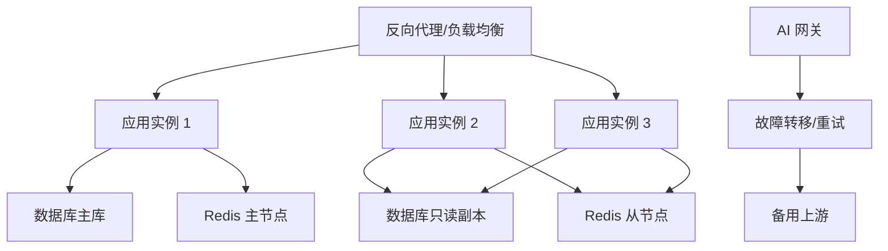
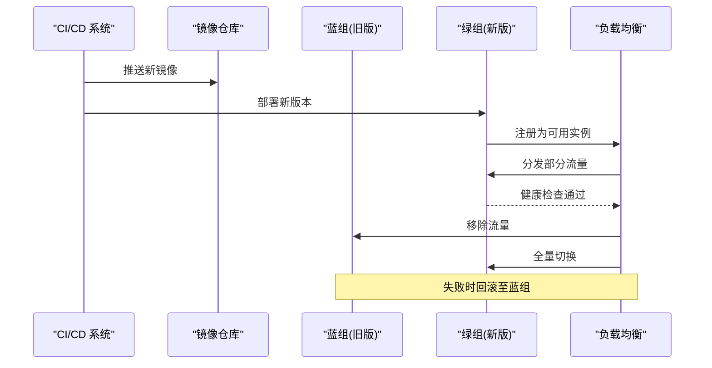
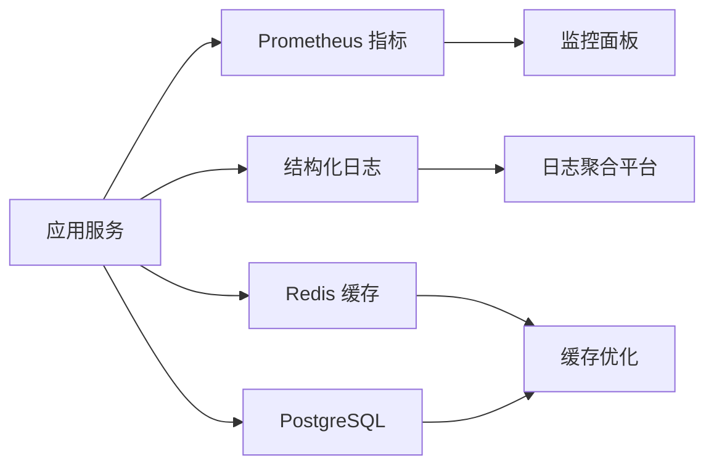
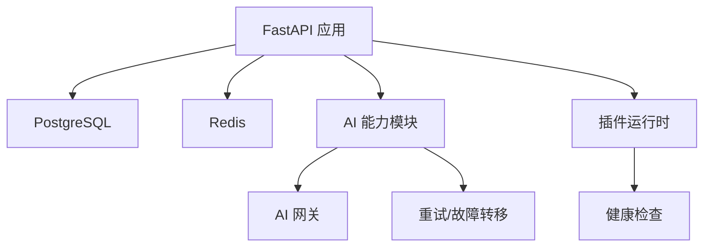

# 部署架构设计

<cite>
**本文档引用的文件**
- [Dockerfile（后端）](file://backend/Dockerfile)
- [Dockerfile（前端插件）](file://frontend/scripts/deploy/Dockerfile)
- [docker-compose.dev.yml](file://docker-compose.dev.yml)
- [docker-compose.prod.yml](file://docker-compose.prod.yml)
- [pyproject.toml（后端）](file://backend/pyproject.toml)
- [package.json（前端工作区）](file://frontend/package.json)
- [vite.config.mts（前端应用）](file://frontend/apps/web-antd/vite.config.mts)
- [main.py（后端入口）](file://backend/app/main.py)
- [celery_app.py（后端Celery）](file://backend/app/celery_app.py)
- [alembic.ini（数据库迁移）](file://backend/alembic.ini)
- [.dockerignore（后端）](file://backend/.dockerignore)
- [prometheus_metrics.py（指标中间件）](file://backend/app/middleware/prometheus_metrics.py)
- [rate_limiter.py（速率限制）](file://backend/app/ai/rate_limiter.py)
- [failover.py（故障转移）](file://backend/app/ai/failover.py)
- [gateway.py（AI网关）](file://backend/app/ai/gateway.py)
- [quota_manager.py（配额管理）](file://backend/app/ai/quota_manager.py)
- [retry_service.py（重试服务）](file://backend/app/ai/retry_service.py)
- [redis.py（Redis配置）](file://backend/app/core/redis.py)
- [database.py（数据库配置）](file://backend/app/core/database.py)
- [hosts_helper.py（主机辅助）](file://backend/app/core/hosts_helper.py)
- [logging.py（日志配置）](file://backend/app/core/logging.py)
- [health.py（插件健康检查）](file://backend/app/plugins/health.py)
- [scheduler.py（任务调度）](file://backend/app/tasks/scheduler.py)
- [sse.py（服务器推送事件）](file://backend/app/sio/sse.py)
- [socketio_server.py（SocketIO服务器）](file://backend/app/core/socketio_server.py)
</cite>

## 目录
1. [简介](#简介)
2. [项目结构](#项目结构)
3. [核心组件](#核心组件)
4. [架构总览](#架构总览)
5. [详细组件分析](#详细组件分析)
6. [依赖关系分析](#依赖关系分析)
7. [性能考虑](#性能考虑)
8. [故障排查指南](#故障排查指南)
9. [结论](#结论)
10. [附录](#附录)

## 简介
本文件面向NovusAI SaaS的部署架构设计，聚焦容器化部署、微服务编排、基础设施配置与环境差异化、高可用与故障转移、CI/CD流水线与蓝绿部署、监控告警与日志聚合、性能调优与弹性伸缩等主题。文档基于仓库中现有的Dockerfile、docker-compose配置、后端主程序与中间件、AI能力模块以及前端构建配置进行系统化梳理与可视化呈现。

## 项目结构
项目采用前后端分离与多服务协同的架构：后端以Python/FastAPI为核心，提供REST API、WebSocket、定时任务与AI能力；前端采用Vite+TypeScript，通过独立应用打包；容器化与编排通过Docker与Compose实现；数据库迁移采用Alembic；插件体系支持扩展与运行时治理。



图表来源
- [main.py:1-200](file://backend/app/main.py#L1-L200)
- [celery_app.py:1-120](file://backend/app/celery_app.py#L1-L120)
- [vite.config.mts:1-120](file://frontend/apps/web-antd/vite.config.mts#L1-L120)
- [redis.py:1-120](file://backend/app/core/redis.py#L1-L120)
- [database.py:1-120](file://backend/app/core/database.py#L1-L120)

章节来源
- [docker-compose.dev.yml:1-200](file://docker-compose.dev.yml#L1-L200)
- [docker-compose.prod.yml:1-200](file://docker-compose.prod.yml#L1-L200)
- [backend/Dockerfile:1-200](file://backend/Dockerfile#L1-L200)
- [frontend/scripts/deploy/Dockerfile:1-120](file://frontend/scripts/deploy/Dockerfile#L1-L120)

## 核心组件
- 容器镜像与构建
  - 后端镜像：基于Dockerfile构建，包含Python运行时、依赖安装与应用启动命令。
  - 前端镜像：基于前端部署脚本中的Dockerfile，用于静态资源构建与发布。
- 编排与环境
  - 开发环境：docker-compose.dev.yml定义本地开发所需的服务拓扑与卷挂载。
  - 生产环境：docker-compose.prod.yml定义生产级服务编排、网络隔离与持久化。
- 应用入口与中间件
  - FastAPI入口：负责路由注册、中间件装配与服务启动。
  - 指标中间件：Prometheus指标采集，便于监控与告警。
- 数据与缓存
  - 数据库：PostgreSQL，迁移配置由Alembic管理。
  - 缓存：Redis，用于会话、限流与临时数据。
- AI与插件
  - AI网关与能力模块：统一接入与路由AI服务，具备故障转移与重试策略。
  - 插件健康检查：运行时健康状态暴露，便于编排与运维。

章节来源
- [backend/Dockerfile:1-200](file://backend/Dockerfile#L1-L200)
- [frontend/scripts/deploy/Dockerfile:1-120](file://frontend/scripts/deploy/Dockerfile#L1-L120)
- [docker-compose.dev.yml:1-200](file://docker-compose.dev.yml#L1-L200)
- [docker-compose.prod.yml:1-200](file://docker-compose.prod.yml#L1-L200)
- [main.py:1-200](file://backend/app/main.py#L1-L200)
- [prometheus_metrics.py:1-120](file://backend/app/middleware/prometheus_metrics.py#L1-L120)
- [alembic.ini:1-120](file://backend/alembic.ini#L1-L120)
- [redis.py:1-120](file://backend/app/core/redis.py#L1-L120)
- [database.py:1-120](file://backend/app/core/database.py#L1-L120)

## 架构总览
下图展示从客户端到后端服务、数据库与缓存的整体交互流程，以及AI能力与插件的集成方式。

```mermaid
graph TB
Client["客户端浏览器/移动端"]
LB["反向代理/负载均衡"]
API["FastAPI 应用"]
WS["SocketIO/事件推送"]
DB["PostgreSQL"]
Cache["Redis"]
AI["AI 网关/能力模块"]
Plugins["插件运行时"]
Storage["对象存储(插件驱动)"]
Client --> LB --> API
API --> DB
API --> Cache
API --> AI
API --> Plugins
API --> Storage
Client <- --> WS
WS --> API
```

图表来源
- [main.py:1-200](file://backend/app/main.py#L1-L200)
- [socketio_server.py:1-120](file://backend/app/core/socketio_server.py#L1-L120)
- [gateway.py:1-120](file://backend/app/ai/gateway.py#L1-L120)
- [redis.py:1-120](file://backend/app/core/redis.py#L1-L120)
- [database.py:1-120](file://backend/app/core/database.py#L1-L120)

## 详细组件分析

### 容器化与镜像构建
- 后端镜像
  - 使用多阶段构建，基础镜像包含Python运行时与包管理器；安装依赖后仅保留必要产物，减小镜像体积。
  - 启动命令指向应用入口，确保进程健康检查与优雅关闭。
- 前端镜像
  - 采用Vite构建静态资源，镜像内执行构建脚本，输出dist目录供Nginx或反向代理使用。
- .dockerignore
  - 排除不必要的构建上下文文件，提升构建效率与安全性。



图表来源
- [backend/Dockerfile:1-200](file://backend/Dockerfile#L1-L200)
- [frontend/scripts/deploy/Dockerfile:1-120](file://frontend/scripts/deploy/Dockerfile#L1-L120)
- [.dockerignore:1-120](file://backend/.dockerignore#L1-L120)

章节来源
- [backend/Dockerfile:1-200](file://backend/Dockerfile#L1-L200)
- [frontend/scripts/deploy/Dockerfile:1-120](file://frontend/scripts/deploy/Dockerfile#L1-L120)
- [.dockerignore:1-120](file://backend/.dockerignore#L1-L120)

### 微服务编排策略
- 开发环境
  - 通过docker-compose.dev.yml定义服务：web（后端）、worker（Celery）、db（PostgreSQL）、redis、minio（插件对象存储）等。
  - 卷挂载用于热更新与调试，端口映射便于本地访问。
- 生产环境
  - 通过docker-compose.prod.yml定义生产服务拓扑，包含反向代理、应用实例、数据库只读副本、缓存集群等。
  - 网络隔离与安全组策略，持久化卷与备份策略，以及健康检查与重启策略。



图表来源
- [docker-compose.dev.yml:1-200](file://docker-compose.dev.yml#L1-L200)
- [main.py:1-200](file://backend/app/main.py#L1-L200)
- [celery_app.py:1-120](file://backend/app/celery_app.py#L1-L120)
- [database.py:1-120](file://backend/app/core/database.py#L1-L120)
- [redis.py:1-120](file://backend/app/core/redis.py#L1-L120)

章节来源
- [docker-compose.dev.yml:1-200](file://docker-compose.dev.yml#L1-L200)
- [docker-compose.prod.yml:1-200](file://docker-compose.prod.yml#L1-L200)

### 负载均衡与高可用
- 反向代理与负载均衡
  - 生产环境通过反向代理实现多实例分发与会话保持，结合健康检查与自动摘除异常节点。
- 高可用设计
  - 数据库：主从复制与只读副本，读写分离与故障切换。
  - 缓存：Redis哨兵/集群模式，提供高可用与故障恢复。
  - 应用：多副本部署，配合滚动更新与蓝绿部署降低停机风险。
- 故障转移机制
  - AI网关与能力模块内置故障转移与重试逻辑，当上游服务不可用时自动切换至备用节点或降级处理。
  - 插件运行时具备健康检查与自愈能力，异常插件可被隔离与重启。



图表来源
- [gateway.py:1-120](file://backend/app/ai/gateway.py#L1-L120)
- [failover.py:1-120](file://backend/app/ai/failover.py#L1-L120)
- [retry_service.py:1-120](file://backend/app/ai/retry_service.py#L1-L120)
- [redis.py:1-120](file://backend/app/core/redis.py#L1-L120)
- [database.py:1-120](file://backend/app/core/database.py#L1-L120)

章节来源
- [gateway.py:1-120](file://backend/app/ai/gateway.py#L1-L120)
- [failover.py:1-120](file://backend/app/ai/failover.py#L1-L120)
- [retry_service.py:1-120](file://backend/app/ai/retry_service.py#L1-L120)

### CI/CD流水线与蓝绿部署
- 流水线设计
  - 触发条件：分支保护与PR合并策略；单元测试、集成测试与安全扫描通过后触发构建。
  - 构建阶段：拉取Dockerfile，构建后端与前端镜像，推送至镜像仓库。
  - 部署阶段：蓝绿部署策略，先部署新版本到备用实例，健康检查通过后切换流量，失败则回滚。
- 自动化部署
  - 使用Compose或Kubernetes进行编排，结合外部LB与DNS实现流量切换。
  - 配置变更通过环境变量注入，避免镜像重建。
- 蓝绿部署策略
  - 新版本部署在备用组，验证通过后切换流量，失败立即回滚至旧版本，保障业务连续性。



图表来源
- [docker-compose.prod.yml:1-200](file://docker-compose.prod.yml#L1-L200)
- [backend/Dockerfile:1-200](file://backend/Dockerfile#L1-L200)
- [frontend/scripts/deploy/Dockerfile:1-120](file://frontend/scripts/deploy/Dockerfile#L1-L120)

章节来源
- [docker-compose.prod.yml:1-200](file://docker-compose.prod.yml#L1-L200)

### 监控告警、日志聚合与性能调优
- 监控与指标
  - 指标中间件：Prometheus指标采集，覆盖请求量、响应时间、错误率等关键指标。
  - AI能力模块：速率限制与配额管理，防止过载与滥用。
- 日志聚合
  - 统一日志格式与结构化输出，集中收集至日志平台，支持检索与告警。
- 性能调优
  - 缓存命中率优化：合理设置TTL与淘汰策略，热点数据预热。
  - 数据库连接池：限制并发与超时，启用只读副本分流读请求。
  - WebSocket与SSE：按需扩容，结合心跳与断线重连策略提升稳定性。



图表来源
- [prometheus_metrics.py:1-120](file://backend/app/middleware/prometheus_metrics.py#L1-L120)
- [rate_limiter.py:1-120](file://backend/app/ai/rate_limiter.py#L1-L120)
- [quota_manager.py:1-120](file://backend/app/ai/quota_manager.py#L1-L120)
- [logging.py:1-120](file://backend/app/core/logging.py#L1-L120)
- [redis.py:1-120](file://backend/app/core/redis.py#L1-L120)
- [database.py:1-120](file://backend/app/core/database.py#L1-L120)

章节来源
- [prometheus_metrics.py:1-120](file://backend/app/middleware/prometheus_metrics.py#L1-L120)
- [rate_limiter.py:1-120](file://backend/app/ai/rate_limiter.py#L1-L120)
- [quota_manager.py:1-120](file://backend/app/ai/quota_manager.py#L1-L120)
- [logging.py:1-120](file://backend/app/core/logging.py#L1-L120)

### 扩展性设计与弹性伸缩
- 水平扩展
  - 应用：多副本部署，结合反向代理实现水平扩展。
  - 数据：读写分离与只读副本，分担查询压力。
  - 缓存：Redis集群或哨兵，提升吞吐与可用性。
- 弹性伸缩
  - CPU/内存阈值触发自动扩缩容，结合HPA（水平Pod自动伸缩）策略。
  - AI能力：根据队列长度与响应延迟动态扩容Worker实例。
- 资源优化
  - 容器资源限制与QoS等级划分，避免资源争抢。
  - 镜像瘦身与依赖精简，缩短启动时间与降低内存占用。

章节来源
- [docker-compose.prod.yml:1-200](file://docker-compose.prod.yml#L1-L200)
- [celery_app.py:1-120](file://backend/app/celery_app.py#L1-L120)
- [redis.py:1-120](file://backend/app/core/redis.py#L1-L120)
- [database.py:1-120](file://backend/app/core/database.py#L1-L120)

## 依赖关系分析
- 组件耦合
  - 应用服务对数据库与缓存存在强依赖，需保证连接池与健康检查配置。
  - AI网关与能力模块对外部服务存在依赖，需配置故障转移与重试。
  - 插件运行时与主应用通过API与事件通信，需保证接口兼容与版本管理。
- 外部依赖
  - PostgreSQL与Redis为关键外部依赖，需纳入SLA与备份策略。
  - 对象存储（插件）作为可选依赖，需评估可用性与成本。



图表来源
- [main.py:1-200](file://backend/app/main.py#L1-L200)
- [gateway.py:1-120](file://backend/app/ai/gateway.py#L1-L120)
- [failover.py:1-120](file://backend/app/ai/failover.py#L1-L120)
- [retry_service.py:1-120](file://backend/app/ai/retry_service.py#L1-L120)
- [health.py:1-120](file://backend/app/plugins/health.py#L1-L120)

章节来源
- [main.py:1-200](file://backend/app/main.py#L1-L200)
- [gateway.py:1-120](file://backend/app/ai/gateway.py#L1-L120)
- [health.py:1-120](file://backend/app/plugins/health.py#L1-L120)

## 性能考虑
- 启动与冷启动
  - 优化Docker镜像大小与启动顺序，减少容器启动时间。
- 请求处理
  - 限流与配额控制，避免突发流量冲击系统。
  - WebSocket与SSE长连接池管理，避免资源泄漏。
- 存储与缓存
  - 缓存预热与热点数据识别，提升命中率。
  - 数据库索引与查询优化，定期分析慢查询日志。

## 故障排查指南
- 健康检查
  - 插件健康检查接口可用于快速定位插件异常。
- 日志与追踪
  - 结构化日志与追踪ID，便于跨服务定位问题。
- 速率限制与配额
  - 当出现大量429/402错误时，检查速率限制与配额配置。
- 数据库与缓存
  - 连接数过多或超时：检查连接池配置与慢查询。
  - 缓存失效频繁：调整TTL与淘汰策略。

章节来源
- [health.py:1-120](file://backend/app/plugins/health.py#L1-L120)
- [logging.py:1-120](file://backend/app/core/logging.py#L1-L120)
- [rate_limiter.py:1-120](file://backend/app/ai/rate_limiter.py#L1-L120)
- [quota_manager.py:1-120](file://backend/app/ai/quota_manager.py#L1-L120)

## 结论
本部署架构以容器化为基础，通过Compose实现开发与生产的统一编排；以FastAPI为核心，结合SocketIO/SSE提供实时能力；以AI网关与插件体系支撑业务扩展；以Prometheus与日志平台实现可观测性；以蓝绿部署与弹性伸缩保障高可用与性能。建议在生产环境中进一步完善监控告警策略、数据库与缓存的高可用方案，并持续优化镜像与依赖以提升启动与运行效率。

## 附录
- 环境变量与配置
  - 数据库连接字符串、Redis地址、AI提供商密钥、对象存储配置等通过环境变量注入。
- 版本与依赖
  - 后端依赖管理与前端工作区依赖均在对应配置文件中声明，确保构建一致性。
- 构建与发布
  - 前端应用通过Vite构建，后端通过Dockerfile构建镜像，统一推送至镜像仓库。

章节来源
- [pyproject.toml:1-200](file://backend/pyproject.toml#L1-L200)
- [package.json:1-200](file://frontend/package.json#L1-L200)
- [vite.config.mts:1-120](file://frontend/apps/web-antd/vite.config.mts#L1-L120)
- [alembic.ini:1-120](file://backend/alembic.ini#L1-L120)