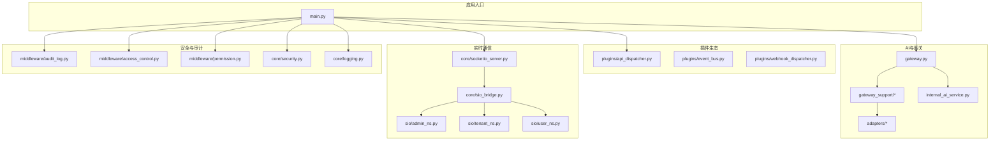
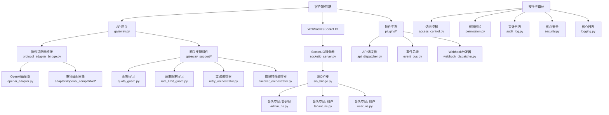
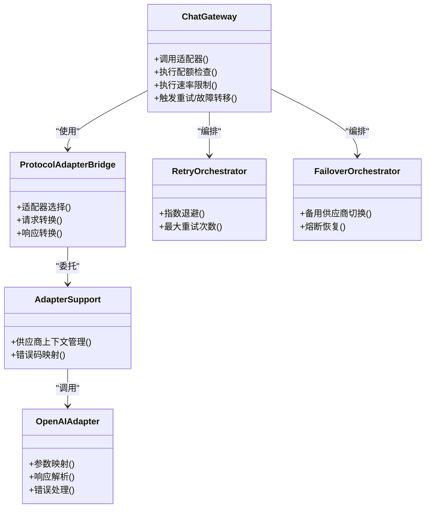
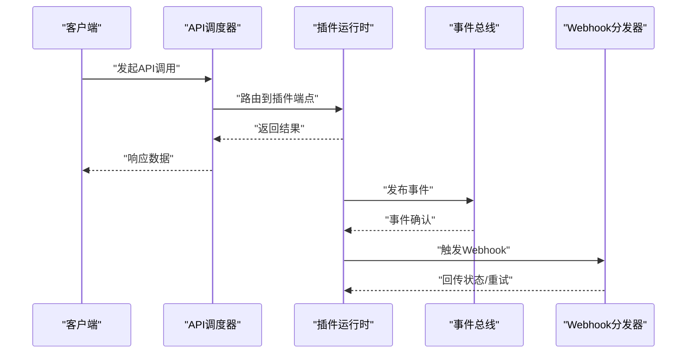
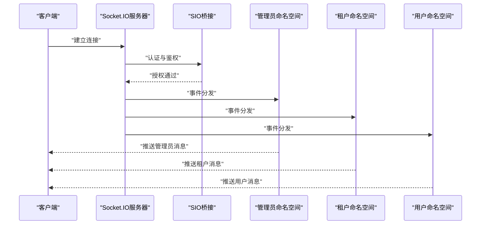
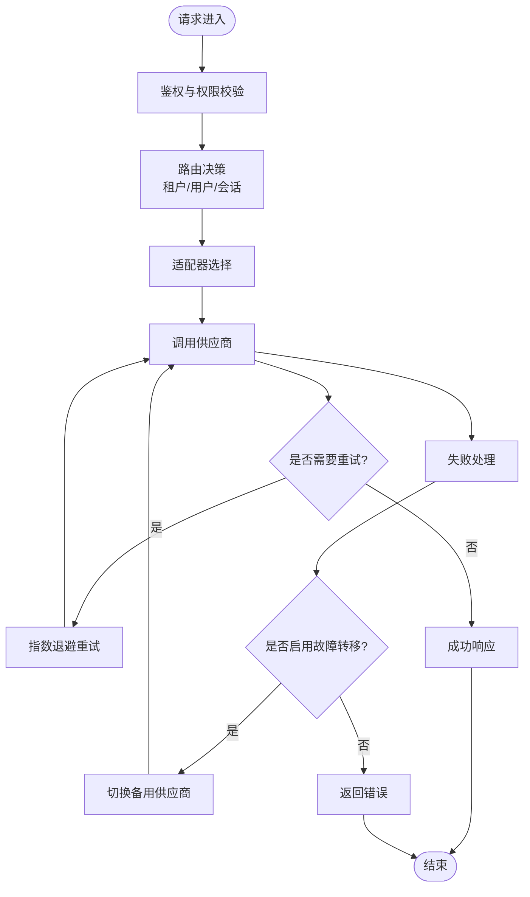
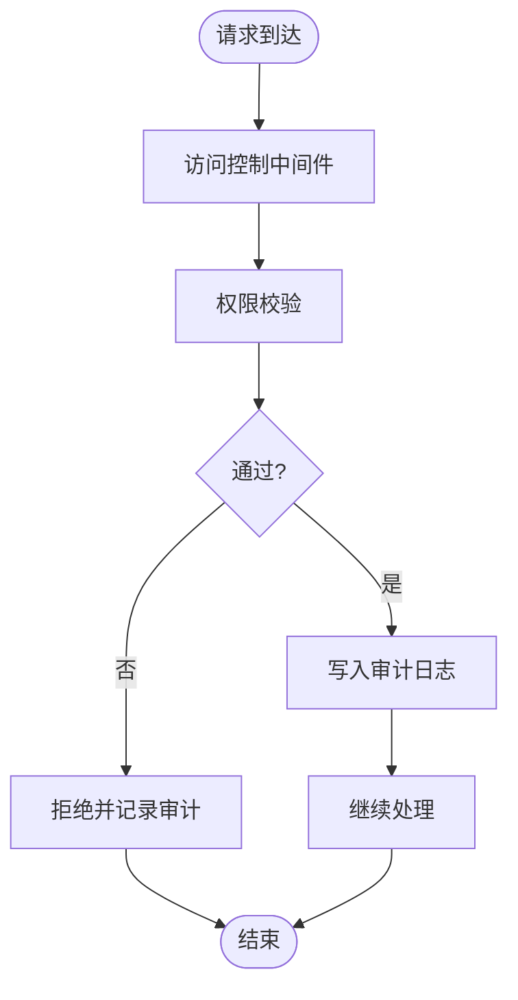
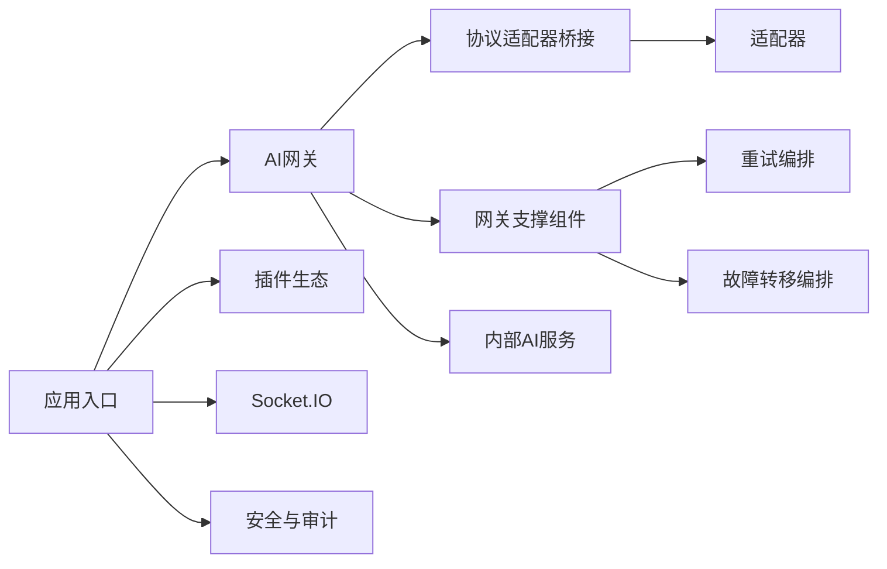

# 集成架构设计

<cite>
**本文档引用的文件**
- [gateway.py](file://backend/app/ai/gateway.py)
- [chat_gateway.py](file://backend/app/ai/gateway_support/chat_gateway.py)
- [stream_chat_gateway.py](file://backend/app/ai/gateway_support/stream_chat_gateway.py)
- [adapter_support.py](file://backend/app/ai/gateway_support/adapter_support.py)
- [protocol_adapter_bridge.py](file://backend/app/ai/gateway_support/protocol_adapter_bridge.py)
- [quota_guard.py](file://backend/app/ai/gateway_support/quota_guard.py)
- [rate_limit_guard.py](file://backend/app/ai/gateway_support/rate_limit_guard.py)
- [retry_orchestrator.py](file://backend/app/ai/gateway_support/retry_orchestrator.py)
- [failover_orchestrator.py](file://backend/app/ai/gateway_support/failover_orchestrator.py)
- [openai_adapter.py](file://backend/app/ai/adapters/openai_adapter.py)
- [openai_compatible/](file://backend/app/ai/adapters/openai_compatible/)
- [api_dispatcher.py](file://backend/app/plugins/api_dispatcher.py)
- [event_bus.py](file://backend/app/plugins/event_bus.py)
- [webhook_dispatcher.py](file://backend/app/plugins/webhook_dispatcher.py)
- [sio_auth.py](file://backend/app/plugins/sio_auth.py)
- [admin_ns.py](file://backend/app/sio/admin_ns.py)
- [tenant_ns.py](file://backend/app/sio/tenant_ns.py)
- [user_ns.py](file://backend/app/sio/user_ns.py)
- [socketio_server.py](file://backend/app/core/socketio_server.py)
- [sio_bridge.py](file://backend/app/core/sio_bridge.py)
- [audit_log.py](file://backend/app/middleware/audit_log.py)
- [access_control.py](file://backend/app/middleware/access_control.py)
- [permission.py](file://backend/app/middleware/permission.py)
- [security.py](file://backend/app/core/security.py)
- [logging.py](file://backend/app/core/logging.py)
- [main.py](file://backend/app/main.py)
- [celery_app.py](file://backend/app/celery_app.py)
- [internal_ai_service.py](file://backend/app/ai/internal_ai_service.py)
- [sse.py](file://backend/app/ai/sse.py)
</cite>

## 目录
1. [引言](#引言)
2. [项目结构](#项目结构)
3. [核心组件](#核心组件)
4. [架构总览](#架构总览)
5. [详细组件分析](#详细组件分析)
6. [依赖关系分析](#依赖关系分析)
7. [性能考虑](#性能考虑)
8. [故障排除指南](#故障排除指南)
9. [结论](#结论)

## 引言
本设计文档面向NovusAI SaaS平台的集成架构，重点阐述系统与外部服务的集成模式、AI供应商适配器架构、插件API扩展机制、第三方服务集成策略；同时详细说明WebSocket实时通信架构（含Socket.IO命名空间设计）、事件驱动架构、API网关设计、协议适配器模式与消息路由机制，并覆盖微服务通信模式、服务发现与负载均衡策略，以及集成安全性设计、认证授权机制与审计日志系统。

## 项目结构
后端采用分层+功能域混合组织方式：AI引擎与网关位于`app/ai`，插件生态位于`app/plugins`，实时通信位于`app/sio`与`app/core`，中间件与安全位于`app/middleware`与`app/core`，入口应用在`app/main.py`。整体呈现以AI能力为核心、插件生态为扩展、实时通信为交互、安全与审计为保障的架构布局。

**图表来源**
- [main.py](file://backend/app/main.py)
- [gateway.py](file://backend/app/ai/gateway.py)
- [chat_gateway.py](file://backend/app/ai/gateway_support/chat_gateway.py)
- [openai_adapter.py](file://backend/app/ai/adapters/openai_adapter.py)
- [api_dispatcher.py](file://backend/app/plugins/api_dispatcher.py)
- [socketio_server.py](file://backend/app/core/socketio_server.py)
- [sio_bridge.py](file://backend/app/core/sio_bridge.py)
- [admin_ns.py](file://backend/app/sio/admin_ns.py)
- [tenant_ns.py](file://backend/app/sio/tenant_ns.py)
- [user_ns.py](file://backend/app/sio/user_ns.py)
- [audit_log.py](file://backend/app/middleware/audit_log.py)
- [access_control.py](file://backend/app/middleware/access_control.py)
- [permission.py](file://backend/app/middleware/permission.py)
- [security.py](file://backend/app/core/security.py)
- [logging.py](file://backend/app/core/logging.py)

**章节来源**
- [main.py](file://backend/app/main.py)
- [gateway.py](file://backend/app/ai/gateway.py)

## 核心组件
- AI网关与协议适配器：统一对外接口，内部通过适配器对接不同AI供应商，支持同步与流式对话、嵌入、图像生成等能力。
- 插件API扩展：提供API调度器、事件总线与Webhook分发器，实现插件生态的扩展与集成。
- 实时通信：基于Socket.IO的命名空间设计，支持管理员、租户与用户三类会话通道。
- 安全与审计：中间件负责访问控制、权限校验与审计日志记录，核心模块提供统一安全与日志能力。
- 内部AI服务：封装内部AI调用逻辑，配合网关进行路由、限流、配额与重试/降级处理。

**章节来源**
- [gateway.py](file://backend/app/ai/gateway.py)
- [chat_gateway.py](file://backend/app/ai/gateway_support/chat_gateway.py)
- [stream_chat_gateway.py](file://backend/app/ai/gateway_support/stream_chat_gateway.py)
- [adapter_support.py](file://backend/app/ai/gateway_support/adapter_support.py)
- [protocol_adapter_bridge.py](file://backend/app/ai/gateway_support/protocol_adapter_bridge.py)
- [quota_guard.py](file://backend/app/ai/gateway_support/quota_guard.py)
- [rate_limit_guard.py](file://backend/app/ai/gateway_support/rate_limit_guard.py)
- [retry_orchestrator.py](file://backend/app/ai/gateway_support/retry_orchestrator.py)
- [failover_orchestrator.py](file://backend/app/ai/gateway_support/failover_orchestrator.py)
- [openai_adapter.py](file://backend/app/ai/adapters/openai_adapter.py)
- [api_dispatcher.py](file://backend/app/plugins/api_dispatcher.py)
- [event_bus.py](file://backend/app/plugins/event_bus.py)
- [webhook_dispatcher.py](file://backend/app/plugins/webhook_dispatcher.py)
- [admin_ns.py](file://backend/app/sio/admin_ns.py)
- [tenant_ns.py](file://backend/app/sio/tenant_ns.py)
- [user_ns.py](file://backend/app/sio/user_ns.py)
- [socketio_server.py](file://backend/app/core/socketio_server.py)
- [sio_bridge.py](file://backend/app/core/sio_bridge.py)
- [audit_log.py](file://backend/app/middleware/audit_log.py)
- [access_control.py](file://backend/app/middleware/access_control.py)
- [permission.py](file://backend/app/middleware/permission.py)
- [security.py](file://backend/app/core/security.py)
- [logging.py](file://backend/app/core/logging.py)
- [internal_ai_service.py](file://backend/app/ai/internal_ai_service.py)

## 架构总览
系统采用“网关-适配器-插件-实时通信-安全审计”的分层架构。AI网关作为统一入口，通过协议适配器桥接不同供应商；插件生态提供API扩展与事件驱动；Socket.IO命名空间承载实时交互；中间件与核心安全模块确保访问控制与审计合规。

**图表来源**
- [gateway.py](file://backend/app/ai/gateway.py)
- [protocol_adapter_bridge.py](file://backend/app/ai/gateway_support/protocol_adapter_bridge.py)
- [openai_adapter.py](file://backend/app/ai/adapters/openai_adapter.py)
- [openai_compatible/](file://backend/app/ai/adapters/openai_compatible/)
- [chat_gateway.py](file://backend/app/ai/gateway_support/chat_gateway.py)
- [quota_guard.py](file://backend/app/ai/gateway_support/quota_guard.py)
- [rate_limit_guard.py](file://backend/app/ai/gateway_support/rate_limit_guard.py)
- [retry_orchestrator.py](file://backend/app/ai/gateway_support/retry_orchestrator.py)
- [failover_orchestrator.py](file://backend/app/ai/gateway_support/failover_orchestrator.py)
- [socketio_server.py](file://backend/app/core/socketio_server.py)
- [sio_bridge.py](file://backend/app/core/sio_bridge.py)
- [admin_ns.py](file://backend/app/sio/admin_ns.py)
- [tenant_ns.py](file://backend/app/sio/tenant_ns.py)
- [user_ns.py](file://backend/app/sio/user_ns.py)
- [api_dispatcher.py](file://backend/app/plugins/api_dispatcher.py)
- [event_bus.py](file://backend/app/plugins/event_bus.py)
- [webhook_dispatcher.py](file://backend/app/plugins/webhook_dispatcher.py)
- [access_control.py](file://backend/app/middleware/access_control.py)
- [permission.py](file://backend/app/middleware/permission.py)
- [audit_log.py](file://backend/app/middleware/audit_log.py)
- [security.py](file://backend/app/core/security.py)
- [logging.py](file://backend/app/core/logging.py)

## 详细组件分析

### AI供应商适配器架构
- 协议适配器桥接：将统一的网关请求转换为具体供应商的协议格式，便于扩展新供应商或切换现有供应商。
- OpenAI适配器：针对OpenAI生态的参数映射、错误码归一化与响应解析。
- 兼容适配器集：提供OpenAI兼容协议的适配实现，降低迁移成本。
- 网关支撑组件：在适配器之上提供配额守卫、速率限制守卫、重试与故障转移编排，保证稳定性与SLA。

**图表来源**
- [chat_gateway.py](file://backend/app/ai/gateway_support/chat_gateway.py)
- [protocol_adapter_bridge.py](file://backend/app/ai/gateway_support/protocol_adapter_bridge.py)
- [adapter_support.py](file://backend/app/ai/gateway_support/adapter_support.py)
- [openai_adapter.py](file://backend/app/ai/adapters/openai_adapter.py)
- [retry_orchestrator.py](file://backend/app/ai/gateway_support/retry_orchestrator.py)
- [failover_orchestrator.py](file://backend/app/ai/gateway_support/failover_orchestrator.py)

**章节来源**
- [chat_gateway.py](file://backend/app/ai/gateway_support/chat_gateway.py)
- [protocol_adapter_bridge.py](file://backend/app/ai/gateway_support/protocol_adapter_bridge.py)
- [adapter_support.py](file://backend/app/ai/gateway_support/adapter_support.py)
- [openai_adapter.py](file://backend/app/ai/adapters/openai_adapter.py)
- [retry_orchestrator.py](file://backend/app/ai/gateway_support/retry_orchestrator.py)
- [failover_orchestrator.py](file://backend/app/ai/gateway_support/failover_orchestrator.py)

### 插件API扩展机制
- API调度器：根据插件注册信息与调用上下文，动态路由到对应插件端点，支持参数校验与安全过滤。
- 事件总线：发布/订阅插件内部事件，实现松耦合的异步扩展。
- Webhook分发器：向外部系统推送事件，支持重试、幂等与签名验证。

**图表来源**
- [api_dispatcher.py](file://backend/app/plugins/api_dispatcher.py)
- [event_bus.py](file://backend/app/plugins/event_bus.py)
- [webhook_dispatcher.py](file://backend/app/plugins/webhook_dispatcher.py)

**章节来源**
- [api_dispatcher.py](file://backend/app/plugins/api_dispatcher.py)
- [event_bus.py](file://backend/app/plugins/event_bus.py)
- [webhook_dispatcher.py](file://backend/app/plugins/webhook_dispatcher.py)

### 第三方服务集成策略
- 供应商适配器：通过协议适配器桥接不同供应商的API差异，统一错误码与响应格式。
- 调用日志桥接：将AI调用过程中的元数据写入调用日志表，便于追踪与审计。
- 失败与重试：在网关层统一处理超时、网络异常与服务不可用，结合指数退避与熔断策略提升可用性。
- 配额与限流：在进入供应商前进行配额与速率限制检查，避免资源滥用与雪崩效应。

**章节来源**
- [chat_gateway.py](file://backend/app/ai/gateway_support/chat_gateway.py)
- [quota_guard.py](file://backend/app/ai/gateway_support/quota_guard.py)
- [rate_limit_guard.py](file://backend/app/ai/gateway_support/rate_limit_guard.py)
- [retry_orchestrator.py](file://backend/app/ai/gateway_support/retry_orchestrator.py)
- [failover_orchestrator.py](file://backend/app/ai/gateway_support/failover_orchestrator.py)

### WebSocket实时通信架构与Socket.IO命名空间
- Socket.IO服务器：集中管理连接生命周期与事件分发。
- 桥接层：将Socket.IO事件映射到业务命名空间，解耦底层传输细节。
- 命名空间设计：
  - 管理员命名空间：用于平台级通知与运维事件。
  - 租户命名空间：按租户隔离，推送租户相关消息。
  - 用户命名空间：一对一或群组消息，支持私聊与协作场景。
- 认证与鉴权：在连接阶段进行身份验证与权限校验，确保事件只投递到有权限的房间/用户。

**图表来源**
- [socketio_server.py](file://backend/app/core/socketio_server.py)
- [sio_bridge.py](file://backend/app/core/sio_bridge.py)
- [admin_ns.py](file://backend/app/sio/admin_ns.py)
- [tenant_ns.py](file://backend/app/sio/tenant_ns.py)
- [user_ns.py](file://backend/app/sio/user_ns.py)

**章节来源**
- [socketio_server.py](file://backend/app/core/socketio_server.py)
- [sio_bridge.py](file://backend/app/core/sio_bridge.py)
- [admin_ns.py](file://backend/app/sio/admin_ns.py)
- [tenant_ns.py](file://backend/app/sio/tenant_ns.py)
- [user_ns.py](file://backend/app/sio/user_ns.py)

### API网关设计、协议适配器模式与消息路由
- API网关：统一入口，负责路由、鉴权、限流、配额、重试与故障转移。
- 协议适配器模式：将供应商差异抽象为适配器，网关仅感知统一接口。
- 消息路由：根据租户/用户/会话维度进行路由，结合命名空间实现精准投递。

**图表来源**
- [gateway.py](file://backend/app/ai/gateway.py)
- [protocol_adapter_bridge.py](file://backend/app/ai/gateway_support/protocol_adapter_bridge.py)
- [retry_orchestrator.py](file://backend/app/ai/gateway_support/retry_orchestrator.py)
- [failover_orchestrator.py](file://backend/app/ai/gateway_support/failover_orchestrator.py)

**章节来源**
- [gateway.py](file://backend/app/ai/gateway.py)
- [protocol_adapter_bridge.py](file://backend/app/ai/gateway_support/protocol_adapter_bridge.py)
- [retry_orchestrator.py](file://backend/app/ai/gateway_support/retry_orchestrator.py)
- [failover_orchestrator.py](file://backend/app/ai/gateway_support/failover_orchestrator.py)

### 微服务通信模式、服务发现与负载均衡
- 微服务通信：通过API网关与插件调度器实现服务间解耦，插件生态承担扩展职责。
- 服务发现：由部署层负责，应用侧通过环境变量或配置中心获取下游地址。
- 负载均衡：在供应商层面采用轮询/权重策略，结合熔断与降级提升整体可用性。

**章节来源**
- [api_dispatcher.py](file://backend/app/plugins/api_dispatcher.py)
- [gateway.py](file://backend/app/ai/gateway.py)

### 集成安全性设计、认证授权机制与审计日志系统
- 认证授权：中间件在请求进入时进行身份识别与权限判定，结合核心安全模块统一处理。
- 审计日志：记录关键操作与API调用轨迹，支持查询与导出，满足合规要求。
- 日志体系：核心日志模块提供统一的日志格式与级别管理，便于问题定位与性能分析。

**图表来源**
- [access_control.py](file://backend/app/middleware/access_control.py)
- [permission.py](file://backend/app/middleware/permission.py)
- [audit_log.py](file://backend/app/middleware/audit_log.py)
- [security.py](file://backend/app/core/security.py)
- [logging.py](file://backend/app/core/logging.py)

**章节来源**
- [access_control.py](file://backend/app/middleware/access_control.py)
- [permission.py](file://backend/app/middleware/permission.py)
- [audit_log.py](file://backend/app/middleware/audit_log.py)
- [security.py](file://backend/app/core/security.py)
- [logging.py](file://backend/app/core/logging.py)

## 依赖关系分析
- 组件内聚与耦合：AI网关与适配器之间通过协议适配器桥接，保持低耦合；插件生态独立于核心AI逻辑，便于扩展。
- 外部依赖：供应商API、Redis/数据库、消息队列（Celery）等，均通过统一的网关与中间件进行访问。
- 循环依赖：未见直接循环导入；命名空间与桥接层通过事件驱动避免强耦合。

**图表来源**
- [gateway.py](file://backend/app/ai/gateway.py)
- [protocol_adapter_bridge.py](file://backend/app/ai/gateway_support/protocol_adapter_bridge.py)
- [adapter_support.py](file://backend/app/ai/gateway_support/adapter_support.py)
- [retry_orchestrator.py](file://backend/app/ai/gateway_support/retry_orchestrator.py)
- [failover_orchestrator.py](file://backend/app/ai/gateway_support/failover_orchestrator.py)
- [internal_ai_service.py](file://backend/app/ai/internal_ai_service.py)
- [main.py](file://backend/app/main.py)
- [api_dispatcher.py](file://backend/app/plugins/api_dispatcher.py)
- [socketio_server.py](file://backend/app/core/socketio_server.py)
- [audit_log.py](file://backend/app/middleware/audit_log.py)

**章节来源**
- [gateway.py](file://backend/app/ai/gateway.py)
- [protocol_adapter_bridge.py](file://backend/app/ai/gateway_support/protocol_adapter_bridge.py)
- [adapter_support.py](file://backend/app/ai/gateway_support/adapter_support.py)
- [retry_orchestrator.py](file://backend/app/ai/gateway_support/retry_orchestrator.py)
- [failover_orchestrator.py](file://backend/app/ai/gateway_support/failover_orchestrator.py)
- [internal_ai_service.py](file://backend/app/ai/internal_ai_service.py)
- [main.py](file://backend/app/main.py)
- [api_dispatcher.py](file://backend/app/plugins/api_dispatcher.py)
- [socketio_server.py](file://backend/app/core/socketio_server.py)
- [audit_log.py](file://backend/app/middleware/audit_log.py)

## 性能考虑
- 流式输出：通过流式聊天网关与流式处理管线，降低首字节延迟，提升用户体验。
- 缓存与配额：结合内存缓存与数据库配额管理，减少重复计算与超卖风险。
- 并发与限流：在网关层实施并发与速率限制，避免热点资源被压垮。
- 重试与熔断：指数退避与熔断策略降低抖动对上游的影响，提高整体稳定性。

**章节来源**
- [stream_chat_gateway.py](file://backend/app/ai/gateway_support/stream_chat_gateway.py)
- [quota_guard.py](file://backend/app/ai/gateway_support/quota_guard.py)
- [rate_limit_guard.py](file://backend/app/ai/gateway_support/rate_limit_guard.py)
- [retry_orchestrator.py](file://backend/app/ai/gateway_support/retry_orchestrator.py)
- [failover_orchestrator.py](file://backend/app/ai/gateway_support/failover_orchestrator.py)

## 故障排除指南
- 供应商调用失败：检查适配器错误映射与调用日志，确认是否触发重试与故障转移。
- 权限不足：核对中间件权限校验与审计日志，定位具体资源与操作。
- WebSocket连接异常：检查Socket.IO桥接与命名空间事件绑定，确认认证流程与房间权限。
- 插件扩展问题：查看API调度器路由与事件总线订阅，确认插件清单与运行时状态。

**章节来源**
- [adapter_support.py](file://backend/app/ai/gateway_support/adapter_support.py)
- [retry_orchestrator.py](file://backend/app/ai/gateway_support/retry_orchestrator.py)
- [failover_orchestrator.py](file://backend/app/ai/gateway_support/failover_orchestrator.py)
- [access_control.py](file://backend/app/middleware/access_control.py)
- [audit_log.py](file://backend/app/middleware/audit_log.py)
- [sio_bridge.py](file://backend/app/core/sio_bridge.py)
- [event_bus.py](file://backend/app/plugins/event_bus.py)
- [api_dispatcher.py](file://backend/app/plugins/api_dispatcher.py)

## 结论
本集成架构以AI网关为核心，通过协议适配器桥接多供应商，结合插件生态实现灵活扩展；以Socket.IO命名空间承载实时交互；以中间件与核心安全模块确保访问控制与审计合规。该设计在保证可扩展性的同时，兼顾了稳定性、安全性与可观测性，适合SaaS场景下的持续演进与规模化部署。