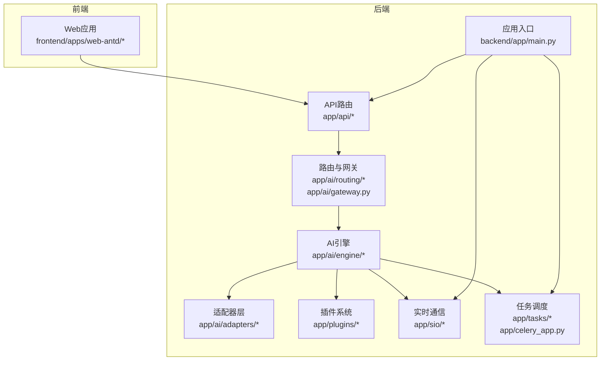
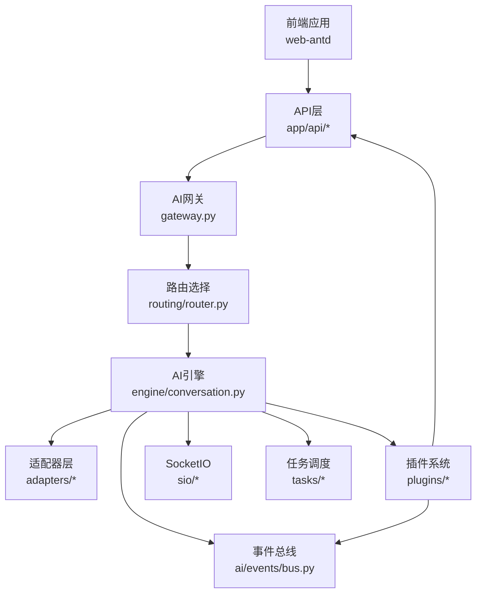
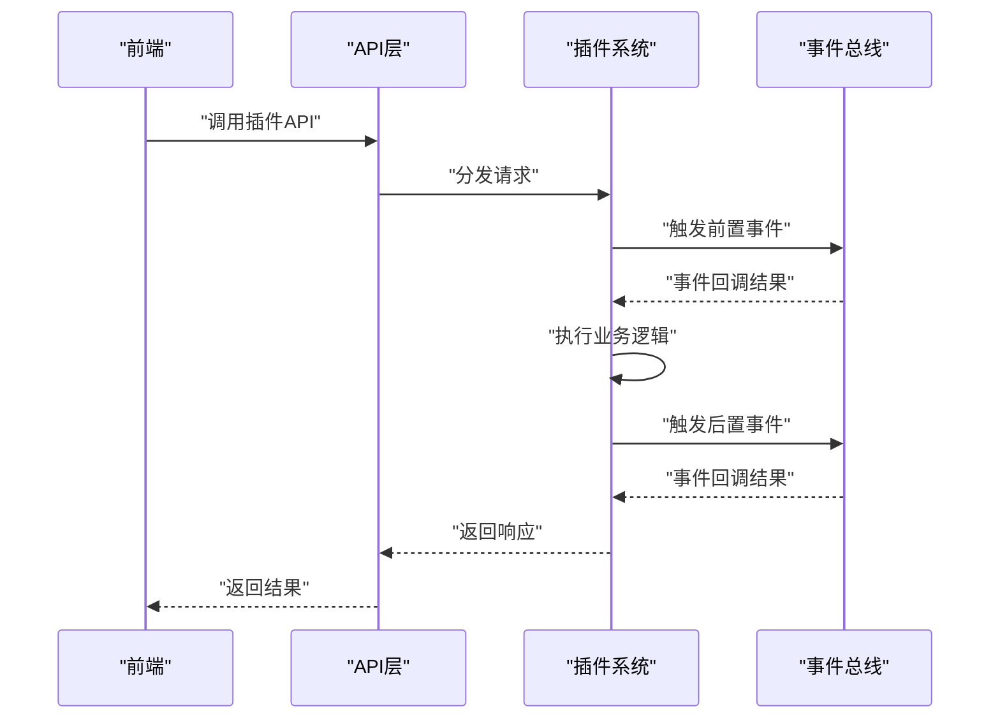
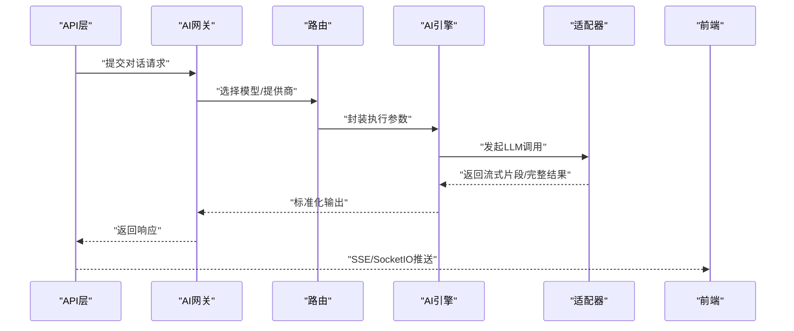
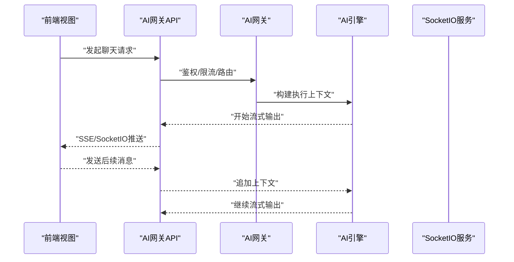
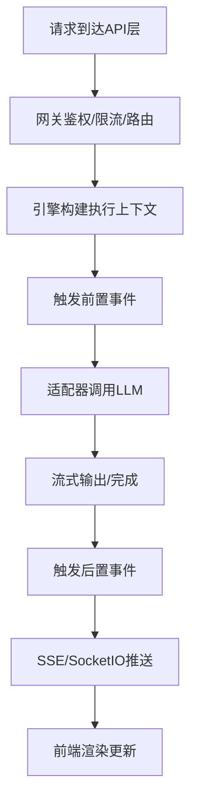
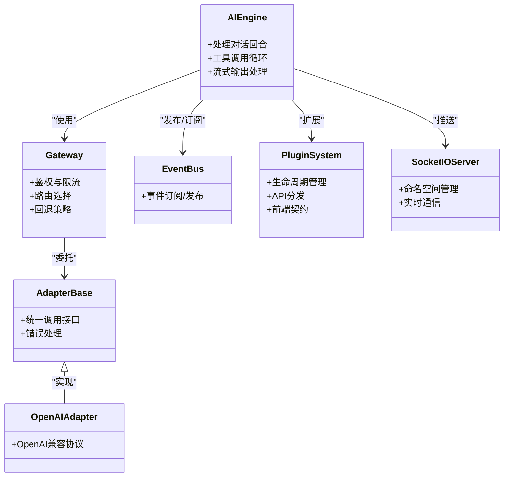
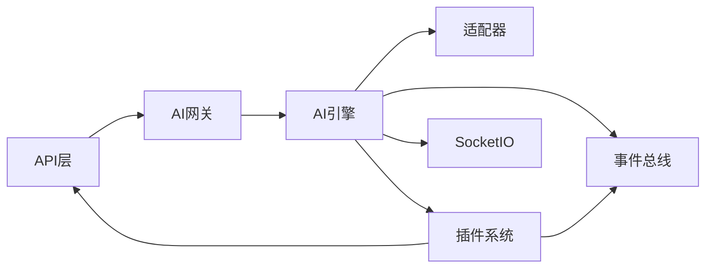

# 组件交互设计

<cite>
**本文引用的文件**
- [backend/app/main.py](file://backend/app/main.py)
- [backend/app/ai/gateway.py](file://backend/app/ai/gateway.py)
- [backend/app/ai/adapters/base.py](file://backend/app/ai/adapters/base.py)
- [backend/app/ai/adapters/openai_adapter.py](file://backend/app/ai/adapters/openai_adapter.py)
- [backend/app/ai/engine/conversation.py](file://backend/app/ai/engine/conversation.py)
- [backend/app/ai/engine/stream_handler.py](file://backend/app/ai/engine/stream_handler.py)
- [backend/app/ai/routing/router.py](file://backend/app/ai/routing/router.py)
- [backend/app/ai/context/orchestrator.py](file://backend/app/ai/context/orchestrator.py)
- [backend/app/ai/events/bus.py](file://backend/app/ai/events/bus.py)
- [backend/app/plugins/event_bus.py](file://backend/app/plugins/event_bus.py)
- [backend/app/plugins/lifecycle.py](file://backend/app/plugins/lifecycle.py)
- [backend/app/plugins/loader.py](file://backend/app/plugins/loader.py)
- [backend/app/plugins/registry.py](file://backend/app/plugins/registry.py)
- [backend/app/plugins/api_dispatcher.py](file://backend/app/plugins/api_dispatcher.py)
- [backend/app/plugins/frontend_contract.py](file://backend/app/plugins/frontend_contract.py)
- [backend/app/sio/socketio_server.py](file://backend/app/sio/socketio_server.py)
- [backend/app/sio/user_ns.py](file://backend/app/sio/user_ns.py)
- [backend/app/sio/admin_ns.py](file://backend/app/sio/admin_ns.py)
- [backend/app/sio/tenant_ns.py](file://backend/app/sio/tenant_ns.py)
- [backend/app/api/tenant/ai_gateway.py](file://backend/app/api/tenant/ai_gateway.py)
- [backend/app/api/admin/ai_gateway.py](file://backend/app/api/admin/ai_gateway.py)
- [backend/app/api/public/platform.py](file://backend/app/api/public/platform.py)
- [frontend/apps/web-antd/src/api/ai.ts](file://frontend/apps/web-antd/src/api/ai.ts)
- [frontend/apps/web-antd/src/views/ai/chat/index.vue](file://frontend/apps/web-antd/src/views/ai/chat/index.vue)
- [backend/app/celery_app.py](file://backend/app/celery_app.py)
- [backend/app/tasks/scheduler.py](file://backend/app/tasks/scheduler.py)
</cite>

## 目录
1. [引言](#引言)
2. [项目结构](#项目结构)
3. [核心组件](#核心组件)
4. [架构总览](#架构总览)
5. [详细组件分析](#详细组件分析)
6. [依赖分析](#依赖分析)
7. [性能考虑](#性能考虑)
8. [故障排查指南](#故障排查指南)
9. [结论](#结论)
10. [附录](#附录)

## 引言
本设计文档面向NovusAI SaaS平台，聚焦于系统内各组件之间的交互模式与通信机制，涵盖插件系统与核心系统的交互、AI网关与适配器的交互、前端与后端的交互模式，并对事件驱动架构、消息传递机制与数据流转进行系统化梳理。文档同时提供交互时序图、数据流图与组件关系图，给出可操作的最佳实践建议。

## 项目结构
后端采用分层+功能域混合的组织方式：核心服务位于backend/app，AI能力集中在app/ai子模块，插件生态位于app/plugins，API路由分布在app/api下，实时通信通过app/sio实现；前端位于frontend/apps/web-antd，采用Vite+Vue3技术栈。

图表来源
- [backend/app/main.py](file://backend/app/main.py)
- [backend/app/ai/gateway.py](file://backend/app/ai/gateway.py)
- [backend/app/ai/engine/conversation.py](file://backend/app/ai/engine/conversation.py)
- [backend/app/plugins/lifecycle.py](file://backend/app/plugins/lifecycle.py)
- [backend/app/sio/socketio_server.py](file://backend/app/sio/socketio_server.py)
- [backend/app/tasks/scheduler.py](file://backend/app/tasks/scheduler.py)

章节来源
- [backend/app/main.py](file://backend/app/main.py)
- [backend/app/ai/engine/conversation.py](file://backend/app/ai/engine/conversation.py)

## 核心组件
- 应用入口与生命周期
  - 应用入口负责初始化配置、注册路由与中间件、启动任务调度与实时服务。
  - 生命周期管理贯穿插件的加载、运行时状态维护与卸载。
- AI引擎与上下文编排
  - 引擎负责对话回合、工具调用循环、流式输出处理与执行状态机。
  - 上下文编排器协调提示词构建、预算控制与记忆策略。
- 适配器与网关
  - 适配器屏蔽不同AI提供商的差异，统一对外接口。
  - 网关聚合路由与限流、鉴权、模型选择与回退策略。
- 插件系统
  - 提供扩展点、事件总线、API分发、资产解析与运行时门禁。
- 实时通信与任务调度
  - SocketIO命名空间支持用户/租户/管理员场景。
  - Celery与计划任务实现异步与周期性作业。

章节来源
- [backend/app/main.py](file://backend/app/main.py)
- [backend/app/ai/engine/conversation.py](file://backend/app/ai/engine/conversation.py)
- [backend/app/ai/context/orchestrator.py](file://backend/app/ai/context/orchestrator.py)
- [backend/app/ai/gateway.py](file://backend/app/ai/gateway.py)
- [backend/app/plugins/lifecycle.py](file://backend/app/plugins/lifecycle.py)
- [backend/app/sio/socketio_server.py](file://backend/app/sio/socketio_server.py)
- [backend/app/celery_app.py](file://backend/app/celery_app.py)

## 架构总览
系统采用“事件驱动 + 分层解耦”的架构风格。前端通过REST与SSE/SocketIO与后端交互；后端以AI引擎为核心，向上提供API，向下对接适配器与插件；插件通过事件总线与API分发器参与系统行为；任务调度保障后台作业稳定运行。

图表来源
- [backend/app/api/tenant/ai_gateway.py](file://backend/app/api/tenant/ai_gateway.py)
- [backend/app/ai/gateway.py](file://backend/app/ai/gateway.py)
- [backend/app/ai/routing/router.py](file://backend/app/ai/routing/router.py)
- [backend/app/ai/engine/conversation.py](file://backend/app/ai/engine/conversation.py)
- [backend/app/ai/adapters/base.py](file://backend/app/ai/adapters/base.py)
- [backend/app/ai/events/bus.py](file://backend/app/ai/events/bus.py)
- [backend/app/plugins/event_bus.py](file://backend/app/plugins/event_bus.py)
- [backend/app/sio/socketio_server.py](file://backend/app/sio/socketio_server.py)
- [backend/app/tasks/scheduler.py](file://backend/app/tasks/scheduler.py)

## 详细组件分析

### 插件系统与核心系统的交互
- 扩展点与事件总线
  - 插件通过事件总线订阅/发布系统事件，实现非侵入式扩展。
  - 核心系统在关键流程（如API请求、工具调用前后）触发事件，插件可拦截或增强行为。
- API分发与前端契约
  - API分发器将插件暴露的路由映射到统一入口，确保安全与权限校验。
  - 前端契约定义了插件与前端交互的接口规范，保证UI一致性与安全性。
- 生命周期管理
  - 生命周期编排器负责插件安装、迁移、版本切换与恢复，确保系统稳定性。
  - 运行时门禁与安全扫描在加载阶段进行，防止恶意或不合规插件进入生产环境。

图表来源
- [backend/app/plugins/api_dispatcher.py](file://backend/app/plugins/api_dispatcher.py)
- [backend/app/plugins/event_bus.py](file://backend/app/plugins/event_bus.py)
- [backend/app/plugins/frontend_contract.py](file://backend/app/plugins/frontend_contract.py)

章节来源
- [backend/app/plugins/event_bus.py](file://backend/app/plugins/event_bus.py)
- [backend/app/plugins/api_dispatcher.py](file://backend/app/plugins/api_dispatcher.py)
- [backend/app/plugins/frontend_contract.py](file://backend/app/plugins/frontend_contract.py)
- [backend/app/plugins/lifecycle.py](file://backend/app/plugins/lifecycle.py)

### AI网关与适配器的交互
- 网关职责
  - 聚合多模型与多提供商，统一鉴权、限流、路由与回退策略。
  - 将上层请求转换为适配器可识别的格式，处理流式与非流式两种输出。
- 适配器抽象
  - 适配器屏蔽底层差异，提供一致的调用接口与错误处理。
  - 支持OpenAI兼容协议等主流格式，便于快速接入新提供商。
- 流式处理
  - 引擎通过流处理器将LLM输出按事件推送至客户端，提升交互体验。

图表来源
- [backend/app/api/tenant/ai_gateway.py](file://backend/app/api/tenant/ai_gateway.py)
- [backend/app/ai/gateway.py](file://backend/app/ai/gateway.py)
- [backend/app/ai/routing/router.py](file://backend/app/ai/routing/router.py)
- [backend/app/ai/engine/conversation.py](file://backend/app/ai/engine/conversation.py)
- [backend/app/ai/engine/stream_handler.py](file://backend/app/ai/engine/stream_handler.py)
- [backend/app/ai/adapters/base.py](file://backend/app/ai/adapters/base.py)
- [backend/app/ai/adapters/openai_adapter.py](file://backend/app/ai/adapters/openai_adapter.py)

章节来源
- [backend/app/ai/gateway.py](file://backend/app/ai/gateway.py)
- [backend/app/ai/routing/router.py](file://backend/app/ai/routing/router.py)
- [backend/app/ai/engine/conversation.py](file://backend/app/ai/engine/conversation.py)
- [backend/app/ai/engine/stream_handler.py](file://backend/app/ai/engine/stream_handler.py)
- [backend/app/ai/adapters/base.py](file://backend/app/ai/adapters/base.py)
- [backend/app/ai/adapters/openai_adapter.py](file://backend/app/ai/adapters/openai_adapter.py)

### 前端与后端的交互模式
- REST与SSE
  - 前端通过REST接口提交请求，后端以SSE流式推送结果，适合长对话与逐步生成。
- SocketIO命名空间
  - 用户/租户/管理员分别绑定独立命名空间，实现权限隔离与高效双向通信。
- 前端调用链
  - 视图组件触发API调用，API层转发至AI网关，引擎处理后通过SSE/SocketIO回推。

图表来源
- [frontend/apps/web-antd/src/views/ai/chat/index.vue](file://frontend/apps/web-antd/src/views/ai/chat/index.vue)
- [frontend/apps/web-antd/src/api/ai.ts](file://frontend/apps/web-antd/src/api/ai.ts)
- [backend/app/api/tenant/ai_gateway.py](file://backend/app/api/tenant/ai_gateway.py)
- [backend/app/ai/gateway.py](file://backend/app/ai/gateway.py)
- [backend/app/ai/engine/conversation.py](file://backend/app/ai/engine/conversation.py)
- [backend/app/sio/socketio_server.py](file://backend/app/sio/socketio_server.py)

章节来源
- [frontend/apps/web-antd/src/views/ai/chat/index.vue](file://frontend/apps/web-antd/src/views/ai/chat/index.vue)
- [frontend/apps/web-antd/src/api/ai.ts](file://frontend/apps/web-antd/src/api/ai.ts)
- [backend/app/api/tenant/ai_gateway.py](file://backend/app/api/tenant/ai_gateway.py)
- [backend/app/sio/socketio_server.py](file://backend/app/sio/socketio_server.py)

### 事件驱动架构与消息传递
- 事件总线
  - AI引擎与插件共享事件总线，支持请求前/后置钩子、工具调用事件、执行状态变更等。
- 消息传递
  - 通过SSE与SocketIO实现近实时的消息推送；任务调度通过Celery异步执行。
- 数据流转
  - 请求从API层进入，经网关与路由，交由引擎处理；引擎根据上下文编排与适配器交互，期间通过事件总线传播状态变化。

图表来源
- [backend/app/ai/events/bus.py](file://backend/app/ai/events/bus.py)
- [backend/app/plugins/event_bus.py](file://backend/app/plugins/event_bus.py)
- [backend/app/ai/engine/conversation.py](file://backend/app/ai/engine/conversation.py)
- [backend/app/ai/engine/stream_handler.py](file://backend/app/ai/engine/stream_handler.py)
- [backend/app/sio/socketio_server.py](file://backend/app/sio/socketio_server.py)

章节来源
- [backend/app/ai/events/bus.py](file://backend/app/ai/events/bus.py)
- [backend/app/plugins/event_bus.py](file://backend/app/plugins/event_bus.py)
- [backend/app/ai/engine/conversation.py](file://backend/app/ai/engine/conversation.py)
- [backend/app/ai/engine/stream_handler.py](file://backend/app/ai/engine/stream_handler.py)
- [backend/app/sio/socketio_server.py](file://backend/app/sio/socketio_server.py)

### 组件关系图

图表来源
- [backend/app/ai/engine/conversation.py](file://backend/app/ai/engine/conversation.py)
- [backend/app/ai/gateway.py](file://backend/app/ai/gateway.py)
- [backend/app/ai/adapters/base.py](file://backend/app/ai/adapters/base.py)
- [backend/app/ai/adapters/openai_adapter.py](file://backend/app/ai/adapters/openai_adapter.py)
- [backend/app/ai/events/bus.py](file://backend/app/ai/events/bus.py)
- [backend/app/plugins/event_bus.py](file://backend/app/plugins/event_bus.py)
- [backend/app/plugins/api_dispatcher.py](file://backend/app/plugins/api_dispatcher.py)
- [backend/app/plugins/frontend_contract.py](file://backend/app/plugins/frontend_contract.py)
- [backend/app/sio/socketio_server.py](file://backend/app/sio/socketio_server.py)

章节来源
- [backend/app/ai/engine/conversation.py](file://backend/app/ai/engine/conversation.py)
- [backend/app/ai/gateway.py](file://backend/app/ai/gateway.py)
- [backend/app/ai/adapters/base.py](file://backend/app/ai/adapters/base.py)
- [backend/app/ai/adapters/openai_adapter.py](file://backend/app/ai/adapters/openai_adapter.py)
- [backend/app/ai/events/bus.py](file://backend/app/ai/events/bus.py)
- [backend/app/plugins/event_bus.py](file://backend/app/plugins/event_bus.py)
- [backend/app/plugins/api_dispatcher.py](file://backend/app/plugins/api_dispatcher.py)
- [backend/app/plugins/frontend_contract.py](file://backend/app/plugins/frontend_contract.py)
- [backend/app/sio/socketio_server.py](file://backend/app/sio/socketio_server.py)

## 依赖分析
- 组件耦合与内聚
  - AI引擎与适配器通过抽象接口耦合，降低对具体提供商的依赖。
  - 插件系统通过事件总线与API分发器与核心解耦，提高扩展性。
- 外部依赖与集成点
  - SocketIO用于实时通信，Celery用于异步任务。
  - 前端通过REST/SSE/SocketIO与后端交互，遵循统一的API契约。
- 循环依赖风险
  - 事件总线与插件系统相互协作，需避免在事件回调中引入循环调用。

图表来源
- [backend/app/api/tenant/ai_gateway.py](file://backend/app/api/tenant/ai_gateway.py)
- [backend/app/ai/gateway.py](file://backend/app/ai/gateway.py)
- [backend/app/ai/engine/conversation.py](file://backend/app/ai/engine/conversation.py)
- [backend/app/ai/events/bus.py](file://backend/app/ai/events/bus.py)
- [backend/app/plugins/event_bus.py](file://backend/app/plugins/event_bus.py)

章节来源
- [backend/app/api/tenant/ai_gateway.py](file://backend/app/api/tenant/ai_gateway.py)
- [backend/app/ai/gateway.py](file://backend/app/ai/gateway.py)
- [backend/app/ai/engine/conversation.py](file://backend/app/ai/engine/conversation.py)
- [backend/app/ai/events/bus.py](file://backend/app/ai/events/bus.py)
- [backend/app/plugins/event_bus.py](file://backend/app/plugins/event_bus.py)

## 性能考虑
- 流式输出优化
  - 使用SSE/SocketIO减少等待时间，提升用户体验；注意背压控制与缓冲区大小。
- 适配器并发与重试
  - 对外调用应设置合理的超时与重试策略，避免阻塞引擎主循环。
- 任务调度与资源限制
  - Celery队列与并发数需与硬件资源匹配；对高耗时任务启用优先级与限流。
- 缓存与热点数据
  - 对频繁查询的模型列表、路由规则进行缓存，降低数据库压力。

## 故障排查指南
- 插件相关问题
  - 检查插件生命周期状态与运行时门禁日志，确认加载顺序与依赖满足。
  - 通过事件总线查看插件是否正确订阅/发布事件。
- AI网关与适配器
  - 核对路由配置与模型可用性；检查适配器错误码与回退策略是否生效。
- 实时通信
  - 检查SocketIO命名空间连接状态与消息推送频率；关注断线重连与心跳机制。
- 任务调度
  - 查看Celery任务队列积压与失败重试记录；核对计划任务触发条件。

章节来源
- [backend/app/plugins/lifecycle.py](file://backend/app/plugins/lifecycle.py)
- [backend/app/plugins/event_bus.py](file://backend/app/plugins/event_bus.py)
- [backend/app/ai/gateway.py](file://backend/app/ai/gateway.py)
- [backend/app/sio/socketio_server.py](file://backend/app/sio/socketio_server.py)
- [backend/app/celery_app.py](file://backend/app/celery_app.py)

## 结论
本设计文档梳理了NovusAI SaaS的核心组件交互与通信机制，明确了插件系统与核心系统的协作方式、AI网关与适配器的对接流程以及前后端的交互模式。通过事件驱动与分层解耦的设计，系统具备良好的扩展性与可维护性。建议在实际落地中严格遵循前端契约与事件约定，完善监控与告警体系，持续优化性能与可靠性。

## 附录
- 最佳实践
  - 插件开发遵循“最小权限”原则，严格遵守前端契约与事件规范。
  - AI网关统一接入点，避免绕过鉴权与限流；适配器实现幂等与可重试。
  - 前端采用SSE/SocketIO渐进式渲染，结合本地缓存提升响应速度。
  - 任务调度与资源配额联动，确保高峰期系统稳定。