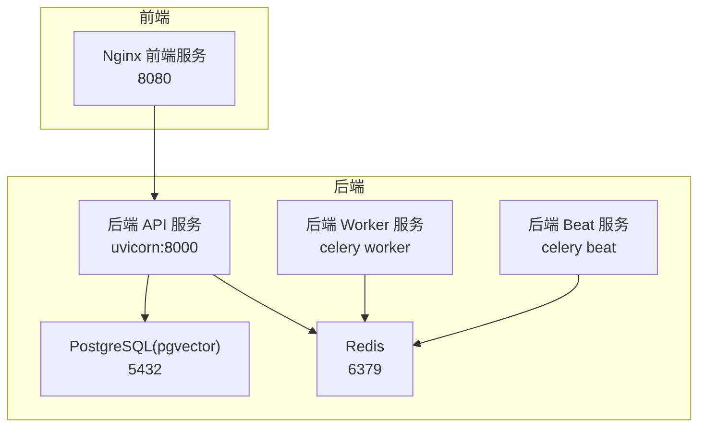
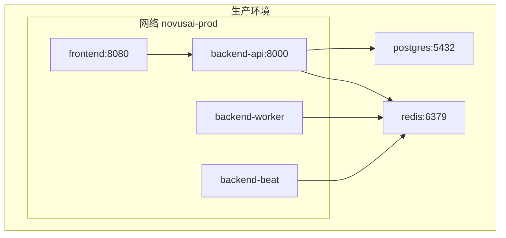
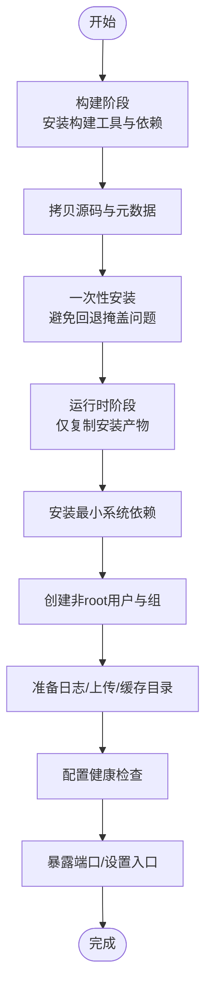
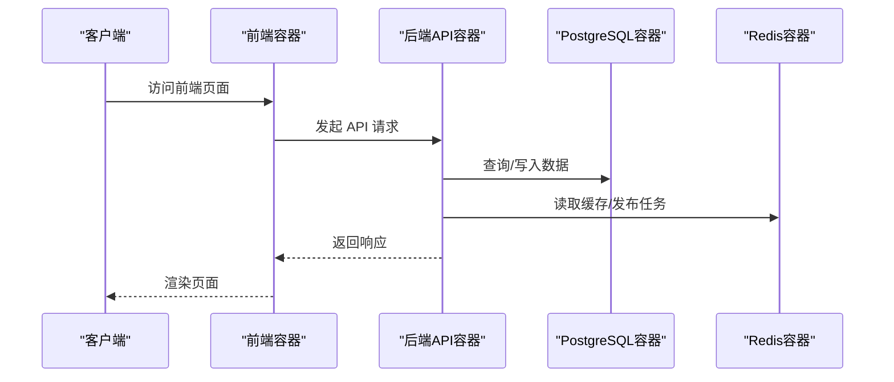
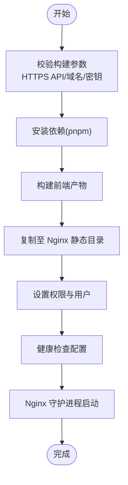
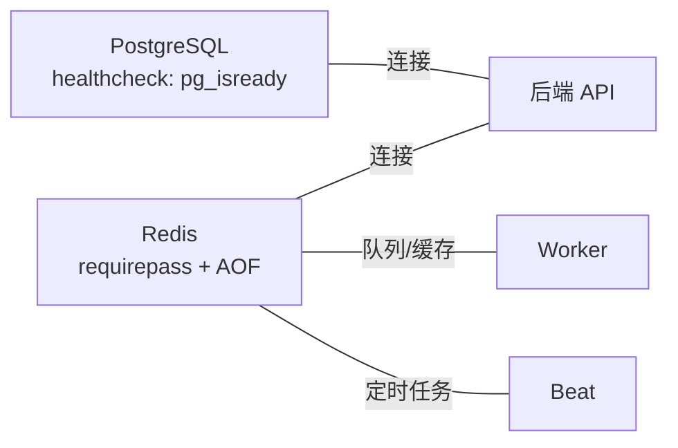
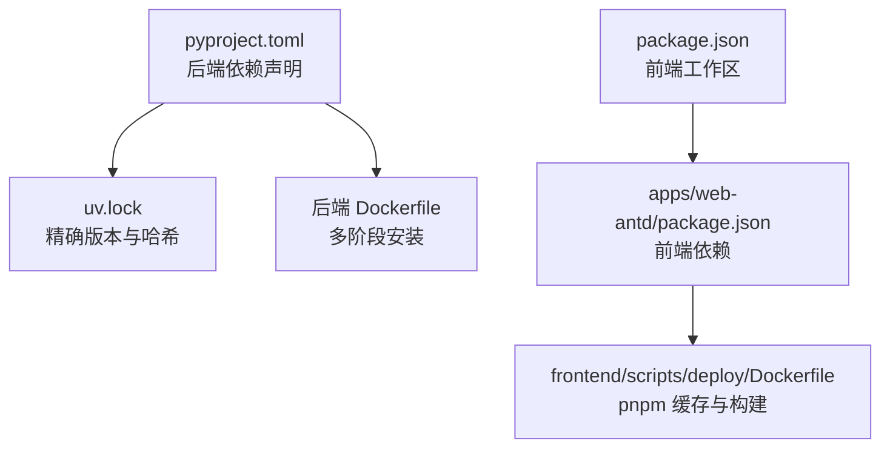

# 容器化策略

<cite>
**本文档引用的文件**
- [backend/Dockerfile](file://backend/Dockerfile)
- [backend/.dockerignore](file://backend/.dockerignore)
- [backend/pyproject.toml](file://backend/pyproject.toml)
- [backend/uv.lock](file://backend/uv.lock)
- [docker-compose.dev.yml](file://docker-compose.dev.yml)
- [docker-compose.prod.yml](file://docker-compose.prod.yml)
- [frontend/scripts/deploy/Dockerfile](file://frontend/scripts/deploy/Dockerfile)
- [frontend/scripts/deploy/build-local-docker-image.sh](file://frontend/scripts/deploy/build-local-docker-image.sh)
- [frontend/.dockerignore](file://frontend/.dockerignore)
- [frontend/package.json](file://frontend/package.json)
- [frontend/apps/web-antd/package.json](file://frontend/apps/web-antd/package.json)
</cite>

## 目录
1. [项目概述](#项目概述)
2. [项目结构](#项目结构)
3. [核心组件](#核心组件)
4. [架构总览](#架构总览)
5. [详细组件分析](#详细组件分析)
6. [依赖关系分析](#依赖关系分析)
7. [性能考虑](#性能考虑)
8. [故障排除指南](#故障排除指南)
9. [结论](#结论)
10. [附录](#附录)

## 项目概述
本容器化策略文档面向 NovusAI SaaS 项目，系统性阐述后端与前端的容器化实施方案，涵盖镜像构建策略（多阶段构建、镜像优化、安全加固）、前后端应用配置与依赖管理、资源限制与运行时约束、容器间通信与网络配置、数据卷管理、以及安全扫描、镜像签名与供应链安全管理方案。目标是提供可落地、可审计、可扩展的容器化最佳实践。

## 项目结构
仓库采用前后端分离的 Monorepo 结构，后端使用 Python/FastAPI，前端基于 Vite/Vue 的单页应用。容器化围绕后端服务（API、Worker、Beat）与前端静态站点展开，并通过 Docker Compose 在开发与生产环境协同编排。

图表来源
- [docker-compose.prod.yml:22-180](file://docker-compose.prod.yml#L22-L180)
- [docker-compose.dev.yml:1-49](file://docker-compose.dev.yml#L1-L49)

章节来源
- [docker-compose.prod.yml:1-191](file://docker-compose.prod.yml#L1-L191)
- [docker-compose.dev.yml:1-49](file://docker-compose.dev.yml#L1-L49)

## 核心组件
- 后端镜像：基于 Python 3.12 slim，采用多阶段构建，第一阶段安装依赖并构建，第二阶段仅复制运行时产物，最终以非 root 用户运行，暴露 8000 端口，内置健康检查。
- 后端服务：API、Worker、Beat 三类容器，分别对应 uvicorn、celery worker、celery beat，均通过 Compose 进行编排与健康检查。
- 前端镜像：基于 Node 22 slim 构建，使用 pnpm 并启用缓存，最终在 Nginx 中提供静态内容，暴露 8080 端口，内置健康检查。
- 数据与缓存：PostgreSQL 使用 pgvector 扩展，Redis 提供缓存与任务队列；两者均通过本地卷持久化。
- 网络：开发环境使用自定义桥接网络，生产环境同样使用桥接网络，服务间通过服务名通信。

章节来源
- [backend/Dockerfile:1-69](file://backend/Dockerfile#L1-L69)
- [docker-compose.prod.yml:22-180](file://docker-compose.prod.yml#L22-L180)
- [docker-compose.dev.yml:1-49](file://docker-compose.dev.yml#L1-L49)
- [frontend/scripts/deploy/Dockerfile:1-80](file://frontend/scripts/deploy/Dockerfile#L1-L80)

## 架构总览
下图展示生产环境的容器化架构：后端 API、Worker、Beat 与数据库、缓存协同工作，前端通过反向代理访问后端 API。

图表来源
- [docker-compose.prod.yml:94-180](file://docker-compose.prod.yml#L94-L180)

章节来源
- [docker-compose.prod.yml:1-191](file://docker-compose.prod.yml#L1-L191)

## 详细组件分析

### 后端镜像与多阶段构建
- 多阶段构建：builder 阶段安装构建工具与系统依赖，拷贝项目源码后进行一次性安装，产物输出到 /install；runtime 阶段仅复制 /install 到运行时基础镜像，减少镜像体积与攻击面。
- 系统依赖最小化：仅安装运行所需库（如 Cairo），并清理包管理器缓存。
- 安全用户隔离：创建 novusai 组与用户，以非 root 身份运行，降低权限风险。
- 健康检查：API 容器通过 HTTP GET /ready 检查，Worker/Beat 通过 Celery 自检命令。
- 端口与入口：API 暴露 8000，Worker/Beat 通过命令启动。

图表来源
- [backend/Dockerfile:1-69](file://backend/Dockerfile#L1-L69)

章节来源
- [backend/Dockerfile:1-69](file://backend/Dockerfile#L1-L69)
- [backend/.dockerignore:1-31](file://backend/.dockerignore#L1-L31)

### 后端服务编排（API/Worker/Beat）
- API 服务：绑定主机端口（默认 127.0.0.1:18000:8000），健康检查通过 HTTP 请求 /ready。
- Worker 服务：依赖数据库与缓存健康，使用 Celery 自检命令验证 Ping。
- Beat 服务：依赖数据库与缓存健康，检查调度状态文件存在性与可写性。
- 数据卷：后端存储、日志与 Beat 调度状态卷挂载，确保持久化。
- 环境变量：统一通过 env_file 与 x-backend-env 模板注入，包含数据库、Redis、内部基地址等。

图表来源
- [docker-compose.prod.yml:94-180](file://docker-compose.prod.yml#L94-L180)

章节来源
- [docker-compose.prod.yml:1-191](file://docker-compose.prod.yml#L1-L191)

### 前端镜像与构建流程
- Node 22 slim 基础镜像，启用 pnpm 缓存加速构建。
- 构建参数校验：强制要求 HTTPS 生产 API 地址、平台域名与安全密钥，防止错误或占位配置进入镜像。
- 多阶段构建：builder 阶段安装依赖并构建产物，production 阶段将 dist 目录复制到 Nginx，设置 nginx 用户运行。
- 健康检查：通过 wget 访问根路径判断可用性。
- 本地构建脚本：提供一键校验与构建流程，包含停止/删除旧容器与镜像、安装依赖、构建镜像与输出使用示例。

图表来源
- [frontend/scripts/deploy/Dockerfile:1-80](file://frontend/scripts/deploy/Dockerfile#L1-L80)
- [frontend/scripts/deploy/build-local-docker-image.sh:1-107](file://frontend/scripts/deploy/build-local-docker-image.sh#L1-L107)

章节来源
- [frontend/scripts/deploy/Dockerfile:1-80](file://frontend/scripts/deploy/Dockerfile#L1-L80)
- [frontend/scripts/deploy/build-local-docker-image.sh:1-107](file://frontend/scripts/deploy/build-local-docker-image.sh#L1-L107)
- [frontend/.dockerignore:1-13](file://frontend/.dockerignore#L1-L13)
- [frontend/package.json:1-127](file://frontend/package.json#L1-L127)
- [frontend/apps/web-antd/package.json:1-101](file://frontend/apps/web-antd/package.json#L1-L101)

### 数据库与缓存容器
- PostgreSQL：使用 pgvector 扩展，初始化编码与区域设置，健康检查通过 pg_isready。
- Redis：启用 AOF 持久化，生产环境通过 init 容器设置数据目录属主，运行时以非 root 用户运行并设置密码，健康检查通过 redis-cli ping。

图表来源
- [docker-compose.dev.yml:23-39](file://docker-compose.dev.yml#L23-L39)
- [docker-compose.prod.yml:23-82](file://docker-compose.prod.yml#L23-L82)

章节来源
- [docker-compose.dev.yml:1-49](file://docker-compose.dev.yml#L1-L49)
- [docker-compose.prod.yml:1-191](file://docker-compose.prod.yml#L1-L191)

### 容器间通信与网络配置
- 开发环境：novusai-dev 桥接网络，服务通过服务名相互发现。
- 生产环境：novusai-prod 桥接网络，API/Worker/Beat 均加入该网络，前端通过 127.0.0.1:PORT:8080 映射对外访问。
- 端口映射：API 默认映射到 127.0.0.1:18000，前端映射到 127.0.0.1:18080，便于本地开发与安全暴露。

章节来源
- [docker-compose.dev.yml:46-49](file://docker-compose.dev.yml#L46-L49)
- [docker-compose.prod.yml:104-179](file://docker-compose.prod.yml#L104-L179)

### 数据卷管理
- 开发环境：postgres_data、redis_data 本地卷。
- 生产环境：后端存储、日志、Beat 调度状态卷独立挂载，确保数据持久化与隔离。

章节来源
- [docker-compose.dev.yml:40-44](file://docker-compose.dev.yml#L40-L44)
- [docker-compose.prod.yml:181-186](file://docker-compose.prod.yml#L181-L186)

## 依赖关系分析
- 后端依赖管理：pyproject.toml 定义核心依赖与可选开发依赖；uv.lock 记录精确版本与哈希，保障供应链安全与可复现构建。
- 前端依赖管理：package.json 管理 monorepo 工作区与脚本；apps/web-antd/package.json 定义前端应用依赖与构建脚本。

图表来源
- [backend/pyproject.toml:1-239](file://backend/pyproject.toml#L1-L239)
- [backend/uv.lock:1-602](file://backend/uv.lock#L1-L602)
- [frontend/package.json:1-127](file://frontend/package.json#L1-L127)
- [frontend/apps/web-antd/package.json:1-101](file://frontend/apps/web-antd/package.json#L1-L101)

章节来源
- [backend/pyproject.toml:1-239](file://backend/pyproject.toml#L1-L239)
- [backend/uv.lock:1-602](file://backend/uv.lock#L1-L602)
- [frontend/package.json:1-127](file://frontend/package.json#L1-L127)
- [frontend/apps/web-antd/package.json:1-101](file://frontend/apps/web-antd/package.json#L1-L101)

## 性能考虑
- 多阶段构建与最小化系统依赖显著降低镜像体积，缩短拉取与启动时间。
- pnpm 缓存与 pnpm install --frozen-lockfile 提升前端构建稳定性与速度。
- Nginx 提供静态资源高效分发，配合健康检查与只读文件系统提升稳定性。
- Celery Worker/Beat 通过健康检查与依赖条件启动，避免空转与资源浪费。

## 故障排除指南
- 健康检查失败
  - 后端 API：检查 /ready 路由可达性与内部服务连通性（数据库、缓存）。
  - 后端 Worker/Beat：确认 Celery 配置正确、Redis 可达且调度文件存在。
  - 前端：检查 Nginx 是否正常启动、静态文件是否存在。
- 端口冲突
  - 修改 docker-compose 中的端口映射，确保与宿主无冲突。
- 权限问题
  - 确认后端日志/上传/缓存目录属主为 novusai:novusai；Redis 初始化容器正确设置数据目录属主。
- 构建失败
  - 前端构建参数校验失败：确保 VITE_GLOB_API_URL 为 HTTPS 生产地址、VITE_PLATFORM_DOMAINS 与 VITE_APP_STORE_SECURE_KEY 不为占位值。

章节来源
- [backend/Dockerfile:55-69](file://backend/Dockerfile#L55-L69)
- [docker-compose.prod.yml:104-179](file://docker-compose.prod.yml#L104-L179)
- [frontend/scripts/deploy/Dockerfile:19-47](file://frontend/scripts/deploy/Dockerfile#L19-L47)
- [frontend/scripts/deploy/build-local-docker-image.sh:39-47](file://frontend/scripts/deploy/build-local-docker-image.sh#L39-L47)

## 结论
本容器化策略通过多阶段构建、最小化依赖、非 root 运行、严格的构建参数校验与健康检查，实现了安全、稳定、可维护的后端与前端容器化方案。结合 Compose 的网络与数据卷管理，满足开发与生产的差异化需求。建议后续引入镜像安全扫描与签名、供应链合规审计与镜像签名策略，进一步强化供应链安全。

## 附录

### 容器安全扫描与供应链安全管理方案
- 镜像安全扫描
  - 在 CI 中集成镜像扫描工具（如 Trivy、Clair、Snyk），对构建产物进行漏洞扫描与许可证合规检查。
  - 将扫描结果纳入流水线门禁，阻断高危漏洞镜像发布。
- 镜像签名
  - 使用 Cosign 对镜像进行签名，结合 Rekor 进行透明度日志记录，确保镜像来源可信与完整性。
  - 在运行时通过 Notary 或 Podman Trust 验证签名，防止篡改镜像运行。
- 供应链安全
  - 固定依赖版本与哈希（pyproject.toml + uv.lock、package.json + pnpm-lock.yaml），避免动态解析带来的漂移风险。
  - 定期更新基础镜像与依赖，建立补丁与升级流程，确保及时修复已知漏洞。
- 最小权限与只读文件系统
  - 后端与前端容器均以非 root 用户运行，必要目录挂载为只读，减少攻击面。
- 网络隔离与访问控制
  - 生产环境仅暴露必要端口，内部服务通过服务名通信，避免直接暴露内部端口。

[本节为通用指导，不直接分析具体文件，故无“章节来源”]