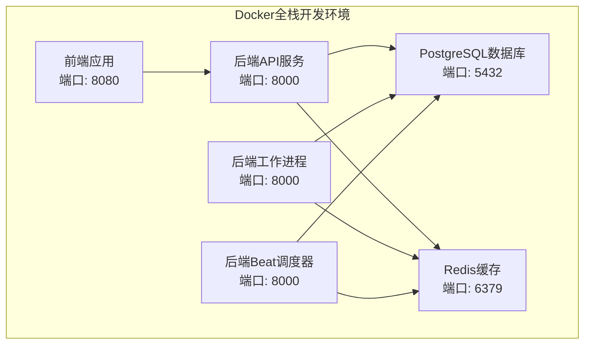
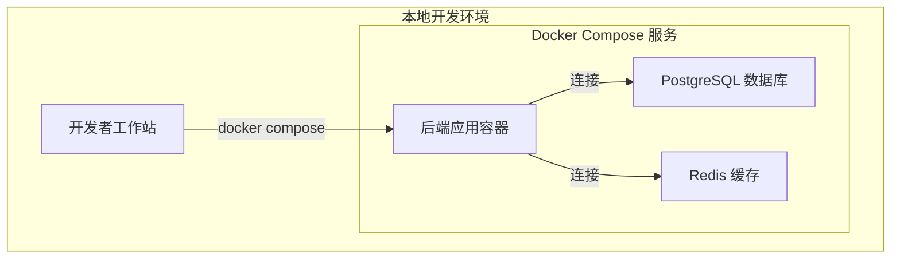
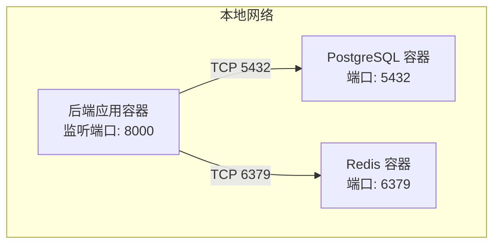
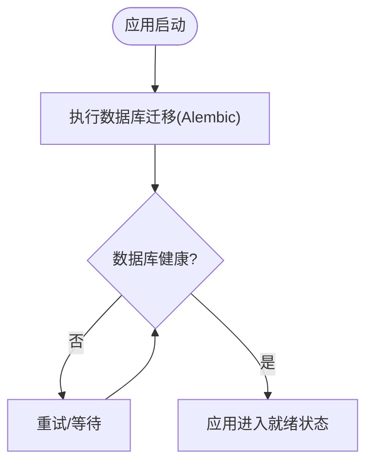
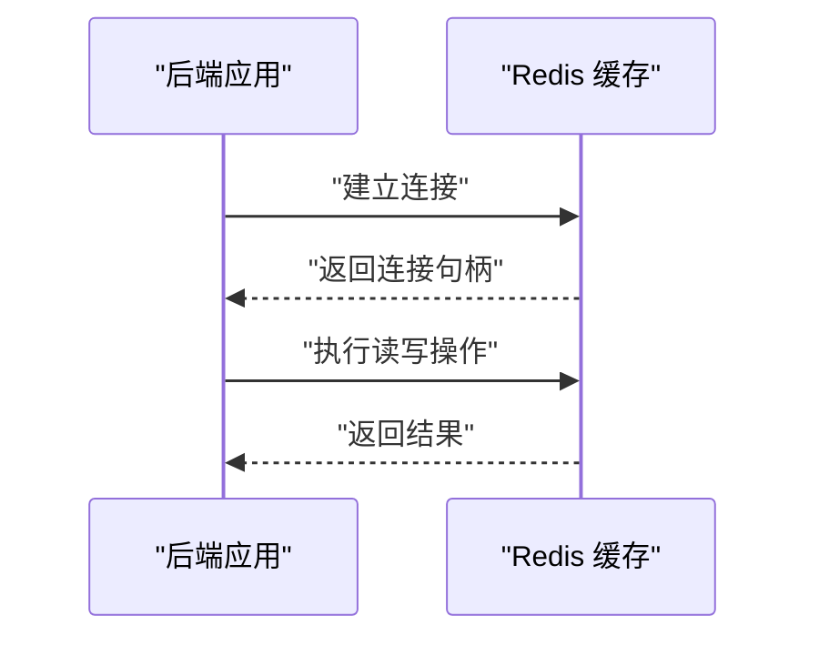
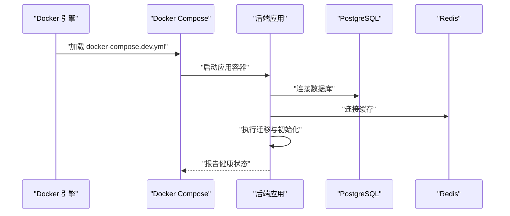
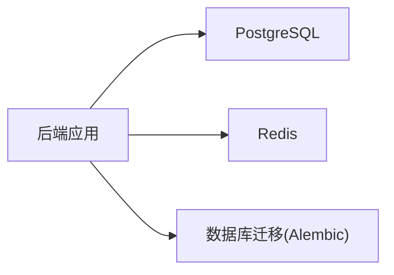

# 开发环境部署

<cite>
**本文引用的文件**
- [docker-compose.dev.yml](file://docker-compose.dev.yml)
- [docker-compose.prod.yml](file://docker-compose.prod.yml)
- [backend/Dockerfile](file://backend/Dockerfile)
- [backend/pyproject.toml](file://backend/pyproject.toml)
- [backend/alembic.ini](file://backend/alembic.ini)
- [backend/app/core/database.py](file://backend/app/core/database.py)
- [backend/app/core/redis.py](file://backend/app/core/redis.py)
- [backend/app/main.py](file://backend/app/main.py)
- [backend/app/cli_commands/core_commands.py](file://backend/app/cli_commands/core_commands.py)
- [backend/scripts/fresh_install_migrate_test.py](file://backend/scripts/fresh_install_migrate_test.py)
- [backend/tests/test_celery_cli.py](file://backend/tests/test_celery_cli.py)
- [production.env.example](file://production.env.example)
- [README.md](file://README.md)
</cite>

## 更新摘要
**所做更改**
- 新增双启动选项：源码开发模式（Option A）和Docker全栈开发模式（Option B）
- 添加两种开发模式的详细说明和URL映射表格
- 更新启动命令和环境配置说明
- 增强开发环境部署的灵活性和可选择性

## 目录
1. [简介](#简介)
2. [双启动选项概览](#双启动选项概览)
3. [源码开发模式（Option A）](#源码开发模式option-a)
4. [Docker全栈开发模式（Option B）](#docker全栈开发模式option-b)
5. [项目结构](#项目结构)
6. [核心组件](#核心组件)
7. [架构总览](#架构总览)
8. [详细组件分析](#详细组件分析)
9. [依赖关系分析](#依赖关系分析)
10. [性能考虑](#性能考虑)
11. [故障排查指南](#故障排查指南)
12. [结论](#结论)
13. [附录](#附录)

## 简介
本文件面向NovusAI SaaS项目的本地开发环境部署，提供基于Docker Compose的完整搭建流程、服务依赖与网络配置、核心服务（PostgreSQL、Redis）的配置参数与健康检查机制、启动命令、环境变量与数据持久化策略，并给出常见问题排查与性能优化建议。本次更新特别增加了双启动选项：源码开发模式（Option A）和Docker全栈开发模式（Option B），为开发者提供更灵活的开发体验。

## 双启动选项概览

NovusAI SaaS提供两种开发模式，可根据个人偏好和开发需求选择：

### 源码开发模式（Option A）
- **特点**：完全基于源码的开发体验，适合需要深度定制和调试的开发者
- **优势**：实时代码修改、热重载、完整的IDE支持、精确的调试能力
- **适用场景**：核心功能开发、性能调优、复杂问题调试

### Docker全栈开发模式（Option B）
- **特点**：完整的Docker容器化开发环境，适合快速部署和一致性保证
- **优势**：环境隔离、依赖管理、一键部署、与生产环境高度一致
- **适用场景**：团队协作、CI/CD集成、环境标准化

### URL映射对比表

| 服务类型 | 源码开发模式（Option A） | Docker全栈开发模式（Option B） |
|---------|-------------------------|-------------------------------|
| 后端API | http://localhost:8000 | http://localhost:8000 |
| 前端应用 | http://localhost:5666 | http://localhost:5666 |
| 数据库 | localhost:5432 | localhost:5432 |
| 缓存服务 | localhost:6379 | localhost:6379 |
| 应用内部地址 | http://backend-api:8000 | http://backend-api:8000 |

**章节来源**
- [README.md](file://README.md)
- [docker-compose.dev.yml](file://docker-compose.dev.yml)
- [docker-compose.prod.yml](file://docker-compose.prod.yml)

## 源码开发模式（Option A）

### 模式特点
源码开发模式允许开发者直接在本地操作系统上运行后端服务，同时使用Docker运行数据库和缓存服务。这种模式提供了最佳的开发体验和调试能力。

### 启动步骤

#### 第一步：启动基础设施服务
```bash
# 启动PostgreSQL和Redis服务
docker compose -f docker-compose.dev.yml up -d postgres redis
```

#### 第二步：配置后端环境
```bash
# 复制并配置环境变量文件
cp backend/.env.example backend/.env
# 根据需要编辑backend/.env文件
```

#### 第三步：安装后端依赖
```bash
# 进入后端目录
cd backend
# 安装Python依赖
pip install -r requirements.txt
# 或使用uv进行安装
uv pip install -r requirements.txt
```

#### 第四步：执行数据库迁移
```bash
# 执行数据库迁移
novusai db upgrade heads
```

#### 第五步：启动后端服务
```bash
# 启动后端API服务
novusai run --host 0.0.0.0 --port 8000

# 启动Celery工作进程
celery -A app.celery_app:celery_app worker --loglevel=info

# 启动Celery Beat调度器
celery -A app.celery_app:celery_app beat --loglevel=info
```

#### 第六步：启动前端服务
```bash
# 进入前端目录
cd frontend
# 安装依赖
pnpm install
# 启动前端开发服务器
pnpm run dev
```

### 环境配置
- **后端**：使用本地Python环境，支持热重载和实时调试
- **数据库**：通过Docker运行的PostgreSQL实例
- **缓存**：通过Docker运行的Redis实例
- **前端**：本地Vite开发服务器

**章节来源**
- [README.md](file://README.md)
- [docker-compose.dev.yml](file://docker-compose.dev.yml)
- [backend/pyproject.toml](file://backend/pyproject.toml)

## Docker全栈开发模式（Option B）

### 模式特点
Docker全栈开发模式将整个应用栈容器化，包括后端API、工作进程、Beat调度器和前端应用。这种模式确保了开发环境与生产环境的高度一致性。

### 启动步骤

#### 第一步：构建并启动所有服务
```bash
# 构建并启动所有服务
docker compose -f docker-compose.dev.yml up --build -d
```

#### 第二步：查看服务状态
```bash
# 查看所有服务状态
docker compose -f docker-compose.dev.yml ps

# 查看服务日志
docker compose -f docker-compose.dev.yml logs -f
```

#### 第三步：停止和清理
```bash
# 停止并删除所有服务及数据卷
docker compose -f docker-compose.dev.yml down -v
```

### 服务架构
Docker全栈模式包含以下核心服务：



**图表来源**
- [docker-compose.dev.yml](file://docker-compose.dev.yml)

### 服务配置
- **后端API服务**：提供RESTful API接口
- **后端工作进程**：处理异步任务和后台作业
- **后端Beat调度器**：管理定时任务
- **前端应用**：提供用户界面和交互
- **数据库服务**：提供数据持久化
- **缓存服务**：提供高性能缓存支持

**章节来源**
- [docker-compose.dev.yml](file://docker-compose.dev.yml)

## 项目结构
本项目采用前后端分离与多服务编排的结构：  
- 后端服务通过Docker Compose在本地启动，包含应用容器与数据库/缓存依赖。
- 前端独立构建与运行，不在此部署文档范围内。
- 生产编排参考位于独立Compose文件中，便于对照理解。



**图表来源**
- [docker-compose.dev.yml](file://docker-compose.dev.yml)

**章节来源**
- [README.md](file://README.md)
- [docker-compose.dev.yml](file://docker-compose.dev.yml)

## 核心组件
- 应用容器：基于后端Dockerfile构建，提供Web服务、任务队列与数据库迁移能力。
- 数据库：PostgreSQL，负责业务数据持久化。
- 缓存：Redis，用于会话、限流、任务队列中间件等场景。
- 迁移与初始化：Alembic用于数据库版本管理；脚本用于首次安装与测试迁移。

**章节来源**
- [backend/Dockerfile](file://backend/Dockerfile)
- [backend/alembic.ini](file://backend/alembic.ini)
- [backend/app/core/database.py](file://backend/app/core/database.py)
- [backend/app/core/redis.py](file://backend/app/core/redis.py)

## 架构总览
下图展示了本地开发环境的服务拓扑、网络与依赖关系：



**图表来源**
- [docker-compose.dev.yml](file://docker-compose.dev.yml)

**章节来源**
- [docker-compose.dev.yml](file://docker-compose.dev.yml)

## 详细组件分析

### PostgreSQL 数据库
- 作用：存储业务模型、租户信息、系统配置、迁移历史等。
- 配置要点：
  - 端口映射与卷挂载确保数据持久化与备份便利性。
  - 初始化脚本或迁移工具（如Alembic）在应用启动时自动执行，保证数据库版本一致。
- 健康检查：Compose文件中定义了健康检查探针，周期性探测端口连通性与可用性。
- 连接参数：由后端应用统一读取环境变量进行连接，避免硬编码。



**图表来源**
- [backend/alembic.ini](file://backend/alembic.ini)
- [backend/app/core/database.py](file://backend/app/core/database.py)

**章节来源**
- [docker-compose.dev.yml](file://docker-compose.dev.yml)
- [backend/alembic.ini](file://backend/alembic.ini)
- [backend/app/core/database.py](file://backend/app/core/database.py)

### Redis 缓存
- 作用：会话存储、速率限制、任务队列中间件、事件广播等。
- 配置要点：
  - 独立容器运行，端口暴露供应用访问。
  - 健康检查确保缓存可用性。
- 连接参数：由后端统一读取环境变量进行连接。



**图表来源**
- [docker-compose.dev.yml](file://docker-compose.dev.yml)
- [backend/app/core/redis.py](file://backend/app/core/redis.py)

**章节来源**
- [docker-compose.dev.yml](file://docker-compose.dev.yml)
- [backend/app/core/redis.py](file://backend/app/core/redis.py)

### 后端应用容器
- 构建方式：基于后端Dockerfile构建镜像，包含Python运行时、依赖安装与启动命令。
- 启动流程：应用启动后执行数据库迁移，随后进入健康检查阶段，最终对外提供服务。
- 环境变量：通过Compose文件注入，包括数据库与缓存连接字符串、应用密钥等。



**图表来源**
- [backend/Dockerfile](file://backend/Dockerfile)
- [docker-compose.dev.yml](file://docker-compose.dev.yml)
- [backend/app/main.py](file://backend/app/main.py)

**章节来源**
- [backend/Dockerfile](file://backend/Dockerfile)
- [docker-compose.dev.yml](file://docker-compose.dev.yml)
- [backend/app/main.py](file://backend/app/main.py)

## 依赖关系分析
- 组件耦合：
  - 应用对数据库与缓存存在强依赖，需在应用启动前完成健康检查。
  - 数据库迁移与应用初始化顺序严格，避免启动失败。
- 外部依赖：
  - Python运行时、系统包、网络与卷权限。
- 可能的循环依赖：
  - 无直接循环依赖，但需注意服务启动顺序与健康检查时机。



**图表来源**
- [backend/app/core/database.py](file://backend/app/core/database.py)
- [backend/alembic.ini](file://backend/alembic.ini)

**章节来源**
- [backend/app/core/database.py](file://backend/app/core/database.py)
- [backend/alembic.ini](file://backend/alembic.ini)

## 性能考虑
- 数据库性能：
  - 合理设置连接池大小，避免过多并发导致锁争用。
  - 在开发环境中启用慢查询日志辅助定位瓶颈。
- 缓存性能：
  - 针对热点数据设置合适的TTL与淘汰策略。
  - 使用连接池减少连接开销。
- 应用性能：
  - 启动时仅执行必要初始化，避免阻塞。
  - 将耗时任务放入后台队列处理，降低请求延迟。
- 资源限制：
  - 在Compose中为各服务设置CPU/内存限制，防止资源争用。

## 故障排查指南
- 启动失败
  - 检查数据库与缓存是否已通过健康检查。
  - 查看应用容器日志，确认迁移是否成功执行。
- 数据库连接异常
  - 确认连接字符串、端口与网络可达性。
  - 检查卷挂载路径与权限。
- 缓存不可用
  - 检查Redis容器健康状态与端口映射。
  - 确认应用侧连接参数与密码正确。
- 迁移失败
  - 使用迁移工具手动执行并查看错误日志。
  - 对照示例环境变量文件核对配置。

**章节来源**
- [backend/app/cli_commands/core_commands.py](file://backend/app/cli_commands/core_commands.py)
- [backend/scripts/fresh_install_migrate_test.py](file://backend/scripts/fresh_install_migrate_test.py)
- [backend/tests/test_celery_cli.py](file://backend/tests/test_celery_cli.py)

## 结论
通过Docker Compose可快速搭建NovusAI SaaS的本地开发环境，确保数据库与缓存的可用性与数据持久化。本次更新新增的双启动选项为开发者提供了更大的灵活性：源码开发模式适合深度定制和调试，Docker全栈模式适合团队协作和环境标准化。遵循本文的启动命令、环境变量与健康检查机制，可显著提升开发效率与稳定性。生产部署请参考生产编排文件并补充安全与可观测性配置。

## 附录

### A. 启动命令与环境准备
- 启动本地开发服务
  - 使用Compose文件启动所有服务：[启动命令路径](file://README.md)
- 环境变量
  - 生产环境示例变量文件：[示例文件](file://production.env.example)
- 数据库迁移
  - 迁移配置文件：[迁移配置](file://backend/alembic.ini)

**章节来源**
- [README.md](file://README.md)
- [production.env.example](file://production.env.example)
- [backend/alembic.ini](file://backend/alembic.ini)

### B. 关键文件与职责
- docker-compose.dev.yml：定义本地开发所需的后端、数据库与缓存服务及其网络与健康检查。
- docker-compose.prod.yml：定义生产环境的编排配置和服务依赖关系。
- backend/Dockerfile：定义后端应用镜像构建过程与启动命令。
- backend/app/core/database.py：数据库连接与会话管理。
- backend/app/core/redis.py：Redis连接与缓存操作封装。
- backend/app/main.py：应用入口与初始化流程。
- backend/app/cli_commands/core_commands.py：CLI命令与开发辅助工具提示。
- backend/scripts/fresh_install_migrate_test.py：首次安装与迁移测试脚本。
- backend/tests/test_celery_cli.py：与任务队列相关的测试，验证开发命令提示。

**章节来源**
- [docker-compose.dev.yml](file://docker-compose.dev.yml)
- [docker-compose.prod.yml](file://docker-compose.prod.yml)
- [backend/Dockerfile](file://backend/Dockerfile)
- [backend/app/core/database.py](file://backend/app/core/database.py)
- [backend/app/core/redis.py](file://backend/app/core/redis.py)
- [backend/app/main.py](file://backend/app/main.py)
- [backend/app/cli_commands/core_commands.py](file://backend/app/cli_commands/core_commands.py)
- [backend/scripts/fresh_install_migrate_test.py](file://backend/scripts/fresh_install_migrate_test.py)
- [backend/tests/test_celery_cli.py](file://backend/tests/test_celery_cli.py)