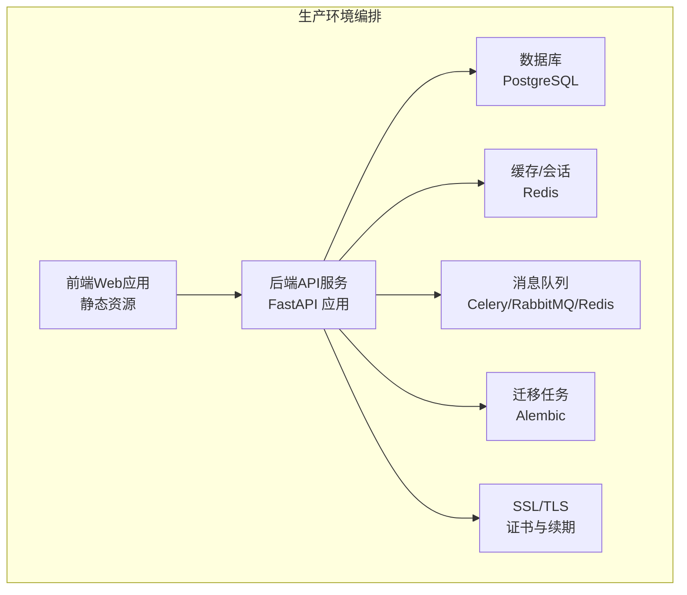
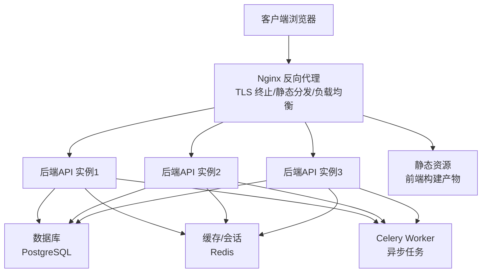
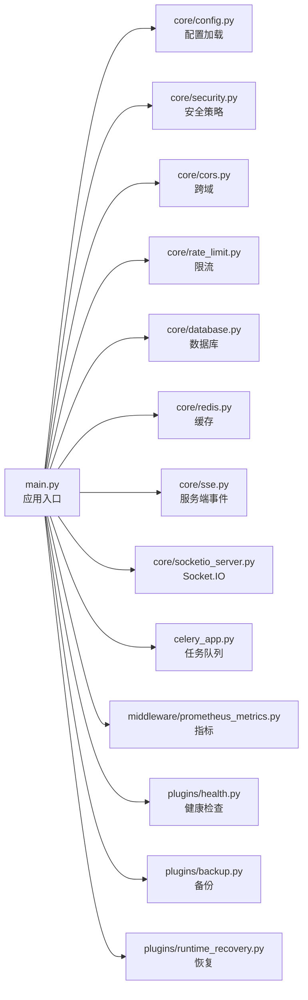

# 生产环境部署

<cite>
**本文引用的文件**
- [backend/Dockerfile](file://backend/Dockerfile)
- [frontend/scripts/deploy/Dockerfile](file://frontend/scripts/deploy/Dockerfile)
- [docker-compose.prod.yml](file://docker-compose.prod.yml)
- [docker-compose.dev.yml](file://docker-compose.dev.yml)
- [backend/.dockerignore](file://backend/.dockerignore)
- [frontend/.dockerignore](file://frontend/.dockerignore)
- [backend/pyproject.toml](file://backend/pyproject.toml)
- [backend/alembic.ini](file://backend/alembic.ini)
- [backend/migrations/env.py](file://backend/migrations/env.py)
- [backend/main.py](file://backend/main.py)
- [backend/core/config.py](file://backend/core/config.py)
- [backend/core/security.py](file://backend/core/security.py)
- [backend/middleware/prometheus_metrics.py](file://backend/middleware/prometheus_metrics.py)
- [backend/tasks/ssl_tasks.py](file://backend/tasks/ssl_tasks.py)
- [backend/plugins/backup.py](file://backend/plugins/backup.py)
- [backend/plugins/runtime_recovery.py](file://backend/plugins/runtime_recovery.py)
- [backend/plugins/health.py](file://backend/plugins/health.py)
- [backend/core/logging.py](file://backend/core/logging.py)
- [backend/core/database.py](file://backend/core/database.py)
- [backend/core/redis.py](file://backend/core/redis.py)
- [backend/celery_app.py](file://backend/celery_app.py)
- [backend/cli_commands/health_commands.py](file://backend/cli_commands/health_commands.py)
- [backend/core/scope.py](file://backend/core/scope.py)
- [backend/core/hosts_helper.py](file://backend/core/hosts_helper.py)
- [backend/core/cors.py](file://backend/core/cors.py)
- [backend/core/rate_limit.py](file://backend/core/rate_limit.py)
- [backend/core/socketio_server.py](file://backend/core/socketio_server.py)
- [backend/core/sse.py](file://backend/core/sse.py)
- [backend/api/admin/...](file://backend/api/admin/)
- [backend/api/public/...](file://backend/api/public/)
- [backend/api/tenant/...](file://backend/api/tenant/)
- [backend/api/user/...](file://backend/api/user/)
- [backend/api/v1/...](file://backend/api/v1/)
- [backend/models/...](file://backend/models/)
- [backend/repositories/...](file://backend/repositories/)
- [backend/services/...](file://backend/services/)
- [backend/schemas/...](file://backend/schemas/)
- [backend/enums/...](file://backend/enums/)
- [backend/exceptions/...](file://backend/exceptions/)
- [backend/utils/...](file://backend/utils/)
- [backend/cli_commands/...](file://backend/cli_commands/)
- [backend/codegen/...](file://backend/codegen/)
- [backend/plugins/...](file://backend/plugins/)
- [backend/tests/...](file://backend/tests/)
- [backend/docs/...](file://backend/docs/)
- [frontend/apps/web-antd/package.json](file://frontend/apps/web-antd/package.json)
- [frontend/apps/web-antd/vite.config.mts](file://frontend/apps/web-antd/vite.config.mts)
- [frontend/package.json](file://frontend/package.json)
- [frontend/playwright.config.ts](file://frontend/playwright.config.ts)
- [frontend/playwright_mcp_config.json](file://frontend/playwright_mcp_config.json)
- [frontend/turbo.json](file://frontend/turbo.json)
- [frontend/internal/vite-config/...](file://frontend/internal/vite-config/)
- [frontend/internal/tailwind-config/...](file://frontend/internal/tailwind-config/)
- [frontend/internal/tsconfig/...](file://frontend/internal/tsconfig/)
- [frontend/internal/node-utils/...](file://frontend/internal/node-utils/)
- [frontend/scripts/deploy/...](file://frontend/scripts/deploy/)
- [frontend/scripts/turbo-run/...](file://frontend/scripts/turbo-run/)
- [frontend/playground/...](file://frontend/playground/)
- [frontend/packages/@core/...](file://frontend/packages/@core/)
- [frontend/packages/types/...](file://frontend/packages/types/)
- [frontend/packages/utils/...](file://frontend/packages/utils/)
- [frontend/packages/stores/...](file://frontend/packages/stores/)
- [frontend/packages/preferences/...](file://frontend/packages/preferences/)
- [frontend/packages/locales/...](file://frontend/packages/locales/)
- [frontend/packages/icons/...](file://frontend/packages/icons/)
- [frontend/packages/effects/...](file://frontend/packages/effects/)
- [frontend/packages/constants/...](file://frontend/packages/constants/)
- [frontend/packages/styles/...](file://frontend/packages/styles/)
- [frontend/packages/composables/...](file://frontend/packages/composables/)
- [frontend/packages/...](file://frontend/packages/)
- [frontend/internal/...](file://frontend/internal/)
- [frontend/scripts/...](file://frontend/scripts/)
- [frontend/docs/...](file://frontend/docs/)
</cite>

## 目录
1. [简介](#简介)
2. [项目结构](#项目结构)
3. [核心组件](#核心组件)
4. [架构总览](#架构总览)
5. [详细组件分析](#详细组件分析)
6. [依赖关系分析](#依赖关系分析)
7. [性能考虑](#性能考虑)
8. [故障排查指南](#故障排查指南)
9. [结论](#结论)
10. [附录](#附录)

## 简介
本文件面向NovusAI SaaS的生产环境部署，提供从容器化到服务编排、从安全与监控到备份与恢复的完整实践指南。内容覆盖后端Python/FastAPI应用、前端Web应用、数据库迁移与版本管理、任务调度（Celery）、中间件与插件体系、以及生产级运维最佳实践。

## 项目结构
项目采用前后端分离架构，后端基于FastAPI，前端基于Vite+TypeScript，通过Docker与Compose进行容器化与编排。生产环境以docker-compose.prod.yml为核心编排文件，定义了后端API、静态资源、数据库、缓存、消息队列等服务拓扑。

图表来源
- [docker-compose.prod.yml](file://docker-compose.prod.yml)
- [backend/Dockerfile](file://backend/Dockerfile)
- [frontend/scripts/deploy/Dockerfile](file://frontend/scripts/deploy/Dockerfile)

章节来源
- [docker-compose.prod.yml](file://docker-compose.prod.yml)
- [backend/Dockerfile](file://backend/Dockerfile)
- [frontend/scripts/deploy/Dockerfile](file://frontend/scripts/deploy/Dockerfile)

## 核心组件
- 后端API服务：基于FastAPI，提供多租户、权限控制、AI能力接入、任务调度、插件系统等。
- 前端Web应用：单页应用（SPA），通过Vite构建，支持国际化与主题。
- 数据库与迁移：PostgreSQL + Alembic，支持版本化迁移与回滚。
- 缓存与会话：Redis用于会话存储、速率限制与缓存。
- 消息队列：Celery用于异步任务处理（如SSL证书续期、定时任务）。
- 中间件与插件：统一CORS、审计日志、指标采集、健康检查、备份与恢复等。
- 安全与合规：HTTPS、CORS策略、速率限制、审计日志、密钥管理。

章节来源
- [backend/main.py](file://backend/main.py)
- [backend/core/config.py](file://backend/core/config.py)
- [backend/core/security.py](file://backend/core/security.py)
- [backend/core/cors.py](file://backend/core/cors.py)
- [backend/core/rate_limit.py](file://backend/core/rate_limit.py)
- [backend/core/database.py](file://backend/core/database.py)
- [backend/core/redis.py](file://backend/core/redis.py)
- [backend/celery_app.py](file://backend/celery_app.py)
- [backend/middleware/prometheus_metrics.py](file://backend/middleware/prometheus_metrics.py)
- [backend/plugins/backup.py](file://backend/plugins/backup.py)
- [backend/plugins/runtime_recovery.py](file://backend/plugins/runtime_recovery.py)
- [backend/plugins/health.py](file://backend/plugins/health.py)

## 架构总览
生产环境采用“反向代理 + 多实例后端 + 静态资源 + 数据层”的分层架构。Nginx作为入口反向代理，负责TLS终止、静态资源分发、请求转发与健康检查。后端API以多实例运行，结合Redis实现会话共享与限流，Celery处理后台任务，数据库与缓存独立部署。

图表来源
- [docker-compose.prod.yml](file://docker-compose.prod.yml)
- [backend/core/socketio_server.py](file://backend/core/socketio_server.py)
- [backend/core/sse.py](file://backend/core/sse.py)

## 详细组件分析

### 反向代理与负载均衡（Nginx）
- TLS终止：建议在Nginx中配置Let’s Encrypt或企业CA证书，启用HTTP/2与现代加密套件。
- 静态资源：将前端构建产物映射至Nginx静态目录，开启Gzip/Brotli压缩与缓存头。
- 负载均衡：使用轮询或最少连接策略，结合后端健康检查（/health）。
- 安全头：添加HSTS、CSP、X-Frame-Options等安全响应头。
- 访问日志：记录真实IP（X-Forwarded-For）、请求时间与状态码，便于审计与分析。

章节来源
- [docker-compose.prod.yml](file://docker-compose.prod.yml)

### Docker镜像构建流程
- 后端镜像：基于Python官方镜像，使用requirements/依赖管理工具安装生产依赖；构建时仅复制必要文件，减少层数；设置非root用户与只读根文件系统；禁用交互式安装。
- 前端镜像：基于Node官方镜像构建，使用pnpm加速；构建后输出静态文件至Nginx目录；镜像最小化，避免开发依赖。
- 多阶段构建：后端可采用多阶段构建，第一阶段安装依赖，第二阶段仅拷贝运行时产物，减小最终镜像体积。
- 安全扫描：在CI中集成镜像漏洞扫描，确保基础镜像与依赖的安全性。

章节来源
- [backend/Dockerfile](file://backend/Dockerfile)
- [frontend/scripts/deploy/Dockerfile](file://frontend/scripts/deploy/Dockerfile)
- [backend/pyproject.toml](file://backend/pyproject.toml)
- [frontend/apps/web-antd/package.json](file://frontend/apps/web-antd/package.json)

### 容器编排与服务发现
- Compose编排：使用docker-compose.prod.yml定义服务、网络、卷与环境变量；为每个服务设置重启策略与健康检查。
- 服务发现：在Kubernetes场景下使用Headless Service或ClusterIP；在Docker Swarm场景下使用内置DNS。
- 网络隔离：将数据库、缓存置于内部网络，仅暴露反向代理端口；使用只读挂载与受限权限。
- 卷管理：数据库与Redis持久化卷独立管理，定期快照与异地备份。

章节来源
- [docker-compose.prod.yml](file://docker-compose.prod.yml)
- [docker-compose.dev.yml](file://docker-compose.dev.yml)

### 环境变量与配置管理
- 必需变量：数据库连接串、Redis地址、Celery Broker/Backend、密钥与JWT配置、CORS允许域名、速率限制阈值、日志级别。
- 安全变量：敏感信息通过密钥管理服务注入，避免硬编码；区分开发/测试/生产三套配置。
- 动态配置：支持通过环境变量切换功能开关与日志级别；后端提供配置加载与校验逻辑。

章节来源
- [backend/core/config.py](file://backend/core/config.py)
- [backend/main.py](file://backend/main.py)

### 安全策略
- 传输安全：强制HTTPS，自动重定向HTTP；启用TLS 1.3与前向保密；定期轮换证书。
- 访问控制：CORS白名单、跨域预检、Cookie SameSite/Lax/Strict；CSRF防护（如适用）。
- 速率限制：基于IP/用户维度的请求配额与滑动窗口；超限返回标准错误码。
- 审计与日志：统一日志格式与结构化输出；敏感字段脱敏；集中化日志收集与告警。
- 插件安全：插件签名与完整性校验；沙箱执行与资源限制。

章节来源
- [backend/core/security.py](file://backend/core/security.py)
- [backend/core/cors.py](file://backend/core/cors.py)
- [backend/core/rate_limit.py](file://backend/core/rate_limit.py)
- [backend/core/logging.py](file://backend/core/logging.py)

### 备份与恢复
- 数据库备份：定期逻辑备份（pg_dump）与物理备份；增量/差异备份策略；异地冷备。
- 配置与密钥：备份配置文件与密钥材料；密钥轮换与归档。
- 恢复演练：定期进行RTO/RPO测试；自动化恢复脚本与回滚预案。
- 插件与静态资源：备份插件包与前端构建产物；版本化管理与快速回滚。

章节来源
- [backend/plugins/backup.py](file://backend/plugins/backup.py)
- [backend/plugins/runtime_recovery.py](file://backend/plugins/runtime_recovery.py)

### 性能调优
- 连接池：数据库连接池大小与超时；Redis连接池与命令批处理。
- 缓存策略：热点数据缓存、TTL与失效策略；分布式缓存一致性。
- 异步任务：Celery并发与队列分区；任务优先级与失败重试。
- 前端优化：代码分割、懒加载、CDN分发、缓存头设置。
- 监控指标：QPS、P95/P99延迟、错误率、连接数、内存/CPU使用率。

章节来源
- [backend/core/database.py](file://backend/core/database.py)
- [backend/core/redis.py](file://backend/core/redis.py)
- [backend/celery_app.py](file://backend/celery_app.py)
- [backend/middleware/prometheus_metrics.py](file://backend/middleware/prometheus_metrics.py)

### 监控集成
- 指标采集：Prometheus抓取后端指标；Grafana可视化；告警规则（阈值、异常检测）。
- 日志聚合：ELK/EFK栈收集容器日志；结构化字段索引；日志查询与仪表板。
- 健康检查：/health端点返回应用、数据库、缓存、队列状态；外部探针探测。
- 链路追踪：OpenTelemetry或APM工具追踪请求链路；错误与慢调用定位。

章节来源
- [backend/plugins/health.py](file://backend/plugins/health.py)
- [backend/middleware/prometheus_metrics.py](file://backend/middleware/prometheus_metrics.py)

### 故障恢复最佳实践
- 自愈机制：容器重启策略、健康检查失败自动拉起；数据库主从切换与故障转移。
- 降级策略：熔断与限流；部分功能降级（如非关键通知）；灰度发布与回滚。
- 应急响应：变更审批、发布窗口、紧急修复流程；事故报告与复盘。

章节来源
- [backend/plugins/runtime_recovery.py](file://backend/plugins/runtime_recovery.py)
- [backend/cli_commands/health_commands.py](file://backend/cli_commands/health_commands.py)

## 依赖关系分析
后端服务依赖关系如下：

图表来源
- [backend/main.py](file://backend/main.py)
- [backend/core/config.py](file://backend/core/config.py)
- [backend/core/security.py](file://backend/core/security.py)
- [backend/core/cors.py](file://backend/core/cors.py)
- [backend/core/rate_limit.py](file://backend/core/rate_limit.py)
- [backend/core/database.py](file://backend/core/database.py)
- [backend/core/redis.py](file://backend/core/redis.py)
- [backend/core/sse.py](file://backend/core/sse.py)
- [backend/core/socketio_server.py](file://backend/core/socketio_server.py)
- [backend/celery_app.py](file://backend/celery_app.py)
- [backend/middleware/prometheus_metrics.py](file://backend/middleware/prometheus_metrics.py)
- [backend/plugins/health.py](file://backend/plugins/health.py)
- [backend/plugins/backup.py](file://backend/plugins/backup.py)
- [backend/plugins/runtime_recovery.py](file://backend/plugins/runtime_recovery.py)

## 性能考虑
- 数据库层面：连接池大小与超时、只读副本、索引优化、查询计划分析；事务粒度与锁竞争。
- 缓存层面：热点键分布、TTL策略、缓存穿透与击穿防护；多级缓存（本地+分布式）。
- 应用层面：异步I/O、并发模型选择、中间件顺序与开销；静态资源CDN与压缩。
- 队列层面：任务拆分与优先级、重试退避、死信队列；Worker数量与并发度。
- 前端层面：打包优化、按需加载、图片与字体优化、Service Worker缓存。

## 故障排查指南
- 健康检查：通过/health端点确认应用、数据库、缓存、队列状态；关注错误码与响应时间。
- 日志定位：查看容器日志与应用日志，定位异常堆栈与慢查询；结合追踪ID关联请求链路。
- 数据库问题：检查连接数上限、长事务、锁等待；必要时执行vacuum/analyze。
- 缓存问题：验证键空间命中率、TTL分布、过期策略；清理异常键。
- 队列问题：检查任务积压、Worker存活、序列化异常；重试与死信处理。
- 证书与TLS：检查证书有效期、链路完整性、加密套件兼容性；自动续期任务状态。

章节来源
- [backend/plugins/health.py](file://backend/plugins/health.py)
- [backend/cli_commands/health_commands.py](file://backend/cli_commands/health_commands.py)
- [backend/tasks/ssl_tasks.py](file://backend/tasks/ssl_tasks.py)

## 结论
通过上述容器化与编排策略、安全与监控体系、备份与恢复方案，以及性能调优与故障恢复最佳实践，NovusAI SaaS可在生产环境中实现高可用、可扩展与可维护的部署目标。建议在上线前完成完整的端到端演练与安全审计，并建立持续改进的运维流程。

## 附录
- 开发与生产差异：开发环境侧重热更新与调试，生产环境强调稳定性与安全；通过不同compose文件隔离配置。
- 版本与发布：语义化版本、变更日志、灰度发布与回滚；CI/CD流水线集成镜像构建与部署。
- 合规与审计：数据最小化、访问日志、审计追踪、第三方安全评估。