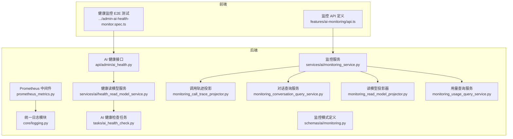
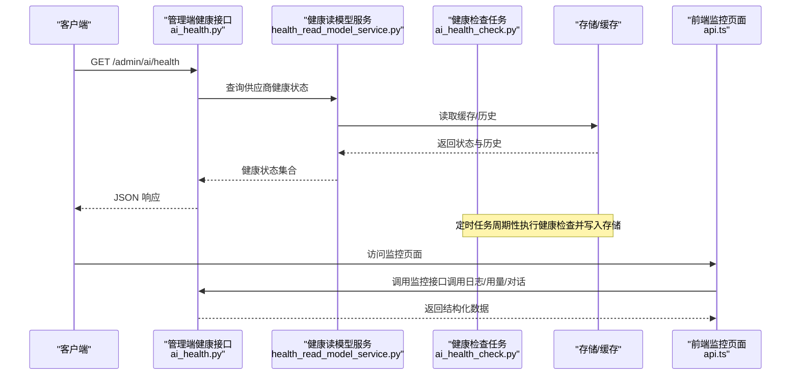
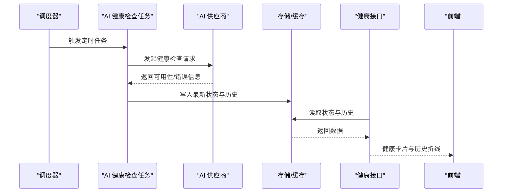
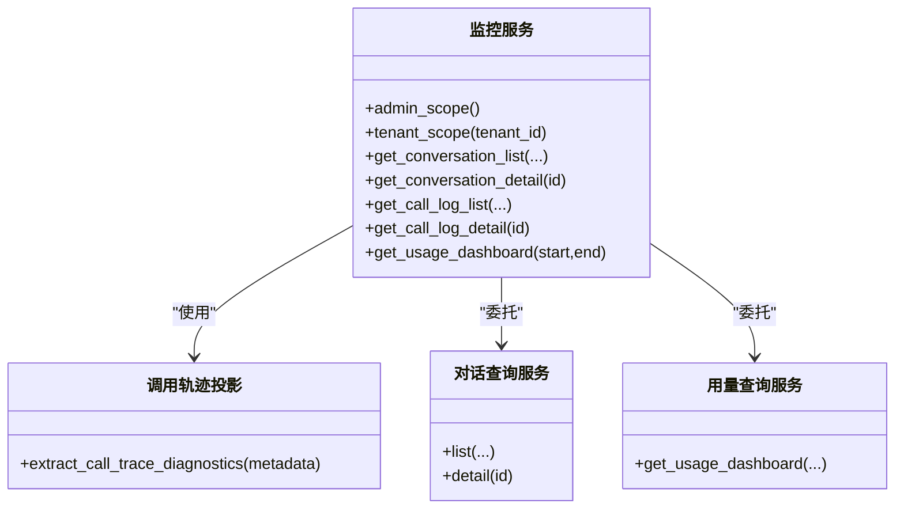
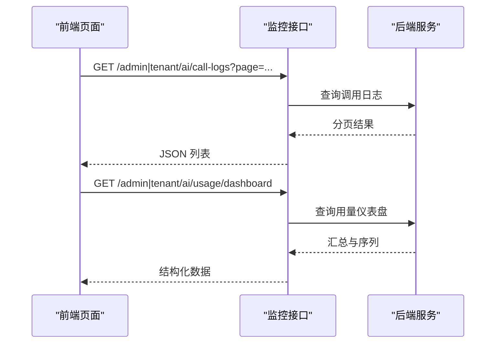
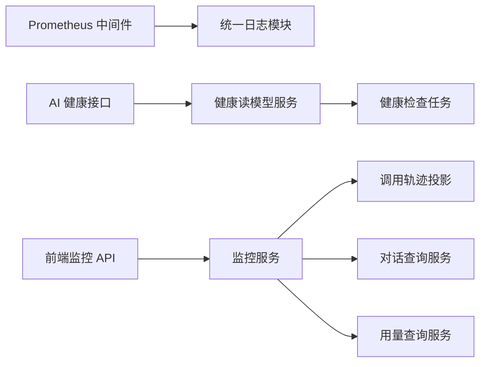

# 监控与日志

<cite>
**本文引用的文件**
- [backend/app/middleware/prometheus_metrics.py](file://backend/app/middleware/prometheus_metrics.py)
- [backend/app/core/logging.py](file://backend/app/core/logging.py)
- [backend/app/api/admin/ai_health.py](file://backend/app/api/admin/ai_health.py)
- [backend/app/services/ai/health_read_model_service.py](file://backend/app/services/ai/health_read_model_service.py)
- [backend/app/tasks/ai_health_check.py](file://backend/app/tasks/ai_health_check.py)
- [backend/migrations/versions/20260325_0002_task_scheduling_foundation.py](file://backend/migrations/versions/20260325_0002_task_scheduling_foundation.py)
- [backend/app/services/ai/monitoring_service.py](file://backend/app/services/ai/monitoring_service.py)
- [backend/app/services/ai/monitoring_call_trace_projector.py](file://backend/app/services/ai/monitoring_call_trace_projector.py)
- [backend/app/services/ai/monitoring_conversation_query_service.py](file://backend/app/services/ai/monitoring_conversation_query_service.py)
- [backend/app/services/ai/monitoring_read_model_projector.py](file://backend/app/services/ai/monitoring_read_model_projector.py)
- [backend/app/services/ai/monitoring_usage_query_service.py](file://backend/app/services/ai/monitoring_usage_query_service.py)
- [backend/app/schemas/ai/monitoring.py](file://backend/app/schemas/ai/monitoring.py)
- [frontend/apps/web-antd/src/features/ai-monitoring/api.ts](file://frontend/apps/web-antd/src/features/ai-monitoring/api.ts)
- [frontend/apps/web-antd/__tests__/e2e/admin-ai-health-monitor.spec.ts](file://frontend/apps/web-antd/__tests__/e2e/admin-ai-health-monitor.spec.ts)
</cite>

## 目录
1. [简介](#简介)
2. [项目结构](#项目结构)
3. [核心组件](#核心组件)
4. [架构总览](#架构总览)
5. [详细组件分析](#详细组件分析)
6. [依赖关系分析](#依赖关系分析)
7. [性能考虑](#性能考虑)
8. [故障排查指南](#故障排查指南)
9. [结论](#结论)
10. [附录](#附录)

## 简介
本文件面向 NovusAI SaaS 的监控与日志体系，系统性阐述后端 Prometheus 指标采集、Grafana 可视化、Alertmanager 告警以及前端监控页面的实现与使用方式。内容覆盖应用日志结构、错误追踪、性能监控、实时通信监控、AI 调用监控与系统健康检查等关键能力，并提供可操作的流程图与时序图帮助理解。

## 项目结构
监控与日志相关代码主要分布在以下区域：
- 后端中间件与核心日志：Prometheus 指标中间件、统一日志模块
- AI 健康监控：管理端健康接口、健康读模型服务、定时任务
- 监控查询与展示：监控服务、调用轨迹投影、对话查询、用量查询、监控模式定义
- 前端监控 API 与测试：监控接口定义、E2E 测试用例

图表来源
- [backend/app/middleware/prometheus_metrics.py](file://backend/app/middleware/prometheus_metrics.py)
- [backend/app/core/logging.py](file://backend/app/core/logging.py)
- [backend/app/api/admin/ai_health.py](file://backend/app/api/admin/ai_health.py)
- [backend/app/services/ai/health_read_model_service.py](file://backend/app/services/ai/health_read_model_service.py)
- [backend/app/tasks/ai_health_check.py](file://backend/app/tasks/ai_health_check.py)
- [backend/app/services/ai/monitoring_service.py](file://backend/app/services/ai/monitoring_service.py)
- [backend/app/services/ai/monitoring_call_trace_projector.py](file://backend/app/services/ai/monitoring_call_trace_projector.py)
- [backend/app/services/ai/monitoring_conversation_query_service.py](file://backend/app/services/ai/monitoring_conversation_query_service.py)
- [backend/app/services/ai/monitoring_read_model_projector.py](file://backend/app/services/ai/monitoring_read_model_projector.py)
- [backend/app/services/ai/monitoring_usage_query_service.py](file://backend/app/services/ai/monitoring_usage_query_service.py)
- [backend/app/schemas/ai/monitoring.py](file://backend/app/schemas/ai/monitoring.py)
- [frontend/apps/web-antd/src/features/ai-monitoring/api.ts](file://frontend/apps/web-antd/src/features/ai-monitoring/api.ts)
- [frontend/apps/web-antd/__tests__/e2e/admin-ai-health-monitor.spec.ts](file://frontend/apps/web-antd/__tests__/e2e/admin-ai-health-monitor.spec.ts)

章节来源
- [backend/app/middleware/prometheus_metrics.py](file://backend/app/middleware/prometheus_metrics.py)
- [backend/app/core/logging.py](file://backend/app/core/logging.py)
- [backend/app/api/admin/ai_health.py](file://backend/app/api/admin/ai_health.py)
- [backend/app/services/ai/monitoring_service.py](file://backend/app/services/ai/monitoring_service.py)
- [frontend/apps/web-antd/src/features/ai-monitoring/api.ts](file://frontend/apps/web-antd/src/features/ai-monitoring/api.ts)

## 核心组件
- Prometheus 指标中间件：在请求处理链路中统计 HTTP 请求总量、时延、状态码分布等指标，便于 Grafana 展示与告警规则使用。
- 统一日志模块：集中定义日志格式、级别、上下文字段（如 trace_id），确保跨服务一致的日志输出与检索。
- AI 健康监控：提供供应商健康状态查询与历史趋势，结合定时任务周期性检查并写入缓存或数据库，支持前端可视化。
- 监控查询与展示：封装调用日志、对话详情、用量仪表盘等查询逻辑，统一对外提供数据结构与分页能力。
- 前端监控 API：定义管理端与租户端的监控接口，包括调用日志列表/详情、对话列表/详情、用量仪表盘等。

章节来源
- [backend/app/middleware/prometheus_metrics.py](file://backend/app/middleware/prometheus_metrics.py)
- [backend/app/core/logging.py](file://backend/app/core/logging.py)
- [backend/app/api/admin/ai_health.py](file://backend/app/api/admin/ai_health.py)
- [backend/app/services/ai/monitoring_service.py](file://backend/app/services/ai/monitoring_service.py)
- [frontend/apps/web-antd/src/features/ai-monitoring/api.ts](file://frontend/apps/web-antd/src/features/ai-monitoring/api.ts)

## 架构总览
下图展示了从请求进入、指标采集、日志记录、AI 健康检查到前端监控展示的整体流程。

图表来源
- [backend/app/api/admin/ai_health.py](file://backend/app/api/admin/ai_health.py)
- [backend/app/services/ai/health_read_model_service.py](file://backend/app/services/ai/health_read_model_service.py)
- [backend/app/tasks/ai_health_check.py](file://backend/app/tasks/ai_health_check.py)
- [frontend/apps/web-antd/src/features/ai-monitoring/api.ts](file://frontend/apps/web-antd/src/features/ai-monitoring/api.ts)

## 详细组件分析

### Prometheus 指标采集与 Grafana 可视化
- 指标采集：通过中间件在请求进入与退出时打点，记录方法、路径、状态码、耗时等维度，形成标准直方图与计数器。
- Grafana 面板：建议基于采集指标构建以下面板
  - QPS/错误率：按方法与状态码聚合
  - 延迟分布：HTTP 请求 P50/P90/P99
  - AI 调用成功率与耗时：结合调用日志表中的成功/失败标记
  - 健康检查可用性：按供应商聚合可用性与错误率
- 指标命名与标签：遵循 Prometheus 最佳实践，避免高基数标签，统一命名空间与单位。

章节来源
- [backend/app/middleware/prometheus_metrics.py](file://backend/app/middleware/prometheus_metrics.py)

### 统一日志结构与错误追踪
- 日志结构：统一采用结构化 JSON 输出，包含时间戳、级别、服务名、trace_id、模块、消息体、上下文键值对等。
- 错误追踪：在异常捕获处注入 trace_id，结合日志检索工具快速定位问题；对关键路径（如 AI 调用、对话处理）增加上下文日志。
- 性能监控：在关键函数入口/出口记录耗时，用于慢查询与热点分析。

章节来源
- [backend/app/core/logging.py](file://backend/app/core/logging.py)

### AI 健康监控与系统健康检查
- 健康接口：提供供应商当前健康状态查询与历史趋势查询，支持分页与限制条数。
- 健康读模型：负责从缓存或数据库读取健康状态与历史记录，供接口层返回。
- 定时任务：周期性触发健康检查，更新缓存或写入历史记录，内置重试与超时控制。
- 前端 E2E：通过模拟接口响应验证健康卡片渲染与历史加载逻辑。

图表来源
- [backend/app/tasks/ai_health_check.py](file://backend/app/tasks/ai_health_check.py)
- [backend/app/services/ai/health_read_model_service.py](file://backend/app/services/ai/health_read_model_service.py)
- [backend/app/api/admin/ai_health.py](file://backend/app/api/admin/ai_health.py)
- [frontend/apps/web-antd/__tests__/e2e/admin-ai-health-monitor.spec.ts](file://frontend/apps/web-antd/__tests__/e2e/admin-ai-health-monitor.spec.ts)

章节来源
- [backend/app/api/admin/ai_health.py](file://backend/app/api/admin/ai_health.py)
- [backend/app/services/ai/health_read_model_service.py](file://backend/app/services/ai/health_read_model_service.py)
- [backend/app/tasks/ai_health_check.py](file://backend/app/tasks/ai_health_check.py)
- [frontend/apps/web-antd/__tests__/e2e/admin-ai-health-monitor.spec.ts](file://frontend/apps/web-antd/__tests__/e2e/admin-ai-health-monitor.spec.ts)

### 监控查询与展示（调用日志、对话、用量）
- 监控服务：封装查询依赖解析、参数标准化、诊断提取等通用逻辑，向上提供统一的查询入口。
- 调用轨迹投影：将原始调用元数据转换为可读的调用轨迹，便于回溯与审计。
- 对话查询服务：提供对话列表、详情查询，支持分页与过滤。
- 用量查询服务：产出用量汇总、分组统计与时间序列，支撑仪表盘展示。
- 监控模式定义：统一调用日志、对话、用量等数据结构，保证前后端契约稳定。

图表来源
- [backend/app/services/ai/monitoring_service.py](file://backend/app/services/ai/monitoring_service.py)
- [backend/app/services/ai/monitoring_call_trace_projector.py](file://backend/app/services/ai/monitoring_call_trace_projector.py)
- [backend/app/services/ai/monitoring_conversation_query_service.py](file://backend/app/services/ai/monitoring_conversation_query_service.py)
- [backend/app/services/ai/monitoring_usage_query_service.py](file://backend/app/services/ai/monitoring_usage_query_service.py)

章节来源
- [backend/app/services/ai/monitoring_service.py](file://backend/app/services/ai/monitoring_service.py)
- [backend/app/services/ai/monitoring_call_trace_projector.py](file://backend/app/services/ai/monitoring_call_trace_projector.py)
- [backend/app/services/ai/monitoring_conversation_query_service.py](file://backend/app/services/ai/monitoring_conversation_query_service.py)
- [backend/app/services/ai/monitoring_usage_query_service.py](file://backend/app/services/ai/monitoring_usage_query_service.py)
- [backend/app/schemas/ai/monitoring.py](file://backend/app/schemas/ai/monitoring.py)

### 前端监控 API 与页面交互
- 接口定义：提供管理端与租户端的调用日志、对话、用量相关接口，统一返回分页结构。
- 页面行为：前端根据权限选择不同作用域，发起分页查询并渲染表格、卡片与折线图。
- E2E 测试：通过拦截路由验证健康卡片渲染、历史加载与错误处理。

图表来源
- [frontend/apps/web-antd/src/features/ai-monitoring/api.ts](file://frontend/apps/web-antd/src/features/ai-monitoring/api.ts)
- [backend/app/services/ai/monitoring_service.py](file://backend/app/services/ai/monitoring_service.py)

章节来源
- [frontend/apps/web-antd/src/features/ai-monitoring/api.ts](file://frontend/apps/web-antd/src/features/ai-monitoring/api.ts)
- [backend/app/services/ai/monitoring_service.py](file://backend/app/services/ai/monitoring_service.py)

## 依赖关系分析
- 组件耦合：监控服务作为门面，向下委托给具体查询服务；健康接口依赖健康读模型服务；定时任务独立运行并通过共享存储提供数据。
- 外部依赖：Prometheus 中间件依赖指标导出端点；健康检查依赖外部 AI 供应商接口；前端依赖后端 REST 接口。
- 数据一致性：健康状态与历史通过统一读模型服务访问，避免直接耦合存储实现。

图表来源
- [backend/app/middleware/prometheus_metrics.py](file://backend/app/middleware/prometheus_metrics.py)
- [backend/app/core/logging.py](file://backend/app/core/logging.py)
- [backend/app/api/admin/ai_health.py](file://backend/app/api/admin/ai_health.py)
- [backend/app/services/ai/health_read_model_service.py](file://backend/app/services/ai/health_read_model_service.py)
- [backend/app/tasks/ai_health_check.py](file://backend/app/tasks/ai_health_check.py)
- [backend/app/services/ai/monitoring_service.py](file://backend/app/services/ai/monitoring_service.py)
- [backend/app/services/ai/monitoring_call_trace_projector.py](file://backend/app/services/ai/monitoring_call_trace_projector.py)
- [backend/app/services/ai/monitoring_conversation_query_service.py](file://backend/app/services/ai/monitoring_conversation_query_service.py)
- [backend/app/services/ai/monitoring_usage_query_service.py](file://backend/app/services/ai/monitoring_usage_query_service.py)
- [frontend/apps/web-antd/src/features/ai-monitoring/api.ts](file://frontend/apps/web-antd/src/features/ai-monitoring/api.ts)

## 性能考虑
- 指标维度控制：避免高基数标签（如用户 ID、会话 ID），优先使用有限枚举值与聚合键。
- 查询优化：对高频查询建立索引，限制默认返回条数与时间范围，使用分页与过滤条件。
- 缓存策略：健康状态与常用报表结果进行短期缓存，降低数据库压力。
- 异步处理：健康检查与日志落库尽量异步化，避免阻塞主请求链路。

## 故障排查指南
- 健康检查失败
  - 现象：供应商卡片显示不可用，历史折线异常
  - 排查：查看定时任务日志与重试次数，确认外部供应商可达性与鉴权配置
  - 参考：健康接口与健康读模型服务的错误分支处理
- 监控数据缺失
  - 现象：调用日志/用量面板为空或不更新
  - 排查：确认查询服务参数（时间范围、分页、过滤条件），检查后端日志与数据库索引
- 前端页面异常
  - 现象：E2E 测试断言失败或页面空白
  - 排查：检查拦截路由是否正确返回预期数据结构，核对权限与作用域

章节来源
- [backend/app/api/admin/ai_health.py](file://backend/app/api/admin/ai_health.py)
- [backend/app/services/ai/health_read_model_service.py](file://backend/app/services/ai/health_read_model_service.py)
- [frontend/apps/web-antd/__tests__/e2e/admin-ai-health-monitor.spec.ts](file://frontend/apps/web-antd/__tests__/e2e/admin-ai-health-monitor.spec.ts)

## 结论
本监控与日志体系以中间件指标采集为基础，结合统一日志与健康检查任务，形成完整的可观测闭环。前端通过标准化 API 实现多维度监控面板，既满足日常运维需求，也为扩展新的监控场景提供了清晰的架构边界与实现范式。

## 附录
- 常用查询建议
  - 调用日志：按时间倒序分页，支持按模型、状态、租户过滤
  - 对话详情：按会话 ID 查询，包含消息序列与最终决策摘要
  - 用量仪表盘：按日/周聚合，支持 Top N 维度对比
- 告警规则建议（基于 Prometheus 指标）
  - HTTP 错误率超过阈值持续 N 分钟
  - AI 调用失败率异常升高
  - 健康检查可用性低于阈值
  - 关键接口 P95 延迟超限