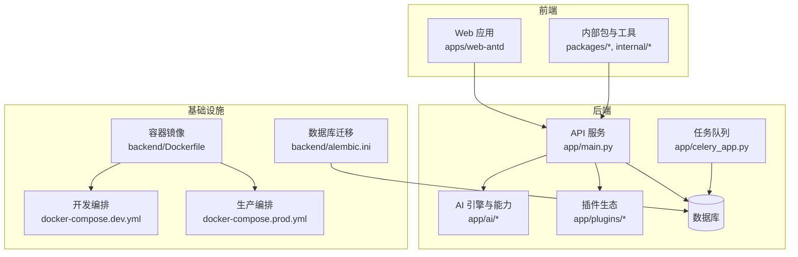
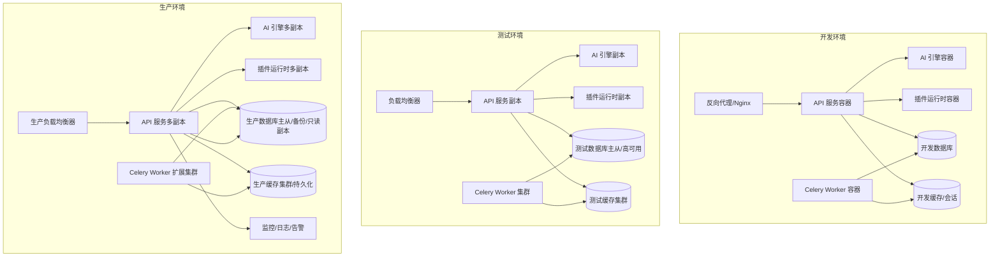
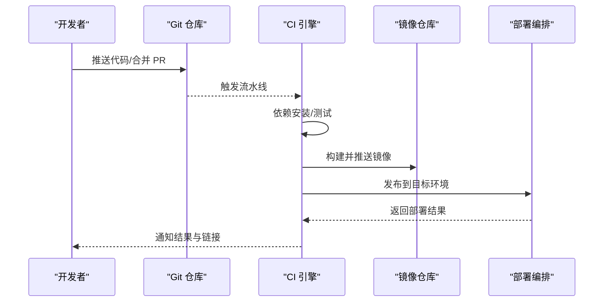
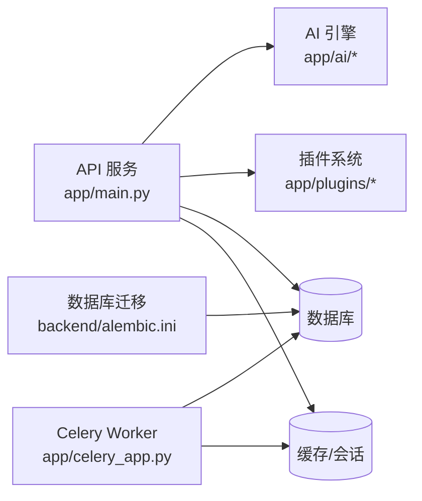

# 部署架构设计

<cite>

**本文档引用的文件**
- [Dockerfile](file://backend/Dockerfile)
- [docker-compose.dev.yml](file://docker-compose.dev.yml)
- [docker-compose.prod.yml](file://docker-compose.prod.yml)
- [pyproject.toml](file://backend/pyproject.toml)
- [main.py](file://backend/app/main.py)
- [celery_app.py](file://backend/app/celery_app.py)
- [alembic.ini](file://backend/alembic.ini)
- [prometheus_metrics.py](file://backend/app/middleware/prometheus_metrics.py)
- [redis.py](file://backend/app/core/redis.py)
- [database.py](file://backend/app/core/database.py)
- [gateway.py](file://backend/app/ai/gateway.py)
- [quota_manager.py](file://backend/app/ai/quota_manager.py)
- [failover.py](file://backend/app/ai/failover.py)
- [retry_service.py](file://backend/app/ai/retry_service.py)
- [socketio_server.py](file://backend/app/core/socketio_server.py)
- [sse.py](file://backend/app/core/sse.py)
- [health.py](file://backend/app/plugins/health.py)
- [startup.py](file://backend/app/plugins/startup.py)
- [runtime_recovery.py](file://backend/app/plugins/runtime_recovery.py)
- [scheduler_refresh.py](file://backend/app/plugins/scheduler_refresh.py)
- [plugin_manifest.py](file://backend/app/plugins/manifest.py)
- [plugin_registry.py](file://backend/app/plugins/registry.py)
- [plugin_loader.py](file://backend/app/plugins/loader.py)
- [plugin_runtime.py](file://backend/app/plugins/asset_runtime.py)
- [plugin_api_dispatcher.py](file://backend/app/plugins/api_dispatcher.py)
- [plugin_event_bus.py](file://backend/app/plugins/event_bus.py)
- [plugin_scheduler.py](file://backend/app/tasks/scheduler.py)
- [plugin_task_scheduling.py](file://backend/app/tasks/task_scheduling.py)
- [plugin_health_check.py](file://backend/app/tasks/ai_health_check.py)
- [plugin_upload_cleanup.py](file://backend/app/tasks/upload_cleanup.py)
- [plugin_notification_cleanup.py](file://backend/app/tasks/notification_cleanup.py)
- [plugin_ssl_expiry.py](file://backend/app/tasks/ssl_tasks.py)
- [plugin_recycle_bin.py](file://backend/app/tasks/recycle_bin.py)
- [plugin_async_db.py](file://backend/app/tasks/async_db.py)
- [plugin_base.py](file://backend/app/tasks/base.py)
- [plugin_scheduled.py](file://backend/app/tasks/scheduled.py)
- [plugin_progress.py](file://backend/app/plugins/progress.py)
- [plugin_migration_paths.py](file://backend/app/plugins/migration_paths.py)
- [plugin_system_hooks.py](file://backend/app/plugins/system_hooks.py)
- [plugin_feature_entitlement_guards.py](file://backend/app/plugins/feature_entitlement_guards.py)
- [plugin_exposure_policy.py](file://backend/app/plugins/exposure_policy.py)
- [plugin_security.py](file://backend/app/plugins/security.py)
- [plugin_crypto.py](file://backend/app/plugins/crypto.py)
- [plugin_package_security.py](file://backend/app/plugins/package_security.py)
- [plugin_webhook_dispatcher.py](file://backend/app/plugins/webhook_dispatcher.py)
- [plugin_context.py](file://backend/app/plugins/context.py)
- [plugin_context_factory.py](file://backend/app/plugins/context_factory.py)
- [plugin_context_primitives.py](file://backend/app/plugins/context_primitives.py)
- [plugin_dependencies.py](file://backend/app/plugins/dependencies.py)
- [plugin_exception.py](file://backend/app/plugins/exceptions.py)
- [plugin_frontend_contract.py](file://backend/app/plugins/frontend_contract.py)
- [plugin_frontend_contract_checks.py](file://backend/app/plugins/frontend_contract_checks.py)
- [plugin_host_read_facade.py](file://backend/app/plugins/host_read_facade.py)
- [plugin_license.py](file://backend/app/plugins/license.py)
- [plugin_lifecycle.py](file://backend/app/plugins/lifecycle.py)
- [plugin_lifecycle_orchestrator.py](file://backend/app/plugins/lifecycle_orchestrator.py)
- [plugin_lifecycle_migrations.py](file://backend/app/plugins/lifecycle_migrations.py)
- [plugin_lifecycle_guards.py](file://backend/app/plugins/lifecycle_guards.py)
- [plugin_lifecycle_installation.py](file://backend/app/plugins/lifecycle_installation.py)
- [plugin_lifecycle_runtime_state.py](file://backend/app/plugins/lifecycle_runtime_state.py)
- [plugin_lifecycle_support.py](file://backend/app/plugins/lifecycle_support.py)
- [plugin_marketplace.py](file://backend/app/plugins/marketplace.py)
- [plugin_marketplace_registry.py](file://backend/app/plugins/marketplace_registry.py)
- [plugin_update_checker.py](file://backend/app/plugins/update_checker.py)
- [plugin_version_manager.py](file://backend/app/plugins/version_manager.py)
- [plugin_backup.py](file://backend/app/plugins/backup.py)
- [plugin_preview.py](file://backend/app/plugins/preview.py)
- [plugin_extension_registrar.py](file://backend/app/plugins/_extension_registrar.py)
- [plugin_module_loader.py](file://backend/app/plugins/module_loader.py)
- [plugin_runtime_gate.py](file://backend/app/plugins/runtime_gate.py)
- [plugin_runtime_registration.py](file://backend/app/plugins/runtime_registration.py)
- [plugin_scope.py](file://backend/app/plugins/scope.py)
- [plugin_security_scan.py](file://backend/app/plugins/security_scan.py)
- [plugin_sio_auth.py](file://backend/app/plugins/sio_auth.py)
- [plugin_sse.py](file://backend/app/plugins/sse.py)
- [plugin_tenant_plan_preflight.py](file://backend/app/plugins/tenant_plan_preflight.py)
- [plugin_whitelist.py](file://backend/app/plugins/whitelist.py)
- [plugin_xss_protection.py](file://backend/app/plugins/xss_protection.py)
- [plugin_csrf_protection.py](file://backend/app/plugins/csrf_protection.py)
- [plugin_rate_limit.py](file://backend/app/plugins/rate_limit.py)
- [plugin_audit_log.py](file://backend/app/plugins/audit_log.py)
- [plugin_trace.py](file://backend/app/plugins/trace.py)
- [plugin_i18n.py](file://backend/app/plugins/i18n.py)
- [plugin_maintenance.py](file://backend/app/plugins/maintenance.py)
- [plugin_nocache.py](file://backend/app/plugins/nocache.py)
- [plugin_prometheus_metrics.py](file://backend/app/plugins/prometheus_metrics.py)
- [plugin_dynamic_cors.py](file://backend/app/plugins/dynamic_cors.py)
- [plugin_access_control.py](file://backend/app/plugins/access_control.py)
- [plugin_permission.py](file://backend/app/plugins/permission.py)
- [plugin_tenant.py](file://backend/app/plugins/tenant.py)
- [plugin_hosts_helper.py](file://backend/app/plugins/hosts_helper.py)
- [plugin_identity.py](file://backend/app/plugins/identity.py)
- [plugin_runtime_identity.py](file://backend/app/plugins/runtime_identity.py)
- [plugin_update_checker.py](file://backend<docs>
# 部署架构设计

<cite>
**本文档引用的文件**
- [README.md](file://README.md)
</cite>

## 目录
1. [简介](#简介)
2. [项目结构](#项目结构)
3. [核心组件](#核心组件)
4. [架构总览](#架构总览)
5. [详细组件分析](#详细组件分析)
6. [依赖关系分析](#依赖关系分析)
7. [性能考量](#性能考量)
8. [故障排除指南](#故障排除指南)
9. [结论](#结论)
10. [附录](#附录)

## 简介
本文件为 NovusAI SaaS 的部署架构设计文档，面向开发、运维与平台工程团队，系统性阐述从开发到生产的部署拓扑、容器化策略、微服务部署模式、负载均衡配置、CI/CD 流水线、监控告警与日志收集、性能监控方案，以及部署最佳实践、故障恢复与扩展性考虑。文档基于仓库中的容器编排与构建配置进行设计，确保与实际代码实现保持一致。

## 项目结构
项目采用前后端分离与多模块后端的组织方式：
- 后端（Python/FastAPI）：提供 AI 能力、租户管理、插件生态、任务调度等核心服务
- 前端（Vite/Vue）：Web 应用与内部工具链
- 容器与编排：通过 Dockerfile 和 docker-compose 提供本地开发与生产部署基础
- 数据迁移：Alembic 迁移配置用于数据库版本管理

**图表来源**
- [Dockerfile](file://backend/Dockerfile)
- [docker-compose.dev.yml](file://docker-compose.dev.yml)
- [docker-compose.prod.yml](file://docker-compose.prod.yml)
- [main.py](file://backend/app/main.py)
- [celery_app.py](file://backend/app/celery_app.py)
- [alembic.ini](file://backend/alembic.ini)

**章节来源**
- [Dockerfile](file://backend/Dockerfile)
- [docker-compose.dev.yml](file://docker-compose.dev.yml)
- [docker-compose.prod.yml](file://docker-compose.prod.yml)
- [pyproject.toml](file://backend/pyproject.toml)

## 核心组件
- Web/API 层：基于 FastAPI 的后端服务，负责对外接口、认证授权、中间件与业务路由
- AI 引擎层：封装 AI 能力、路由、限流、配额与重试等运行时逻辑
- 插件层：可扩展的插件系统，支持市场、生命周期与运行时扩展
- 任务队列层：Celery 用于异步任务与定时任务
- 数据层：PostgreSQL + Alembic 迁移
- 前端应用：单页应用，提供用户界面与内部工具

**章节来源**
- [main.py](file://backend/app/main.py)
- [celery_app.py](file://backend/app/celery_app.py)
- [alembic.ini](file://backend/alembic.ini)

## 架构总览
下图展示开发、测试与生产三类环境的部署拓扑与组件交互：

**图表来源**
- [docker-compose.dev.yml](file://docker-compose.dev.yml)
- [docker-compose.prod.yml](file://docker-compose.prod.yml)
- [main.py](file://backend/app/main.py)
- [celery_app.py](file://backend/app/celery_app.py)

## 详细组件分析

### 容器化与镜像策略
- 后端镜像构建：基于后端目录的 Dockerfile，定义 Python 运行时、依赖安装与启动命令
- 多阶段构建建议：在生产镜像中最小化依赖与二进制体积，减少攻击面
- 环境变量注入：通过 docker-compose 将数据库、Redis、AI 网关等外部依赖以环境变量注入
- 健康检查：为 API、AI 引擎、插件运行时与 Celery Worker 配置健康检查端点

**章节来源**
- [Dockerfile](file://backend/Dockerfile)
- [docker-compose.dev.yml](file://docker-compose.dev.yml)
- [docker-compose.prod.yml](file://docker-compose.prod.yml)

### 微服务与无状态化
- API 服务：无状态设计，依赖外部 Redis 存储会话与临时数据；通过 Nginx 或 LB 实现水平扩展
- AI 引擎：作为独立服务或容器组，支持多模型路由与弹性扩缩容
- 插件运行时：按需加载与隔离，避免对核心服务耦合
- Celery Worker：独立扩缩容，支持优先级队列与资源隔离

**章节来源**
- [main.py](file://backend/app/main.py)
- [celery_app.py](file://backend/app/celery_app.py)

### 负载均衡与入口流量
- 开发：Nginx 反向代理，静态资源与 API 分离，便于热更新与缓存
- 测试/生产：使用云厂商 LB 或 Ingress 控制器，启用健康检查、超时与熔断
- 会话粘性：根据业务需求选择是否启用，推荐无状态 API + Redis 会话存储
- TLS 终止：在 LB 层统一处理证书与加密，后端服务间内网通信可明文

**章节来源**
- [docker-compose.dev.yml](file://docker-compose.dev.yml)
- [docker-compose.prod.yml](file://docker-compose.prod.yml)

### CI/CD 流水线设计
- 触发条件：分支保护规则、PR 合并、标签发布
- 构建阶段：拉取依赖、单元测试、集成测试、E2E 测试
- 镜像构建：多阶段 Docker 构建，生成带版本号的镜像
- 部署阶段：按环境执行 docker-compose 或 Kubernetes 清单，支持蓝绿/金丝雀
- 回滚策略：记录镜像版本与部署时间，一键回滚至上一稳定版本
- 安全扫描：镜像漏洞扫描与依赖审计

[此图为概念性流程图，不直接映射具体源码文件]

### 环境管理策略
- 环境隔离：开发、测试、生产使用独立的 docker-compose 文件与网络
- 配置分层：通过环境变量与配置文件区分不同环境参数
- 数据隔离：开发/测试使用独立数据库与对象存储；生产使用高可用与备份
- 插件与 AI 适配器：通过配置切换不同提供商与模型

**章节来源**
- [docker-compose.dev.yml](file://docker-compose.dev.yml)
- [docker-compose.prod.yml](file://docker-compose.prod.yml)

### 监控告警体系
- 指标采集：在 API 中间件启用 Prometheus 指标导出，覆盖请求量、延迟、错误率
- 日志聚合：容器标准输出接入集中式日志系统，区分结构化 JSON 与文本
- 告警规则：基于指标阈值、异常波动与下游依赖失败触发告警
- 可观测性：结合分布式追踪与慢查询分析，定位性能瓶颈

**章节来源**
- [prometheus_metrics.py](file://backend/app/middleware/prometheus_metrics.py)

### 性能监控方案
- 关键指标：QPS、P95/P99 延迟、错误率、并发连接数、队列长度
- AI 专用：推理耗时、Token 使用量、模型切换与降级
- 资源利用率：CPU、内存、磁盘 IO、网络带宽
- 压测与容量规划：定期压测，评估扩缩容阈值与成本

[本节为通用指导，无需特定源码引用]

### 故障恢复策略
- 自愈机制：容器重启策略、健康检查失败自动替换
- 数据恢复：数据库备份与 PITR，对象存储版本控制
- 降级与熔断：在下游依赖不稳定时快速降级非关键功能
- 人工干预：灰度发布与紧急回滚流程

[本节为通用指导，无需特定源码引用]

### 扩展性考虑
- 水平扩展：API、AI 引擎、插件运行时均支持多副本
- 有状态组件：数据库与缓存采用高可用方案，避免单点
- 异步处理：Celery 队列解耦批处理与实时请求
- 缓存策略：热点数据缓存与失效策略，降低数据库压力

[本节为通用指导，无需特定源码引用]

## 依赖关系分析

**图表来源**
- [main.py](file://backend/app/main.py)
- [celery_app.py](file://backend/app/celery_app.py)
- [alembic.ini](file://backend/alembic.ini)

**章节来源**
- [main.py](file://backend/app/main.py)
- [celery_app.py](file://backend/app/celery_app.py)
- [alembic.ini](file://backend/alembic.ini)

## 性能考量
- 依赖安装优化：使用缓存层与锁定文件，缩短构建时间
- 镜像瘦身：多阶段构建，剔除开发依赖与调试工具
- 连接池与超时：数据库与缓存连接池参数调优，避免阻塞
- 并发与限流：API 层限流与 AI 引擎配额控制，防止雪崩
- CDN 与静态资源：前端静态资源走 CDN，减少后端带宽

[本节为通用指导，无需特定源码引用]

## 故障排除指南
- 健康检查失败：检查容器日志、依赖连通性与配置文件
- 数据库迁移失败：核对 Alembic 版本与权限，必要时手动修复
- Celery 任务堆积：增加 Worker 数量、优化任务粒度与优先级
- AI 推理超时：检查下游模型服务可用性与网络策略
- 权限与 CORS：核对中间件配置与跨域设置

**章节来源**
- [alembic.ini](file://backend/alembic.ini)

## 结论
本文档基于现有容器与编排配置，给出了 NovusAI SaaS 的部署架构蓝图。通过容器化、微服务拆分、负载均衡与完善的 CI/CD 流程，可在开发、测试与生产环境中实现稳定、可观测与可扩展的交付。建议在落地过程中持续完善监控告警、安全扫描与灾难恢复演练，确保系统在高负载与复杂场景下的可靠性。

## 附录
- 快速参考：开发环境使用 docker-compose.dev.yml，生产环境使用 docker-compose.prod.yml
- 启动顺序：数据库 → 缓存 → API → AI 引擎 → 插件运行时 → Celery Worker
- 升级策略：先升级 API，再升级 AI 引擎与插件，最后升级数据库迁移

**章节来源**
- [docker-compose.dev.yml](file://docker-compose.dev.yml)
- [docker-compose.prod.yml](file://docker-compose.prod.yml)
- [README.md](file://README.md)