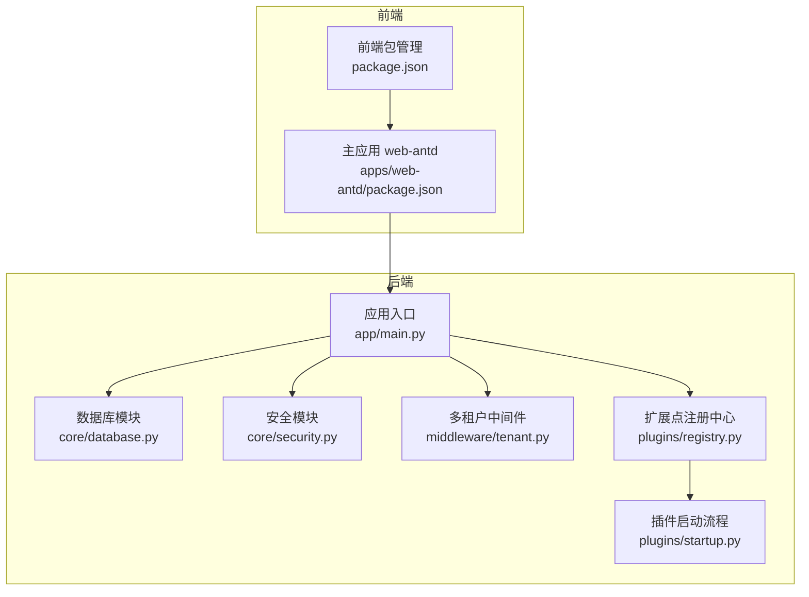
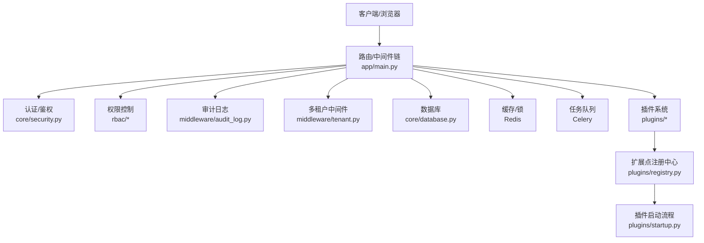
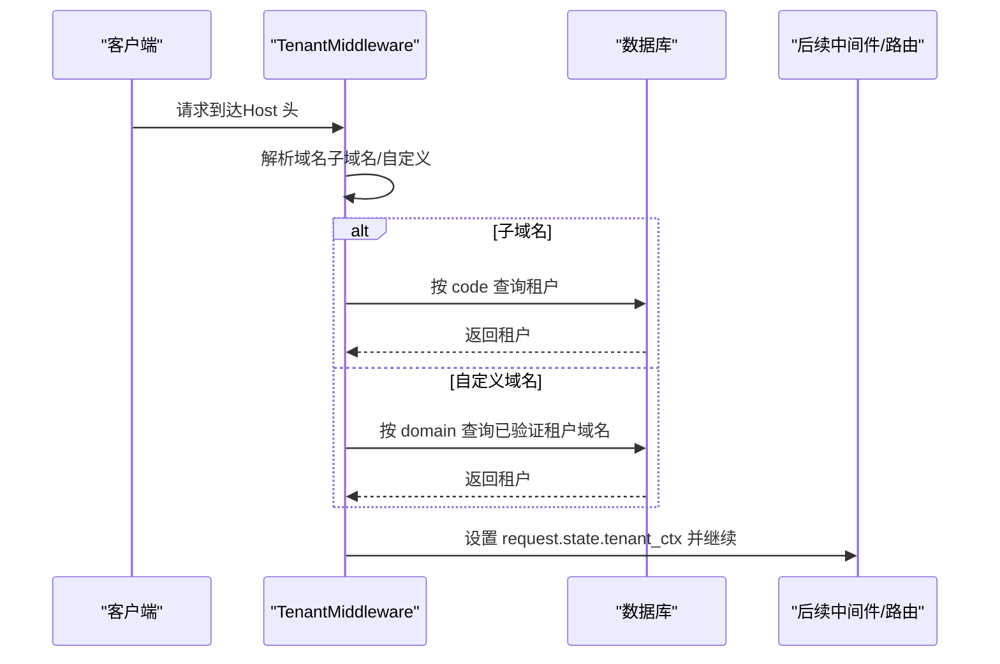
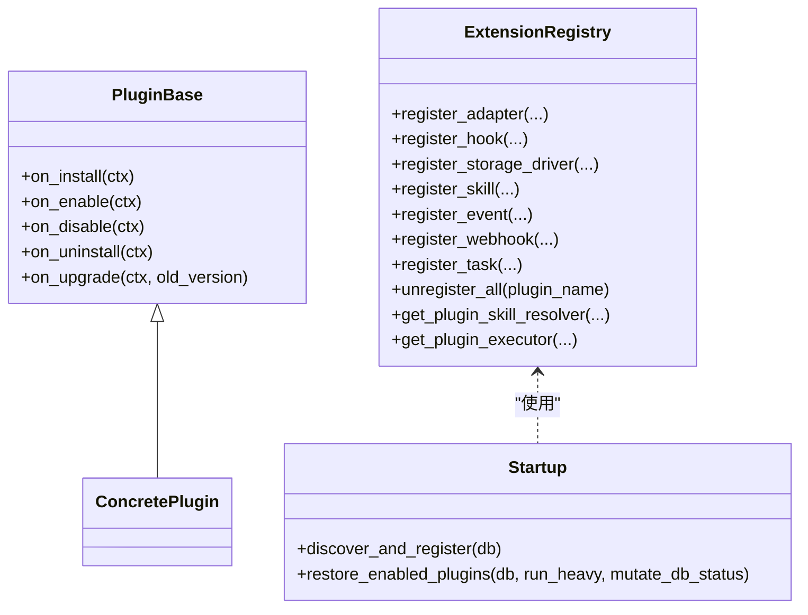
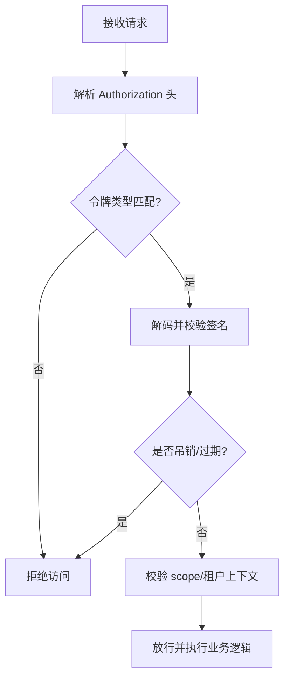
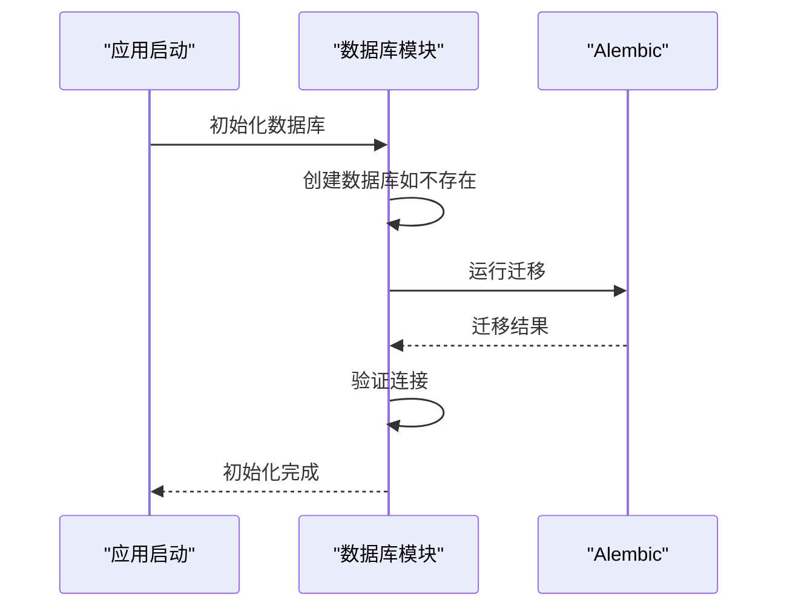
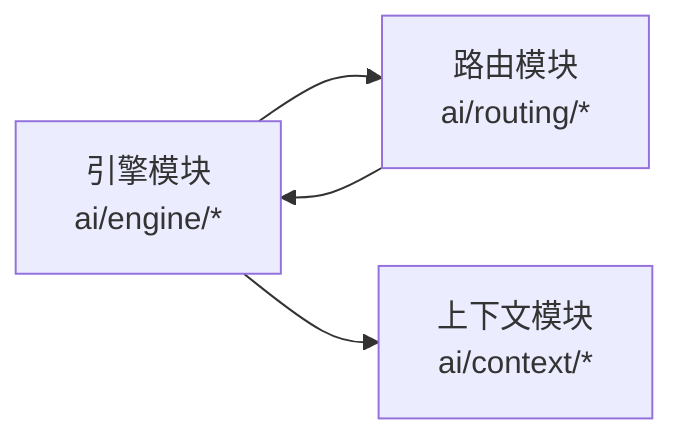
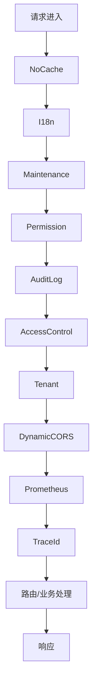
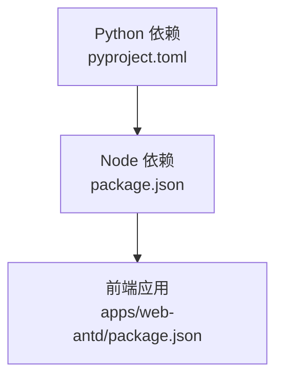

# 架构设计

<cite>
**本文档引用的文件**
- [backend/README.md](file://backend/README.md)
- [frontend/README.md](file://frontend/README.md)
- [backend/pyproject.toml](file://backend/pyproject.toml)
- [frontend/package.json](file://frontend/package.json)
- [frontend/apps/web-antd/package.json](file://frontend/apps/web-antd/package.json)
- [backend/app/main.py](file://backend/app/main.py)
- [backend/app/plugins/base.py](file://backend/app/plugins/base.py)
- [backend/app/plugins/registry.py](file://backend/app/plugins/registry.py)
- [backend/app/core/database.py](file://backend/app/core/database.py)
- [backend/app/core/security.py](file://backend/app/core/security.py)
- [backend/app/middleware/tenant.py](file://backend/app/middleware/tenant.py)
- [backend/app/ai/engine/__init__.py](file://backend/app/ai/engine/__init__.py)
- [backend/app/ai/routing/__init__.py](file://backend/app/ai/routing/__init__.py)
- [backend/app/ai/context/__init__.py](file://backend/app/ai/context/__init__.py)
- [backend/app/plugins/startup.py](file://backend/app/plugins/startup.py)
</cite>

## 目录
1. [引言](#引言)
2. [项目结构](#项目结构)
3. [核心组件](#核心组件)
4. [架构总览](#架构总览)
5. [详细组件分析](#详细组件分析)
6. [依赖分析](#依赖分析)
7. [性能考量](#性能考量)
8. [故障排查指南](#故障排查指南)
9. [结论](#结论)
10. [附录](#附录)

## 引言
本架构设计文档面向 NovusAI SaaS 产品，系统性阐述其高层设计、架构模式与系统边界。文档重点覆盖：
- 前后端分离架构：后端采用 FastAPI，前端基于 Vben Admin 的工作区组织；
- 多租户架构：通过中间件解析租户上下文，支持子域名与自定义域名两种模式；
- 插件化架构：通过扩展点注册中心与生命周期管理实现插件的自动发现、安装、启用、禁用、卸载与升级；
- 组件交互与数据流：中间件链路、认证鉴权、数据库与缓存、任务队列、实时通信与插件扩展；
- 安全性、可观测性与灾备：JWT 令牌、访问控制、审计日志、Prometheus 指标、就绪/健康探针；
- 基础设施与可扩展性：容器化与编排、数据库连接池、Redis、消息队列、存储驱动；
- 技术栈与第三方依赖：Python/FastAPI 生态、PostgreSQL/Redis/Celery、前端 Vite/Vue 生态。

## 项目结构
项目采用前后端分离的 Monorepo 结构：
- 后端 backend：Python/FastAPI 应用，包含 AI 能力、插件系统、多租户、安全、中间件、数据库与迁移、任务调度等模块；
- 前端 frontend：Vite/Vue 工作区，包含主应用 web-antd 与 playground，使用 Ant Design Vue 作为 UI 基座；
- 插件 plugins：独立的插件目录，每个插件包含自身后端迁移、前端资源与清单文件，由后端插件系统自动发现与注册。

图表来源
- [backend/app/main.py:635-800](file://backend/app/main.py#L635-L800)
- [backend/app/core/database.py:65-120](file://backend/app/core/database.py#L65-L120)
- [backend/app/core/security.py:38-116](file://backend/app/core/security.py#L38-L116)
- [backend/app/middleware/tenant.py:93-165](file://backend/app/middleware/tenant.py#L93-L165)
- [backend/app/plugins/registry.py:172-240](file://backend/app/plugins/registry.py#L172-L240)
- [backend/app/plugins/startup.py:125-170](file://backend/app/plugins/startup.py#L125-L170)

章节来源
- [backend/README.md:1-18](file://backend/README.md#L1-L18)
- [frontend/README.md:1-46](file://frontend/README.md#L1-L46)
- [backend/pyproject.toml:1-110](file://backend/pyproject.toml#L1-L110)
- [frontend/package.json:1-127](file://frontend/package.json#L1-L127)
- [frontend/apps/web-antd/package.json:1-101](file://frontend/apps/web-antd/package.json#L1-L101)

## 核心组件
- 应用入口与生命周期：FastAPI 应用创建、中间件注册、异常处理、就绪/健康探针、数据库与 Redis 初始化、插件自动发现与恢复；
- 多租户中间件：从 Host 头解析租户上下文，支持子域名与自定义域名；
- 安全模块：JWT 令牌签发与校验、密码哈希、吊销黑名单、加密解密；
- 数据库与迁移：异步 SQLAlchemy 引擎、连接池、依赖注入、Alembic 迁移、启动时初始化；
- 插件系统：插件抽象基类、扩展点注册中心、插件生命周期与启动恢复流程；
- AI 引擎与路由：多模式执行引擎、复杂度分类与模型路由、上下文装配与修剪；
- 前后端交互：前端通过 API 基础地址访问后端，WebSocket 支持实时通信。

章节来源
- [backend/app/main.py:53-120](file://backend/app/main.py#L53-L120)
- [backend/app/middleware/tenant.py:23-50](file://backend/app/middleware/tenant.py#L23-L50)
- [backend/app/core/security.py:38-116](file://backend/app/core/security.py#L38-L116)
- [backend/app/core/database.py:65-120](file://backend/app/core/database.py#L65-L120)
- [backend/app/plugins/base.py:19-45](file://backend/app/plugins/base.py#L19-L45)
- [backend/app/plugins/registry.py:172-240](file://backend/app/plugins/registry.py#L172-L240)
- [backend/app/plugins/startup.py:125-170](file://backend/app/plugins/startup.py#L125-L170)
- [backend/app/ai/engine/__init__.py:28-66](file://backend/app/ai/engine/__init__.py#L28-L66)
- [backend/app/ai/routing/__init__.py:8-16](file://backend/app/ai/routing/__init__.py#L8-L16)
- [backend/app/ai/context/__init__.py:29-47](file://backend/app/ai/context/__init__.py#L29-L47)

## 架构总览
系统采用“前后端分离 + 多租户 + 插件化”的整体架构。前端通过 HTTP/WebSocket 与后端交互，后端通过中间件链路处理请求，结合认证鉴权、RBAC、审计日志与多租户上下文，最终访问数据库与外部 AI 服务。插件系统贯穿后端运行时，通过扩展点注册中心动态桥接适配器、钩子、存储驱动、技能、事件、Webhook、任务与前端插槽等能力。

图表来源
- [backend/app/main.py:635-800](file://backend/app/main.py#L635-L800)
- [backend/app/core/security.py:179-273](file://backend/app/core/security.py#L179-L273)
- [backend/app/middleware/tenant.py:93-165](file://backend/app/middleware/tenant.py#L93-L165)
- [backend/app/core/database.py:65-120](file://backend/app/core/database.py#L65-L120)
- [backend/app/plugins/registry.py:172-240](file://backend/app/plugins/registry.py#L172-L240)
- [backend/app/plugins/startup.py:417-475](file://backend/app/plugins/startup.py#L417-L475)

## 详细组件分析

### 多租户架构
多租户通过中间件在请求进入时解析租户上下文，支持两种域名模式：
- 子域名模式：{tenant_code}.app.novusai.com，直接按 code 查询；
- 自定义域名模式：通过 tenant_domains 表验证并关联租户。

图表来源
- [backend/app/middleware/tenant.py:120-165](file://backend/app/middleware/tenant.py#L120-L165)
- [backend/app/middleware/tenant.py:166-223](file://backend/app/middleware/tenant.py#L166-L223)

章节来源
- [backend/app/middleware/tenant.py:52-91](file://backend/app/middleware/tenant.py#L52-L91)
- [backend/app/middleware/tenant.py:225-250](file://backend/app/middleware/tenant.py#L225-L250)

### 插件化架构
插件系统通过抽象基类与扩展点注册中心实现生命周期管理与运行时扩展：
- 插件基类：on_install/on_enable/on_disable/on_uninstall/on_upgrade；
- 扩展点注册中心：桥接适配器、钩子、存储驱动、技能、事件、Webhook、任务、通知、权限、SocketIO、前端插槽、消费者、中间件、自定义扩展与菜单；
- 启动流程：自动发现与注册、恢复已启用插件（含任务同步、权限恢复、扩展点注册）。

图表来源
- [backend/app/plugins/base.py:19-45](file://backend/app/plugins/base.py#L19-L45)
- [backend/app/plugins/registry.py:172-240](file://backend/app/plugins/registry.py#L172-L240)
- [backend/app/plugins/startup.py:125-170](file://backend/app/plugins/startup.py#L125-L170)

章节来源
- [backend/app/plugins/base.py:19-45](file://backend/app/plugins/base.py#L19-L45)
- [backend/app/plugins/registry.py:308-424](file://backend/app/plugins/registry.py#L308-L424)
- [backend/app/plugins/startup.py:417-475](file://backend/app/plugins/startup.py#L417-L475)

### 安全与认证
安全模块提供 JWT 令牌生成/验证、密码哈希、吊销黑名单、加密解密与一键登录临时令牌：
- 访问令牌与刷新令牌签发，支持作用域与额外声明；
- Token 黑名单与 Redis TTL 控制；
- Impersonate Token 支持平台/企业管理员一键登录；
- 密码哈希使用 bcrypt，敏感数据使用 Fernet 对称加密。

图表来源
- [backend/app/core/security.py:179-273](file://backend/app/core/security.py#L179-L273)

章节来源
- [backend/app/core/security.py:38-116](file://backend/app/core/security.py#L38-L116)
- [backend/app/core/security.py:127-177](file://backend/app/core/security.py#L127-L177)
- [backend/app/core/security.py:359-429](file://backend/app/core/security.py#L359-L429)

### 数据库与迁移
数据库模块提供异步引擎与连接池、依赖注入、连接检查、数据库创建与 Alembic 迁移：
- 异步 SQLAlchemy 引擎与会话工厂；
- 启动时创建数据库、运行迁移、验证连接；
- 迁移过程中处理重叠 stamp、跳过子进程等优化；
- Celery fork 子进程后重建连接池。

图表来源
- [backend/app/core/database.py:608-654](file://backend/app/core/database.py#L608-L654)
- [backend/app/core/database.py:433-606](file://backend/app/core/database.py#L433-L606)

章节来源
- [backend/app/core/database.py:65-120](file://backend/app/core/database.py#L65-L120)
- [backend/app/core/database.py:218-234](file://backend/app/core/database.py#L218-L234)
- [backend/app/core/database.py:236-282](file://backend/app/core/database.py#L236-L282)
- [backend/app/core/database.py:433-606](file://backend/app/core/database.py#L433-L606)

### AI 引擎与路由
AI 引擎模块提供多模式执行引擎与统一分发器，路由模块提供复杂度分类与模型路由，上下文模块提供上下文装配与修剪：
- 引擎：BaseEngine、ConversationEngine、TaskEngine、BatchEngine；
- 路由：ComplexityClassifier、ModelRouter；
- 上下文：ContextAssembly、ContextEngine、TransientPruner。

图表来源
- [backend/app/ai/engine/__init__.py:28-66](file://backend/app/ai/engine/__init__.py#L28-L66)
- [backend/app/ai/routing/__init__.py:8-16](file://backend/app/ai/routing/__init__.py#L8-L16)
- [backend/app/ai/context/__init__.py:29-47](file://backend/app/ai/context/__init__.py#L29-L47)

章节来源
- [backend/app/ai/engine/__init__.py:28-66](file://backend/app/ai/engine/__init__.py#L28-L66)
- [backend/app/ai/routing/__init__.py:8-16](file://backend/app/ai/routing/__init__.py#L8-L16)
- [backend/app/ai/context/__init__.py:29-47](file://backend/app/ai/context/__init__.py#L29-L47)

### 中间件链与异常处理
应用入口集中注册中间件与异常处理器，形成完整的请求处理链：
- 中间件顺序：NoCache、I18n、Maintenance、Permission、AuditLog、AccessControl、Tenant、DynamicCORS、Prometheus、TraceId；
- 异常处理：AppException、RequestValidationError、StarletteHTTPException、全局异常；
- 就绪/健康探针：数据库与 Redis 健康检查。

图表来源
- [backend/app/main.py:650-702](file://backend/app/main.py#L650-L702)
- [backend/app/main.py:715-799](file://backend/app/main.py#L715-L799)
- [backend/app/main.py:596-633](file://backend/app/main.py#L596-L633)

章节来源
- [backend/app/main.py:635-800](file://backend/app/main.py#L635-L800)
- [backend/app/main.py:596-633](file://backend/app/main.py#L596-L633)

## 依赖分析
后端与前端的关键依赖与版本约束：
- 后端（Python/FastAPI）：FastAPI、SQLAlchemy、asyncpg、alembic、redis、celery、pydantic、httpx、openai、pgvector、socketio、prometheus-client、bcrypt、captcha 等；
- 前端（Vite/Vue）：Vue 3、Ant Design Vue、Socket.IO 客户端、Pinia、Axios、Playwright、TailwindCSS 等；
- Node.js 与 pnpm 版本要求：Node >= 20.19.0，pnpm >= 10.0.0。

图表来源
- [backend/pyproject.toml:23-110](file://backend/pyproject.toml#L23-L110)
- [frontend/package.json:110-114](file://frontend/package.json#L110-L114)
- [frontend/apps/web-antd/package.json:17-34](file://frontend/apps/web-antd/package.json#L17-L34)

章节来源
- [backend/pyproject.toml:23-110](file://backend/pyproject.toml#L23-L110)
- [frontend/package.json:110-114](file://frontend/package.json#L110-L114)
- [frontend/apps/web-antd/package.json:17-34](file://frontend/apps/web-antd/package.json#L17-L34)

## 性能考量
- 数据库连接池：通过异步引擎与连接池参数控制并发与超时，减少连接争用；
- Redis：用于分布式锁与令牌黑名单，建议独立部署并开启持久化；
- Celery：异步任务队列，建议与 Redis/Broker 分离部署，合理划分队列；
- 中间件链：按需启用，避免不必要的处理开销；
- 插件启动：分布式锁保护自动发现与恢复，避免多 Worker 并发竞争；
- Prometheus 指标：主动刷新组件健康，降低探针副作用。

## 故障排查指南
- 数据库连接失败：检查 PostgreSQL 服务状态与连接参数，查看启动日志中的引导提示；
- Redis 初始化失败：确认 Redis 可达性与权限，必要时调整连接参数；
- 插件启动失败：查看插件错误消息与计数，使用修复按钮清理错误状态；
- 认证失败：核对 SECRET_KEY、算法与签名，检查 Token 是否吊销；
- 就绪/健康探针：检查数据库与 Redis 健康状态，定位依赖组件问题。

章节来源
- [backend/app/core/database.py:166-216](file://backend/app/core/database.py#L166-L216)
- [backend/app/main.py:505-594](file://backend/app/main.py#L505-L594)
- [backend/app/plugins/startup.py:638-677](file://backend/app/plugins/startup.py#L638-L677)
- [backend/app/core/security.py:127-177](file://backend/app/core/security.py#L127-L177)

## 结论
NovusAI SaaS 采用成熟的技术栈与清晰的架构分层，通过多租户中间件与插件化扩展实现了高可扩展性与可维护性。前后端分离与中间件链路保证了请求处理的一致性与可观测性。建议在生产环境中强化基础设施隔离、完善监控告警与灾备演练，并持续优化插件启动与扩展点注册的性能与稳定性。

## 附录
- 基础设施建议：数据库主从、Redis 集群、消息队列集群、对象存储网关、CDN 与 WAF；
- 部署拓扑：应用服务（多副本）、数据库（托管/主从）、缓存（托管/集群）、任务队列（托管/集群）、插件市场与资产存储；
- 安全加固：强制 HTTPS、最小权限、定期轮换密钥、审计日志保留与合规检查；
- 可观测性：Prometheus/Grafana、日志聚合、分布式追踪、告警策略与值班机制。