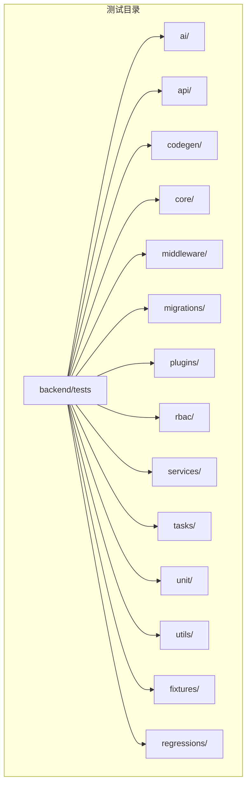
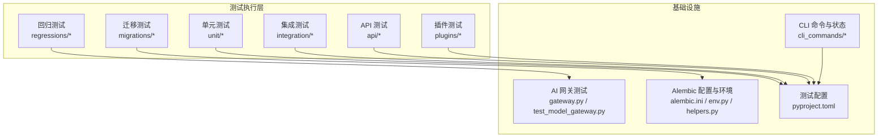
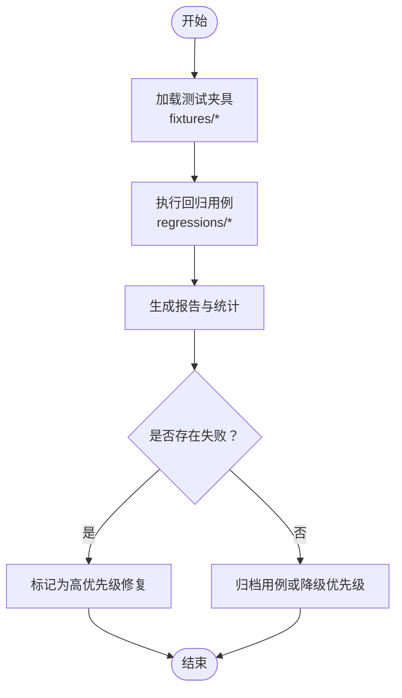
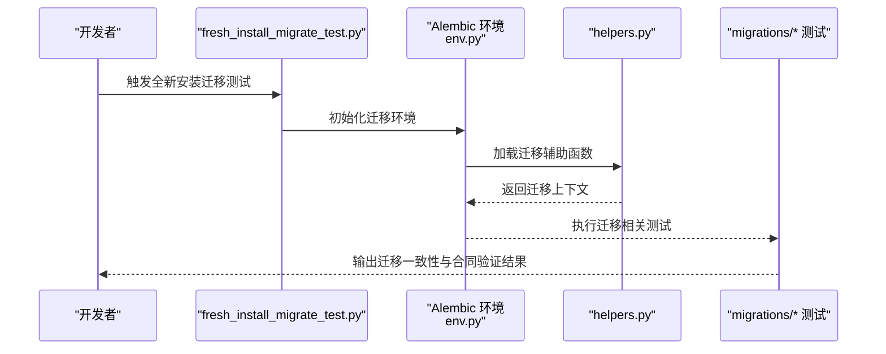
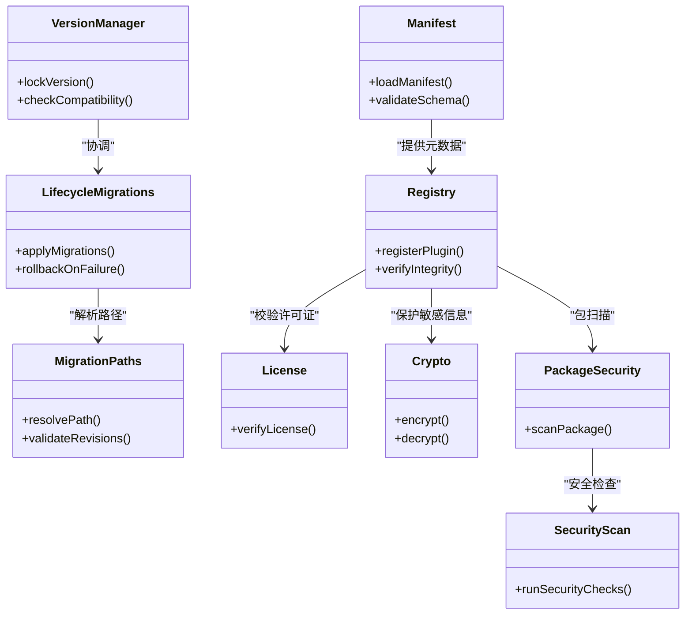
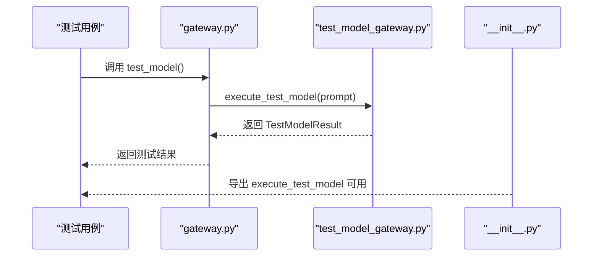
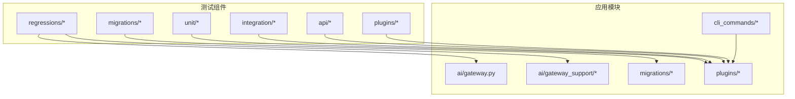

# 测试维护

<cite>
**本文引用的文件**
- [backend/app/ai/gateway.py](file://backend/app/ai/gateway.py)
- [backend/app/ai/gateway_support/test_model_gateway.py](file://backend/app/ai/gateway_support/test_model_gateway.py)
- [backend/app/ai/gateway_support/__init__.py](file://backend/app/ai/gateway_support/__init__.py)
- [backend/tests/regressions](file://backend/tests/regressions)
- [backend/tests/migrations](file://backend/tests/migrations)
- [backend/tests/unit](file://backend/tests/unit)
- [backend/tests/integration/ai/test_context_engine_capabilities.py](file://backend/tests/integration/ai/test_context_engine_capabilities.py)
- [backend/tests/fixtures/sample_plugin.yaml](file://backend/tests/fixtures/sample_plugin.yaml)
- [backend/scripts/fresh_install_migrate_test.py](file://backend/scripts/fresh_install_migrate_test.py)
- [backend/scripts/lint_migrations.py](file://backend/scripts/lint_migrations.py)
- [backend/pyproject.toml](file://backend/pyproject.toml)
- [backend/alembic.ini](file://backend/alembic.ini)
- [backend/migrations/env.py](file://backend/migrations/env.py)
- [backend/migrations/helpers.py](file://backend/migrations/helpers.py)
- [backend/app/cli_commands/entrypoint.py](file://backend/app/cli_commands/entrypoint.py)
- [backend/app/cli_commands/state.py](file://backend/app/cli_commands/state.py)
- [backend/app/plugins/version_manager.py](file://backend/app/plugins/version_manager.py)
- [backend/app/plugins/lifecycle_migrations.py](file://backend/app/plugins/lifecycle_migrations.py)
- [backend/app/plugins/migration_paths.py](file://backend/app/plugins/migration_paths.py)
- [backend/app/plugins/manifest.py](file://backend/app/plugins/manifest.py)
- [backend/app/plugins/registry.py](file://backend/app/plugins/registry.py)
- [backend/app/plugins/loader.py](file://backend/app/plugins/loader.py)
- [backend/app/plugins/system_hooks.py](file://backend/app/plugins/system_hooks.py)
- [backend/app/plugins/scheduler_refresh.py](file://backend/app/plugins/scheduler_refresh.py)
- [backend/app/plugins/runtime_recovery.py](file://backend/app/plugins/runtime_recovery.py)
- [backend/app/plugins/webhook_dispatcher.py](file://backend/app/plugins/webhook_dispatcher.py)
- [backend/app/plugins/asset_runtime.py](file://backend/app/plugins/asset_runtime.py)
- [backend/app/plugins/crypto.py](file://backend/app/plugins/crypto.py)
- [backend/app/plugins/license.py](file://backend/app/plugins/license.py)
- [backend/app/plugins/health.py](file://backend/app/plugins/health.py)
- [backend/app/plugins/event_bus.py](file://backend/app/plugins/event_bus.py)
- [backend/app/plugins/exposure_policy.py](file://backend/app/plugins/exposure_policy.py)
- [backend/app/plugins/feature_entitlement_guards.py](file://backend/app/plugins/feature_entitlement_guards.py)
- [backend/app/plugins/slot_access_filter.py](file://backend/app/plugins/slot_access_filter.py)
- [backend/app/plugins/update_checker.py](file://backend/app/plugins/update_checker.py)
- [backend/app/plugins/package_security.py](file://backend/app/plugins/package_security.py)
- [backend/app/plugins/security_scan.py](file://backend/app/plugins/security_scan.py)
- [backend/app/plugins/preview.py](file://backend/app/plugins/preview.py)
- [backend/app/plugins/progress.py](file://backend/app/plugins/progress.py)
- [backend/app/plugins/scope.py](file://backend/app/plugins/scope.py)
- [backend/app/plugins/security.py](file://backend/app/plugins/security.py)
- [backend/app/plugins/startup.py](file://backend/app/plugins/startup.py)
- [backend/app/plugins/tenant_plan_preflight.py](file://backend/app/plugins/tenant_plan_preflight.py)
- [backend/app/plugins/asset_resolver.py](file://backend/app/plugins/asset_resolver.py)
- [backend/app/plugins/context.py](file://backend/app/plugins/context.py)
- [backend/app/plugins/context_factory.py](file://backend/app/plugins/context_factory.py)
- [backend/app/plugins/context_primitives.py](file://backend/app/plugins/context_primitives.py)
- [backend/app/plugins/dependencies.py](file://backend/app/plugins/dependencies.py)
- [backend/app/plugins/exceptions.py](file://backend/app/plugins/exceptions.py)
- [backend/app/plugins/frontend_contract.py](file://backend/app/plugins/frontend_contract.py)
- [backend/app/plugins/frontend_contract_checks.py](file://backend/app/plugins/frontend_contract_checks.py)
- [backend/app/plugins/host_read_facade.py](file://backend/app/plugins/host_read_facade.py)
- [backend/app/plugins/lifecycle.py](file://backend/app/plugins/lifecycle.py)
- [backend/app/plugins/lifecycle_orchestrator.py](file://backend/app/plugins/lifecycle_orchestrator.py)
- [backend/app/plugins/lifecycle_orchestrator_maintenance.py](file://backend/app/plugins/lifecycle_orchestrator_maintenance.py)
- [backend/app/plugins/lifecycle_runtime_state.py](file://backend/app/plugins/lifecycle_runtime_state.py)
- [backend/app/plugins/lifecycle_support.py](file://backend/app/plugins/lifecycle_support.py)
- [backend/app/plugins/marketplace.py](file://backend/app/plugins/marketplace.py)
- [backend/app/plugins/marketplace_registry/registry.py](file://backend/app/plugins/marketplace_registry/registry.py)
- [backend/app/plugins/marketplace_registry/_extension_registrar.py](file://backend/app/plugins/marketplace_registry/_extension_registrar.py)
- [backend/app/plugins/marketplace_registry/api_dispatcher.py](file://backend/app/plugins/marketplace_registry/api_dispatcher.py)
- [backend/app/plugins/marketplace_registry/asset_resolver.py](file://backend/app/plugins/marketplace_registry/asset_resolver.py)
- [backend/app/plugins/marketplace_registry/asset_runtime.py](file://backend/app/plugins/marketplace_registry/asset_runtime.py)
- [backend/app/plugins/marketplace_registry/context.py](file://backend/app/plugins/marketplace_registry/context.py)
- [backend/app/plugins/marketplace_registry/context_factory.py](file://backend/app/plugins/marketplace_registry/context_factory.py)
- [backend/app/plugins/marketplace_registry/context_primitives.py](file://backend/app/plugins/marketplace_registry/context_primitives.py)
- [backend/app/plugins/marketplace_registry/crypto.py](file://backend/app/plugins/marketplace_registry/crypto.py)
- [backend/app/plugins/marketplace_registry/dependencies.py](file://backend/app/plugins/marketplace_registry/dependencies.py)
- [backend/app/plugins/marketplace_registry/event_bus.py](file://backend/app/plugins/marketplace_registry/event_bus.py)
- [backend/app/plugins/marketplace_registry/exposure_policy.py](file://backend/app/plugins/marketplace_registry/exposure_policy.py)
- [backend/app/plugins/marketplace_registry/feature_entitlement_guards.py](file://backend/app/plugins/marketplace_registry/feature_entitlement_guards.py)
- [backend/app/plugins/marketplace_registry/frontend_contract.py](file://backend/app/plugins/marketplace_registry/frontend_contract.py)
- [backend/app/plugins/marketplace_registry/frontend_contract_checks.py](file://backend/app/plugins/marketplace_registry/frontend_contract_checks.py)
- [backend/app/plugins/marketplace_registry/host_read_facade.py](file://backend/app/plugins/marketplace_registry/host_read_facade.py)
- [backend/app/plugins/marketplace_registry/license.py](file://backend/app/plugins/marketplace_registry/license.py)
- [backend/app/plugins/marketplace_registry/manifest.py](file://backend/app/plugins/marketplace_registry/manifest.py)
- [backend/app/plugins/marketplace_registry/slot_access_filter.py](file://backend/app/plugins/marketplace_registry/slot_access_filter.py)
- [backend/app/plugins/marketplace_registry/scheduler_refresh.py](file://backend/app/plugins/marketplace_registry/scheduler_refresh.py)
- [backend/app/plugins/marketplace_registry/system_hooks.py](file://backend/app/plugins/marketplace_registry/system_hooks.py)
- [backend/app/plugins/marketplace_registry/update_checker.py](file://backend/app/plugins/marketplace_registry/update_checker.py)
- [backend/app/plugins/marketplace_registry/webhook_dispatcher.py](file://backend/app/plugins/marketplace_registry/webhook_dispatcher.py)
</cite>

## 目录
1. [引言](#引言)
2. [项目结构](#项目结构)
3. [核心组件](#核心组件)
4. [架构总览](#架构总览)
5. [详细组件分析](#详细组件分析)
6. [依赖关系分析](#依赖关系分析)
7. [性能考量](#性能考量)
8. [故障排查指南](#故障排查指南)
9. [结论](#结论)
10. [附录](#附录)

## 引言
本文件面向测试维护与质量保障团队，系统化阐述本项目的回归测试策略、测试用例维护与测试数据管理方法；覆盖迁移测试、版本兼容性测试与破坏性变更测试的执行流程；明确测试用例分类、优先级排序与覆盖率监控机制；并提供测试自动化、测试报告分析与测试质量评估的实践建议，辅以最佳实践与长期测试策略，帮助在持续演进中保持系统稳定性与可维护性。

## 项目结构
后端采用分层与功能域结合的组织方式：应用代码位于 backend/app 下，测试代码集中在 backend/tests。测试按领域划分（如 ai、api、codegen、core、middleware、migrations、plugins、rbac、services、tasks、unit、utils 等），并设有专门的 regression 目录用于回归用例，以及 fixtures 提供测试夹具。迁移测试通过 migrations 子目录组织，配合脚本与 Alembic 配置进行迁移一致性与合同验证。

图表来源
- [backend/tests](file://backend/tests)
- [backend/tests/fixtures](file://backend/tests/fixtures)
- [backend/tests/regressions](file://backend/tests/regressions)
- [backend/tests/migrations](file://backend/tests/migrations)

章节来源
- [backend/tests](file://backend/tests)
- [backend/tests/fixtures](file://backend/tests/fixtures)
- [backend/tests/regressions](file://backend/tests/regressions)
- [backend/tests/migrations](file://backend/tests/migrations)

## 核心组件
- 回归测试体系：通过 regressions 目录集中管理历史缺陷回归用例，确保已知问题不复现。
- 迁移测试：migrations 目录下包含针对 Alembic 迁移与内置任务等的合同与一致性测试。
- 插件生命周期与迁移：plugins 子模块提供版本管理、迁移路径、清单与注册表等能力，支撑插件系统的兼容性与稳定性。
- AI 模型连通性测试：gateway 与 gateway_support 提供 test_model 能力，支持无日志的连通性与响应质量验证。
- CLI 命令与状态：cli_commands 提供运行时状态与命令入口，便于自动化与运维集成。
- 配置与工具：pyproject.toml、alembic.ini、migrations/env.py、migrations/helpers.py 等构成测试与迁移执行的基础环境。

章节来源
- [backend/tests/regressions](file://backend/tests/regressions)
- [backend/tests/migrations](file://backend/tests/migrations)
- [backend/app/ai/gateway.py](file://backend/app/ai/gateway.py)
- [backend/app/ai/gateway_support/test_model_gateway.py](file://backend/app/ai/gateway_support/test_model_gateway.py)
- [backend/app/ai/gateway_support/__init__.py](file://backend/app/ai/gateway_support/__init__.py)
- [backend/app/cli_commands/entrypoint.py](file://backend/app/cli_commands/entrypoint.py)
- [backend/app/cli_commands/state.py](file://backend/app/cli_commands/state.py)
- [backend/pyproject.toml](file://backend/pyproject.toml)
- [backend/alembic.ini](file://backend/alembic.ini)
- [backend/migrations/env.py](file://backend/migrations/env.py)
- [backend/migrations/helpers.py](file://backend/migrations/helpers.py)

## 架构总览
测试架构围绕“用例分类—执行—报告—回归—改进”的闭环展开。AI 模型测试通过网关层的 test_model 能力进行快速验证；迁移测试通过 Alembic 环境与脚本进行一致性校验；插件生命周期与版本管理确保系统升级过程中的兼容性与稳定性；CLI 命令与状态为自动化与运维提供接口。

图表来源
- [backend/app/ai/gateway.py](file://backend/app/ai/gateway.py)
- [backend/app/ai/gateway_support/test_model_gateway.py](file://backend/app/ai/gateway_support/test_model_gateway.py)
- [backend/app/cli_commands/entrypoint.py](file://backend/app/cli_commands/entrypoint.py)
- [backend/app/cli_commands/state.py](file://backend/app/cli_commands/state.py)
- [backend/alembic.ini](file://backend/alembic.ini)
- [backend/migrations/env.py](file://backend/migrations/env.py)
- [backend/migrations/helpers.py](file://backend/migrations/helpers.py)
- [backend/pyproject.toml](file://backend/pyproject.toml)

## 详细组件分析

### 回归测试实施策略
- 用例组织：regressions 目录按缺陷编号或场景命名，确保可追溯与可定位。
- 执行与维护：建议在 CI 中固定周期运行，失败用例纳入紧急修复；对长期未触发的用例定期清理或降级。
- 数据与夹具：使用 fixtures 提供最小化且稳定的测试数据，避免外部依赖波动影响稳定性。

图表来源
- [backend/tests/regressions](file://backend/tests/regressions)
- [backend/tests/fixtures/sample_plugin.yaml](file://backend/tests/fixtures/sample_plugin.yaml)

章节来源
- [backend/tests/regressions](file://backend/tests/regressions)
- [backend/tests/fixtures/sample_plugin.yaml](file://backend/tests/fixtures/sample_plugin.yaml)

### 迁移测试与版本兼容性测试
- 迁移一致性：通过 migrations 目录下的测试验证 Alembic 版本 ID、插件迁移路径一致性与内置任务迁移合同。
- 合同与脚本：lint_migrations.py 与 fresh_install_migrate_test.py 分别负责迁移脚本规范检查与全新安装迁移链路验证。
- 配置与环境：alembic.ini、migrations/env.py、migrations/helpers.py 提供迁移执行上下文与辅助函数。

图表来源
- [backend/scripts/fresh_install_migrate_test.py](file://backend/scripts/fresh_install_migrate_test.py)
- [backend/scripts/lint_migrations.py](file://backend/scripts/lint_migrations.py)
- [backend/alembic.ini](file://backend/alembic.ini)
- [backend/migrations/env.py](file://backend/migrations/env.py)
- [backend/migrations/helpers.py](file://backend/migrations/helpers.py)
- [backend/tests/migrations](file://backend/tests/migrations)

章节来源
- [backend/scripts/fresh_install_migrate_test.py](file://backend/scripts/fresh_install_migrate_test.py)
- [backend/scripts/lint_migrations.py](file://backend/scripts/lint_migrations.py)
- [backend/alembic.ini](file://backend/alembic.ini)
- [backend/migrations/env.py](file://backend/migrations/env.py)
- [backend/migrations/helpers.py](file://backend/migrations/helpers.py)
- [backend/tests/migrations](file://backend/tests/migrations)

### 破坏性变更测试
- 插件生命周期与版本管理：version_manager、lifecycle_migrations、migration_paths 等模块提供版本锁定、迁移路径与生命周期编排，确保破坏性变更在受控环境下推进。
- 清单与注册表：manifest、registry 等模块保证插件元数据与运行时注册的一致性，降低破坏性变更带来的风险。
- 安全与合规：license、crypto、package_security、security_scan 等模块在变更过程中提供许可证校验、加密与安全扫描，减少破坏性变更的影响面。

图表来源
- [backend/app/plugins/version_manager.py](file://backend/app/plugins/version_manager.py)
- [backend/app/plugins/lifecycle_migrations.py](file://backend/app/plugins/lifecycle_migrations.py)
- [backend/app/plugins/migration_paths.py](file://backend/app/plugins/migration_paths.py)
- [backend/app/plugins/manifest.py](file://backend/app/plugins/manifest.py)
- [backend/app/plugins/registry.py](file://backend/app/plugins/registry.py)
- [backend/app/plugins/license.py](file://backend/app/plugins/license.py)
- [backend/app/plugins/crypto.py](file://backend/app/plugins/crypto.py)
- [backend/app/plugins/package_security.py](file://backend/app/plugins/package_security.py)
- [backend/app/plugins/security_scan.py](file://backend/app/plugins/security_scan.py)

章节来源
- [backend/app/plugins/version_manager.py](file://backend/app/plugins/version_manager.py)
- [backend/app/plugins/lifecycle_migrations.py](file://backend/app/plugins/lifecycle_migrations.py)
- [backend/app/plugins/migration_paths.py](file://backend/app/plugins/migration_paths.py)
- [backend/app/plugins/manifest.py](file://backend/app/plugins/manifest.py)
- [backend/app/plugins/registry.py](file://backend/app/plugins/registry.py)
- [backend/app/plugins/license.py](file://backend/app/plugins/license.py)
- [backend/app/plugins/crypto.py](file://backend/app/plugins/crypto.py)
- [backend/app/plugins/package_security.py](file://backend/app/plugins/package_security.py)
- [backend/app/plugins/security_scan.py](file://backend/app/plugins/security_scan.py)

### AI 模型连通性测试
- 网关测试能力：gateway 提供 test_model 接口，gateway_support 实现 execute_test_model，支持无日志的连通性与响应质量验证。
- 入口与导出：gateway_support/__init__.py 导出 execute_test_model，便于在测试中直接调用。

图表来源
- [backend/app/ai/gateway.py](file://backend/app/ai/gateway.py)
- [backend/app/ai/gateway_support/test_model_gateway.py](file://backend/app/ai/gateway_support/test_model_gateway.py)
- [backend/app/ai/gateway_support/__init__.py](file://backend/app/ai/gateway_support/__init__.py)

章节来源
- [backend/app/ai/gateway.py](file://backend/app/ai/gateway.py)
- [backend/app/ai/gateway_support/test_model_gateway.py](file://backend/app/ai/gateway_support/test_model_gateway.py)
- [backend/app/ai/gateway_support/__init__.py](file://backend/app/ai/gateway_support/__init__.py)

### 测试用例分类与优先级排序
- 分类维度
  - 功能域：ai、api、codegen、core、middleware、plugins、rbac、services、tasks、unit、utils。
  - 质量属性：稳定性（regressions）、兼容性（migrations）、安全性（plugins 安全模块）。
  - 执行频率：高频（CI 快速通道）、中频（每日）、低频（每周/月度）。
- 优先级策略
  - P0：阻塞性缺陷回归、核心迁移合同失败。
  - P1：关键路径功能异常、破坏性变更相关。
  - P2：一般功能回归、非阻塞性缺陷。
  - P3：边缘场景、文档与示例相关。

章节来源
- [backend/tests/regressions](file://backend/tests/regressions)
- [backend/tests/migrations](file://backend/tests/migrations)
- [backend/tests/unit](file://backend/tests/unit)
- [backend/tests/integration/ai/test_context_engine_capabilities.py](file://backend/tests/integration/ai/test_context_engine_capabilities.py)

### 测试数据管理
- 夹具与最小化数据集：fixtures 提供稳定、可重复的数据源，避免外部依赖波动。
- 场景隔离：每个测试用例尽量自包含，必要时通过夹具初始化与清理。
- 敏感数据处理：涉及加密与许可证的场景，使用安全模块与最小权限原则。

章节来源
- [backend/tests/fixtures/sample_plugin.yaml](file://backend/tests/fixtures/sample_plugin.yaml)
- [backend/app/plugins/crypto.py](file://backend/app/plugins/crypto.py)
- [backend/app/plugins/license.py](file://backend/app/plugins/license.py)

### 测试自动化与报告分析
- 自动化入口：CLI 命令与状态提供统一入口，便于在 CI 中调度。
- 报告输出：建议在 pyproject.toml 中配置测试框架输出格式，并在 CI 中收集与归档。
- 报告分析：基于失败率、用例密度、回归重现率等指标评估质量趋势。

章节来源
- [backend/app/cli_commands/entrypoint.py](file://backend/app/cli_commands/entrypoint.py)
- [backend/app/cli_commands/state.py](file://backend/app/cli_commands/state.py)
- [backend/pyproject.toml](file://backend/pyproject.toml)

### 测试质量评估
- 指标建议：用例通过率、回归用例失败率、迁移测试通过率、插件安全扫描通过率、平均修复时间（MTTR）。
- 改进闭环：对高失败率用例进行根因分析，更新用例或修复缺陷；对长期未触发的回归用例进行降级或移除。

## 依赖关系分析
测试组件与应用模块之间的耦合关系如下：

图表来源
- [backend/app/ai/gateway.py](file://backend/app/ai/gateway.py)
- [backend/app/ai/gateway_support](file://backend/app/ai/gateway_support)
- [backend/app/cli_commands](file://backend/app/cli_commands)
- [backend/migrations](file://backend/migrations)
- [backend/app/plugins](file://backend/app/plugins)

章节来源
- [backend/app/ai/gateway.py](file://backend/app/ai/gateway.py)
- [backend/app/ai/gateway_support](file://backend/app/ai/gateway_support)
- [backend/app/cli_commands](file://backend/app/cli_commands)
- [backend/migrations](file://backend/migrations)
- [backend/app/plugins](file://backend/app/plugins)

## 性能考量
- 测试执行效率：将高频用例置于快速通道，长耗时用例按需调度；合理拆分测试套件，避免串行瓶颈。
- 并发与隔离：在 CI 中启用并行执行与容器化隔离，减少资源争用。
- 数据与缓存：利用 fixtures 与本地缓存减少外部依赖访问，提升执行稳定性。

## 故障排查指南
- 迁移失败
  - 使用 fresh_install_migrate_test.py 进行全新安装链路验证；结合 lint_migrations.py 检查脚本规范。
  - 检查 alembic.ini、migrations/env.py、migrations/helpers.py 的配置与上下文是否正确。
- 插件相关问题
  - 核对 manifest 与 registry 的一致性；检查 license、crypto、package_security、security_scan 是否通过。
  - 关注 lifecycle_migrations 与 migration_paths 的迁移路径解析与版本锁定。
- AI 模型测试
  - 确认 gateway.test_model 的参数与返回类型；验证 gateway_support.execute_test_model 的实现与导出。

章节来源
- [backend/scripts/fresh_install_migrate_test.py](file://backend/scripts/fresh_install_migrate_test.py)
- [backend/scripts/lint_migrations.py](file://backend/scripts/lint_migrations.py)
- [backend/alembic.ini](file://backend/alembic.ini)
- [backend/migrations/env.py](file://backend/migrations/env.py)
- [backend/migrations/helpers.py](file://backend/migrations/helpers.py)
- [backend/app/plugins/manifest.py](file://backend/app/plugins/manifest.py)
- [backend/app/plugins/registry.py](file://backend/app/plugins/registry.py)
- [backend/app/plugins/license.py](file://backend/app/plugins/license.py)
- [backend/app/plugins/crypto.py](file://backend/app/plugins/crypto.py)
- [backend/app/plugins/package_security.py](file://backend/app/plugins/package_security.py)
- [backend/app/plugins/security_scan.py](file://backend/app/plugins/security_scan.py)
- [backend/app/plugins/lifecycle_migrations.py](file://backend/app/plugins/lifecycle_migrations.py)
- [backend/app/plugins/migration_paths.py](file://backend/app/plugins/migration_paths.py)
- [backend/app/ai/gateway.py](file://backend/app/ai/gateway.py)
- [backend/app/ai/gateway_support/test_model_gateway.py](file://backend/app/ai/gateway_support/test_model_gateway.py)

## 结论
通过将回归测试、迁移测试、破坏性变更测试与插件生命周期管理有机结合，本项目形成了覆盖全面、可追溯、可自动化的测试维护体系。建议持续完善用例分类与优先级策略，强化覆盖率监控与质量评估，推动测试向左移与智能化演进，确保系统在快速迭代中保持高质量与高稳定性。

## 附录
- 最佳实践
  - 用例命名与组织遵循“缺陷编号/场景描述”规则，便于检索与回溯。
  - 将高风险变更纳入破坏性变更测试矩阵，强制通过迁移与安全扫描。
  - 在 CI 中设置失败即停的策略，缩短反馈回路。
- 长期策略
  - 建立用例健康度评估机制，定期清理失效用例。
  - 引入覆盖率阈值与趋势分析，逐步提升关键路径覆盖率。
  - 推进插件生态的安全基线与许可证治理，降低供应链风险。