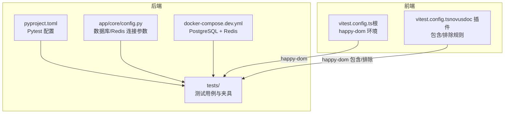
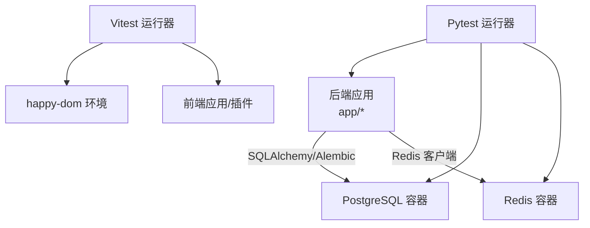
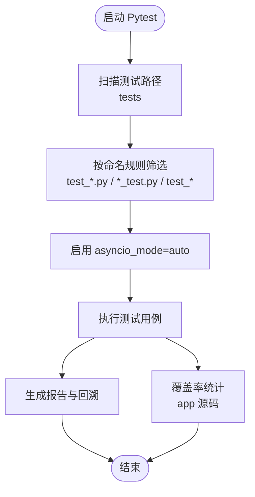
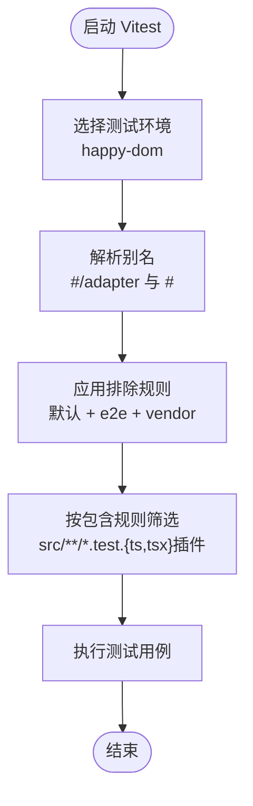
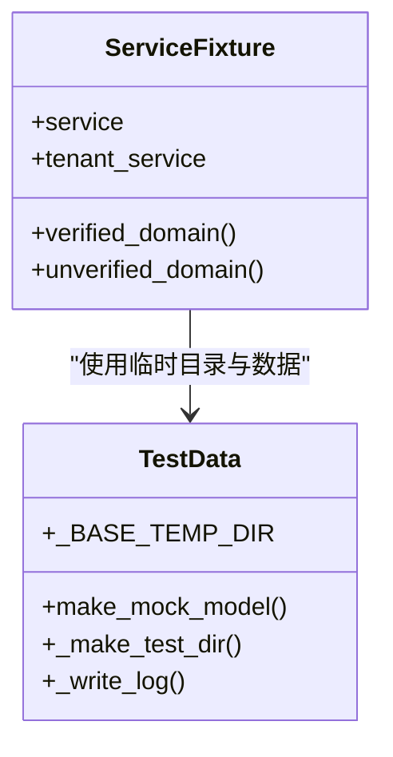
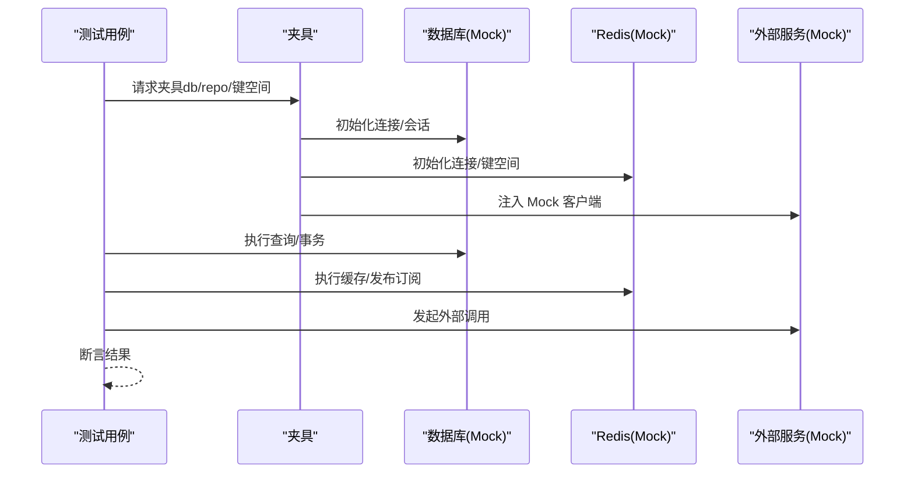
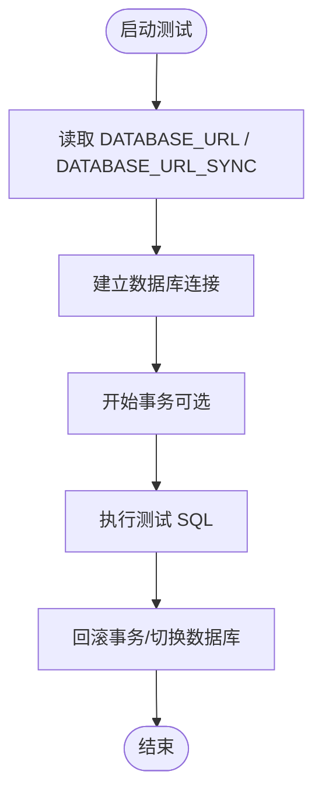
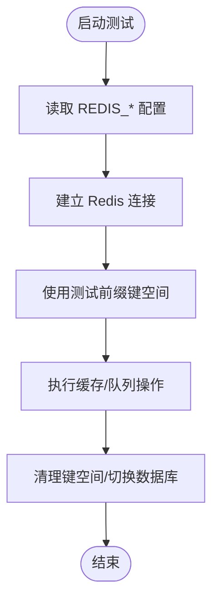
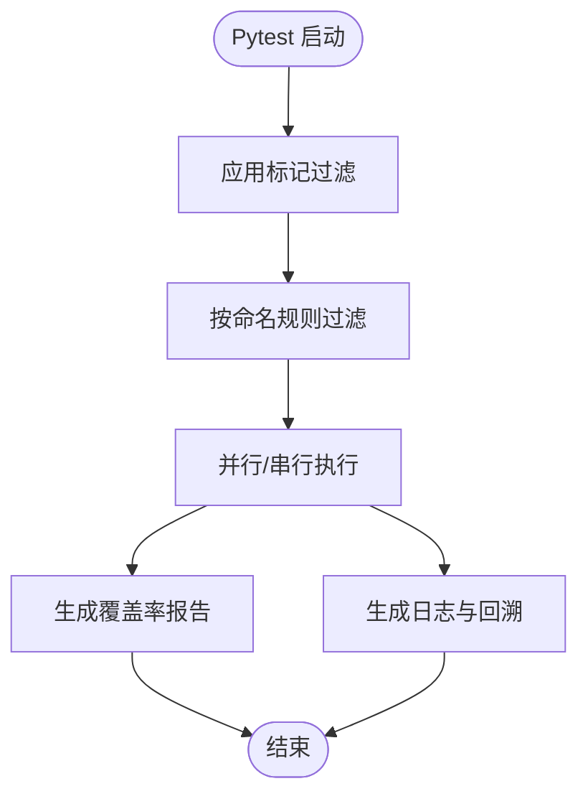
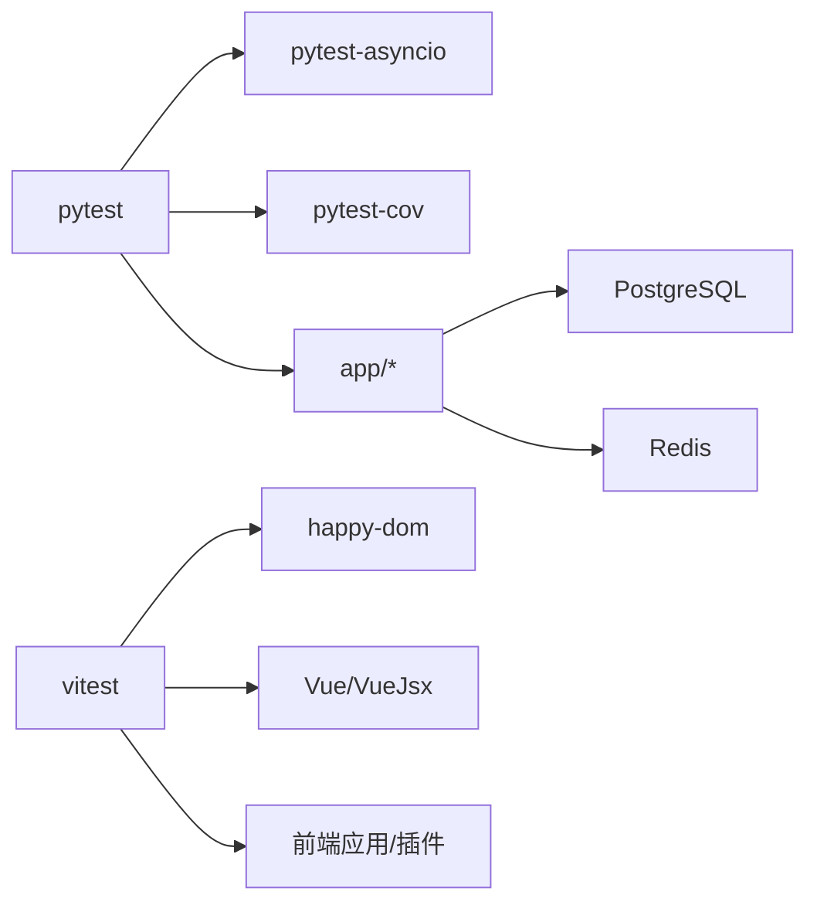

# 测试配置

<cite>
**本文引用的文件**
- [pyproject.toml](file://backend/pyproject.toml)
- [vitest.config.ts（前端根目录）](file://frontend/vitest.config.ts)
- [vitest.config.ts（novusdoc 插件）](file://backend/plugins/novusdoc/frontend/vitest.config.ts)
- [docker-compose.dev.yml](file://docker-compose.dev.yml)
- [docker-compose.prod.yml](file://docker-compose.prod.yml)
- [config.py（后端核心配置）](file://backend/app/core/config.py)
- [sample_plugin.yaml（测试夹具示例）](file://backend/tests/fixtures/sample_plugin.yaml)
- [test_dev_hosts_service.py（测试夹具示例）](file://backend/tests/services/test_dev_hosts_service.py)
- [test_system_log_service.py（临时目录与清理示例）](file://backend/tests/services/test_system_log_service.py)
</cite>

## 目录
1. [简介](#简介)
2. [项目结构](#项目结构)
3. [核心组件](#核心组件)
4. [架构总览](#架构总览)
5. [详细组件分析](#详细组件分析)
6. [依赖分析](#依赖分析)
7. [性能考虑](#性能考虑)
8. [故障排除指南](#故障排除指南)
9. [结论](#结论)
10. [附录](#附录)

## 简介
本文件系统性梳理并文档化本仓库的测试配置，覆盖以下方面：
- Pytest 的配置项、异步模式、测试路径与文件/函数命名规范、覆盖率与警告策略
- Vitest 的配置项、测试环境（happy-dom）、别名与排除规则
- 测试环境变量与外部依赖（PostgreSQL、Redis）的容器化配置
- 测试夹具（fixtures）的使用方式与最佳实践
- Mock 策略与测试数据管理
- 数据库测试配置与 Redis 测试环境
- 外部服务 Mock 策略
- 并行执行、过滤与报告生成配置
- 最佳实践与常见问题排查

## 项目结构
本仓库采用前后端分离的测试布局：
- 后端使用 Pytest，测试目录位于 backend/tests，通过 pyproject.toml 统一配置
- 前端使用 Vitest，根目录与部分插件子包各自维护 vitest.config.ts
- 使用 Docker Compose 提供开发态的 PostgreSQL 与 Redis 服务

**图表来源**
- [pyproject.toml:203-238](file://backend/pyproject.toml#L203-L238)
- [vitest.config.ts（前端根目录）:1-22](file://frontend/vitest.config.ts#L1-L22)
- [vitest.config.ts（novusdoc 插件）:1-16](file://backend/plugins/novusdoc/frontend/vitest.config.ts#L1-L16)
- [docker-compose.dev.yml:1-49](file://docker-compose.dev.yml#L1-L49)
- [config.py（后端核心配置）:93-122](file://backend/app/core/config.py#L93-L122)

**章节来源**
- [pyproject.toml:203-238](file://backend/pyproject.toml#L203-L238)
- [vitest.config.ts（前端根目录）:1-22](file://frontend/vitest.config.ts#L1-L22)
- [vitest.config.ts（novusdoc 插件）:1-16](file://backend/plugins/novusdoc/frontend/vitest.config.ts#L1-L16)
- [docker-compose.dev.yml:1-49](file://docker-compose.dev.yml#L1-L49)
- [config.py（后端核心配置）:93-122](file://backend/app/core/config.py#L93-L122)

## 核心组件
- Pytest 配置
  - 异步模式：auto
  - 测试路径：tests
  - 文件/函数命名：test_*.py 与 *_test.py；test_*
  - 全局选项：详细输出、严格标记、短回溯、显示未捕获异常、临时目录
  - 警告策略：忽略 DeprecationWarning
  - 覆盖率：源码 app，分支统计，忽略 migrations 与 tests、__init__.py
- Vitest 配置（前端）
  - 环境：happy-dom
  - 排除：默认排除 + e2e 与 vendor
  - 别名：#/adapter 与 #
  - 插件：Vue 与 VueJsx（根），Vue（插件）
- 外部服务
  - PostgreSQL：开发环境容器，本地端口映射
  - Redis：开发环境容器，持久化卷

**章节来源**
- [pyproject.toml:203-238](file://backend/pyproject.toml#L203-L238)
- [vitest.config.ts（前端根目录）:1-22](file://frontend/vitest.config.ts#L1-L22)
- [vitest.config.ts（novusdoc 插件）:1-16](file://backend/plugins/novusdoc/frontend/vitest.config.ts#L1-L16)
- [docker-compose.dev.yml:1-49](file://docker-compose.dev.yml#L1-L49)

## 架构总览
下图展示测试运行时的系统交互：Pytest 执行后端测试，访问数据库与 Redis；Vitest 在浏览器 DOM 模拟环境下执行前端单元测试。

**图表来源**
- [pyproject.toml:203-238](file://backend/pyproject.toml#L203-L238)
- [docker-compose.dev.yml:1-49](file://docker-compose.dev.yml#L1-L49)
- [vitest.config.ts（前端根目录）:1-22](file://frontend/vitest.config.ts#L1-L22)

## 详细组件分析

### Pytest 配置详解
- 异步支持：通过 asyncio_mode 自动模式，确保协程测试正确调度
- 测试发现：仅在 tests 目录查找，按文件/函数命名规则匹配
- 输出与报告：详细级别、严格标记、短回溯、显示未捕获异常
- 临时目录：统一 bade temp 目录，避免并发冲突
- 警告策略：忽略弃用警告，减少噪音
- 覆盖率：对 app 源码进行分支统计，忽略迁移与测试文件

**图表来源**
- [pyproject.toml:203-238](file://backend/pyproject.toml#L203-L238)

**章节来源**
- [pyproject.toml:203-238](file://backend/pyproject.toml#L203-L238)

### Vitest 配置详解
- 根配置
  - 环境：happy-dom，适合 DOM API 测试
  - 排除：默认排除 + e2e 与 vendor
  - 别名：简化模块导入路径
- 插件配置（novusdoc）
  - 环境：happy-dom
  - 包含：仅 src/**/*.test.{ts,tsx}

**图表来源**
- [vitest.config.ts（前端根目录）:1-22](file://frontend/vitest.config.ts#L1-L22)
- [vitest.config.ts（novusdoc 插件）:1-16](file://backend/plugins/novusdoc/frontend/vitest.config.ts#L1-L16)

**章节来源**
- [vitest.config.ts（前端根目录）:1-22](file://frontend/vitest.config.ts#L1-L22)
- [vitest.config.ts（novusdoc 插件）:1-16](file://backend/plugins/novusdoc/frontend/vitest.config.ts#L1-L16)

### 测试夹具（Fixtures）与数据管理
- 夹具类型
  - 函数级夹具：在单个测试函数内注入依赖
  - 模块级夹具：跨多个测试复用
  - 会话级夹具：跨会话共享（如数据库连接池）
- 示例
  - 服务类夹具：通过绕过 __init__ 并手动注入依赖（如 db、repo）以实现可控 Mock
  - 测试数据：使用 make_mock_model 构造模型实例，便于断言
  - 临时目录与清理：统一基线临时目录，测试前清理，测试后回收

**图表来源**
- [test_dev_hosts_service.py:34-76](file://backend/tests/services/test_dev_hosts_service.py#L34-L76)
- [test_system_log_service.py:14-40](file://backend/tests/services/test_system_log_service.py#L14-L40)

**章节来源**
- [test_dev_hosts_service.py:34-76](file://backend/tests/services/test_dev_hosts_service.py#L34-L76)
- [test_system_log_service.py:14-40](file://backend/tests/services/test_system_log_service.py#L14-L40)

### Mock 配置与外部服务策略
- 数据库 Mock
  - 使用 SQLAlchemy 异步引擎或测试专用连接
  - 在夹具中注入 Mock 会话/事务，隔离真实数据库
- Redis Mock
  - 使用内存模式或容器化 Redis，配合测试前缀键空间
- 外部服务 Mock
  - HTTP 客户端（httpx/requests）使用本地桩或第三方 Mock 服务
  - 存储驱动（S3/OSS）使用本地存储或 MinIO 容器
- 环境变量
  - 通过 .env 或 docker-compose 注入 DATABASE_URL、REDIS_URL 等
  - 生产环境变量由 compose 文件集中管理

[此图为概念流程，不直接映射具体源文件，故无“图表来源”]

**章节来源**
- [docker-compose.dev.yml:1-49](file://docker-compose.dev.yml#L1-L49)
- [docker-compose.prod.yml:1-54](file://docker-compose.prod.yml#L1-L54)
- [config.py（后端核心配置）:93-122](file://backend/app/core/config.py#L93-L122)

### 数据库测试配置
- 连接参数
  - 异步连接：postgresql+asyncpg
  - 同步连接（Alembic）：postgresql
- 开发环境
  - 使用 docker-compose.dev.yml 提供的 PostgreSQL 容器
  - 默认凭据与初始化参数已在容器中配置
- 测试隔离
  - 建议为每个测试进程分配独立数据库或使用事务回滚
  - 使用夹具注入测试专用连接

**图表来源**
- [config.py（后端核心配置）:93-107](file://backend/app/core/config.py#L93-L107)
- [docker-compose.dev.yml:1-49](file://docker-compose.dev.yml#L1-L49)

**章节来源**
- [config.py（后端核心配置）:93-107](file://backend/app/core/config.py#L93-L107)
- [docker-compose.dev.yml:1-49](file://docker-compose.dev.yml#L1-L49)

### Redis 测试环境
- 连接参数
  - REDIS_HOST、REDIS_PORT、REDIS_PASSWORD、REDIS_DB
  - 生成 REDIS_URL 用于客户端连接
- 开发环境
  - 使用 docker-compose.dev.yml 提供的 Redis 容器
- 测试隔离
  - 使用独立数据库索引或键前缀，避免并发污染
  - 可在测试前清空键空间或使用内存模式

**图表来源**
- [config.py（后端核心配置）:117-122](file://backend/app/core/config.py#L117-L122)
- [docker-compose.dev.yml:23-38](file://docker-compose.dev.yml#L23-L38)

**章节来源**
- [config.py（后端核心配置）:117-122](file://backend/app/core/config.py#L117-L122)
- [docker-compose.dev.yml:23-38](file://docker-compose.dev.yml#L23-L38)

### 并行执行、过滤与报告生成
- 并行执行
  - Pytest 支持多进程/多线程执行（需额外插件），当前配置未启用
- 测试过滤
  - 通过命令行标记（markers）与过滤器组合使用
  - 命名规则：test_*.py 与 *_test.py；test_*
- 报告生成
  - 覆盖率：基于工具配置生成覆盖率报告
  - 回溯：短回溯模式，便于快速定位问题

**图表来源**
- [pyproject.toml:203-238](file://backend/pyproject.toml#L203-L238)

**章节来源**
- [pyproject.toml:203-238](file://backend/pyproject.toml#L203-L238)

## 依赖分析
- Pytest 与工具链
  - pytest、pytest-asyncio、pytest-cov
  - ruff、mypy（类型检查与格式化）
- Vitest 与前端生态
  - happy-dom、Vue/VueJsx 插件
  - 别名与包含/排除规则
- 外部依赖
  - PostgreSQL（pgvector）、Redis
  - Docker Compose 提供容器化运行环境

**图表来源**
- [pyproject.toml:112-130](file://backend/pyproject.toml#L112-L130)
- [vitest.config.ts（前端根目录）:1-22](file://frontend/vitest.config.ts#L1-L22)

**章节来源**
- [pyproject.toml:112-130](file://backend/pyproject.toml#L112-L130)
- [vitest.config.ts（前端根目录）:1-22](file://frontend/vitest.config.ts#L1-L22)

## 性能考虑
- 并行执行
  - 在 CI 中启用并行以缩短总耗时，注意资源限制与锁竞争
- 测试隔离
  - 使用独立数据库/键空间，避免锁争用
- Mock 策略
  - 将昂贵外部调用替换为本地 Mock，显著降低端到端测试时间
- 覆盖率与回溯
  - 合理裁剪覆盖率统计范围，聚焦核心模块

[本节为通用建议，无需特定文件引用]

## 故障排除指南
- Pytest 相关
  - 弃用警告过多：确认 filterwarnings 已生效
  - 异步测试失败：检查 asyncio_mode 是否为 auto
  - 临时目录权限问题：确认 basetemp 权限与磁盘空间
- Vitest 相关
  - happy-dom 不兼容的 DOM API：补充 polyfill 或改用 jsdom
  - 别名解析失败：核对别名与实际路径
  - 包含/排除规则导致测试未运行：检查 include/exclude 规则
- 外部服务
  - PostgreSQL/Redis 无法连接：确认容器健康状态与端口映射
  - 键空间污染：引入测试前缀或在测试后清理

**章节来源**
- [pyproject.toml:203-238](file://backend/pyproject.toml#L203-L238)
- [vitest.config.ts（前端根目录）:1-22](file://frontend/vitest.config.ts#L1-L22)
- [docker-compose.dev.yml:1-49](file://docker-compose.dev.yml#L1-L49)

## 结论
本仓库的测试配置以 Pytest 与 Vitest 为核心，结合 Docker Compose 提供的数据库与缓存服务，形成前后端一体化的测试体系。通过合理的夹具设计、Mock 策略与隔离机制，能够在保证质量的同时提升测试效率。建议在 CI 中启用并行执行，并持续优化覆盖率与报告输出，以获得更清晰的质量反馈。

[本节为总结性内容，无需特定文件引用]

## 附录
- 环境变量参考
  - DATABASE_HOST、DATABASE_PORT、DATABASE_USER、DATABASE_PASSWORD、DATABASE_NAME
  - REDIS_HOST、REDIS_PORT、REDIS_PASSWORD、REDIS_DB
- 关键文件路径
  - 后端测试配置：backend/pyproject.toml
  - 前端测试配置：frontend/vitest.config.ts
  - 插件测试配置：backend/plugins/*/frontend/vitest.config.ts
  - 外部服务：docker-compose.dev.yml、docker-compose.prod.yml
  - 应用配置：backend/app/core/config.py
  - 测试夹具示例：backend/tests/fixtures/sample_plugin.yaml
  - 服务夹具示例：backend/tests/services/test_dev_hosts_service.py
  - 临时目录示例：backend/tests/services/test_system_log_service.py

[本节为索引性内容，无需特定文件引用]