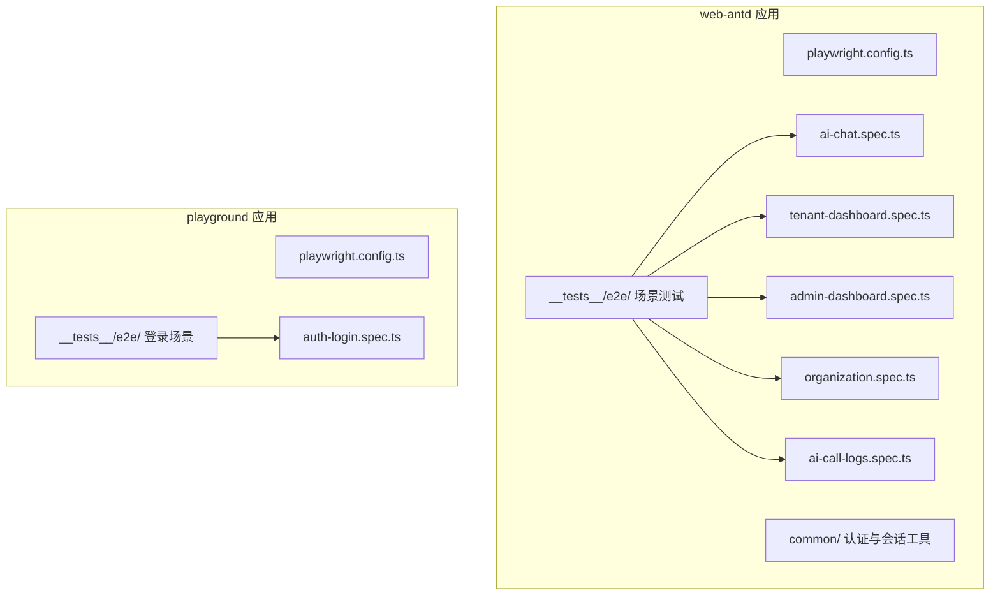
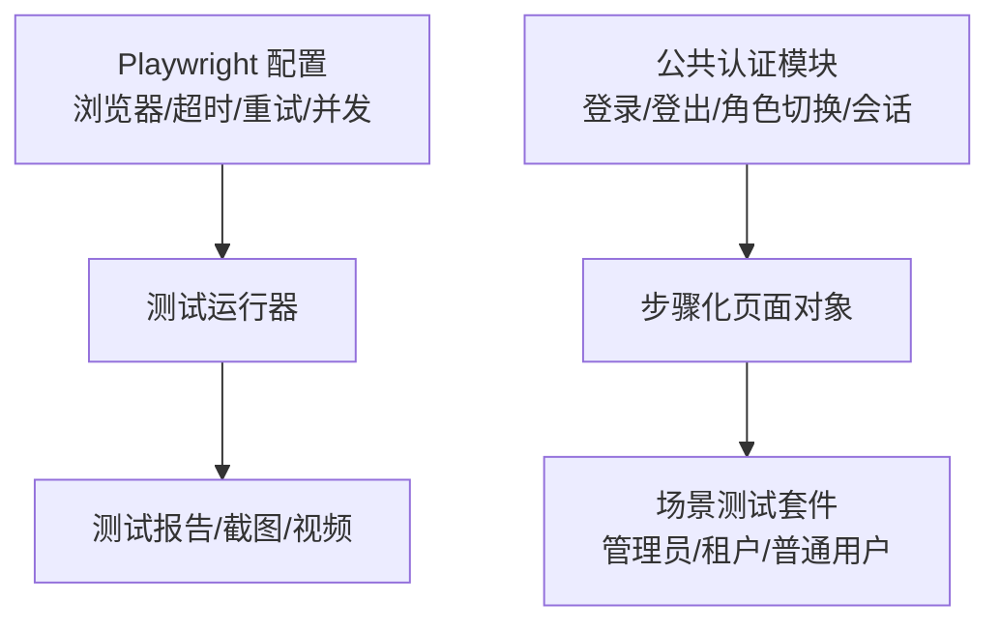
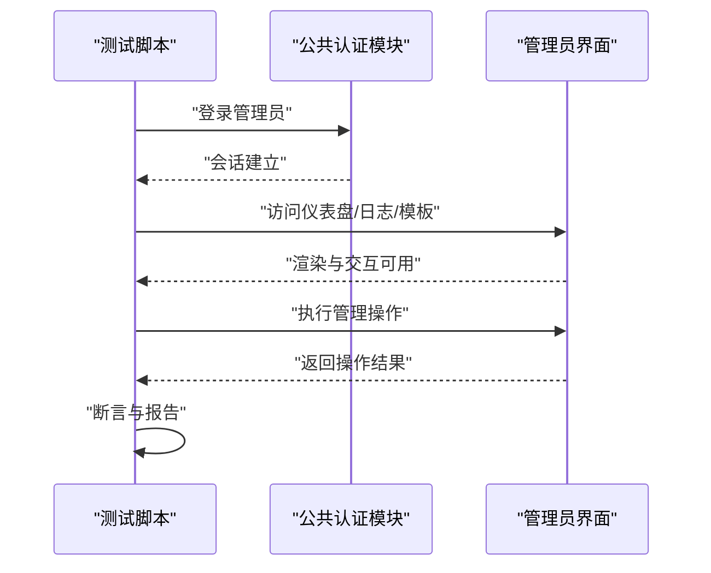
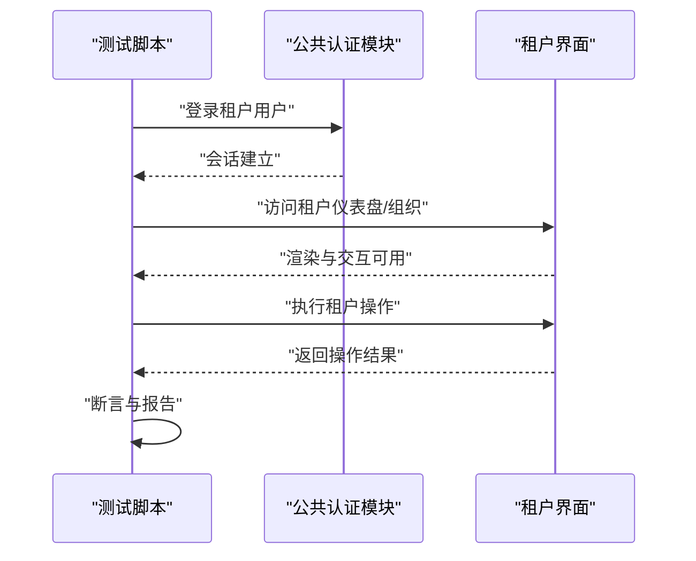
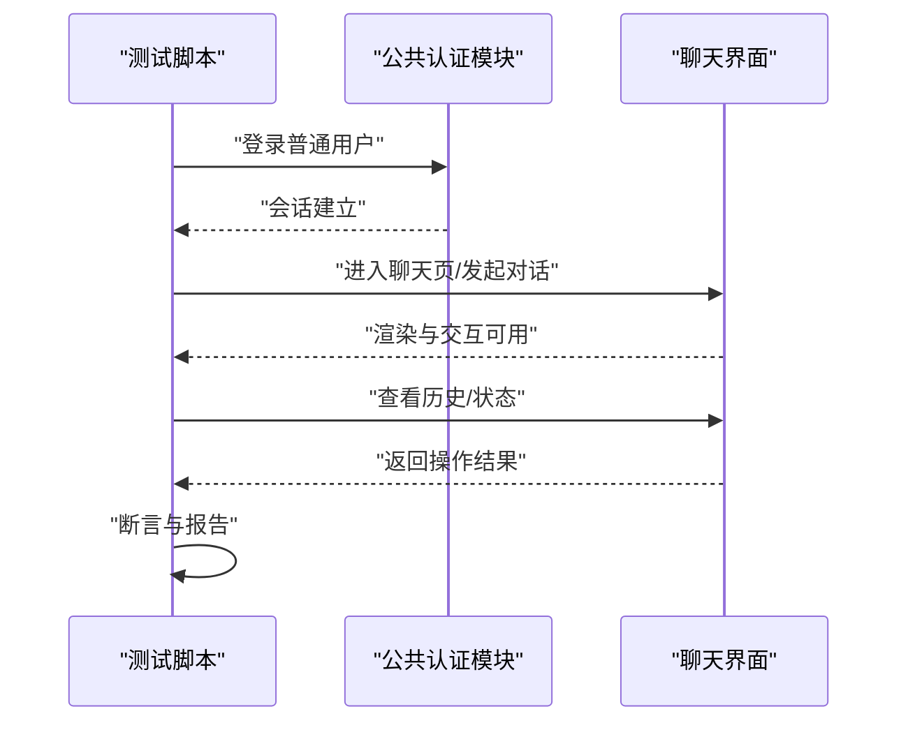
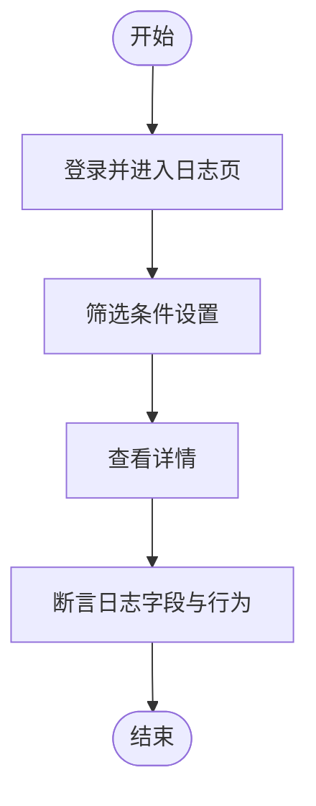
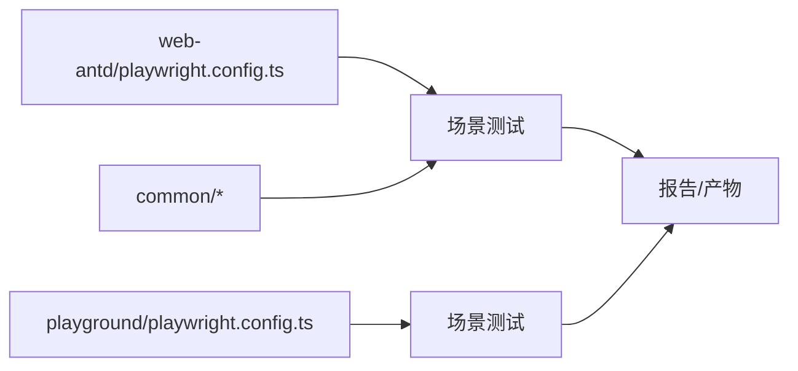

# 端到端测试

<cite>
**本文引用的文件**
- [playwright.config.ts](file://frontend/apps/web-antd/playwright.config.ts)
- [auth.ts](file://frontend/apps/web-antd/__tests__/e2e/common/auth.ts)
- [admin-auth.ts](file://frontend/apps/web-antd/__tests__/e2e/common/admin-auth.ts)
- [user-auth.ts](file://frontend/apps/web-antd/__tests__/e2e/common/user-auth.ts)
- [session.ts](file://frontend/apps/web-antd/__tests__/e2e/common/session.ts)
- [ai-chat.spec.ts](file://frontend/apps/web-antd/__tests__/e2e/ai-chat.spec.ts)
- [tenant-dashboard.spec.ts](file://frontend/apps/web-antd/__tests__/e2e/tenant-dashboard.spec.ts)
- [admin-dashboard.spec.ts](file://frontend/apps/web-antd/__tests__/e2e/admin-dashboard.spec.ts)
- [organization.spec.ts](file://frontend/apps/web-antd/__tests__/e2e/organization.spec.ts)
- [ai-call-logs.spec.ts](file://frontend/apps/web-antd/__tests__/e2e/ai-call-logs.spec.ts)
- [playwright.config.ts](file://frontend/playground/playwright.config.ts)
- [auth-login.spec.ts](file://frontend/playground/__tests__/e2e/auth-login.spec.ts)
</cite>

## 目录
1. [简介](#简介)
2. [项目结构](#项目结构)
3. [核心组件](#核心组件)
4. [架构总览](#架构总览)
5. [详细组件分析](#详细组件分析)
6. [依赖关系分析](#依赖关系分析)
7. [性能考量](#性能考量)
8. [故障排查指南](#故障排查指南)
9. [结论](#结论)
10. [附录](#附录)

## 简介
本文件系统性阐述本仓库前端应用的端到端测试（E2E）设计与实施策略，覆盖用户场景模拟、完整业务流程验证与用户体验测试。文档聚焦于 Playwright 配置、测试页面对象与自动化脚本编写方法，并针对管理员、租户用户与普通用户的典型操作流程进行测试覆盖说明。同时提供测试数据准备、环境配置与测试结果分析方法，以及 E2E 测试最佳实践与性能优化建议。

## 项目结构
前端 E2E 测试主要分布在两个应用中：
- web-antd 应用：包含完整的 E2E 测试套件，涵盖 AI 聊天、租户仪表盘、管理员仪表盘、组织管理、AI 调用日志等场景。
- playground 应用：包含基础登录认证的 E2E 测试示例。

图表来源
- [playwright.config.ts](file://frontend/apps/web-antd/playwright.config.ts)
- [auth.ts](file://frontend/apps/web-antd/__tests__/e2e/common/auth.ts)
- [ai-chat.spec.ts](file://frontend/apps/web-antd/__tests__/e2e/ai-chat.spec.ts)
- [tenant-dashboard.spec.ts](file://frontend/apps/web-antd/__tests__/e2e/tenant-dashboard.spec.ts)
- [admin-dashboard.spec.ts](file://frontend/apps/web-antd/__tests__/e2e/admin-dashboard.spec.ts)
- [organization.spec.ts](file://frontend/apps/web-antd/__tests__/e2e/organization.spec.ts)
- [ai-call-logs.spec.ts](file://frontend/apps/web-antd/__tests__/e2e/ai-call-logs.spec.ts)
- [playwright.config.ts](file://frontend/playground/playwright.config.ts)
- [auth-login.spec.ts](file://frontend/playground/__tests__/e2e/auth-login.spec.ts)

章节来源
- [playwright.config.ts](file://frontend/apps/web-antd/playwright.config.ts)
- [playwright.config.ts](file://frontend/playground/playwright.config.ts)

## 核心组件
- Playwright 配置：定义浏览器上下文、超时、重试、截图与视频录制、并发与并行策略等。
- 公共认证模块：封装登录、登出、角色切换、会话保持等通用逻辑，供各场景测试复用。
- 页面对象与步骤：以“步骤”形式组织页面交互，提升可维护性与可读性。
- 场景测试：围绕真实用户路径构建端到端流程，覆盖管理员、租户用户与普通用户三类角色。

章节来源
- [playwright.config.ts](file://frontend/apps/web-antd/playwright.config.ts)
- [auth.ts](file://frontend/apps/web-antd/__tests__/e2e/common/auth.ts)
- [admin-auth.ts](file://frontend/apps/web-antd/__tests__/e2e/common/admin-auth.ts)
- [user-auth.ts](file://frontend/apps/web-antd/__tests__/e2e/common/user-auth.ts)
- [session.ts](file://frontend/apps/web-antd/__tests__/e2e/common/session.ts)

## 架构总览
下图展示 E2E 测试的整体架构：配置驱动执行，公共认证模块统一处理登录与角色切换，场景测试通过步骤化页面对象串联业务流程，最终产出测试报告与产物（截图/视频）。

图表来源
- [playwright.config.ts](file://frontend/apps/web-antd/playwright.config.ts)
- [auth.ts](file://frontend/apps/web-antd/__tests__/e2e/common/auth.ts)
- [admin-auth.ts](file://frontend/apps/web-antd/__tests__/e2e/common/admin-auth.ts)
- [user-auth.ts](file://frontend/apps/web-antd/__tests__/e2e/common/user-auth.ts)
- [session.ts](file://frontend/apps/web-antd/__tests__/e2e/common/session.ts)

## 详细组件分析

### Playwright 配置与执行策略
- 浏览器与上下文：支持多浏览器与上下文隔离，便于并行执行与状态隔离。
- 超时与重试：合理设置导航、等待与操作超时，结合失败重试降低偶发失败影响。
- 并发与并行：通过 workers 与 maxFailures 控制并发度与失败容忍度。
- 截图与视频：开启失败时截图与视频录制，便于问题定位。
- 报告与输出：统一输出目录与格式，便于 CI/CD 集成与归档。

章节来源
- [playwright.config.ts](file://frontend/apps/web-antd/playwright.config.ts)
- [playwright.config.ts](file://frontend/playground/playwright.config.ts)

### 公共认证模块与页面对象
- 登录与登出：封装统一登录入口与登出流程，确保测试前后的干净状态。
- 角色切换：在多角色场景中快速切换身份，验证权限边界与界面差异。
- 会话管理：持久化登录态，减少重复登录开销，提升执行效率。
- 步骤化页面对象：将复杂页面交互拆分为可复用步骤，提升可维护性与可读性。

章节来源
- [auth.ts](file://frontend/apps/web-antd/__tests__/e2e/common/auth.ts)
- [admin-auth.ts](file://frontend/apps/web-antd/__tests__/e2e/common/admin-auth.ts)
- [user-auth.ts](file://frontend/apps/web-antd/__tests__/e2e/common/user-auth.ts)
- [session.ts](file://frontend/apps/web-antd/__tests__/e2e/common/session.ts)

### 管理员角色端到端流程
- 场景覆盖：管理员仪表盘、AI 健康监控、通知模板、系统日志、周期任务、租户工作流等。
- 关键流程：登录 → 导航至目标页面 → 执行关键操作（如创建模板、查看日志、管理租户）→ 验证结果。
- 权限验证：确保仅管理员可见与可操作的功能项正确呈现与响应。

图表来源
- [admin-dashboard.spec.ts](file://frontend/apps/web-antd/__tests__/e2e/admin-dashboard.spec.ts)
- [admin-auth.ts](file://frontend/apps/web-antd/__tests__/e2e/common/admin-auth.ts)
- [auth.ts](file://frontend/apps/web-antd/__tests__/e2e/common/auth.ts)

章节来源
- [admin-dashboard.spec.ts](file://frontend/apps/web-antd/__tests__/e2e/admin-dashboard.spec.ts)
- [admin-auth.ts](file://frontend/apps/web-antd/__tests__/e2e/common/admin-auth.ts)

### 租户用户端到端流程
- 场景覆盖：租户仪表盘、租户资料、组织管理、AI 聊天与对话历史等。
- 关键流程：登录 → 切换租户身份 → 访问租户专属页面 → 执行租户级操作（如更新资料、发起对话）→ 验证结果。
- 数据隔离：确保租户间数据与权限隔离，避免跨租户干扰。

图表来源
- [tenant-dashboard.spec.ts](file://frontend/apps/web-antd/__tests__/e2e/tenant-dashboard.spec.ts)
- [organization.spec.ts](file://frontend/apps/web-antd/__tests__/e2e/organization.spec.ts)
- [user-auth.ts](file://frontend/apps/web-antd/__tests__/e2e/common/user-auth.ts)

章节来源
- [tenant-dashboard.spec.ts](file://frontend/apps/web-antd/__tests__/e2e/tenant-dashboard.spec.ts)
- [organization.spec.ts](file://frontend/apps/web-antd/__tests__/e2e/organization.spec.ts)
- [user-auth.ts](file://frontend/apps/web-antd/__tests__/e2e/common/user-auth.ts)

### 普通用户端到端流程
- 场景覆盖：AI 聊天、对话历史、最新轮次状态等。
- 关键流程：登录 → 进入聊天界面 → 发起对话 → 查看历史与状态 → 验证结果。
- 用户体验：关注加载、响应时间与错误提示，确保流畅体验。

图表来源
- [ai-chat.spec.ts](file://frontend/apps/web-antd/__tests__/e2e/ai-chat.spec.ts)
- [user-auth.ts](file://frontend/apps/web-antd/__tests__/e2e/common/user-auth.ts)

章节来源
- [ai-chat.spec.ts](file://frontend/apps/web-antd/__tests__/e2e/ai-chat.spec.ts)
- [user-auth.ts](file://frontend/apps/web-antd/__tests__/e2e/common/user-auth.ts)

### AI 调用日志与回归测试
- 场景覆盖：AI 调用日志查询、过滤与详情查看。
- 回归保障：通过稳定的数据与断言，确保日志功能在版本迭代中的稳定性。

图表来源
- [ai-call-logs.spec.ts](file://frontend/apps/web-antd/__tests__/e2e/ai-call-logs.spec.ts)

章节来源
- [ai-call-logs.spec.ts](file://frontend/apps/web-antd/__tests__/e2e/ai-call-logs.spec.ts)

### Playground 登录认证示例
- 场景覆盖：基础登录流程验证，适合作为新测试脚本的起点。
- 最佳实践：参考该示例组织登录步骤、断言与清理逻辑。

章节来源
- [auth-login.spec.ts](file://frontend/playground/__tests__/e2e/auth-login.spec.ts)
- [playwright.config.ts](file://frontend/playground/playwright.config.ts)

## 依赖关系分析
- 配置依赖：各应用的 Playwright 配置独立管理，分别控制自身测试执行策略。
- 认证依赖：所有场景测试依赖公共认证模块，确保登录与角色切换的一致性。
- 页面对象依赖：场景测试通过步骤化页面对象调用底层交互，降低耦合度。
- 外部依赖：依赖后端服务可用性与网络稳定性；建议在 CI 中使用稳定的服务端点与数据库快照。

图表来源
- [playwright.config.ts](file://frontend/apps/web-antd/playwright.config.ts)
- [playwright.config.ts](file://frontend/playground/playwright.config.ts)
- [auth.ts](file://frontend/apps/web-antd/__tests__/e2e/common/auth.ts)

章节来源
- [playwright.config.ts](file://frontend/apps/web-antd/playwright.config.ts)
- [playwright.config.ts](file://frontend/playground/playwright.config.ts)
- [auth.ts](file://frontend/apps/web-antd/__tests__/e2e/common/auth.ts)

## 性能考量
- 并发执行：合理设置 workers 数量，避免资源争用；对有状态的测试（如登录态）采用上下文隔离。
- 超时与重试：根据页面复杂度调整超时与重试次数，平衡稳定性与执行时长。
- 截图与视频：仅在失败时生成，或按需启用，减少磁盘与存储压力。
- 数据预热：在 CI 中使用预置数据集，减少初始化耗时；对数据库进行快照恢复。
- 缓存与网络：在本地开发中启用缓存与离线回退，提高调试效率。

## 故障排查指南
- 登录失败：检查认证模块参数与后端接口可用性；确认会话是否正确持久化。
- 页面元素未找到：增加显式等待与断言；区分静态与动态内容，选择合适的等待策略。
- 并发冲突：检查 workers 设置与上下文隔离；避免共享状态导致的竞争条件。
- 截图与视频缺失：确认配置中的录制开关与输出目录权限；检查磁盘空间。
- 环境变量：确保测试环境变量与 CI 变量一致；核对数据库连接与服务地址。

章节来源
- [playwright.config.ts](file://frontend/apps/web-antd/playwright.config.ts)
- [auth.ts](file://frontend/apps/web-antd/__tests__/e2e/common/auth.ts)

## 结论
本项目的 E2E 测试以 Playwright 为核心，通过独立配置、公共认证模块与步骤化页面对象，实现了对管理员、租户用户与普通用户的完整业务流程覆盖。配合合理的性能优化与故障排查策略，能够持续保障用户体验与系统稳定性。

## 附录
- 测试数据准备：在测试前准备最小化且稳定的测试数据集，确保可重复性与可维护性。
- 环境配置：在本地与 CI 中统一配置 Playwright 参数与后端依赖，确保一致性。
- 测试结果分析：结合截图、视频与日志，定位问题根因；定期回顾失败用例，优化稳定性。