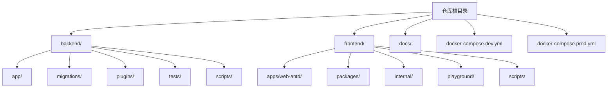
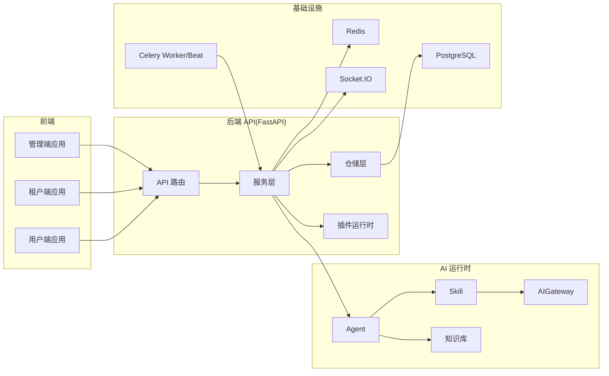
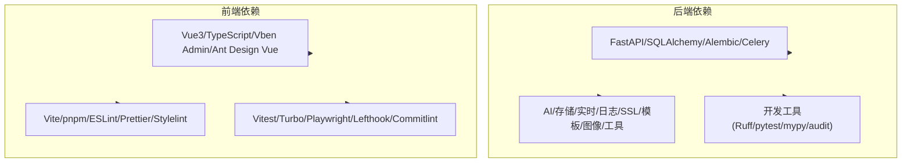

# 贡献指南

<cite>
**本文引用的文件**
- [CONTRIBUTING.md](file://CONTRIBUTING.md)
- [README.md](file://README.md)
- [backend/pyproject.toml](file://backend/pyproject.toml)
- [frontend/package.json](file://frontend/package.json)
- [frontend/eslint.config.mjs](file://frontend/eslint.config.mjs)
- [.prettierrc.mjs](file://frontend/.prettierrc.mjs)
- [frontend/stylelint.config.mjs](file://frontend/stylelint.config.mjs)
- [.commitlintrc.js](file://frontend/.commitlintrc.js)
- [backend/alembic.ini](file://backend/alembic.ini)
- [frontend/lefthook.yml](file://frontend/lefthook.yml)
- [backend/scripts/check_prompt_contracts.py](file://backend/scripts/check_prompt_contracts.py)
- [docker-compose.dev.yml](file://docker-compose.dev.yml)
- [docker-compose.prod.yml](file://docker-compose.prod.yml)
</cite>

## 目录
1. [简介](#简介)
2. [项目结构](#项目结构)
3. [核心组件](#核心组件)
4. [架构总览](#架构总览)
5. [详细组件分析](#详细组件分析)
6. [依赖分析](#依赖分析)
7. [性能考虑](#性能考虑)
8. [故障排查指南](#故障排查指南)
9. [结论](#结论)
10. [附录](#附录)

## 简介
本贡献指南面向希望参与 NovusAI SaaS 项目的开发者，系统性阐述从环境搭建、代码规范、静态检查、测试、分支与提交规范，到 Issue 报告、Pull Request 流程、代码审查、分支管理策略、版本发布与变更日志维护、新贡献者入门与导师制度、社区行为准则与协作工具使用，以及贡献认可与长期激励机制。目标是帮助贡献者高效、高质量地融入项目，共建可持续演进的多租户 AI SaaS 平台。

## 项目结构
仓库采用前后端分离与多工作区的组织方式：
- backend：FastAPI 后端、迁移、插件运行时、测试与 CLI 工具
- frontend：Vue3 + Vite 前端 monorepo，包含主应用与共享包
- docs：项目文档
- docker-compose.*：开发与生产编排参考
- scripts：工程化脚本与工具

图表来源
- [README.md: 99-119:99-119](file://README.md#L99-L119)

章节来源
- [README.md: 99-119:99-119](file://README.md#L99-L119)

## 核心组件
- 开发环境与工具链
  - 后端：Python 3.10+、FastAPI、SQLAlchemy、Alembic、Celery、Socket.IO、Ruff、pytest、mypy、bandit、pip-audit
  - 前端：Node.js 20.19+、pnpm 10+、Vue3、TypeScript、Vben Admin、Ant Design Vue、Vite、ESLint、Prettier、Stylelint、Vitest、Turbo
- 工程化与质量保障
  - Ruff（lint/format）、pytest、mypy、bandit、pip-audit
  - ESLint、Prettier、Stylelint、Vitest、Turbo
  - Alembic 迁移、lefthook 预提交钩子、commitlint 提交信息校验
- 本地与生产编排
  - docker-compose.dev.yml：PostgreSQL、Redis
  - docker-compose.prod.yml：生产编排参考，含后端 API、Worker、Beat、前端容器与健康检查

章节来源
- [backend/pyproject.toml: 146-239:146-239](file://backend/pyproject.toml#L146-L239)
- [frontend/package.json: 27-127:27-127](file://frontend/package.json#L27-L127)
- [docker-compose.dev.yml: 1-49:1-49](file://docker-compose.dev.yml#L1-L49)
- [docker-compose.prod.yml: 1-191:1-191](file://docker-compose.prod.yml#L1-L191)

## 架构总览
项目采用“前端三端应用 + 后端 API + AI 运行时 + 基础设施”的分层架构，支持多租户、插件系统、实时通知、异步任务与附件存储等能力。

图表来源
- [README.md: 48-87:48-87](file://README.md#L48-L87)

章节来源
- [README.md: 48-87:48-87](file://README.md#L48-L87)

## 详细组件分析

### 开发环境搭建与本地运行
- 启动依赖服务（PostgreSQL、Redis）
  - 使用 docker-compose.dev.yml 在根目录启动
- 后端
  - 创建并激活虚拟环境，安装开发依赖，复制示例环境变量文件，执行数据库迁移，启动后端服务与 Celery worker
- 前端
  - 在 frontend 目录安装依赖，启动开发服务器
- 默认访问地址与调试文档
  - API、Web 应用、Swagger UI、ReDoc 地址与说明

章节来源
- [README.md: 130-186:130-186](file://README.md#L130-L186)

### 代码风格与静态检查
- 后端
  - 使用 Ruff 进行 lint 与格式化；mypy 进行类型检查；pytest 运行测试；bandit、pip-audit 进行安全与依赖审计
  - Ruff 配置包含目标 Python 版本、行宽、排除路径、lint 规则集合与格式化选项
- 前端
  - ESLint、Prettier、Stylelint 统一代码风格；Vitest 进行单元测试；Turbo 管理 monorepo 构建
  - ESLint 配置基于 @vben/eslint-config；Prettier、Stylelint 配置分别来自 @vben/prettier-config 与 @vben/stylelint-config
- 提示词合约检查
  - 通过脚本扫描后端 AI 相关目录，强制将固定模型侧提示词迁移到专用资源目录，避免硬编码

章节来源
- [backend/pyproject.toml: 146-239:146-239](file://backend/pyproject.toml#L146-L239)
- [frontend/package.json: 27-127:27-127](file://frontend/package.json#L27-L127)
- [frontend/eslint.config.mjs: 1-50:1-50](file://frontend/eslint.config.mjs#L1-L50)
- [.prettierrc.mjs: 1-2:1-2](file://frontend/.prettierrc.mjs#L1-L2)
- [frontend/stylelint.config.mjs: 1-5:1-5](file://frontend/stylelint.config.mjs#L1-L5)
- [backend/scripts/check_prompt_contracts.py: 1-345:1-345](file://backend/scripts/check_prompt_contracts.py#L1-L345)

### 测试与覆盖率
- 后端
  - pytest 配置包含严格标记、短回溯、测试路径、文件/函数命名模式等；覆盖率配置针对 app 包进行分支覆盖率统计
- 前端
  - Vitest 单测运行；Turbo 管理 monorepo 类型检查与构建

章节来源
- [backend/pyproject.toml: 205-239:205-239](file://backend/pyproject.toml#L205-L239)
- [frontend/package.json: 62-63:62-63](file://frontend/package.json#L62-L63)

### 分支管理与提交规范
- 分支策略
  - 基于团队集成分支（如 develop）开展功能开发；短期分支以 feature/… 或 fix/… 命名
- 提交信息
  - 使用 commitlint 与 czg（commitizen）保持一致的提交信息风格；遵循清晰的祈使句主题行
- 预提交钩子
  - lefthook 在提交前自动执行 Prettier、ESLint、Stylelint、commitlint 等检查，减少 CI 压力

章节来源
- [CONTRIBUTING.md: 35-46:35-46](file://CONTRIBUTING.md#L35-L46)
- [frontend/.commitlintrc.js: 1-2:1-2](file://frontend/.commitlintrc.js#L1-L2)
- [frontend/lefthook.yml: 44-77:44-77](file://frontend/lefthook.yml#L44-L77)

### Issue 报告与 PR 提交流程
- Issue
  - 优先搜索现有 Issue；描述问题背景、复现步骤、期望与实际结果；附带截图或最小可复现环境
- Pull Request
  - 清晰描述变更内容、关联 Issue、UI 变更附截图；保持 PR 聚焦；大型重构需先行讨论
- 代码审查
  - 评审关注：功能正确性、代码风格、测试覆盖、安全性、可维护性与性能影响

章节来源
- [CONTRIBUTING.md: 7-41:7-41](file://CONTRIBUTING.md#L7-L41)

### 迁移与数据库变更
- 迁移工具
  - Alembic 管理主应用与插件迁移；版本目录与插件迁移路径在配置中声明
- 迁移生成与格式化
  - 可通过 Alembic CLI 生成迁移脚本；脚本中包含时间戳命名模板与 UTC 时区设置

章节来源
- [backend/alembic.ini: 1-76:1-76](file://backend/alembic.ini#L1-L76)

### 国际化与注释规范
- 用户可见字符串不得硬编码；前端使用 $t()/t()，后端使用 _() 进行国际化
- 新增注释应简洁、实用，仅在必要时补充以澄清非显而易见的行为

章节来源
- [CONTRIBUTING.md: 59-63:59-63](file://CONTRIBUTING.md#L59-L63)

### 安全与漏洞披露
- 安全漏洞请勿公开 Issue；参阅 SECURITY.md 中的披露流程与联系方式

章节来源
- [CONTRIBUTING.md: 64-67:64-67](file://CONTRIBUTING.md#L64-L67)

### 许可证与贡献授权
- 贡献即表示同意以 MIT 许可证条款授权

章节来源
- [CONTRIBUTING.md: 68-71:68-71](file://CONTRIBUTING.md#L68-L71)

### 上游优先贡献策略
- novusai-saas-yudi 为多租户 SaaS 的上游基准；通用平台修复与共享特性优先在上游实现
- 客户定制工作流、品牌、部署覆盖、插件保留在客户仓库
- 对模糊变更需明确上/下游落地，先在上游验证再同步至客户仓库

章节来源
- [CONTRIBUTING.md: 12-34:12-34](file://CONTRIBUTING.md#L12-L34)

### 新贡献者入门、导师制度与学习资源
- 入门建议
  - 阅读 README 了解项目背景与快速开始；先通读相关后端/前端源码、测试与 README 章节
  - 从简单 Issue（good first issue）入手，逐步熟悉代码库与工具链
- 导师制度
  - 建议为每位新贡献者指派一位导师，负责代码规范、流程与工具使用指导
- 学习资源
  - 项目 README 与贡献指南；各模块 README 与设计文档；前后端工程化配置与脚本
  - 前端 monorepo 结构与工具链文档；后端 FastAPI、SQLAlchemy、Alembic、Celery 等生态文档

章节来源
- [CONTRIBUTING.md: 7-11:7-11](file://CONTRIBUTING.md#L7-L11)
- [README.md: 1-279:1-279](file://README.md#L1-L279)

### 社区行为准则、沟通渠道与协作工具
- 行为准则
  - 尊重、包容、专业、建设性沟通；禁止骚扰与歧视
- 沟通渠道
  - GitHub Issues/PR 讨论；内部即时通讯群组；定期线上同步会议
- 协作工具
  - GitHub（Issues/PR/Code Review）、Lefthook（预提交）、commitlint（提交信息）、CI/CD（自动化流水线）

章节来源
- [CONTRIBUTING.md: 64-71:64-71](file://CONTRIBUTING.md#L64-L71)

### 贡献认可、奖励机制与长期激励
- 贡献认可
  - 在贡献者名单中标注；PR 合并后致谢；优秀贡献可在公告渠道分享
- 奖励机制
  - 里程碑贡献奖、代码质量奖、社区贡献奖；可结合项目收益进行激励
- 长期激励
  - 优秀贡献者可受邀成为维护者或技术小组成员；参与路线图制定与决策

章节来源
- [CONTRIBUTING.md: 68-71:68-71](file://CONTRIBUTING.md#L68-L71)

## 依赖分析
- 后端依赖与开发工具
  - FastAPI、SQLAlchemy、Alembic、Celery、Socket.IO、Pydantic、httpx、boto3/oss2、pgvector、loguru、prometheus-client、acme/josepy、jinja2、Pillow、dnspython、pyyaml、captcha 等
  - 开发依赖：pytest、ruff、mypy、pip-audit、bandit、types-redis、types-python-jose 等
- 前端依赖与工具链
  - Vue3、TypeScript、Vben Admin、Ant Design Vue、Vite、pnpm、ESLint、Prettier、Stylelint、Vitest、Turbo、Playwright、cspell、lefthook、commitlint 等

图表来源
- [backend/pyproject.toml: 23-110:23-110](file://backend/pyproject.toml#L23-L110)
- [frontend/package.json: 73-109:73-109](file://frontend/package.json#L73-L109)

章节来源
- [backend/pyproject.toml: 23-130:23-130](file://backend/pyproject.toml#L23-L130)
- [frontend/package.json: 73-109:73-109](file://frontend/package.json#L73-L109)

## 性能考虑
- 后端
  - 使用异步 ORM 与连接池；合理设置数据库索引与查询优化；缓存热点数据；限制大对象与长耗时操作
- 前端
  - 组件懒加载与分割打包；按需引入样式与图标；避免不必要的重渲染；合理使用虚拟列表
- 工程化
  - 并行构建与增量编译；缓存依赖与中间产物；CI 并行化测试与检查

## 故障排查指南
- 环境与依赖
  - 确认 Python 3.10+、Node.js 20.19+、pnpm 10+、PostgreSQL、Redis 版本满足要求
  - docker-compose 启动后检查服务健康状态与端口映射
- 本地运行
  - 后端：确认虚拟环境激活、依赖安装、环境变量配置、数据库迁移成功、worker 正常
  - 前端：确认依赖安装、开发服务器端口未被占用、跨域与 API 地址配置正确
- 代码风格与静态检查
  - 后端：Ruff lint/format 与 mypy 类型检查失败时，按提示修正；pytest 失败时补充或修正测试
  - 前端：ESLint/Stylelint/Prettier 修复失败时，检查文件语法与配置；Vitest 单测失败时定位用例与实现
- 提示词合约
  - 运行提示词检查脚本，将硬编码提示词迁移至专用资源目录

章节来源
- [README.md: 121-186:121-186](file://README.md#L121-L186)
- [backend/scripts/check_prompt_contracts.py: 320-345:320-345](file://backend/scripts/check_prompt_contracts.py#L320-L345)

## 结论
本贡献指南提供了从环境搭建到代码贡献、从规范到流程的完整指引。建议新贡献者先从简单任务入手，逐步深入理解架构与工具链；在提交 PR 前确保通过所有静态检查与测试；遵循上游优先策略，共同维护高质量的多租户 AI SaaS 平台。

## 附录
- 快速参考
  - 后端常用命令：pytest、ruff check、ruff format
  - 前端常用命令：pnpm lint、pnpm test:unit、pnpm build:antd
  - 迁移命令：novusai db upgrade head
- 参考文件
  - CONTRIBUTING.md、README.md、backend/pyproject.toml、frontend/package.json、frontend/eslint.config.mjs、frontend/.prettierrc.mjs、frontend/stylelint.config.mjs、frontend/.commitlintrc.js、backend/alembic.ini、frontend/lefthook.yml、backend/scripts/check_prompt_contracts.py、docker-compose.dev.yml、docker-compose.prod.yml