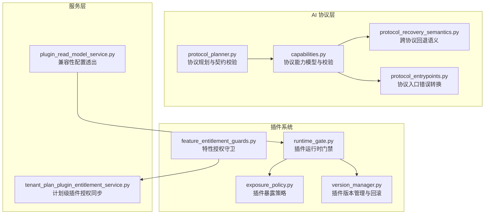
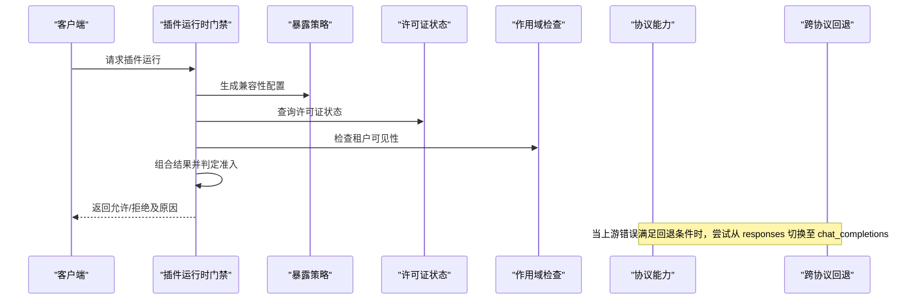
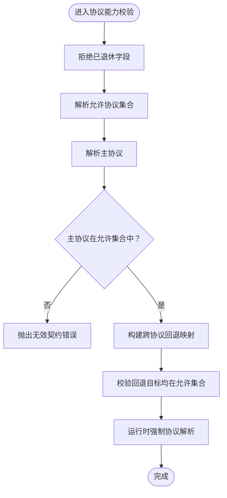
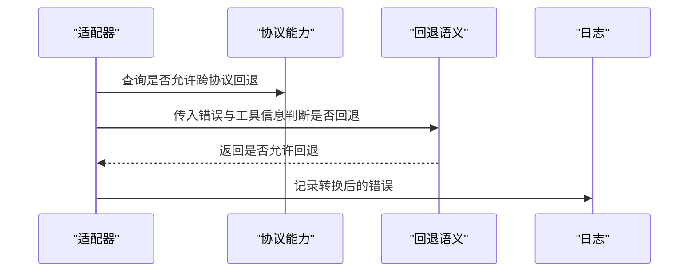
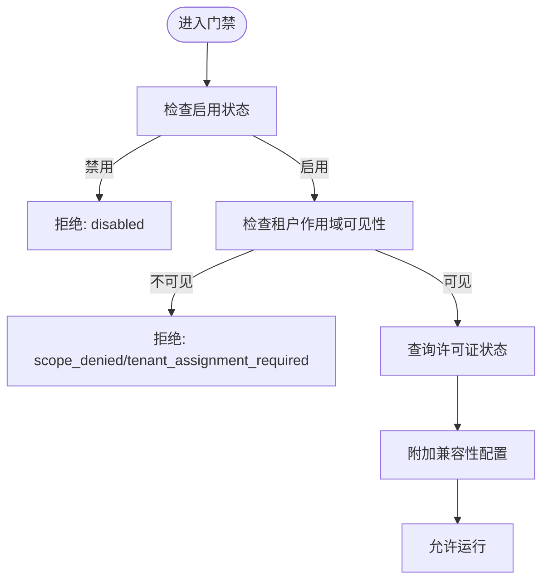
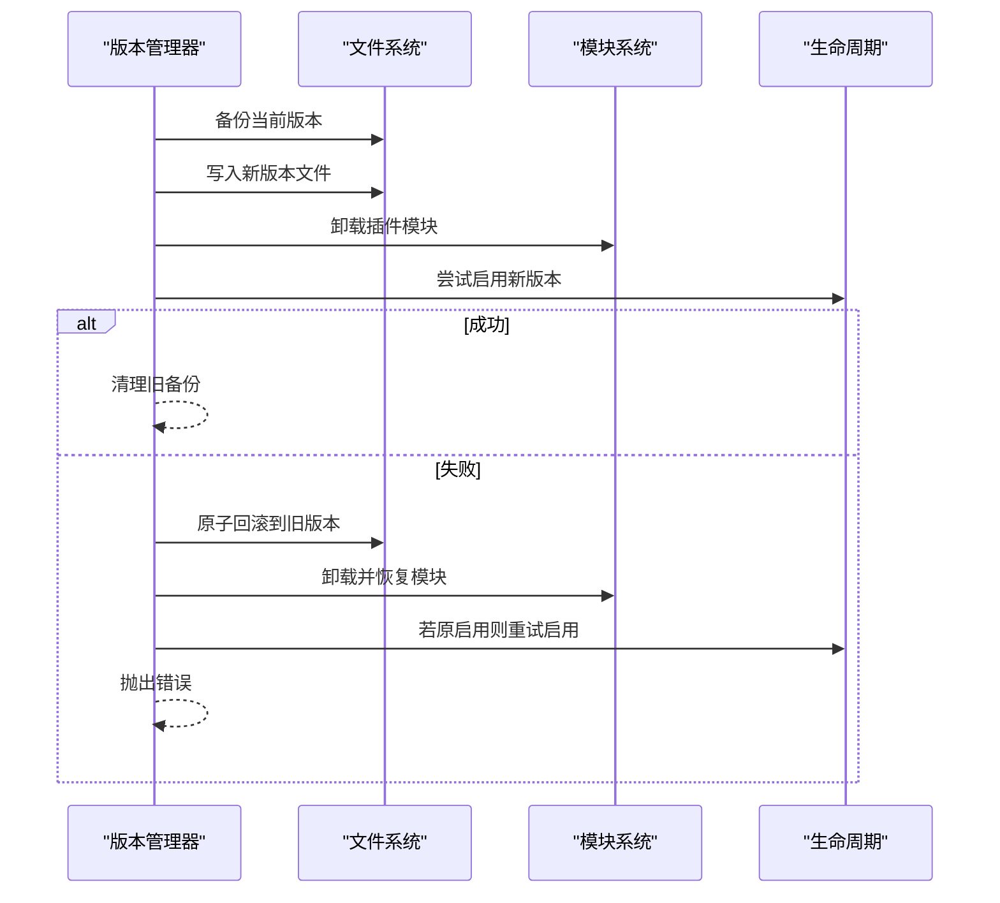
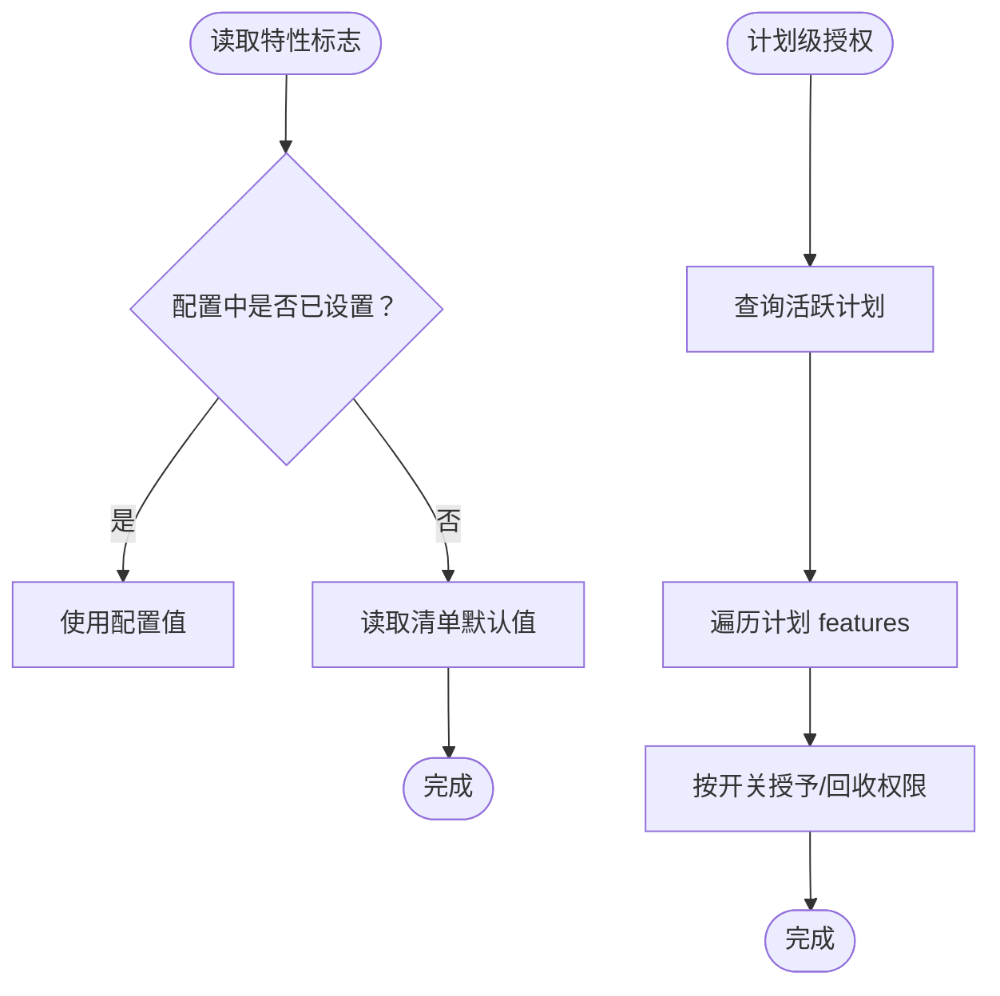
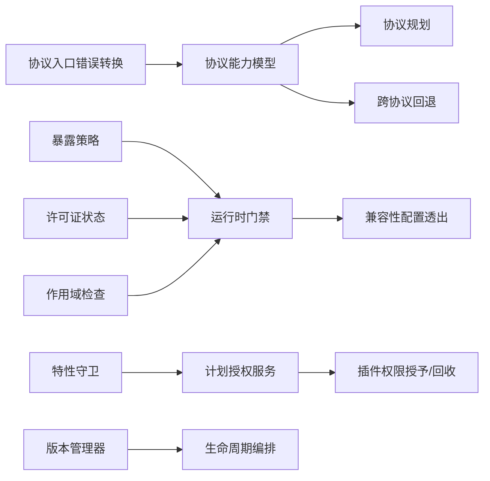

# 兼容性处理

<cite>
**本文引用的文件**
- [backend/app/ai/runtime/protocol_planner.py](file://backend/app/ai/runtime/protocol_planner.py)
- [backend/app/ai/adapters/openai_compatible/capabilities.py](file://backend/app/ai/adapters/openai_compatible/capabilities.py)
- [backend/app/ai/runtime/protocol_recovery_semantics.py](file://backend/app/ai/runtime/protocol_recovery_semantics.py)
- [backend/app/ai/adapters/openai_compatible/support/protocol_entrypoints.py](file://backend/app/ai/adapters/openai_compatible/support/protocol_entrypoints.py)
- [backend/app/plugins/runtime_gate.py](file://backend/app/plugins/runtime_gate.py)
- [backend/app/plugins/exposure_policy.py](file://backend/app/plugins/exposure_policy.py)
- [backend/app/plugins/version_manager.py](file://backend/app/plugins/version_manager.py)
- [backend/app/plugins/feature_entitlement_guards.py](file://backend/app/plugins/feature_entitlement_guards.py)
- [backend/app/services/tenant/tenant_plan_plugin_entitlement_service.py](file://backend/app/services/tenant/tenant_plan_plugin_entitlement_service.py)
- [backend/app/services/system/plugin_read_model_service.py](file://backend/app/services/system/plugin_read_model_service.py)
- [backend/app/plugins/lifecycle_orchestrator.py](file://backend/app/plugins/lifecycle_orchestrator.py)
- [backend/tests/test_plugin_api_dispatcher_security.py](file://backend/tests/test_plugin_api_dispatcher_security.py)
- [backend/tests/services/test_ai_provider_service.py](file://backend/tests/services/test_ai_provider_service.py)
- [backend/tests/services/test_runtime_diagnostics_service.py](file://backend/tests/services/test_runtime_diagnostics_service.py)
- [backend/tests/test_plugin_version_manager_locking.py](file://backend/tests/test_plugin_version_manager_locking.py)
- [backend/tests/test_retired_model_schema_fields.py](file://backend/tests/test_retired_model_schema_fields.py)
</cite>

## 目录
1. [引言](#引言)
2. [项目结构](#项目结构)
3. [核心组件](#核心组件)
4. [架构总览](#架构总览)
5. [详细组件分析](#详细组件分析)
6. [依赖关系分析](#依赖关系分析)
7. [性能考量](#性能考量)
8. [故障排查指南](#故障排查指南)
9. [结论](#结论)
10. [附录](#附录)

## 引言
本文件系统化梳理本仓库在“兼容性处理”方面的设计与实现，覆盖以下主题：
- 向后兼容性保证机制：协议能力协商、弃用字段拦截、跨协议回退策略
- API 变更处理策略：协议路径规范化、主协议与允许协议集校验、运行时强制协议解析
- 客户端适配方案：协议门禁、租户可见性与授权、许可证状态联动
- 插件兼容性检查：清单暴露策略、功能权限控制、版本管理与回滚
- API 版本管理与字段废弃：弃用字段拒绝、兼容性配置透出、数据格式迁移指引
- 协议升级与错误码演进：错误转换、重试语义、诊断证据
- 功能开关、渐进式发布与 A/B 测试：特性标志、计划级功能授权、平台存储驱动
- 兼容性测试策略：回归测试、弃用字段验证、版本锁定与回滚验证
- 多版本共存与平滑过渡：版本备份、并发锁、应急回滚

## 项目结构
本项目的兼容性相关逻辑主要分布在以下模块：
- AI 协议层：协议规划、能力协商、恢复语义与入口点错误转换
- 插件系统：运行时门禁、暴露策略、版本管理、特性授权守卫
- 租户与系统服务：插件兼容性配置透出、计划级插件授权同步
- 测试：弃用字段拒绝、运行时诊断、版本管理锁定与回滚

**图表来源**
- [backend/app/ai/runtime/protocol_planner.py:45-80](file://backend/app/ai/runtime/protocol_planner.py#L45-L80)
- [backend/app/ai/adapters/openai_compatible/capabilities.py:220-345](file://backend/app/ai/adapters/openai_compatible/capabilities.py#L220-L345)
- [backend/app/ai/runtime/protocol_recovery_semantics.py:82-116](file://backend/app/ai/runtime/protocol_recovery_semantics.py#L82-L116)
- [backend/app/ai/adapters/openai_compatible/support/protocol_entrypoints.py:55-89](file://backend/app/ai/adapters/openai_compatible/support/protocol_entrypoints.py#L55-L89)
- [backend/app/plugins/runtime_gate.py:96-160](file://backend/app/plugins/runtime_gate.py#L96-L160)
- [backend/app/plugins/exposure_policy.py](file://backend/app/plugins/exposure_policy.py)
- [backend/app/plugins/version_manager.py:218-247](file://backend/app/plugins/version_manager.py#L218-L247)
- [backend/app/plugins/feature_entitlement_guards.py:43-84](file://backend/app/plugins/feature_entitlement_guards.py#L43-L84)
- [backend/app/services/tenant/tenant_plan_plugin_entitlement_service.py:150-184](file://backend/app/services/tenant/tenant_plan_plugin_entitlement_service.py#L150-L184)
- [backend/app/services/system/plugin_read_model_service.py:279-309](file://backend/app/services/system/plugin_read_model_service.py#L279-L309)

**章节来源**
- [backend/app/ai/runtime/protocol_planner.py:45-80](file://backend/app/ai/runtime/protocol_planner.py#L45-L80)
- [backend/app/ai/adapters/openai_compatible/capabilities.py:220-345](file://backend/app/ai/adapters/openai_compatible/capabilities.py#L220-L345)
- [backend/app/plugins/runtime_gate.py:96-160](file://backend/app/plugins/runtime_gate.py#L96-L160)
- [backend/app/plugins/version_manager.py:218-247](file://backend/app/plugins/version_manager.py#L218-L247)
- [backend/app/services/system/plugin_read_model_service.py:279-309](file://backend/app/services/system/plugin_read_model_service.py#L279-L309)

## 核心组件
- 协议规划与契约校验：负责协议令牌与契约合法性校验，确保主协议与允许协议集合一致且可被运行时解析。
- 协议能力模型：集中定义允许的线缆协议、主协议、跨协议回退映射，并提供支持查询与运行时强制解析。
- 跨协议回退语义：基于错误类型与工具使用情况判定是否进行协议回退，避免对不可回退场景误触发。
- 插件运行时门禁：结合许可证状态、作用域可见性、启用状态与兼容性配置，统一判定运行时准入。
- 插件暴露策略：从清单派生面向租户的运行时作用域与可见性策略，作为门禁决策依据。
- 版本管理与回滚：提供插件版本升级与回滚流程，含并发锁、备份恢复与模块卸载。
- 特性授权守卫与计划同步：按租户计划与特性开关动态授予或回收插件权限，支撑渐进式发布。

**章节来源**
- [backend/app/ai/runtime/protocol_planner.py:110-150](file://backend/app/ai/runtime/protocol_planner.py#L110-L150)
- [backend/app/ai/adapters/openai_compatible/capabilities.py:315-345](file://backend/app/ai/adapters/openai_compatible/capabilities.py#L315-L345)
- [backend/app/ai/runtime/protocol_recovery_semantics.py:82-116](file://backend/app/ai/runtime/protocol_recovery_semantics.py#L82-L116)
- [backend/app/plugins/runtime_gate.py:96-160](file://backend/app/plugins/runtime_gate.py#L96-L160)
- [backend/app/plugins/exposure_policy.py](file://backend/app/plugins/exposure_policy.py)
- [backend/app/plugins/version_manager.py:218-247](file://backend/app/plugins/version_manager.py#L218-L247)
- [backend/app/plugins/feature_entitlement_guards.py:43-84](file://backend/app/plugins/feature_entitlement_guards.py#L43-L84)

## 架构总览
下图展示兼容性相关的关键交互：协议层负责能力协商与错误转换，插件层负责门禁与授权，服务层负责兼容性配置透出与计划同步。

**图表来源**
- [backend/app/plugins/runtime_gate.py:96-160](file://backend/app/plugins/runtime_gate.py#L96-L160)
- [backend/app/plugins/exposure_policy.py](file://backend/app/plugins/exposure_policy.py)
- [backend/app/ai/runtime/protocol_recovery_semantics.py:82-116](file://backend/app/ai/runtime/protocol_recovery_semantics.py#L82-L116)

## 详细组件分析

### 协议能力与契约校验
- 主协议与允许协议集合：通过显式声明与归一化合并，确保主协议必须在允许集合内，否则抛出无效契约错误。
- 弃用字段拦截：明确拒绝使用已退休的 wire_api 字段，防止旧配置生效。
- 运行时强制协议解析：当运行时强制协议为空或不被允许时，回退为主协议，保证稳定性。

**图表来源**
- [backend/app/ai/adapters/openai_compatible/capabilities.py:220-345](file://backend/app/ai/adapters/openai_compatible/capabilities.py#L220-L345)
- [backend/app/ai/runtime/protocol_planner.py:110-150](file://backend/app/ai/runtime/protocol_planner.py#L110-L150)

**章节来源**
- [backend/app/ai/adapters/openai_compatible/capabilities.py:220-345](file://backend/app/ai/adapters/openai_compatible/capabilities.py#L220-L345)
- [backend/app/ai/runtime/protocol_planner.py:110-150](file://backend/app/ai/runtime/protocol_planner.py#L110-L150)

### 协议回退与错误码演进
- 回退触发条件：仅在使用 responses 协议、开启回退开关、工具存在或 tool_choice 存在、且错误状态码为 5xx 时不阻断回退时才执行。
- 错误转换：将上游错误转换为网关错误并记录日志，区分可重试与不可重试场景。
- 诊断证据：运行时诊断报告中包含协议回退阻断原因与当前协议路径，便于定位问题。

**图表来源**
- [backend/app/ai/runtime/protocol_recovery_semantics.py:82-116](file://backend/app/ai/runtime/protocol_recovery_semantics.py#L82-L116)
- [backend/app/ai/adapters/openai_compatible/support/protocol_entrypoints.py:55-89](file://backend/app/ai/adapters/openai_compatible/support/protocol_entrypoints.py#L55-L89)
- [backend/tests/services/test_runtime_diagnostics_service.py:405-410](file://backend/tests/services/test_runtime_diagnostics_service.py#L405-L410)

**章节来源**
- [backend/app/ai/runtime/protocol_recovery_semantics.py:82-116](file://backend/app/ai/runtime/protocol_recovery_semantics.py#L82-L116)
- [backend/app/ai/adapters/openai_compatible/support/protocol_entrypoints.py:55-89](file://backend/app/ai/adapters/openai_compatible/support/protocol_entrypoints.py#L55-L89)
- [backend/tests/services/test_runtime_diagnostics_service.py:405-410](file://backend/tests/services/test_runtime_diagnostics_service.py#L405-L410)

### 插件运行时门禁与兼容性配置
- 门禁判定链：启用状态、租户作用域可见性、许可证状态、兼容性配置透出。
- 兼容性配置透出：服务层在插件列表响应中附加兼容性配置，便于前端与运维识别。
- 权限同步与激活：生命周期编排器在安装/启用前确保权限声明与数据库一致，并激活对应权限。

**图表来源**
- [backend/app/plugins/runtime_gate.py:96-160](file://backend/app/plugins/runtime_gate.py#L96-L160)
- [backend/app/services/system/plugin_read_model_service.py:279-309](file://backend/app/services/system/plugin_read_model_service.py#L279-L309)
- [backend/app/plugins/lifecycle_orchestrator.py:206-238](file://backend/app/plugins/lifecycle_orchestrator.py#L206-L238)

**章节来源**
- [backend/app/plugins/runtime_gate.py:96-160](file://backend/app/plugins/runtime_gate.py#L96-L160)
- [backend/app/services/system/plugin_read_model_service.py:279-309](file://backend/app/services/system/plugin_read_model_service.py#L279-L309)
- [backend/app/plugins/lifecycle_orchestrator.py:206-238](file://backend/app/plugins/lifecycle_orchestrator.py#L206-L238)

### 版本管理与应急回滚
- 升级流程：记录旧版本备份，若失败则原子性回滚至旧版本并恢复模块状态。
- 回滚流程：对单插件加锁，恢复目标版本目录，卸载模块并更新版本状态。
- 并发安全：通过插件级锁避免并发升级/回滚导致的竞争条件。

**图表来源**
- [backend/app/plugins/version_manager.py:218-247](file://backend/app/plugins/version_manager.py#L218-L247)
- [backend/tests/test_plugin_version_manager_locking.py:44-164](file://backend/tests/test_plugin_version_manager_locking.py#L44-L164)

**章节来源**
- [backend/app/plugins/version_manager.py:218-247](file://backend/app/plugins/version_manager.py#L218-L247)
- [backend/tests/test_plugin_version_manager_locking.py:44-164](file://backend/tests/test_plugin_version_manager_locking.py#L44-L164)

### 特性开关、计划授权与渐进式发布
- 特性标志：从插件配置的 _feature_flags 读取，若未设置则回退到清单 features 的 default 值，默认启用。
- 计划级授权：根据活跃租户计划的 features 开关，动态授予或回收插件权限，支持按计划维度的渐进式发布。
- 平台存储驱动：从平台配置读取存储驱动，用于兼容性判断与部署策略选择。

**图表来源**
- [backend/app/plugins/context.py:941-955](file://backend/app/plugins/context.py#L941-L955)
- [backend/app/services/tenant/tenant_plan_plugin_entitlement_service.py:150-184](file://backend/app/services/tenant/tenant_plan_plugin_entitlement_service.py#L150-L184)
- [backend/app/plugins/feature_entitlement_guards.py:77-84](file://backend/app/plugins/feature_entitlement_guards.py#L77-L84)

**章节来源**
- [backend/app/plugins/context.py:941-955](file://backend/app/plugins/context.py#L941-L955)
- [backend/app/services/tenant/tenant_plan_plugin_entitlement_service.py:150-184](file://backend/app/services/tenant/tenant_plan_plugin_entitlement_service.py#L150-L184)
- [backend/app/plugins/feature_entitlement_guards.py:77-84](file://backend/app/plugins/feature_entitlement_guards.py#L77-L84)

### 字段废弃与数据格式迁移
- 弃用字段拒绝：在协议能力与提供者服务中明确拒绝 wire_api 等已退休字段，防止历史配置污染。
- 数据格式隐藏：在响应模型中对非 ID 形态的敏感字段进行隐藏，避免泄露存量数据。
- 迁移指引：建议通过清单 features.default 与计划 features 开关实现平滑迁移，配合版本管理与回滚保障。

**章节来源**
- [backend/tests/services/test_ai_provider_service.py:54-97](file://backend/tests/services/test_ai_provider_service.py#L54-L97)
- [backend/tests/test_retired_model_schema_fields.py:314-356](file://backend/tests/test_retired_model_schema_fields.py#L314-L356)

## 依赖关系分析
- 协议层依赖于能力模型与恢复语义，入口点负责错误转换与日志记录。
- 插件门禁依赖暴露策略与许可证状态，同时透出兼容性配置供上层使用。
- 版本管理器与生命周期编排器协作，确保升级/回滚的原子性与一致性。
- 计划级授权服务与特性守卫共同实现渐进式发布与权限治理。

**图表来源**
- [backend/app/ai/adapters/openai_compatible/capabilities.py:315-345](file://backend/app/ai/adapters/openai_compatible/capabilities.py#L315-L345)
- [backend/app/ai/runtime/protocol_recovery_semantics.py:82-116](file://backend/app/ai/runtime/protocol_recovery_semantics.py#L82-L116)
- [backend/app/ai/adapters/openai_compatible/support/protocol_entrypoints.py:55-89](file://backend/app/ai/adapters/openai_compatible/support/protocol_entrypoints.py#L55-L89)
- [backend/app/plugins/exposure_policy.py](file://backend/app/plugins/exposure_policy.py)
- [backend/app/plugins/runtime_gate.py:96-160](file://backend/app/plugins/runtime_gate.py#L96-L160)
- [backend/app/services/system/plugin_read_model_service.py:279-309](file://backend/app/services/system/plugin_read_model_service.py#L279-L309)
- [backend/app/services/tenant/tenant_plan_plugin_entitlement_service.py:150-184](file://backend/app/services/tenant/tenant_plan_plugin_entitlement_service.py#L150-L184)
- [backend/app/plugins/feature_entitlement_guards.py:43-84](file://backend/app/plugins/feature_entitlement_guards.py#L43-L84)
- [backend/app/plugins/version_manager.py:218-247](file://backend/app/plugins/version_manager.py#L218-L247)

**章节来源**
- [backend/app/ai/adapters/openai_compatible/capabilities.py:315-345](file://backend/app/ai/adapters/openai_compatible/capabilities.py#L315-L345)
- [backend/app/plugins/runtime_gate.py:96-160](file://backend/app/plugins/runtime_gate.py#L96-L160)
- [backend/app/services/system/plugin_read_model_service.py:279-309](file://backend/app/services/system/plugin_read_model_service.py#L279-L309)
- [backend/app/services/tenant/tenant_plan_plugin_entitlement_service.py:150-184](file://backend/app/services/tenant/tenant_plan_plugin_entitlement_service.py#L150-L184)
- [backend/app/plugins/version_manager.py:218-247](file://backend/app/plugins/version_manager.py#L218-L247)

## 性能考量
- 协议回退仅在特定错误与工具条件下触发，避免不必要的协议切换开销。
- 门禁与授权检查采用数据库查询与缓存策略，建议在高并发场景下优化索引与连接池。
- 版本管理器在升级失败时进行原子回滚，减少停机时间，但需注意磁盘 IO 与模块卸载成本。

## 故障排查指南
- 协议契约错误：检查主协议是否在允许集合内，确认未使用已退休字段。
- 运行时回退失败：查看诊断报告中的回退阻断原因与协议路径，确认错误类型与工具配置。
- 插件门禁拒绝：核对启用状态、租户作用域可见性、许可证状态与兼容性配置。
- 权限同步失败：确认插件权限声明与数据库同步数量一致，必要时重新同步。
- 版本回滚异常：检查插件级锁是否释放、备份目录是否存在、模块卸载是否成功。

**章节来源**
- [backend/tests/services/test_ai_provider_service.py:54-97](file://backend/tests/services/test_ai_provider_service.py#L54-L97)
- [backend/tests/services/test_runtime_diagnostics_service.py:405-410](file://backend/tests/services/test_runtime_diagnostics_service.py#L405-L410)
- [backend/app/plugins/runtime_gate.py:96-160](file://backend/app/plugins/runtime_gate.py#L96-L160)
- [backend/app/plugins/lifecycle_orchestrator.py:206-238](file://backend/app/plugins/lifecycle_orchestrator.py#L206-L238)
- [backend/tests/test_plugin_version_manager_locking.py:44-164](file://backend/tests/test_plugin_version_manager_locking.py#L44-L164)

## 结论
本仓库通过“协议能力模型 + 运行时门禁 + 版本管理 + 计划授权”的组合拳，实现了稳健的向后兼容与平滑演进。弃用字段拦截与跨协议回退语义有效降低了升级风险；特性开关与计划授权支撑渐进式发布；版本管理与回滚保障了多版本共存与应急回退。建议在生产环境中结合监控与诊断报告持续优化门禁与回退策略，确保兼容性与稳定性双达标。

## 附录
- 兼容性测试策略建议：
  - 弃用字段拒绝：针对协议能力与提供者服务新增测试用例，覆盖 wire_api 与相关回退字段。
  - 运行时诊断：模拟不同错误类型与工具配置，验证回退触发与阻断原因。
  - 版本管理：验证升级失败回滚、并发锁、模块卸载与启用恢复。
  - 权限同步：验证权限声明与数据库写入一致性、启用状态匹配。
- 回归测试与性能评估：
  - 回归测试：覆盖协议契约、门禁判定、版本升级/回滚、特性开关与计划授权。
  - 性能评估：关注门禁查询、回退触发频率、版本切换耗时与模块加载时间。