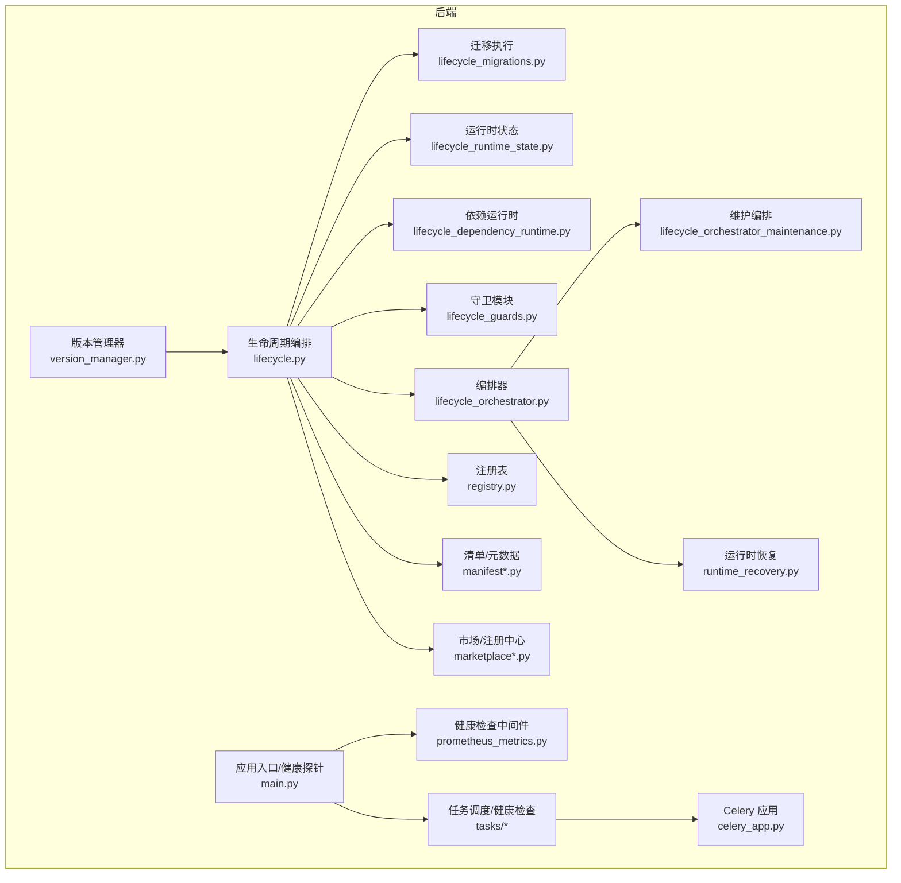
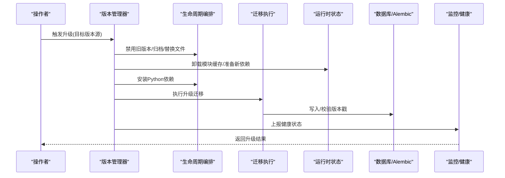
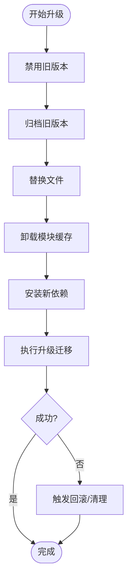
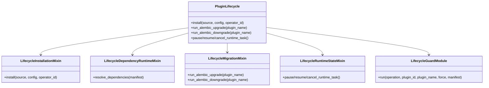
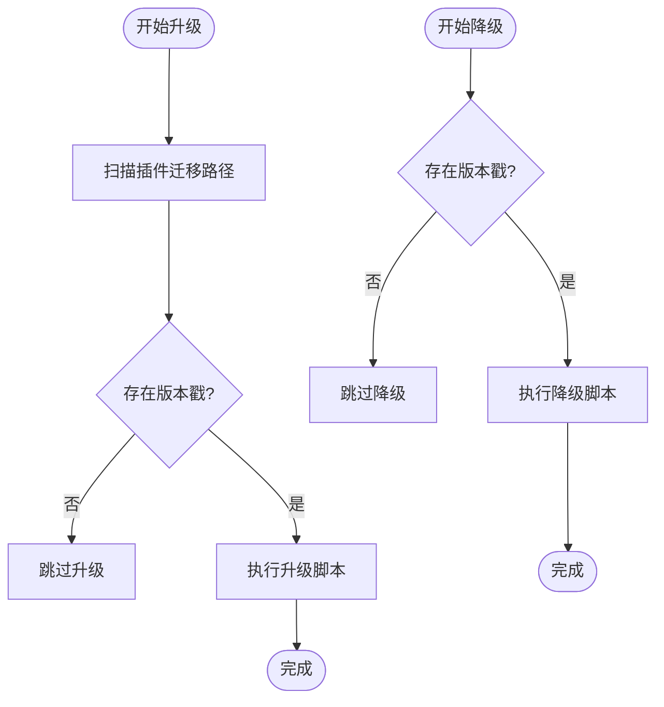
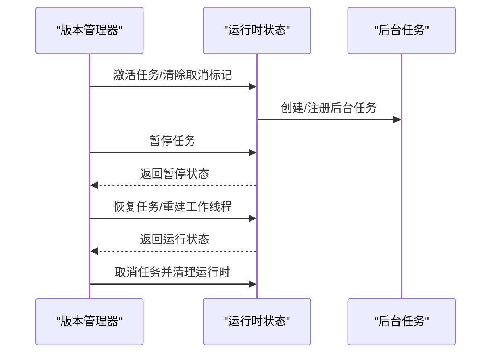
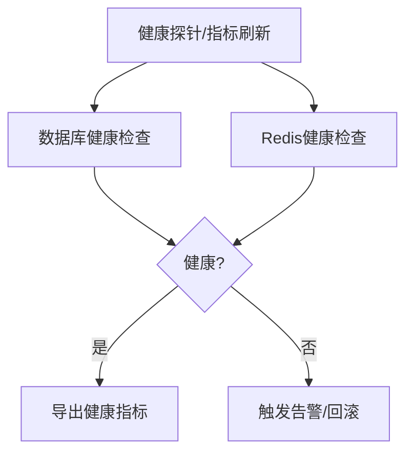
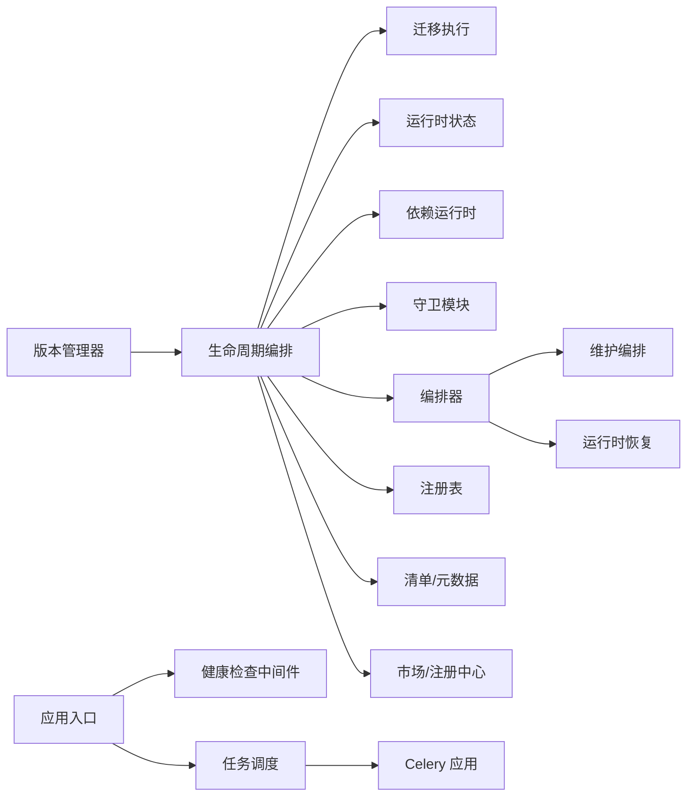

# 升级策略

<cite>

**本文引用的文件**
- [backend/app/plugins/version_manager.py](file://backend/app/plugins/version_manager.py)
- [backend/app/plugins/lifecycle_migrations.py](file://backend/app/plugins/lifecycle_migrations.py)
- [backend/app/plugins/lifecycle.py](file://backend/app/plugins/lifecycle.py)
- [backend/app/plugins/lifecycle_installation.py](file://backend/app/plugins/lifecycle_installation.py)
- [backend/app/plugins/lifecycle_parts/facade_modules.py](file://backend/app/plugins/lifecycle_parts/facade_modules.py)
- [backend/app/plugins/lifecycle_parts/__init__.py](file://backend/app/plugins/lifecycle_parts/__init__.py)
- [backend/app/plugins/lifecycle_runtime_state.py](file://backend/app/plugins/lifecycle_runtime_state.py)
- [backend/app/plugins/lifecycle_dependency_runtime.py](file://backend/app/plugins/lifecycle_dependency_runtime.py)
- [backend/app/plugins/lifecycle_guards.py](file://backend/app/plugins/lifecycle_guards.py)
- [backend/app/plugins/lifecycle_orchestrator.py](file://backend/app/plugins/lifecycle_orchestrator.py)
- [backend/app/plugins/lifecycle_orchestrator_maintenance.py](file://backend/app/plugins/lifecycle_orchestrator_maintenance.py)
- [backend/app/plugins/runtime_recovery.py](file://backend/app/plugins/runtime_recovery.py)
- [backend/app/plugins/registry.py](file://backend/app/plugins/registry.py)
- [backend/app/plugins/manifest.py](file://backend/app/plugins/manifest.py)
- [backend/app/plugins/manifest_helpers.py](file://backend/app/plugins/manifest_helpers.py)
- [backend/app/plugins/manifest_metadata_schemas.py](file://backend/app/plugins/manifest_metadata_schemas.py)
- [backend/app/plugins/marketplace.py](file://backend/app/plugins/marketplace.py)
- [backend/app/plugins/marketplace_registry.py](file://backend/app/plugins/marketplace_registry.py)
- [backend/app/plugins/update_checker.py](file://backend/app/plugins/update_checker.py)
- [backend/app/plugins/scheduler_refresh.py](file://backend/app/plugins/scheduler_refresh.py)
- [backend/app/plugins/system_hooks.py](file://backend/app/plugins/system_hooks.py)
- [backend/app/plugins/webhook_dispatcher.py](file://backend/app/plugins/webhook_dispatcher.py)
- [backend/app/plugins/asset_runtime.py](file://backend/app/plugins/asset_runtime.py)
- [backend/app/plugins/crypto.py](file://backend/app/plugins/crypto.py)
- [backend/app/plugins/security.py](file://backend/app/plugins/security.py)
- [backend/app/plugins/preview.py](file://backend/app/plugins/preview.py)
- [backend/app/plugins/progress.py](file://backend/app/plugins/progress.py)
- [backend/app/plugins/context.py](file://backend/app/plugins/context.py)
- [backend/app/plugins/context_factory.py](file://backend/app/plugins/context_factory.py)
- [backend/app/plugins/context_primitives.py](file://backend/app/plugins/context_primitives.py)
- [backend/app/plugins/event_bus.py](file://backend/app/plugins/event_bus.py)
- [backend/app/plugins/startup.py](file://backend/app/plugins/startup.py)
- [backend/app/plugins/backup.py](file://backend/app/plugins/backup.py)
- [backend/app/plugins/license.py](file://backend/app/plugins/license.py)
- [backend/app/plugins/feature_entitlement_guards.py](file://backend/app/plugins/feature_entitlement_guards.py)
- [backend/app/plugins/exposure_policy.py](file://backend/app/plugins/exposure_policy.py)
- [backend/app/plugins/host_read_facade.py](file://backend/app/plugins/host_read_facade.py)
- [backend/app/plugins/runtime_gate.py](file://backend/app/plugins/runtime_gate.py)
- [backend/app/plugins/scope.py](file://backend/app/plugins/scope.py)
- [backend/app/plugins/tenant_plan_preflight.py](file://backend/app/plugins/tenant_plan_preflight.py)
- [backend/app/plugins/dependencies.py](file://backend/app/plugins/dependencies.py)
- [backend/app/plugins/loader.py](file://backend/app/plugins/loader.py)
- [backend/app/plugins/base.py](file://backend/app/plugins/base.py)
- [backend/app/plugins/_extension_registrar.py](file://backend/app/plugins/_extension_registrar.py)
- [backend/app/plugins/api_dispatcher.py](file://backend/app/plugins/api_dispatcher.py)
- [backend/app/plugins/frontend_contract.py](file://backend/app/plugins/frontend_contract.py)
- [backend/app/plugins/frontend_contract_checks.py](file://backend/app/plugins/frontend_contract_checks.py)
- [backend/app/plugins/health.py](file://backend/app/plugins/health.py)
- [backend/app/middleware/prometheus_metrics.py](file://backend/app/middleware/prometheus_metrics.py)
- [backend/app/main.py](file://backend/app/main.py)
- [backend/app/tasks/ai_health_check.py](file://backend/app/tasks/ai_health_check.py)
- [backend/app/tasks/scheduled.py](file://backend/app/tasks/scheduled.py)
- [backend/app/tasks/scheduler.py](file://backend/app/tasks/scheduler.py)
- [backend/app/tasks/task_scheduling.py](file://backend/app/tasks/task_scheduling.py)
- [backend/app/tasks/async_db.py](file://backend/app/tasks/async_db.py)
- [backend/app/tasks/base.py](file://backend/app/tasks/base.py)
- [backend/app/tasks/email.py](file://backend/app/tasks/email.py)
- [backend/app/tasks/notification.py](file://backend/app/tasks/notification.py)
- [backend/app/tasks/notification_cleanup.py](file://backend/app/tasks/notification_cleanup.py)
- [backend/app/tasks/upload_cleanup.py](file://backend/app/tasks/upload_cleanup.py)
- [backend/app/tasks/recycle_bin.py](file://backend/app/tasks/recycle_bin.py)
- [backend/app/tasks/ssl_tasks.py](file://backend/app/tasks/ssl_tasks.py)
- [backend/app/tasks/agent_batch.py](file://backend/app/tasks/agent_batch.py)
- [backend/app/tasks/ai.py](file://backend/app/tasks/ai.py)
- [backend/app/celery_app.py](file://backend/app/celery_app.py)
- [backend/app/cli_commands/health_commands.py](file://backend/app/cli_commands/health_commands.py)
- [backend/app/cli_commands/state.py](file://backend/app/cli_commands/state.py)
- [backend/app/cli_commands/entrypoint.py](file://backend/app/cli_commands/entrypoint.py)
- [backend/app/cli_commands/trace_commands.py](file://backend/app/cli_commands/trace_commands.py)
- [backend/app/cli_commands/ai_commands.py](file://backend/app/cli_commands/ai_commands.py)
- [backend/app/cli_commands/ai_norm.py](file://backend/app/cli_commands/ai_norm.py)
- [backend/app/cli_commands/ai_render.py](file://backend/app/cli_commands/ai_render.py)
- [backend/app/cli_commands/ai_snapshot.py](file://backend/app/cli_commands/ai_snapshot.py)
- [backend/app/cli_commands/codegen_core.py](file://backend/app/cli_commands/codegen_core.py)
- [backend/app/cli_commands/codegen_manage.py](file://backend/app/cli_commands/codegen_manage.py)
- [backend/app/cli_commands/core_commands.py](file://backend/app/cli_commands/core_commands.py)
</cite>

## 目录
1. [引言](#引言)
2. [项目结构](#项目结构)
3. [核心组件](#核心组件)
4. [架构总览](#架构总览)
5. [详细组件分析](#详细组件分析)
6. [依赖分析](#依赖分析)
7. [性能考虑](#性能考虑)
8. [故障排查指南](#故障排查指南)
9. [结论](#结论)
10. [附录](#附录)

## 引言
本文件面向升级策略的系统性技术文档，覆盖增量升级、批量升级与零停机升级的实施方案；明确升级前准备、风险评估与回滚策略；细化热升级、蓝绿部署、金丝雀发布步骤；梳理升级顺序、依赖关系与并发控制；阐述升级监控、健康检查与故障恢复机制；给出升级测试环境搭建、自动化测试与质量保证流程；并总结生产环境最佳实践、应急处理程序与客户沟通策略。

## 项目结构
后端采用插件化架构，升级能力围绕“版本管理器”“生命周期编排”“迁移执行”“运行时状态”等模块协同实现。前端通过构建脚本与部署工具链支撑发布流程。

图示来源
- [backend/app/plugins/version_manager.py](file://backend/app/plugins/version_manager.py)
- [backend/app/plugins/lifecycle.py](file://backend/app/plugins/lifecycle.py)
- [backend/app/plugins/lifecycle_migrations.py](file://backend/app/plugins/lifecycle_migrations.py)
- [backend/app/plugins/lifecycle_runtime_state.py](file://backend/app/plugins/lifecycle_runtime_state.py)
- [backend/app/plugins/lifecycle_dependency_runtime.py](file://backend/app/plugins/lifecycle_dependency_runtime.py)
- [backend/app/plugins/lifecycle_guards.py](file://backend/app/plugins/lifecycle_guards.py)
- [backend/app/plugins/lifecycle_orchestrator.py](file://backend/app/plugins/lifecycle_orchestrator.py)
- [backend/app/plugins/lifecycle_orchestrator_maintenance.py](file://backend/app/plugins/lifecycle_orchestrator_maintenance.py)
- [backend/app/plugins/runtime_recovery.py](file://backend/app/plugins/runtime_recovery.py)
- [backend/app/plugins/registry.py](file://backend/app/plugins/registry.py)
- [backend/app/plugins/manifest.py](file://backend/app/plugins/manifest.py)
- [backend/app/plugins/manifest_helpers.py](file://backend/app/plugins/manifest_helpers.py)
- [backend/app/plugins/manifest_metadata_schemas.py](file://backend/app/plugins/manifest_metadata_schemas.py)
- [backend/app/plugins/marketplace.py](file://backend/app/plugins/marketplace.py)
- [backend/app/plugins/marketplace_registry.py](file://backend/app/plugins/marketplace_registry.py)
- [backend/app/middleware/prometheus_metrics.py](file://backend/app/middleware/prometheus_metrics.py)
- [backend/app/main.py](file://backend/app/main.py)
- [backend/app/tasks/ai_health_check.py](file://backend/app/tasks/ai_health_check.py)
- [backend/app/tasks/scheduled.py](file://backend/app/tasks/scheduled.py)
- [backend/app/tasks/scheduler.py](file://backend/app/tasks/scheduler.py)
- [backend/app/tasks/task_scheduling.py](file://backend/app/tasks/task_scheduling.py)
- [backend/app/tasks/async_db.py](file://backend/app/tasks/async_db.py)
- [backend/app/tasks/base.py](file://backend/app/tasks/base.py)
- [backend/app/tasks/email.py](file://backend/app/tasks/email.py)
- [backend/app/tasks/notification.py](file://backend/app/tasks/notification.py)
- [backend/app/tasks/notification_cleanup.py](file://backend/app/tasks/notification_cleanup.py)
- [backend/app/tasks/upload_cleanup.py](file://backend/app/tasks/upload_cleanup.py)
- [backend/app/tasks/recycle_bin.py](file://backend/app/tasks/recycle_bin.py)
- [backend/app/tasks/ssl_tasks.py](file://backend/app/tasks/ssl_tasks.py)
- [backend/app/tasks/agent_batch.py](file://backend/app/tasks/agent_batch.py)
- [backend/app/tasks/ai.py](file://backend/app/tasks/ai.py)
- [backend/app/tasks/ai_health_check.py](file://backend/app/tasks/ai_health_check.py)
- [backend/app/celery_app.py](file://backend/app/celery_app.py)

章节来源
- [backend/app/plugins/version_manager.py](file://backend/app/plugins/version_manager.py)
- [backend/app/plugins/lifecycle.py](file://backend/app/plugins/lifecycle.py)
- [backend/app/plugins/lifecycle_migrations.py](file://backend/app/plugins/lifecycle_migrations.py)
- [backend/app/plugins/lifecycle_runtime_state.py](file://backend/app/plugins/lifecycle_runtime_state.py)
- [backend/app/plugins/lifecycle_dependency_runtime.py](file://backend/app/plugins/lifecycle_dependency_runtime.py)
- [backend/app/plugins/lifecycle_guards.py](file://backend/app/plugins/lifecycle_guards.py)
- [backend/app/plugins/lifecycle_orchestrator.py](file://backend/app/plugins/lifecycle_orchestrator.py)
- [backend/app/plugins/lifecycle_orchestrator_maintenance.py](file://backend/app/plugins/lifecycle_orchestrator_maintenance.py)
- [backend/app/plugins/runtime_recovery.py](file://backend/app/plugins/runtime_recovery.py)
- [backend/app/plugins/registry.py](file://backend/app/plugins/registry.py)
- [backend/app/plugins/manifest.py](file://backend/app/plugins/manifest.py)
- [backend/app/plugins/manifest_helpers.py](file://backend/app/plugins/manifest_helpers.py)
- [backend/app/plugins/manifest_metadata_schemas.py](file://backend/app/plugins/manifest_metadata_schemas.py)
- [backend/app/plugins/marketplace.py](file://backend/app/plugins/marketplace.py)
- [backend/app/plugins/marketplace_registry.py](file://backend/app/plugins/marketplace_registry.py)
- [backend/app/middleware/prometheus_metrics.py](file://backend/app/middleware/prometheus_metrics.py)
- [backend/app/main.py](file://backend/app/main.py)
- [backend/app/tasks/ai_health_check.py](file://backend/app/tasks/ai_health_check.py)
- [backend/app/tasks/scheduled.py](file://backend/app/tasks/scheduled.py)
- [backend/app/tasks/scheduler.py](file://backend/app/tasks/scheduler.py)
- [backend/app/tasks/task_scheduling.py](file://backend/app/tasks/task_scheduling.py)
- [backend/app/tasks/async_db.py](file://backend/app/tasks/async_db.py)
- [backend/app/tasks/base.py](file://backend/app/tasks/base.py)
- [backend/app/tasks/email.py](file://backend/app/tasks/email.py)
- [backend/app/tasks/notification.py](file://backend/app/tasks/notification.py)
- [backend/app/tasks/notification_cleanup.py](file://backend/app/tasks/notification_cleanup.py)
- [backend/app/tasks/upload_cleanup.py](file://backend/app/tasks/upload_cleanup.py)
- [backend/app/tasks/recycle_bin.py](file://backend/app/tasks/recycle_bin.py)
- [backend/app/tasks/ssl_tasks.py](file://backend/app/tasks/ssl_tasks.py)
- [backend/app/tasks/agent_batch.py](file://backend/app/tasks/agent_batch.py)
- [backend/app/tasks/ai.py](file://backend/app/tasks/ai.py)
- [backend/app/celery_app.py](file://backend/app/celery_app.py)

## 核心组件
- 版本管理器：负责插件版本升级的原子操作，包括禁用旧版本、归档、替换文件、卸载模块缓存、安装新依赖、执行迁移等步骤，并在失败时触发回滚。
- 生命周期编排：聚合安装、依赖、迁移、运行时状态、守卫等子模块，形成统一的升级/降级/回滚编排入口。
- 迁移执行：封装 Alembic 迁移的升级/降级逻辑，支持插件迁移路径扫描、版本戳校验与安全降级。
- 运行时状态：管理插件运行时锁、暂停/恢复/取消后台任务，保障升级过程中的并发一致性。
- 健康检查与监控：Prometheus 指标与应用健康探针，确保升级前后组件可用性与可观测性。
- 任务调度：异步任务与定时任务体系，支撑升级过程中的后台作业与健康巡检。

章节来源
- [backend/app/plugins/version_manager.py](file://backend/app/plugins/version_manager.py)
- [backend/app/plugins/lifecycle.py](file://backend/app/plugins/lifecycle.py)
- [backend/app/plugins/lifecycle_migrations.py](file://backend/app/plugins/lifecycle_migrations.py)
- [backend/app/plugins/lifecycle_runtime_state.py](file://backend/app/plugins/lifecycle_runtime_state.py)
- [backend/app/middleware/prometheus_metrics.py](file://backend/app/middleware/prometheus_metrics.py)
- [backend/app/main.py](file://backend/app/main.py)
- [backend/app/tasks/ai_health_check.py](file://backend/app/tasks/ai_health_check.py)
- [backend/app/tasks/scheduled.py](file://backend/app/tasks/scheduled.py)
- [backend/app/tasks/scheduler.py](file://backend/app/tasks/scheduler.py)
- [backend/app/tasks/task_scheduling.py](file://backend/app/tasks/task_scheduling.py)
- [backend/app/tasks/async_db.py](file://backend/app/tasks/async_db.py)
- [backend/app/tasks/base.py](file://backend/app/tasks/base.py)
- [backend/app/tasks/email.py](file://backend/app/tasks/email.py)
- [backend/app/tasks/notification.py](file://backend/app/tasks/notification.py)
- [backend/app/tasks/notification_cleanup.py](file://backend/app/tasks/notification_cleanup.py)
- [backend/app/tasks/upload_cleanup.py](file://backend/app/tasks/upload_cleanup.py)
- [backend/app/tasks/recycle_bin.py](file://backend/app/tasks/recycle_bin.py)
- [backend/app/tasks/ssl_tasks.py](file://backend/app/tasks/ssl_tasks.py)
- [backend/app/tasks/agent_batch.py](file://backend/app/tasks/agent_batch.py)
- [backend/app/tasks/ai.py](file://backend/app/tasks/ai.py)
- [backend/app/celery_app.py](file://backend/app/celery_app.py)

## 架构总览
下图展示升级从“版本管理器”到“生命周期编排”再到“迁移执行”的端到端流程，以及与运行时状态、健康检查、任务系统的交互。

图示来源
- [backend/app/plugins/version_manager.py](file://backend/app/plugins/version_manager.py)
- [backend/app/plugins/lifecycle.py](file://backend/app/plugins/lifecycle.py)
- [backend/app/plugins/lifecycle_migrations.py](file://backend/app/plugins/lifecycle_migrations.py)
- [backend/app/plugins/lifecycle_runtime_state.py](file://backend/app/plugins/lifecycle_runtime_state.py)
- [backend/app/middleware/prometheus_metrics.py](file://backend/app/middleware/prometheus_metrics.py)
- [backend/app/main.py](file://backend/app/main.py)

## 详细组件分析

### 版本管理器（插件升级核心）
- 关键职责
  - 禁用旧版本并归档
  - 替换文件与清理模块缓存
  - 安装新版本 Python 依赖
  - 调用生命周期接口执行 Alembic 升级
  - 失败时触发回滚与清理
- 并发与锁
  - 升级过程中对插件加锁，确保同一时间仅一个版本变更
  - 升级前后维护回滚缓存一致性
- 回滚策略
  - 降级路径由生命周期迁移模块提供，支持安全降级与版本戳校验
  - 运行时状态模块支持暂停/恢复/取消后台任务，便于在升级中止时快速恢复

图示来源
- [backend/app/plugins/version_manager.py](file://backend/app/plugins/version_manager.py)
- [backend/app/plugins/lifecycle_migrations.py](file://backend/app/plugins/lifecycle_migrations.py)
- [backend/app/plugins/lifecycle_runtime_state.py](file://backend/app/plugins/lifecycle_runtime_state.py)

章节来源
- [backend/app/plugins/version_manager.py](file://backend/app/plugins/version_manager.py)
- [backend/app/plugins/lifecycle_migrations.py](file://backend/app/plugins/lifecycle_migrations.py)
- [backend/app/plugins/lifecycle_runtime_state.py](file://backend/app/plugins/lifecycle_runtime_state.py)
- [backend/tests/test_plugin_version_manager_locking.py](file://backend/tests/test_plugin_version_manager_locking.py)

### 生命周期编排（Facade 组合）
- 组成
  - 安装/回滚混入：安装流程的10步编排
  - 依赖运行时混入：解析与满足依赖关系
  - 迁移混入：升级/降级迁移
  - 运行时状态混入：锁、暂停/恢复/取消后台任务
  - 守卫模块：升级前的安全检查
  - 编排器与维护编排：升级/降级/回滚的整体编排
  - 注册表/清单/市场：版本发现与来源管理
- 设计要点
  - Facade 模式组合多个 Mixin，提升可扩展性与内聚性
  - 依赖解析与版本约束在运行时验证，避免不兼容升级

图示来源
- [backend/app/plugins/lifecycle.py](file://backend/app/plugins/lifecycle.py)
- [backend/app/plugins/lifecycle_installation.py](file://backend/app/plugins/lifecycle_installation.py)
- [backend/app/plugins/lifecycle_dependency_runtime.py](file://backend/app/plugins/lifecycle_dependency_runtime.py)
- [backend/app/plugins/lifecycle_migrations.py](file://backend/app/plugins/lifecycle_migrations.py)
- [backend/app/plugins/lifecycle_runtime_state.py](file://backend/app/plugins/lifecycle_runtime_state.py)
- [backend/app/plugins/lifecycle_parts/facade_modules.py](file://backend/app/plugins/lifecycle_parts/facade_modules.py)
- [backend/app/plugins/lifecycle_parts/__init__.py](file://backend/app/plugins/lifecycle_parts/__init__.py)

章节来源
- [backend/app/plugins/lifecycle.py](file://backend/app/plugins/lifecycle.py)
- [backend/app/plugins/lifecycle_installation.py](file://backend/app/plugins/lifecycle_installation.py)
- [backend/app/plugins/lifecycle_dependency_runtime.py](file://backend/app/plugins/lifecycle_dependency_runtime.py)
- [backend/app/plugins/lifecycle_migrations.py](file://backend/app/plugins/lifecycle_migrations.py)
- [backend/app/plugins/lifecycle_runtime_state.py](file://backend/app/plugins/lifecycle_runtime_state.py)
- [backend/app/plugins/lifecycle_parts/facade_modules.py](file://backend/app/plugins/lifecycle_parts/facade_modules.py)
- [backend/app/plugins/lifecycle_parts/__init__.py](file://backend/app/plugins/lifecycle_parts/__init__.py)

### 迁移执行（Alembic 升级/降级）
- 安全升级
  - 插件迁移路径扫描与版本戳校验，避免误降主工程迁移
  - 不自动清理 alembic_version，保持版本历史完整性
- 安全降级
  - 仅当存在版本戳时执行降级，防止无迁移场景误操作
  - 通过直接查询 alembic_version 表，减少外部命令依赖

图示来源
- [backend/app/plugins/lifecycle_migrations.py](file://backend/app/plugins/lifecycle_migrations.py)
- [backend/tests/test_plugin_lifecycle_migrations.py](file://backend/tests/test_plugin_lifecycle_migrations.py)

章节来源
- [backend/app/plugins/lifecycle_migrations.py](file://backend/app/plugins/lifecycle_migrations.py)
- [backend/tests/test_plugin_lifecycle_migrations.py](file://backend/tests/test_plugin_lifecycle_migrations.py)

### 运行时状态与并发控制
- 后台任务生命周期
  - 支持暂停/恢复/取消运行中的迁移任务
  - 释放运行时资源，避免升级中断导致的资源泄漏
- 并发与锁
  - 升级期间对插件加锁，防止并发升级或依赖冲突
  - 升级前后维护回滚缓存一致性，确保可回滚性

图示来源
- [backend/app/plugins/version_manager.py](file://backend/app/plugins/version_manager.py)
- [backend/app/plugins/lifecycle_runtime_state.py](file://backend/app/plugins/lifecycle_runtime_state.py)

章节来源
- [backend/app/plugins/version_manager.py](file://backend/app/plugins/version_manager.py)
- [backend/app/plugins/lifecycle_runtime_state.py](file://backend/app/plugins/lifecycle_runtime_state.py)

### 健康检查与监控
- 组件健康
  - 数据库与 Redis 健康检查，支持主动刷新与指标导出
  - Prometheus 指标抓取前主动刷新，避免仅依赖探针副作用
- 升级监控
  - 升级过程上报健康状态，异常时触发告警与回滚
  - 任务调度与定时任务配合健康巡检，保障升级期间系统稳定

图示来源
- [backend/app/main.py](file://backend/app/main.py)
- [backend/app/middleware/prometheus_metrics.py](file://backend/app/middleware/prometheus_metrics.py)
- [backend/app/tasks/ai_health_check.py](file://backend/app/tasks/ai_health_check.py)

章节来源
- [backend/app/main.py](file://backend/app/main.py)
- [backend/app/middleware/prometheus_metrics.py](file://backend/app/middleware/prometheus_metrics.py)
- [backend/app/tasks/ai_health_check.py](file://backend/app/tasks/ai_health_check.py)

### 部署策略与发布模式

#### 增量升级（滚动更新）
- 适用场景：服务具备水平扩展能力，可逐批替换实例
- 实施要点
  - 将实例分组，按批次逐步拉起新版本容器/进程
  - 在每批之间进行健康检查与流量验证
  - 失败时回滚该批次并停止后续批次
- 依赖与顺序
  - 先升级数据库迁移，再滚动替换应用实例
  - 依赖服务（如数据库、缓存）需保持兼容

#### 批量升级（一次性替换）
- 适用场景：单实例或强一致场景，允许短暂停机
- 实施要点
  - 关闭旧实例，执行迁移，启动新实例
  - 严格遵循“先迁移、后启动”的顺序
  - 准备回滚镜像与配置快照

#### 零停机升级（热升级）
- 适用场景：支持热切换的运行时（如模块热加载）
- 实施要点
  - 升级前禁用旧版本并归档
  - 替换文件后卸载模块缓存，确保新代码生效
  - 通过运行时状态模块暂停/恢复后台任务，避免任务中断
  - 失败时快速回滚至旧版本并恢复任务

#### 蓝绿部署
- 适用场景：可并行运行两套环境
- 实施要点
  - 新版本部署于“绿”环境，旧版本保留为“蓝”
  - 切流后清理“蓝”环境；失败则立即切回“蓝”
  - 切流前后进行健康检查与端到端测试

#### 金丝雀发布
- 适用场景：渐进式放量
- 实施要点
  - 将少量流量引入新版本，观察指标与日志
  - 逐步扩大流量比例，直至全部切换
  - 异常时立即回滚并限制流量

## 依赖分析
- 组件耦合
  - 版本管理器依赖生命周期编排与迁移执行
  - 生命周期编排聚合多个 Mixin，形成高内聚低耦合
  - 运行时状态模块贯穿升级全过程，提供并发与任务控制
- 外部依赖
  - 数据库与 Alembic：迁移执行的核心
  - Redis：健康检查与缓存一致性
  - Celery：异步任务与定时任务

图示来源
- [backend/app/plugins/version_manager.py](file://backend/app/plugins/version_manager.py)
- [backend/app/plugins/lifecycle.py](file://backend/app/plugins/lifecycle.py)
- [backend/app/plugins/lifecycle_migrations.py](file://backend/app/plugins/lifecycle_migrations.py)
- [backend/app/plugins/lifecycle_runtime_state.py](file://backend/app/plugins/lifecycle_runtime_state.py)
- [backend/app/plugins/lifecycle_dependency_runtime.py](file://backend/app/plugins/lifecycle_dependency_runtime.py)
- [backend/app/plugins/lifecycle_guards.py](file://backend/app/plugins/lifecycle_guards.py)
- [backend/app/plugins/lifecycle_orchestrator.py](file://backend/app/plugins/lifecycle_orchestrator.py)
- [backend/app/plugins/lifecycle_orchestrator_maintenance.py](file://backend/app/plugins/lifecycle_orchestrator_maintenance.py)
- [backend/app/plugins/runtime_recovery.py](file://backend/app/plugins/runtime_recovery.py)
- [backend/app/plugins/registry.py](file://backend/app/plugins/registry.py)
- [backend/app/plugins/manifest.py](file://backend/app/plugins/manifest.py)
- [backend/app/plugins/manifest_helpers.py](file://backend/app/plugins/manifest_helpers.py)
- [backend/app/plugins/manifest_metadata_schemas.py](file://backend/app/plugins/manifest_metadata_schemas.py)
- [backend/app/plugins/marketplace.py](file://backend/app/plugins/marketplace.py)
- [backend/app/plugins/marketplace_registry.py](file://backend/app/plugins/marketplace_registry.py)
- [backend/app/middleware/prometheus_metrics.py](file://backend/app/middleware/prometheus_metrics.py)
- [backend/app/main.py](file://backend/app/main.py)
- [backend/app/tasks/ai_health_check.py](file://backend/app/tasks/ai_health_check.py)
- [backend/app/tasks/scheduled.py](file://backend/app/tasks/scheduled.py)
- [backend/app/tasks/scheduler.py](file://backend/app/tasks/scheduler.py)
- [backend/app/tasks/task_scheduling.py](file://backend/app/tasks/task_scheduling.py)
- [backend/app/tasks/async_db.py](file://backend/app/tasks/async_db.py)
- [backend/app/tasks/base.py](file://backend/app/tasks/base.py)
- [backend/app/tasks/email.py](file://backend/app/tasks/email.py)
- [backend/app/tasks/notification.py](file://backend/app/tasks/notification.py)
- [backend/app/tasks/notification_cleanup.py](file://backend/app/tasks/notification_cleanup.py)
- [backend/app/tasks/upload_cleanup.py](file://backend/app/tasks/upload_cleanup.py)
- [backend/app/tasks/recycle_bin.py](file://backend/app/tasks/recycle_bin.py)
- [backend/app/tasks/ssl_tasks.py](file://backend/app/tasks/ssl_tasks.py)
- [backend/app/tasks/agent_batch.py](file://backend/app/tasks/agent_batch.py)
- [backend/app/tasks/ai.py](file://backend/app/tasks/ai.py)
- [backend/app/celery_app.py](file://backend/app/celery_app.py)

章节来源
- [backend/app/plugins/version_manager.py](file://backend/app/plugins/version_manager.py)
- [backend/app/plugins/lifecycle.py](file://backend/app/plugins/lifecycle.py)
- [backend/app/plugins/lifecycle_migrations.py](file://backend/app/plugins/lifecycle_migrations.py)
- [backend/app/plugins/lifecycle_runtime_state.py](file://backend/app/plugins/lifecycle_runtime_state.py)
- [backend/app/plugins/lifecycle_dependency_runtime.py](file://backend/app/plugins/lifecycle_dependency_runtime.py)
- [backend/app/plugins/lifecycle_guards.py](file://backend/app/plugins/lifecycle_guards.py)
- [backend/app/plugins/lifecycle_orchestrator.py](file://backend/app/plugins/lifecycle_orchestrator.py)
- [backend/app/plugins/lifecycle_orchestrator_maintenance.py](file://backend/app/plugins/lifecycle_orchestrator_maintenance.py)
- [backend/app/plugins/runtime_recovery.py](file://backend/app/plugins/runtime_recovery.py)
- [backend/app/plugins/registry.py](file://backend/app/plugins/registry.py)
- [backend/app/plugins/manifest.py](file://backend/app/plugins/manifest.py)
- [backend/app/plugins/manifest_helpers.py](file://backend/app/plugins/manifest_helpers.py)
- [backend/app/plugins/manifest_metadata_schemas.py](file://backend/app/plugins/manifest_metadata_schemas.py)
- [backend/app/plugins/marketplace.py](file://backend/app/plugins/marketplace.py)
- [backend/app/plugins/marketplace_registry.py](file://backend/app/plugins/marketplace_registry.py)
- [backend/app/middleware/prometheus_metrics.py](file://backend/app/middleware/prometheus_metrics.py)
- [backend/app/main.py](file://backend/app/main.py)
- [backend/app/tasks/ai_health_check.py](file://backend/app/tasks/ai_health_check.py)
- [backend/app/tasks/scheduled.py](file://backend/app/tasks/scheduled.py)
- [backend/app/tasks/scheduler.py](file://backend/app/tasks/scheduler.py)
- [backend/app/tasks/task_scheduling.py](file://backend/app/tasks/task_scheduling.py)
- [backend/app/tasks/async_db.py](file://backend/app/tasks/async_db.py)
- [backend/app/tasks/base.py](file://backend/app/tasks/base.py)
- [backend/app/tasks/email.py](file://backend/app/tasks/email.py)
- [backend/app/tasks/notification.py](file://backend/app/tasks/notification.py)
- [backend/app/tasks/notification_cleanup.py](file://backend/app/tasks/notification_cleanup.py)
- [backend/app/tasks/upload_cleanup.py](file://backend/app/tasks/upload_cleanup.py)
- [backend/app/tasks/recycle_bin.py](file://backend/app/tasks/recycle_bin.py)
- [backend/app/tasks/ssl_tasks.py](file://backend/app/tasks/ssl_tasks.py)
- [backend/app/tasks/agent_batch.py](file://backend/app/tasks/agent_batch.py)
- [backend/app/tasks/ai.py](file://backend/app/tasks/ai.py)
- [backend/app/celery_app.py](file://backend/app/celery_app.py)

## 性能考虑
- 升级窗口与资源占用
  - 控制升级批次大小，避免瞬时资源峰值
  - 在低峰期执行升级，缩短对业务的影响
- 迁移性能
  - 大表迁移建议分页/限速执行，避免锁表
  - 使用索引优化与并行策略（在安全前提下）
- 监控与告警
  - 升级期间提高阈值灵敏度，快速发现异常
  - 对关键指标设置自动回滚阈值

## 故障排查指南
- 常见问题
  - 升级失败：检查迁移日志与版本戳，确认是否可降级
  - 并发冲突：确认插件锁是否正确释放
  - 任务中断：通过运行时状态模块恢复/取消任务
- 排查步骤
  - 查看健康探针与指标，定位数据库/缓存异常
  - 检查任务队列与定时任务状态
  - 回滚至上一版本并恢复任务
- 回滚策略
  - 优先使用生命周期迁移模块的降级接口
  - 清理运行时状态与后台任务，确保干净回滚

章节来源
- [backend/app/plugins/lifecycle_migrations.py](file://backend/app/plugins/lifecycle_migrations.py)
- [backend/app/plugins/version_manager.py](file://backend/app/plugins/version_manager.py)
- [backend/app/plugins/lifecycle_runtime_state.py](file://backend/app/plugins/lifecycle_runtime_state.py)
- [backend/app/main.py](file://backend/app/main.py)
- [backend/app/middleware/prometheus_metrics.py](file://backend/app/middleware/prometheus_metrics.py)

## 结论
本升级策略以“版本管理器+生命周期编排+迁移执行+运行时状态”为核心，结合健康检查与任务调度，形成可审计、可回滚、可监控的完整升级闭环。通过蓝绿/金丝雀/增量/批量等多种发布模式，可在不同业务场景下平衡风险与效率。建议在测试环境充分演练，完善自动化测试与质量门禁，确保生产环境平滑升级。

## 附录
- 测试环境搭建
  - 使用独立数据库与缓存实例，隔离升级影响
  - 搭建与生产一致的负载与数据规模
- 自动化测试
  - 单元测试覆盖升级关键路径与边界条件
  - 集成测试验证迁移与运行时行为
  - 回归测试确保升级不破坏现有功能
- 质量保证流程
  - 版本冻结与变更评审
  - 发布前质量门禁与合规检查
  - 发布后观测与用户反馈收集
- 生产最佳实践
  - 严格的变更审批与灰度策略
  - 明确的回滚预案与演练
  - 完善的监控告警与应急响应
- 客户沟通策略
  - 提前公告升级计划与影响范围
  - 升级期间提供状态更新与技术支持
  - 异常时及时说明原因与预计恢复时间