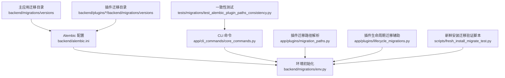
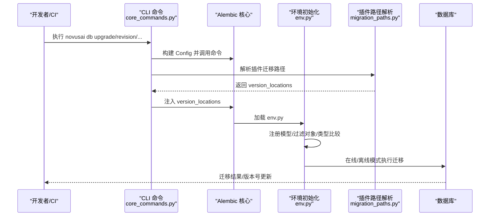
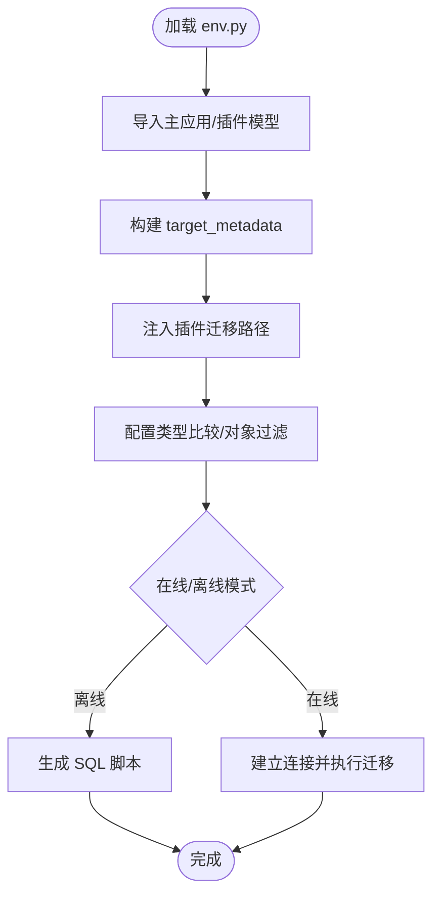
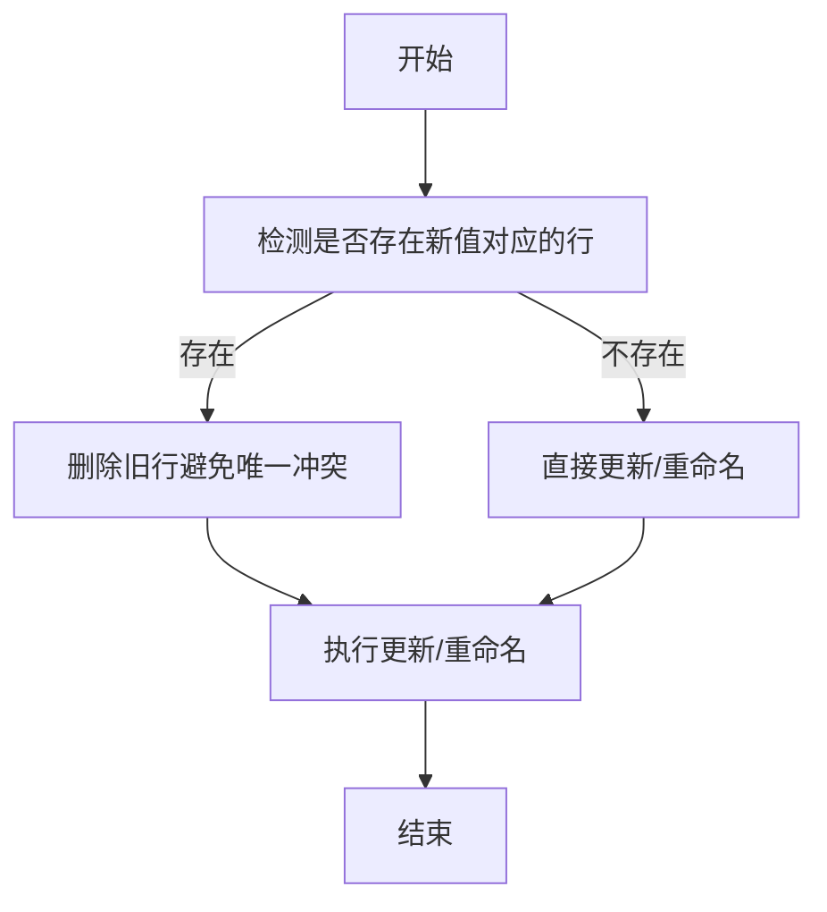
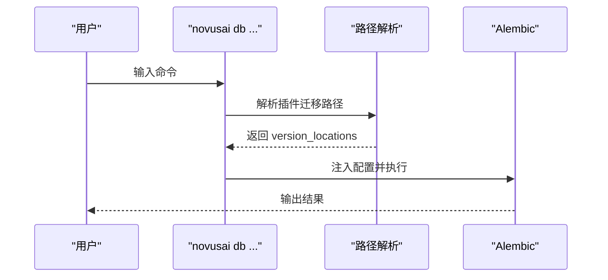
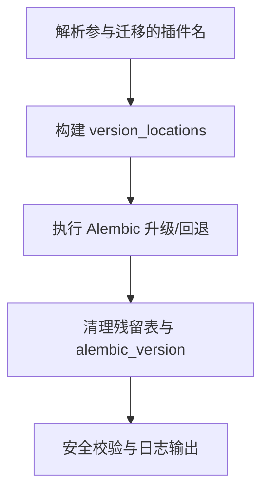
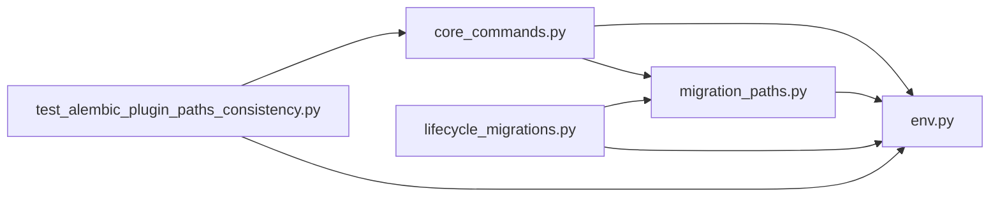

# 数据库迁移

<cite>
**本文引用的文件**   
- [backend/migrations/env.py](file://backend/migrations/env.py)
- [backend/migrations/script.py.mako](file://backend/migrations/script.py.mako)
- [backend/migrations/helpers.py](file://backend/migrations/helpers.py)
- [backend/alembic.ini](file://backend/alembic.ini)
- [backend/app/cli_commands/core_commands.py](file://backend/app/cli_commands/core_commands.py)
- [backend/app/plugins/migration_paths.py](file://backend/app/plugins/migration_paths.py)
- [backend/app/plugins/lifecycle_migrations.py](file://backend/app/plugins/lifecycle_migrations.py)
- [backend/tests/migrations/test_alembic_plugin_paths_consistency.py](file://backend/tests/migrations/test_alembic_plugin_paths_consistency.py)
- [backend/scripts/fresh_install_migrate_test.py](file://backend/scripts/fresh_install_migrate_test.py)
</cite>

## 目录
1. [引言](#引言)
2. [项目结构](#项目结构)
3. [核心组件](#核心组件)
4. [架构总览](#架构总览)
5. [详细组件分析](#详细组件分析)
6. [依赖分析](#依赖分析)
7. [性能考虑](#性能考虑)
8. [故障排查指南](#故障排查指南)
9. [结论](#结论)
10. [附录](#附录)

## 引言
本文件面向数据库迁移与版本管理，系统化阐述本项目的 Alembic 迁移框架使用方式、迁移脚本编写规范、执行流程与回滚机制，并结合项目中的插件化迁移路径解析与 CLI 集成，提供增量迁移、批量迁移与零停机迁移的实施方案建议。同时，文档覆盖数据完整性保护、并发控制、错误处理策略，以及迁移测试、数据验证与性能优化建议，并总结生产环境迁移最佳实践与应急处理程序。

## 项目结构
本项目采用集中式 Alembic 迁移目录与插件化迁移路径相结合的组织方式：
- 主应用迁移位于 backend/migrations/versions
- 插件迁移位于各插件 backend/plugins/<插件>/backend/migrations/versions
- Alembic 配置与环境初始化位于 backend/migrations/env.py 与 backend/alembic.ini
- CLI 提供数据库迁移子命令，封装 Alembic 调用与插件路径注入
- 插件侧提供迁移路径解析与生命周期迁移辅助工具
- 测试与脚本用于一致性校验与新鲜安装迁移验证

**图表来源**
- [backend/migrations/env.py:1-191](file://backend/migrations/env.py#L1-L191)
- [backend/alembic.ini:1-76](file://backend/alembic.ini#L1-L76)
- [backend/app/cli_commands/core_commands.py:244-358](file://backend/app/cli_commands/core_commands.py#L244-L358)
- [backend/app/plugins/migration_paths.py:210-242](file://backend/app/plugins/migration_paths.py#L210-L242)
- [backend/app/plugins/lifecycle_migrations.py:94-150](file://backend/app/plugins/lifecycle_migrations.py#L94-L150)
- [backend/tests/migrations/test_alembic_plugin_paths_consistency.py:1-32](file://backend/tests/migrations/test_alembic_plugin_paths_consistency.py#L1-L32)
- [backend/scripts/fresh_install_migrate_test.py:1-269](file://backend/scripts/fresh_install_migrate_test.py#L1-L269)

**章节来源**
- [backend/migrations/env.py:1-191](file://backend/migrations/env.py#L1-L191)
- [backend/alembic.ini:1-76](file://backend/alembic.ini#L1-L76)
- [backend/app/cli_commands/core_commands.py:244-358](file://backend/app/cli_commands/core_commands.py#L244-L358)
- [backend/app/plugins/migration_paths.py:210-242](file://backend/app/plugins/migration_paths.py#L210-L242)
- [backend/app/plugins/lifecycle_migrations.py:94-150](file://backend/app/plugins/lifecycle_migrations.py#L94-L150)
- [backend/tests/migrations/test_alembic_plugin_paths_consistency.py:1-32](file://backend/tests/migrations/test_alembic_plugin_paths_consistency.py#L1-L32)
- [backend/scripts/fresh_install_migrate_test.py:1-269](file://backend/scripts/fresh_install_migrate_test.py#L1-L269)

## 核心组件
- Alembic 环境初始化与元数据注册
  - 动态导入模型与插件模型，构建 target_metadata，确保 autogenerate 仅针对已注册表生成差异
  - 注入插件迁移路径，支持多分支版本解析
  - 自定义类型比较与对象过滤，减少无关变更噪音
- 迁移模板与脚手架
  - 使用 Mako 模板生成标准迁移脚本骨架，明确 up/down 分支
- 迁移辅助工具
  - 提供幂等操作（如安全重命名权限资源、唯一约束列值重命名），降低回滚与冲突风险
- CLI 迁移命令
  - 封装 upgrade、revision、current、heads、history、stamp、merge、autogenerate 等常用命令
  - 支持动态注入插件迁移路径，确保多分支解析正确
- 插件迁移路径解析与生命周期迁移
  - 从数据库与已盖章版本解析参与迁移的插件集合，构建 version_locations
  - 提供插件级 Alembic 升降级与数据库清理（含安全表前缀判定与 alembic_version 清理）

**章节来源**
- [backend/migrations/env.py:26-82](file://backend/migrations/env.py#L26-L82)
- [backend/migrations/script.py.mako:1-29](file://backend/migrations/script.py.mako#L1-L29)
- [backend/migrations/helpers.py:1-157](file://backend/migrations/helpers.py#L1-L157)
- [backend/app/cli_commands/core_commands.py:262-358](file://backend/app/cli_commands/core_commands.py#L262-L358)
- [backend/app/plugins/migration_paths.py:47-207](file://backend/app/plugins/migration_paths.py#L47-L207)
- [backend/app/plugins/lifecycle_migrations.py:94-247](file://backend/app/plugins/lifecycle_migrations.py#L94-L247)

## 架构总览
下图展示迁移执行的关键路径：CLI 命令 → Alembic 配置 → env.py 初始化 → 插件路径解析 → 迁移执行与回滚。

**图表来源**
- [backend/app/cli_commands/core_commands.py:257-358](file://backend/app/cli_commands/core_commands.py#L257-L358)
- [backend/app/plugins/migration_paths.py:210-242](file://backend/app/plugins/migration_paths.py#L210-L242)
- [backend/migrations/env.py:138-191](file://backend/migrations/env.py#L138-L191)

## 详细组件分析

### 组件一：Alembic 环境初始化与元数据注册
- 动态导入主应用与插件模型，统一注册到 Base.metadata，确保 autogenerate 仅对已注册表生成差异
- 注入插件迁移路径，支持多分支版本解析
- 自定义 rewriter 与比较钩子，过滤冗余变更（如仅注释变更、单列 id 索引），提升迁移质量
- 支持在线/离线两种执行模式，离线仅生成 SQL，不连接数据库

**图表来源**
- [backend/migrations/env.py:26-82](file://backend/migrations/env.py#L26-L82)
- [backend/migrations/env.py:138-191](file://backend/migrations/env.py#L138-L191)

**章节来源**
- [backend/migrations/env.py:26-82](file://backend/migrations/env.py#L26-L82)
- [backend/migrations/env.py:138-191](file://backend/migrations/env.py#L138-L191)

### 组件二：迁移脚手架与模板
- 使用 Mako 模板生成标准迁移脚本骨架，明确 revision、up/down、depends_on 等字段
- 便于团队遵循统一格式，减少手写错误

**章节来源**
- [backend/migrations/script.py.mako:1-29](file://backend/migrations/script.py.mako#L1-L29)

### 组件三：迁移辅助工具（幂等操作）
- 安全重命名权限资源：在新旧资源冲突时，先删除旧行再重命名，避免唯一约束冲突
- 安全重命名唯一约束列值：在目标值已存在时，先删除旧行再更新，确保唯一性不变

**图表来源**
- [backend/migrations/helpers.py:18-84](file://backend/migrations/helpers.py#L18-L84)
- [backend/migrations/helpers.py:87-157](file://backend/migrations/helpers.py#L87-L157)

**章节来源**
- [backend/migrations/helpers.py:1-157](file://backend/migrations/helpers.py#L1-L157)

### 组件四：CLI 迁移命令与插件路径注入
- 提供 upgrade、revision、current、heads、history、stamp、merge、autogenerate 等命令
- 通过 runtime_helpers/discovery 获取插件迁移路径，动态注入 version_locations，确保多分支解析正确
- 与测试用例保持一致，保证 CLI 与 env.py 的路径策略一致

**图表来源**
- [backend/app/cli_commands/core_commands.py:257-358](file://backend/app/cli_commands/core_commands.py#L257-L358)
- [backend/app/plugins/migration_paths.py:210-242](file://backend/app/plugins/migration_paths.py#L210-L242)
- [backend/tests/migrations/test_alembic_plugin_paths_consistency.py:27-32](file://backend/tests/migrations/test_alembic_plugin_paths_consistency.py#L27-L32)

**章节来源**
- [backend/app/cli_commands/core_commands.py:244-358](file://backend/app/cli_commands/core_commands.py#L244-L358)
- [backend/app/plugins/migration_paths.py:210-242](file://backend/app/plugins/migration_paths.py#L210-L242)
- [backend/tests/migrations/test_alembic_plugin_paths_consistency.py:1-32](file://backend/tests/migrations/test_alembic_plugin_paths_consistency.py#L1-L32)

### 组件五：插件迁移路径解析与生命周期迁移
- 从数据库插件表与已盖章版本解析参与迁移的插件集合，构建 version_locations
- 提供插件级 Alembic 升降级与数据库清理（含安全表前缀判定与 alembic_version 清理）
- 通过子进程隔离 Alembic 调用，避免事件循环干扰

**图表来源**
- [backend/app/plugins/migration_paths.py:47-207](file://backend/app/plugins/migration_paths.py#L47-L207)
- [backend/app/plugins/lifecycle_migrations.py:94-247](file://backend/app/plugins/lifecycle_migrations.py#L94-L247)

**章节来源**
- [backend/app/plugins/migration_paths.py:47-207](file://backend/app/plugins/migration_paths.py#L47-L207)
- [backend/app/plugins/lifecycle_migrations.py:94-247](file://backend/app/plugins/lifecycle_migrations.py#L94-L247)

## 依赖分析
- CLI 与插件路径解析耦合度低，通过函数调用解耦，便于独立测试与演进
- env.py 依赖插件模型注册与路径解析，确保迁移图完整
- 生命周期迁移辅助通过子进程调用 Alembic，避免与主事件循环耦合
- 测试用例确保 CLI 与 env.py 的插件路径策略一致

**图表来源**
- [backend/app/cli_commands/core_commands.py:244-358](file://backend/app/cli_commands/core_commands.py#L244-L358)
- [backend/app/plugins/migration_paths.py:210-242](file://backend/app/plugins/migration_paths.py#L210-L242)
- [backend/migrations/env.py:26-82](file://backend/migrations/env.py#L26-L82)
- [backend/app/plugins/lifecycle_migrations.py:94-150](file://backend/app/plugins/lifecycle_migrations.py#L94-L150)
- [backend/tests/migrations/test_alembic_plugin_paths_consistency.py:27-32](file://backend/tests/migrations/test_alembic_plugin_paths_consistency.py#L27-L32)

**章节来源**
- [backend/app/cli_commands/core_commands.py:244-358](file://backend/app/cli_commands/core_commands.py#L244-L358)
- [backend/app/plugins/migration_paths.py:210-242](file://backend/app/plugins/migration_paths.py#L210-L242)
- [backend/migrations/env.py:26-82](file://backend/migrations/env.py#L26-L82)
- [backend/app/plugins/lifecycle_migrations.py:94-150](file://backend/app/plugins/lifecycle_migrations.py#L94-L150)
- [backend/tests/migrations/test_alembic_plugin_paths_consistency.py:1-32](file://backend/tests/migrations/test_alembic_plugin_paths_consistency.py#L1-L32)

## 性能考虑
- 迁移脚本生成与执行
  - 使用模板统一格式，减少手写错误与重复工作量
  - 通过自定义 rewriter 过滤冗余变更，缩短迁移时间
- 字节码缓存清理
  - 在非调试启动路径清理迁移目录字节码，避免旧元数据影响
- 连接与事务
  - 在线模式使用 NullPool，避免连接池竞争；事务包裹迁移，失败可回滚
- 插件迁移隔离
  - 子进程执行 Alembic，避免与主事件循环耦合，降低启动与迁移时的资源争用

**章节来源**
- [backend/migrations/env.py:166-183](file://backend/migrations/env.py#L166-L183)
- [backend/app/plugins/migration_paths.py:245-297](file://backend/app/plugins/migration_paths.py#L245-L297)

## 故障排查指南
- 插件迁移路径不一致
  - 确认 CLI 与 env.py 的插件路径策略一致，可通过测试用例验证
- 无法定位版本
  - 确保所有已安装插件的迁移路径均注入 version_locations
- 迁移失败
  - 使用离线模式生成 SQL，人工审阅后再在线执行
  - 检查唯一约束冲突，必要时使用迁移辅助工具进行幂等操作
- 新鲜安装验证
  - 使用脚本对空库执行 upgrade heads，并进行抽样断言，确保 schema 正确

**章节来源**
- [backend/tests/migrations/test_alembic_plugin_paths_consistency.py:1-32](file://backend/tests/migrations/test_alembic_plugin_paths_consistency.py#L1-L32)
- [backend/scripts/fresh_install_migrate_test.py:186-269](file://backend/scripts/fresh_install_migrate_test.py#L186-L269)
- [backend/migrations/helpers.py:18-84](file://backend/migrations/helpers.py#L18-L84)

## 结论
本项目以 Alembic 为核心，结合插件化迁移路径解析与 CLI 集成，实现了可维护、可扩展且可测试的数据库迁移体系。通过模板化脚手架、幂等辅助工具、严格的路径一致性与测试保障，能够支撑增量、批量与近零停机迁移场景，并在生产环境提供可靠的回滚与清理能力。

## 附录

### 迁移脚本标准格式与依赖关系
- 标准格式
  - 使用 Mako 模板生成，包含 revision、up/down、depends_on 等字段
- 依赖关系
  - 通过 depends_on 明确上下游依赖，避免执行顺序错误
- 执行顺序
  - 由 Alembic 基于版本链与 depends_on 决定，确保拓扑有序

**章节来源**
- [backend/migrations/script.py.mako:1-29](file://backend/migrations/script.py.mako#L1-L29)

### 增量迁移、批量迁移与零停机迁移实施方案
- 增量迁移
  - 以小步快跑的方式持续演进，每次变更聚焦单一职责
  - 使用自定义 rewriter 过滤无关变更，减少迁移体积
- 批量迁移
  - 将多个小变更合并为批量脚本，注意拆分依赖与回滚点
- 零停机迁移
  - 采用列改名/添加-数据回填-索引重建-切换的策略，配合迁移辅助工具降低冲突
  - 使用离线模式预生成 SQL，人工审阅后再在线执行

**章节来源**
- [backend/migrations/env.py:93-136](file://backend/migrations/env.py#L93-L136)
- [backend/migrations/helpers.py:18-84](file://backend/migrations/helpers.py#L18-L84)

### 数据完整性保护、并发控制与错误处理
- 数据完整性
  - 使用迁移辅助工具进行幂等操作，避免唯一约束冲突
  - 在线模式下使用事务包裹迁移，失败回滚
- 并发控制
  - 在线迁移期间避免其他进程并发写入关键表；必要时使用只读备份或短暂停机窗口
- 错误处理
  - CLI 命令捕获返回码并输出详细日志；插件生命周期迁移通过子进程隔离与超时控制

**章节来源**
- [backend/migrations/helpers.py:18-84](file://backend/migrations/helpers.py#L18-L84)
- [backend/app/cli_commands/core_commands.py:262-358](file://backend/app/cli_commands/core_commands.py#L262-L358)
- [backend/app/plugins/lifecycle_migrations.py:117-149](file://backend/app/plugins/lifecycle_migrations.py#L117-L149)

### 迁移测试策略、数据验证与性能优化建议
- 测试策略
  - 使用测试用例验证 CLI 与 env.py 的路径一致性
  - 使用新鲜安装脚本对空库执行迁移并进行抽样断言
- 数据验证
  - 检查已退役表/列是否清理干净，确认 owner_tenant_id 等关键字段存在
- 性能优化
  - 清理迁移字节码缓存，避免旧元数据影响
  - 合理拆分大迁移，减少锁持有时间

**章节来源**
- [backend/tests/migrations/test_alembic_plugin_paths_consistency.py:1-32](file://backend/tests/migrations/test_alembic_plugin_paths_consistency.py#L1-L32)
- [backend/scripts/fresh_install_migrate_test.py:58-183](file://backend/scripts/fresh_install_migrate_test.py#L58-L183)
- [backend/app/plugins/migration_paths.py:245-297](file://backend/app/plugins/migration_paths.py#L245-L297)

### 生产环境迁移最佳实践与应急处理程序
- 最佳实践
  - 严格遵循模板化脚手架与依赖声明；离线生成 SQL 审阅后再上线
  - 在低峰时段执行，准备回滚脚本与数据备份
- 应急处理
  - 若迁移失败，立即回滚至上一稳定版本；检查唯一约束与索引重建
  - 如需清理残留，使用插件生命周期迁移辅助工具进行安全清理

**章节来源**
- [backend/app/plugins/lifecycle_migrations.py:248-400](file://backend/app/plugins/lifecycle_migrations.py#L248-L400)
- [backend/app/cli_commands/core_commands.py:262-358](file://backend/app/cli_commands/core_commands.py#L262-L358)