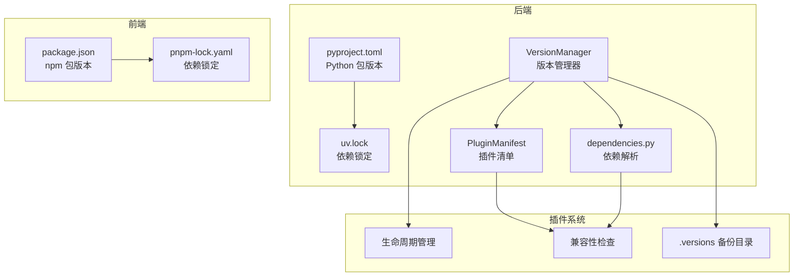
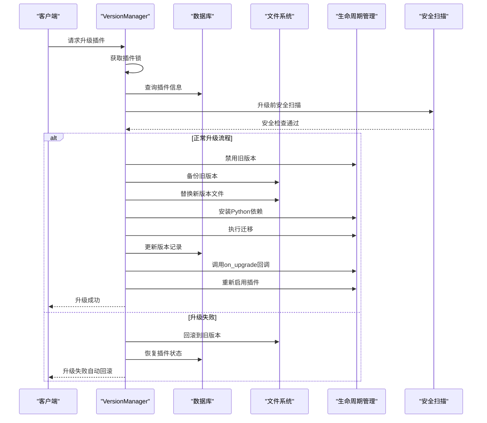
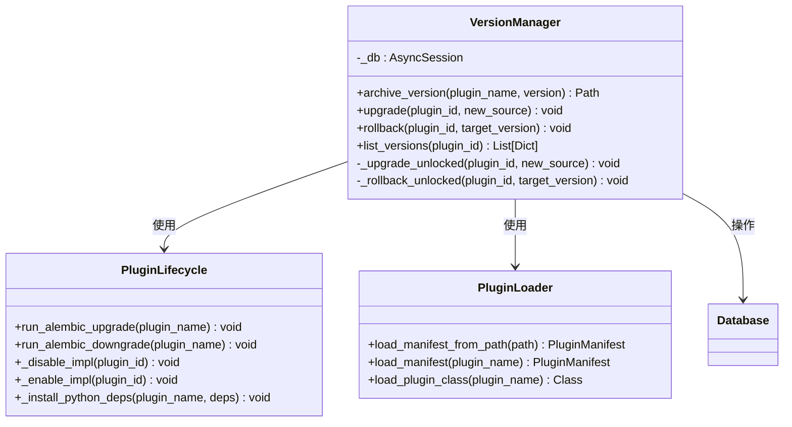
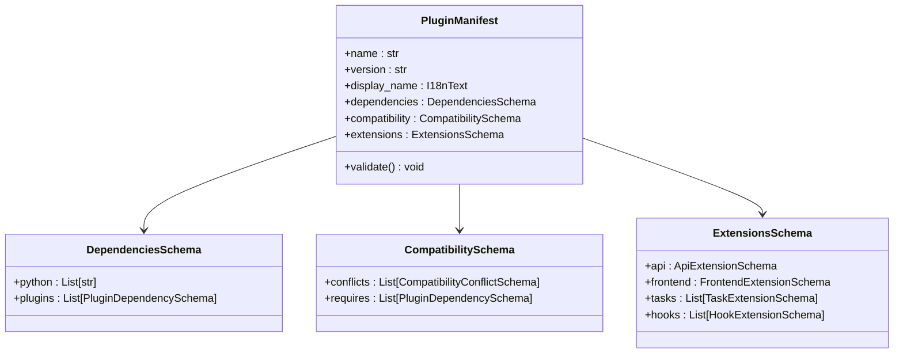
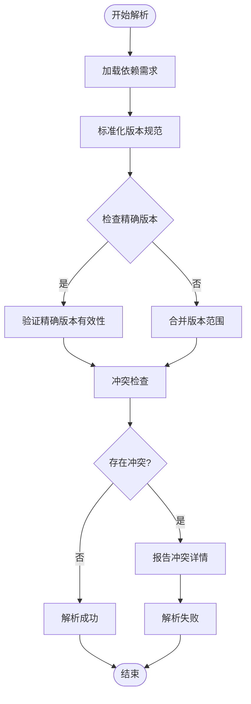

# 版本管理

<cite>
**本文档引用的文件**
- [backend/pyproject.toml](file://backend/pyproject.toml)
- [backend/uv.lock](file://backend/uv.lock)
- [backend/app/plugins/version_manager.py](file://backend/app/plugins/version_manager.py)
- [backend/app/plugins/manifest.py](file://backend/app/plugins/manifest.py)
- [backend/app/plugins/dependencies.py](file://backend/app/plugins/dependencies.py)
- [backend/app/plugins/lifecycle_runtime_state.py](file://backend/app/plugins/lifecycle_runtime_state.py)
- [backend/app/plugins/lifecycle_orchestrator.py](file://backend/app/plugins/lifecycle_orchestrator.py)
- [backend/tests/test_plugin_version_manager_locking.py](file://backend/tests/test_plugin_version_manager_locking.py)
- [frontend/package.json](file://frontend/package.json)
- [frontend/pnpm-lock.yaml](file://frontend/pnpm-lock.yaml)
</cite>

## 目录
1. [引言](#引言)
2. [项目结构](#项目结构)
3. [核心组件](#核心组件)
4. [架构概览](#架构概览)
5. [详细组件分析](#详细组件分析)
6. [依赖分析](#依赖分析)
7. [性能考虑](#性能考虑)
8. [故障排除指南](#故障排除指南)
9. [结论](#结论)
10. [附录](#附录)

## 引言

本文件为 NovusAI SaaS 平台的版本管理综合技术文档。该系统采用统一的版本管理策略，涵盖后端 Python 包版本、前端 npm 包版本以及插件版本的统一管理机制。文档详细阐述了语义化版本控制、版本兼容性管理、版本升级流程、向后兼容性保证、破坏性变更处理、版本锁定、依赖解析与冲突解决策略，以及版本发布周期、预发布版本与稳定版本的管理方法。

## 项目结构

该仓库采用前后端分离的 monorepo 结构，版本管理涉及三个层面：

- 后端 Python 包版本管理：通过 pyproject.toml 和 uv.lock 统一管理后端依赖版本
- 前端 npm 包版本管理：通过 package.json 和 pnpm-lock.yaml 管理前端依赖版本
- 插件版本管理：通过插件清单（plugin.yaml）和版本管理器实现插件的版本控制、升级、回滚和历史查询

**图表来源**
- [backend/pyproject.toml:1-239](file://backend/pyproject.toml#L1-L239)
- [backend/uv.lock:1-602](file://backend/uv.lock#L1-L602)
- [backend/app/plugins/version_manager.py:1-394](file://backend/app/plugins/version_manager.py#L1-L394)
- [frontend/package.json:1-127](file://frontend/package.json#L1-L127)
- [frontend/pnpm-lock.yaml:1-800](file://frontend/pnpm-lock.yaml#L1-L800)

**章节来源**
- [backend/pyproject.toml:1-239](file://backend/pyproject.toml#L1-L239)
- [backend/uv.lock:1-602](file://backend/uv.lock#L1-L602)
- [frontend/package.json:1-127](file://frontend/package.json#L1-L127)
- [frontend/pnpm-lock.yaml:1-800](file://frontend/pnpm-lock.yaml#L1-L800)

## 核心组件

### 版本管理器（VersionManager）

VersionManager 是插件版本管理的核心组件，提供以下核心功能：

- **版本备份**：将当前插件版本备份到 `.versions` 目录
- **版本升级**：完整的升级流程，包括禁用旧版本、备份、替换文件、迁移、更新记录、调用升级回调、重新启用
- **版本回滚**：支持回滚到指定版本，包含降级迁移、恢复目标版本、更新数据库记录
- **版本历史查询**：查询插件版本历史记录

### 插件清单（PluginManifest）

插件清单定义了插件的元数据和配置规范，包括：

- 基本信息：名称、版本、显示名称
- 依赖关系：Python 依赖、插件依赖
- 兼容性：与其他插件的兼容性声明
- 扩展点：API、前端界面、任务等扩展点定义

### 依赖解析系统

系统实现了多层次的依赖解析机制：

- **Python 依赖解析**：基于 setuptools 的版本解析和冲突检测
- **插件依赖解析**：验证插件间的版本兼容性和依赖关系
- **冲突检测**：识别和报告依赖冲突

**章节来源**
- [backend/app/plugins/version_manager.py:30-394](file://backend/app/plugins/version_manager.py#L30-L394)
- [backend/app/plugins/manifest.py:1-800](file://backend/app/plugins/manifest.py#L1-L800)
- [backend/app/plugins/dependencies.py:37-466](file://backend/app/plugins/dependencies.py#L37-L466)

## 架构概览

系统采用分层架构设计，确保版本管理的可靠性和一致性：

**图表来源**
- [backend/app/plugins/version_manager.py:58-240](file://backend/app/plugins/version_manager.py#L58-L240)
- [backend/tests/test_plugin_version_manager_locking.py:18-42](file://backend/tests/test_plugin_version_manager_locking.py#L18-L42)

## 详细组件分析

### 版本管理器实现

VersionManager 采用事务性设计，确保升级过程的原子性和一致性：

**图表来源**
- [backend/app/plugins/version_manager.py:30-394](file://backend/app/plugins/version_manager.py#L30-L394)

#### 升级流程详解

升级流程遵循严格的顺序和安全保障：

1. **锁机制**：使用插件锁防止并发升级冲突
2. **预检查**：验证新版本与现有插件匹配、执行安全扫描
3. **禁用旧版本**：确保升级期间系统稳定性
4. **备份**：创建旧版本的完整备份
5. **文件替换**：安全地替换插件文件
6. **依赖安装**：安装新的 Python 依赖
7. **数据库迁移**：执行 Alembic 迁移
8. **记录更新**：更新版本历史和状态
9. **回调执行**：调用插件的升级回调函数
10. **重新启用**：恢复插件服务

#### 回滚机制

回滚机制提供完整的故障恢复能力：

- **降级迁移**：先执行数据库降级迁移
- **文件恢复**：从备份目录恢复目标版本
- **状态恢复**：更新数据库中的版本状态
- **自动重试**：在迁移失败时自动恢复

**章节来源**
- [backend/app/plugins/version_manager.py:58-240](file://backend/app/plugins/version_manager.py#L58-L240)
- [backend/tests/test_plugin_version_manager_locking.py:150-212](file://backend/tests/test_plugin_version_manager_locking.py#L150-L212)

### 插件清单系统

插件清单系统提供了强大的元数据管理和验证机制：

**图表来源**
- [backend/app/plugins/manifest.py:780-938](file://backend/app/plugins/manifest.py#L780-L938)

#### 兼容性管理

系统实现了多层次的兼容性检查：

- **插件间兼容性**：检查与其他插件的兼容性声明
- **版本范围解析**：支持复杂的版本范围和约束条件
- **冲突检测**：识别潜在的版本冲突和依赖冲突

**章节来源**
- [backend/app/plugins/manifest.py:1-800](file://backend/app/plugins/manifest.py#L1-L800)
- [backend/app/plugins/lifecycle_runtime_state.py:181-206](file://backend/app/plugins/lifecycle_runtime_state.py#L181-L206)
- [backend/app/plugins/lifecycle_orchestrator.py:171-204](file://backend/app/plugins/lifecycle_orchestrator.py#L171-L204)

### 依赖解析与冲突解决

系统实现了智能的依赖解析和冲突解决机制：

**图表来源**
- [backend/app/plugins/dependencies.py:37-466](file://backend/app/plugins/dependencies.py#L37-L466)

**章节来源**
- [backend/app/plugins/dependencies.py:37-466](file://backend/app/plugins/dependencies.py#L37-L466)

## 依赖分析

### 后端依赖管理

后端使用 uv 作为包管理工具，通过 uv.lock 文件锁定所有依赖版本：

- **核心框架**：FastAPI 0.109.0+、SQLAlchemy 2.0.25+
- **数据库**：PostgreSQL 驱动、Alembic 迁移工具
- **异步处理**：Celery 5.3.6+、Redis 支持
- **AI 集成**：OpenAI SDK、向量数据库支持

### 前端依赖管理

前端使用 pnpm 作为包管理工具，通过 pnpm-lock.yaml 锁定依赖：

- **Vue 生态**：Vue 3.5.27+、Vue Router 4.6.4+
- **UI 框架**：Ant Design Vue 4.2.6+
- **构建工具**：Vite 7.3.3+、TypeScript 5.9.3+
- **开发工具**：ESLint、Prettier、Playwright

### 插件依赖管理

插件系统支持独立的依赖管理：

- **Python 依赖**：每个插件可声明自己的 Python 依赖
- **前端资源**：插件可包含前端构建产物
- **版本约束**：支持复杂的版本范围和兼容性声明

**章节来源**
- [backend/uv.lock:1-602](file://backend/uv.lock#L1-L602)
- [frontend/pnpm-lock.yaml:1-800](file://frontend/pnpm-lock.yaml#L1-L800)

## 性能考虑

### 版本升级性能优化

- **并发控制**：使用插件锁避免并发升级导致的文件竞争
- **增量备份**：仅备份必要的文件，减少磁盘 I/O
- **异步操作**：数据库操作和文件系统操作采用异步模式
- **缓存机制**：模块缓存清理确保新版本代码正确加载

### 依赖解析性能

- **早期失败**：在解析阶段尽早发现和报告错误
- **缓存策略**：重复的依赖检查结果进行缓存
- **并行处理**：支持并行解析多个依赖项

## 故障排除指南

### 常见问题及解决方案

#### 升级失败回滚

当升级过程中发生错误时，系统会自动执行回滚操作：

1. **检查日志**：查看详细的错误信息和堆栈跟踪
2. **验证备份**：确认旧版本备份是否存在
3. **手动干预**：必要时手动恢复到备份版本
4. **重新尝试**：修复问题后重新执行升级

#### 依赖冲突

当检测到依赖冲突时：

1. **识别冲突源**：查看冲突报告中的具体包名和版本
2. **调整版本**：修改插件或系统的版本要求
3. **重新解析**：执行依赖解析以验证修复效果

#### 兼容性问题

插件间兼容性问题的处理：

1. **检查兼容性声明**：验证插件的兼容性配置
2. **禁用冲突插件**：暂时禁用导致冲突的插件
3. **等待更新**：等待相关插件的兼容性更新

**章节来源**
- [backend/tests/test_plugin_version_manager_locking.py:150-212](file://backend/tests/test_plugin_version_manager_locking.py#L150-L212)

## 结论

本版本管理系统通过统一的架构设计，实现了后端 Python 包、前端 npm 包和插件版本的全面管理。系统采用严格的版本控制策略，确保升级过程的安全性和可靠性。通过多层次的兼容性检查、智能的依赖解析和完善的回滚机制，系统能够在复杂环境中保持稳定的版本演进。

关键优势包括：
- **原子性升级**：确保升级操作的完整性和一致性
- **智能回滚**：提供自动化的故障恢复能力
- **兼容性保障**：通过多层次检查确保系统稳定性
- **性能优化**：采用异步处理和缓存机制提升性能

## 附录

### 版本发布流程

1. **开发阶段**：在本地进行功能开发和测试
2. **预发布**：标记预发布版本（alpha/beta/rc）
3. **稳定发布**：通过充分测试后发布稳定版本
4. **热修复**：针对紧急问题发布热修复版本

### 多版本并存策略

- **渐进式升级**：支持不同插件的不同版本并存
- **向后兼容**：确保新版本不影响旧功能
- **客户端适配**：根据客户端能力选择合适的版本

### 最佳实践

- **定期备份**：定期备份重要版本和配置
- **测试验证**：在生产环境部署前进行充分测试
- **监控告警**：建立版本升级的监控和告警机制
- **文档记录**：详细记录每次版本变更的内容和影响